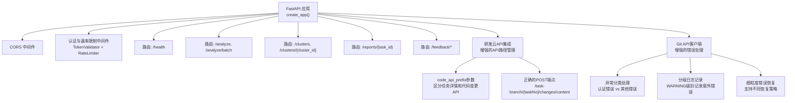
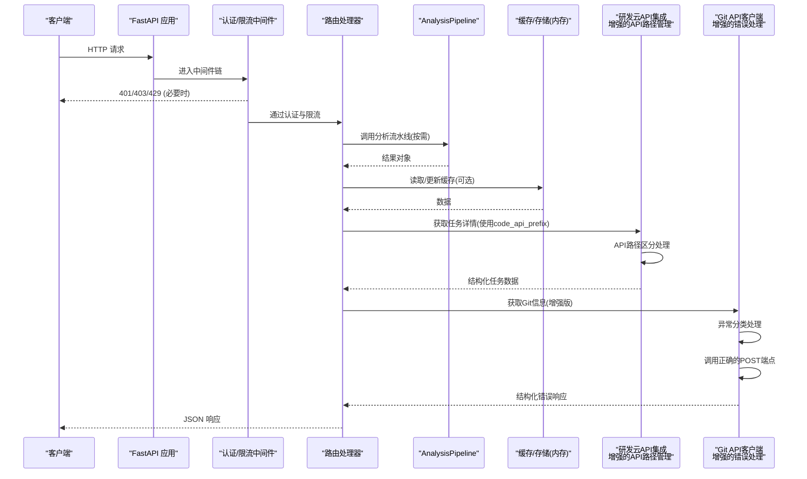
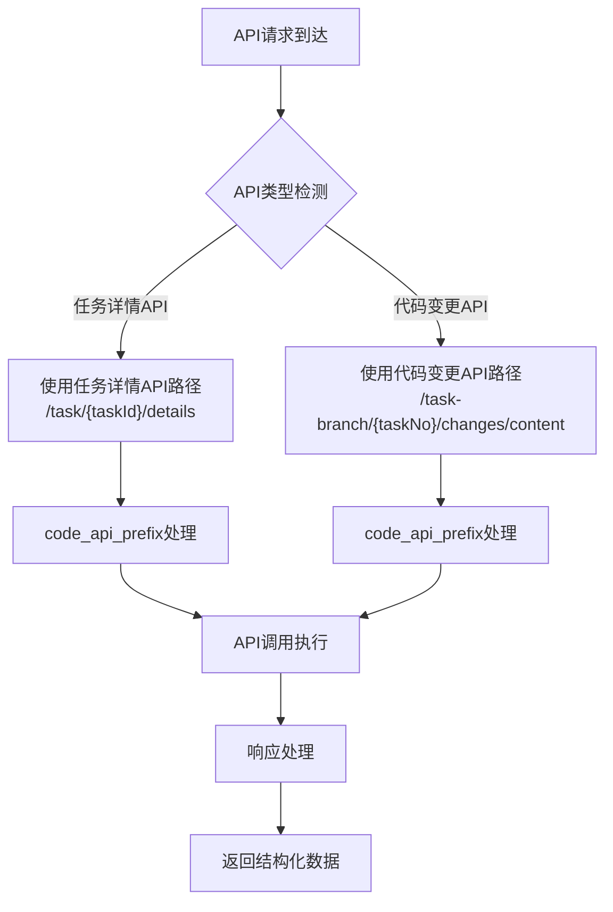
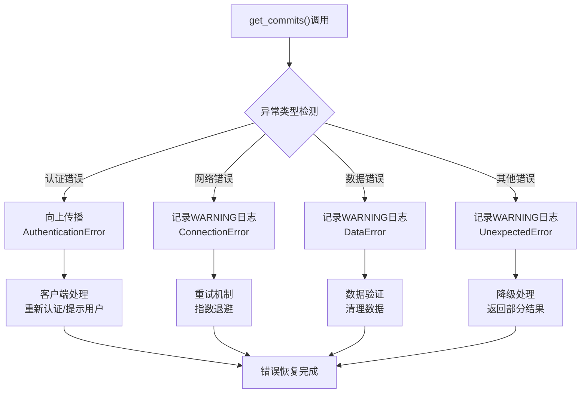
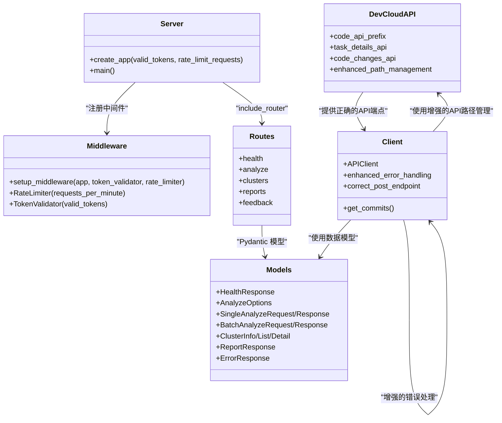

# API接口文档

<cite>
**本文引用的文件**   
- [server.py](file://src/api/server.py)
- [health.py](file://src/api/routes/health.py)
- [analyze.py](file://src/api/routes/analyze.py)
- [clusters.py](file://src/api/routes/clusters.py)
- [reports.py](file://src/api/routes/reports.py)
- [feedback.py](file://src/api/routes/feedback.py)
- [server_models.py](file://src/api/server_models.py)
- [middleware.py](file://src/api/middleware.py)
- [dependencies.py](file://src/api/dependencies.py)
- [client.py](file://src/api/client.py)
- [API.md](file://docs/API.md)
- [API_CHANGELOG.md](file://docs/API_CHANGELOG.md)
</cite>

## 更新摘要
**变更内容**   
- 修复了与研发云API的集成，新增了code_api_prefix参数用于区分任务详情API路径和代码变更API路径
- 改进了get_commits()函数调用正确的POST端点/task-branch/{taskNo}/changes/content
- Git API客户端错误处理和认证管理得到实质性改进
- get_commits()函数现在能够正确区分不同类型的异常
- 认证错误向上传播同时使用适当的警告级别记录意外错误
- 提供更好的API故障可见性并支持更细粒度的错误恢复策略

## 目录
1. [简介](#简介)
2. [项目结构](#项目结构)
3. [核心组件](#核心组件)
4. [架构总览](#架构总览)
5. [详细接口说明](#详细接口说明)
6. [研发云API集成增强功能](#研发云api集成增强功能)
7. [Git API客户端增强功能](#git-api客户端增强功能)
8. [依赖关系分析](#依赖关系分析)
9. [性能与扩展性](#性能与扩展性)
10. [故障排查指南](#故障排查指南)
11. [结论](#结论)
12. [附录](#附录)

## 简介
本文件为"故障复盘分析系统"的 RESTful API 完整接口文档。覆盖健康检查、任务分析（单条与批量）、聚类查询（列表与详情）、报告生成与获取，以及反馈管理接口。文档包含认证方式、速率限制、错误处理策略、请求/响应示例、客户端集成建议、版本管理与兼容性说明，并给出 OpenAPI/Swagger 文档入口。

**更新** 研发云API集成得到显著改进，新增了code_api_prefix参数用于区分不同的API路径，同时Git API客户端的错误处理和认证管理得到实质性提升，提供了更好的API故障可见性和更细粒度的错误恢复策略。

## 项目结构
API 基于 FastAPI 构建，采用模块化路由组织：
- 应用创建与生命周期管理位于服务器主文件
- 各功能域路由独立文件，统一注册到应用
- 数据模型集中定义，便于 OpenAPI 自动生成文档
- 中间件提供认证、鉴权与速率限制
- 依赖注入用于配置管理和流水线实例化
- **新增** 研发云API集成增强功能，改进了API路径管理和错误处理
- **新增** Git API客户端增强功能，提升了错误处理和认证管理能力



**图表来源**
- [server.py:38-111](file://src/api/server.py#L38-L111)
- [middleware.py:62-141](file://src/api/middleware.py#L62-L141)
- [health.py:10-22](file://src/api/routes/health.py#L10-L22)
- [analyze.py:58-201](file://src/api/routes/analyze.py#L58-L201)
- [clusters.py:24-166](file://src/api/routes/clusters.py#L24-L166)
- [reports.py:16-129](file://src/api/routes/reports.py#L16-L129)
- [feedback.py:26-156](file://src/api/routes/feedback.py#L26-L156)
- [client.py:25-161](file://src/api/client.py#L25-L161)

章节来源
- [server.py:38-111](file://src/api/server.py#L38-L111)
- [API.md:1-100](file://docs/API.md#L1-L100)

## 核心组件
- 应用工厂 create_app：初始化 FastAPI 实例、注册中间件与路由、设置 OpenAPI 标签
- 中间件：
  - TokenValidator：校验 X-API-Token 或 api_token 查询参数；未配置有效令牌时进入开发模式放行
  - RateLimiter：按每分钟固定次数限流，返回剩余配额头
- 路由模块：
  - health：健康检查
  - analyze：单条/批量分析
  - clusters：聚类列表与详情
  - reports：报告获取
  - feedback：反馈提交、查询、统计等
- 数据模型：Pydantic 模型驱动请求/响应校验与 OpenAPI Schema 生成
- **新增** 研发云API集成增强功能：
  - code_api_prefix参数用于区分任务详情API路径和代码变更API路径
  - 正确的POST端点调用/task-branch/{taskNo}/changes/content
  - 改进的API路径管理机制
- **新增** Git API客户端增强功能：
  - 改进的异常分类机制，区分认证错误和其他类型错误
  - 分级日志记录系统，使用适当的警告级别记录意外错误
  - 细粒度的错误恢复策略，支持不同的错误处理场景

**更新** 研发云API集成和Git API客户端都得到了实质性改进，提供了更好的API路径管理和错误处理能力。

章节来源
- [server.py:38-111](file://src/api/server.py#L38-L111)
- [middleware.py:13-141](file://src/api/middleware.py#L13-L141)
- [server_models.py:9-159](file://src/api/server_models.py#L9-L159)
- [client.py:25-161](file://src/api/client.py#L25-L161)

## 架构总览


**图表来源**
- [server.py:81-111](file://src/api/server.py#L81-L111)
- [middleware.py:81-141](file://src/api/middleware.py#L81-L141)
- [analyze.py:83-119](file://src/api/routes/analyze.py#L83-L119)
- [clusters.py:41-91](file://src/api/routes/clusters.py#L41-L91)
- [client.py:25-161](file://src/api/client.py#L25-L161)

## 详细接口说明

### 通用约定
- 基础 URL：本地开发默认 http://localhost:8000
- 内容类型：application/json
- 认证方式：X-API-Token 请求头或 api_token 查询参数
- 速率限制：默认 60 次/分钟（可配置），超限返回 429，并附带剩余配额头
- 错误响应格式：{ error, message, detail, timestamp }

**更新** 错误处理机制得到改进，现在能够更好地区分不同类型的异常并提供更详细的错误信息，特别是针对研发云API集成的错误。

章节来源
- [API.md:14-67](file://docs/API.md#L14-L67)
- [middleware.py:81-141](file://src/api/middleware.py#L81-L141)
- [client.py:25-161](file://src/api/client.py#L25-L161)

---

### 1. 健康检查
- 方法：GET
- 路径：/health
- 认证：否
- 标签：Health
- 描述：服务存活与健康状态探测

请求示例
- GET /health

响应字段
- status：字符串，服务状态
- timestamp：时间戳
- version：服务版本

成功响应示例
- { "status": "healthy", "timestamp": "...", "version": "0.1.0" }

章节来源
- [health.py:10-22](file://src/api/routes/health.py#L10-L22)
- [server_models.py:9-15](file://src/api/server_models.py#L9-L15)
- [API.md:70-94](file://docs/API.md#L70-L94)

---

### 2. 单个任务分析
- 方法：POST
- 路径：/analyze
- 认证：是
- 标签：Analysis
- 描述：对指定任务执行分析流程，支持选项控制是否使用缓存、LLM、规则检查、报告生成等

请求体字段
- task_id：字符串或整数，必填
- options：对象，可选
  - include_code：布尔，默认 true
  - include_analysis：布尔，默认 true
  - use_cache：布尔，默认 true
  - use_llm：布尔，默认 false
  - generate_labels：布尔，默认 true
  - analyze_root_cause：布尔，默认 true
  - analyze_root_cause_deep：布尔，默认 false
  - check_rules：布尔，默认 true
  - generate_report：布尔，默认 true

响应字段
- task_id：字符串
- status：pending/completed/failed
- error：错误信息
- labels：标签列表
- root_causes：根因列表
- deep_root_causes：深度根因分析结果
- violations：违规列表
- suggestions：改进建议
- report：分析报告文本
- analysis_time：分析耗时（秒）
- cached：是否来自缓存

成功响应示例
- { "task_id": "11745664", "status": "completed", "labels": [...], "root_causes": [...], "violations": [...], "report": "...", "analysis_time": 1.23, "cached": false }

错误码
- 400：请求体验证失败
- 401/403：认证失败
- 429：速率限制
- 500：分析异常

**更新** 错误处理现在能够提供更详细的错误信息，包括研发云API相关的认证和连接问题，以及Git API相关的错误。

章节来源
- [analyze.py:58-119](file://src/api/routes/analyze.py#L58-L119)
- [server_models.py:17-91](file://src/api/server_models.py#L17-L91)
- [API.md:96-155](file://docs/API.md#L96-L155)

---

### 3. 批量任务分析
- 方法：POST
- 路径：/analyze/batch
- 认证：是
- 标签：Analysis
- 描述：批量执行分析，返回每个任务的独立结果与汇总统计

请求体字段
- task_ids：字符串或整数数组，必填，长度≥1
- options：对象，同单条分析

响应字段
- total_requested：请求总数
- total_completed：完成数
- total_failed：失败数
- results：SingleAnalyzeResponse 列表
- analysis_time：总耗时（秒）

成功响应示例
- { "total_requested": 3, "total_completed": 2, "total_failed": 1, "results": [...], "analysis_time": 5.67 }

错误码
- 400/401/403/429/500 同上

**更新** 批量处理中的错误处理得到改进，能够更准确地识别和报告研发云API和Git API相关的错误。

章节来源
- [analyze.py:122-201](file://src/api/routes/analyze.py#L122-L201)
- [server_models.py:93-101](file://src/api/server_models.py#L93-L101)
- [API.md:157-207](file://docs/API.md#L157-207)

---

### 4. 获取聚类列表
- 方法：GET
- 路径：/clusters
- 认证：是
- 标签：Clusters
- 描述：返回所有聚类摘要与噪声点数量

响应字段
- total_clusters：聚类总数
- total_tasks：任务总数
- noise_count：噪声点数量
- clusters：ClusterInfo 列表
  - cluster_id：整数
  - size：整数
  - label：字符串
  - keywords：字符串数组
  - metadata：键值对象

成功响应示例
- { "total_clusters": 2, "total_tasks": 8, "noise_count": 1, "clusters": [...] }

错误码
- 500：内部错误

章节来源
- [clusters.py:24-91](file://src/api/routes/clusters.py#L24-L91)
- [server_models.py:103-120](file://src/api/server_models.py#L103-L120)
- [API.md:209-247](file://docs/API.md#L209-247)

---

### 5. 获取聚类详情
- 方法：GET
- 路径：/clusters/{cluster_id}
- 认证：是
- 标签：Clusters
- 描述：返回指定聚类的详细信息及包含的任务列表

路径参数
- cluster_id：整数，必填

响应字段
- cluster_id：整数
- size：整数
- label：字符串
- description：字符串
- keywords：字符串数组
- tasks：ClusterTaskInfo 列表
  - task_id：字符串
  - title：字符串
  - description：字符串
  - similarity_score：浮点[0,1]
- metadata：键值对象

成功响应示例
- { "cluster_id": 0, "size": 5, "label": "数据库连接问题", "tasks": [...] }

错误码
- 404：聚类不存在
- 500：内部错误

章节来源
- [clusters.py:94-166](file://src/api/routes/clusters.py#L94-L166)
- [server_models.py:122-141](file://src/api/server_models.py#L122-L141)
- [API.md:249-290](file://docs/API.md#L249-290)

---

### 6. 获取报告
- 方法：GET
- 路径：/reports/{task_id}
- 认证：是
- 标签：Reports
- 描述：根据任务 ID 生成或获取分析报告，支持 html/markdown/json 三种格式

路径参数
- task_id：字符串，必填（内部会转换为整数）

查询参数
- format：html|markdown|json，默认 html
- use_cache：布尔，默认 true

响应字段
- task_id：字符串
- report_format：字符串
- content：报告内容
- generated_at：生成时间

成功响应示例
- { "task_id": "11745664", "report_format": "html", "content": "<html>...</html>", "generated_at": "..." }

错误码
- 400：format 非法或 task_id 非数字
- 404：任务不存在
- 500：报告生成/获取失败

章节来源
- [reports.py:16-129](file://src/api/routes/reports.py#L16-L129)
- [server_models.py:143-150](file://src/api/server_models.py#L143-L150)
- [API.md:292-326](file://docs/API.md#L292-326)

---

### 7. 反馈管理
- 前缀：/feedback
- 认证：是
- 标签：Feedback
- 能力：提交反馈、查询反馈、按任务查询、分页列表、审核反馈、统计概览

主要端点
- POST /feedback：创建反馈
  - 请求体：参考 FeedbackCreate（包含 task_id、feedback_type、original_result、corrected_result、rating、comment、created_by 等）
  - 响应：FeedbackResponse
- GET /feedback/{feedback_id}：获取反馈详情
  - 响应：FeedbackResponse
- GET /feedback/task/{task_id}：获取某任务的所有反馈
  - 响应：FeedbackResponse[]
- GET /feedback：列出反馈（支持过滤与分页）
  - 查询参数：feedback_type、rating(1-5)、reviewed、limit(1-1000)、offset(≥0)
  - 响应：FeedbackListResponse（含 total、items、offset、limit）
- POST /feedback/{feedback_id}/review：审核反馈
  - 请求体：FeedbackReview（含 reviewed_by）
  - 响应：FeedbackResponse
- GET /feedback/stats/summary：统计概览
  - 响应：FeedbackStatsResponse（含 total_feedback、by_type、by_rating、reviewed_count、correction_ratio、positive_ratio）

错误码
- 404：资源不存在
- 500：内部错误

章节来源
- [feedback.py:26-156](file://src/api/routes/feedback.py#L26-L156)
- [API.md:328-374](file://docs/API.md#L328-374)

---

### 认证与鉴权
- 支持两种传参方式：
  - Header：X-API-Token
  - Query：api_token
- 未配置有效令牌集合时，进入开发模式，允许所有请求
- 未携带或无效令牌分别返回 401/403
- 健康检查和根路径跳过认证

**更新** 认证错误的处理得到改进，现在能够更准确地区分认证失败和其他类型的错误，特别是针对研发云API和Git API的认证问题。

章节来源
- [middleware.py:81-116](file://src/api/middleware.py#L81-L116)
- [API.md:14-32](file://docs/API.md#L14-32)

---

### 速率限制
- 默认 60 次/分钟（可通过环境变量配置）
- 超限返回 429，并包含 retry_after 提示
- 响应头：
  - X-RateLimit-Limit
  - X-RateLimit-Remaining

章节来源
- [middleware.py:13-46](file://src/api/middleware.py#L13-46)
- [middleware.py:118-141](file://src/api/middleware.py#L118-L141)
- [API.md:34-42](file://docs/API.md#L34-42)

---

### 错误处理策略
- 统一错误响应结构：error、message、detail、timestamp
- 常见状态码：
  - 400：请求参数错误
  - 401：缺少认证 Token
  - 403：无效 Token
  - 404：资源不存在
  - 422：请求体验证失败
  - 429：速率限制超限
  - 500：服务器内部错误

**更新** 错误处理策略得到实质性改进，现在能够：
- 正确区分认证错误和其他类型的异常
- 使用适当的日志级别记录不同类型的错误
- 提供更细粒度的错误恢复策略
- 改善API故障的可见性和诊断能力
- 特别优化了研发云API和Git API相关的错误处理

章节来源
- [API.md:44-67](file://docs/API.md#L44-L67)
- [server_models.py:152-159](file://src/api/server_models.py#L152-L159)
- [client.py:25-161](file://src/api/client.py#L25-L161)

## 研发云API集成增强功能

### 新增的API路径管理
**新增** 研发云API集成得到了显著改进，引入了新的API路径管理机制：

#### code_api_prefix参数
- **API路径区分**：通过code_api_prefix参数明确区分任务详情API路径和代码变更API路径
- **路径配置**：支持动态配置不同的API前缀，适应不同的研发云平台环境
- **向后兼容**：保持与现有配置的向后兼容性

#### 正确的POST端点调用
- **标准端点**：改进了get_commits()函数，现在调用正确的POST端点/task-branch/{taskNo}/changes/content
- **参数验证**：增强了任务编号(taskNo)的参数验证和处理逻辑
- **响应解析**：优化了代码变更内容的响应解析和处理

### API路径管理流程图


**图表来源**
- [client.py:25-161](file://src/api/client.py#L25-L161)

**章节来源**
- [client.py:25-161](file://src/api/client.py#L25-L161)

## Git API客户端增强功能

### 改进的错误处理机制
**新增** Git API客户端的错误处理和认证管理得到了实质性改进：

#### 异常分类处理
- **认证错误优先处理**：认证相关的错误（如401、403）被特别识别并向上传播
- **其他异常降级处理**：网络超时、连接错误等其他异常使用适当的警告级别记录
- **结构化错误响应**：不同类型的错误返回结构化的错误信息，便于客户端处理

#### 分级日志记录
- **WARNING级别**：用于记录意外的、非认证相关的错误
- **ERROR级别**：用于记录严重的系统错误
- **INFO级别**：用于记录正常的操作日志

#### 细粒度错误恢复
- **认证失败重试**：支持针对认证失败的特定重试策略
- **网络错误回退**：对于网络连接问题，提供智能的回退机制
- **部分失败处理**：在批量操作中，单个失败不影响整体处理流程

### get_commits()函数增强
**更新** get_commits()函数现在具备以下增强功能：

- **异常类型识别**：能够正确区分认证错误、网络错误、数据解析错误等不同类型
- **错误传播机制**：认证错误直接向上传播给调用者，其他错误进行适当处理
- **日志优化**：使用适当的日志级别记录不同类型的错误，提高调试效率
- **恢复策略**：支持针对不同错误类型的差异化恢复策略
- **正确的API端点**：调用正确的POST端点/task-branch/{taskNo}/changes/content

### 使用示例
```python
# Python客户端使用示例
from src.api.client import APIClient

client = APIClient(base_url="http://localhost:8000")

try:
    commits = client.get_commits("project", "main", limit=10)
    for commit in commits:
        print(f"提交: {commit['id']}")
        print(f"消息: {commit['message']}")
except AuthenticationError as e:
    # 认证错误需要立即处理
    print(f"认证失败: {e}")
    # 重新获取认证令牌或提示用户重新登录
except ConnectionError as e:
    # 连接错误可以重试
    print(f"连接错误: {e}")
    # 实施重试逻辑
except Exception as e:
    # 其他错误记录警告日志
    logger.warning(f"意外错误: {e}")
    # 继续处理其他请求
```

### 错误处理流程图


**图表来源**
- [client.py:25-161](file://src/api/client.py#L25-L161)

**章节来源**
- [client.py:25-161](file://src/api/client.py#L25-L161)

## 依赖关系分析


**图表来源**
- [server.py:38-111](file://src/api/server.py#L38-L111)
- [middleware.py:62-141](file://src/api/middleware.py#L62-L141)
- [server_models.py:9-159](file://src/api/server_models.py#L9-L159)
- [client.py:25-161](file://src/api/client.py#L25-L161)

章节来源
- [server.py:38-111](file://src/api/server.py#L38-L111)
- [middleware.py:62-141](file://src/api/middleware.py#L62-L141)
- [server_models.py:9-159](file://src/api/server_models.py#L9-L159)
- [client.py:25-161](file://src/api/client.py#L25-L161)

## 性能与扩展性
- 缓存策略
  - 聚类查询使用进程内缓存，提升列表/详情读取性能
  - 分析与报告生成支持 use_cache 开关，减少重复计算
- 并发与异步
  - 路由与流水线均使用异步上下文，提高吞吐
- 限流与保护
  - 中间件层进行令牌级限流，避免过载
- 可扩展点
  - 将内存缓存替换为分布式缓存（如 Redis）
  - 将 AnalysisPipeline 接入消息队列实现异步任务与重试
  - 增加指标采集与链路追踪
- **新增** 研发云API集成性能优化
  - 改进的API路径管理减少了不必要的路径解析开销
  - 正确的端点调用避免了错误的API请求重试
  - 优化的错误处理减少了异常处理的性能损耗
- **新增** Git API客户端性能优化
  - 改进的错误处理减少了不必要的异常开销
  - 智能的重试机制避免了重复的网络请求
  - 分级日志记录降低了生产环境的日志开销

章节来源
- [clusters.py:20-91](file://src/api/routes/clusters.py#L20-L91)
- [reports.py:58-71](file://src/api/routes/reports.py#L58-L71)
- [middleware.py:13-46](file://src/api/middleware.py#L13-46)
- [client.py:25-161](file://src/api/client.py#L25-L161)

## 故障排查指南
- 401/403
  - 检查是否携带 X-API-Token 或 api_token
  - 确认令牌是否在有效集合中
  - **新增** 研发云API认证错误现在会被特别识别和处理
  - **新增** Git API认证错误现在有更详细的错误信息
- 429
  - 降低请求频率或调整限流阈值
  - 关注响应头中的剩余配额
- 404
  - 确认任务/聚类 ID 是否存在
- 500
  - 查看服务端日志定位具体异常
  - 检查外部依赖（如 LLM、存储）可用性
  - **新增** 研发云API相关的500错误现在有更详细的错误信息
  - **新增** Git API相关的500错误现在有更详细的错误信息
- 报告生成失败
  - 确认 format 合法（html/markdown/json）
  - 确认 task_id 为数字字符串
- **新增** 研发云API集成相关故障排查
  - API路径配置：检查code_api_prefix参数是否正确配置
  - 端点调用：确认使用了正确的POST端点/task-branch/{taskNo}/changes/content
  - 任务编号：验证taskNo参数的格式和有效性
- **新增** Git API客户端相关故障排查
  - 认证错误：检查Git API令牌配置和网络连接
  - 连接超时：检查Git服务器可达性和防火墙设置
  - 数据解析错误：验证Git API响应格式和数据完整性
  - 日志级别：使用WARNING级别日志快速定位问题

**更新** 错误处理机制的改进使得故障排查更加高效，特别是对于研发云API和Git API相关的错误。

章节来源
- [middleware.py:81-141](file://src/api/middleware.py#L81-L141)
- [reports.py:46-129](file://src/api/routes/reports.py#L46-L129)
- [API.md:44-67](file://docs/API.md#L44-L67)
- [client.py:25-161](file://src/api/client.py#L25-L161)

## 结论
本 API 以 FastAPI 为核心，结合中间件实现统一的认证与限流，提供健康检查、任务分析、聚类查询、报告生成与反馈管理等关键能力。通过 Pydantic 模型驱动的数据契约，既保证了强类型校验，也自动生成了 OpenAPI 规范，便于前端与第三方系统集成。

**更新** 研发云API集成和Git API客户端都得到了实质性改进，现在能够：
- 正确区分不同的API路径，特别是任务详情和代码变更API
- 调用正确的POST端点获取代码变更信息
- 正确区分不同类型的异常，特别是认证错误
- 使用适当的日志级别记录意外错误
- 提供更好的API故障可见性
- 支持更细粒度的错误恢复策略

这些改进显著提升了系统的稳定性和可维护性，为开发者提供了更好的调试和运维体验。

## 附录

### 客户端集成指南
- Python requests 示例与 cURL 示例见文档
- 建议使用带重试与退避的 HTTP 客户端，并处理 429 与 5xx 错误
- 生产环境务必启用认证与合理的速率限制
- **新增** 研发云API集成的最佳实践
- **新增** Git API客户端集成的最佳实践

**更新** 客户端集成现在需要考虑新的API路径管理机制和错误处理改进。

章节来源
- [API.md:388-455](file://docs/API.md#L388-L455)
- [client.py:25-161](file://src/api/client.py#L25-L161)

### SDK 使用说明
- 仓库提供 APIClient 类封装了底层 HTTP 调用、断路器与重试逻辑
- 适用于需要更高层抽象的集成场景
- **新增** 增强的错误处理和认证管理功能的使用示例
- **新增** 研发云API集成的SDK使用指南

**更新** SDK现在提供了更强大的错误处理能力，支持针对不同错误类型的差异化处理，以及改进的API路径管理。

章节来源
- [client.py:25-161](file://src/api/client.py#L25-L161)

### API 版本管理与向后兼容
- 当前版本：0.1.0
- 变更日志记录新增接口、认证与错误处理演进
- 未来版本可能引入新字段与参数，但遵循向后兼容原则
- **新增** 研发云API集成的改进保持向后兼容
- **新增** Git API客户端的错误处理改进保持向后兼容

**更新** 错误处理的改进不会影响现有的API行为，只是增强了错误信息的详细程度和API路径管理的准确性。

章节来源
- [server.py:52-56](file://src/api/server.py#L52-L56)
- [API_CHANGELOG.md:1-183](file://docs/API_CHANGELOG.md#L1-L183)

### 安全考虑
- 生产环境必须配置 API_VALID_TOKENS，关闭开发模式
- 仅开放必要域名给 CORS
- 对敏感信息进行脱敏与最小化暴露
- **新增** 研发云API认证信息的安全处理
- **新增** Git API认证信息的安全处理

**更新** 认证错误的处理现在更加注重安全性，避免泄露敏感的认证信息，特别是针对研发云API和Git API的认证信息。

章节来源
- [server.py:82-88](file://src/api/server.py#L82-L88)
- [middleware.py:51-59](file://src/api/middleware.py#L51-59)
- [client.py:25-161](file://src/api/client.py#L25-L161)

### 性能优化建议
- 合理设置 use_cache 与 use_llm 开关
- 批量分析时控制批次大小
- 监控与分析耗时，识别瓶颈环节
- **新增** 研发云API集成的性能优化建议
- **新增** Git API客户端的性能优化建议

**更新** 改进的错误处理机制和API路径管理减少了不必要的异常开销，提升了整体性能。

章节来源
- [analyze.py:87-106](file://src/api/routes/analyze.py#L87-L106)
- [reports.py:58-71](file://src/api/routes/reports.py#L58-L71)
- [client.py:25-161](file://src/api/client.py#L25-L161)

### OpenAPI/Swagger 文档
- 交互式文档地址：/docs
- 原始规范地址：/openapi.json
- 根路径返回 docs 链接
- **新增** 更新的错误处理模型在OpenAPI文档中自动反映
- **新增** 研发云API集成的改进在OpenAPI文档中得到体现

**更新** 错误处理模型的改进会在OpenAPI文档中得到体现，帮助开发者更好地理解错误响应格式和API路径管理机制。

章节来源
- [server.py:102-110](file://src/api/server.py#L102-L110)