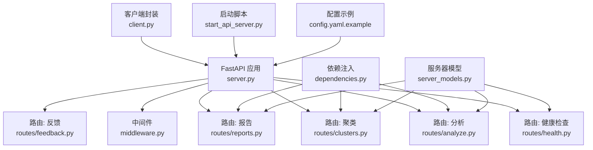
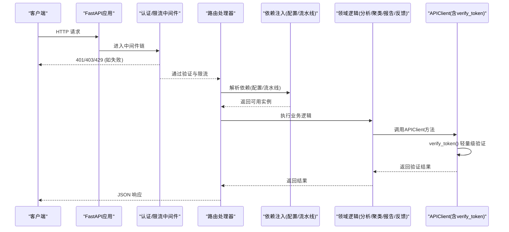
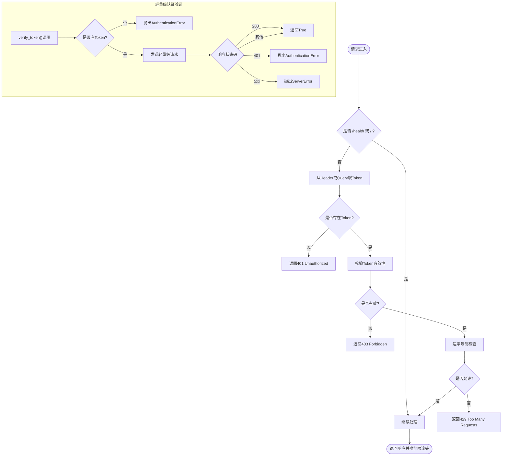
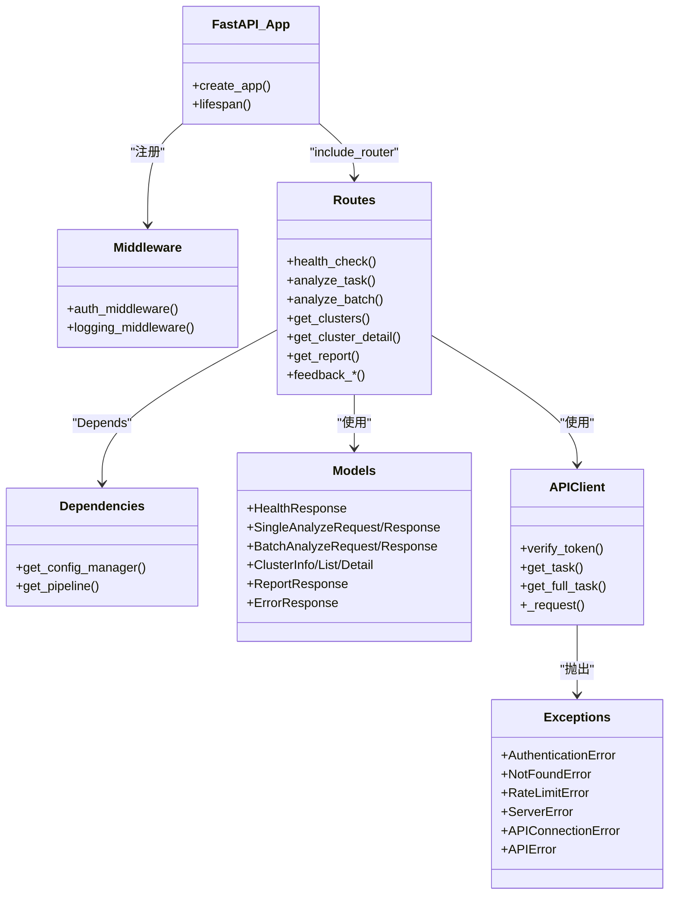

# API概览

<cite>
**本文引用的文件**
- [src/api/server.py](file://src/api/server.py)
- [src/api/middleware.py](file://src/api/middleware.py)
- [src/api/dependencies.py](file://src/api/dependencies.py)
- [src/api/routes/health.py](file://src/api/routes/health.py)
- [src/api/routes/analyze.py](file://src/api/routes/analyze.py)
- [src/api/routes/clusters.py](file://src/api/routes/clusters.py)
- [src/api/routes/reports.py](file://src/api/routes/reports.py)
- [src/api/routes/feedback.py](file://src/api/routes/feedback.py)
- [src/api/server_models.py](file://src/api/server_models.py)
- [src/api/client.py](file://src/api/client.py)
- [src/api/exceptions.py](file://src/api/exceptions.py)
- [scripts/start_api_server.py](file://scripts/start_api_server.py)
- [config/config.yaml.example](file://config/config.yaml.example)
</cite>

## 更新摘要
**所做更改**
- 新增APIClient.verify_token()方法的详细说明
- 更新客户端认证机制章节，包含轻量级令牌验证功能
- 添加verify_token方法的使用示例和最佳实践
- 更新错误处理模式，包含新的认证相关异常类型

## 目录
1. [简介](#简介)
2. [项目结构](#项目结构)
3. [核心组件](#核心组件)
4. [架构总览](#架构总览)
5. [详细组件分析](#详细组件分析)
6. [依赖关系分析](#依赖关系分析)
7. [性能与速率限制](#性能与速率限制)
8. [安全与错误处理](#安全与错误处理)
9. [快速开始与示例](#快速开始与示例)
10. [结论](#结论)

## 简介
本概览文档面向Bug聚类分析系统的RESTful API，覆盖整体架构、基础URL、认证机制、版本管理、设计原则与命名规范、端点清单、请求/响应格式、状态码约定、错误处理模式、速率限制、安全考虑、性能优化建议以及快速开始指南。目标是帮助开发者快速理解并集成API服务。

## 项目结构
API采用FastAPI构建，按功能域拆分路由模块，统一通过应用工厂创建实例并注册中间件、路由与生命周期钩子。关键目录与职责：
- src/api/server.py：应用工厂、生命周期、CORS、中间件装配、路由注册、根路径
- src/api/middleware.py：认证（Token校验）、速率限制、日志中间件
- src/api/dependencies.py：配置管理器与分析流水线的依赖注入
- src/api/routes/*：健康检查、任务分析、聚类查询、报告获取、反馈管理
- src/api/server_models.py：统一的请求/响应数据模型
- src/api/client.py：HTTP客户端封装，包含轻量级认证验证功能
- scripts/start_api_server.py：启动脚本与环境变量读取
- config/config.yaml.example：系统配置示例（LLM、嵌入、缓存、规则等）

**图示来源**
- [src/api/server.py:38-111](file://src/api/server.py#L38-L111)
- [src/api/middleware.py:62-141](file://src/api/middleware.py#L62-L141)
- [src/api/routes/health.py:10-22](file://src/api/routes/health.py#L10-L22)
- [src/api/routes/analyze.py:58-119](file://src/api/routes/analyze.py#L58-L119)
- [src/api/routes/clusters.py:24-91](file://src/api/routes/clusters.py#L24-L91)
- [src/api/routes/reports.py:16-105](file://src/api/routes/reports.py#L16-L105)
- [src/api/routes/feedback.py:26-156](file://src/api/routes/feedback.py#L26-L156)
- [src/api/server_models.py:9-159](file://src/api/server_models.py#L9-L159)
- [src/api/client.py:25-389](file://src/api/client.py#L25-L389)
- [scripts/start_api_server.py:13-64](file://scripts/start_api_server.py#L13-L64)
- [config/config.yaml.example:1-38](file://config/config.yaml.example#L1-L38)

章节来源
- [src/api/server.py:38-111](file://src/api/server.py#L38-L111)
- [scripts/start_api_server.py:13-64](file://scripts/start_api_server.py#L13-L64)

## 核心组件
- 应用工厂与生命周期
  - create_app负责初始化FastAPI实例、设置OpenAPI标签、挂载CORS、装配认证与限流中间件、注册各路由模块，并提供根路径返回文档与健康入口提示。
  - lifespan用于启动/关闭时的资源初始化与清理占位。
- 中间件
  - TokenValidator：支持Header或Query参数传入X-API-Token；未配置有效令牌时进入开发模式放行所有请求。
  - RateLimiter：基于内存的滑动窗口限流，默认每分钟60次，返回剩余配额头。
  - 日志中间件：记录请求/响应耗时与异常。
- 依赖注入
  - get_config_manager：提供配置管理器实例。
  - get_pipeline：以异步生成器方式提供AnalysisPipeline实例，确保资源释放。
- HTTP客户端封装
  - APIClient：封装HTTP请求逻辑，支持重试、熔断器、超时管理等高级特性。
  - verify_token()：轻量级认证验证方法，用于快速检查API令牌有效性。
- 路由与模型
  - 健康检查：GET /health
  - 分析：POST /analyze、POST /analyze/batch
  - 聚类：GET /clusters、GET /clusters/{cluster_id}
  - 报告：GET /reports/{task_id}?format=html|markdown|json&use_cache=true|false
  - 反馈：POST /feedback、GET /feedback/{id}、GET /feedback/task/{task_id}、GET /feedback?filters...、POST /feedback/{id}/review、GET /feedback/stats/summary
  - server_models定义统一的数据结构，包括分析选项、单条/批量分析请求与响应、聚类信息、报告响应、错误响应等。

**更新** 新增APIClient客户端封装和verify_token()轻量级认证验证方法

章节来源
- [src/api/server.py:38-111](file://src/api/server.py#L38-L111)
- [src/api/middleware.py:13-141](file://src/api/middleware.py#L13-L141)
- [src/api/dependencies.py:9-33](file://src/api/dependencies.py#L9-L33)
- [src/api/client.py:25-389](file://src/api/client.py#L25-L389)
- [src/api/routes/health.py:10-22](file://src/api/routes/health.py#L10-L22)
- [src/api/routes/analyze.py:58-201](file://src/api/routes/analyze.py#L58-L201)
- [src/api/routes/clusters.py:24-166](file://src/api/routes/clusters.py#L24-L166)
- [src/api/routes/reports.py:16-129](file://src/api/routes/reports.py#L16-L129)
- [src/api/routes/feedback.py:26-156](file://src/api/routes/feedback.py#L26-L156)
- [src/api/server_models.py:9-159](file://src/api/server_models.py#L9-L159)

## 架构总览
API遵循分层与模块化设计：
- 表现层：FastAPI路由，接收HTTP请求，进行参数校验与业务编排
- 中间件层：认证、限流、日志
- 领域层：分析流水线、聚类、报告生成、反馈管理
- 基础设施层：配置管理、缓存、外部LLM/嵌入服务（由配置驱动）
- 客户端层：APIClient封装，提供轻量级认证验证和高级网络特性

**图示来源**
- [src/api/server.py:81-111](file://src/api/server.py#L81-L111)
- [src/api/middleware.py:81-141](file://src/api/middleware.py#L81-L141)
- [src/api/dependencies.py:14-33](file://src/api/dependencies.py#L14-L33)
- [src/api/client.py:163-211](file://src/api/client.py#L163-L211)

## 详细组件分析

### 认证与鉴权
- 认证方式
  - Header：X-API-Token
  - Query：api_token
  - 未配置有效令牌集合时，进入开发模式放行所有请求
- 鉴权流程
  - 跳过/health与根路径
  - 校验Token存在性与有效性
  - 触发速率限制检查
  - 在响应头中附加X-RateLimit-Limit与X-RateLimit-Remaining
- 轻量级认证验证
  - APIClient.verify_token()方法提供快速令牌验证
  - 使用轻量级端点进行认证检查，避免完整业务逻辑开销
  - 支持连接错误、超时、认证失败的明确错误处理

**更新** 新增APIClient.verify_token()轻量级认证验证功能

**图示来源**
- [src/api/middleware.py:81-141](file://src/api/middleware.py#L81-L141)
- [src/api/client.py:163-211](file://src/api/client.py#L163-L211)

章节来源
- [src/api/middleware.py:48-141](file://src/api/middleware.py#L48-L141)
- [src/api/client.py:163-211](file://src/api/client.py#L163-L211)

### 速率限制
- 策略：基于内存的时间窗口计数，默认每分钟60次
- 标识符：优先使用Token，否则回退到客户端IP
- 响应头：X-RateLimit-Limit、X-RateLimit-Remaining
- 超限：返回429并附带retry_after提示

章节来源
- [src/api/middleware.py:13-46](file://src/api/middleware.py#L13-L46)
- [src/api/middleware.py:118-141](file://src/api/middleware.py#L118-L141)

### 版本管理与基础URL
- 版本：应用标题中包含版本"0.1.0"，可通过OpenAPI文档查看
- 基础URL：本地开发默认http://localhost:8000，生产环境通过环境变量API_HOST与API_PORT配置
- 根路径：/ 返回欢迎信息与/docs、/health入口提示

章节来源
- [src/api/server.py:52-79](file://src/api/server.py#L52-L79)
- [src/api/server.py:102-111](file://src/api/server.py#L102-L111)
- [scripts/start_api_server.py:19-32](file://scripts/start_api_server.py#L19-L32)

### 设计原则与命名规范
- REST风格：资源名词复数形式（/clusters、/feedback），动词使用HTTP方法表达操作
- 统一响应：成功与错误均遵循JSON结构，错误包含error、message、detail、timestamp
- 可观测性：中间件记录请求/响应耗时与异常
- 可扩展性：路由按功能域拆分，依赖注入解耦配置与流水线
- 客户端封装：APIClient提供统一的HTTP客户端接口，支持重试、熔断、超时等高级特性

**更新** 新增客户端封装设计原则

章节来源
- [src/api/server.py:56-78](file://src/api/server.py#L56-L78)
- [src/api/middleware.py:143-172](file://src/api/middleware.py#L143-L172)
- [src/api/server_models.py:152-159](file://src/api/server_models.py#L152-L159)
- [src/api/client.py:25-98](file://src/api/client.py#L25-L98)

### 完整API端点列表与说明
- 健康检查
  - GET /health
  - 无需认证；返回服务状态、时间戳与版本
- 任务分析
  - POST /analyze
    - 请求体：SingleAnalyzeRequest（task_id, options）
    - 响应：SingleAnalyzeResponse（labels、root_causes、deep_root_causes、violations、report、analysis_time、cached等）
  - POST /analyze/batch
    - 请求体：BatchAnalyzeRequest（task_ids, options）
    - 响应：BatchAnalyzeResponse（total_requested、total_completed、total_failed、results、analysis_time）
- 聚类查询
  - GET /clusters
    - 响应：ClusterListResponse（total_clusters、total_tasks、noise_count、clusters）
  - GET /clusters/{cluster_id}
    - 响应：ClusterDetailResponse（size、label、description、keywords、tasks、metadata）
- 报告获取
  - GET /reports/{task_id}?format=html|markdown|json&use_cache=true|false
    - 响应：ReportResponse（task_id、report_format、content、generated_at）
- 反馈管理
  - POST /feedback
  - GET /feedback/{feedback_id}
  - GET /feedback/task/{task_id}
  - GET /feedback?feedback_type=&rating=&reviewed=&limit=&offset=
  - POST /feedback/{feedback_id}/review
  - GET /feedback/stats/summary

章节来源
- [src/api/routes/health.py:10-22](file://src/api/routes/health.py#L10-L22)
- [src/api/routes/analyze.py:58-201](file://src/api/routes/analyze.py#L58-L201)
- [src/api/routes/clusters.py:24-166](file://src/api/routes/clusters.py#L24-L166)
- [src/api/routes/reports.py:16-129](file://src/api/routes/reports.py#L16-L129)
- [src/api/routes/feedback.py:26-156](file://src/api/routes/feedback.py#L26-L156)
- [src/api/server_models.py:17-150](file://src/api/server_models.py#L17-L150)

### 请求/响应格式规范
- 内容类型：application/json
- 成功响应：具体模型字段见server_models定义
- 错误响应：ErrorResponse（error、message、detail、timestamp）
- 分页与过滤：反馈列表支持limit/offset及多条件过滤

章节来源
- [src/api/server_models.py:9-159](file://src/api/server_models.py#L9-L159)

### 状态码约定与错误处理模式
- 通用状态码
  - 400 Bad Request：参数校验失败或非法格式
  - 401 Unauthorized：缺少Token
  - 403 Forbidden：无效Token
  - 404 Not Found：资源不存在（如聚类ID、任务ID）
  - 422 Unprocessable Entity：Pydantic校验失败
  - 429 Too Many Requests：超过速率限制
  - 500 Internal Server Error：内部异常
- 错误体结构：统一ErrorResponse，包含错误类型、消息、详情与时间戳
- 中间件统一拦截认证与限流错误；路由层对业务异常抛出HTTPException
- 客户端异常类型：
  - AuthenticationError：认证失败（401）
  - NotFoundError：资源不存在（404）
  - RateLimitError：速率限制（429）
  - ServerError：服务器错误（5xx）
  - APIConnectionError：连接错误
  - APIError：通用API错误

**更新** 新增客户端异常类型定义

章节来源
- [src/api/middleware.py:93-141](file://src/api/middleware.py#L93-L141)
- [src/api/routes/analyze.py:110-119](file://src/api/routes/analyze.py#L110-L119)
- [src/api/routes/clusters.py:121-166](file://src/api/routes/clusters.py#L121-L166)
- [src/api/routes/reports.py:46-129](file://src/api/routes/reports.py#L46-L129)
- [src/api/server_models.py:152-159](file://src/api/server_models.py#L152-L159)
- [src/api/exceptions.py:1-31](file://src/api/exceptions.py#L1-31)

### 最佳实践
- 使用X-API-Token传递认证信息，避免将敏感Token暴露在URL中
- 合理设置options控制分析深度与成本（如use_llm、generate_report）
- 批量接口适合高吞吐场景，注意速率限制与重试退避
- 报告接口按需选择format，减少不必要的数据传输
- 利用OpenAPI文档（/docs、/redoc）进行联调与自动化测试
- 使用APIClient.verify_token()进行轻量级认证预检查
- 实现适当的重试机制和熔断器保护

**更新** 新增APIClient.verify_token()使用建议和重试机制最佳实践

章节来源
- [src/api/server.py:102-111](file://src/api/server.py#L102-L111)
- [src/api/routes/analyze.py:87-108](file://src/api/routes/analyze.py#L87-L108)
- [src/api/routes/reports.py:46-105](file://src/api/routes/reports.py#L46-L105)
- [src/api/client.py:163-211](file://src/api/client.py#L163-L211)

## 依赖关系分析
- 路由依赖
  - analyze、clusters、reports通过get_config_manager获取配置管理器
  - analyze与reports通过AnalysisPipeline执行分析与报告生成
- 中间件依赖
  - TokenValidator与RateLimiter在create_app中实例化并注入中间件
- 启动与配置
  - start_api_server读取环境变量并调用create_app
  - config.yaml.example提供LLM、嵌入、聚类、缓存、规则等配置项参考
- 客户端依赖
  - APIClient封装httpx.AsyncClient，提供重试、熔断、超时等高级特性
  - 依赖异常类型定义进行错误分类和处理

**更新** 新增客户端依赖关系分析

**图示来源**
- [src/api/server.py:38-111](file://src/api/server.py#L38-L111)
- [src/api/middleware.py:62-141](file://src/api/middleware.py#L62-L141)
- [src/api/dependencies.py:9-33](file://src/api/dependencies.py#L9-L33)
- [src/api/server_models.py:9-159](file://src/api/server_models.py#L9-L159)
- [src/api/client.py:25-389](file://src/api/client.py#L25-L389)
- [src/api/exceptions.py:1-31](file://src/api/exceptions.py#L1-31)

章节来源
- [src/api/server.py:38-111](file://src/api/server.py#L38-L111)
- [src/api/dependencies.py:9-33](file://src/api/dependencies.py#L9-L33)
- [src/api/server_models.py:9-159](file://src/api/server_models.py#L9-L159)
- [src/api/client.py:25-389](file://src/api/client.py#L25-L389)
- [src/api/exceptions.py:1-31](file://src/api/exceptions.py#L1-31)

## 性能与速率限制
- 速率限制
  - 默认60次/分钟/Token或IP，超限返回429并附带retry_after
  - 建议在客户端实现指数退避与重试上限
- 缓存与复用
  - 分析接口支持use_cache选项，减少重复计算
  - 报告接口支持use_cache，避免重复生成
- 并发与资源
  - AnalysisPipeline以异步上下文管理，自动释放资源
  - 中间件记录耗时，便于定位瓶颈
  - APIClient支持异步操作和资源管理
- 配置优化
  - 根据负载调整API_RATE_LIMIT
  - 结合config.yaml.example中的cache、llm、embedding等参数优化性能
- 轻量级验证优化
  - verify_token()使用最小请求体，减少网络开销
  - 支持快速失败和明确的错误反馈

**更新** 新增轻量级验证的性能优化说明

章节来源
- [src/api/middleware.py:13-46](file://src/api/middleware.py#L13-L46)
- [src/api/routes/analyze.py:87-108](file://src/api/routes/analyze.py#L87-L108)
- [src/api/routes/reports.py:58-105](file://src/api/routes/reports.py#L58-L105)
- [config/config.yaml.example:22-26](file://config/config.yaml.example#L22-L26)
- [src/api/client.py:163-211](file://src/api/client.py#L163-L211)

## 安全与错误处理
- 认证与安全
  - 推荐在生产环境配置API_VALID_TOKENS，强制启用Token校验
  - 避免在URL中携带Token，优先使用Header
  - CORS默认允许所有来源，生产应限定域名
  - APIClient支持Bearer Token自动处理
- 输入校验
  - Pydantic模型严格校验，非法输入返回422
  - 报告接口对format进行白名单校验
- 错误处理
  - 中间件统一返回标准错误体
  - 路由层针对业务异常抛出HTTPException，保持错误语义清晰
  - APIClient提供细粒度的异常分类和错误处理
  - verify_token()提供明确的认证状态反馈
- 连接安全
  - 支持HTTPS连接
  - 超时配置防止连接挂起
  - 重试机制带指数退避

**更新** 新增APIClient安全特性和错误处理机制

章节来源
- [src/api/middleware.py:81-141](file://src/api/middleware.py#L81-L141)
- [src/api/server.py:81-88](file://src/api/server.py#L81-L88)
- [src/api/routes/reports.py:46-56](file://src/api/routes/reports.py#L46-L56)
- [src/api/server_models.py:152-159](file://src/api/server_models.py#L152-L159)
- [src/api/client.py:87-98](file://src/api/client.py#L87-L98)
- [src/api/client.py:163-211](file://src/api/client.py#L163-L211)

## 快速开始与示例
- 启动服务
  - 使用脚本启动：python scripts/start_api_server.py
  - 或通过模块直接运行：python -m src.api.server
  - 环境变量：API_HOST、API_PORT、API_VALID_TOKENS、API_RATE_LIMIT
- 访问文档
  - Swagger UI：/docs
  - ReDoc：/redoc
- 基础示例
  - 健康检查：GET /health
  - 单个任务分析：POST /analyze，请求体包含task_id与options
  - 批量分析：POST /analyze/batch，请求体包含task_ids与options
  - 获取聚类列表：GET /clusters
  - 获取聚类详情：GET /clusters/{cluster_id}
  - 获取报告：GET /reports/{task_id}?format=html
  - 提交反馈：POST /feedback
- 客户端使用示例
  - 创建APIClient实例并进行轻量级认证验证
  - 使用异步上下文管理器管理资源
  - 处理各种异常情况

**更新** 新增APIClient使用示例

章节来源
- [scripts/start_api_server.py:13-64](file://scripts/start_api_server.py#L13-L64)
- [src/api/server.py:102-111](file://src/api/server.py#L102-L111)
- [src/api/routes/health.py:10-22](file://src/api/routes/health.py#L10-L22)
- [src/api/routes/analyze.py:58-201](file://src/api/routes/analyze.py#L58-L201)
- [src/api/routes/clusters.py:24-166](file://src/api/routes/clusters.py#L24-L166)
- [src/api/routes/reports.py:16-129](file://src/api/routes/reports.py#L16-L129)
- [src/api/routes/feedback.py:26-156](file://src/api/routes/feedback.py#L26-L156)
- [src/api/client.py:25-389](file://src/api/client.py#L25-L389)

## 结论
该API以FastAPI为核心，采用清晰的模块化设计与统一的中间件机制，提供任务分析、聚类查询、报告生成与反馈管理能力。通过Token认证与速率限制保障安全性与稳定性，配合完善的错误响应与可观测性日志，便于开发与运维。新增的APIClient.verify_token()方法提供了轻量级认证验证能力，增强了客户端的健壮性和用户体验。建议在生产环境严格配置认证与CORS，并结合缓存与配置优化提升性能。

**更新** 强调新增的APIClient.verify_token()方法对系统健壮性的增强作用