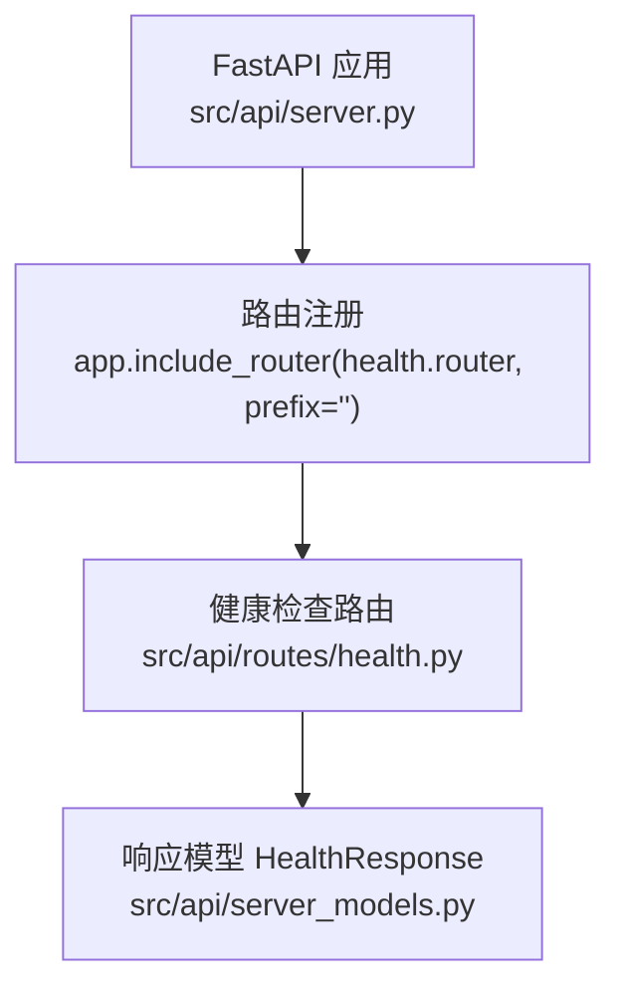
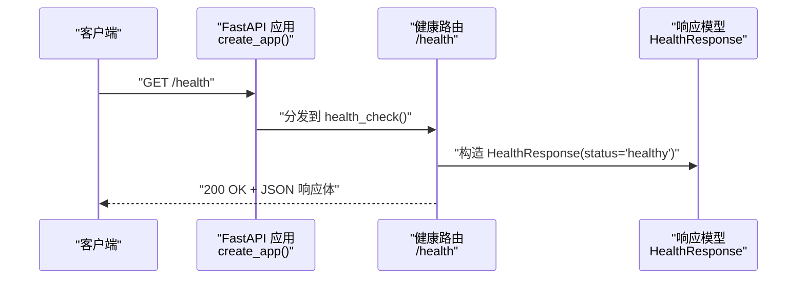
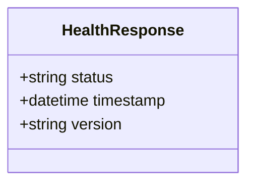
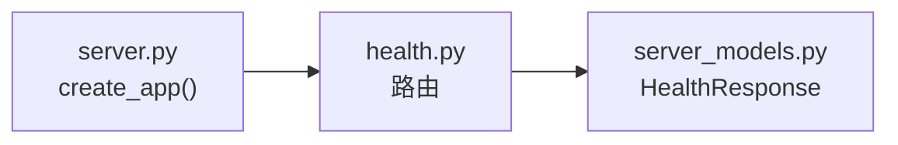

# 健康检查接口

<cite>
**本文引用的文件**
- [src/api/routes/health.py](file://src/api/routes/health.py)
- [src/api/server_models.py](file://src/api/server_models.py)
- [src/api/server.py](file://src/api/server.py)
- [docs/API.md](file://docs/API.md)
- [tests/api/test_server.py](file://tests/api/test_server.py)
- [docs/observability_guide.md](file://docs/observability_guide.md)
</cite>

## 目录
1. [简介](#简介)
2. [项目结构](#项目结构)
3. [核心组件](#核心组件)
4. [架构总览](#架构总览)
5. [详细组件分析](#详细组件分析)
6. [依赖关系分析](#依赖关系分析)
7. [性能与可用性考量](#性能与可用性考量)
8. [故障排查指南](#故障排查指南)
9. [结论](#结论)
10. [附录](#附录)

## 简介
本文件为“健康检查接口”的完整 API 文档，覆盖以下要点：
- 端点规格：HTTP 方法、URL 路径、请求参数、响应格式
- 返回的系统状态信息字段说明
- 成功与失败场景的请求/响应示例
- 在负载均衡与服务发现中的使用建议
- 监控集成与告警配置建议（结合系统可观测性能力）

该接口用于快速判断服务是否可用，适合被外部监控系统、负载均衡器或服务注册中心周期性探测。

## 项目结构
健康检查相关代码位于 FastAPI 路由模块中，并通过应用工厂统一挂载到根路径下；响应模型定义在统一的服务器数据模型文件中。

图示来源
- [src/api/server.py:95-100](file://src/api/server.py#L95-L100)
- [src/api/routes/health.py:10-22](file://src/api/routes/health.py#L10-L22)
- [src/api/server_models.py:9-15](file://src/api/server_models.py#L9-L15)

章节来源
- [src/api/server.py:95-100](file://src/api/server.py#L95-L100)
- [src/api/routes/health.py:10-22](file://src/api/routes/health.py#L10-L22)
- [src/api/server_models.py:9-15](file://src/api/server_models.py#L9-L15)

## 核心组件
- 健康检查路由：提供 GET /health 端点，返回健康状态对象。
- 响应模型：HealthResponse，包含 status、timestamp、version 三个字段。
- 应用装配：通过 create_app 将 health 路由挂载到根路径前缀。

章节来源
- [src/api/routes/health.py:10-22](file://src/api/routes/health.py#L10-L22)
- [src/api/server_models.py:9-15](file://src/api/server_models.py#L9-L15)
- [src/api/server.py:95-100](file://src/api/server.py#L95-L100)

## 架构总览
从客户端到健康检查接口的调用链路如下：

图示来源
- [src/api/server.py:95-100](file://src/api/server.py#L95-L100)
- [src/api/routes/health.py:10-22](file://src/api/routes/health.py#L10-L22)
- [src/api/server_models.py:9-15](file://src/api/server_models.py#L9-L15)

## 详细组件分析

### 接口规范
- 接口名称：健康检查
- HTTP 方法：GET
- URL 路径：/health
- 认证要求：否
- 标签：Health
- 内容类型：application/json

#### 请求
- 无请求体
- 无必需查询参数或路径参数

#### 响应
- 状态码：200（正常）
- 响应体字段：
  - status: string，固定值 healthy
  - timestamp: datetime，时间戳
  - version: string，服务版本

章节来源
- [docs/API.md:70-94](file://docs/API.md#L70-L94)
- [src/api/routes/health.py:10-22](file://src/api/routes/health.py#L10-L22)
- [src/api/server_models.py:9-15](file://src/api/server_models.py#L9-L15)

#### 请求/响应示例
- 成功示例（200）
  - 请求
    - GET http://localhost:8000/health
  - 响应体
    - {
        "status": "healthy",
        "timestamp": "2026-03-31T01:00:00",
        "version": "0.1.0"
      }

章节来源
- [docs/API.md:80-94](file://docs/API.md#L80-L94)

#### 错误场景
- 当前实现未对 /health 进行额外校验，通常不会出现业务错误。若出现网络或网关层异常，可能返回非 2xx 状态码（如 404、500），具体取决于部署环境。
- 通用错误响应遵循全局错误格式（见 API 文档的错误响应部分）。

章节来源
- [docs/API.md:44-67](file://docs/API.md#L44-L67)

### 行为验证（测试用例）
- 断言 200 状态码
- 断言响应体包含 status=healthy、timestamp、version 字段

章节来源
- [tests/api/test_server.py:35-42](file://tests/api/test_server.py#L35-L42)

### 类图（响应模型）

图示来源
- [src/api/server_models.py:9-15](file://src/api/server_models.py#L9-L15)

## 依赖关系分析
- 路由依赖：
  - 路由函数 health_check 依赖响应模型 HealthResponse
- 应用装配：
  - create_app 中将 health 路由以空前缀挂载，因此最终路径为 /health

图示来源
- [src/api/routes/health.py:10-22](file://src/api/routes/health.py#L10-L22)
- [src/api/server_models.py:9-15](file://src/api/server_models.py#L9-L15)
- [src/api/server.py:95-100](file://src/api/server.py#L95-L100)

章节来源
- [src/api/routes/health.py:10-22](file://src/api/routes/health.py#L10-L22)
- [src/api/server.py:95-100](file://src/api/server.py#L95-L100)

## 性能与可用性考量
- 健康检查接口为轻量级只读操作，不访问外部依赖，延迟极低，适合作为存活探针和就绪探针。
- 建议在负载均衡器或服务网格中使用短超时与较高频率的探测策略，以便快速剔除异常实例。
- 如需扩展健康检查范围（例如数据库、缓存等依赖），可在路由中增加依赖探测逻辑并返回更丰富的状态字段。

[本节为通用指导，无需源码引用]

## 故障排查指南
- 确认服务已启动且监听端口可达（参考环境变量 API_HOST、API_PORT）。
- 检查是否存在中间件拦截（CORS、鉴权、限流）影响 /health 的访问。
- 查看应用日志定位异常堆栈。
- 若需增强健康检查的可观测性，可结合系统的结构化日志与指标收集能力记录健康检查的调用次数与耗时。

章节来源
- [src/api/server.py:124-147](file://src/api/server.py#L124-L147)
- [docs/observability_guide.md:74-138](file://docs/observability_guide.md#L74-L138)

## 结论
健康检查接口提供了最小而稳定的服务可用性探测能力，满足常见的负载均衡和服务发现需求。配合系统的日志与指标能力，可实现完善的运行态监控与告警闭环。

[本节为总结性内容，无需源码引用]

## 附录

### 在负载均衡与服务发现中的使用方法
- 存活探针（Liveness Probe）
  - 周期调用 GET /health，若连续失败则判定实例不可用并重启。
- 就绪探针（Readiness Probe）
  - 周期调用 GET /health，若失败则从流量入口摘除实例，待恢复后再加入。
- 服务注册中心
  - 将 /health 作为健康检查端点，由注册中心定期探测并维护实例健康列表。

[本节为概念性说明，无需源码引用]

### 监控集成与告警建议
- 指标采集
  - 使用系统提供的 MetricsCollector 记录健康检查的调用次数与耗时，便于 Prometheus 抓取与可视化。
- 日志记录
  - 使用结构化日志记录健康检查的触发与结果，便于问题追踪。
- 告警规则
  - 基于健康检查失败率、连续失败次数、平均响应时延设置阈值告警。
  - 结合错误码分布（如 5xx）提升告警准确性。

章节来源
- [docs/observability_guide.md:74-138](file://docs/observability_guide.md#L74-L138)
