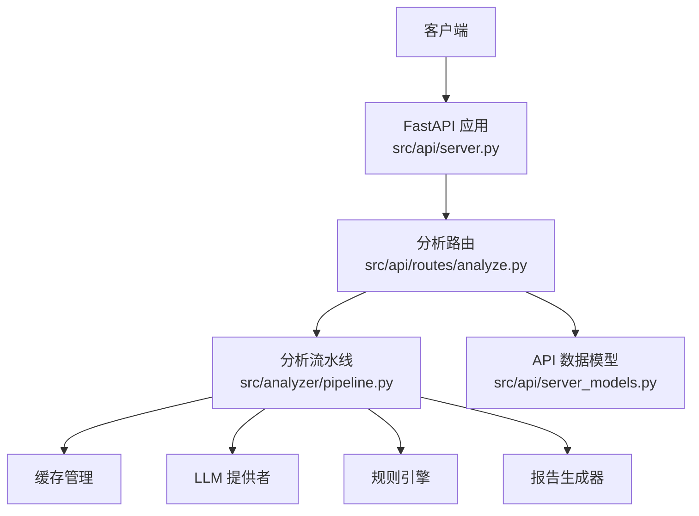
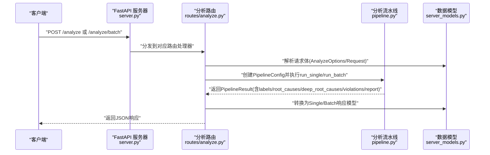
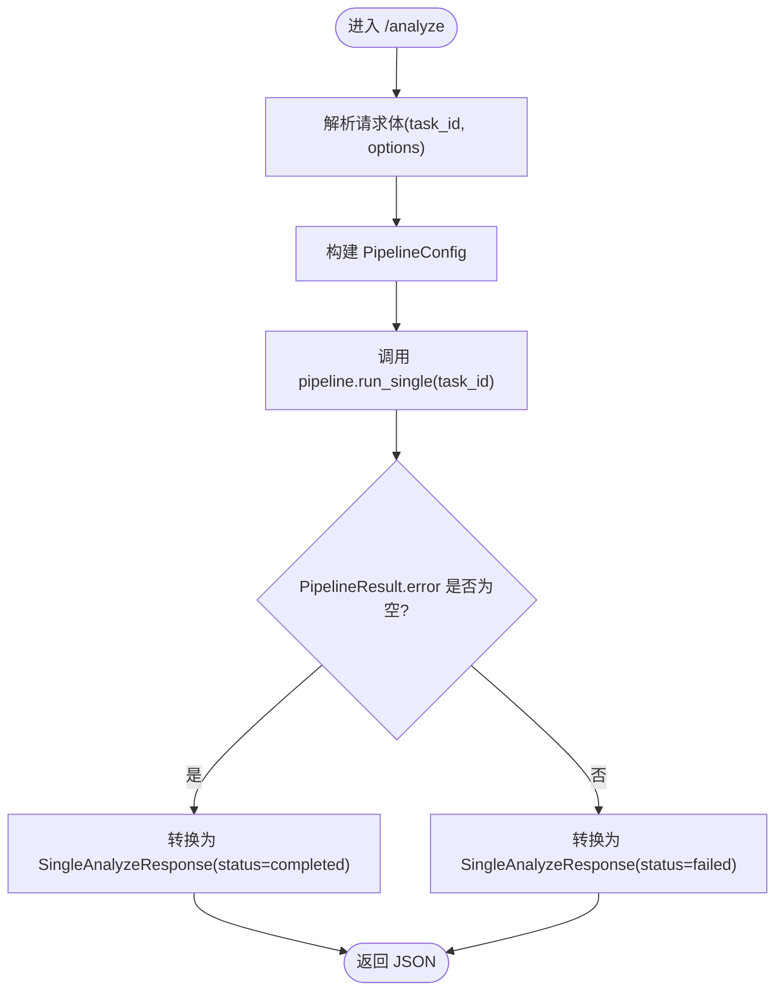
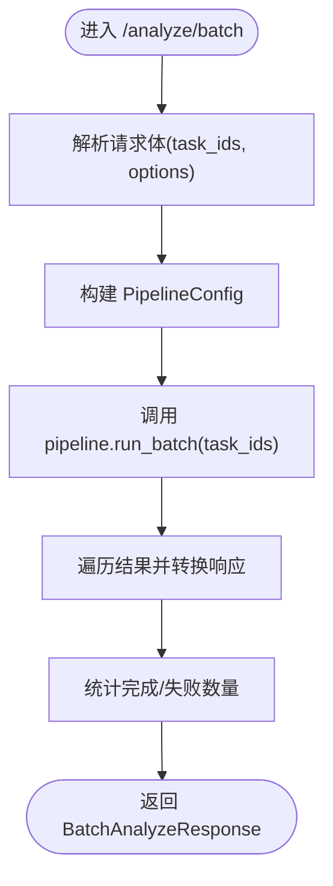
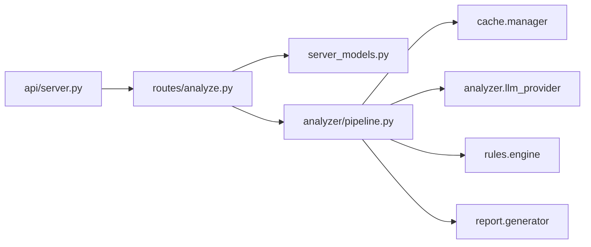

# 分析接口

<cite>
**本文引用的文件**   
- [src/api/routes/analyze.py](file://src/api/routes/analyze.py)
- [src/api/server_models.py](file://src/api/server_models.py)
- [src/analyzer/pipeline.py](file://src/analyzer/pipeline.py)
- [src/api/server.py](file://src/api/server.py)
- [docs/API.md](file://docs/API.md)
- [tests/api/routes/test_analyze.py](file://tests/api/routes/test_analyze.py)
- [config/config.yaml.example](file://config/config.yaml.example)
</cite>

## 目录
1. [简介](#简介)
2. [项目结构](#项目结构)
3. [核心组件](#核心组件)
4. [架构总览](#架构总览)
5. [详细组件分析](#详细组件分析)
6. [依赖关系分析](#依赖关系分析)
7. [性能与调优建议](#性能与调优建议)
8. [故障排查指南](#故障排查指南)
9. [结论](#结论)
10. [附录：请求/响应Schema与示例](#附录请求响应schema与示例)

## 简介
本文件为“任务分析接口”的完整API文档，覆盖以下两个端点：
- POST /analyze：单个任务分析
- POST /analyze/batch：批量任务分析

文档包含：
- 请求参数完整Schema定义（task_id、options配置及各项开关）
- 响应数据结构说明（labels、root_causes、deep_root_causes、violations等）
- 正常流程与异常处理的JSON示例
- 异步处理机制、进度跟踪与错误恢复策略
- 性能调优建议与最佳实践

## 项目结构
与本次文档相关的代码组织如下：
- API路由层：src/api/routes/analyze.py
- 数据模型：src/api/server_models.py
- 分析流水线：src/analyzer/pipeline.py
- 服务入口与中间件注册：src/api/server.py
- 现有API文档与使用示例：docs/API.md
- 单元测试用例：tests/api/routes/test_analyze.py
- 配置示例：config/config.yaml.example

图表来源
- [src/api/server.py:38-111](file://src/api/server.py#L38-L111)
- [src/api/routes/analyze.py:58-202](file://src/api/routes/analyze.py#L58-L202)
- [src/analyzer/pipeline.py:66-182](file://src/analyzer/pipeline.py#L66-L182)
- [src/api/server_models.py:17-101](file://src/api/server_models.py#L17-L101)

章节来源
- [src/api/server.py:38-111](file://src/api/server.py#L38-L111)
- [src/api/routes/analyze.py:58-202](file://src/api/routes/analyze.py#L58-L202)
- [src/analyzer/pipeline.py:66-182](file://src/analyzer/pipeline.py#L66-L182)
- [src/api/server_models.py:17-101](file://src/api/server_models.py#L17-L101)

## 核心组件
- 分析路由
  - 负责接收请求、构造PipelineConfig、调用AnalysisPipeline并转换结果。
- 数据模型
  - 定义请求/响应的Pydantic模型，包括AnalyzeOptions、SingleAnalyzeRequest/Response、BatchAnalyzeRequest/Response等。
- 分析流水线
  - 封装从数据获取、预处理、标签生成、根因分析、深度根因分析、规则检查到报告生成的完整流程。

章节来源
- [src/api/routes/analyze.py:23-119](file://src/api/routes/analyze.py#L23-L119)
- [src/api/server_models.py:17-101](file://src/api/server_models.py#L17-L101)
- [src/analyzer/pipeline.py:35-182](file://src/analyzer/pipeline.py#L35-L182)

## 架构总览
下图展示了单次分析与批量分析的端到端调用链路与关键组件交互。

图表来源
- [src/api/server.py:38-111](file://src/api/server.py#L38-L111)
- [src/api/routes/analyze.py:58-202](file://src/api/routes/analyze.py#L58-L202)
- [src/analyzer/pipeline.py:105-182](file://src/analyzer/pipeline.py#L105-L182)
- [src/api/server_models.py:17-101](file://src/api/server_models.py#L17-L101)

## 详细组件分析

### 端点一：POST /analyze（单个任务分析）
- 功能：对指定任务进行可选的标签生成、根因分析、深度根因分析、规则检查与报告生成。
- 认证：由全局中间件控制（详见文档中的认证部分）。
- 速率限制：默认每分钟60次（可通过环境变量调整）。

请求体Schema
- task_id：字符串或整数，必填
- options：AnalyzeOptions对象，可选
  - include_code：是否包含代码变更（默认true）
  - include_analysis：是否包含LLM分析（默认true）
  - use_cache：是否使用缓存（默认true）
  - use_llm：是否启用LLM分析（默认false）
  - generate_labels：是否生成标签（默认true）
  - analyze_root_cause：是否进行根因分析（默认true）
  - analyze_root_cause_deep：是否进行深度根因分析（默认false）
  - check_rules：是否检查规则（默认true）
  - generate_report：是否生成报告（默认true）

响应体Schema
- task_id：字符串
- status：completed | failed
- error：错误信息（失败时填充）
- labels：标签列表（LabelInfo）
- root_causes：根因列表（RootCauseInfo）
- deep_root_causes：深度根因分析结果（任意结构）
- violations：违规列表（ViolationInfo）
- suggestions：改进建议（当前为空列表）
- report：分析报告文本
- analysis_time：分析耗时（秒）
- cached：是否来自缓存

流程图（单任务）

图表来源
- [src/api/routes/analyze.py:58-119](file://src/api/routes/analyze.py#L58-L119)
- [src/analyzer/pipeline.py:105-122](file://src/analyzer/pipeline.py#L105-L122)
- [src/api/server_models.py:73-91](file://src/api/server_models.py#L73-L91)

章节来源
- [src/api/routes/analyze.py:58-119](file://src/api/routes/analyze.py#L58-L119)
- [src/analyzer/pipeline.py:105-122](file://src/analyzer/pipeline.py#L105-L122)
- [src/api/server_models.py:73-91](file://src/api/server_models.py#L73-L91)

### 端点二：POST /analyze/batch（批量任务分析）
- 功能：并发地对多个任务进行分析，聚合每个任务的独立结果。
- 并发策略：基于asyncio.gather并行执行各任务的run_single。
- 统计字段：total_requested、total_completed、total_failed、analysis_time。

请求体Schema
- task_ids：字符串或整数的非空列表，必填
- options：AnalyzeOptions对象，可选（同单任务）

响应体Schema
- total_requested：请求总数
- total_completed：成功数
- total_failed：失败数
- results：SingleAnalyzeResponse列表
- analysis_time：总耗时（秒）

流程图（批量）

图表来源
- [src/api/routes/analyze.py:122-202](file://src/api/routes/analyze.py#L122-L202)
- [src/analyzer/pipeline.py:171-182](file://src/analyzer/pipeline.py#L171-L182)
- [src/api/server_models.py:93-101](file://src/api/server_models.py#L93-L101)

章节来源
- [src/api/routes/analyze.py:122-202](file://src/api/routes/analyze.py#L122-L202)
- [src/analyzer/pipeline.py:171-182](file://src/analyzer/pipeline.py#L171-L182)
- [src/api/server_models.py:93-101](file://src/api/server_models.py#L93-L101)

### 数据模型详解
- AnalyzeOptions：控制分析开关与行为
- LabelInfo：标签名称、置信度、类别、描述
- RootCauseInfo：根因类型、描述、证据、置信度
- ViolationInfo：规则ID、规则名、严重级别、消息、证据
- SingleAnalyzeResponse：单任务分析结果
- BatchAnalyzeResponse：批量分析汇总结果

类图

```mermaid
classDiagram
class AnalyzeOptions {
+bool include_code
+bool include_analysis
+bool use_cache
+bool use_llm
+bool generate_labels
+bool analyze_root_cause
+bool analyze_root_cause_deep
+bool check_rules
+bool generate_report
}
class LabelInfo {
+string name
+float confidence
+string category
+string description
}
class RootCauseInfo {
+string cause_type
+string description
+string[] evidence
+float confidence
}
class ViolationInfo {
+string rule_id
+string rule_name
+string severity
+string message
+string evidence
}
class SingleAnalyzeResponse {
+string task_id
+string status
+string error
+LabelInfo[] labels
+RootCauseInfo[] root_causes
+dict deep_root_causes
+ViolationInfo[] violations
+string[] suggestions
+string report
+float analysis_time
+bool cached
}
class BatchAnalyzeResponse {
+int total_requested
+int total_completed
+int total_failed
+SingleAnalyzeResponse[] results
+float analysis_time
}
AnalyzeOptions <.. SingleAnalyzeResponse : "被使用"
LabelInfo <.. SingleAnalyzeResponse : "包含"
RootCauseInfo <.. SingleAnalyzeResponse : "包含"
ViolationInfo <.. SingleAnalyzeResponse : "包含"
SingleAnalyzeResponse <.. BatchAnalyzeResponse : "聚合"
```

图表来源
- [src/api/server_models.py:17-101](file://src/api/server_models.py#L17-L101)

章节来源
- [src/api/server_models.py:17-101](file://src/api/server_models.py#L17-L101)

### 流水线实现要点
- run_single：按顺序执行数据准备、LLM分析（可选）、规则检查与报告生成；异常会写入error字段。
- run_batch：并发执行多个run_single，聚合结果。
- 深度根因分析：当开启analyze_root_cause_deep时，调用增强型模块进行五层根因分析，返回结构化字典。
- 规则检查：通过规则引擎产出违规项列表。
- 报告生成：根据标签与根因生成报告文本。

章节来源
- [src/analyzer/pipeline.py:105-182](file://src/analyzer/pipeline.py#L105-L182)
- [src/analyzer/pipeline.py:369-427](file://src/analyzer/pipeline.py#L369-L427)
- [src/analyzer/pipeline.py:428-467](file://src/analyzer/pipeline.py#L428-L467)

## 依赖关系分析
- 路由层依赖数据模型与分析流水线
- 流水线依赖外部资源：缓存、LLM提供者、规则引擎、报告生成器
- 服务器层统一注册路由与中间件（认证、限流、CORS）

图表来源
- [src/api/routes/analyze.py:1-20](file://src/api/routes/analyze.py#L1-L20)
- [src/analyzer/pipeline.py:1-22](file://src/analyzer/pipeline.py#L1-L22)
- [src/api/server.py:95-101](file://src/api/server.py#L95-L101)

章节来源
- [src/api/routes/analyze.py:1-20](file://src/api/routes/analyze.py#L1-L20)
- [src/analyzer/pipeline.py:1-22](file://src/analyzer/pipeline.py#L1-L22)
- [src/api/server.py:95-101](file://src/api/server.py#L95-L101)

## 性能与调优建议
- 并发与吞吐
  - 批量接口已使用并发执行，建议在客户端侧合理分片（如每批10-50个任务），避免单次过大导致超时。
- 缓存策略
  - 开启use_cache可显著降低重复分析成本；结合TTL与存储后端（SQLite/其他）提升命中率。
- LLM调用优化
  - 按需开启use_llm与generate_labels/analyze_root_cause；在低优先级场景关闭深度分析以降低延迟。
- 规则检查
  - 若仅需快速概览，可关闭check_rules以减少IO与计算开销。
- 报告生成
  - 仅在需要时开启generate_report，避免不必要的模板渲染。
- 限流与重试
  - 服务端默认限流60次/分钟；客户端应实现指数退避重试，避免雪崩。
- 监控与指标
  - 记录analysis_time、cached命中率、失败率，用于容量规划与瓶颈定位。

[本节为通用指导，不直接分析具体文件]

## 故障排查指南
- 常见状态码
  - 400/422：请求体验证失败或缺少必填字段
  - 401/403：认证失败或Token无效
  - 429：超过速率限制
  - 500：服务器内部错误或上游依赖异常
- 典型问题定位
  - 任务不存在：PipelineResult.error会被填充，响应status=failed
  - LLM不可用：相关分析步骤返回空列表或不执行
  - 规则引擎异常：violations可能为空，需检查规则配置
- 日志与诊断
  - 查看服务端日志中“Starting analysis for task...”和“Analysis completed...”以确认处理链路
  - 使用OpenAPI文档页面验证请求/响应结构

章节来源
- [docs/API.md:44-67](file://docs/API.md#L44-L67)
- [tests/api/routes/test_analyze.py:155-179](file://tests/api/routes/test_analyze.py#L155-L179)

## 结论
- 单任务与批量分析接口提供一致的请求/响应模型，便于集成与扩展。
- 通过AnalyzeOptions灵活控制分析维度，兼顾性能与准确性。
- 流水线设计清晰，支持缓存、LLM、规则与报告等多阶段处理。
- 建议在生产环境结合限流、重试、监控与缓存策略，确保稳定性与可扩展性。

[本节为总结，不直接分析具体文件]

## 附录：请求/响应Schema与示例

### 公共字段说明
- 认证方式：HTTP Header X-API-Token 或查询参数 api_token
- 内容类型：application/json
- 基础URL：http://localhost:8000（本地开发）

章节来源
- [docs/API.md:7-36](file://docs/API.md#L7-L36)

### POST /analyze
- 请求体
  - task_id：字符串或整数，必填
  - options：AnalyzeOptions对象，可选
- 响应体
  - task_id、status、error、labels、root_causes、deep_root_causes、violations、suggestions、report、analysis_time、cached

章节来源
- [src/api/server_models.py:31-91](file://src/api/server_models.py#L31-L91)
- [src/api/routes/analyze.py:58-119](file://src/api/routes/analyze.py#L58-L119)

#### 正常流程示例（路径参考）
- 请求示例路径：[docs/API.md:106-126](file://docs/API.md#L106-L126)
- 响应示例路径：[docs/API.md:140-155](file://docs/API.md#L140-L155)

#### 异常处理示例（路径参考）
- 缺失必填字段返回422：[tests/api/routes/test_analyze.py:190-194](file://tests/api/routes/test_analyze.py#L190-L194)
- 任务不存在返回200且status=failed：[tests/api/routes/test_analyze.py:167-179](file://tests/api/routes/test_analyze.py#L167-L179)
- 服务器内部错误返回500：[tests/api/routes/test_analyze.py:155-166](file://tests/api/routes/test_analyze.py#L155-L166)

### POST /analyze/batch
- 请求体
  - task_ids：非空列表，元素为字符串或整数，必填
  - options：AnalyzeOptions对象，可选
- 响应体
  - total_requested、total_completed、total_failed、results、analysis_time

章节来源
- [src/api/server_models.py:38-101](file://src/api/server_models.py#L38-L101)
- [src/api/routes/analyze.py:122-202](file://src/api/routes/analyze.py#L122-L202)

#### 正常流程示例（路径参考）
- 请求示例路径：[docs/API.md:167-181](file://docs/API.md#L167-L181)
- 响应示例路径：[docs/API.md:189-207](file://docs/API.md#L189-L207)

#### 异常处理示例（路径参考）
- 空列表返回422：[tests/api/routes/test_analyze.py:233-236](file://tests/api/routes/test_analyze.py#L233-L236)
- 缺少task_ids返回422：[tests/api/routes/test_analyze.py:238-241](file://tests/api/routes/test_analyze.py#L238-L241)
- 批量异常返回500：[tests/api/routes/test_analyze.py:243-252](file://tests/api/routes/test_analyze.py#L243-L252)

### 选项与行为对照表
- use_cache：命中缓存则跳过外部API拉取与预处理，显著提升速度
- use_llm：决定是否调用LLM进行标签与根因分析
- generate_labels：仅当use_llm=true时生效
- analyze_root_cause：仅当use_llm=true时生效
- analyze_root_cause_deep：额外进行深度根因分析，返回结构化字典
- check_rules：运行规则引擎，输出违规项
- generate_report：生成报告文本

章节来源
- [src/api/server_models.py:17-29](file://src/api/server_models.py#L17-L29)
- [src/analyzer/pipeline.py:35-46](file://src/analyzer/pipeline.py#L35-L46)

### 配置与环境变量
- 服务器启动与端口：见server.main
- 有效Token与限流：见server.main与docs/API.md
- 外部系统连接与LLM/Embedding/Clustering/Cache/Rules等配置：见config.yaml.example

章节来源
- [src/api/server.py:114-147](file://src/api/server.py#L114-L147)
- [docs/API.md:457-476](file://docs/API.md#L457-L476)
- [config/config.yaml.example:1-38](file://config/config.yaml.example#L1-L38)
