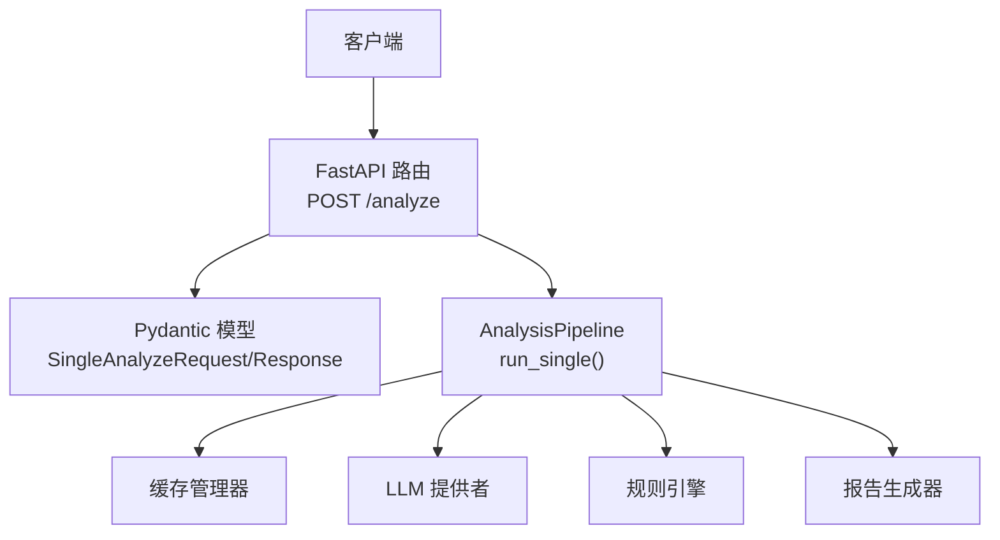
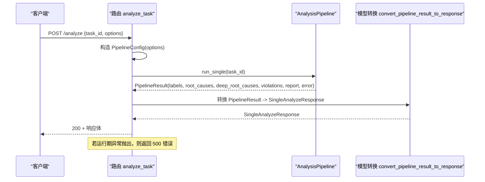
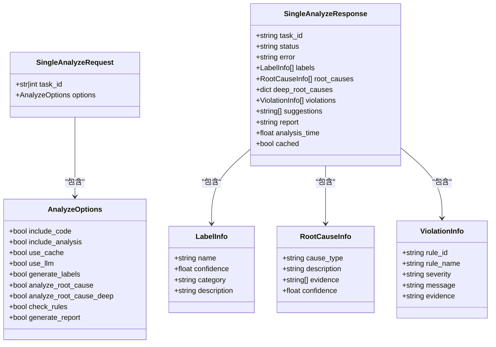
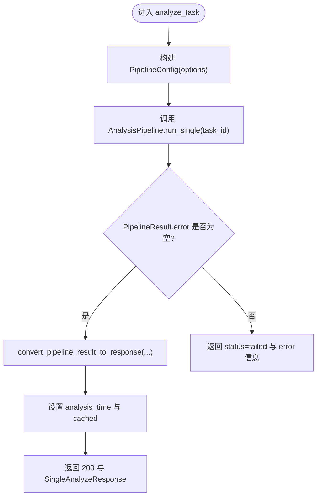

# 单个任务分析接口

<cite>
**本文引用的文件**
- [src/api/routes/analyze.py](file://src/api/routes/analyze.py)
- [src/api/server_models.py](file://src/api/server_models.py)
- [src/analyzer/pipeline.py](file://src/analyzer/pipeline.py)
- [tests/api/routes/test_analyze.py](file://tests/api/routes/test_analyze.py)
- [docs/API.md](file://docs/API.md)
- [src/utils/circuit_breaker.py](file://src/utils/circuit_breaker.py)
- [src/api/client.py](file://src/api/client.py)
</cite>

## 目录
1. [简介](#简介)
2. [项目结构](#项目结构)
3. [核心组件](#核心组件)
4. [架构总览](#架构总览)
5. [详细组件分析](#详细组件分析)
6. [依赖关系分析](#依赖关系分析)
7. [性能考虑](#性能考虑)
8. [故障排查指南](#故障排查指南)
9. [结论](#结论)
10. [附录](#附录)

## 简介
本章节面向调用方，提供“单个任务分析”接口的完整说明。该接口用于对指定任务执行端到端分析，包括标签生成、根因分析（含深度根因）、规则检查与报告生成等。请求通过 POST /analyze 提交，响应为 SingleAnalyzeResponse，包含分析结果与元数据。

## 项目结构
与单个任务分析接口直接相关的代码位于 API 路由层、服务模型定义与分析流水线：
- 路由实现：src/api/routes/analyze.py
- 请求/响应模型：src/api/server_models.py
- 分析流水线：src/analyzer/pipeline.py
- 单元测试：tests/api/routes/test_analyze.py
- 通用错误格式与示例：docs/API.md

图表来源
- [src/api/routes/analyze.py:58-119](file://src/api/routes/analyze.py#L58-L119)
- [src/analyzer/pipeline.py:105-170](file://src/analyzer/pipeline.py#L105-L170)

章节来源
- [src/api/routes/analyze.py:58-119](file://src/api/routes/analyze.py#L58-L119)
- [src/api/server_models.py:17-91](file://src/api/server_models.py#L17-L91)
- [src/analyzer/pipeline.py:35-64](file://src/analyzer/pipeline.py#L35-L64)

## 核心组件
- 路由 analyze_task：接收 SingleAnalyzeRequest，构造 PipelineConfig，调用 AnalysisPipeline.run_single，并将 PipelineResult 转换为 SingleAnalyzeResponse。
- 模型 AnalyzeOptions：控制是否使用缓存、是否启用 LLM、是否生成标签、是否进行根因分析（含深度）、是否检查规则、是否生成报告等。
- 模型 SingleAnalyzeResponse：返回任务 ID、状态、错误信息、标签列表、根因列表、深度根因结果、违规列表、建议、报告文本以及耗时和缓存标记。

章节来源
- [src/api/routes/analyze.py:23-55](file://src/api/routes/analyze.py#L23-L55)
- [src/api/server_models.py:17-91](file://src/api/server_models.py#L17-L91)

## 架构总览
下图展示了从 HTTP 请求到分析结果的完整流程，包括选项解析、流水线执行、结果转换与异常处理。

图表来源
- [src/api/routes/analyze.py:58-119](file://src/api/routes/analyze.py#L58-L119)
- [src/analyzer/pipeline.py:105-170](file://src/analyzer/pipeline.py#L105-L170)

## 详细组件分析

### 接口定义与参数
- 方法：POST
- 路径：/analyze
- 认证：需要 Token（详见文档 API 基础信息）
- 请求体：SingleAnalyzeRequest
  - task_id：字符串或整数，必填
  - options：AnalyzeOptions，可选，默认值见下方

AnalyzeOptions 字段含义与使用场景
- include_code：是否包含代码变更（默认 true）。用于在分析中附带代码变更信息。
- include_analysis：是否包含 LLM 分析（默认 true）。控制是否启用基于大模型的推理能力。
- use_cache：是否使用缓存（默认 true）。命中缓存可显著降低延迟与外部依赖压力。
- use_llm：是否使用 LLM 分析（默认 false）。开启后可能触发标签与根因的 LLM 生成。
- generate_labels：是否生成标签（默认 true）。结合 use_llm 决定是否调用标签生成器。
- analyze_root_cause：是否分析根因（默认 true）。结合 use_llm 决定是否调用根因分析器。
- analyze_root_cause_deep：是否进行深度根因分析（默认 false）。开启后将执行增强型多层根因分析。
- check_rules：是否检查规则（默认 true）。启用规则引擎进行规范冲突检测。
- generate_report：是否生成报告（默认 true）。生成结构化分析报告文本。

章节来源
- [src/api/server_models.py:17-43](file://src/api/server_models.py#L17-L43)
- [src/api/routes/analyze.py:88-96](file://src/api/routes/analyze.py#L88-L96)

### 响应数据结构
SingleAnalyzeResponse 字段说明
- task_id：任务 ID（字符串）
- status：分析状态，取值 pending/completed/failed
- error：错误信息（当 status=failed 时非空）
- labels：标签列表，每项包含 name、confidence、category、description
- root_causes：根因列表，每项包含 cause_type、description、evidence、confidence
- deep_root_causes：深度根因分析结果（字典），当 analyze_root_cause_deep=true 且可用时填充
- violations：违规列表，每项包含 rule_id、rule_name、severity、message、evidence
- suggestions：改进建议（当前为空列表占位）
- report：分析报告内容（字符串）
- analysis_time：分析耗时（秒）
- cached：是否来自缓存（布尔）

章节来源
- [src/api/server_models.py:73-91](file://src/api/server_models.py#L73-L91)
- [src/api/routes/analyze.py:43-55](file://src/api/routes/analyze.py#L43-L55)

### 请求与响应示例
以下为典型成功与失败场景的请求与响应示例（JSON 示意）：

- 成功（仅使用缓存与规则检查）
  - 请求
    {
      "task_id": "11745664",
      "options": {
        "use_cache": true,
        "use_llm": false,
        "generate_labels": true,
        "analyze_root_cause": true,
        "analyze_root_cause_deep": false,
        "check_rules": true,
        "generate_report": true
      }
    }
  - 响应
    {
      "task_id": "11745664",
      "status": "completed",
      "error": "",
      "labels": [],
      "root_causes": [],
      "deep_root_causes": {},
      "violations": [],
      "suggestions": [],
      "report": "",
      "analysis_time": 0.0,
      "cached": true
    }

- 成功（启用 LLM 与深度根因）
  - 请求
    {
      "task_id": 11745664,
      "options": {
        "use_cache": false,
        "use_llm": true,
        "generate_labels": true,
        "analyze_root_cause": true,
        "analyze_root_cause_deep": true,
        "check_rules": true,
        "generate_report": true
      }
    }
  - 响应
    {
      "task_id": "11745664",
      "status": "completed",
      "error": "",
      "labels": [{"name": "...", "confidence": 0.9, "category": "...", "description": "..."}],
      "root_causes": [{"cause_type": "...", "description": "...", "evidence": ["..."], "confidence": 0.85}],
      "deep_root_causes": {"layer1": "..."},
      "violations": [{"rule_id": "...", "rule_name": "...", "severity": "...", "message": "...", "evidence": "..."}],
      "suggestions": [],
      "report": "<html>...</html>",
      "analysis_time": 1.23,
      "cached": false
    }

- 失败（任务不存在）
  - 请求同上
  - 响应
    {
      "task_id": "11745664",
      "status": "failed",
      "error": "Task 11745664 not found",
      "labels": [],
      "root_causes": [],
      "deep_root_causes": {},
      "violations": [],
      "suggestions": [],
      "report": "",
      "analysis_time": 0.0,
      "cached": false
    }

- 服务器内部错误（运行时异常）
  - 响应（HTTP 500）
    {
      "error": "AnalysisFailed",
      "message": "具体异常消息",
      "detail": {},
      "timestamp": "2026-01-01T00:00:00"
    }

章节来源
- [docs/API.md:96-155](file://docs/API.md#L96-L155)
- [tests/api/routes/test_analyze.py:107-178](file://tests/api/routes/test_analyze.py#L107-L178)
- [src/api/routes/analyze.py:110-119](file://src/api/routes/analyze.py#L110-L119)

### 异步处理机制
- 路由 analyze_task 为异步函数，内部以异步上下文管理方式创建并关闭 AnalysisPipeline。
- AnalysisPipeline.run_single 为异步方法，负责拉取任务数据、预处理、按需执行 LLM 分析与规则检查、生成报告。
- 批量接口 /analyze/batch 内部使用并发聚合多个单任务结果，但本章节聚焦单任务接口。

章节来源
- [src/api/routes/analyze.py:67-108](file://src/api/routes/analyze.py#L67-L108)
- [src/analyzer/pipeline.py:105-170](file://src/analyzer/pipeline.py#L105-L170)

### 错误处理与重试策略
- 路由层异常捕获：当 pipeline 执行期间抛出异常，将返回 HTTP 500，错误体包含 error、message、detail 与 timestamp。
- 流水线内部错误：若 PipelineResult.error 非空，则响应 status=failed，并在 error 字段携带错误信息。
- 外部依赖保护：
  - 熔断器：utils/circuit_breaker.py 提供断路器装饰器，可用于保护外部调用，避免雪崩。
  - 客户端错误分类：api/client.py 根据状态码区分认证失败、未找到、限流与服务端错误，便于上层差异化处理。
- 重试策略：
  - 当前单任务路由未内置显式重试逻辑；建议在调用方实现指数退避重试，针对 5xx 与网络超时进行重试，对 4xx 不重试。
  - 对于限流（429），应遵循服务端返回的速率限制头，实施等待与降级。

章节来源
- [src/api/routes/analyze.py:110-119](file://src/api/routes/analyze.py#L110-L119)
- [src/utils/circuit_breaker.py:276-305](file://src/utils/circuit_breaker.py#L276-L305)
- [src/api/client.py:122-145](file://src/api/client.py#L122-L145)

### 性能优化建议与最佳实践
- 优先启用 use_cache：减少对外部系统与 LLM 的调用，提升吞吐与稳定性。
- 按需开启 use_llm：仅在必要时启用，避免高延迟与成本。
- 选择性启用 analyze_root_cause_deep：深度分析开销较大，建议仅在关键任务上开启。
- 合理设置 check_rules 与 generate_report：在高频调用时可关闭不必要的步骤以提升性能。
- 客户端侧：
  - 实现幂等与重试：对 5xx 与超时进行有限次数的指数退避重试。
  - 并行调用：对多任务采用批处理接口 /analyze/batch 或并发单任务调用，注意限流与背压。
  - 监控指标：记录分析耗时、缓存命中率、错误率与下游依赖延迟。

[本节为通用指导，无需源码引用]

## 依赖关系分析
- 路由层依赖 Pydantic 模型进行请求校验与响应序列化。
- 路由层依赖 AnalysisPipeline 完成实际分析流程。
- 流水线依赖配置管理器、缓存管理器、LLM 提供者、规则引擎与报告生成器。

图表来源
- [src/api/server_models.py:17-91](file://src/api/server_models.py#L17-L91)

章节来源
- [src/api/server_models.py:17-91](file://src/api/server_models.py#L17-L91)

## 性能考虑
- 缓存命中优先：use_cache=true 可显著降低延迟与外部依赖压力。
- LLM 开关：use_llm=false 时跳过标签与根因的 LLM 生成，适合快速验证与离线批处理。
- 深度根因分析：analyze_root_cause_deep 会引入额外外部调用与计算，建议谨慎开启。
- 规则检查与报告：在高并发场景下可关闭以减少 CPU 与 I/O 开销。
- 客户端并发与限流：合理使用批处理接口，避免超过服务端速率限制。

[本节为通用指导，无需源码引用]

## 故障排查指南
- 422 未处理实体：通常由请求体验证失败引起，检查 task_id 与 options 字段是否符合 Schema。
- 500 内部错误：查看 detail.error 与 detail.message，定位上游异常；确认外部依赖可用性。
- 任务不存在：响应 status=failed 且 error 包含任务缺失信息，核对 task_id 是否正确。
- 限流 429：遵循速率限制头，实施等待与重试；必要时降低并发度。
- 缓存未命中：检查 use_cache 配置与缓存存储状态；确认缓存 TTL 与持久化路径。

章节来源
- [tests/api/routes/test_analyze.py:190-194](file://tests/api/routes/test_analyze.py#L190-L194)
- [tests/api/routes/test_analyze.py:155-165](file://tests/api/routes/test_analyze.py#L155-L165)
- [tests/api/routes/test_analyze.py:167-178](file://tests/api/routes/test_analyze.py#L167-L178)

## 结论
POST /analyze 提供了统一的单任务分析入口，支持灵活的选项控制与完整的响应结构。通过合理的缓存与 LLM 开关组合，可在性能与质量之间取得平衡。建议在客户端实现稳健的重试与限流策略，并结合监控指标持续优化。

[本节为总结性内容，无需源码引用]

## 附录

### 流程图：分析选项分支

图表来源
- [src/api/routes/analyze.py:83-108](file://src/api/routes/analyze.py#L83-L108)
- [src/api/routes/analyze.py:23-55](file://src/api/routes/analyze.py#L23-L55)
