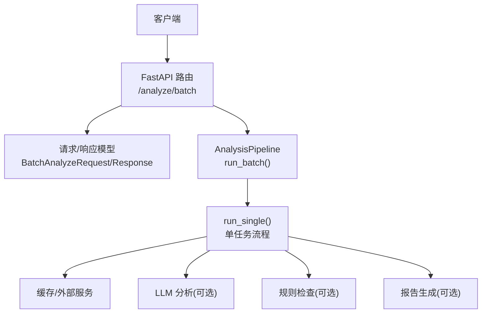
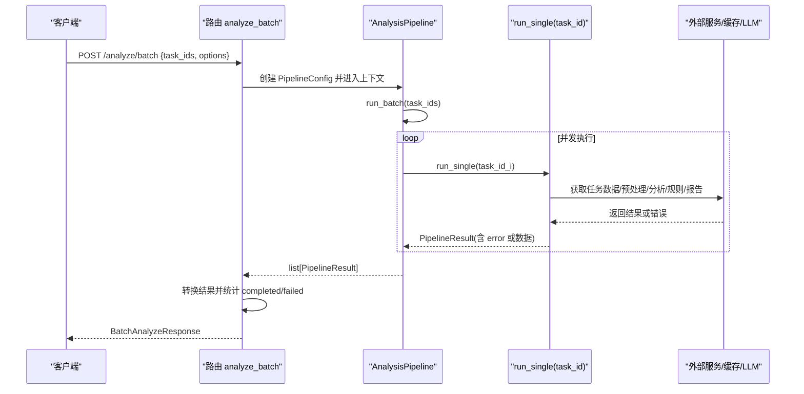
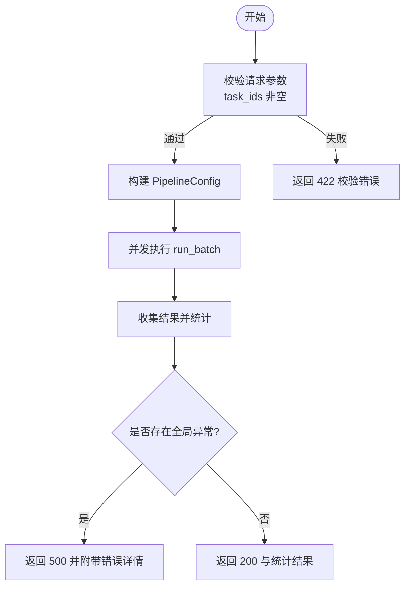
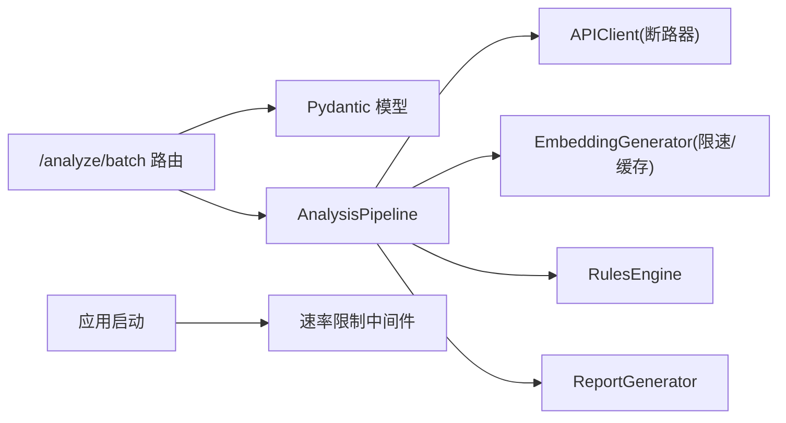

# 批量分析接口

<cite>
**本文引用的文件**   
- [src/api/routes/analyze.py](file://src/api/routes/analyze.py)
- [src/api/server_models.py](file://src/api/server_models.py)
- [src/analyzer/pipeline.py](file://src/analyzer/pipeline.py)
- [tests/api/routes/test_analyze.py](file://tests/api/routes/test_analyze.py)
- [tests/test_pipeline.py](file://tests/test_pipeline.py)
- [src/utils/circuit_breaker.py](file://src/utils/circuit_breaker.py)
- [src/embedding/generator.py](file://src/embedding/generator.py)
- [src/api/middleware.py](file://src/api/middleware.py)
</cite>

## 目录
1. [简介](#简介)
2. [项目结构](#项目结构)
3. [核心组件](#核心组件)
4. [架构总览](#架构总览)
5. [详细组件分析](#详细组件分析)
6. [依赖关系分析](#依赖关系分析)
7. [性能考虑](#性能考虑)
8. [故障排查指南](#故障排查指南)
9. [结论](#结论)
10. [附录](#附录)

## 简介
本章节面向使用“批量分析接口”的客户端开发者，提供 POST /analyze/batch 的完整 API 文档。内容涵盖请求与响应模型、约束条件、错误处理、并发控制、进度跟踪、错误恢复机制以及性能调优建议与最佳实践。该接口用于对多个任务 ID 进行并行分析，返回每个任务的独立结果及整体统计信息。

## 项目结构
与批量分析接口直接相关的代码主要分布在以下模块：
- API 路由层：定义 /analyze/batch 端点与请求/响应模型绑定
- 数据模型：Pydantic 定义的请求与响应 Schema
- 分析流水线：封装单任务与批量任务的执行逻辑（并发）
- 测试用例：覆盖成功、部分失败、异常等场景
- 支撑能力：断路器、速率限制、缓存等

图表来源
- [src/api/routes/analyze.py:122-201](file://src/api/routes/analyze.py#L122-L201)
- [src/analyzer/pipeline.py:171-182](file://src/analyzer/pipeline.py#L171-L182)

章节来源
- [src/api/routes/analyze.py:122-201](file://src/api/routes/analyze.py#L122-L201)
- [src/analyzer/pipeline.py:171-182](file://src/analyzer/pipeline.py#L171-L182)

## 核心组件
- 批量分析路由：接收 BatchAnalyzeRequest，构造 PipelineConfig，调用 AnalysisPipeline.run_batch，汇总统计并返回 BatchAnalyzeResponse。
- 数据模型：
  - AnalyzeOptions：控制是否启用缓存、LLM、标签生成、根因分析、深度根因分析、规则检查、报告生成等开关。
  - BatchAnalyzeRequest：包含 task_ids 数组与 options。
  - BatchAnalyzeResponse：包含 total_requested、total_completed、total_failed、results、analysis_time。
  - SingleAnalyzeResponse：单个任务的结果结构，包含状态、错误、标签、根因、违规、报告等字段。
- 分析流水线：
  - run_batch：基于 asyncio.gather 并发执行多个 run_single。
  - run_single：拉取任务数据、预处理、可选 LLM 分析、规则检查、报告生成，捕获异常并记录到 result.error。

章节来源
- [src/api/routes/analyze.py:122-201](file://src/api/routes/analyze.py#L122-L201)
- [src/api/server_models.py:17-42](file://src/api/server_models.py#L17-L42)
- [src/api/server_models.py:73-100](file://src/api/server_models.py#L73-L100)
- [src/analyzer/pipeline.py:105-182](file://src/analyzer/pipeline.py#L105-L182)

## 架构总览
下图展示了从 HTTP 请求到流水线执行的端到端流程，包括并发执行与结果聚合。

图表来源
- [src/api/routes/analyze.py:122-201](file://src/api/routes/analyze.py#L122-L201)
- [src/analyzer/pipeline.py:171-182](file://src/analyzer/pipeline.py#L171-L182)

## 详细组件分析

### 端点：POST /analyze/batch
- 功能概述
  - 接收一组任务 ID，按配置选项并行执行分析流水线，返回每个任务的分析结果与总体统计。
- 路径与方法
  - 路径：/analyze/batch
  - 方法：POST
  - Content-Type：application/json
- 请求体：BatchAnalyzeRequest
  - task_ids：任务 ID 列表，类型支持字符串或整数，最小长度为 1。
  - options：AnalyzeOptions，默认值见下方说明。
- 响应体：BatchAnalyzeResponse
  - total_requested：请求的任务总数
  - total_completed：完成的任务数
  - total_failed：失败的任务数
  - results：SingleAnalyzeResponse 列表，顺序与 task_ids 一一对应
  - analysis_time：总分析耗时（秒）
- 状态码
  - 200：请求成功，返回统计与结果
  - 422：请求校验失败（如 task_ids 为空或缺失）
  - 500：服务端异常（例如超时、内部错误），错误体包含 error/message/detail
- 关键行为
  - 并发执行：通过 asyncio.gather 并发运行每个任务的分析流程
  - 部分失败：单个任务失败不影响其他任务，结果中对应项 status=failed 且携带 error 信息
  - 全局异常：若批量执行过程中抛出未捕获异常，将返回 500 并附带错误详情

章节来源
- [src/api/routes/analyze.py:122-201](file://src/api/routes/analyze.py#L122-L201)
- [tests/api/routes/test_analyze.py:200-252](file://tests/api/routes/test_analyze.py#L200-L252)

### 请求模型：BatchAnalyzeRequest 与 AnalyzeOptions
- BatchAnalyzeRequest
  - task_ids：list[str | int]，最小长度 1
  - options：AnalyzeOptions
- AnalyzeOptions（字段与默认值）
  - include_code：是否包含代码变更（默认 true）
  - include_analysis：是否包含 LLM 分析（默认 true）
  - use_cache：是否使用缓存（默认 true）
  - use_llm：是否使用 LLM 分析（默认 false）
  - generate_labels：是否生成标签（默认 true）
  - analyze_root_cause：是否分析根因（默认 true）
  - analyze_root_cause_deep：是否进行深度根因分析（默认 false）
  - check_rules：是否检查规则（默认 true）
  - generate_report：是否生成报告（默认 true）

章节来源
- [src/api/server_models.py:17-42](file://src/api/server_models.py#L17-L42)

### 响应模型：BatchAnalyzeResponse 与 SingleAnalyzeResponse
- BatchAnalyzeResponse
  - total_requested：int
  - total_completed：int
  - total_failed：int
  - results：list[SingleAnalyzeResponse]
  - analysis_time：float（秒）
- SingleAnalyzeResponse（关键字段）
  - task_id：str
  - status：pending/completed/failed
  - error：错误信息（失败时非空）
  - labels：标签列表
  - root_causes：根因列表
  - deep_root_causes：深度根因分析结果
  - violations：违规列表
  - suggestions：改进建议
  - report：分析报告
  - analysis_time：分析耗时（秒）
  - cached：是否来自缓存

章节来源
- [src/api/server_models.py:73-100](file://src/api/server_models.py#L73-L100)

### 批量处理流程与并发控制
- 并发策略
  - 使用 asyncio.gather 并发执行所有任务，不设置最大并发上限；当任务量较大时，需结合外部限流与资源管理避免过载。
- 错误隔离
  - 单个任务异常被捕获并写入 PipelineResult.error，不会中断其他任务；最终由路由统计 completed/failed。
- 进度跟踪
  - 当前实现为同步返回全部结果，无中间进度回调；如需长任务进度，可在上层引入异步任务队列与轮询/事件推送机制。
- 错误恢复
  - 外部服务调用具备断路器保护（在相关组件中实现），可防止级联故障；批量层面未内置重试，建议在客户端实现幂等重试与去重。

图表来源
- [src/api/routes/analyze.py:122-201](file://src/api/routes/analyze.py#L122-L201)
- [src/analyzer/pipeline.py:171-182](file://src/analyzer/pipeline.py#L171-L182)

章节来源
- [src/analyzer/pipeline.py:171-182](file://src/analyzer/pipeline.py#L171-L182)
- [tests/test_pipeline.py:498-558](file://tests/test_pipeline.py#L498-L558)

### 示例：JSON 请求与响应
- 成功场景（两个任务均完成）
  - 请求体示例（示意）
    - task_ids: [1001, 1002]
    - options: {use_cache: true, use_llm: false, generate_labels: true, analyze_root_cause: true, analyze_root_cause_deep: false, check_rules: true, generate_report: true}
  - 响应体示例（示意）
    - total_requested: 2
    - total_completed: 2
    - total_failed: 0
    - results: [
        {task_id: "1001", status: "completed", ...},
        {task_id: "1002", status: "completed", ...}
      ]
    - analysis_time: 数值（秒）
- 部分失败场景（一个成功，一个失败）
  - 请求体同上
  - 响应体示例（示意）
    - total_requested: 2
    - total_completed: 1
    - total_failed: 1
    - results: [
        {task_id: "1001", status: "completed", ...},
        {task_id: "1002", status: "failed", error: "Task not found"}
      ]
    - analysis_time: 数值（秒）

说明：以上为结构化示例，具体字段取值以实际实现为准。

章节来源
- [tests/api/routes/test_analyze.py:200-252](file://tests/api/routes/test_analyze.py#L200-L252)

## 依赖关系分析
- 路由层依赖
  - FastAPI 路由与 Pydantic 模型绑定
  - 分析流水线 AnalysisPipeline
- 流水线依赖
  - 外部 API 客户端（带断路器保护）
  - 嵌入向量生成器（带自适应限速与缓存）
  - 规则引擎与报告生成器
- 中间件
  - 全局速率限制（每分钟请求数）

图表来源
- [src/api/routes/analyze.py:122-201](file://src/api/routes/analyze.py#L122-L201)
- [src/analyzer/pipeline.py:171-182](file://src/analyzer/pipeline.py#L171-L182)
- [src/utils/circuit_breaker.py:36-186](file://src/utils/circuit_breaker.py#L36-L186)
- [src/embedding/generator.py:54-81](file://src/embedding/generator.py#L54-L81)
- [src/api/middleware.py:64-137](file://src/api/middleware.py#L64-L137)

章节来源
- [src/utils/circuit_breaker.py:36-186](file://src/utils/circuit_breaker.py#L36-L186)
- [src/embedding/generator.py:54-81](file://src/embedding/generator.py#L54-L81)
- [src/api/middleware.py:64-137](file://src/api/middleware.py#L64-L137)

## 性能考虑
- 并发度控制
  - 当前 run_batch 使用 asyncio.gather 无上限并发，建议在上层增加并发上限（如信号量或任务池），以避免外部服务过载与内存峰值过高。
- 速率限制
  - 应用层已提供每分钟请求数限制中间件；对于大批量任务，建议分批次提交，避免触发限流。
- 缓存与复用
  - 开启 use_cache 可减少重复计算；嵌入向量生成器具备本地缓存与 LRU 淘汰策略，有助于降低重复请求开销。
- 外部服务保护
  - 使用断路器保护外部 API 调用，避免雪崩效应；合理设置失败阈值与恢复时间。
- 资源清理
  - 使用上下文管理器确保外部连接正确关闭，避免资源泄漏。

章节来源
- [src/analyzer/pipeline.py:171-182](file://src/analyzer/pipeline.py#L171-L182)
- [src/embedding/generator.py:54-81](file://src/embedding/generator.py#L54-L81)
- [src/utils/circuit_breaker.py:36-186](file://src/utils/circuit_breaker.py#L36-L186)
- [src/api/middleware.py:64-137](file://src/api/middleware.py#L64-L137)

## 故障排查指南
- 常见错误与定位
  - 422 校验错误：检查 task_ids 是否为空或缺失；确认字段类型与必填项。
  - 500 服务端错误：查看错误体中的 error/message/detail；可能由外部服务超时、内部异常引起。
  - 部分失败：检查 results 中 status=failed 的条目及其 error 信息，定位具体任务问题。
- 日志与监控
  - 路由与分析流水线会记录关键步骤与异常；建议结合应用日志与指标进行追踪。
- 重试与幂等
  - 批量接口未内置重试；客户端可实现幂等重试（基于 task_id 去重），并对失败任务单独重试。

章节来源
- [tests/api/routes/test_analyze.py:200-252](file://tests/api/routes/test_analyze.py#L200-L252)
- [src/api/routes/analyze.py:122-201](file://src/api/routes/analyze.py#L122-L201)

## 结论
POST /analyze/batch 提供了高效的多任务分析能力，通过并发执行与结果聚合简化了批量处理流程。结合缓存、速率限制与断路器，系统具备良好的可扩展性与稳定性。生产环境建议在上层增加并发上限、分批提交与重试策略，以获得更稳定的吞吐与更好的用户体验。

## 附录

### 约束与限制
- 请求参数
  - task_ids 必须为非空列表，最小长度为 1
  - options 各开关可按需启用/禁用，默认值见 AnalyzeOptions
- 并发与资源
  - 当前实现无并发上限，大规模任务需自行控制批次大小
  - 外部服务调用受断路器与速率限制保护
- 错误处理
  - 单个任务失败不影响整体返回；全局异常将导致 500 响应

章节来源
- [src/api/server_models.py:17-42](file://src/api/server_models.py#L17-L42)
- [src/analyzer/pipeline.py:171-182](file://src/analyzer/pipeline.py#L171-L182)
- [src/utils/circuit_breaker.py:36-186](file://src/utils/circuit_breaker.py#L36-L186)
- [src/api/middleware.py:64-137](file://src/api/middleware.py#L64-L137)
