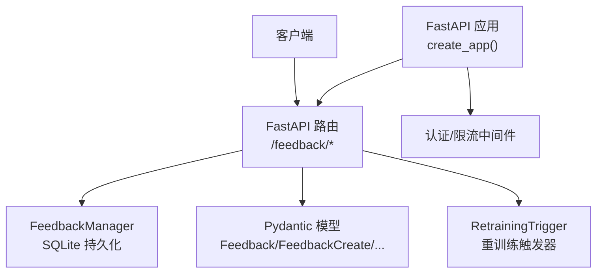
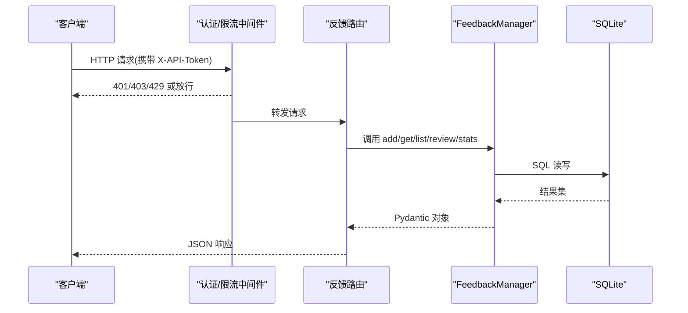
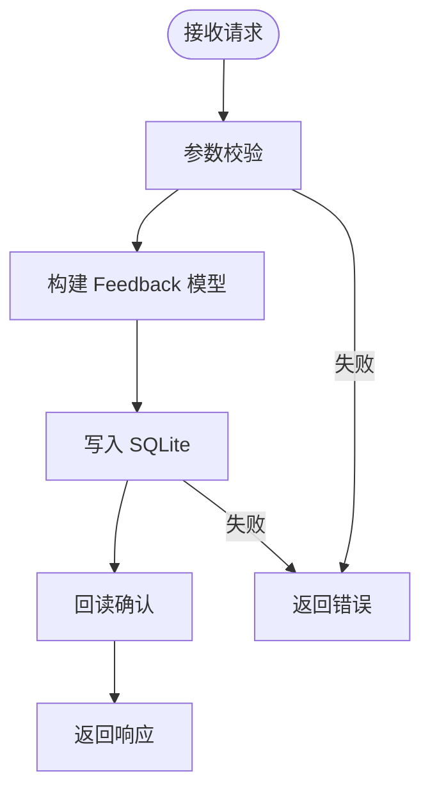
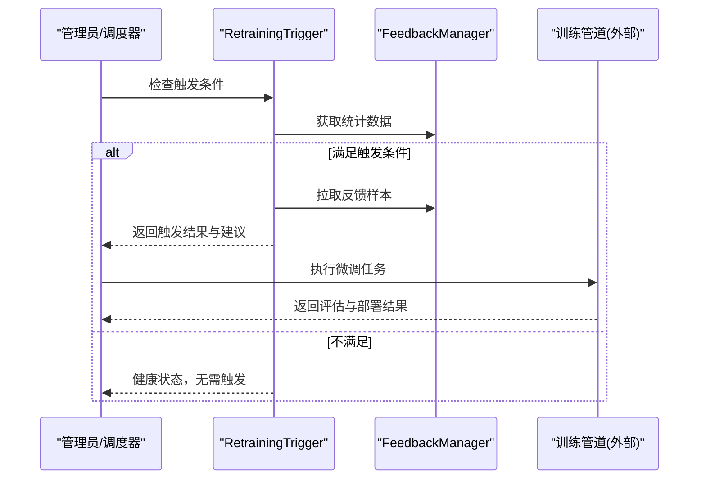

# 反馈接口

<cite>
**本文引用的文件列表**
- [src/api/routes/feedback.py](file://src/api/routes/feedback.py)
- [src/feedback/models.py](file://src/feedback/models.py)
- [src/feedback/manager.py](file://src/feedback/manager.py)
- [src/feedback/trigger.py](file://src/feedback/trigger.py)
- [src/api/server.py](file://src/api/server.py)
- [src/api/middleware.py](file://src/api/middleware.py)
- [tests/api/routes/test_feedback.py](file://tests/api/routes/test_feedback.py)
- [example_feedback.py](file://example_feedback.py)
</cite>

## 目录
1. [简介](#简介)
2. [项目结构](#项目结构)
3. [核心组件](#核心组件)
4. [架构总览](#架构总览)
5. [详细组件分析](#详细组件分析)
6. [依赖关系分析](#依赖关系分析)
7. [性能与可扩展性](#性能与可扩展性)
8. [故障排查指南](#故障排查指南)
9. [结论](#结论)
10. [附录：API 定义与最佳实践](#附录api-定义与最佳实践)

## 简介
本文件为“反馈管理接口”的完整 API 文档，覆盖用户反馈提交、查询与管理的所有端点，包括 POST /feedback 与反馈统计查询。文档详细说明反馈数据的完整 Schema（含 task_id、feedback_type、content/rating 等字段映射）、处理流程、审核机制与质量评估标准；提供统计分析接口与可视化展示方案；说明反馈对模型训练的反馈循环机制；并给出隐私保护与安全管理的措施以及集成最佳实践与常见问题解决方案。

## 项目结构
反馈功能由 FastAPI 路由层、领域模型、持久化管理器与触发器组成，并通过全局中间件实现认证与限流。



图表来源
- [src/api/routes/feedback.py:1-157](file://src/api/routes/feedback.py#L1-L157)
- [src/feedback/manager.py:1-279](file://src/feedback/manager.py#L1-L279)
- [src/feedback/models.py:1-75](file://src/feedback/models.py#L1-L75)
- [src/feedback/trigger.py:1-151](file://src/feedback/trigger.py#L1-L151)
- [src/api/server.py:38-111](file://src/api/server.py#L38-L111)
- [src/api/middleware.py:62-141](file://src/api/middleware.py#L62-L141)

章节来源
- [src/api/server.py:38-111](file://src/api/server.py#L38-L111)
- [src/api/routes/feedback.py:1-157](file://src/api/routes/feedback.py#L1-L157)

## 核心组件
- 路由层：定义 /feedback 相关 REST 端点，负责参数校验、调用业务逻辑、返回统一响应。
- 数据模型：使用 Pydantic 定义请求/响应结构与枚举类型，确保输入输出一致性。
- 持久化：基于 SQLite 的 FeedbackManager，提供增删改查与统计聚合。
- 触发器：基于反馈指标自动判断是否触发模型微调，并提供改进建议与训练样本准备。
- 安全与限流：全局 Token 校验与速率限制中间件，保障接口访问安全与稳定性。

章节来源
- [src/api/routes/feedback.py:1-157](file://src/api/routes/feedback.py#L1-L157)
- [src/feedback/models.py:1-75](file://src/feedback/models.py#L1-L75)
- [src/feedback/manager.py:1-279](file://src/feedback/manager.py#L1-L279)
- [src/feedback/trigger.py:1-151](file://src/feedback/trigger.py#L1-L151)
- [src/api/middleware.py:62-141](file://src/api/middleware.py#L62-L141)

## 架构总览
下图展示了从客户端到数据库的端到端调用路径，以及认证与限流在请求链路中的位置。



图表来源
- [src/api/middleware.py:81-141](file://src/api/middleware.py#L81-L141)
- [src/api/routes/feedback.py:38-156](file://src/api/routes/feedback.py#L38-L156)
- [src/feedback/manager.py:53-265](file://src/feedback/manager.py#L53-L265)

## 详细组件分析

### 数据模型与字段规范
- 反馈类型枚举：标签纠正、根因纠正、误报、漏报、一般反馈。
- 评分枚举：1~5 分，分别对应非常差到优秀。
- 核心字段：
  - id：UUID 字符串，系统生成。
  - task_id：关联任务标识。
  - feedback_type：反馈类型。
  - original_result：原始分析结果（JSON）。
  - corrected_result：纠正后的结果（可选，JSON）。
  - rating：评分（1~5）。
  - comment：备注（可选）。
  - created_by：创建者标识。
  - created_at：创建时间。
  - reviewed：是否已审核。
  - reviewed_by：审核人。
  - reviewed_at：审核时间。

注意：当前模型未包含 content 字段。若需支持自由文本内容，可在模型中新增 comment 或新增 content 字段并在路由层同步更新。

章节来源
- [src/feedback/models.py:10-75](file://src/feedback/models.py#L10-L75)

### 反馈提交接口 POST /feedback
- 功能：创建一条反馈记录。
- 请求体字段：task_id、feedback_type、original_result、corrected_result（可选）、rating、comment（可选）、created_by。
- 成功响应：返回完整的反馈对象（含 id、时间戳、reviewed 状态等）。
- 错误码：
  - 400：请求体验证失败（由框架自动返回）。
  - 500：后端写入或读取异常。

章节来源
- [src/api/routes/feedback.py:38-66](file://src/api/routes/feedback.py#L38-L66)
- [src/feedback/models.py:42-54](file://src/feedback/models.py#L42-L54)

### 获取反馈详情 GET /feedback/{feedback_id}
- 功能：根据反馈 ID 获取详情。
- 成功响应：返回单个反馈对象。
- 错误码：
  - 404：未找到反馈。

章节来源
- [src/api/routes/feedback.py:68-77](file://src/api/routes/feedback.py#L68-L77)

### 按任务查询反馈 GET /feedback/task/{task_id}
- 功能：返回指定任务的所有反馈，按创建时间倒序。
- 成功响应：反馈对象数组。

章节来源
- [src/api/routes/feedback.py:80-86](file://src/api/routes/feedback.py#L80-L86)

### 分页与筛选列表 GET /feedback
- 查询参数：
  - feedback_type：按类型筛选（可选）。
  - rating：按评分筛选，范围 1~5（可选）。
  - reviewed：按审核状态筛选（可选）。
  - limit：每页数量，默认 100，范围 1~1000。
  - offset：偏移量，默认 0。
- 成功响应：包含 total、items、offset、limit 的分页结构。
- 注意：当前实现通过两次全量计数计算 total，存在性能隐患，详见“性能与可扩展性”。

章节来源
- [src/api/routes/feedback.py:89-122](file://src/api/routes/feedback.py#L89-L122)
- [src/feedback/manager.py:142-192](file://src/feedback/manager.py#L142-L192)

### 审核反馈 POST /feedback/{feedback_id}/review
- 功能：将反馈标记为已审核，记录审核人与时间。
- 请求体：reviewed_by。
- 成功响应：返回更新后的反馈对象。
- 错误码：
  - 404：反馈不存在。
  - 500：获取更新后对象失败。

章节来源
- [src/api/routes/feedback.py:125-141](file://src/api/routes/feedback.py#L125-L141)
- [src/feedback/manager.py:194-211](file://src/feedback/manager.py#L194-L211)

### 反馈统计 GET /feedback/stats/summary
- 功能：返回总体统计信息，包括总数、按类型分布、按评分分布、已审核数、纠错率、好评率。
- 成功响应：包含 total_feedback、by_type、by_rating、reviewed_count、correction_ratio、positive_ratio。

章节来源
- [src/api/routes/feedback.py:143-156](file://src/api/routes/feedback.py#L143-L156)
- [src/feedback/manager.py:213-265](file://src/feedback/manager.py#L213-L265)

### 数据处理与存储流程
- 入库：将 original_result/corrected_result 序列化为 JSON 文本存储，时间字段以 ISO 格式保存。
- 查询：读取时反序列化 JSON，解析日期时间，构造 Pydantic 对象返回。
- 索引：针对 task_id、feedback_type、rating、reviewed 建立索引以提升查询性能。



图表来源
- [src/feedback/manager.py:53-81](file://src/feedback/manager.py#L53-L81)
- [src/feedback/manager.py:83-111](file://src/feedback/manager.py#L83-L111)
- [src/feedback/manager.py:142-192](file://src/feedback/manager.py#L142-L192)

### 审核机制与质量评估
- 审核流程：通过 review 接口将 reviewed 置为真，并记录 reviewed_by 与 reviewed_at。
- 质量指标：
  - 纠错率 = (标签纠正 + 根因纠正) / 总反馈数。
  - 好评率 = 评分≥4 的反馈数 / 总反馈数。
- 用途：用于触发重训练与模型改进建议。

章节来源
- [src/feedback/manager.py:213-265](file://src/feedback/manager.py#L213-L265)

### 反馈驱动的模型训练闭环
- 触发条件（可配置）：
  - 最小反馈总量阈值。
  - 最大纠错率阈值（超过则触发）。
  - 最小好评率阈值（低于则触发）。
- 触发动作：
  - 生成改进建议（如标签生成、根因分析、聚类模型）。
  - 准备训练样本（original_result、corrected_result、类型与评分）。
  - 输出下一步操作指引（导出数据、启动微调、评估、部署）。



图表来源
- [src/feedback/trigger.py:24-151](file://src/feedback/trigger.py#L24-L151)
- [src/feedback/manager.py:213-265](file://src/feedback/manager.py#L213-L265)

章节来源
- [src/feedback/trigger.py:1-151](file://src/feedback/trigger.py#L1-L151)

## 依赖关系分析
- 路由层依赖：
  - FeedbackManager：所有 CRUD 与统计。
  - Pydantic 模型：请求/响应结构。
- 中间件依赖：
  - TokenValidator：Token 白名单校验。
  - RateLimiter：每分钟请求次数限制。
- 应用装配：
  - create_app 注册路由与中间件，暴露 OpenAPI 文档。

```mermaid
classDiagram
class FeedbackManager {
+add_feedback(feedback) str
+get_feedback(id) Feedback
+get_feedback_by_task(task_id) list[Feedback]
+list_feedback(...) list[Feedback]
+review_feedback(id, by) bool
+get_statistics() dict
}
class RetrainingTrigger {
+should_trigger_retraining() (bool, dict)
+get_retraining_recommendations() list
+trigger_retraining_pipeline() dict
}
class FeedbackRoutes {
+POST /feedback
+GET /feedback/{id}
+GET /feedback/task/{task_id}
+GET /feedback
+POST /feedback/{id}/review
+GET /feedback/stats/summary
}
class TokenValidator {
+is_valid(token) bool
}
class RateLimiter {
+is_allowed(identifier) (bool, int)
}
FeedbackRoutes --> FeedbackManager : "依赖"
RetrainingTrigger --> FeedbackManager : "依赖"
FeedbackRoutes --> TokenValidator : "受中间件保护"
FeedbackRoutes --> RateLimiter : "受中间件保护"
```

图表来源
- [src/api/routes/feedback.py:1-157](file://src/api/routes/feedback.py#L1-L157)
- [src/feedback/manager.py:1-279](file://src/feedback/manager.py#L1-L279)
- [src/feedback/trigger.py:1-151](file://src/feedback/trigger.py#L1-L151)
- [src/api/middleware.py:48-141](file://src/api/middleware.py#L48-L141)

章节来源
- [src/api/server.py:38-111](file://src/api/server.py#L38-L111)
- [src/api/middleware.py:62-141](file://src/api/middleware.py#L62-L141)

## 性能与可扩展性
- 列表分页 total 计算：当前通过再次全量查询计算总数，在大表场景下开销较大。建议：
  - 单独 COUNT(*) 查询优化。
  - 引入缓存（如 Redis）缓存统计结果，设置合理过期策略。
- 索引优化：已对常用过滤字段建索引，建议结合业务热点增加复合索引（如 type+reviewed）。
- 连接池：SQLite 并发写受限，生产环境建议迁移至 PostgreSQL/MySQL，并使用连接池。
- 批量写入：对于高吞吐采集场景，采用事务批量插入减少 IO 次数。
- 异步化：可将统计与触发检查放入后台任务队列，避免阻塞主请求。

章节来源
- [src/api/routes/feedback.py:109-122](file://src/api/routes/feedback.py#L109-L122)
- [src/feedback/manager.py:43-47](file://src/feedback/manager.py#L43-L47)

## 故障排查指南
- 401 未授权：缺少 X-API-Token 或 api_token。
- 403 禁止访问：Token 不在有效列表中。
- 429 请求过多：超出速率限制，等待重试。
- 404 未找到：反馈 ID 不存在。
- 500 服务器错误：写入或读取异常，查看日志定位具体原因。
- 调试建议：
  - 开启日志中间件，观察请求/响应耗时与错误堆栈。
  - 检查 SQLite 文件权限与磁盘空间。
  - 验证 Pydantic 模型字段是否符合预期。

章节来源
- [src/api/middleware.py:81-141](file://src/api/middleware.py#L81-L141)
- [src/api/routes/feedback.py:59-66](file://src/api/routes/feedback.py#L59-L66)
- [src/api/routes/feedback.py:132-141](file://src/api/routes/feedback.py#L132-L141)

## 结论
反馈接口提供了完整的反馈采集、查询、审核与统计能力，并与重训练触发器形成闭环，有助于持续改进模型质量。建议在后续迭代中完善分页统计性能、增强安全策略（如 HTTPS、审计日志）、扩展可视化与告警能力，以满足生产环境的稳定性与合规要求。

## 附录：API 定义与最佳实践

### 端点清单
- POST /feedback：创建反馈
- GET /feedback/{feedback_id}：获取反馈详情
- GET /feedback/task/{task_id}：按任务查询反馈
- GET /feedback：分页与筛选列表
- POST /feedback/{feedback_id}/review：审核反馈
- GET /feedback/stats/summary：反馈统计

章节来源
- [src/api/routes/feedback.py:38-156](file://src/api/routes/feedback.py#L38-L156)

### 请求/响应示例要点
- 创建反馈请求体关键字段：task_id、feedback_type、original_result、corrected_result（可选）、rating、comment（可选）、created_by。
- 列表响应结构：total、items、offset、limit。
- 统计响应结构：total_feedback、by_type、by_rating、reviewed_count、correction_ratio、positive_ratio。

章节来源
- [src/feedback/models.py:42-75](file://src/feedback/models.py#L42-L75)
- [src/api/routes/feedback.py:89-156](file://src/api/routes/feedback.py#L89-L156)

### 安全与隐私保护
- 认证：通过 X-API-Token 或 api_token 进行白名单校验。
- 限流：按 token/IP 维度限制每分钟请求数，超限返回 429。
- 传输安全：生产环境启用 HTTPS，避免明文传输 Token。
- 数据脱敏：original_result/corrected_result 可能包含敏感信息，建议在上游进行脱敏或加密存储。
- 访问审计：利用日志中间件记录关键操作，结合集中式日志系统进行审计追踪。

章节来源
- [src/api/middleware.py:81-141](file://src/api/middleware.py#L81-L141)
- [src/api/server.py:81-93](file://src/api/server.py#L81-L93)

### 可视化展示方案
- 仪表盘指标：
  - 总反馈数、已审核数、纠错率、好评率趋势图。
  - 按类型分布饼图/柱状图。
  - 按评分分布直方图。
- 数据来源：
  - 实时：直接调用 /feedback/stats/summary。
  - 历史：定时任务拉取并落库，供 BI 工具消费。
- 交互建议：
  - 支持按时间范围、类型、评分筛选。
  - 点击某类反馈跳转到任务详情页，便于人工复核。

章节来源
- [src/api/routes/feedback.py:143-156](file://src/api/routes/feedback.py#L143-L156)

### 集成最佳实践
- 客户端侧：
  - 统一封装 Token 注入与重试退避策略。
  - 对列表接口实现分页游标或基于时间的增量拉取。
- 服务端侧：
  - 为高频查询添加缓存层。
  - 将统计与触发检查异步化，降低主链路延迟。
- 测试与回归：
  - 参考单元测试用例，覆盖正常路径与边界条件。
  - 使用 Mock 隔离数据库与外部依赖。

章节来源
- [tests/api/routes/test_feedback.py:76-287](file://tests/api/routes/test_feedback.py#L76-L287)
- [example_feedback.py:14-156](file://example_feedback.py#L14-L156)

### 常见问题与解决
- Q：为什么列表 total 不准确或慢？
  - A：当前实现通过全量计数，建议改为独立 COUNT 查询或引入缓存。
- Q：如何开启 Token 校验？
  - A：在环境变量中配置 API_VALID_TOKENS，或通过 create_app 传入 valid_tokens。
- Q：如何调整限流阈值？
  - A：通过 API_RATE_LIMIT 环境变量或 create_app 的 rate_limit_requests 参数配置。
- Q：如何扩展 content 字段？
  - A：在模型中添加 content 字段，并在路由层同步更新请求/响应结构。

章节来源
- [src/api/server.py:124-138](file://src/api/server.py#L124-L138)
- [src/api/middleware.py:16-46](file://src/api/middleware.py#L16-L46)
- [src/feedback/models.py:26-54](file://src/feedback/models.py#L26-L54)
