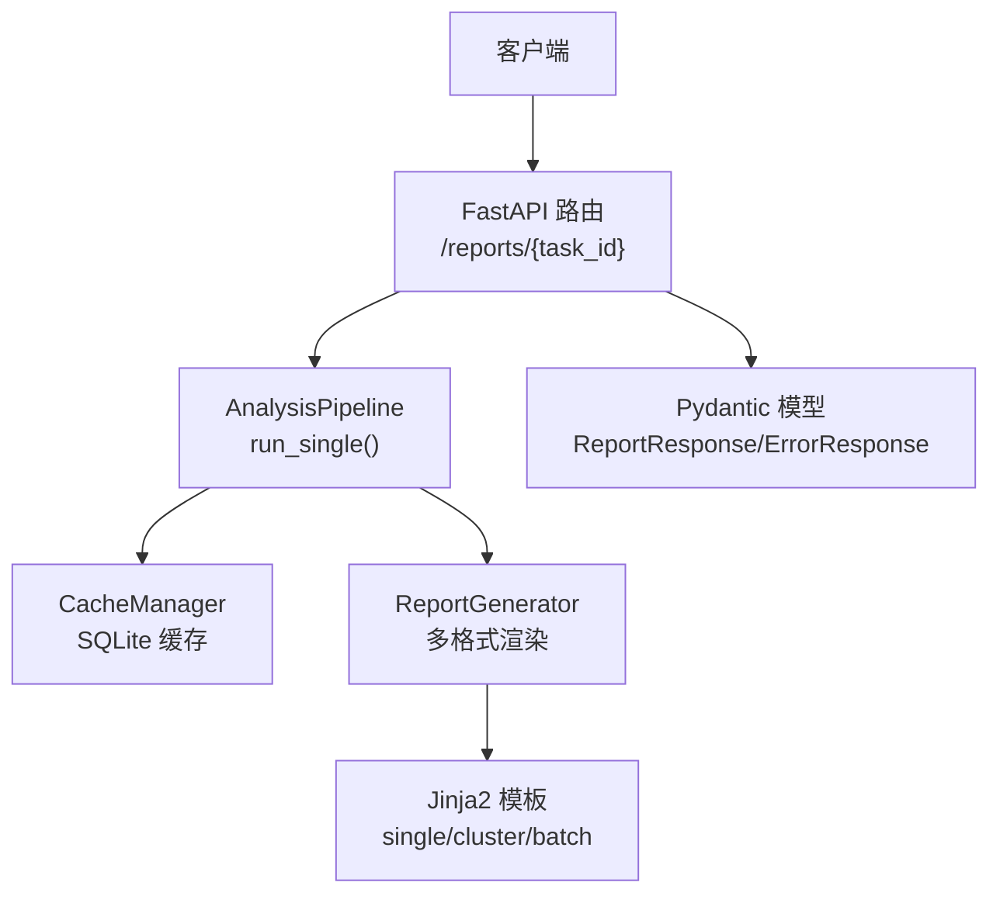
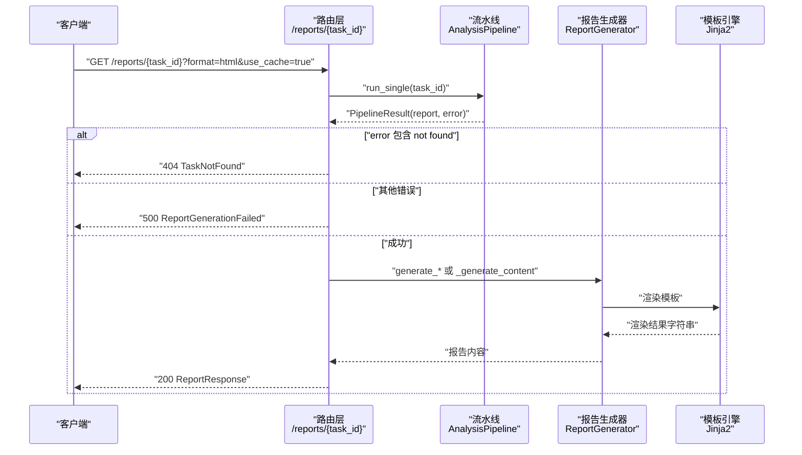
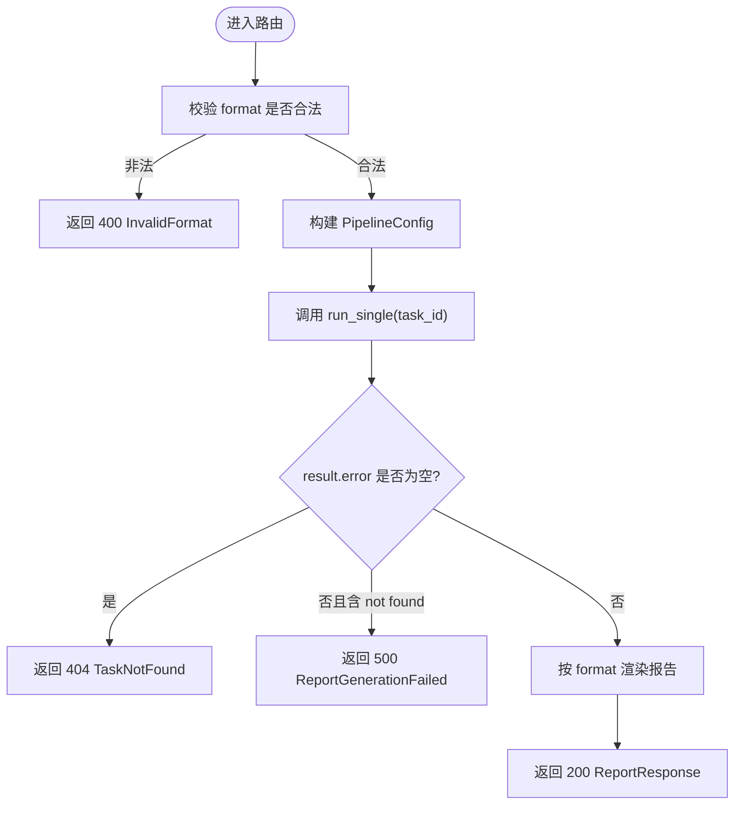
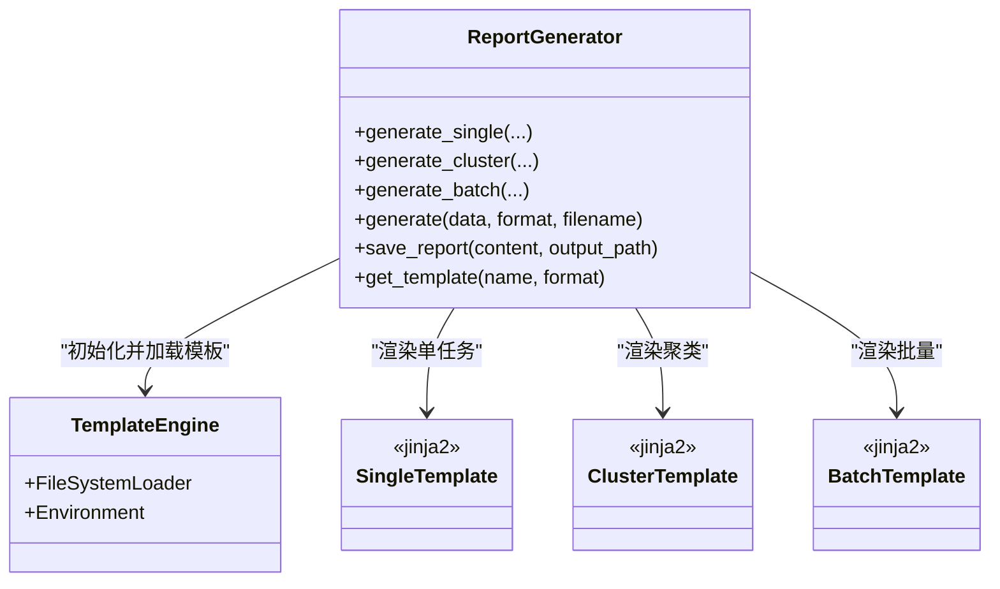
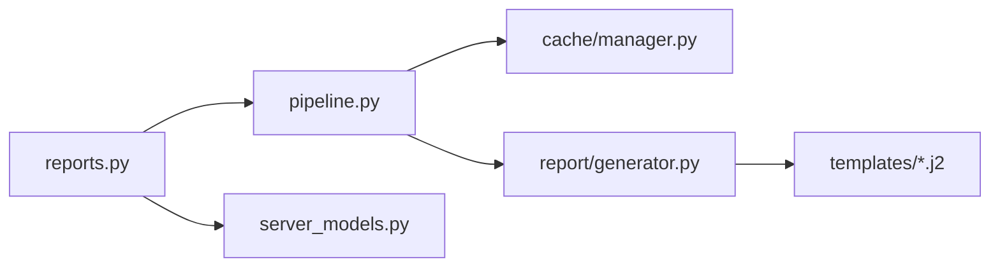

# 报告接口

<cite>
**本文引用的文件**
- [src/api/routes/reports.py](file://src/api/routes/reports.py)
- [src/api/server_models.py](file://src/api/server_models.py)
- [src/analyzer/pipeline.py](file://src/analyzer/pipeline.py)
- [src/report/generator.py](file://src/report/generator.py)
- [src/report/models.py](file://src/report/models.py)
- [src/report/templates/single.md.j2](file://src/report/templates/single.md.j2)
- [src/report/templates/cluster.md.j2](file://src/report/templates/cluster.md.j2)
- [src/report/templates/batch.md.j2](file://src/report/templates/batch.md.j2)
- [tests/api/routes/test_reports.py](file://tests/api/routes/test_reports.py)
- [src/cli/commands/report.py](file://src/cli/commands/report.py)
- [src/cache/manager.py](file://src/cache/manager.py)
</cite>

## 目录
1. [简介](#简介)
2. [项目结构](#项目结构)
3. [核心组件](#核心组件)
4. [架构总览](#架构总览)
5. [详细组件分析](#详细组件分析)
6. [依赖关系分析](#依赖关系分析)
7. [性能与扩展性](#性能与扩展性)
8. [故障排查指南](#故障排查指南)
9. [结论](#结论)
10. [附录：API 规范与示例](#附录api-规范与示例)

## 简介
本文件为“报告生成接口”的完整 API 文档，覆盖以下能力：
- 报告查询与获取：GET /reports/{task_id}
- 报告格式选择：html、markdown、json（PDF 在生成器层支持，但当前路由未开放）
- 报告模板定制与个性化配置
- 报告内容结构与字段说明
- 批量报告生成与定时任务方案
- 存储策略、版本管理与访问控制建议
- 报告预览与在线查看集成示例

## 项目结构
与报告接口相关的代码主要分布在如下模块：
- API 路由层：定义 REST 端点与参数校验
- 流水线层：负责拉取数据、预处理、分析与报告生成编排
- 报告生成器：提供多格式渲染与模板机制
- 模型与模板：结构化数据模型与 Jinja2 模板
- 缓存与 CLI：本地缓存与命令行工具辅助生成与列举报告

图表来源
- [src/api/routes/reports.py:16-130](file://src/api/routes/reports.py#L16-L130)
- [src/analyzer/pipeline.py:105-170](file://src/analyzer/pipeline.py#L105-L170)
- [src/report/generator.py:222-424](file://src/report/generator.py#L222-L424)
- [src/report/templates/single.md.j2:1-58](file://src/report/templates/single.md.j2#L1-L58)
- [src/api/server_models.py:143-159](file://src/api/server_models.py#L143-L159)

章节来源
- [src/api/routes/reports.py:16-130](file://src/api/routes/reports.py#L16-L130)
- [src/analyzer/pipeline.py:105-170](file://src/analyzer/pipeline.py#L105-L170)
- [src/report/generator.py:222-424](file://src/report/generator.py#L222-L424)
- [src/api/server_models.py:143-159](file://src/api/server_models.py#L143-L159)

## 核心组件
- 路由层
  - GET /reports/{task_id}：根据 task_id 获取分析报告，支持 format 与 use_cache 查询参数。
  - 返回统一响应体 ReportResponse，包含 task_id、report_format、content、generated_at。
- 流水线层
  - AnalysisPipeline.run_single(task_id)：拉取任务数据、预处理、可选 LLM 分析、规则检查、生成报告。
  - 通过 PipelineConfig 控制是否使用缓存、是否启用 LLM、是否生成报告等。
- 报告生成器
  - ReportGenerator：支持 Markdown、HTML、JSON、PDF（PDF 当前以 HTML 包装）。
  - 支持自定义模板目录，优先加载用户模板，失败回退到内置默认模板。
- 数据模型
  - ReportResponse、ErrorResponse：用于 API 请求/响应的 Pydantic 模型。
  - 报告数据结构：AnalysisReport、ClusterReport、BatchReport、ReportData 等。

章节来源
- [src/api/routes/reports.py:16-130](file://src/api/routes/reports.py#L16-L130)
- [src/analyzer/pipeline.py:35-76](file://src/analyzer/pipeline.py#L35-L76)
- [src/report/generator.py:222-424](file://src/report/generator.py#L222-L424)
- [src/api/server_models.py:143-159](file://src/api/server_models.py#L143-L159)
- [src/report/models.py:1-52](file://src/report/models.py#L1-L52)

## 架构总览
报告获取流程从 HTTP 请求开始，经路由解析、流水线执行、报告生成，最终返回结构化响应。

图表来源
- [src/api/routes/reports.py:16-130](file://src/api/routes/reports.py#L16-L130)
- [src/analyzer/pipeline.py:105-170](file://src/analyzer/pipeline.py#L105-L170)
- [src/report/generator.py:250-424](file://src/report/generator.py#L250-L424)
- [src/report/templates/single.md.j2:1-58](file://src/report/templates/single.md.j2#L1-L58)

## 详细组件分析

### 端点：GET /reports/{task_id}
- 路径与参数
  - 路径：/reports/{task_id}
  - 查询参数：
    - format：报告格式，取值 html/markdown/json；默认 html
    - use_cache：是否使用缓存，布尔值；默认 true
- 行为说明
  - 校验 format 是否在允许集合内，否则返回 400 InvalidFormat
  - 构造 PipelineConfig，仅开启 generate_report，关闭 LLM 相关步骤以提升性能
  - 调用 AnalysisPipeline.run_single(task_id) 获取 PipelineResult
  - 若 result.error 包含 "not found"，返回 404 TaskNotFound
  - 其他错误返回 500 ReportGenerationFailed
  - 成功时返回 ReportResponse，包含 task_id、report_format、content、generated_at
- 响应模型
  - ReportResponse：task_id、report_format、content、generated_at
  - ErrorResponse：error、message、detail、timestamp

图表来源
- [src/api/routes/reports.py:16-130](file://src/api/routes/reports.py#L16-L130)
- [src/analyzer/pipeline.py:105-170](file://src/analyzer/pipeline.py#L105-L170)

章节来源
- [src/api/routes/reports.py:16-130](file://src/api/routes/reports.py#L16-L130)
- [src/api/server_models.py:143-159](file://src/api/server_models.py#L143-L159)
- [tests/api/routes/test_reports.py:28-166](file://tests/api/routes/test_reports.py#L28-L166)

### 报告格式与响应内容
- 支持的格式
  - markdown：Markdown 文本
  - html：HTML 文本
  - json：JSON 文本（当前路由直接返回原格式内容；生成器层可对单任务/聚类/批量输出 JSON）
  - pdf：生成器层支持（当前路由未开放 PDF 格式，会返回 400）
- 响应体
  - ReportResponse.content：对应格式的文本内容
  - ReportResponse.report_format：实际使用的格式
  - ReportResponse.generated_at：生成时间戳

章节来源
- [src/api/routes/reports.py:46-105](file://src/api/routes/reports.py#L46-L105)
- [src/report/generator.py:222-424](file://src/report/generator.py#L222-L424)
- [src/api/server_models.py:143-159](file://src/api/server_models.py#L143-L159)

### 报告模板定制与个性化配置
- 模板目录
  - 可通过 ReportGenerator(template_dir=...) 指定自定义模板目录
  - 优先加载用户模板，失败则回退到内置默认模板
- 内置模板
  - single.md.j2：单任务报告模板
  - cluster.md.j2：聚类报告模板
  - batch.md.j2：批量报告模板
- 模板变量
  - 单任务：task_id、title、summary、segments、labels、root_causes、suggestions、metadata.generated_at
  - 聚类：cluster_id、task_count、labels、common_root_causes、summary、suggestions
  - 批量：total_tasks、cluster_count、cluster_reports、recommendations、generated_at

图表来源
- [src/report/generator.py:222-424](file://src/report/generator.py#L222-L424)
- [src/report/templates/single.md.j2:1-58](file://src/report/templates/single.md.j2#L1-L58)
- [src/report/templates/cluster.md.j2:1-36](file://src/report/templates/cluster.md.j2#L1-L36)
- [src/report/templates/batch.md.j2:1-31](file://src/report/templates/batch.md.j2#L1-L31)

章节来源
- [src/report/generator.py:222-424](file://src/report/generator.py#L222-L424)
- [src/report/templates/single.md.j2:1-58](file://src/report/templates/single.md.j2#L1-L58)
- [src/report/templates/cluster.md.j2:1-36](file://src/report/templates/cluster.md.j2#L1-L36)
- [src/report/templates/batch.md.j2:1-31](file://src/report/templates/batch.md.j2#L1-L31)

### 报告内容结构与字段说明
- 单任务报告（AnalysisReport）
  - task_id、title、summary
  - segments：分段信息列表
  - labels：标签列表（name、category、confidence、description）
  - root_causes：根因列表（cause_type、description、evidence、confidence）
  - suggestions：改进建议列表
  - sections：结构化章节列表
  - metadata：元数据字典
- 聚类报告（ClusterReport）
  - cluster_id、task_count、labels、common_root_causes、summary、suggestions、tasks
- 批量报告（BatchReport）
  - total_tasks、cluster_count、cluster_reports、overall_summary、recommendations
- 通用报告数据（ReportData）
  - title、type、generated_at、summary、charts、tables

章节来源
- [src/report/models.py:1-52](file://src/report/models.py#L1-L52)
- [src/report/generator.py:68-89](file://src/report/generator.py#L68-L89)

### 批量报告生成与定时任务方案
- 批量生成
  - 通过 CLI 命令 report generate 可批量为缓存中的任务生成报告
  - 也可在应用层基于 AnalysisPipeline.run_batch(task_ids) 并发执行
- 定时任务
  - 建议在外部调度系统（如 cron、APScheduler、Celery Beat）中定期触发批量生成
  - 结合缓存 TTL 与清理策略，避免重复计算与过期数据污染

章节来源
- [src/cli/commands/report.py:17-114](file://src/cli/commands/report.py#L17-L114)
- [src/analyzer/pipeline.py:171-182](file://src/analyzer/pipeline.py#L171-L182)
- [src/cache/manager.py:10-165](file://src/cache/manager.py#L10-L165)

### 存储策略、版本管理与访问控制
- 存储策略
  - 报告内容可由 ReportGenerator.save_report 写入文件系统，支持自动创建父目录
  - 任务数据与中间结果可使用 CacheManager 进行 SQLite 缓存，具备 TTL 与过期清理
- 版本管理
  - 建议在文件名中包含版本号或时间戳，例如 task_{id}_v{version}.md
  - 对关键报告建立归档目录并按日期分片
- 访问控制
  - 可在网关或中间件层增加鉴权（如 Token 校验），保护报告接口
  - 对敏感报告实施细粒度权限控制（RBAC）

章节来源
- [src/report/generator.py:701-706](file://src/report/generator.py#L701-L706)
- [src/cache/manager.py:10-165](file://src/cache/manager.py#L10-L165)

### 报告预览与在线查看集成示例
- 前端预览
  - 将 ReportResponse.content 直接嵌入 iframe 或 Markdown 渲染器
  - HTML 可直接展示；Markdown 需先转换为 HTML
- 下载按钮
  - 根据 report_format 设置下载文件的 Content-Type 与后缀名
- 在线查看
  - 可将 content 持久化后提供静态资源访问，或通过后端代理返回

[本节为概念性说明，不直接分析具体文件]

## 依赖关系分析
- 路由层依赖
  - FastAPI、Pydantic 模型、日志库
  - 依赖 AnalysisPipeline 与 ConfigManager
- 流水线层依赖
  - 依赖 APIClient、CacheManager、EmbeddingGenerator、ClusterAnalyzer、RulesEngine、ReportGenerator
- 报告生成器依赖
  - Jinja2 模板引擎、文件系统 IO
- 缓存层依赖
  - SQLite 数据库、时间处理

图表来源
- [src/api/routes/reports.py:16-130](file://src/api/routes/reports.py#L16-L130)
- [src/analyzer/pipeline.py:105-170](file://src/analyzer/pipeline.py#L105-L170)
- [src/report/generator.py:222-424](file://src/report/generator.py#L222-L424)
- [src/cache/manager.py:10-165](file://src/cache/manager.py#L10-L165)

章节来源
- [src/api/routes/reports.py:16-130](file://src/api/routes/reports.py#L16-L130)
- [src/analyzer/pipeline.py:105-170](file://src/analyzer/pipeline.py#L105-L170)
- [src/report/generator.py:222-424](file://src/report/generator.py#L222-L424)
- [src/cache/manager.py:10-165](file://src/cache/manager.py#L10-L165)

## 性能与扩展性
- 性能优化
  - 报告生成无需 LLM，已在路由层关闭 LLM 相关步骤，减少耗时
  - 使用 use_cache 控制是否复用缓存，降低重复计算
  - 批量生成采用并发执行，提升吞吐
- 扩展建议
  - 新增格式（如 PDF 真渲染）可在 ReportGenerator 中实现专用渲染逻辑
  - 引入异步 I/O 与对象存储（S3/OSS）替代本地文件，便于水平扩展
  - 增加报告压缩与增量更新策略

[本节提供一般性指导，不直接分析具体文件]

## 故障排查指南
- 常见错误码
  - 400 InvalidFormat：format 不在允许集合
  - 400 InvalidTaskId：task_id 非整数
  - 404 TaskNotFound：任务不存在
  - 500 ReportGenerationFailed：流水线内部错误
  - 500 ReportFetchFailed：未知异常
- 定位方法
  - 检查路由日志与异常堆栈
  - 确认缓存是否存在且未过期
  - 验证模板目录与模板文件是否正确加载

章节来源
- [src/api/routes/reports.py:46-130](file://src/api/routes/reports.py#L46-L130)
- [tests/api/routes/test_reports.py:84-147](file://tests/api/routes/test_reports.py#L84-L147)

## 结论
本报告接口提供了简洁高效的报告查询与生成能力，支持多种格式与模板定制，具备良好的可扩展性与容错设计。通过合理的缓存策略、批量并发与外部调度，可满足大规模报告生产与消费需求。

[本节为总结性内容，不直接分析具体文件]

## 附录：API 规范与示例

### 端点定义
- 方法：GET
- 路径：/reports/{task_id}
- 查询参数：
  - format：html/markdown/json（默认 html）
  - use_cache：true/false（默认 true）
- 成功响应体（ReportResponse）：
  - task_id：字符串
  - report_format：字符串
  - content：字符串（对应格式的报告内容）
  - generated_at：时间戳
- 错误响应体（ErrorResponse）：
  - error：错误类型
  - message：错误消息
  - detail：详细信息
  - timestamp：时间戳

章节来源
- [src/api/routes/reports.py:16-130](file://src/api/routes/reports.py#L16-L130)
- [src/api/server_models.py:143-159](file://src/api/server_models.py#L143-L159)

### 请求与响应示例
- 请求
  - GET /reports/12345?format=markdown&use_cache=true
- 成功响应
  - 200 OK
  - 响应体包含 task_id、report_format、content、generated_at
- 错误响应
  - 400 InvalidFormat：format=pdf
  - 404 TaskNotFound：任务不存在
  - 500 ReportGenerationFailed：流水线错误

章节来源
- [tests/api/routes/test_reports.py:31-166](file://tests/api/routes/test_reports.py#L31-L166)

### 模板变量参考
- 单任务模板变量
  - task_id、title、summary、segments、labels、root_causes、suggestions、metadata.generated_at
- 聚类模板变量
  - cluster_id、task_count、labels、common_root_causes、summary、suggestions
- 批量模板变量
  - total_tasks、cluster_count、cluster_reports、recommendations、generated_at

章节来源
- [src/report/templates/single.md.j2:1-58](file://src/report/templates/single.md.j2#L1-L58)
- [src/report/templates/cluster.md.j2:1-36](file://src/report/templates/cluster.md.j2#L1-L36)
- [src/report/templates/batch.md.j2:1-31](file://src/report/templates/batch.md.j2#L1-L31)
