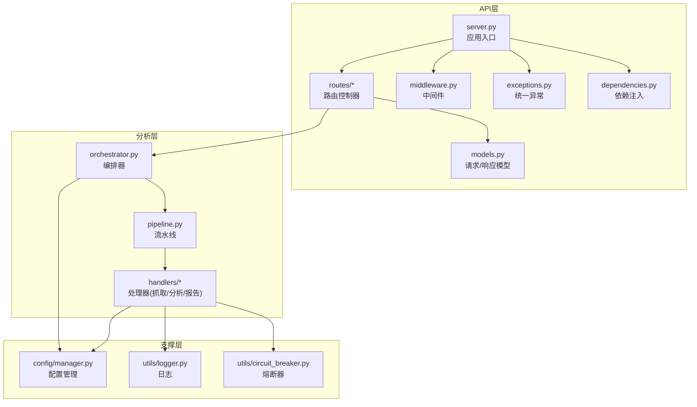
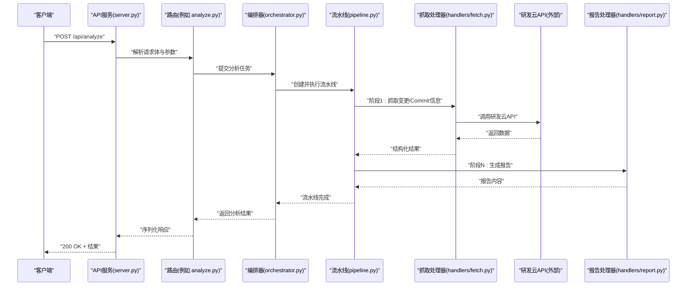
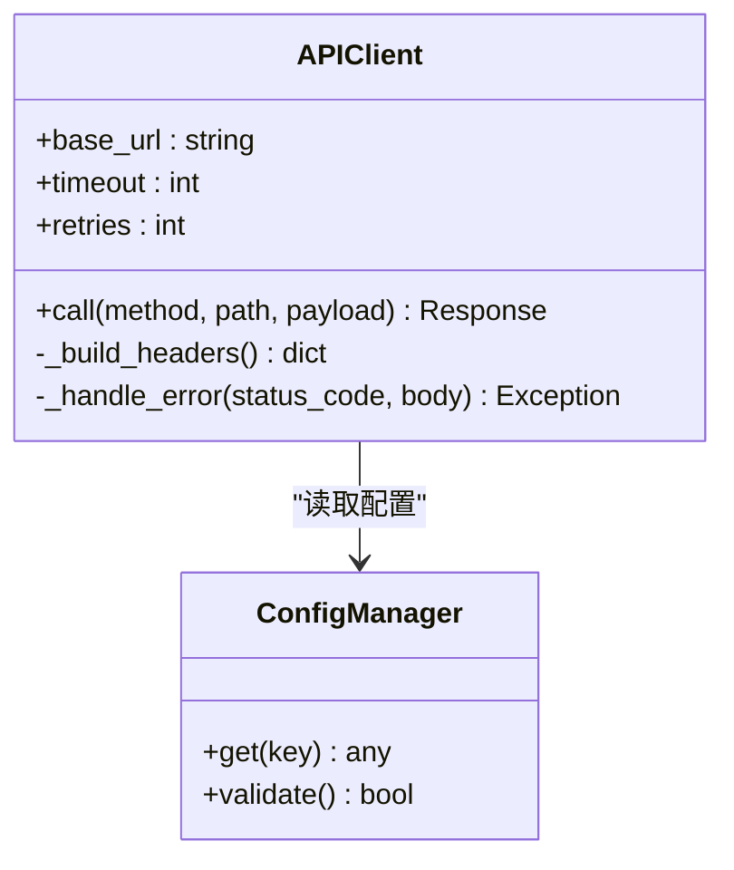
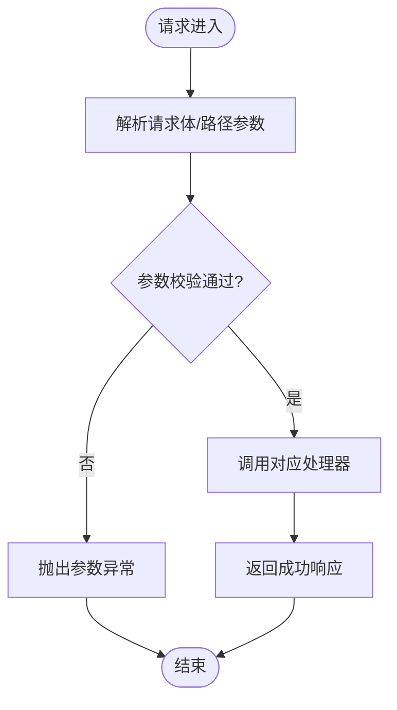
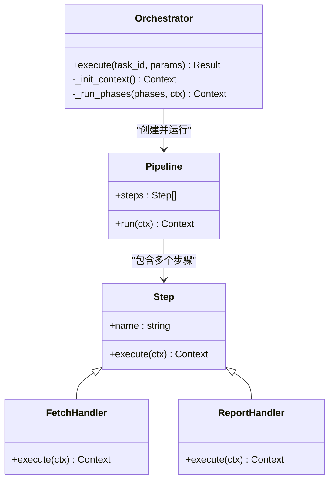
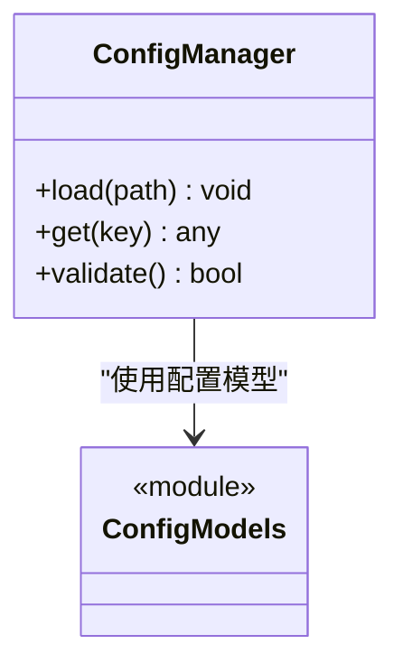
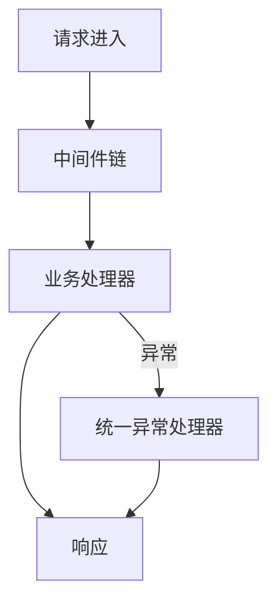
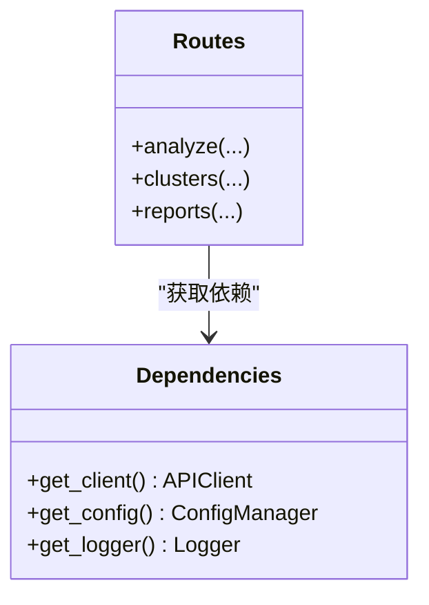
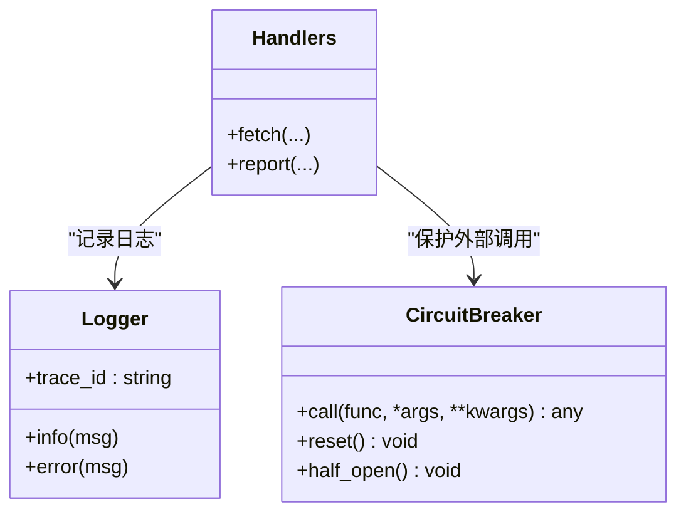
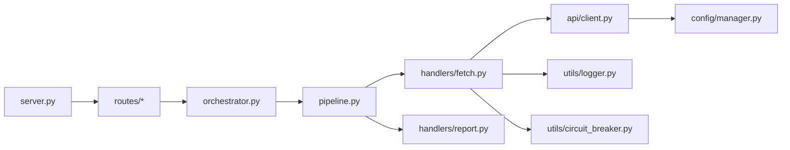

# 研发云API集成

<cite>
**本文引用的文件**   
- [src/api/client.py](file://src/api/client.py)
- [src/api/server.py](file://src/api/server.py)
- [src/api/routes/analyze.py](file://src/api/routes/analyze.py)
- [src/api/routes/clusters.py](file://src/api/routes/clusters.py)
- [src/api/routes/reports.py](file://src/api/routes/reports.py)
- [src/api/routes/health.py](file://src/api/routes/health.py)
- [src/api/models.py](file://src/api/models.py)
- [src/api/dependencies.py](file://src/api/dependencies.py)
- [src/api/middleware.py](file://src/api/middleware.py)
- [src/api/exceptions.py](file://src/api/exceptions.py)
- [src/analyzer/orchestrator.py](file://src/analyzer/orchestrator.py)
- [src/analyzer/pipeline.py](file://src/analyzer/pipeline.py)
- [src/analyzer/handlers/fetch.py](file://src/analyzer/handlers/fetch.py)
- [src/analyzer/handlers/analyze.py](file://src/analyzer/handlers/analyze.py)
- [src/analyzer/handlers/report.py](file://src/analyzer/handlers/report.py)
- [src/config/manager.py](file://src/config/manager.py)
- [src/config/models.py](file://src/config/models.py)
- [src/utils/logger.py](file://src/utils/logger.py)
- [src/utils/circuit_breaker.py](file://src/utils/circuit_breaker.py)
- [scripts/start_api_server.py](file://scripts/start_api_server.py)
- [scripts/test_api.py](file://scripts/test_api.py)
- [docs/API.md](file://docs/API.md)
- [docs/API_SERVER_README.md](file://docs/API_SERVER_README.md)
- [config/config.yaml.example](file://config/config.yaml.example)
</cite>

## 目录
1. [简介](#简介)
2. [项目结构](#项目结构)
3. [核心组件](#核心组件)
4. [架构总览](#架构总览)
5. [详细组件分析](#详细组件分析)
6. [依赖关系分析](#依赖关系分析)
7. [性能考虑](#性能考虑)
8. [故障排查指南](#故障排查指南)
9. [结论](#结论)
10. [附录](#附录)

## 简介
本仓库围绕“研发云API集成”展开，提供与外部研发云平台（如代码仓库、任务单系统）的对接能力，并通过内部分析流水线完成变更采集、聚类分析与报告生成。对外暴露REST API，支持健康检查、任务分析、聚类查询与报告导出等能力；对内通过配置管理、缓存、规则引擎与可视化模块协同工作，形成端到端的数据处理链路。

## 项目结构
整体采用分层与按功能域组织相结合的结构：
- API层：路由、模型、中间件、异常处理、依赖注入与服务器启动
- 分析层：编排器、流水线、处理器（抓取、分析、报告）
- 配置层：配置加载、校验与模型定义
- 工具层：日志、熔断器等通用能力
- 脚本与文档：服务启停、测试与接口说明

图表来源
- [src/api/server.py](file://src/api/server.py)
- [src/api/routes/analyze.py](file://src/api/routes/analyze.py)
- [src/analyzer/orchestrator.py](file://src/analyzer/orchestrator.py)
- [src/analyzer/pipeline.py](file://src/analyzer/pipeline.py)
- [src/analyzer/handlers/fetch.py](file://src/analyzer/handlers/fetch.py)
- [src/config/manager.py](file://src/config/manager.py)
- [src/utils/logger.py](file://src/utils/logger.py)
- [src/utils/circuit_breaker.py](file://src/utils/circuit_breaker.py)

章节来源
- [docs/API.md](file://docs/API.md)
- [docs/API_SERVER_README.md](file://docs/API_SERVER_README.md)
- [scripts/start_api_server.py](file://scripts/start_api_server.py)

## 核心组件
- API客户端与服务端
  - 客户端封装对外部研发云API的调用，负责鉴权、重试、超时与错误码映射
  - 服务端基于Web框架暴露REST接口，承载请求解析、路由分发与响应序列化
- 分析编排与流水线
  - 编排器协调各阶段处理器，维护上下文状态
  - 流水线将“抓取-分析-报告”串联为可插拔步骤
- 配置与工具
  - 配置管理器加载YAML配置并做类型校验
  - 日志记录贯穿全链路，熔断器保护外部依赖

章节来源
- [src/api/client.py](file://src/api/client.py)
- [src/api/server.py](file://src/api/server.py)
- [src/analyzer/orchestrator.py](file://src/analyzer/orchestrator.py)
- [src/analyzer/pipeline.py](file://src/analyzer/pipeline.py)
- [src/config/manager.py](file://src/config/manager.py)
- [src/utils/logger.py](file://src/utils/logger.py)
- [src/utils/circuit_breaker.py](file://src/utils/circuit_breaker.py)

## 架构总览
下图展示从HTTP请求到外部研发云API调用的完整流程，以及内部分析流水线的参与点。

图表来源
- [src/api/server.py](file://src/api/server.py)
- [src/api/routes/analyze.py](file://src/api/routes/analyze.py)
- [src/analyzer/orchestrator.py](file://src/analyzer/orchestrator.py)
- [src/analyzer/pipeline.py](file://src/analyzer/pipeline.py)
- [src/analyzer/handlers/fetch.py](file://src/analyzer/handlers/fetch.py)
- [src/analyzer/handlers/report.py](file://src/analyzer/handlers/report.py)

## 详细组件分析

### API客户端（研发云API调用封装）
职责
- 构造请求头（含鉴权）、设置超时与重试策略
- 统一错误码映射与异常包装
- 可选熔断与限流

关键设计
- 使用配置项控制基础URL、超时、重试次数
- 对网络异常进行捕获并转换为领域异常
- 提供同步/异步两种调用方式（视实现而定）

图表来源
- [src/api/client.py](file://src/api/client.py)
- [src/config/manager.py](file://src/config/manager.py)

章节来源
- [src/api/client.py](file://src/api/client.py)
- [src/config/manager.py](file://src/config/manager.py)

### API服务与路由
职责
- 启动Web服务、注册路由、挂载中间件与异常处理器
- 路由层负责参数校验、调用编排器、返回标准化响应

关键路由
- 健康检查：/health
- 分析任务：/api/analyze
- 聚类查询：/api/clusters
- 报告导出：/api/reports

图表来源
- [src/api/server.py](file://src/api/server.py)
- [src/api/routes/health.py](file://src/api/routes/health.py)
- [src/api/routes/analyze.py](file://src/api/routes/analyze.py)
- [src/api/routes/clusters.py](file://src/api/routes/clusters.py)
- [src/api/routes/reports.py](file://src/api/routes/reports.py)
- [src/api/exceptions.py](file://src/api/exceptions.py)

章节来源
- [src/api/server.py](file://src/api/server.py)
- [src/api/routes/analyze.py](file://src/api/routes/analyze.py)
- [src/api/routes/clusters.py](file://src/api/routes/clusters.py)
- [src/api/routes/reports.py](file://src/api/routes/reports.py)
- [src/api/routes/health.py](file://src/api/routes/health.py)
- [src/api/exceptions.py](file://src/api/exceptions.py)

### 分析编排器与流水线
职责
- 编排器：维护任务上下文、调度阶段、聚合结果
- 流水线：以步骤为单位组织“抓取-分析-报告”，支持失败回滚或跳过

图表来源
- [src/analyzer/orchestrator.py](file://src/analyzer/orchestrator.py)
- [src/analyzer/pipeline.py](file://src/analyzer/pipeline.py)
- [src/analyzer/handlers/fetch.py](file://src/analyzer/handlers/fetch.py)
- [src/analyzer/handlers/report.py](file://src/analyzer/handlers/report.py)

章节来源
- [src/analyzer/orchestrator.py](file://src/analyzer/orchestrator.py)
- [src/analyzer/pipeline.py](file://src/analyzer/pipeline.py)
- [src/analyzer/handlers/fetch.py](file://src/analyzer/handlers/fetch.py)
- [src/analyzer/handlers/report.py](file://src/analyzer/handlers/report.py)

### 配置管理与模型
职责
- 加载YAML配置，提供强类型访问
- 校验必填字段与取值范围

图表来源
- [src/config/manager.py](file://src/config/manager.py)
- [src/config/models.py](file://src/config/models.py)
- [config/config.yaml.example](file://config/config.yaml.example)

章节来源
- [src/config/manager.py](file://src/config/manager.py)
- [src/config/models.py](file://src/config/models.py)
- [config/config.yaml.example](file://config/config.yaml.example)

### 中间件与异常处理
职责
- 中间件：请求计时、日志、跨域、认证前置检查
- 异常处理：统一错误码、错误消息与堆栈脱敏

图表来源
- [src/api/middleware.py](file://src/api/middleware.py)
- [src/api/exceptions.py](file://src/api/exceptions.py)

章节来源
- [src/api/middleware.py](file://src/api/middleware.py)
- [src/api/exceptions.py](file://src/api/exceptions.py)

### 依赖注入
职责
- 集中管理APIClient、配置、日志等共享对象
- 在路由中按需获取实例，降低耦合

图表来源
- [src/api/dependencies.py](file://src/api/dependencies.py)
- [src/api/routes/analyze.py](file://src/api/routes/analyze.py)
- [src/api/routes/clusters.py](file://src/api/routes/clusters.py)
- [src/api/routes/reports.py](file://src/api/routes/reports.py)

章节来源
- [src/api/dependencies.py](file://src/api/dependencies.py)
- [src/api/routes/analyze.py](file://src/api/routes/analyze.py)
- [src/api/routes/clusters.py](file://src/api/routes/clusters.py)
- [src/api/routes/reports.py](file://src/api/routes/reports.py)

### 日志与熔断器
职责
- 日志：结构化输出、分级记录、追踪ID透传
- 熔断器：对不稳定外部API进行快速失败与退避

图表来源
- [src/utils/logger.py](file://src/utils/logger.py)
- [src/utils/circuit_breaker.py](file://src/utils/circuit_breaker.py)
- [src/analyzer/handlers/fetch.py](file://src/analyzer/handlers/fetch.py)
- [src/analyzer/handlers/report.py](file://src/analyzer/handlers/report.py)

章节来源
- [src/utils/logger.py](file://src/utils/logger.py)
- [src/utils/circuit_breaker.py](file://src/utils/circuit_breaker.py)
- [src/analyzer/handlers/fetch.py](file://src/analyzer/handlers/fetch.py)
- [src/analyzer/handlers/report.py](file://src/analyzer/handlers/report.py)

## 依赖关系分析
- API层与分析层解耦：路由仅负责协议适配与参数校验，具体逻辑下沉至编排器与流水线
- 外部依赖受控：通过客户端与熔断器隔离外部研发云API的不稳定性
- 配置驱动：所有可调参数集中于配置层，便于环境切换与灰度发布

图表来源
- [src/api/server.py](file://src/api/server.py)
- [src/api/routes/analyze.py](file://src/api/routes/analyze.py)
- [src/analyzer/orchestrator.py](file://src/analyzer/orchestrator.py)
- [src/analyzer/pipeline.py](file://src/analyzer/pipeline.py)
- [src/analyzer/handlers/fetch.py](file://src/analyzer/handlers/fetch.py)
- [src/analyzer/handlers/report.py](file://src/analyzer/handlers/report.py)
- [src/api/client.py](file://src/api/client.py)
- [src/config/manager.py](file://src/config/manager.py)
- [src/utils/logger.py](file://src/utils/logger.py)
- [src/utils/circuit_breaker.py](file://src/utils/circuit_breaker.py)

章节来源
- [src/api/server.py](file://src/api/server.py)
- [src/analyzer/orchestrator.py](file://src/analyzer/orchestrator.py)
- [src/analyzer/pipeline.py](file://src/analyzer/pipeline.py)
- [src/api/client.py](file://src/api/client.py)
- [src/config/manager.py](file://src/config/manager.py)
- [src/utils/logger.py](file://src/utils/logger.py)
- [src/utils/circuit_breaker.py](file://src/utils/circuit_breaker.py)

## 性能考虑
- 连接复用与超时控制：合理设置HTTP连接池大小与读写超时，避免资源泄露
- 重试与退避：对瞬时失败进行指数退避重试，限制最大重试次数
- 熔断与降级：当外部API错误率升高时快速失败，保障主流程可用
- 并发与批处理：批量抓取与并行分析可降低端到端延迟
- 缓存命中：对热点查询（如分支列表）增加短期缓存，减少重复请求

[本节为通用指导，不直接分析具体文件]

## 故障排查指南
常见问题与定位要点
- 外部API不可用
  - 检查熔断器状态与最近错误计数
  - 查看日志中的超时与重试记录
  - 确认鉴权令牌是否过期
- 参数校验失败
  - 核对请求体字段与类型
  - 参考API文档中的字段约束
- 流水线阶段失败
  - 根据阶段名称定位处理器
  - 检查上游阶段输出是否符合下游预期

建议操作
- 启用更详细的日志级别
- 使用健康检查接口验证服务可用性
- 使用测试脚本模拟典型请求

章节来源
- [src/utils/circuit_breaker.py](file://src/utils/circuit_breaker.py)
- [src/utils/logger.py](file://src/utils/logger.py)
- [src/api/routes/health.py](file://src/api/routes/health.py)
- [scripts/test_api.py](file://scripts/test_api.py)
- [docs/API.md](file://docs/API.md)

## 结论
本项目通过清晰的API层与分析层分离、可插拔的流水线设计与稳健的外部依赖治理，实现了与研发云API的稳定集成。配合配置化与可观测性能力，可在多环境下快速部署与排障。后续可进一步引入异步化、分布式任务队列与更细粒度的指标埋点，以提升吞吐与可观测性。

## 附录
- 服务启动
  - 使用脚本启动API服务
- 接口文档
  - 参考API文档了解端点、入参与出参
- 配置示例
  - 参考配置模板调整基础URL、超时与重试策略

章节来源
- [scripts/start_api_server.py](file://scripts/start_api_server.py)
- [docs/API.md](file://docs/API.md)
- [docs/API_SERVER_README.md](file://docs/API_SERVER_README.md)
- [config/config.yaml.example](file://config/config.yaml.example)