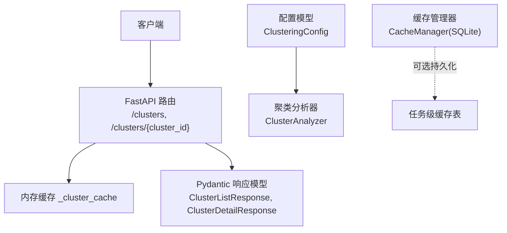
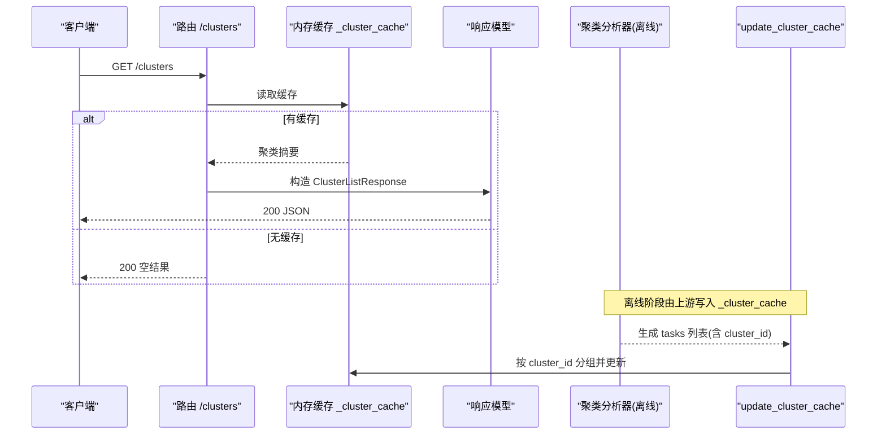
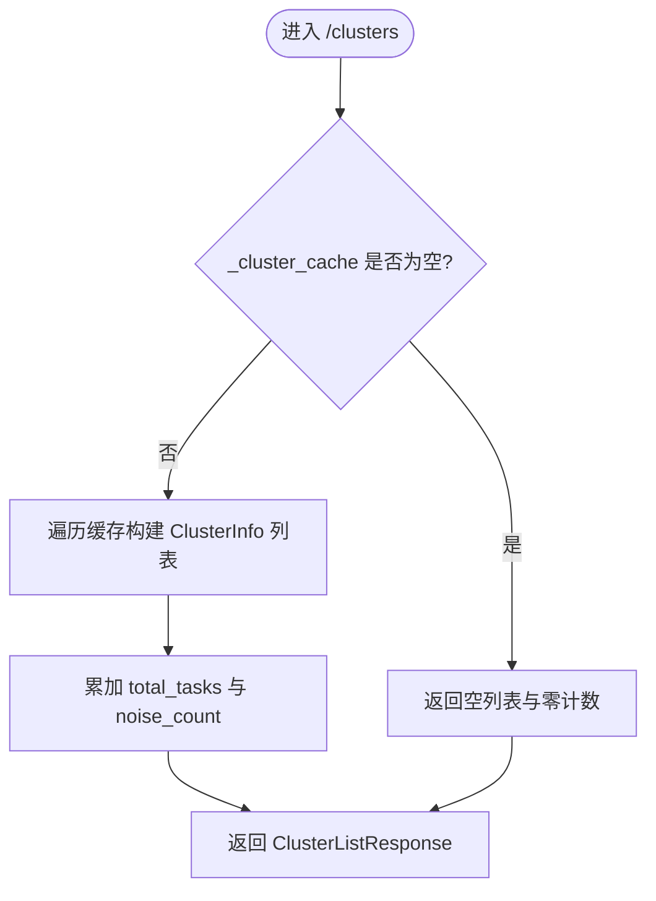
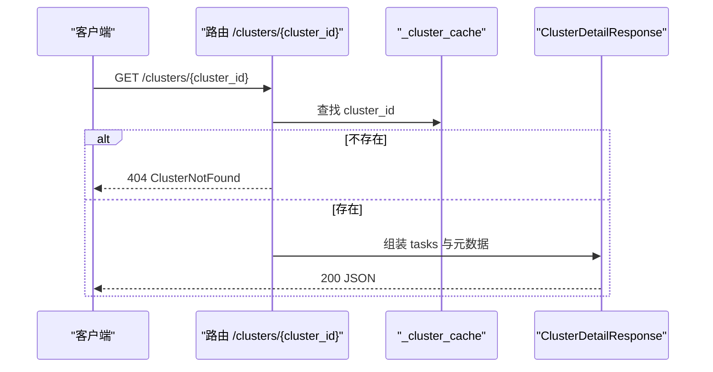
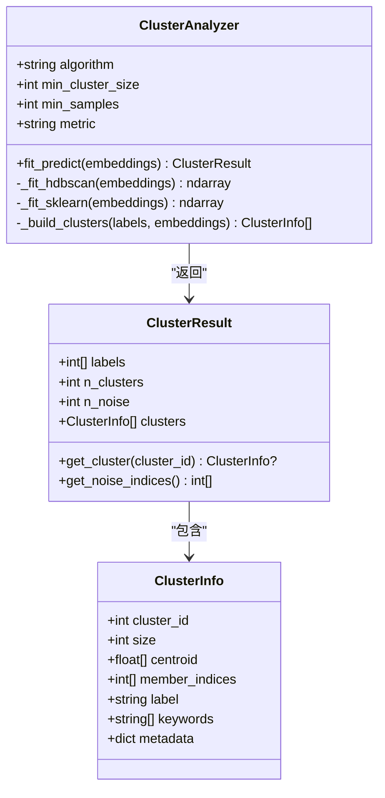
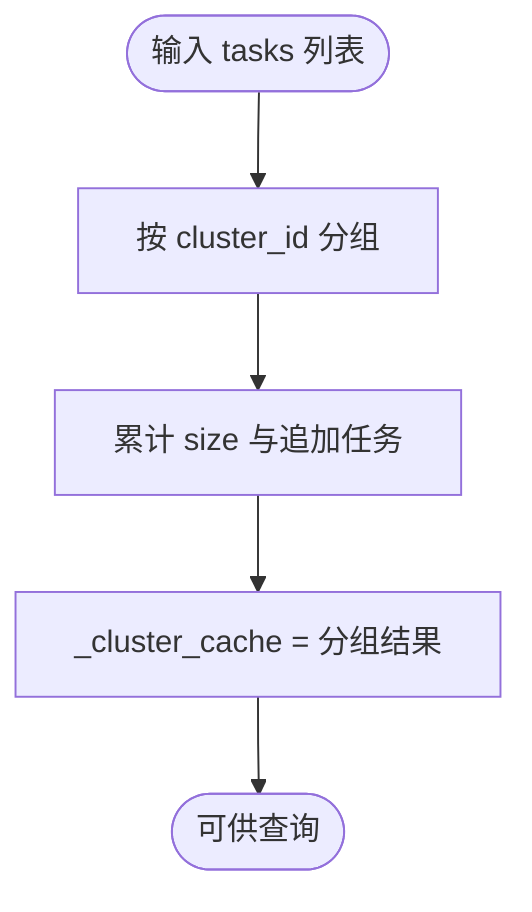
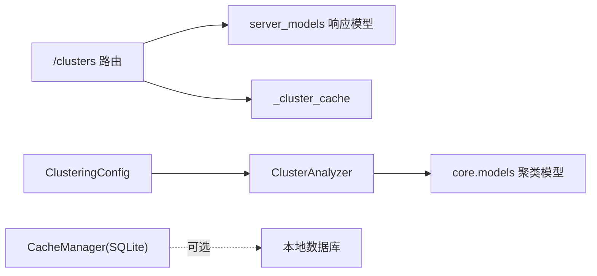

# 聚类接口

<cite>
**本文引用的文件**
- [src/api/routes/clusters.py](file://src/api/routes/clusters.py)
- [src/api/server_models.py](file://src/api/server_models.py)
- [src/core/models.py](file://src/core/models.py)
- [src/clustering/analyzer.py](file://src/clustering/analyzer.py)
- [src/config/models.py](file://src/config/models.py)
- [src/cache/manager.py](file://src/cache/manager.py)
- [tests/api/routes/test_clusters.py](file://tests/api/routes/test_clusters.py)
- [docs/API.md](file://docs/API.md)
</cite>

## 目录
1. [简介](#简介)
2. [项目结构](#项目结构)
3. [核心组件](#核心组件)
4. [架构总览](#架构总览)
5. [详细组件分析](#详细组件分析)
6. [依赖关系分析](#依赖关系分析)
7. [性能与缓存策略](#性能与缓存策略)
8. [故障排查指南](#故障排查指南)
9. [结论](#结论)
10. [附录：示例与集成](#附录示例与集成)

## 简介
本文件为“聚类查询接口”的权威API文档，覆盖以下能力：
- 获取聚类列表：GET /clusters
- 获取聚类详情：GET /clusters/{cluster_id}
- 完整的数据结构定义（包含 cluster_id、members、statistics、representative_tasks 等字段说明）
- 聚类算法参数配置与结果解释
- 分页、过滤、排序的使用建议与扩展点
- 缓存策略与性能优化
- 可视化数据导出与集成指南

注意：当前实现中 GET /clusters 与 GET /clusters/{cluster_id} 未暴露查询参数（如分页、过滤、排序），但本文提供了向后兼容的扩展建议与最佳实践。

## 项目结构
与聚类接口直接相关的代码位于 API 路由层、模型定义层、聚类分析器与配置模块：
- API 路由：src/api/routes/clusters.py
- API 响应模型：src/api/server_models.py
- 核心数据模型（含聚类相关）：src/core/models.py
- 聚类分析器：src/clustering/analyzer.py
- 配置模型（含聚类参数）：src/config/models.py
- 缓存管理器：src/cache/manager.py
- 单元测试：tests/api/routes/test_clusters.py
- 通用API文档：docs/API.md

图表来源
- [src/api/routes/clusters.py:24-166](file://src/api/routes/clusters.py#L24-L166)
- [src/api/server_models.py:103-141](file://src/api/server_models.py#L103-L141)
- [src/clustering/analyzer.py:8-46](file://src/clustering/analyzer.py#L8-L46)
- [src/config/models.py:61-82](file://src/config/models.py#L61-L82)
- [src/cache/manager.py:10-165](file://src/cache/manager.py#L10-L165)

章节来源
- [src/api/routes/clusters.py:1-195](file://src/api/routes/clusters.py#L1-L195)
- [src/api/server_models.py:1-159](file://src/api/server_models.py#L1-L159)
- [src/core/models.py:91-230](file://src/core/models.py#L91-L230)
- [src/clustering/analyzer.py:1-121](file://src/clustering/analyzer.py#L1-L121)
- [src/config/models.py:61-82](file://src/config/models.py#L61-L82)
- [src/cache/manager.py:1-165](file://src/cache/manager.py#L1-165)
- [tests/api/routes/test_clusters.py:1-171](file://tests/api/routes/test_clusters.py#L1-L171)
- [docs/API.md:209-290](file://docs/API.md#L209-L290)

## 核心组件
- 路由层
  - GET /clusters：返回所有聚类概览（总数、噪声点数、聚类列表）。
  - GET /clusters/{cluster_id}：返回指定聚类的详细信息（标签、关键词、任务列表等）。
- 响应模型
  - ClusterInfo：聚类基本信息（ID、大小、标签、关键词、元数据）。
  - ClusterListResponse：聚类列表响应（total_clusters、total_tasks、noise_count、clusters）。
  - ClusterTaskInfo：聚类内任务信息（task_id、title、description、similarity_score）。
  - ClusterDetailResponse：聚类详情响应（cluster_id、size、label、description、keywords、tasks、metadata）。
- 聚类分析器
  - ClusterAnalyzer：支持 hdbscan 或 sklearn 回退；计算聚类中心、成员索引、噪声统计。
- 配置模型
  - ClusteringConfig：algorithm、min_cluster_size、min_samples、metric 等参数校验。
- 缓存
  - 路由层使用进程内字典 _cluster_cache 作为临时存储。
  - CacheManager 提供基于 SQLite 的任务级缓存（TTL、过期清理、统计）。

章节来源
- [src/api/routes/clusters.py:24-166](file://src/api/routes/clusters.py#L24-L166)
- [src/api/server_models.py:103-141](file://src/api/server_models.py#L103-L141)
- [src/clustering/analyzer.py:8-46](file://src/clustering/analyzer.py#L8-L46)
- [src/config/models.py:61-82](file://src/config/models.py#L61-L82)
- [src/cache/manager.py:10-165](file://src/cache/manager.py#L10-L165)

## 架构总览
下图展示了从请求到响应的关键路径，以及聚类结果的构建与缓存更新流程。

图表来源
- [src/api/routes/clusters.py:24-91](file://src/api/routes/clusters.py#L24-L91)
- [src/api/routes/clusters.py:169-195](file://src/api/routes/clusters.py#L169-L195)
- [src/api/server_models.py:113-141](file://src/api/server_models.py#L113-L141)
- [src/clustering/analyzer.py:22-46](file://src/clustering/analyzer.py#L22-L46)

## 详细组件分析

### 端点一：GET /clusters
- 功能：返回所有聚类概览，包括聚类数量、任务总数、噪声点数量与聚类列表。
- 认证：需要 Token（见 docs/API.md）。
- 查询参数：当前实现未暴露任何查询参数（不支持分页、过滤、排序）。
- 成功响应体字段：
  - total_clusters：聚类总数
  - total_tasks：任务总数（含噪声）
  - noise_count：噪声点数量
  - clusters：聚类列表，每项包含：
    - cluster_id：聚类ID
    - size：该聚类包含的任务数
    - label：聚类标签
    - keywords：关键词列表
    - metadata：元数据
- 错误响应：
  - 500：内部错误，统一 ErrorResponse 格式（error、message、detail、timestamp）。

图表来源
- [src/api/routes/clusters.py:24-91](file://src/api/routes/clusters.py#L24-L91)

章节来源
- [src/api/routes/clusters.py:24-91](file://src/api/routes/clusters.py#L24-L91)
- [src/api/server_models.py:113-119](file://src/api/server_models.py#L113-L119)
- [docs/API.md:209-247](file://docs/API.md#L209-L247)

### 端点二：GET /clusters/{cluster_id}
- 功能：返回指定聚类的详细信息，包括标签、描述、关键词、任务列表与元数据。
- 路径参数：
  - cluster_id：整数型聚类ID
- 成功响应体字段：
  - cluster_id：聚类ID
  - size：任务数
  - label：聚类标签
  - description：聚类描述
  - keywords：关键词列表
  - tasks：任务列表，每项包含：
    - task_id：任务ID
    - title：标题
    - description：描述
    - similarity_score：相似度分数（0~1）
  - metadata：元数据
- 错误响应：
  - 404：ClusterNotFound
  - 500：ClusterDetailFetchFailed

图表来源
- [src/api/routes/clusters.py:94-166](file://src/api/routes/clusters.py#L94-L166)
- [src/api/server_models.py:131-141](file://src/api/server_models.py#L131-L141)

章节来源
- [src/api/routes/clusters.py:94-166](file://src/api/routes/clusters.py#L94-L166)
- [src/api/server_models.py:122-141](file://src/api/server_models.py#L122-L141)
- [docs/API.md:249-290](file://docs/API.md#L249-L290)

### 数据结构定义
- 列表项 ClusterInfo
  - cluster_id：聚类ID（非负整数）
  - size：聚类大小（非负整数）
  - label：聚类标签
  - keywords：关键词列表
  - metadata：任意键值对
- 列表响应 ClusterListResponse
  - total_clusters：聚类总数
  - total_tasks：任务总数（含噪声）
  - noise_count：噪声点数量
  - clusters：ClusterInfo 列表
- 任务项 ClusterTaskInfo
  - task_id：任务ID（字符串）
  - title：标题
  - description：描述
  - similarity_score：相似度分数（0~1）
- 详情响应 ClusterDetailResponse
  - cluster_id：聚类ID
  - size：任务数
  - label：聚类标签
  - description：聚类描述
  - keywords：关键词列表
  - tasks：ClusterTaskInfo 列表
  - metadata：任意键值对

补充说明：
- 在核心模型中，ClusterInfo 还包含 centroid、member_indices 等用于分析与可视化的字段，便于后续扩展 statistics 与 representative_tasks。

章节来源
- [src/api/server_models.py:103-141](file://src/api/server_models.py#L103-L141)
- [src/core/models.py:91-117](file://src/core/models.py#L91-L117)

### 聚类算法参数配置与结果解释
- 支持的算法与度量
  - algorithm：hdbscan（首选）、kmeans、dbscan（配置校验限制）
  - metric：cosine、euclidean、manhattan
- 关键参数
  - min_cluster_size：最小聚类大小（默认 5）
  - min_samples：最小样本数（默认 3）
- 行为说明
  - 当 embeddings 为空时抛出异常
  - 若选择 cosine 且底层库不支持余弦距离，会进行向量归一化后以欧氏距离近似
  - 当数据量小于 min_cluster_size 时，可能全部标记为噪声（-1）
- 结果字段
  - labels：每个样本的聚类标签（-1 表示噪声）
  - n_clusters：有效聚类数量
  - n_noise：噪声点数量
  - clusters：每个聚类的信息（包含 cluster_id、size、centroid、member_indices 等）

图表来源
- [src/clustering/analyzer.py:8-121](file://src/clustering/analyzer.py#L8-L121)
- [src/core/models.py:210-230](file://src/core/models.py#L210-L230)
- [src/core/models.py:91-117](file://src/core/models.py#L91-L117)

章节来源
- [src/clustering/analyzer.py:1-121](file://src/clustering/analyzer.py#L1-L121)
- [src/config/models.py:61-82](file://src/config/models.py#L61-L82)
- [src/core/models.py:210-230](file://src/core/models.py#L210-L230)

### 缓存更新机制
- update_cluster_cache(tasks)
  - 将任务列表按 cluster_id 分组，聚合 size、tasks、label、keywords、metadata
  - 将结果写入全局 _cluster_cache，供 /clusters 与 /clusters/{cluster_id} 使用
- 测试覆盖
  - 多任务分组、噪声任务映射到 -1、空任务列表处理

图表来源
- [src/api/routes/clusters.py:169-195](file://src/api/routes/clusters.py#L169-L195)
- [tests/api/routes/test_clusters.py:145-171](file://tests/api/routes/test_clusters.py#L145-L171)

章节来源
- [src/api/routes/clusters.py:169-195](file://src/api/routes/clusters.py#L169-L195)
- [tests/api/routes/test_clusters.py:145-171](file://tests/api/routes/test_clusters.py#L145-L171)

## 依赖关系分析
- 路由层依赖
  - FastAPI 路由与 Pydantic 响应模型
  - 进程内缓存 _cluster_cache
- 分析器依赖
  - numpy、hdbscan（优先）、sklearn（回退）
- 配置依赖
  - ClusteringConfig 校验算法与度量
- 缓存依赖
  - CacheManager 提供 SQLite 持久化（任务级缓存，非聚类列表缓存）

图表来源
- [src/api/routes/clusters.py:24-166](file://src/api/routes/clusters.py#L24-L166)
- [src/clustering/analyzer.py:8-46](file://src/clustering/analyzer.py#L8-L46)
- [src/config/models.py:61-82](file://src/config/models.py#L61-L82)
- [src/cache/manager.py:10-165](file://src/cache/manager.py#L10-L165)

章节来源
- [src/api/routes/clusters.py:1-195](file://src/api/routes/clusters.py#L1-L195)
- [src/clustering/analyzer.py:1-121](file://src/clustering/analyzer.py#L1-L121)
- [src/config/models.py:61-82](file://src/config/models.py#L61-L82)
- [src/cache/manager.py:1-165](file://src/cache/manager.py#L1-165)

## 性能与缓存策略
- 当前实现
  - 路由层使用进程内字典 _cluster_cache，读操作 O(n) 遍历聚类条目，适合中小规模数据。
  - 未实现分页、过滤、排序，避免额外开销。
- 可扩展优化建议
  - 分页：在路由层增加 page/page_size 参数，结合内存索引或数据库游标实现。
  - 过滤：增加 label、keyword、size_range 等条件，配合倒排索引或数据库 WHERE 子句。
  - 排序：支持按 size、创建时间、置信度等字段排序，利用索引或内存排序。
  - 缓存分层：
    - 热点聚类详情可加入 Redis 缓存，设置 TTL。
    - 列表页可定期刷新或增量更新。
  - 异步与并发：
    - 使用异步 I/O 与连接池提升吞吐。
    - 大列表返回采用流式或分片传输。
- 任务级缓存（CacheManager）
  - 基于 SQLite，支持 TTL、过期清理、统计查询，适用于任务分析结果缓存。

章节来源
- [src/api/routes/clusters.py:24-91](file://src/api/routes/clusters.py#L24-L91)
- [src/cache/manager.py:10-165](file://src/cache/manager.py#L10-L165)

## 故障排查指南
- 常见状态码与错误类型
  - 404 ClusterNotFound：请求的 cluster_id 不存在于缓存。
  - 500 InternalServerError：内部异常，统一 ErrorResponse 格式。
- 定位步骤
  - 检查 _cluster_cache 是否已正确填充（通过 update_cluster_cache）。
  - 确认 cluster_id 是否存在（-1 表示噪声，不在列表响应中）。
  - 查看日志输出，定位具体异常堆栈。
- 单元测试参考
  - 空缓存、带噪声缓存、仅普通聚类、字段完整性、404 场景均有覆盖。

章节来源
- [src/api/routes/clusters.py:82-91](file://src/api/routes/clusters.py#L82-L91)
- [src/api/routes/clusters.py:155-166](file://src/api/routes/clusters.py#L155-L166)
- [tests/api/routes/test_clusters.py:27-86](file://tests/api/routes/test_clusters.py#L27-L86)
- [tests/api/routes/test_clusters.py:95-139](file://tests/api/routes/test_clusters.py#L95-L139)

## 结论
- 当前聚类接口提供简洁稳定的列表与详情查询能力，满足基础浏览需求。
- 数据结构清晰，支持后续扩展 statistics 与 representative_tasks。
- 建议在后续版本引入分页、过滤、排序与更完善的缓存策略，以提升大规模数据下的查询性能与用户体验。

## 附录：示例与集成

### 使用示例
- cURL
  - 获取聚类列表：curl http://localhost:8000/clusters -H "X-API-Token: your-token"
  - 获取聚类详情：curl http://localhost:8000/clusters/0 -H "X-API-Token: your-token"
- Python requests
  - 参考 docs/API.md 中的示例片段，替换为 /clusters 与 /clusters/{cluster_id} 调用。

章节来源
- [docs/API.md:436-455](file://docs/API.md#L436-L455)

### 分页、过滤与排序（扩展建议）
- 分页参数
  - page：页码（默认 1）
  - page_size：每页条数（默认 20，最大 200）
- 过滤参数
  - label：模糊匹配聚类标签
  - keyword：关键词包含
  - size_min/size_max：聚类大小范围
- 排序参数
  - sort_by：size、created_at、confidence（默认 size）
  - order：asc/desc（默认 desc）
- 实现要点
  - 在路由层解析参数，对内存缓存或数据库结果集进行切片与筛选。
  - 对高频过滤字段建立索引或倒排索引。
  - 返回 total、page、page_size、items 等分页元信息。

[本节为概念性扩展建议，不直接分析具体文件]

### 可视化数据导出与集成
- 导出目标
  - 聚类概览：JSON/CSV（cluster_id、size、label、keywords、metadata）
  - 聚类详情：JSON（tasks 列表、similarity_score）
- 集成方式
  - 前端表格：展示聚类列表，点击跳转详情。
  - 图表：按 size 分布绘制柱状图；按关键词词云。
  - 报表：结合报告接口生成 HTML/Markdown 汇总。
- 注意事项
  - 大数据量下建议服务端分页与按需加载。
  - 敏感字段需脱敏后再导出。

[本节为概念性指导，不直接分析具体文件]
