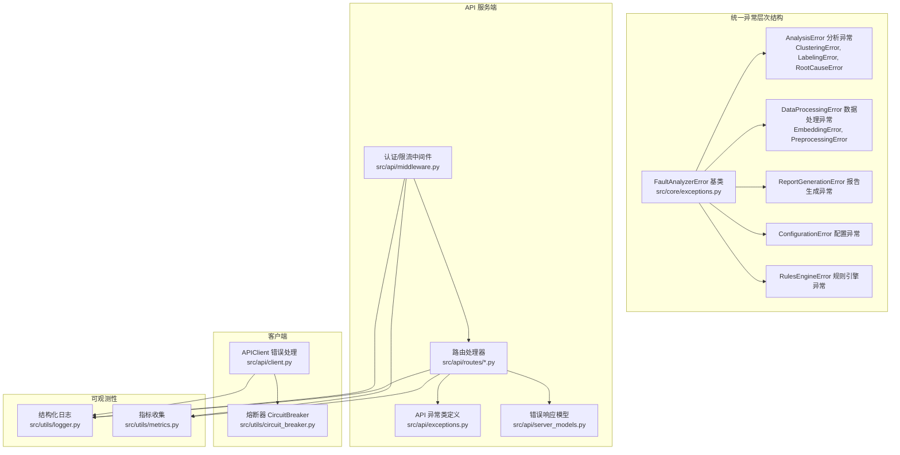
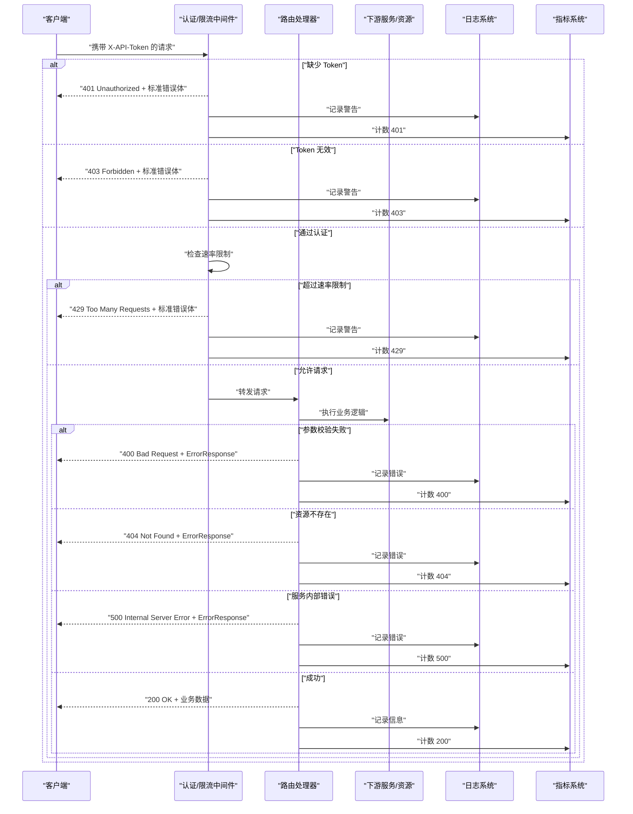
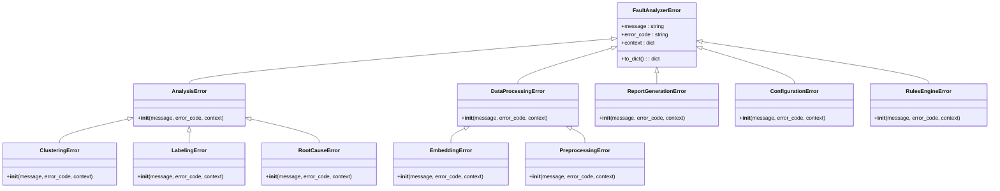
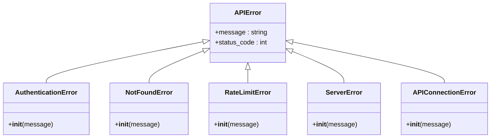
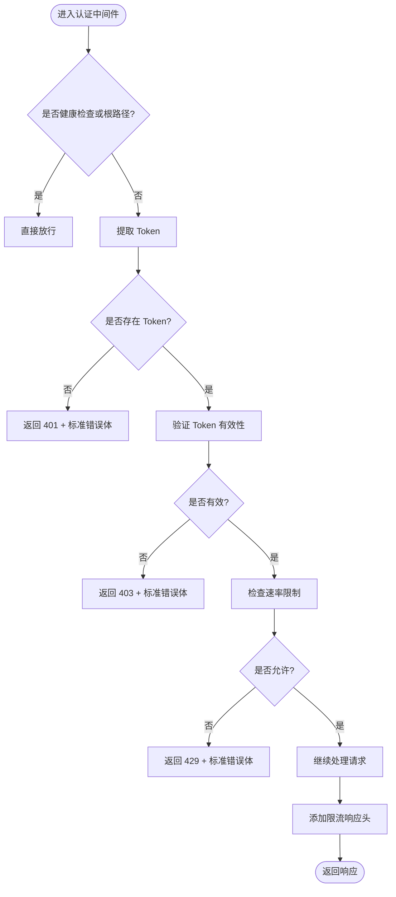
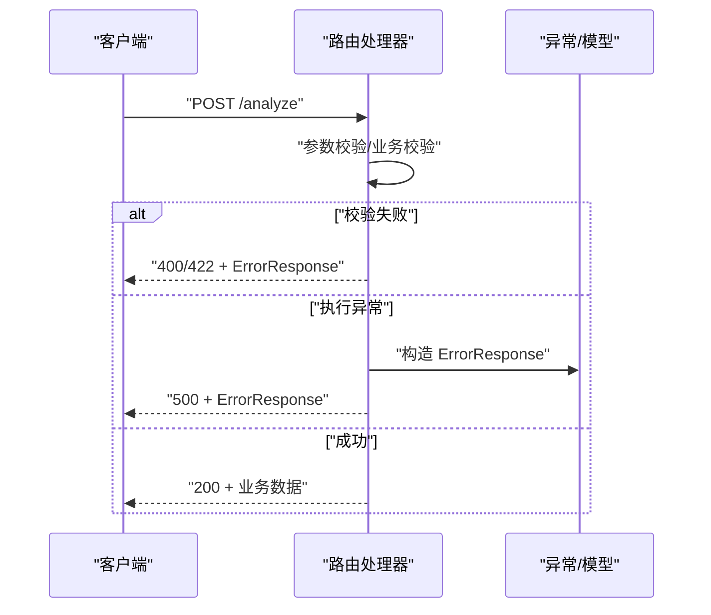
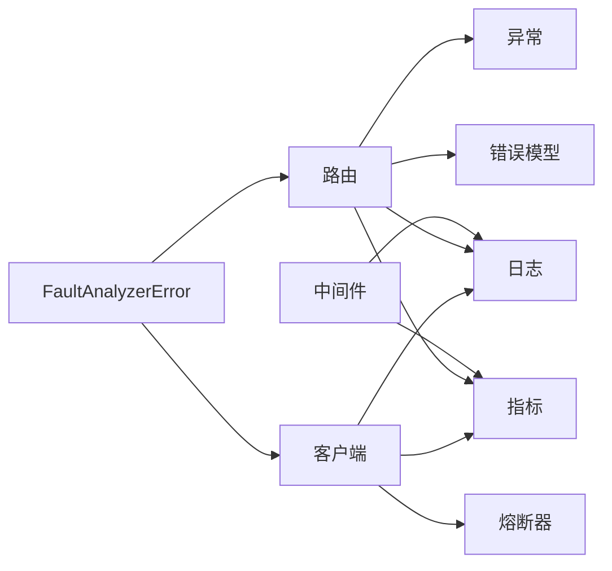

# 错误处理

<cite>
**本文引用的文件**   
- [src/core/exceptions.py](file://src/core/exceptions.py)
- [src/api/exceptions.py](file://src/api/exceptions.py)
- [src/api/middleware.py](file://src/api/middleware.py)
- [src/api/server_models.py](file://src/api/server_models.py)
- [src/api/routes/analyze.py](file://src/api/routes/analyze.py)
- [src/api/client.py](file://src/api/client.py)
- [src/utils/circuit_breaker.py](file://src/utils/circuit_breaker.py)
- [src/utils/logger.py](file://src/utils/logger.py)
- [src/utils/metrics.py](file://src/utils/metrics.py)
- [src/rules/pdf_parser.py](file://src/rules/pdf_parser.py)
- [tests/test_exceptions.py](file://tests/test_exceptions.py)
</cite>

## 更新摘要
**所做更改**   
- 新增统一的异常层次结构章节，详细说明 FaultAnalyzerError 基类及其专用子类
- 更新核心组件部分，反映新的异常体系设计
- 添加异常层次结构架构图和序列化机制说明
- 扩展错误响应 Schema 以支持机器可读的错误代码
- 更新故障排查指南，包含新异常类型的处理方法

## 目录
1. [简介](#简介)
2. [项目结构](#项目结构)
3. [核心组件](#核心组件)
4. [架构总览](#架构总览)
5. [详细组件分析](#详细组件分析)
6. [依赖关系分析](#依赖关系分析)
7. [性能与可靠性考虑](#性能与可靠性考虑)
8. [故障排查指南](#故障排查指南)
9. [结论](#结论)
10. [附录](#附录)

## 简介
本文件系统化梳理 API 的错误处理机制，覆盖错误类型、HTTP 状态码、统一错误响应格式、常见错误场景的处理策略、日志记录与监控告警配置、客户端重试与降级方案，以及错误排查工具与最佳实践。目标是帮助开发者与运维人员快速定位问题、稳定服务并提升可观测性。

**更新** 新增了统一的异常层次结构，提供结构化的错误分类和机器可读的错误代码，支持跨模块的一致错误处理。

## 项目结构
围绕错误处理的关键代码分布在以下模块：
- **统一异常层次结构**：FaultAnalyzerError 基类及专用异常子类（分析、数据处理、报告、配置、规则引擎）
- **API 异常体系**：独立的 HTTP 相关异常类族
- **中间件**：认证、鉴权、速率限制与请求日志
- **路由层**：业务异常抛出与 HTTPException 转换
- **客户端**：外部调用错误分类、重试与熔断
- **模型**：统一错误响应 Schema
- **可观测性**：结构化日志与指标收集



**图表来源**
- [src/core/exceptions.py:15-195](file://src/core/exceptions.py#L15-L195)
- [src/api/exceptions.py:1-31](file://src/api/exceptions.py#L1-L31)
- [src/api/middleware.py:1-173](file://src/api/middleware.py#L1-L173)
- [src/api/routes/analyze.py:1-202](file://src/api/routes/analyze.py#L1-L202)
- [src/api/server_models.py:1-159](file://src/api/server_models.py#L1-L159)
- [src/api/client.py:1-340](file://src/api/client.py#L1-L340)
- [src/utils/circuit_breaker.py:1-306](file://src/utils/circuit_breaker.py#L1-L306)
- [src/utils/logger.py:1-160](file://src/utils/logger.py#L1-L160)
- [src/utils/metrics.py:1-252](file://src/utils/metrics.py#L1-L252)

**章节来源**
- [src/core/exceptions.py:1-195](file://src/core/exceptions.py#L1-L195)
- [src/api/exceptions.py:1-31](file://src/api/exceptions.py#L1-L31)
- [src/api/middleware.py:1-173](file://src/api/middleware.py#L1-L173)
- [src/api/routes/analyze.py:1-202](file://src/api/routes/analyze.py#L1-L202)
- [src/api/server_models.py:1-159](file://src/api/server_models.py#L1-L159)
- [src/api/client.py:1-340](file://src/api/client.py#L1-L340)
- [src/utils/circuit_breaker.py:1-306](file://src/utils/circuit_breaker.py#L1-L306)
- [src/utils/logger.py:1-160](file://src/utils/logger.py#L1-L160)
- [src/utils/metrics.py:1-252](file://src/utils/metrics.py#L1-L252)

## 核心组件
- **统一异常层次结构**：基于 FaultAnalyzerError 基类的结构化异常体系，支持机器可读的错误代码和上下文信息，便于程序化处理和调试
- **API 异常体系**：独立的 HTTP 相关异常类族，处理认证失败、未找到、限流、服务器错误等网络层异常
- **中间件**：在请求进入路由前完成 Token 校验、鉴权、速率限制，并在响应头中附加限流信息；同时记录请求/响应耗时与关键上下文
- **路由层**：对业务异常进行统一包装，返回标准化的错误响应模型
- **客户端**：对外部服务的调用进行分类错误处理，支持指数退避重试、熔断保护与幂等性建议
- **可观测性**：结构化日志输出（控制台/文件/JSON）与 Prometheus 风格指标导出，支撑监控与告警

**章节来源**
- [src/core/exceptions.py:15-195](file://src/core/exceptions.py#L15-L195)
- [src/api/exceptions.py:1-31](file://src/api/exceptions.py#L1-L31)
- [src/api/middleware.py:1-173](file://src/api/middleware.py#L1-L173)
- [src/api/routes/analyze.py:1-202](file://src/api/routes/analyze.py#L1-L202)
- [src/api/client.py:1-340](file://src/api/client.py#L1-L340)
- [src/utils/logger.py:1-160](file://src/utils/logger.py#L1-L160)
- [src/utils/metrics.py:1-252](file://src/utils/metrics.py#L1-L252)

## 架构总览
下图展示了从客户端发起请求到服务端处理的端到端错误路径，包括认证失败、权限不足、速率限制、参数校验失败、服务不可用等典型场景。



**图表来源**
- [src/api/middleware.py:62-141](file://src/api/middleware.py#L62-L141)
- [src/api/routes/analyze.py:110-119](file://src/api/routes/analyze.py#L110-L119)
- [src/api/server_models.py:152-159](file://src/api/server_models.py#L152-L159)

## 详细组件分析

### 统一异常层次结构
**新增** 项目实现了完整的 FaultAnalyzerError 异常层次结构，提供结构化的错误分类和机器可读的错误代码。

#### 基础异常类
- **FaultAnalyzerError**：所有业务异常的基类，包含消息、错误代码和上下文信息
- 支持序列化为字典格式，便于日志记录和 API 响应
- 每个异常都包含 machine-readable 的错误代码，用于程序化处理

#### 专用异常类别
- **分析异常**：AnalysisError 及其子类 ClusteringError、LabelingError、RootCauseError
- **数据处理异常**：DataProcessingError 及其子类 EmbeddingError、PreprocessingError  
- **报告生成异常**：ReportGenerationError
- **配置异常**：ConfigurationError
- **规则引擎异常**：RulesEngineError



**图表来源**
- [src/core/exceptions.py:15-195](file://src/core/exceptions.py#L15-L195)

**章节来源**
- [src/core/exceptions.py:15-195](file://src/core/exceptions.py#L15-L195)
- [tests/test_exceptions.py:1-168](file://tests/test_exceptions.py#L1-L168)

### API 异常体系
- **基础异常**：APIError 作为所有 API 相关异常的基类
- **细分异常**：
  - AuthenticationError：对应 401 认证失败
  - NotFoundError：对应 404 资源不存在
  - RateLimitError：对应 429 速率限制
  - ServerError：对应 500 服务器错误
  - APIConnectionError：连接错误，状态码为 0（非 HTTP）



**图表来源**
- [src/api/exceptions.py:1-31](file://src/api/exceptions.py#L1-L31)

**章节来源**
- [src/api/exceptions.py:1-31](file://src/api/exceptions.py#L1-L31)

### 中间件：认证、鉴权与速率限制
- **认证流程**：
  - 从请求头或查询参数获取 Token
  - 缺失时返回 401
  - 无效时返回 403
- **速率限制**：
  - 基于内存的滑动窗口统计
  - 超限返回 429，并在响应体中附带 retry_after
  - 在响应头中添加 X-RateLimit-Limit 与 X-RateLimit-Remaining
- **日志记录**：
  - 记录请求方法与路径、来源 IP、响应状态码与耗时
  - 异常路径记录错误堆栈信息



**图表来源**
- [src/api/middleware.py:62-141](file://src/api/middleware.py#L62-L141)

**章节来源**
- [src/api/middleware.py:1-173](file://src/api/middleware.py#L1-L173)

### 路由层：业务异常与错误响应
- **参数校验失败**：由 FastAPI 自动返回 422（若使用 Pydantic 校验），或在业务逻辑中显式抛出 400
- **资源不存在**：抛出 404
- **服务内部错误**：捕获异常后返回 500，并附带标准化错误体
- **统一错误响应模型**：包含 error、message、detail、timestamp 字段



**图表来源**
- [src/api/routes/analyze.py:110-119](file://src/api/routes/analyze.py#L110-L119)
- [src/api/server_models.py:152-159](file://src/api/server_models.py#L152-L159)

**章节来源**
- [src/api/routes/analyze.py:1-202](file://src/api/routes/analyze.py#L1-L202)
- [src/api/server_models.py:1-159](file://src/api/server_models.py#L1-L159)

### 客户端：重试、熔断与错误分类
- **错误分类**：
  - 401：认证失败，不触发熔断
  - 404：未找到，不触发熔断
  - 429：速率限制，记录失败但不重试
  - 5xx：服务器错误，记录失败并触发熔断
  - 连接/超时异常：归类为连接错误，触发重试
- **重试策略**：
  - 指数退避：等待时间随尝试次数递增
  - 最大重试次数可配置
- **熔断器**：
  - 状态：关闭（正常）、打开（阻塞）、半开（探测恢复）
  - 失败阈值达到后打开，经过重置超时后进入半开，连续成功则关闭


**图表来源**
- [src/api/client.py:99-161](file://src/api/client.py#L99-L161)
- [src/utils/circuit_breaker.py:1-306](file://src/utils/circuit_breaker.py#L1-L306)

**章节来源**
- [src/api/client.py:1-340](file://src/api/client.py#L1-L340)
- [src/utils/circuit_breaker.py:1-306](file://src/utils/circuit_breaker.py#L1-L306)

### 错误响应 Schema
- **字段说明**：
  - error：错误类型标识（如 "Unauthorized"、"Forbidden"、"Too Many Requests"、"AnalysisFailed" 等）
  - message：人类可读的错误消息
  - detail：扩展信息字典（例如限流时的 retry_after）
  - timestamp：错误发生的时间戳
- **适用场景**：
  - 中间件返回的认证/鉴权/限流错误
  - 路由层抛出的业务错误
  - 客户端解析上游错误后的本地封装

**更新** 统一异常层次结构中的异常现在支持 to_dict() 方法，可以直接转换为标准的错误响应格式。

**章节来源**
- [src/api/server_models.py:152-159](file://src/api/server_models.py#L152-L159)
- [src/api/middleware.py:94-132](file://src/api/middleware.py#L94-L132)
- [src/api/routes/analyze.py:110-119](file://src/api/routes/analyze.py#L110-L119)
- [src/core/exceptions.py:43-49](file://src/core/exceptions.py#L43-L49)

### 异常层次结构集成示例
**新增** 项目中已有模块开始使用新的异常层次结构，例如 PDF 规则解析器：

```python
# 使用 DataProcessingError 替代通用的 ValueError
if not pdf_path.exists():
    raise DataProcessingError(
        f"PDF file does not exist: {pdf_path}",
        error_code="PDF_001",
        context={"path": str(pdf_path)},
    )
```

这种设计使得错误处理更加一致和可追踪，每个错误都有明确的错误代码和上下文信息。

**章节来源**
- [src/rules/pdf_parser.py:58-79](file://src/rules/pdf_parser.py#L58-L79)

## 依赖关系分析
- **中间件依赖**：
  - FastAPI 的 Request、Response、状态常量
  - loguru 日志
- **路由层依赖**：
  - FastAPI 的 APIRouter、HTTPException、Depends
  - 业务流水线与配置管理器
- **客户端依赖**：
  - httpx 异步客户端
  - 自定义异常与熔断器
- **可观测性依赖**：
  - loguru 结构化日志
  - 自定义指标收集器（Prometheus 导出）



**图表来源**
- [src/api/middleware.py:1-173](file://src/api/middleware.py#L1-L173)
- [src/api/routes/analyze.py:1-202](file://src/api/routes/analyze.py#L1-L202)
- [src/api/client.py:1-340](file://src/api/client.py#L1-L340)
- [src/utils/logger.py:1-160](file://src/utils/logger.py#L1-L160)
- [src/utils/metrics.py:1-252](file://src/utils/metrics.py#L1-L252)
- [src/core/exceptions.py:15-195](file://src/core/exceptions.py#L15-L195)

**章节来源**
- [src/api/middleware.py:1-173](file://src/api/middleware.py#L1-L173)
- [src/api/routes/analyze.py:1-202](file://src/api/routes/analyze.py#L1-L202)
- [src/api/client.py:1-340](file://src/api/client.py#L1-L340)
- [src/utils/logger.py:1-160](file://src/utils/logger.py#L1-L160)
- [src/utils/metrics.py:1-252](file://src/utils/metrics.py#L1-L252)
- [src/core/exceptions.py:15-195](file://src/core/exceptions.py#L15-L195)

## 性能与可靠性考虑
- **速率限制**：
  - 使用内存中的滑动窗口统计，避免外部依赖
  - 建议在分布式部署下迁移至 Redis 等共享存储
- **熔断器**：
  - 合理设置失败阈值与重置超时，避免雪崩
  - 半开状态下逐步探测恢复，提高可用性
- **重试策略**：
  - 仅对瞬态错误（连接/超时）进行指数退避重试
  - 幂等接口可考虑更激进的重试；非幂等需谨慎
- **指标与告警**：
  - 暴露 Prometheus 指标，监控错误率、延迟分布、限流触发次数
  - 结合日志聚合平台（如 ELK/Loki）进行错误追踪
- **异常层次结构优化**：
  - 使用专门的异常类型减少 try-catch 块的复杂度
  - 机器可读的错误代码便于自动化处理和监控
  - 上下文信息提供丰富的调试数据

## 故障排查指南
- **快速定位**：
  - 查看中间件日志，确认 Token 是否缺失或无效、是否触发限流
  - 检查路由层错误日志，定位业务异常的具体原因
  - 客户端侧查看重试与熔断日志，判断是否为下游不稳定导致
- **常用命令与技巧**：
  - 启用 JSON 格式日志，便于机器解析与检索
  - 开启详细错误堆栈，但生产环境注意脱敏
  - 使用 correlation_id 关联一次请求的全链路日志
  - 利用异常的错误代码进行快速分类和过滤
- **监控与告警**：
  - 针对 4xx/5xx 错误率设置阈值告警
  - 关注限流触发频率，评估是否需要扩容或优化限流策略
  - 熔断器状态变化应纳入告警，及时人工介入
  - 监控特定错误代码的出现频率，识别系统性问题

**更新** 新增异常层次结构的排查技巧：
- 使用 FaultAnalyzerError 的 to_dict() 方法获取完整的错误信息
- 根据 error_code 快速识别错误类型和处理策略
- 利用 context 字段中的调试信息进行问题定位

**章节来源**
- [src/utils/logger.py:34-103](file://src/utils/logger.py#L34-L103)
- [src/utils/metrics.py:190-233](file://src/utils/metrics.py#L190-L233)
- [src/api/middleware.py:144-172](file://src/api/middleware.py#L144-L172)
- [src/core/exceptions.py:43-49](file://src/core/exceptions.py#L43-L49)

## 结论
本项目构建了较为完善的 API 错误处理体系：统一的异常分类、中间件的认证与限流、路由层的标准化错误响应、客户端的重试与熔断，以及配套的结构化日志与指标采集。**新增的统一异常层次结构进一步提升了错误处理的系统性和可维护性**。遵循本文档的最佳实践与排查方法，可有效降低故障影响面、提升系统稳定性与可观测性。

## 附录

### 常见错误场景与处理建议
- **参数验证失败**：
  - 服务端：确保 Pydantic 模型字段约束完整，必要时在业务层补充校验
  - 客户端：根据错误响应中的 detail 提示修正请求参数
- **服务不可用**：
  - 服务端：记录详细错误堆栈，返回 500 与标准错误体
  - 客户端：触发熔断与重试，必要时走降级路径（返回缓存或默认值）
- **权限不足**：
  - 服务端：区分 401（未认证）与 403（无权限），在 detail 中给出必要上下文
  - 客户端：引导用户重新登录或申请权限
- **数据分析错误**：
  - 使用 AnalysisError 及其子类抛出具体错误
  - 包含详细的上下文信息便于问题定位
- **数据处理错误**：
  - 使用 DataProcessingError 及其子类处理数据相关问题
  - 提供错误代码和上下文信息支持自动化处理

### 异常层次结构使用指南
- **选择合适的异常类型**：根据错误发生的模块选择对应的异常子类
- **提供有意义的错误消息**：消息应该清晰描述问题所在
- **包含必要的上下文信息**：context 字典中应包含有助于调试的关键信息
- **使用机器可读的错误代码**：便于程序化处理和监控告警
- **保持一致的错误处理模式**：在所有模块中使用相同的异常处理方式

**章节来源**
- [src/core/exceptions.py:15-195](file://src/core/exceptions.py#L15-L195)
- [tests/test_exceptions.py:1-168](file://tests/test_exceptions.py#L1-L168)
