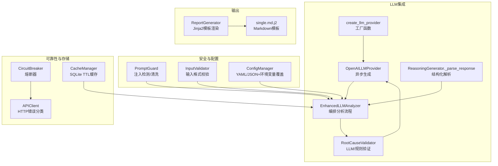
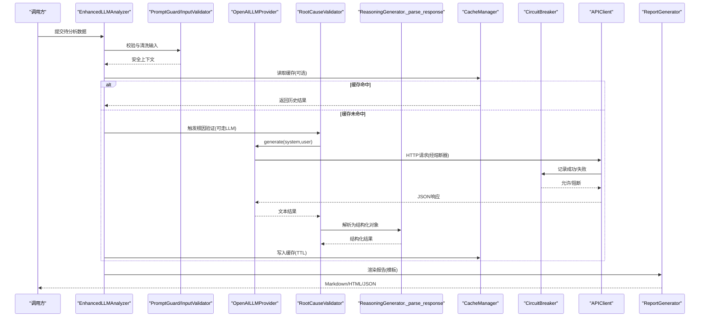
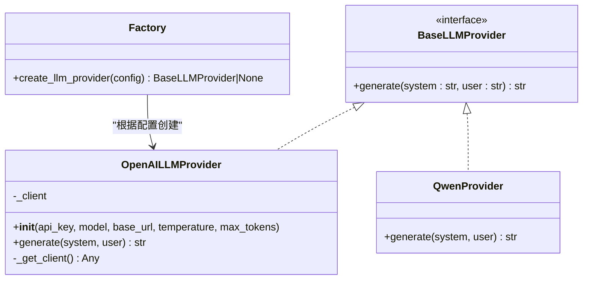
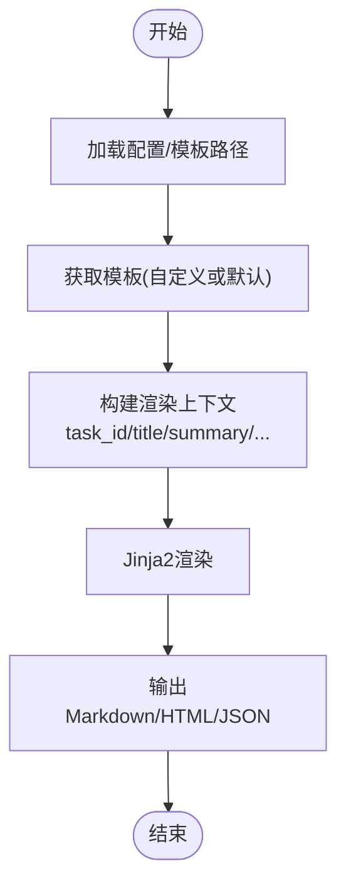
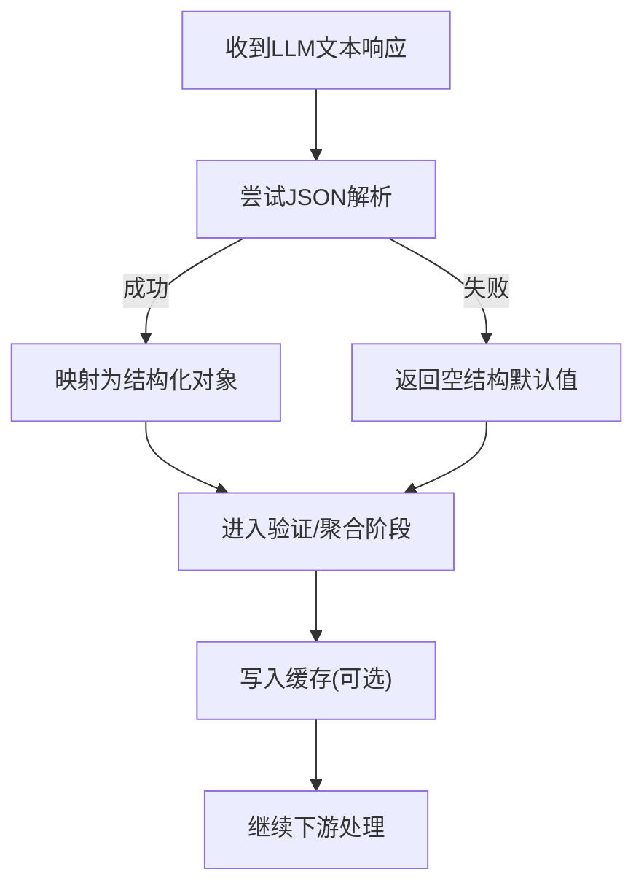
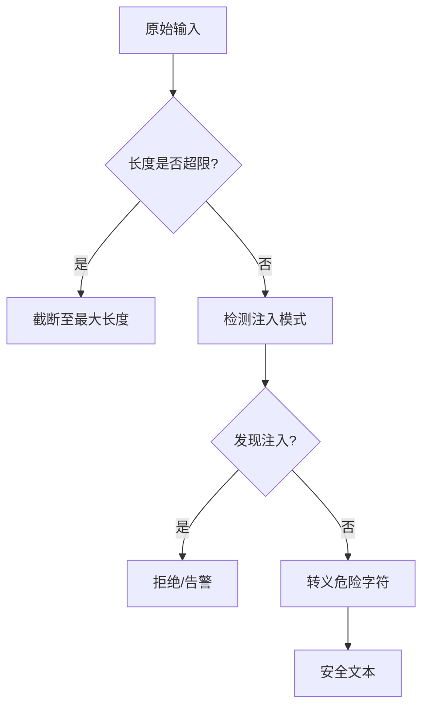
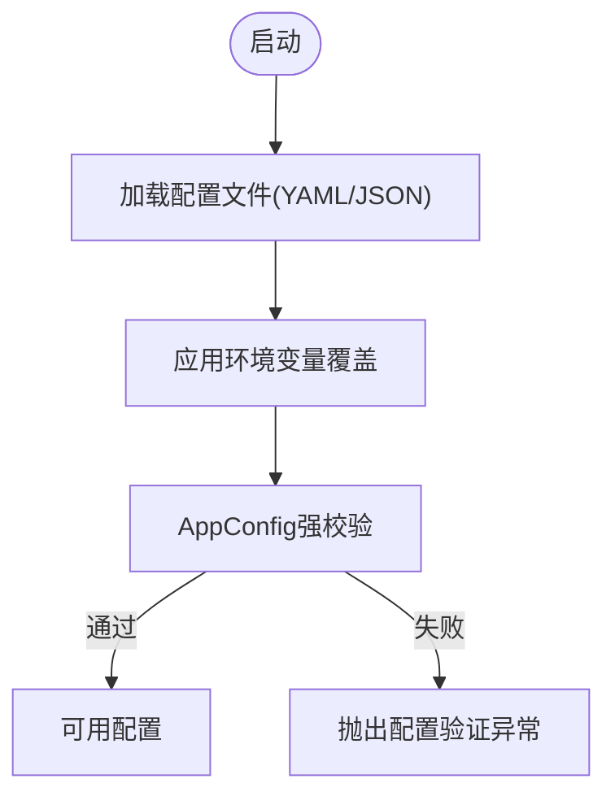
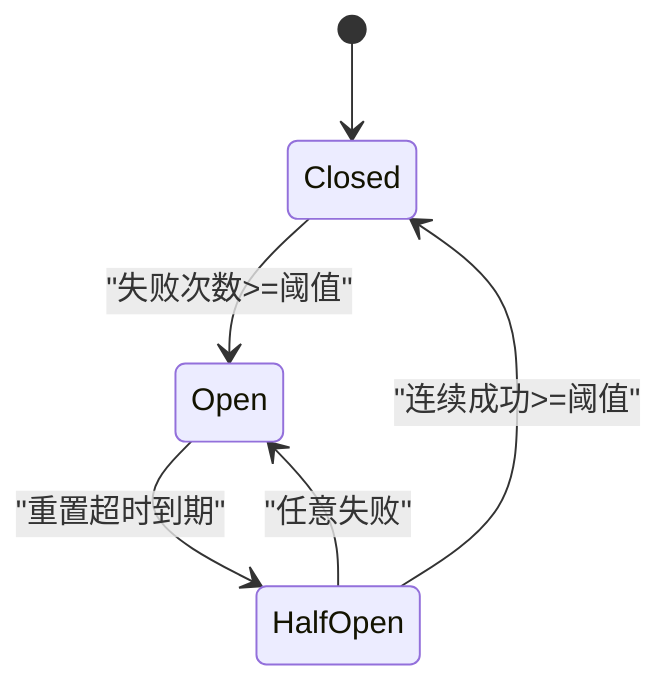
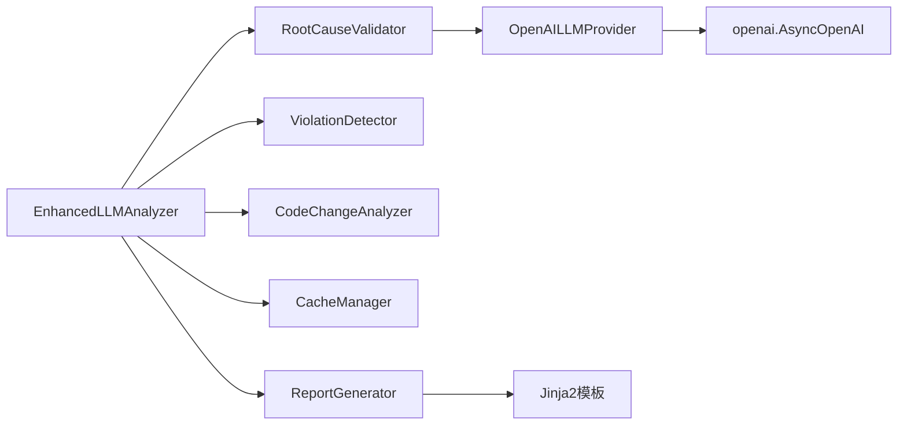

# LLM集成模块

<cite>
**本文引用的文件**   
- [src/analyzer/llm_provider.py](file://src/analyzer/llm_provider.py)
- [tests/test_llm_provider.py](file://tests/test_llm_provider.py)
- [src/security/prompt_guard.py](file://src/security/prompt_guard.py)
- [src/security/input_validator.py](file://src/security/input_validator.py)
- [src/analysis/enhanced_llm_analyzer.py](file://src/analysis/enhanced_llm_analyzer.py)
- [src/analysis/root_cause_validator.py](file://src/analysis/root_cause_validator.py)
- [src/analyzer/reasoning/generator.py](file://src/analyzer/reasoning/generator.py)
- [src/config/manager.py](file://src/config/manager.py)
- [config/config.yaml.example](file://config/config.yaml.example)
- [src/cache/manager.py](file://src/cache/manager.py)
- [src/report/generator.py](file://src/report/generator.py)
- [src/report/templates/single.md.j2](file://src/report/templates/single.md.j2)
- [src/utils/circuit_breaker.py](file://src/utils/circuit_breaker.py)
- [src/api/client.py](file://src/api/client.py)
- [scripts/analyze_faults_v2.py](file://scripts/analyze_faults_v2.py)
</cite>

## 目录
1. [简介](#简介)
2. [项目结构](#项目结构)
3. [核心组件](#核心组件)
4. [架构总览](#架构总览)
5. [详细组件分析](#详细组件分析)
6. [依赖关系分析](#依赖关系分析)
7. [性能与成本优化](#性能与成本优化)
8. [故障排除指南](#故障排除指南)
9. [结论](#结论)
10. [附录](#附录)

## 简介
本技术文档聚焦于LLM集成模块，围绕多提供商统一抽象、Prompt模板管理、响应解析与错误恢复、安全保护、并发与缓存、成本控制与配额管理等主题进行系统化说明。当前仓库实现了OpenAI提供商的异步调用封装，并提供了输入校验、注入防护、配置与环境变量覆盖、SQLite缓存、熔断器与API客户端错误分类等能力，为后续扩展更多模型（如Qwen）提供良好基础。

## 项目结构
与LLM集成相关的代码主要分布在以下位置：
- 提供商抽象与工厂：src/analyzer/llm_provider.py
- 增强分析编排：src/analysis/enhanced_llm_analyzer.py
- 根因验证与结构化解析：src/analysis/root_cause_validator.py、src/analyzer/reasoning/generator.py
- 安全与输入校验：src/security/prompt_guard.py、src/security/input_validator.py
- 配置与环境覆盖：src/config/manager.py、config/config.yaml.example
- 缓存与报告模板：src/cache/manager.py、src/report/generator.py、src/report/templates/single.md.j2
- 外部服务容错与错误分类：src/utils/circuit_breaker.py、src/api/client.py
- 示例脚本：scripts/analyze_faults_v2.py

图表来源
- [src/analyzer/llm_provider.py:1-67](file://src/analyzer/llm_provider.py#L1-L67)
- [src/analysis/enhanced_llm_analyzer.py:1-206](file://src/analysis/enhanced_llm_analyzer.py#L1-L206)
- [src/analysis/root_cause_validator.py:355-367](file://src/analysis/root_cause_validator.py#L355-L367)
- [src/analyzer/reasoning/generator.py:142-175](file://src/analyzer/reasoning/generator.py#L142-L175)
- [src/security/prompt_guard.py:1-198](file://src/security/prompt_guard.py#L1-L198)
- [src/security/input_validator.py:1-57](file://src/security/input_validator.py#L1-L57)
- [src/config/manager.py:1-268](file://src/config/manager.py#L1-L268)
- [src/utils/circuit_breaker.py:1-42](file://src/utils/circuit_breaker.py#L1-L42)
- [src/api/client.py:122-145](file://src/api/client.py#L122-L145)
- [src/cache/manager.py:1-165](file://src/cache/manager.py#L1-L165)
- [src/report/generator.py:248-737](file://src/report/generator.py#L248-L737)
- [src/report/templates/single.md.j2:1-58](file://src/report/templates/single.md.j2#L1-L58)

章节来源
- [src/analyzer/llm_provider.py:1-67](file://src/analyzer/llm_provider.py#L1-L67)
- [src/analysis/enhanced_llm_analyzer.py:1-206](file://src/analysis/enhanced_llm_analyzer.py#L1-L206)
- [src/security/prompt_guard.py:1-198](file://src/security/prompt_guard.py#L1-L198)
- [src/security/input_validator.py:1-57](file://src/security/input_validator.py#L1-L57)
- [src/config/manager.py:1-268](file://src/config/manager.py#L1-L268)
- [src/cache/manager.py:1-165](file://src/cache/manager.py#L1-L165)
- [src/report/generator.py:248-737](file://src/report/generator.py#L248-L737)
- [src/report/templates/single.md.j2:1-58](file://src/report/templates/single.md.j2#L1-L58)
- [src/utils/circuit_breaker.py:1-42](file://src/utils/circuit_breaker.py#L1-L42)
- [src/api/client.py:122-145](file://src/api/client.py#L122-L145)
- [scripts/analyze_faults_v2.py:85-115](file://scripts/analyze_faults_v2.py#L85-L115)

## 核心组件
- 多提供商抽象与OpenAI实现
  - OpenAILLMProvider：封装异步聊天补全接口，支持自定义base_url、temperature、max_tokens；通过工厂函数create_llm_provider根据配置创建实例。
  - 可扩展性：建议新增QwenProvider等实现同一抽象接口，便于在编排层无感切换。
- 增强分析编排
  - EnhancedLLMAnalyzer：串联违规检测、代码变更分析、根因提取、可落地性验证与文本汇总，支持批量处理与异常兜底。
- 根因验证与结构化解析
  - RootCauseValidator：优先尝试LLM验证，失败回退到规则验证；对LLM返回JSON做健壮解析。
  - ReasoningGenerator._parse_response：将LLM返回的JSON映射为结构化结果，包含根因列表与多维因素。
- 安全与输入校验
  - PromptGuard：检测常见注入模式、长度限制、转义危险字符，提供validate/guard便捷方法。
  - InputValidator：任务号、Token等关键输入的格式校验。
- 配置与环境覆盖
  - ConfigManager：支持YAML/JSON加载、深合并、环境变量覆盖、AppConfig强类型校验。
- 缓存与报告模板
  - CacheManager：基于SQLite的TTL缓存，支持状态查询、清理与统计。
  - ReportGenerator + Jinja2模板：按模板渲染分析报告，支持自定义模板路径与默认回退。
- 外部服务容错
  - CircuitBreaker：OPEN/HALF_OPEN/CLOSED三态，记录成功/失败，控制请求放行。
  - APIClient：按HTTP状态码分类错误（认证、未找到、限流、服务端错误），配合熔断器使用。

章节来源
- [src/analyzer/llm_provider.py:1-67](file://src/analyzer/llm_provider.py#L1-L67)
- [src/analysis/enhanced_llm_analyzer.py:1-206](file://src/analysis/enhanced_llm_analyzer.py#L1-L206)
- [src/analysis/root_cause_validator.py:355-367](file://src/analysis/root_cause_validator.py#L355-L367)
- [src/analyzer/reasoning/generator.py:142-175](file://src/analyzer/reasoning/generator.py#L142-L175)
- [src/security/prompt_guard.py:1-198](file://src/security/prompt_guard.py#L1-L198)
- [src/security/input_validator.py:1-57](file://src/security/input_validator.py#L1-L57)
- [src/config/manager.py:1-268](file://src/config/manager.py#L1-L268)
- [src/cache/manager.py:1-165](file://src/cache/manager.py#L1-L165)
- [src/report/generator.py:248-737](file://src/report/generator.py#L248-L737)
- [src/report/templates/single.md.j2:1-58](file://src/report/templates/single.md.j2#L1-L58)
- [src/utils/circuit_breaker.py:1-42](file://src/utils/circuit_breaker.py#L1-L42)
- [src/api/client.py:122-145](file://src/api/client.py#L122-L145)

## 架构总览
下图展示了从配置加载、输入安全校验、LLM调用、响应解析到报告生成的端到端流程，以及缓存与熔断器的作用点。

图表来源
- [src/analysis/enhanced_llm_analyzer.py:1-206](file://src/analysis/enhanced_llm_analyzer.py#L1-L206)
- [src/security/prompt_guard.py:1-198](file://src/security/prompt_guard.py#L1-L198)
- [src/security/input_validator.py:1-57](file://src/security/input_validator.py#L1-L57)
- [src/analyzer/llm_provider.py:1-67](file://src/analyzer/llm_provider.py#L1-L67)
- [src/analysis/root_cause_validator.py:355-367](file://src/analysis/root_cause_validator.py#L355-L367)
- [src/analyzer/reasoning/generator.py:142-175](file://src/analyzer/reasoning/generator.py#L142-L175)
- [src/cache/manager.py:1-165](file://src/cache/manager.py#L1-L165)
- [src/utils/circuit_breaker.py:1-42](file://src/utils/circuit_breaker.py#L1-L42)
- [src/api/client.py:122-145](file://src/api/client.py#L122-L145)
- [src/report/generator.py:248-737](file://src/report/generator.py#L248-L737)

## 详细组件分析

### 多提供商统一接口抽象
- 现状
  - 已实现OpenAILLMProvider，暴露generate(system, user)异步方法，内部使用AsyncOpenAI。
  - create_llm_provider根据配置构造Provider实例，若缺少api_key则返回None。
- 扩展建议
  - 定义统一抽象接口（例如BaseLLMProvider），要求实现generate或chat方法。
  - 新增QwenProvider时，复用相同工厂逻辑，通过配置provider字段选择具体实现。
  - 在编排层以“提供者无关”的方式调用，避免硬编码具体类名。

图表来源
- [src/analyzer/llm_provider.py:1-67](file://src/analyzer/llm_provider.py#L1-L67)

章节来源
- [src/analyzer/llm_provider.py:1-67](file://src/analyzer/llm_provider.py#L1-L67)
- [tests/test_llm_provider.py:1-88](file://tests/test_llm_provider.py#L1-L88)

### Prompt模板管理系统
- 模板引擎
  - 使用Jinja2模板渲染报告，支持自定义模板目录与默认回退。
  - 单任务模板single.md.j2定义了基本信息、分段详情、标签、根因与建议等区块。
- 动态参数替换
  - 通过ReportGenerator传入task_data、segments、labels、root_causes、suggestions等上下文变量，模板按需渲染。
- 上下文管理与版本控制
  - 建议在模板中增加metadata.version字段，结合配置中的模板版本标识，实现向后兼容与灰度发布。
  - 可在配置中维护template_version，并在渲染前校验兼容性。

图表来源
- [src/report/generator.py:248-737](file://src/report/generator.py#L248-L737)
- [src/report/templates/single.md.j2:1-58](file://src/report/templates/single.md.j2#L1-L58)

章节来源
- [src/report/generator.py:248-737](file://src/report/generator.py#L248-L737)
- [src/report/templates/single.md.j2:1-58](file://src/report/templates/single.md.j2#L1-L58)

### 响应解析与处理机制
- 结构化数据提取
  - ReasoningGenerator._parse_response将LLM返回的JSON字符串解析为结构化对象，包含根因列表、置信度、证据与多维度因素。
  - 解析失败时返回空结构的默认对象，保证下游稳定。
- 错误恢复与重试策略
  - RootCauseValidator优先尝试LLM验证，异常时回退到规则验证，确保可用性。
  - 建议在编排层引入指数退避重试（针对网络抖动/限流），并结合熔断器避免雪崩。
- 批处理与幂等
  - EnhancedLLMAnalyzer.analyze_batch对多个任务逐一分析，单个失败不影响整体，且记录错误信息。

图表来源
- [src/analyzer/reasoning/generator.py:142-175](file://src/analyzer/reasoning/generator.py#L142-L175)
- [src/analysis/root_cause_validator.py:355-367](file://src/analysis/root_cause_validator.py#L355-L367)
- [src/analysis/enhanced_llm_analyzer.py:172-206](file://src/analysis/enhanced_llm_analyzer.py#L172-L206)

章节来源
- [src/analyzer/reasoning/generator.py:142-175](file://src/analyzer/reasoning/generator.py#L142-L175)
- [src/analysis/root_cause_validator.py:355-367](file://src/analysis/root_cause_validator.py#L355-L367)
- [src/analysis/enhanced_llm_analyzer.py:172-206](file://src/analysis/enhanced_llm_analyzer.py#L172-L206)

### 安全保护措施
- 输入验证
  - InputValidator.validate_task_no与validate_token对关键输入进行严格格式校验，防止非法数据进入系统。
- 输出过滤与敏感信息保护
  - PromptGuard.clean_text对尖括号进行转义，降低XML注入风险；detect_injection识别常见注入模式。
  - 建议在最终输出前增加PII/密钥扫描与脱敏步骤（正则/字典匹配）。
- 注入防护
  - validate/guard提供一键式防护，检测到注入则拒绝或清洗后放行。

图表来源
- [src/security/prompt_guard.py:1-198](file://src/security/prompt_guard.py#L1-L198)
- [src/security/input_validator.py:1-57](file://src/security/input_validator.py#L1-L57)

章节来源
- [src/security/prompt_guard.py:1-198](file://src/security/prompt_guard.py#L1-L198)
- [src/security/input_validator.py:1-57](file://src/security/input_validator.py#L1-L57)

### 配置与环境变量覆盖
- 配置加载
  - ConfigManager支持YAML/JSON加载、深合并、保存与重置。
- 环境变量覆盖
  - 内置映射表支持覆盖API、LLM、Embedding、Clustering、Cache、Rules、Output、Logging等关键项。
- 应用配置强校验
  - load()会基于AppConfig进行强类型校验，失败抛出配置验证异常。

图表来源
- [src/config/manager.py:1-268](file://src/config/manager.py#L1-L268)
- [config/config.yaml.example:1-38](file://config/config.yaml.example#L1-L38)

章节来源
- [src/config/manager.py:1-268](file://src/config/manager.py#L1-L268)
- [config/config.yaml.example:1-38](file://config/config.yaml.example#L1-L38)

### 缓存策略与并发控制
- 缓存
  - CacheManager基于SQLite，支持TTL过期、状态查询、清理与统计。
  - 适合缓存LLM中间结果或完整分析结果，减少重复计算与调用成本。
- 并发与熔断
  - CircuitBreaker提供三态控制，记录成功/失败，防止级联故障。
  - APIClient按HTTP状态码分类错误，配合熔断器进行快速失败与限流保护。

图表来源
- [src/utils/circuit_breaker.py:1-42](file://src/utils/circuit_breaker.py#L1-L42)
- [src/api/client.py:122-145](file://src/api/client.py#L122-L145)
- [src/cache/manager.py:1-165](file://src/cache/manager.py#L1-L165)

章节来源
- [src/cache/manager.py:1-165](file://src/cache/manager.py#L1-L165)
- [src/utils/circuit_breaker.py:1-42](file://src/utils/circuit_breaker.py#L1-L42)
- [src/api/client.py:122-145](file://src/api/client.py#L122-L145)

### 实际集成示例
- 脚本示例
  - scripts/analyze_faults_v2.py中演示了如何根据配置初始化OpenAILLMProvider，并通过API获取任务数据后进行后续处理。
- API客户端
  - src/api/client.py展示了对不同HTTP状态码的错误分类与熔断器记录，便于上层统一处理。

章节来源
- [scripts/analyze_faults_v2.py:85-115](file://scripts/analyze_faults_v2.py#L85-L115)
- [src/api/client.py:122-145](file://src/api/client.py#L122-L145)

## 依赖关系分析
- 组件耦合
  - EnhancedLLMAnalyzer依赖RootCauseValidator、ViolationDetector、CodeChangeAnalyzer等子组件，职责清晰、内聚度高。
  - OpenAILLMProvider仅依赖openai库，易于替换为其他SDK。
- 外部依赖
  - openai（异步客户端）、Jinja2（模板）、sqlite3（缓存）、PyYAML（配置）。
- 潜在循环依赖
  - 当前未见明显循环导入；建议在新增Provider时保持工厂与编排层的单向依赖。

图表来源
- [src/analysis/enhanced_llm_analyzer.py:1-206](file://src/analysis/enhanced_llm_analyzer.py#L1-L206)
- [src/analysis/root_cause_validator.py:355-367](file://src/analysis/root_cause_validator.py#L355-L367)
- [src/analyzer/llm_provider.py:1-67](file://src/analyzer/llm_provider.py#L1-L67)
- [src/cache/manager.py:1-165](file://src/cache/manager.py#L1-L165)
- [src/report/generator.py:248-737](file://src/report/generator.py#L248-L737)

章节来源
- [src/analysis/enhanced_llm_analyzer.py:1-206](file://src/analysis/enhanced_llm_analyzer.py#L1-L206)
- [src/analysis/root_cause_validator.py:355-367](file://src/analysis/root_cause_validator.py#L355-L367)
- [src/analyzer/llm_provider.py:1-67](file://src/analyzer/llm_provider.py#L1-L67)
- [src/cache/manager.py:1-165](file://src/cache/manager.py#L1-L165)
- [src/report/generator.py:248-737](file://src/report/generator.py#L248-L737)

## 性能与成本优化
- 请求批处理
  - 在嵌入与推理阶段采用分批并发策略，减少往返开销；对视觉模型等特殊场景采用单条处理以保证正确性。
- 缓存策略
  - 使用CacheManager对中间结果或最终结果进行TTL缓存，显著降低重复计算与API调用成本。
- 并发控制
  - 借助CircuitBreaker与APIClient的错误分类，避免雪崩与资源耗尽；对限流错误快速失败，由上层重试调度。
- 成本控制与配额管理
  - 通过配置控制temperature、max_tokens与模型选择，平衡质量与成本。
  - 结合缓存命中率监控与熔断器指标，评估成本收益并调整策略。
  - 建议在编排层加入用量统计与配额检查，达到上限时降级为规则分析或本地缓存结果。

[本节为通用指导，不直接分析具体文件]

## 故障排除指南
- 常见问题定位
  - 认证失败：检查X-API-Token是否正确，确认环境变量API_VALID_TOKENS是否配置。
  - 限流：关注429响应与熔断器状态，适当降低并发或延长重试间隔。
  - 模板渲染失败：确认模板路径与变量完整性，必要时回退默认模板。
  - 解析失败：当LLM返回非JSON时，系统将返回空结构，需检查提示词与约束。
- 日志与观测
  - 利用loguru记录关键节点日志，结合熔断器统计与缓存状态，辅助问题定位。
- 恢复策略
  - 启用规则验证作为LLM失败的降级路径；对网络抖动采用指数退避重试；对不可用服务快速熔断。

章节来源
- [src/api/client.py:122-145](file://src/api/client.py#L122-L145)
- [src/utils/circuit_breaker.py:1-42](file://src/utils/circuit_breaker.py#L1-L42)
- [src/report/generator.py:248-737](file://src/report/generator.py#L248-L737)
- [src/analyzer/reasoning/generator.py:142-175](file://src/analyzer/reasoning/generator.py#L142-L175)

## 结论
本模块已具备多提供商抽象的基础能力与安全、配置、缓存、熔断等工程化保障。下一步建议完善统一抽象接口与Qwen等提供商实现，强化提示词模板的版本管理与安全扫描，完善重试与配额控制策略，提升整体稳定性与成本效率。

[本节为总结性内容，不直接分析具体文件]

## 附录
- 配置示例参考
  - config/config.yaml.example提供API、LLM、Embedding、Clustering、Cache、Rules、Output、Logging等关键配置项示例。
- 测试用例参考
  - tests/test_llm_provider.py覆盖了Provider初始化、base_url、generate行为与空响应处理等场景。

章节来源
- [config/config.yaml.example:1-38](file://config/config.yaml.example#L1-L38)
- [tests/test_llm_provider.py:1-88](file://tests/test_llm_provider.py#L1-L88)
