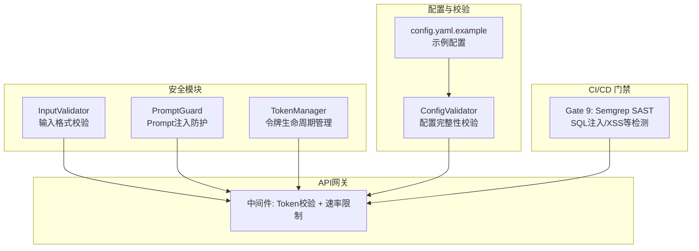
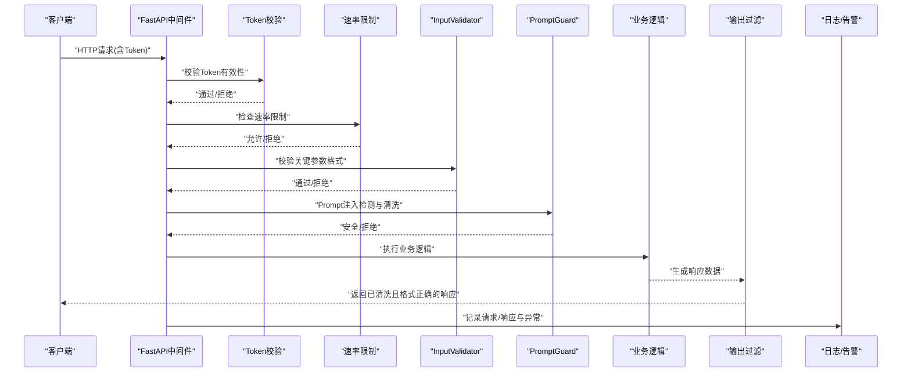
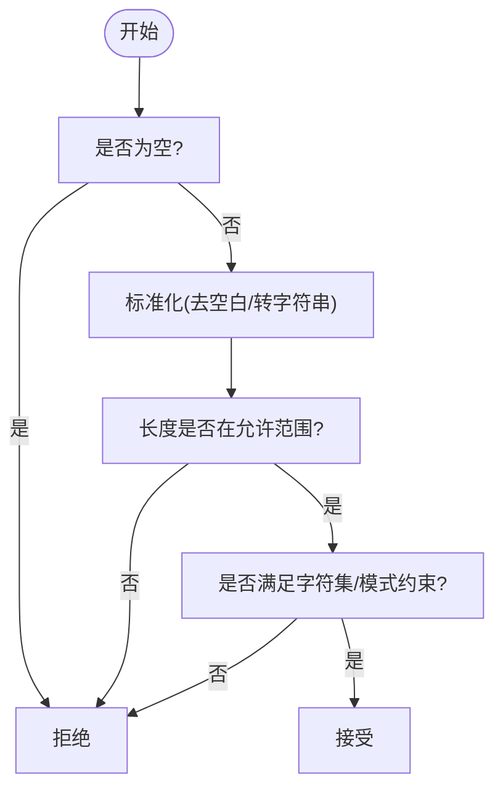
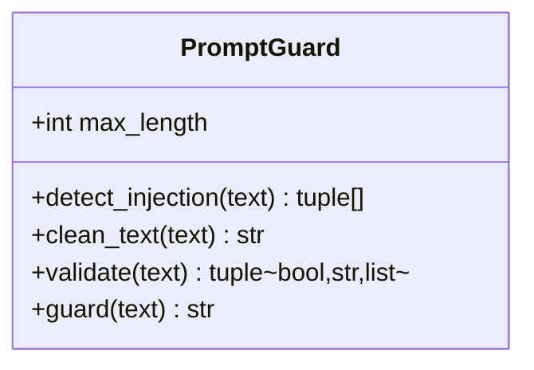
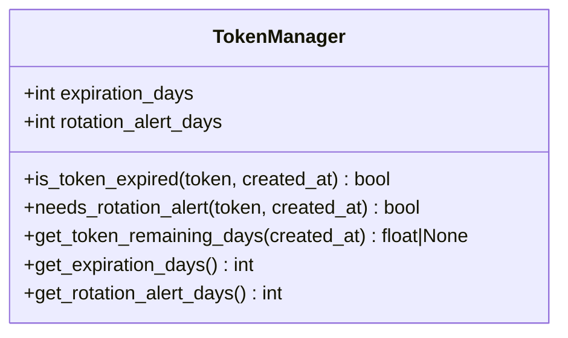
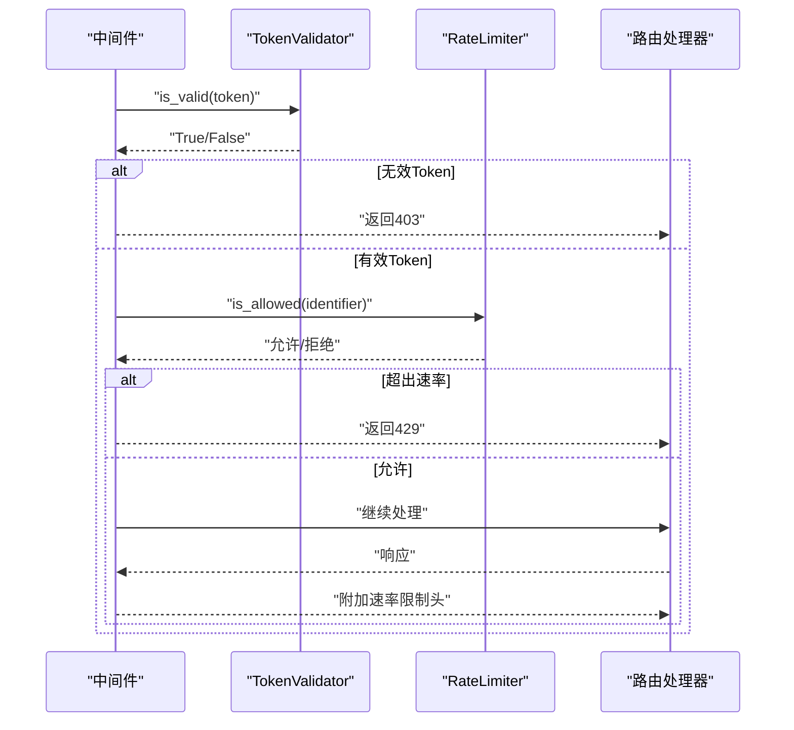
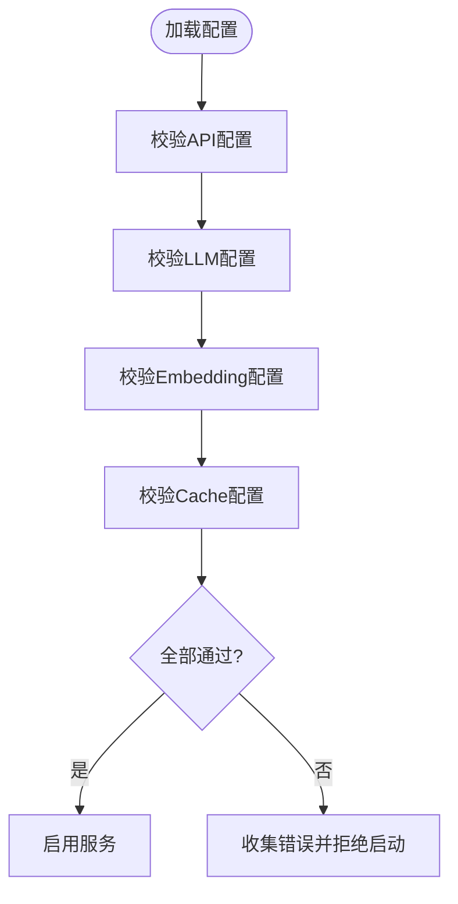
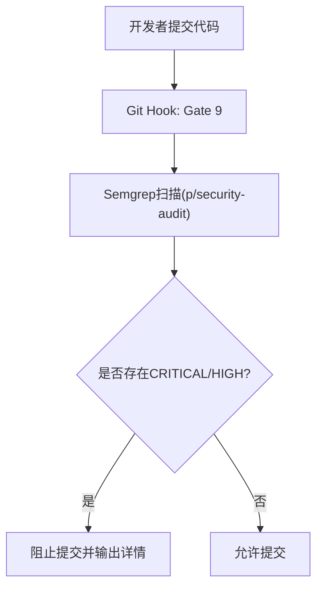
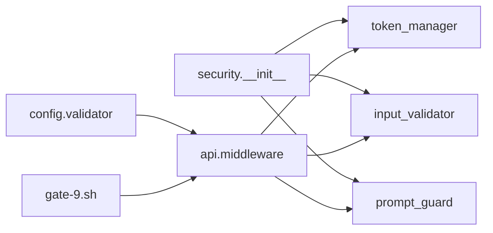

# Prompt安全过滤

<cite>
**本文引用的文件**   
- [src/security/__init__.py](file://src/security/__init__.py)
- [src/security/input_validator.py](file://src/security/input_validator.py)
- [src/security/prompt_guard.py](file://src/security/prompt_guard.py)
- [src/security/token_manager.py](file://src/security/token_manager.py)
- [src/api/middleware.py](file://src/api/middleware.py)
- [src/config/validator.py](file://src/config/validator.py)
- [config/config.yaml.example](file://config/config.yaml.example)
- [tests/security/test_input_validator.py](file://tests/security/test_input_validator.py)
- [tests/security/test_prompt_guard.py](file://tests/security/test_prompt_guard.py)
- [tests/security/test_token_manager.py](file://tests/security/test_token_manager.py)
- [githooks/gate-9.sh](file://githooks/gate-9.sh)
</cite>

## 目录
1. [简介](#简介)
2. [项目结构](#项目结构)
3. [核心组件](#核心组件)
4. [架构总览](#架构总览)
5. [详细组件分析](#详细组件分析)
6. [依赖关系分析](#依赖关系分析)
7. [性能与可扩展性](#性能与可扩展性)
8. [配置与安全策略](#配置与安全策略)
9. [测试与审计指南](#测试与审计指南)
10. [威胁防护与应急响应](#威胁防护与应急响应)
11. [结论](#结论)

## 简介
本文件为“Prompt安全过滤系统”的安全文档，聚焦于输入验证、输出过滤、安全防护层设计、配置项、测试与审计方法，以及常见威胁的防护与应急响应流程。系统围绕以下目标构建：
- 输入侧：恶意内容检测、敏感信息识别、SQL注入防护（结合规则引擎与SAST门禁）
- 输出侧：响应清洗、格式校验、内容安全扫描
- 防护层：多层过滤、白名单机制、黑名单规则
- 可观测性：日志记录与告警
- 可测试性：单元与集成测试、渗透测试用例与审计方法

## 项目结构
安全相关代码集中在 src/security 模块，API 中间件提供认证与速率限制，配置校验器保障配置安全，Git Hook 集成 SAST 扫描以拦截高危漏洞。

图示来源
- [src/security/__init__.py:1-26](file://src/security/__init__.py#L1-L26)
- [src/security/input_validator.py:1-74](file://src/security/input_validator.py#L1-L74)
- [src/security/prompt_guard.py:1-198](file://src/security/prompt_guard.py#L1-L198)
- [src/security/token_manager.py:1-115](file://src/security/token_manager.py#L1-L115)
- [src/api/middleware.py:1-173](file://src/api/middleware.py#L1-L173)
- [src/config/validator.py:1-196](file://src/config/validator.py#L1-L196)
- [config/config.yaml.example:1-38](file://config/config.yaml.example#L1-L38)
- [githooks/gate-9.sh:1-130](file://githooks/gate-9.sh#L1-L130)

章节来源
- [src/security/__init__.py:1-26](file://src/security/__init__.py#L1-L26)
- [src/api/middleware.py:1-173](file://src/api/middleware.py#L1-L173)
- [src/config/validator.py:1-196](file://src/config/validator.py#L1-L196)
- [config/config.yaml.example:1-38](file://config/config.yaml.example#L1-L38)
- [githooks/gate-9.sh:1-130](file://githooks/gate-9.sh#L1-L130)

## 核心组件
- InputValidator：对关键输入进行严格格式校验（如任务编号、令牌长度），防止越界与非法字符进入下游处理。
- PromptGuard：针对LLM输入的Prompt注入防护，包含模式检测、文本清洗与统一验证入口。
- TokenManager：令牌过期与轮换告警管理，辅助认证与访问控制。
- API中间件：在请求入口处执行Token校验与速率限制，并记录请求/响应日志。
- ConfigValidator：校验应用配置完整性，避免不安全或缺失的配置导致运行时风险。
- Gate 9（Semgrep SAST）：在提交阶段扫描SQL注入、XSS等安全问题，阻断高危变更。

章节来源
- [src/security/input_validator.py:1-74](file://src/security/input_validator.py#L1-L74)
- [src/security/prompt_guard.py:1-198](file://src/security/prompt_guard.py#L1-L198)
- [src/security/token_manager.py:1-115](file://src/security/token_manager.py#L1-L115)
- [src/api/middleware.py:1-173](file://src/api/middleware.py#L1-L173)
- [src/config/validator.py:1-196](file://src/config/validator.py#L1-L196)
- [githooks/gate-9.sh:1-130](file://githooks/gate-9.sh#L1-L130)

## 架构总览
下图展示从客户端到业务处理的完整安全路径：中间件负责认证与限流；输入在进入业务前经InputValidator与PromptGuard双重校验；输出返回前进行清洗与格式校验；配置由ConfigValidator确保正确；提交阶段通过Semgrep进行静态安全扫描。

图示来源
- [src/api/middleware.py:62-141](file://src/api/middleware.py#L62-L141)
- [src/security/input_validator.py:8-74](file://src/security/input_validator.py#L8-L74)
- [src/security/prompt_guard.py:100-141](file://src/security/prompt_guard.py#L100-L141)

## 详细组件分析

### 输入验证机制
- 任务编号校验：要求仅数字、长度范围固定，避免越界或非法字符进入下游。
- 令牌格式校验：非空字符串、长度区间限制，降低畸形输入导致的解析错误。
- 建议扩展：增加敏感信息识别（如手机号、邮箱、身份证号、密钥片段）的正则匹配与屏蔽策略。

章节来源
- [src/security/input_validator.py:12-45](file://src/security/input_validator.py#L12-L45)
- [src/security/input_validator.py:47-74](file://src/security/input_validator.py#L47-L74)
- [tests/security/test_input_validator.py:1-64](file://tests/security/test_input_validator.py#L1-L64)

### Prompt注入防护（输入侧）
- 模式检测：覆盖忽略指令、系统提示词覆盖、角色切换、特殊模式（DAN）、XML标签注入等。
- 文本清洗：转义可能引发解析问题的符号（如尖括号）。
- 统一验证：长度限制、注入检测、安全返回或拒绝。

图示来源
- [src/security/prompt_guard.py:12-141](file://src/security/prompt_guard.py#L12-L141)

章节来源
- [src/security/prompt_guard.py:19-98](file://src/security/prompt_guard.py#L19-L98)
- [src/security/prompt_guard.py:100-141](file://src/security/prompt_guard.py#L100-L141)
- [tests/security/test_prompt_guard.py:1-147](file://tests/security/test_prompt_guard.py#L1-L147)

### 令牌管理与认证（访问控制）
- 过期检测：基于创建时间与有效期计算是否过期。
- 轮换告警：在到期前若干天触发告警，便于提前轮换。
- 剩余天数：用于监控面板与告警阈值判断。

图示来源
- [src/security/token_manager.py:8-115](file://src/security/token_manager.py#L8-L115)

章节来源
- [src/security/token_manager.py:35-115](file://src/security/token_manager.py#L35-L115)
- [tests/security/test_token_manager.py:1-120](file://tests/security/test_token_manager.py#L1-L120)

### API中间件（认证与速率限制）
- Token校验：支持Header与Query参数两种方式获取Token，未配置有效Token集合时允许所有请求（开发模式）。
- 速率限制：按分钟窗口统计请求数，超限返回429并附带重试时间。
- 日志记录：记录请求与响应耗时，异常堆栈记录便于排查。

图示来源
- [src/api/middleware.py:48-141](file://src/api/middleware.py#L48-L141)

章节来源
- [src/api/middleware.py:1-173](file://src/api/middleware.py#L1-L173)

### 配置校验（安全基线）
- API配置：基础URL、超时、重试次数、路径前缀等必填与合法性校验。
- LLM配置：提供商白名单、模型与API Key必填、温度与最大Token范围校验。
- Embedding配置：提供商白名单、本地与非本地差异校验、批大小与Base URL校验。
- Cache配置：存储类型白名单、TTL非负、持久化存储需数据库路径。

图示来源
- [src/config/validator.py:16-196](file://src/config/validator.py#L16-L196)

章节来源
- [src/config/validator.py:16-196](file://src/config/validator.py#L16-L196)
- [config/config.yaml.example:1-38](file://config/config.yaml.example#L1-L38)

### SQL注入防护（规则引擎与SAST）
- 规则引擎：内置与自定义规则加载、类别划分、条件评估与结果聚合。
- SAST门禁：在提交阶段使用Semgrep扫描SQL注入、XSS等高危问题，阻断CRITICAL/HIGH级别发现。

图示来源
- [githooks/gate-9.sh:1-130](file://githooks/gate-9.sh#L1-L130)

章节来源
- [githooks/gate-9.sh:1-130](file://githooks/gate-9.sh#L1-L130)

## 依赖关系分析
- 安全模块对外暴露统一接口（__all__），供API中间件与业务层调用。
- 中间件依赖TokenValidator与RateLimiter实现认证与限流。
- 配置校验器独立于运行时，仅在启动阶段生效，确保配置安全基线。
- Git Hook作为外部工具链，与代码仓库集成，形成持续安全门禁。

图示来源
- [src/security/__init__.py:1-26](file://src/security/__init__.py#L1-L26)
- [src/api/middleware.py:1-173](file://src/api/middleware.py#L1-L173)
- [src/config/validator.py:1-196](file://src/config/validator.py#L1-L196)
- [githooks/gate-9.sh:1-130](file://githooks/gate-9.sh#L1-L130)

章节来源
- [src/security/__init__.py:1-26](file://src/security/__init__.py#L1-L26)
- [src/api/middleware.py:1-173](file://src/api/middleware.py#L1-L173)
- [src/config/validator.py:1-196](file://src/config/validator.py#L1-L196)
- [githooks/gate-9.sh:1-130](file://githooks/gate-9.sh#L1-L130)

## 性能与可扩展性
- PromptGuard正则匹配为线性扫描，建议在大规模场景下考虑预编译与缓存命中优化。
- RateLimiter使用内存字典存储最近一分钟请求时间戳，适合单机部署；分布式环境建议使用Redis等共享存储。
- 配置校验在启动阶段一次性完成，不影响运行时性能。
- SAST扫描在CI阶段运行，不阻塞生产流量。

[本节为通用指导，无需具体文件引用]

## 配置与安全策略
- 过滤规则自定义：
  - 通过规则引擎加载内置与自定义规则（YAML），支持类别、严重级别、条件表达式与消息模板。
  - 可在配置中启用/禁用特定规则，动态调整黑白名单。
- 日志记录与告警：
  - 中间件记录请求/响应与异常耗时，便于追踪与定位。
  - TokenManager提供剩余天数与轮换告警阈值，便于运维监控。
- 速率限制与访问控制：
  - 中间件默认每分钟60次请求，可按需调整；支持按Token或IP标识。
- 配置校验：
  - 强制要求必要字段与合法取值，避免不安全配置上线。

章节来源
- [src/api/middleware.py:13-46](file://src/api/middleware.py#L13-L46)
- [src/security/token_manager.py:89-115](file://src/security/token_manager.py#L89-L115)
- [src/config/validator.py:53-196](file://src/config/validator.py#L53-L196)
- [config/config.yaml.example:1-38](file://config/config.yaml.example#L1-L38)

## 测试与审计指南
- 单元测试：
  - InputValidator：覆盖边界值、非法字符、长度越界等用例。
  - PromptGuard：覆盖各类注入模式、长度限制、清洗行为与便捷函数。
  - TokenManager：覆盖过期判定、轮换告警、剩余天数计算与自定义阈值。
- 集成测试：
  - 中间件：Token缺失/无效、速率限制触发、日志输出与响应头设置。
- 渗透测试用例：
  - Prompt注入：尝试忽略指令、系统提示词覆盖、角色切换、XML标签注入等。
  - SQL注入：构造拼接查询、危险关键字组合，验证规则引擎与SAST拦截效果。
  - 越权访问：伪造Token、绕过鉴权路径，验证中间件拦截。
- 安全审计方法：
  - 定期审查规则库更新与误报率，调整阈值与白名单。
  - 结合Semgrep结果与运行时日志，建立告警与闭环整改流程。

章节来源
- [tests/security/test_input_validator.py:1-64](file://tests/security/test_input_validator.py#L1-L64)
- [tests/security/test_prompt_guard.py:1-147](file://tests/security/test_prompt_guard.py#L1-L147)
- [tests/security/test_token_manager.py:1-120](file://tests/security/test_token_manager.py#L1-L120)
- [src/api/middleware.py:81-141](file://src/api/middleware.py#L81-L141)
- [githooks/gate-9.sh:35-130](file://githooks/gate-9.sh#L35-L130)

## 威胁防护与应急响应
- 常见威胁与防护措施：
  - Prompt注入：通过PromptGuard的模式检测与文本清洗阻断；必要时直接拒绝请求。
  - SQL注入：规则引擎匹配危险模式；SAST在提交阶段拦截高危变更。
  - 越权访问：中间件强制Token校验与速率限制，未配置有效Token集合时仅用于开发模式。
  - 配置风险：启动前严格校验，禁止不安全或缺失配置上线。
- 应急响应流程：
  - 监测：日志与告警平台捕获异常与攻击特征。
  - 隔离：临时提升拦截强度（收紧PromptGuard规则、降低速率限制阈值）。
  - 修复：更新规则库与补丁，重新运行SAST与回归测试。
  - 复盘：记录事件影响面、根因分析与改进措施，纳入知识库。

[本节为通用指导，无需具体文件引用]

## 结论
本安全体系通过输入验证、Prompt注入防护、令牌管理、API中间件、配置校验与SAST门禁形成多层防御。建议在生产环境中：
- 完善敏感信息识别与输出清洗策略
- 将速率限制迁移至分布式存储以提升一致性
- 持续维护规则库与告警阈值，结合日志与审计闭环治理

[本节为总结性内容，无需具体文件引用]
