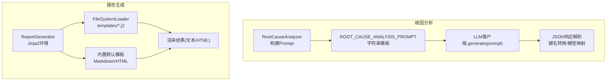
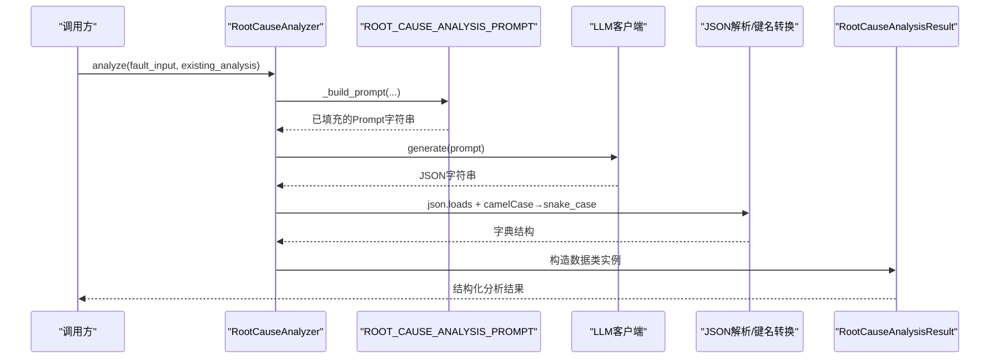
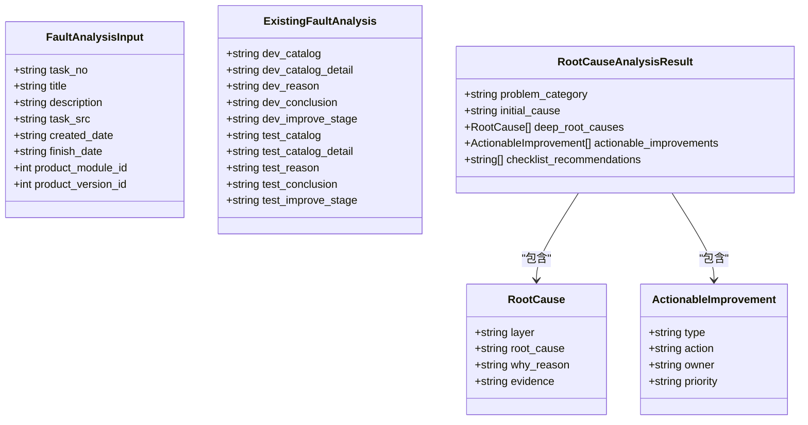
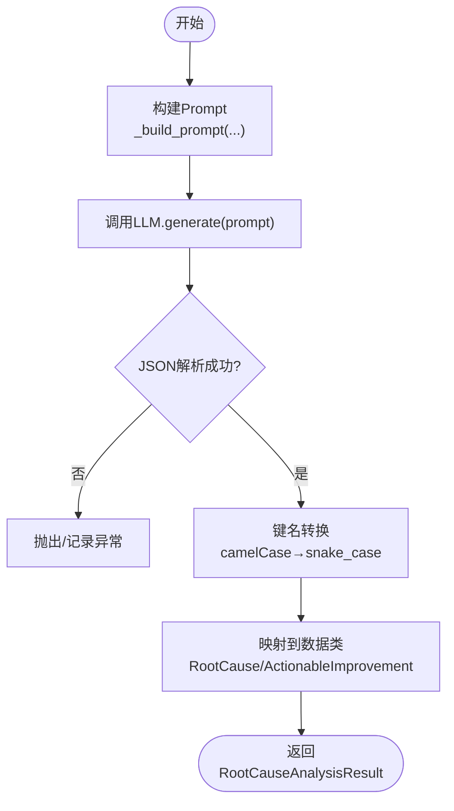
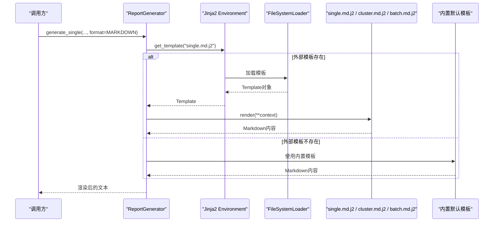
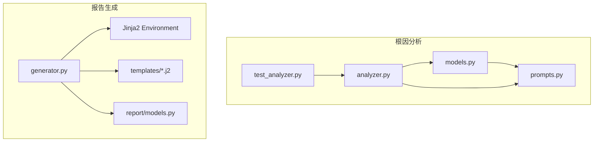

# Prompt模板引擎

<cite>
**本文引用的文件**
- [src/analysis/root_cause/prompts.py](file://src/analysis/root_cause/prompts.py)
- [src/analysis/root_cause/analyzer.py](file://src/analysis/root_cause/analyzer.py)
- [src/analysis/root_cause/models.py](file://src/analysis/root_cause/models.py)
- [src/report/generator.py](file://src/report/generator.py)
- [src/report/templates/single.md.j2](file://src/report/templates/single.md.j2)
- [src/report/templates/cluster.md.j2](file://src/report/templates/cluster.md.j2)
- [src/report/templates/batch.md.j2](file://src/report/templates/batch.md.j2)
- [src/report/models.py](file://src/report/models.py)
- [tests/analysis/root_cause/test_analyzer.py](file://tests/analysis/root_cause/test_analyzer.py)
</cite>

## 目录
1. [简介](#简介)
2. [项目结构](#项目结构)
3. [核心组件](#核心组件)
4. [架构总览](#架构总览)
5. [详细组件分析](#详细组件分析)
6. [依赖关系分析](#依赖关系分析)
7. [性能考虑](#性能考虑)
8. [故障排查指南](#故障排查指南)
9. [结论](#结论)
10. [附录](#附录)

## 简介
本技术文档聚焦于Prompt模板引擎的设计与实现，围绕Jinja2模板引擎的集成、根因分析Prompt的结构设计、模板参数系统（动态数据绑定、类型验证与默认值处理）、以及模板开发最佳实践展开。文档同时提供扩展新Prompt模板类型的模式与示例路径，帮助读者快速理解并复用现有能力。

## 项目结构
本项目在“报告生成”和“根因分析”两条主线中分别使用了不同的模板机制：
- 根因分析Prompt采用字符串模板+Python格式化注入变量，用于驱动LLM进行结构化输出解析。
- 报告生成使用Jinja2模板引擎，支持从文件系统加载自定义模板，并提供内置默认模板作为回退。

图表来源
- [src/analysis/root_cause/analyzer.py:56-77](file://src/analysis/root_cause/analyzer.py#L56-L77)
- [src/analysis/root_cause/prompts.py:1-85](file://src/analysis/root_cause/prompts.py#L1-L85)
- [src/report/generator.py:222-248](file://src/report/generator.py#L222-L248)
- [src/report/generator.py:250-303](file://src/report/generator.py#L250-L303)

章节来源
- [src/analysis/root_cause/analyzer.py:1-131](file://src/analysis/root_cause/analyzer.py#L1-L131)
- [src/analysis/root_cause/prompts.py:1-85](file://src/analysis/root_cause/prompts.py#L1-L85)
- [src/report/generator.py:1-790](file://src/report/generator.py#L1-L790)

## 核心组件
- 根因分析Prompt模板：定义问题分类、深层根因挖掘、输出格式与分析要求，通过占位符注入故障信息与现有复盘结论。
- 根因分析器：负责将输入模型字段映射到Prompt占位符，调用LLM并解析返回的JSON为结构化结果。
- 报告生成器：基于Jinja2的模板渲染引擎，支持从外部模板目录加载模板，并在缺失时回退到内置默认模板；提供多种输出格式（Markdown/HTML/PDF/JSON）。

章节来源
- [src/analysis/root_cause/prompts.py:1-85](file://src/analysis/root_cause/prompts.py#L1-L85)
- [src/analysis/root_cause/analyzer.py:44-131](file://src/analysis/root_cause/analyzer.py#L44-L131)
- [src/report/generator.py:222-303](file://src/report/generator.py#L222-L303)

## 架构总览
下图展示了从输入数据到最终输出的端到端流程，包括两种模板机制的协作点。

图表来源
- [src/analysis/root_cause/analyzer.py:56-116](file://src/analysis/root_cause/analyzer.py#L56-L116)
- [src/analysis/root_cause/prompts.py:1-85](file://src/analysis/root_cause/prompts.py#L1-L85)

章节来源
- [src/analysis/root_cause/analyzer.py:1-131](file://src/analysis/root_cause/analyzer.py#L1-L131)
- [src/analysis/root_cause/prompts.py:1-85](file://src/analysis/root_cause/prompts.py#L1-L85)

## 详细组件分析

### 根因分析Prompt模板
- 模板结构
  - 故障信息注入：单号、标题、描述、来源、时间等字段。
  - 现有结论引用：研发环节与测试环节的“分类/原因/结论/改进措施”，明确“仅供参考，不要直接复制”。
  - 分析要求定义：问题分类、深层根因挖掘（追问链）、输出格式（JSON）与注意事项。
- 变量替换语法
  - 使用Python字符串.format()风格的占位符，如{task_no}、{dev_reason}等。
  - 所有占位符由RootCauseAnalyzer._build_prompt按字段一一映射注入。
- 上下文管理
  - 输入上下文由FaultAnalysisInput与ExistingFaultAnalysis两个数据类承载，保证字段完整与类型约束。
  - 输出上下文由RootCauseAnalysisResult承载，包含问题分类、初始归因、深层根因、可落地改进与检查清单建议。

图表来源
- [src/analysis/root_cause/models.py:1-67](file://src/analysis/root_cause/models.py#L1-L67)

章节来源
- [src/analysis/root_cause/prompts.py:1-85](file://src/analysis/root_cause/prompts.py#L1-L85)
- [src/analysis/root_cause/models.py:1-67](file://src/analysis/root_cause/models.py#L1-L67)

### 根因分析器（Prompt构建与解析）
- 职责
  - 将输入模型的字段映射到Prompt占位符，生成最终Prompt。
  - 调用LLM获取JSON响应，解析并转换为结构化结果。
- 关键流程
  - _build_prompt：组装故障信息与现有结论，注入到ROOT_CAUSE_ANALYSIS_PROMPT。
  - analyze：异步调用LLM，解析JSON，执行camelCase到snake_case的键名转换，再映射到数据类。
- 错误处理
  - 对LLM响应进行json.loads解析；若失败或字段缺失，上层需捕获异常并记录日志。
  - 键名转换函数递归处理嵌套结构与列表，确保后续模型构造稳定。

图表来源
- [src/analysis/root_cause/analyzer.py:56-116](file://src/analysis/root_cause/analyzer.py#L56-L116)

章节来源
- [src/analysis/root_cause/analyzer.py:1-131](file://src/analysis/root_cause/analyzer.py#L1-L131)

### Jinja2模板引擎集成（报告生成）
- 模板环境
  - 当提供template_dir且存在时，初始化Jinja2 Environment并使用FileSystemLoader加载*.j2模板。
  - 未提供或加载失败时，回退到内置默认模板（Markdown/HTML）。
- 渲染入口
  - generate_single/generate_cluster/generate_batch：根据格式选择模板或内置模板，渲染后返回字符串。
  - get_template：尝试从外部模板目录获取指定名称的模板（自动附加扩展名）。
- 安全与转义
  - 启用select_autoescape以进行HTML转义，避免XSS风险。
- 数据绑定
  - 通过关键字参数将业务数据传入模板，例如task_id、title、summary、labels、root_causes、suggestions、metadata等。
  - 内置模板使用Jinja2语法进行条件判断、循环与过滤器（如join、map、format）。

图表来源
- [src/report/generator.py:222-248](file://src/report/generator.py#L222-L248)
- [src/report/generator.py:250-303](file://src/report/generator.py#L250-L303)
- [src/report/templates/single.md.j2:1-58](file://src/report/templates/single.md.j2#L1-L58)
- [src/report/templates/cluster.md.j2:1-36](file://src/report/templates/cluster.md.j2#L1-L36)
- [src/report/templates/batch.md.j2:1-31](file://src/report/templates/batch.md.j2#L1-L31)

章节来源
- [src/report/generator.py:1-790](file://src/report/generator.py#L1-L790)
- [src/report/templates/single.md.j2:1-58](file://src/report/templates/single.md.j2#L1-L58)
- [src/report/templates/cluster.md.j2:1-36](file://src/report/templates/cluster.md.j2#L1-L36)
- [src/report/templates/batch.md.j2:1-31](file://src/report/templates/batch.md.j2#L1-L31)

### 模板参数系统与类型验证
- 动态数据绑定
  - 根因分析：通过Python字符串.format()将模型字段注入到Prompt占位符。
  - 报告生成：通过Jinja2.render(**kwargs)将字典或对象属性注入到模板。
- 类型验证与默认值
  - 根因分析：使用dataclass定义输入/输出模型，强制字段类型与必填项；analyze_to_dict提供同步接口便于调试。
  - 报告生成：validate_data校验ReportData的关键字段（标题、生成时间、摘要类型），缺失则抛出异常。
- 默认值处理
  - 报告生成：generate_*方法在缺少可选参数时使用空列表或空字典作为默认值，避免模板渲染报错。
  - 根因分析：ExistingFaultAnalysis各字段提供空字符串默认值，允许部分信息缺失时仍可构建Prompt。

章节来源
- [src/analysis/root_cause/models.py:1-67](file://src/analysis/root_cause/models.py#L1-L67)
- [src/analysis/root_cause/analyzer.py:118-131](file://src/analysis/root_cause/analyzer.py#L118-L131)
- [src/report/generator.py:718-737](file://src/report/generator.py#L718-L737)
- [src/report/generator.py:250-303](file://src/report/generator.py#L250-L303)

### 模板开发最佳实践
- 命名规范
  - 模板文件名遵循“功能.格式.j2”约定，如single.md.j2、cluster.md.j2、batch.md.j2。
  - 占位符命名保持语义清晰，与数据模型字段保持一致（如task_id、title、summary）。
- 注释标准
  - 在模板顶部添加简要说明，标注所需上下文键与输出格式。
  - 在复杂逻辑块前后添加注释，解释分支与过滤器的用途。
- 调试技巧
  - 优先使用外部模板目录进行迭代，便于热更新与对比差异。
  - 在ReportGenerator中捕获异常并记录警告，定位模板缺失或渲染错误。
  - 对于根因分析，打印生成的Prompt与LLM响应长度，辅助定位注入问题。
- 安全与健壮性
  - 启用autoescape，避免HTML注入风险。
  - 对缺失字段提供默认值，防止模板渲染中断。
  - 对LLM返回的JSON进行严格解析与键名转换，降低下游解析失败概率。

章节来源
- [src/report/generator.py:222-248](file://src/report/generator.py#L222-L248)
- [src/report/generator.py:250-303](file://src/report/generator.py#L250-L303)
- [src/report/generator.py:707-716](file://src/report/generator.py#L707-L716)
- [src/analysis/root_cause/analyzer.py:92-116](file://src/analysis/root_cause/analyzer.py#L92-L116)

### 扩展新的Prompt模板类型（使用模式与示例路径）
- 新增根因分析Prompt模板
  - 在prompts模块中添加新的字符串模板常量，定义占位符与分析要求。
  - 在分析器中新增_build_xxx_prompt方法，将输入模型字段映射到新模板。
  - 在analyze流程中调用新方法，并适配JSON解析与模型映射。
  - 参考路径：
    - [src/analysis/root_cause/prompts.py:1-85](file://src/analysis/root_cause/prompts.py#L1-L85)
    - [src/analysis/root_cause/analyzer.py:56-77](file://src/analysis/root_cause/analyzer.py#L56-L77)
- 新增报告模板类型
  - 在report/templates目录下创建新的*.j2模板文件，遵循命名规范。
  - 在ReportGenerator中新增generate_xxx方法，优先尝试从外部模板目录加载，失败则回退到内置模板。
  - 在get_template中支持新模板名的查找与扩展名推断。
  - 参考路径：
    - [src/report/templates/single.md.j2:1-58](file://src/report/templates/single.md.j2#L1-L58)
    - [src/report/generator.py:250-303](file://src/report/generator.py#L250-L303)
    - [src/report/generator.py:707-716](file://src/report/generator.py#L707-L716)

章节来源
- [src/analysis/root_cause/prompts.py:1-85](file://src/analysis/root_cause/prompts.py#L1-L85)
- [src/analysis/root_cause/analyzer.py:56-77](file://src/analysis/root_cause/analyzer.py#L56-L77)
- [src/report/templates/single.md.j2:1-58](file://src/report/templates/single.md.j2#L1-L58)
- [src/report/generator.py:250-303](file://src/report/generator.py#L250-L303)
- [src/report/generator.py:707-716](file://src/report/generator.py#L707-L716)

## 依赖关系分析
- 根因分析模块
  - analyzer依赖models与prompts；prompts仅作为常量字符串，无运行时依赖。
  - 测试覆盖_build_prompt是否包含故障信息与要求的断言。
- 报告生成模块
  - generator依赖jinja2与环境配置；模板文件位于report/templates目录。
  - models定义报告数据结构，供generator渲染使用。

图表来源
- [src/analysis/root_cause/analyzer.py:1-131](file://src/analysis/root_cause/analyzer.py#L1-L131)
- [src/analysis/root_cause/prompts.py:1-85](file://src/analysis/root_cause/prompts.py#L1-L85)
- [src/analysis/root_cause/models.py:1-67](file://src/analysis/root_cause/models.py#L1-L67)
- [tests/analysis/root_cause/test_analyzer.py:176-201](file://tests/analysis/root_cause/test_analyzer.py#L176-L201)
- [src/report/generator.py:1-790](file://src/report/generator.py#L1-L790)
- [src/report/models.py:1-52](file://src/report/models.py#L1-L52)

章节来源
- [src/analysis/root_cause/analyzer.py:1-131](file://src/analysis/root_cause/analyzer.py#L1-L131)
- [src/analysis/root_cause/prompts.py:1-85](file://src/analysis/root_cause/prompts.py#L1-L85)
- [src/analysis/root_cause/models.py:1-67](file://src/analysis/root_cause/models.py#L1-L67)
- [tests/analysis/root_cause/test_analyzer.py:176-201](file://tests/analysis/root_cause/test_analyzer.py#L176-L201)
- [src/report/generator.py:1-790](file://src/report/generator.py#L1-L790)
- [src/report/models.py:1-52](file://src/report/models.py#L1-L52)

## 性能考虑
- 模板加载缓存
  - Jinja2 Environment会缓存已加载的Template对象，减少重复I/O开销。
- 渲染效率
  - 尽量在模板中使用过滤器与内置函数（如join、map、format），避免在Python层做大量字符串拼接。
- 大对象渲染
  - 对大型列表或嵌套结构，建议在Python层预处理为适合模板消费的扁平结构，降低模板复杂度。
- I/O优化
  - 批量生成报告时，复用Environment与模板对象，避免频繁重建。

[本节为通用指导，不直接分析具体文件]

## 故障排查指南
- 根因分析Prompt缺失字段
  - 现象：LLM返回JSON解析失败或字段缺失。
  - 排查：确认_fault_build_prompt是否正确注入所有占位符；检查输入模型字段是否为空。
  - 参考路径：
    - [src/analysis/root_cause/analyzer.py:56-77](file://src/analysis/root_cause/analyzer.py#L56-L77)
    - [tests/analysis/root_cause/test_analyzer.py:176-201](file://tests/analysis/root_cause/test_analyzer.py#L176-L201)
- 外部模板未找到
  - 现象：ReportGenerator警告“Template not found in template directory”。
  - 排查：确认template_dir是否存在、模板文件名与扩展名是否符合约定；检查get_template的查找逻辑。
  - 参考路径：
    - [src/report/generator.py:707-716](file://src/report/generator.py#L707-L716)
- HTML转义与安全
  - 现象：输出中包含未转义字符导致页面渲染异常。
  - 排查：确认select_autoescape已启用；检查模板中对用户输入的展示方式。
  - 参考路径：
    - [src/report/generator.py:238-241](file://src/report/generator.py#L238-L241)

章节来源
- [src/analysis/root_cause/analyzer.py:56-77](file://src/analysis/root_cause/analyzer.py#L56-L77)
- [tests/analysis/root_cause/test_analyzer.py:176-201](file://tests/analysis/root_cause/test_analyzer.py#L176-L201)
- [src/report/generator.py:707-716](file://src/report/generator.py#L707-L716)
- [src/report/generator.py:238-241](file://src/report/generator.py#L238-L241)

## 结论
本项目在Prompt模板引擎方面实现了双轨机制：根因分析采用轻量级字符串模板与严格的模型映射，保障LLM交互的稳定与可解析性；报告生成采用Jinja2模板引擎，提供灵活的视图定制与安全的渲染能力。通过清晰的命名规范、完善的默认值与类型验证、以及良好的错误处理策略，系统在可扩展性与健壮性之间取得了平衡。未来可在模板库管理与版本化、模板单元测试覆盖率等方面继续增强。

[本节为总结性内容，不直接分析具体文件]

## 附录
- 常用模板文件路径
  - [src/report/templates/single.md.j2](file://src/report/templates/single.md.j2)
  - [src/report/templates/cluster.md.j2](file://src/report/templates/cluster.md.j2)
  - [src/report/templates/batch.md.j2](file://src/report/templates/batch.md.j2)
- 相关模型与工具
  - [src/report/models.py](file://src/report/models.py)
  - [src/analysis/root_cause/models.py](file://src/analysis/root_cause/models.py)

[本节为索引性内容，不直接分析具体文件]
