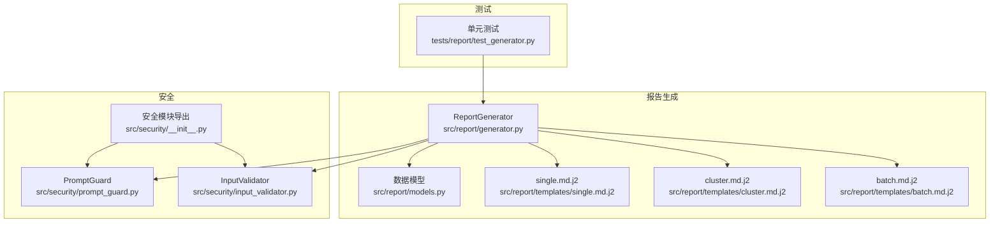
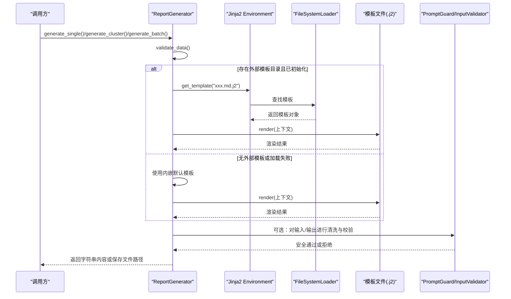
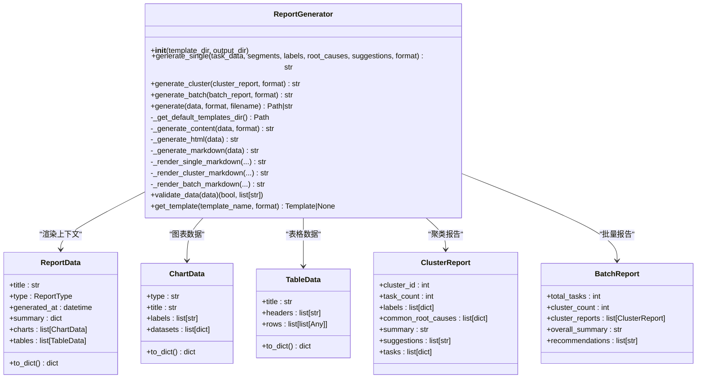
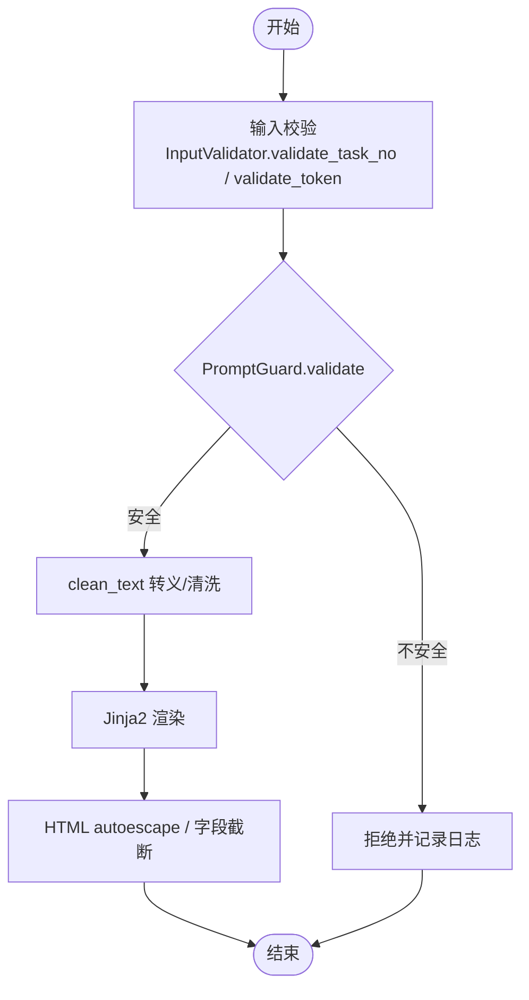
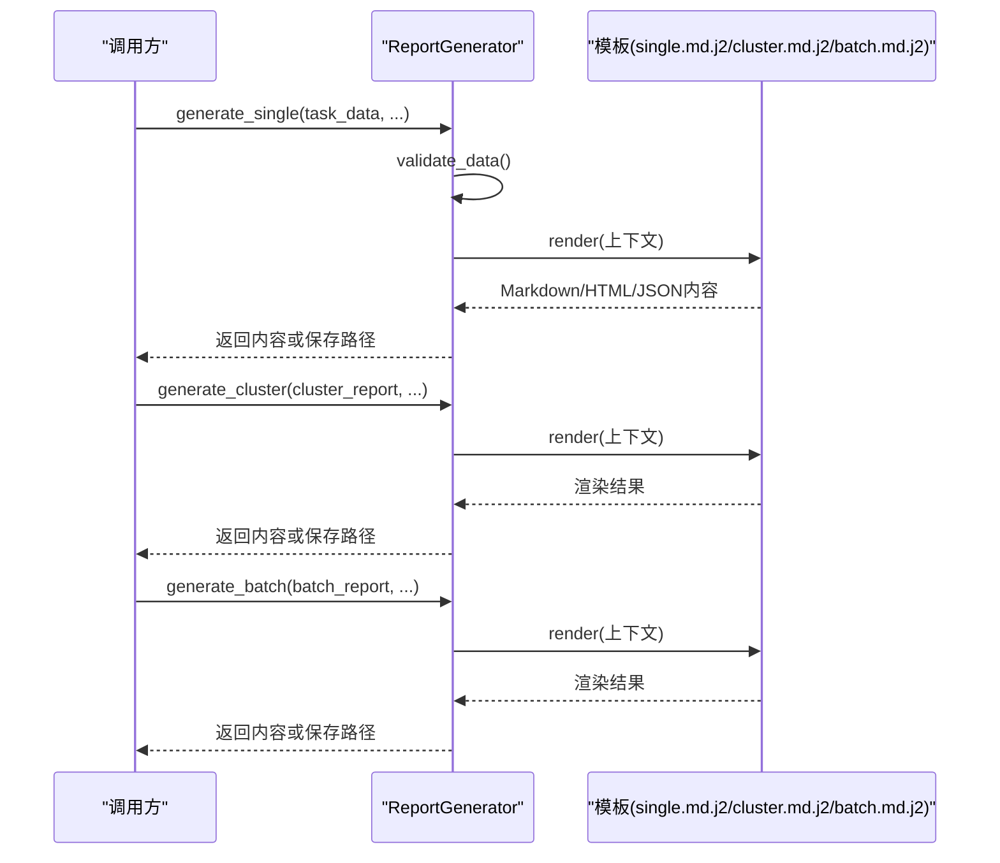
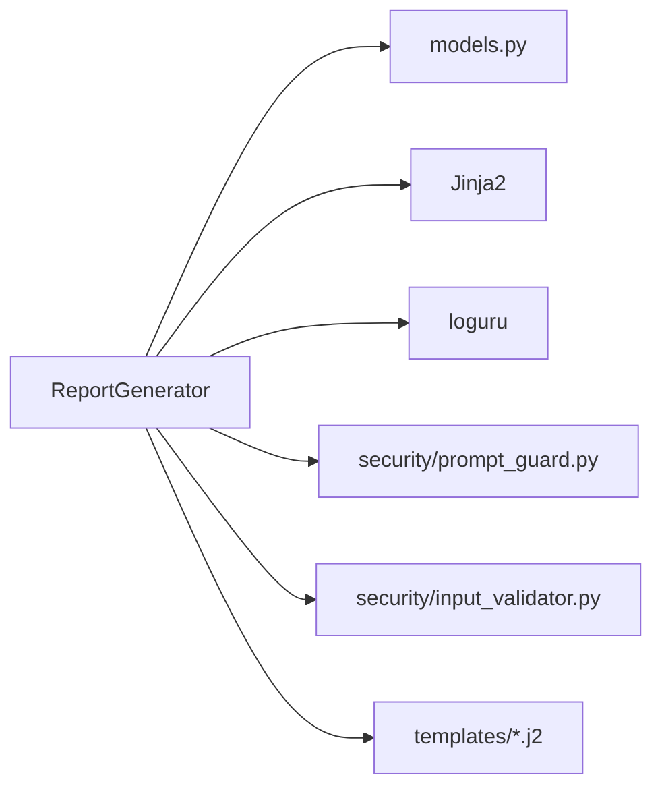

# Prompt模板管理系统

<cite>
**本文引用的文件列表**
- [src/report/generator.py](file://src/report/generator.py)
- [src/report/models.py](file://src/report/models.py)
- [src/report/templates/single.md.j2](file://src/report/templates/single.md.j2)
- [src/report/templates/cluster.md.j2](file://src/report/templates/cluster.md.j2)
- [src/report/templates/batch.md.j2](file://src/report/templates/batch.md.j2)
- [tests/report/test_generator.py](file://tests/report/test_generator.py)
- [src/security/prompt_guard.py](file://src/security/prompt_guard.py)
- [src/security/input_validator.py](file://src/security/input_validator.py)
- [src/security/__init__.py](file://src/security/__init__.py)
</cite>

## 目录
1. [简介](#简介)
2. [项目结构](#项目结构)
3. [核心组件](#核心组件)
4. [架构总览](#架构总览)
5. [详细组件分析](#详细组件分析)
6. [依赖关系分析](#依赖关系分析)
7. [性能与可扩展性](#性能与可扩展性)
8. [故障排查指南](#故障排查指南)
9. [结论](#结论)
10. [附录：开发规范与最佳实践](#附录开发规范与最佳实践)

## 简介
本技术文档围绕“Prompt模板管理系统”展开，聚焦于报告生成中的模板引擎设计、动态参数替换与上下文管理、模板版本控制策略、模板验证与测试框架、安全过滤机制（输入清洗、输出过滤、敏感信息保护），以及模板开发与调试指南。系统基于Jinja2实现模板渲染，提供Markdown、HTML、JSON等格式输出，并内置默认模板与可插拔的外部模板目录，支持在自定义模板失败时回退到内嵌默认模板，确保稳定性与向后兼容。

## 项目结构
与模板相关的代码主要位于report模块及其templates子目录，同时安全能力由security模块提供，测试用例集中在tests/report下。

图表来源
- [src/report/generator.py:222-424](file://src/report/generator.py#L222-L424)
- [src/report/models.py:1-52](file://src/report/models.py#L1-L52)
- [src/report/templates/single.md.j2:1-58](file://src/report/templates/single.md.j2#L1-L58)
- [src/report/templates/cluster.md.j2:1-36](file://src/report/templates/cluster.md.j2#L1-L36)
- [src/report/templates/batch.md.j2:1-31](file://src/report/templates/batch.md.j2#L1-L31)
- [src/security/prompt_guard.py:42-197](file://src/security/prompt_guard.py#L42-L197)
- [src/security/input_validator.py:1-74](file://src/security/input_validator.py#L1-L74)
- [src/security/__init__.py:1-26](file://src/security/__init__.py#L1-L26)
- [tests/report/test_generator.py:1-272](file://tests/report/test_generator.py#L1-L272)

章节来源
- [src/report/generator.py:222-424](file://src/report/generator.py#L222-L424)
- [src/report/models.py:1-52](file://src/report/models.py#L1-L52)
- [src/report/templates/single.md.j2:1-58](file://src/report/templates/single.md.j2#L1-L58)
- [src/report/templates/cluster.md.j2:1-36](file://src/report/templates/cluster.md.j2#L1-L36)
- [src/report/templates/batch.md.j2:1-31](file://src/report/templates/batch.md.j2#L1-L31)
- [src/security/prompt_guard.py:42-197](file://src/security/prompt_guard.py#L42-L197)
- [src/security/input_validator.py:1-74](file://src/security/input_validator.py#L1-L74)
- [src/security/__init__.py:1-26](file://src/security/__init__.py#L1-L26)
- [tests/report/test_generator.py:1-272](file://tests/report/test_generator.py#L1-L272)

## 核心组件
- ReportGenerator：负责模板加载、上下文构建、渲染与输出；支持外部模板目录与内嵌默认模板的自动回退；提供单任务、聚类、批量报告生成接口。
- 模板文件：single.md.j2、cluster.md.j2、batch.md.j2，分别对应单任务、聚类、批量报告的Markdown模板。
- 数据模型：ReportData、ChartData、TableData、ClusterReport、BatchReport等，用于结构化报告数据。
- 安全组件：PromptGuard与InputValidator，提供注入检测、文本清洗、长度限制与基础输入校验。
- 测试套件：针对ReportGenerator的数据校验、多格式输出、模板获取与异常路径进行覆盖。

章节来源
- [src/report/generator.py:222-424](file://src/report/generator.py#L222-L424)
- [src/report/models.py:1-52](file://src/report/models.py#L1-L52)
- [src/security/prompt_guard.py:42-197](file://src/security/prompt_guard.py#L42-L197)
- [src/security/input_validator.py:1-74](file://src/security/input_validator.py#L1-L74)
- [tests/report/test_generator.py:1-272](file://tests/report/test_generator.py#L1-L272)

## 架构总览
下图展示了从调用方到模板渲染与输出的关键流程，包括Jinja2环境初始化、模板选择与渲染、错误回退与安全过滤点。

图表来源
- [src/report/generator.py:222-424](file://src/report/generator.py#L222-L424)
- [src/report/generator.py:250-394](file://src/report/generator.py#L250-L394)
- [src/report/generator.py:707-716](file://src/report/generator.py#L707-L716)
- [src/security/prompt_guard.py:100-141](file://src/security/prompt_guard.py#L100-L141)
- [src/security/input_validator.py:11-45](file://src/security/input_validator.py#L11-L45)

## 详细组件分析

### 模板引擎设计与上下文管理
- Jinja2集成：当提供template_dir且目录存在时，初始化Environment并使用FileSystemLoader加载外部模板；否则回退至内嵌默认模板。
- 模板选择：根据报告类型选择single.md.j2、cluster.md.j2、batch.md.j2；若外部模板不存在或渲染异常，记录警告并回退到默认模板。
- 上下文构造：为每个模板方法准备对应的上下文字典，如task_id、title、summary、segments、labels、root_causes、suggestions、metadata等；对于通用ReportData，提供to_dict统一序列化。
- 输出格式：支持MARKDOWN、HTML、JSON、PDF（当前以HTML包装）。

图表来源
- [src/report/generator.py:222-424](file://src/report/generator.py#L222-L424)
- [src/report/generator.py:32-89](file://src/report/generator.py#L32-L89)
- [src/report/models.py:1-52](file://src/report/models.py#L1-L52)

章节来源
- [src/report/generator.py:222-424](file://src/report/generator.py#L222-L424)
- [src/report/generator.py:32-89](file://src/report/generator.py#L32-L89)
- [src/report/models.py:1-52](file://src/report/models.py#L1-L52)

### 模板版本控制与兼容性策略
- 默认模板与外部模板并存：当外部模板缺失或渲染异常时，自动回退到内嵌默认模板，保证向后兼容与可用性。
- 命名约定：模板文件采用“名称.扩展名.j2”，例如single.md.j2、cluster.md.j2、batch.md.j2，便于按场景区分。
- 迁移建议：
  - 新增字段：在模板中增加条件分支，避免破坏旧上下文；对外部模板升级需保持对旧上下文的兼容读取。
  - 废弃字段：保留兼容读取逻辑，逐步清理；在日志中记录弃用提示。
  - 回滚支持：将旧版模板保留在版本库中，必要时切换回旧模板路径或恢复内嵌默认模板。
- 验证与回归：通过单元测试覆盖关键渲染路径，确保新模板不破坏既有输出结构。

章节来源
- [src/report/generator.py:250-394](file://src/report/generator.py#L250-L394)
- [src/report/generator.py:707-716](file://src/report/generator.py#L707-L716)
- [src/report/templates/single.md.j2:1-58](file://src/report/templates/single.md.j2#L1-L58)
- [src/report/templates/cluster.md.j2:1-36](file://src/report/templates/cluster.md.j2#L1-L36)
- [src/report/templates/batch.md.j2:1-31](file://src/report/templates/batch.md.j2#L1-L31)

### 模板验证与测试框架
- 数据校验：在生成前执行validate_data，检查必填字段与类型约束，非法数据直接抛出异常，避免无效渲染。
- 单元测试覆盖：
  - 枚举值正确性（ReportType、ReportFormat）
  - 数据结构创建与序列化（ChartData、TableData、ReportData）
  - 多格式输出（JSON、Markdown、HTML）
  - 模板获取与不存在时的行为
  - 无效数据的异常路径
- 建议补充：
  - 模板语法检查：在CI中加入Jinja2模板编译阶段检查，提前发现语法错误。
  - 语义断言：对关键输出片段进行断言，确保字段渲染符合预期。
  - 边界用例：空集合、超长文本、特殊字符、Unicode等。

章节来源
- [src/report/generator.py:718-737](file://src/report/generator.py#L718-L737)
- [tests/report/test_generator.py:1-272](file://tests/report/test_generator.py#L1-L272)

### 安全过滤机制
- 输入清洗与注入防护：
  - PromptGuard提供注入模式检测（如XML标签、开发者模式等）、长度限制、文本清洗（转义危险字符）与整体guard函数。
  - InputValidator提供任务号与Token的基础格式校验，防止非法输入进入下游。
- 输出过滤：
  - 在HTML模板中使用autoescape，减少XSS风险。
  - 对可能包含用户可控内容的字段进行转义或截断处理。
- 敏感信息保护：
  - 在上下文构造阶段避免注入敏感字段；如需展示，应进行脱敏处理。
  - 结合PromptGuard.validate与clean_text，在渲染前对输入进行二次净化。

图表来源
- [src/security/prompt_guard.py:100-141](file://src/security/prompt_guard.py#L100-L141)
- [src/security/input_validator.py:11-45](file://src/security/input_validator.py#L11-L45)
- [src/report/generator.py:238-241](file://src/report/generator.py#L238-L241)

章节来源
- [src/security/prompt_guard.py:42-197](file://src/security/prompt_guard.py#L42-L197)
- [src/security/input_validator.py:1-74](file://src/security/input_validator.py#L1-L74)
- [src/security/__init__.py:1-26](file://src/security/__init__.py#L1-L26)
- [src/report/generator.py:238-241](file://src/report/generator.py#L238-L241)

### 模板开发指南
- 命名规范：
  - 模板文件遵循“场景.语言.j2”命名，如single.md.j2、cluster.md.j2、batch.md.j2。
  - 变量命名使用小写下划线，避免与Jinja2关键字冲突。
- 注释标准：
  - 在模板顶部添加简要说明与所需上下文字段清单。
  - 对复杂逻辑块添加行内注释，解释业务含义与数据来源。
- 调试技巧：
  - 启用Jinja2的调试模式（开发环境）以便快速定位渲染错误。
  - 在ReportGenerator中记录模板加载失败的警告，辅助定位外部模板问题。
  - 使用最小化上下文进行单步渲染测试，逐步扩大上下文范围。
- 最佳实践：
  - 优先使用条件分支与过滤器，增强容错性与可读性。
  - 对长文本进行截断，避免输出过大影响性能与可读性。
  - 对HTML输出开启autoescape，防止XSS。

章节来源
- [src/report/generator.py:238-241](file://src/report/generator.py#L238-L241)
- [src/report/generator.py:707-716](file://src/report/generator.py#L707-L716)
- [src/report/templates/single.md.j2:1-58](file://src/report/templates/single.md.j2#L1-L58)
- [src/report/templates/cluster.md.j2:1-36](file://src/report/templates/cluster.md.j2#L1-L36)
- [src/report/templates/batch.md.j2:1-31](file://src/report/templates/batch.md.j2#L1-L31)

### 实际使用示例与调用序列
- 生成单任务报告：
  - 调用generate_single，传入任务数据与可选的segments、labels、root_causes、suggestions；指定format为MARKDOWN或HTML/JSON/PDF。
  - 若配置了外部模板目录，优先加载single.md.j2；否则使用内嵌默认模板。
- 生成聚类报告：
  - 调用generate_cluster，传入ClusterReport对象；同样支持外部模板与回退。
- 生成批量报告：
  - 调用generate_batch，传入BatchReport对象；支持外部模板与回退。

图表来源
- [src/report/generator.py:250-394](file://src/report/generator.py#L250-L394)
- [src/report/templates/single.md.j2:1-58](file://src/report/templates/single.md.j2#L1-L58)
- [src/report/templates/cluster.md.j2:1-36](file://src/report/templates/cluster.md.j2#L1-L36)
- [src/report/templates/batch.md.j2:1-31](file://src/report/templates/batch.md.j2#L1-L31)

章节来源
- [src/report/generator.py:250-394](file://src/report/generator.py#L250-L394)

## 依赖关系分析
- 内部依赖：
  - ReportGenerator依赖models中的数据类，用于构建渲染上下文。
  - 模板文件作为静态资源被Jinja2加载。
  - 安全模块在渲染前后提供输入校验与输出过滤。
- 外部依赖：
  - Jinja2用于模板解析与渲染。
  - loguru用于日志记录。
- 潜在耦合点：
  - 模板与上下文字段强耦合，变更模板时需同步更新上下文构造逻辑。
  - 安全策略与模板渲染顺序需明确，避免绕过过滤。

图表来源
- [src/report/generator.py:222-424](file://src/report/generator.py#L222-L424)
- [src/report/models.py:1-52](file://src/report/models.py#L1-L52)
- [src/security/prompt_guard.py:42-197](file://src/security/prompt_guard.py#L42-L197)
- [src/security/input_validator.py:1-74](file://src/security/input_validator.py#L1-L74)

章节来源
- [src/report/generator.py:222-424](file://src/report/generator.py#L222-L424)
- [src/report/models.py:1-52](file://src/report/models.py#L1-L52)
- [src/security/prompt_guard.py:42-197](file://src/security/prompt_guard.py#L42-L197)
- [src/security/input_validator.py:1-74](file://src/security/input_validator.py#L1-L74)

## 性能与可扩展性
- 模板加载缓存：Jinja2的Environment会缓存已加载模板，提升重复渲染性能。
- 外部模板目录：按需加载，避免不必要的I/O开销；建议在部署时预置常用模板。
- 渲染优化：
  - 对大列表进行分页或截断显示。
  - 使用合适的过滤器减少计算量。
- 可扩展性：
  - 新增报告类型时，定义新的模板与渲染方法，保持接口一致性。
  - 引入插件式模板管理器，支持多版本模板并行与灰度发布。

[本节为通用指导，无需具体文件引用]

## 故障排查指南
- 模板未找到或渲染失败：
  - 检查外部模板目录是否存在且路径正确。
  - 查看日志中的警告信息，确认是否回退到默认模板。
- 输出为空或乱码：
  - 检查上下文字段是否完整，尤其是必需字段。
  - 确认编码设置（UTF-8）与autoescape配置。
- 安全拦截：
  - 使用PromptGuard.validate检测输入是否触发注入规则。
  - 调整max_length或清洗策略，避免误杀正常内容。
- 单元测试失败：
  - 核对断言内容与期望输出一致。
  - 检查Mock返回值与实际渲染逻辑是否匹配。

章节来源
- [src/report/generator.py:250-394](file://src/report/generator.py#L250-L394)
- [src/report/generator.py:707-716](file://src/report/generator.py#L707-L716)
- [src/security/prompt_guard.py:100-141](file://src/security/prompt_guard.py#L100-L141)
- [tests/report/test_generator.py:1-272](file://tests/report/test_generator.py#L1-L272)

## 结论
本模板管理系统以Jinja2为核心，结合外部模板与内嵌默认模板的回退机制，提供了稳定、可维护的报告生成能力。通过严格的数据校验与安全过滤，系统在易用性与安全性之间取得平衡。配合完善的单元测试与清晰的开发规范，可有效支撑后续的功能扩展与版本演进。

[本节为总结性内容，无需具体文件引用]

## 附录：开发规范与最佳实践
- 模板命名与组织：
  - 按场景划分模板文件，保持单一职责。
  - 在模板头部添加字段清单与使用说明。
- 上下文管理：
  - 使用统一的to_dict方法序列化复杂对象，降低模板复杂度。
  - 对可选字段提供默认值或条件分支。
- 安全策略：
  - 所有用户可控输入必须经过PromptGuard与InputValidator校验。
  - HTML输出务必启用autoescape，并对敏感信息进行脱敏。
- 测试与回归：
  - 为每个模板编写最小化测试用例，覆盖正常与异常路径。
  - 在CI中加入模板编译检查与关键输出断言。

[本节为通用指导，无需具体文件引用]