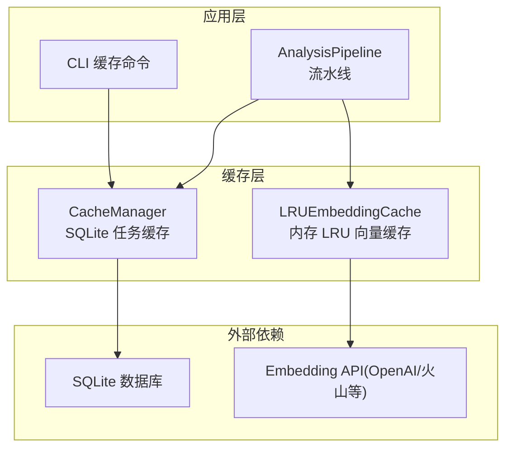
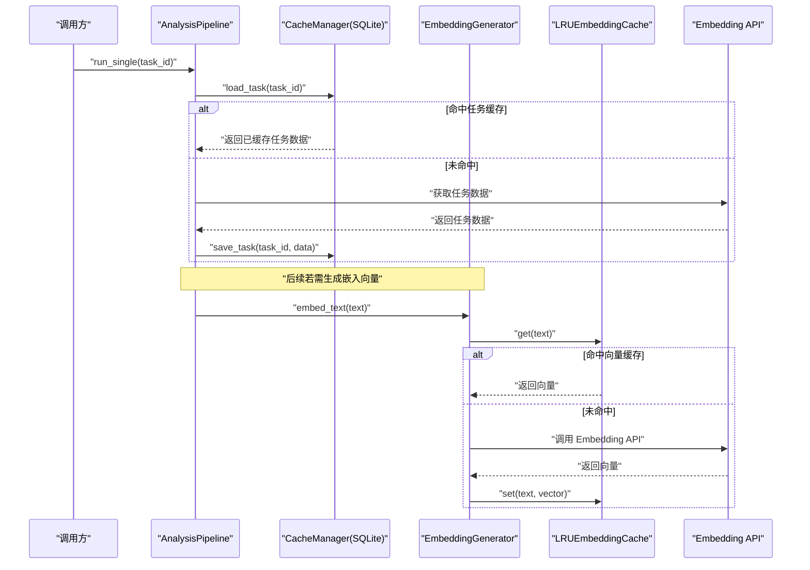
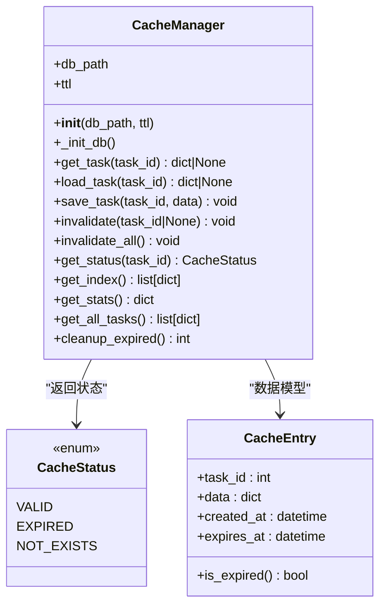
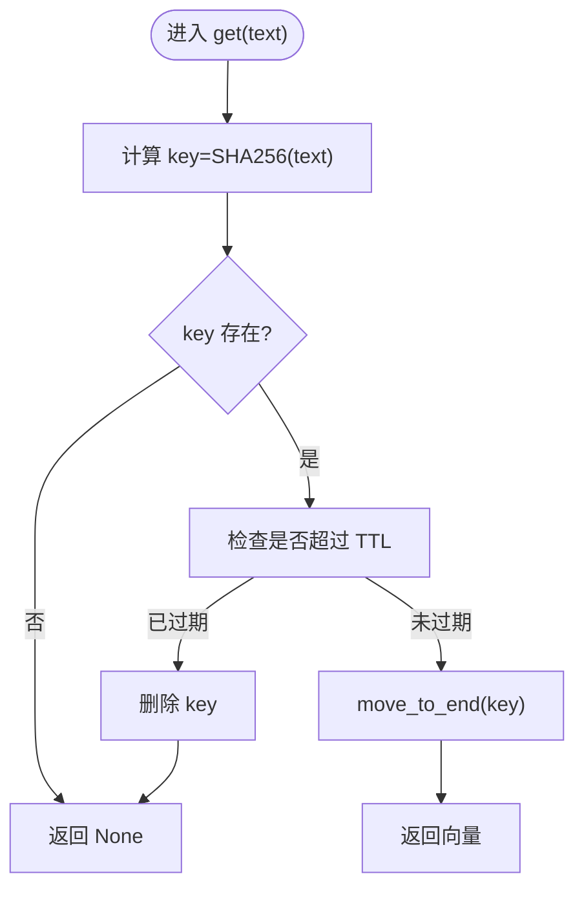
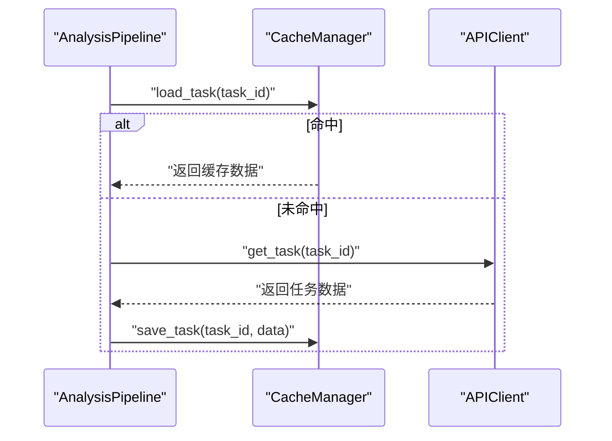
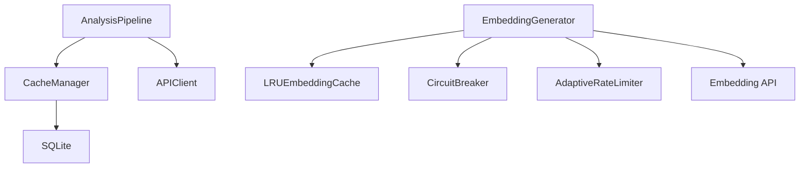

# 响应缓存策略

<cite>
**本文引用的文件**   
- [src/cache/manager.py](file://src/cache/manager.py)
- [src/cache/models.py](file://src/cache/models.py)
- [src/cache/__init__.py](file://src/cache/__init__.py)
- [src/embedding/generator.py](file://src/embedding/generator.py)
- [src/analyzer/pipeline.py](file://src/analyzer/pipeline.py)
- [src/config/models.py](file://src/config/models.py)
- [src/cli/commands/cache.py](file://src/cli/commands/cache.py)
- [tests/test_cache.py](file://tests/test_cache.py)
- [tests/cache/test_manager_task22.py](file://tests/cache/test_manager_task22.py)
- [tests/embedding/test_generator_task24.py](file://tests/embedding/test_generator_task24.py)
</cite>

## 目录
1. [简介](#简介)
2. [项目结构](#项目结构)
3. [核心组件](#核心组件)
4. [架构总览](#架构总览)
5. [详细组件分析](#详细组件分析)
6. [依赖关系分析](#依赖关系分析)
7. [性能考量](#性能考量)
8. [故障排除指南](#故障排除指南)
9. [结论](#结论)
10. [附录](#附录)

## 简介
本技术文档围绕 LLM 响应缓存策略，系统梳理当前仓库中的两级缓存实现：任务级持久化缓存（SQLite）与嵌入向量级内存 LRU 缓存。文档重点覆盖：
- 缓存键生成算法：输入参数哈希、版本控制与去重策略
- 过期策略：时间过期（TTL）、容量限制与 LRU 淘汰
- 一致性保证：分布式锁、版本号控制与冲突解决（现状评估与扩展建议）
- 多级缓存架构：内存缓存、磁盘缓存与分布式缓存的协同工作（现状与演进路线）
- 接口与示例：预热、批量操作与监控统计
- 性能优化技巧与故障排除

## 项目结构
与缓存相关的代码主要分布在以下模块：
- src/cache：任务级持久化缓存（SQLite），提供 TTL、索引、清理与统计能力
- src/embedding：嵌入向量生成器，内置内存 LRU 缓存与自适应限流、熔断
- src/analyzer/pipeline：分析流水线，集成任务缓存读写
- src/config/models：配置模型，包含 CacheConfig 等
- src/cli/commands/cache：CLI 工具，用于查看、清空、统计与清理缓存
- tests：覆盖缓存行为、TTL、LRU 淘汰与性能的测试用例

图表来源
- [src/analyzer/pipeline.py:228-243](file://src/analyzer/pipeline.py#L228-L243)
- [src/cache/manager.py:10-164](file://src/cache/manager.py#L10-L164)
- [src/embedding/generator.py:13-52](file://src/embedding/generator.py#L13-L52)
- [src/cli/commands/cache.py:15-87](file://src/cli/commands/cache.py#L15-L87)

章节来源
- [src/analyzer/pipeline.py:228-243](file://src/analyzer/pipeline.py#L228-L243)
- [src/cache/manager.py:10-164](file://src/cache/manager.py#L10-L164)
- [src/embedding/generator.py:13-52](file://src/embedding/generator.py#L13-L52)
- [src/cli/commands/cache.py:15-87](file://src/cli/commands/cache.py#L15-L87)

## 核心组件
- 任务级持久化缓存（SQLite）
  - 职责：以 task_id 为键存储结构化结果，支持 TTL、状态查询、索引、清理与统计
  - 关键能力：按过期时间过滤、全量遍历过滤、删除过期项、统计有效/过期条目数
- 嵌入向量级内存缓存（LRU）
  - 职责：对文本到向量的映射进行内存缓存，支持最大容量与 TTL，LRU 淘汰
  - 关键能力：基于文本 SHA-256 的键生成、访问更新顺序、容量满时淘汰最久未使用项
- 分析流水线集成
  - 职责：在拉取任务数据前后，按需读取/写入任务缓存；可配置开关
- CLI 管理工具
  - 职责：列出、清空、统计、清理过期缓存

章节来源
- [src/cache/manager.py:10-164](file://src/cache/manager.py#L10-L164)
- [src/embedding/generator.py:13-52](file://src/embedding/generator.py#L13-L52)
- [src/analyzer/pipeline.py:228-243](file://src/analyzer/pipeline.py#L228-L243)
- [src/cli/commands/cache.py:15-87](file://src/cli/commands/cache.py#L15-L87)

## 架构总览
下图展示“任务级持久化缓存”和“嵌入向量级内存缓存”在系统中的位置与交互。

图表来源
- [src/analyzer/pipeline.py:228-243](file://src/analyzer/pipeline.py#L228-L243)
- [src/cache/manager.py:37-76](file://src/cache/manager.py#L37-L76)
- [src/embedding/generator.py:162-216](file://src/embedding/generator.py#L162-L216)
- [src/embedding/generator.py:245-310](file://src/embedding/generator.py#L245-L310)

## 详细组件分析

### 组件一：任务级持久化缓存（SQLite）
- 数据结构与表结构
  - 表名：cache
  - 字段：task_id（主键）、data（JSON 文本）、created_at、expires_at
  - 索引：idx_expires_at（加速过期判断与清理）
- 生命周期与过期
  - 写入时计算 expires_at = now + ttl
  - 读取时比较当前时间与 expires_at，过期则视为不存在
  - 提供 cleanup_expired 批量删除过期项
- 状态与统计
  - get_status：NOT_EXISTS / VALID / EXPIRED
  - get_stats：total_entries、valid_entries、expired_entries
- 管理与运维
  - invalidate/invalidate_all：按任务或全部失效
  - get_index/get_all_tasks：索引与全量遍历（仅返回未过期项）

图表来源
- [src/cache/manager.py:10-164](file://src/cache/manager.py#L10-L164)
- [src/cache/models.py:8-22](file://src/cache/models.py#L8-L22)

章节来源
- [src/cache/manager.py:16-35](file://src/cache/manager.py#L16-L35)
- [src/cache/manager.py:37-76](file://src/cache/manager.py#L37-L76)
- [src/cache/manager.py:89-138](file://src/cache/manager.py#L89-L138)
- [src/cache/manager.py:140-164](file://src/cache/manager.py#L140-L164)
- [src/cache/models.py:8-22](file://src/cache/models.py#L8-L22)

### 组件二：嵌入向量级内存缓存（LRU）
- 键生成算法
  - 使用文本 UTF-8 编码后的 SHA-256 十六进制作为缓存键，具备强去重特性
- 容量与淘汰
  - 基于 OrderedDict 维护访问顺序，容量达到上限时淘汰最久未使用项（LRU）
- 过期策略
  - 每个键附带写入时间戳，读取时检查是否超过 TTL，过期即删除并返回空
- 并发与限流
  - 通过信号量控制并发度，结合自适应速率限制器与熔断器保护下游服务

图表来源
- [src/embedding/generator.py:21-35](file://src/embedding/generator.py#L21-L35)

章节来源
- [src/embedding/generator.py:13-52](file://src/embedding/generator.py#L13-L52)
- [src/embedding/generator.py:162-216](file://src/embedding/generator.py#L162-L216)
- [src/embedding/generator.py:245-310](file://src/embedding/generator.py#L245-L310)

### 组件三：分析流水线中的缓存集成
- 任务缓存读写
  - 启用 use_cache 时，先尝试从 SQLite 缓存加载任务数据；未命中则从 API 拉取并回写缓存
- 配置驱动
  - 通过 ConfigManager 的 cache 配置项注入 db_path 与 ttl

图表来源
- [src/analyzer/pipeline.py:228-243](file://src/analyzer/pipeline.py#L228-L243)
- [src/analyzer/pipeline.py:258-266](file://src/analyzer/pipeline.py#L258-L266)

章节来源
- [src/analyzer/pipeline.py:228-243](file://src/analyzer/pipeline.py#L228-L243)
- [src/analyzer/pipeline.py:258-266](file://src/analyzer/pipeline.py#L258-L266)

### 组件四：CLI 缓存管理
- 功能
  - list：列出缓存条目（前 N 条）
  - clear：清空指定任务或全部缓存
  - stats：显示总条目、有效条目、过期条目
  - cleanup：清理过期缓存并返回清理数量

章节来源
- [src/cli/commands/cache.py:15-87](file://src/cli/commands/cache.py#L15-L87)

## 依赖关系分析
- 组件耦合
  - AnalysisPipeline 依赖 CacheManager 与 APIClient
  - EmbeddingGenerator 依赖 LRUEmbeddingCache、CircuitBreaker、AdaptiveRateLimiter
  - CLI 直接依赖 CacheManager
- 外部依赖
  - SQLite 作为任务缓存后端
  - Embedding API（OpenAI/火山等）作为向量生成源

图表来源
- [src/analyzer/pipeline.py:228-243](file://src/analyzer/pipeline.py#L228-L243)
- [src/embedding/generator.py:13-52](file://src/embedding/generator.py#L13-L52)
- [src/embedding/generator.py:91-135](file://src/embedding/generator.py#L91-L135)

章节来源
- [src/analyzer/pipeline.py:228-243](file://src/analyzer/pipeline.py#L228-L243)
- [src/embedding/generator.py:91-135](file://src/embedding/generator.py#L91-L135)

## 性能考量
- 任务级缓存（SQLite）
  - 读路径：单行查询 + JSON 反序列化，适合低延迟热数据
  - 写路径：INSERT OR REPLACE，原子性良好
  - 过期清理：基于 expires_at 索引的 DELETE，批量清理高效
  - 统计：COUNT 聚合，注意大表下 valid/expired 计数可能带来额外 IO
- 嵌入向量缓存（LRU）
  - 键生成：SHA-256 开销稳定，避免重复计算
  - 淘汰：OrderedDict.move_to_end 与 popitem(last=False) 均为 O(1)
  - 并发：信号量限制并发度，配合自适应限流降低下游压力
- 端到端
  - 流水线优先命中任务缓存，减少网络请求
  - 向量缓存显著降低重复文本的 embedding 成本

章节来源
- [src/cache/manager.py:122-138](file://src/cache/manager.py#L122-L138)
- [src/cache/manager.py:156-164](file://src/cache/manager.py#L156-L164)
- [src/embedding/generator.py:162-216](file://src/embedding/generator.py#L162-L216)
- [src/embedding/generator.py:245-310](file://src/embedding/generator.py#L245-L310)

## 故障排除指南
- 常见现象与定位
  - 任务缓存未命中：确认 use_cache 是否开启、db_path 是否正确、TTL 是否过短
  - 向量缓存未命中：确认文本是否一致（空格/换行差异会影响 SHA-256 键）、TTL 是否过期
  - 清理无效：确认 cleanup_expired 执行时机与 TTL 设置
- 验证步骤
  - 使用 CLI 的 list/stats/cleanup 观察缓存状态
  - 运行单元测试验证 TTL 与 LRU 行为
- 参考测试
  - 任务缓存 TTL、状态转换、清理与统计
  - 嵌入向量缓存基本操作、LRU 淘汰、TTL 与清空

章节来源
- [src/cli/commands/cache.py:15-87](file://src/cli/commands/cache.py#L15-L87)
- [tests/test_cache.py:16-154](file://tests/test_cache.py#L16-L154)
- [tests/cache/test_manager_task22.py:28-166](file://tests/cache/test_manager_task22.py#L28-L166)
- [tests/embedding/test_generator_task24.py:13-78](file://tests/embedding/test_generator_task24.py#L13-L78)

## 结论
当前仓库实现了两级缓存：
- 任务级持久化缓存（SQLite）：提供 TTL、状态、统计与清理能力，适合跨进程/重启共享的任务结果缓存
- 嵌入向量级内存缓存（LRU）：针对高频重复文本的向量结果进行快速命中，显著降低外部 API 调用成本

在一致性方面，当前实现未引入分布式锁或版本号机制；在多实例部署场景下，建议引入分布式锁与版本号控制，并结合 Redis 等分布式缓存构建多级缓存体系，以提升一致性与可扩展性。

## 附录

### 缓存键生成算法说明
- 任务级缓存
  - 键：task_id（整数主键）
  - 去重：同一 task_id 的写入会覆盖旧值（INSERT OR REPLACE）
- 嵌入向量缓存
  - 键：text 的 SHA-256 十六进制字符串
  - 去重：相同文本产生相同键，天然去重
  - 版本控制：当前未显式携带版本字段；如需模型升级或文本规范化变更，建议在键中追加版本前缀或在上层做键命名约定

章节来源
- [src/cache/manager.py:16-35](file://src/cache/manager.py#L16-L35)
- [src/embedding/generator.py:21-24](file://src/embedding/generator.py#L21-L24)

### 过期策略与容量限制
- 任务级缓存
  - TTL：写入时计算 expires_at，读取时比较当前时间
  - 容量：无硬性容量限制，可通过定期 cleanup_expired 控制体积
- 嵌入向量缓存
  - TTL：每条记录带时间戳，读取时检查是否过期
  - 容量：max_size 限制，超出后触发 LRU 淘汰

章节来源
- [src/cache/manager.py:59-76](file://src/cache/manager.py#L59-L76)
- [src/cache/manager.py:156-164](file://src/cache/manager.py#L156-L164)
- [src/embedding/generator.py:16-44](file://src/embedding/generator.py#L16-L44)

### 一致性保证机制（现状与建议）
- 现状
  - 单进程内：SQLite 事务保证本地一致性
  - 多实例：未实现分布式锁或版本号控制，可能出现不一致
- 建议
  - 分布式锁：在写入/失效时使用分布式锁（如 Redis SETNX）
  - 版本号控制：在缓存键或元数据中引入版本号，冲突时采用乐观锁策略
  - 失效传播：当上游数据变更时，主动失效相关缓存键

章节来源
- [src/cache/manager.py:59-84](file://src/cache/manager.py#L59-L84)

### 多级缓存架构（现状与演进）
- 现状
  - 内存 LRU（嵌入向量）+ 磁盘 SQLite（任务）
- 演进建议
  - 增加分布式缓存层（如 Redis），将热点任务结果与向量结果上移
  - 设计多级失效策略：内存 -> 分布式 -> 磁盘，确保一致性

章节来源
- [src/embedding/generator.py:13-52](file://src/embedding/generator.py#L13-L52)
- [src/cache/manager.py:10-35](file://src/cache/manager.py#L10-L35)

### 实际接口与示例（路径引用）
- 缓存预热
  - 思路：启动阶段批量 load_task 或 embed_text，填充缓存
  - 参考路径：
    - [src/cache/manager.py:140-154](file://src/cache/manager.py#L140-L154)
    - [src/embedding/generator.py:245-310](file://src/embedding/generator.py#L245-L310)
- 批量操作
  - 思路：批量写入任务缓存、批量生成嵌入向量
  - 参考路径：
    - [src/cache/manager.py:59-76](file://src/cache/manager.py#L59-L76)
    - [src/embedding/generator.py:245-310](file://src/embedding/generator.py#L245-L310)
- 监控统计
  - 思路：使用 get_stats 输出 total/valid/expired
  - 参考路径：
    - [src/cache/manager.py:122-138](file://src/cache/manager.py#L122-L138)
    - [src/cli/commands/cache.py:64-78](file://src/cli/commands/cache.py#L64-L78)

章节来源
- [src/cache/manager.py:122-154](file://src/cache/manager.py#L122-L154)
- [src/embedding/generator.py:245-310](file://src/embedding/generator.py#L245-L310)
- [src/cli/commands/cache.py:64-78](file://src/cli/commands/cache.py#L64-L78)

### 配置项（CacheConfig）
- enabled：是否启用缓存
- ttl：缓存过期时间（秒）
- storage：存储类型（sqlite/file/memory）
- db_path：缓存数据库路径

章节来源
- [src/config/models.py:84-96](file://src/config/models.py#L84-L96)
