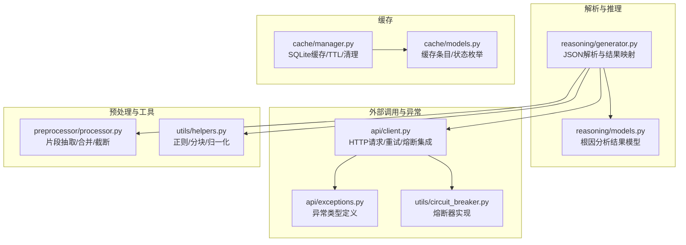
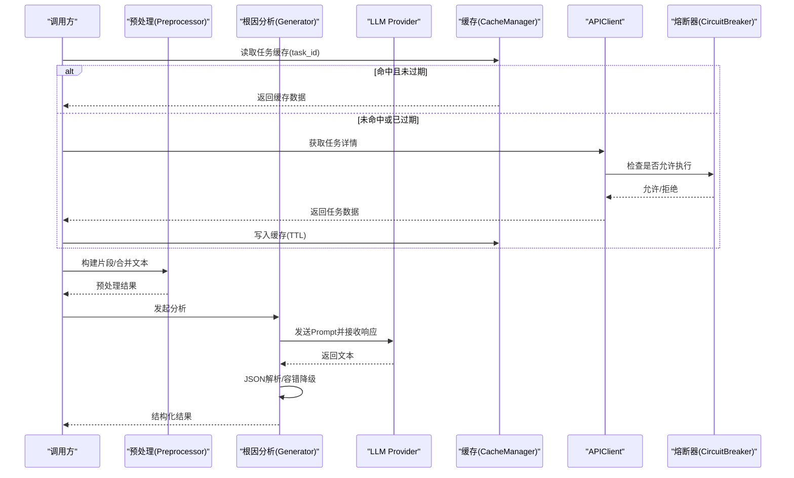
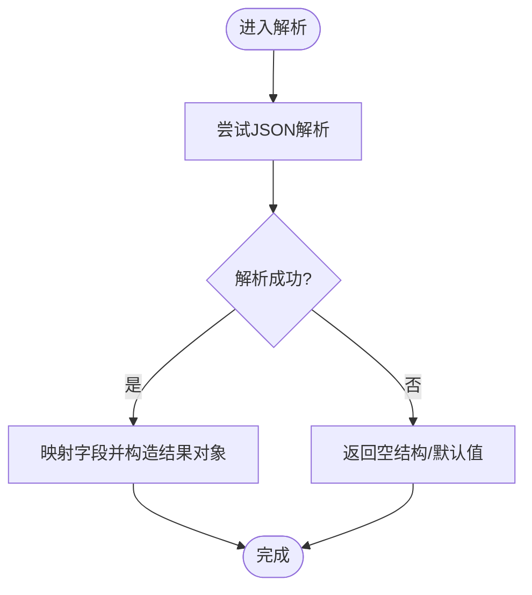
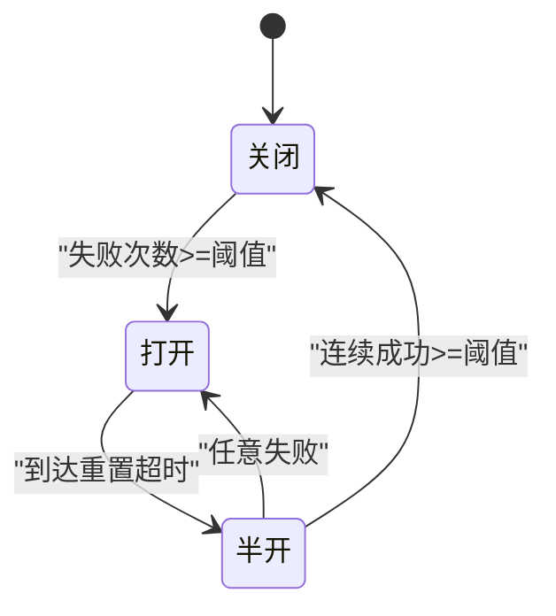
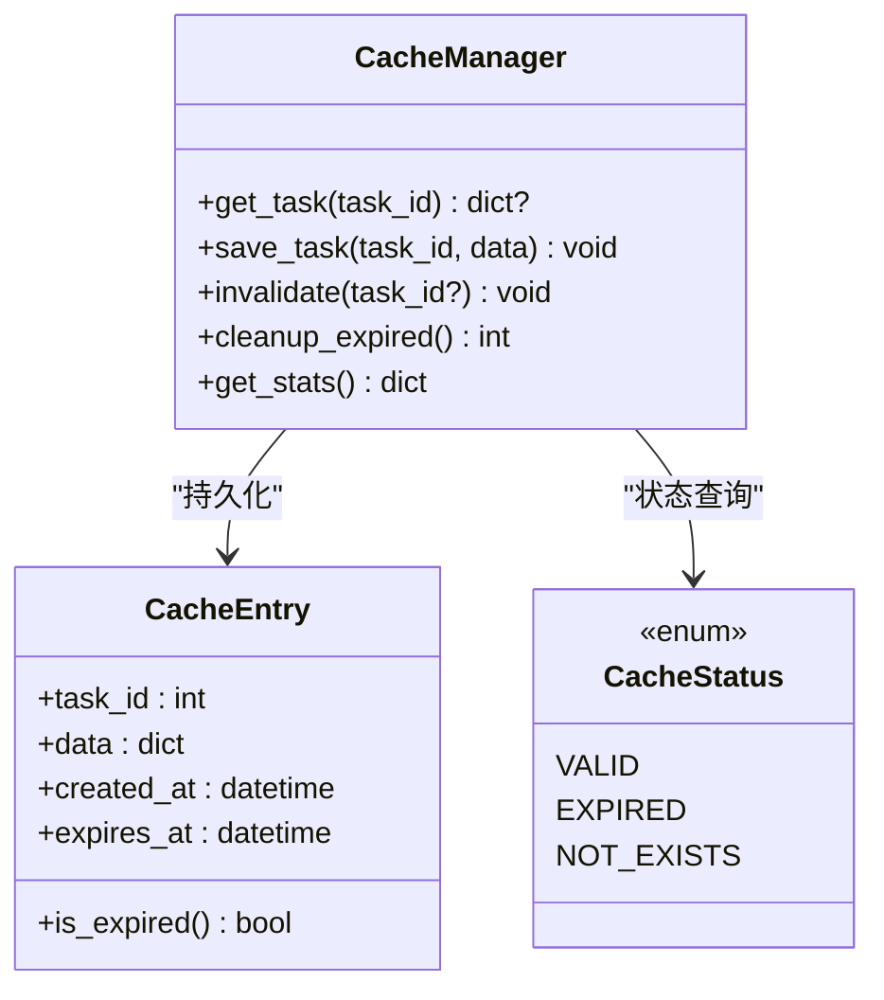
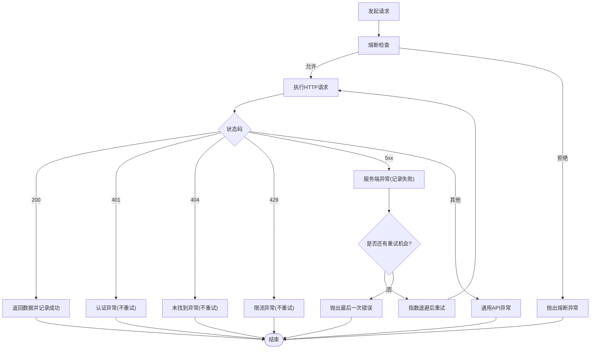
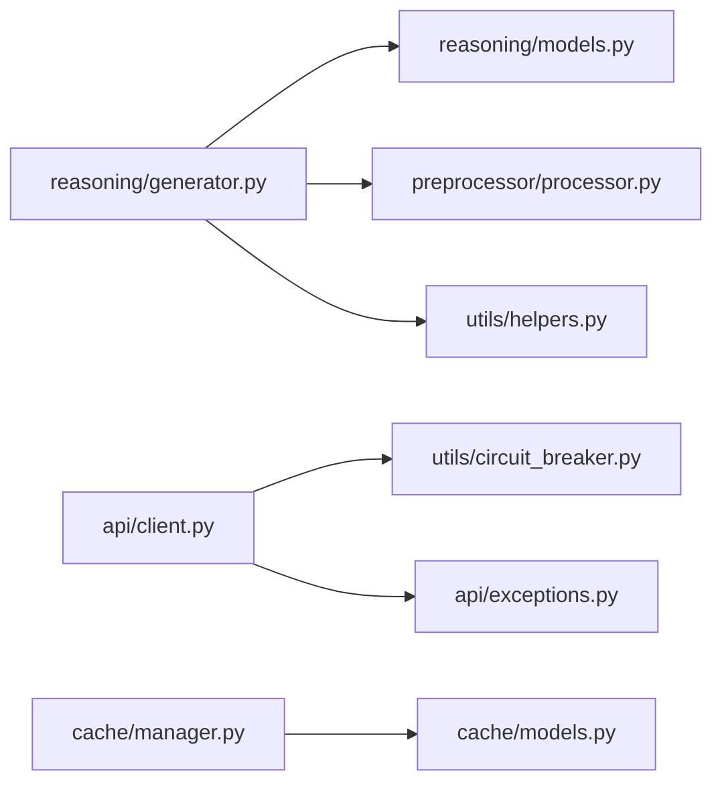

# 响应解析与处理

<cite>
**本文引用的文件**   
- [src/analyzer/reasoning/generator.py](file://src/analyzer/reasoning/generator.py)
- [src/analyzer/reasoning/models.py](file://src/analyzer/reasoning/models.py)
- [src/api/client.py](file://src/api/client.py)
- [src/api/exceptions.py](file://src/api/exceptions.py)
- [src/utils/circuit_breaker.py](file://src/utils/circuit_breaker.py)
- [src/cache/manager.py](file://src/cache/manager.py)
- [src/cache/models.py](file://src/cache/models.py)
- [src/preprocessor/processor.py](file://src/preprocessor/processor.py)
- [src/utils/helpers.py](file://src/utils/helpers.py)
- [tests/test_labeling_generator.py](file://tests/test_labeling_generator.py)
- [tests/cache/test_manager_task22.py](file://tests/cache/test_manager_task22.py)
- [tests/test_cache.py](file://tests/test_cache.py)
- [tests/utils/test_circuit_breaker.py](file://tests/utils/test_circuit_breaker.py)
- [docs/DEVELOPMENT.md](file://docs/DEVELOPMENT.md)
</cite>

## 目录
1. [引言](#引言)
2. [项目结构](#项目结构)
3. [核心组件](#核心组件)
4. [架构总览](#架构总览)
5. [详细组件分析](#详细组件分析)
6. [依赖关系分析](#依赖关系分析)
7. [性能考虑](#性能考虑)
8. [故障排查指南](#故障排查指南)
9. [结论](#结论)
10. [附录](#附录)

## 引言
本技术文档聚焦于“LLM响应解析与处理系统”，围绕结构化数据提取、错误恢复机制、缓存策略、性能优化与异常处理展开，结合仓库中实际实现进行系统化说明。目标读者包括工程师与产品/运维人员，力求在保持技术深度的同时提供可操作的实践建议。

## 项目结构
与“响应解析与处理”直接相关的模块主要分布在以下路径：
- 解析与推理：src/analyzer/reasoning（JSON解析、模型定义）
- 外部API客户端与异常：src/api（重试、熔断、异常分类）
- 熔断器模式：src/utils/circuit_breaker.py
- 缓存管理：src/cache（TTL、过期清理、统计）
- 预处理与文本分块：src/preprocessor、src/utils/helpers
- 测试用例：tests/*（覆盖解析容错、缓存TTL、熔断状态机）

图表来源
- [src/analyzer/reasoning/generator.py:1-176](file://src/analyzer/reasoning/generator.py#L1-L176)
- [src/analyzer/reasoning/models.py:1-24](file://src/analyzer/reasoning/models.py#L1-L24)
- [src/api/client.py:1-340](file://src/api/client.py#L1-L340)
- [src/api/exceptions.py:1-31](file://src/api/exceptions.py#L1-L31)
- [src/utils/circuit_breaker.py:1-306](file://src/utils/circuit_breaker.py#L1-L306)
- [src/cache/manager.py:1-165](file://src/cache/manager.py#L1-L165)
- [src/cache/models.py:1-21](file://src/cache/models.py#L1-L21)
- [src/preprocessor/processor.py:1-200](file://src/preprocessor/processor.py#L1-L200)
- [src/utils/helpers.py:53-85](file://src/utils/helpers.py#L53-L85)

章节来源
- [src/analyzer/reasoning/generator.py:1-176](file://src/analyzer/reasoning/generator.py#L1-L176)
- [src/analyzer/reasoning/models.py:1-24](file://src/analyzer/reasoning/models.py#L1-L24)
- [src/api/client.py:1-340](file://src/api/client.py#L1-L340)
- [src/api/exceptions.py:1-31](file://src/api/exceptions.py#L1-L31)
- [src/utils/circuit_breaker.py:1-306](file://src/utils/circuit_breaker.py#L1-L306)
- [src/cache/manager.py:1-165](file://src/cache/manager.py#L1-L165)
- [src/cache/models.py:1-21](file://src/cache/models.py#L1-L21)
- [src/preprocessor/processor.py:1-200](file://src/preprocessor/processor.py#L1-L200)
- [src/utils/helpers.py:53-85](file://src/utils/helpers.py#L53-L85)

## 核心组件
- LLM响应解析器：将LLM返回的文本按约定格式解析为结构化对象，具备对非JSON、缺失字段等弱输入的健壮性。
- API客户端：封装HTTP请求、重试退避、熔断保护与异常分类，屏蔽底层网络波动与限流。
- 熔断器：基于失败阈值、重置超时与半开探测的状态机，避免雪崩。
- 缓存管理器：基于SQLite的本地缓存，支持TTL、过期清理、索引与统计。
- 预处理与文本工具：将多源信息切分为片段并组合，提供正则匹配、空白归一化与文本分块能力。

章节来源
- [src/analyzer/reasoning/generator.py:142-176](file://src/analyzer/reasoning/generator.py#L142-L176)
- [src/api/client.py:99-161](file://src/api/client.py#L99-L161)
- [src/utils/circuit_breaker.py:36-198](file://src/utils/circuit_breaker.py#L36-L198)
- [src/cache/manager.py:37-164](file://src/cache/manager.py#L37-L164)
- [src/preprocessor/processor.py:5-24](file://src/preprocessor/processor.py#L5-L24)
- [src/utils/helpers.py:53-85](file://src/utils/helpers.py#L53-L85)

## 架构总览
下图展示了从任务数据到LLM解析结果的端到端流程，以及缓存、熔断与异常处理的参与点。

图表来源
- [src/cache/manager.py:37-76](file://src/cache/manager.py#L37-L76)
- [src/api/client.py:99-161](file://src/api/client.py#L99-L161)
- [src/utils/circuit_breaker.py:146-181](file://src/utils/circuit_breaker.py#L146-L181)
- [src/preprocessor/processor.py:9-24](file://src/preprocessor/processor.py#L9-L24)
- [src/analyzer/reasoning/generator.py:83-127](file://src/analyzer/reasoning/generator.py#L83-L127)
- [src/analyzer/reasoning/generator.py:142-176](file://src/analyzer/reasoning/generator.py#L142-L176)

## 详细组件分析

### 结构化数据提取算法（JSON解析、正则匹配、NLP辅助）
- JSON解析与容错
  - 采用标准JSON解析，捕获解析异常与键缺失时返回空结构的降级结果，保证下游稳定。
  - 关键字段使用默认值填充，确保模型字段完整性。
- 正则匹配与文本处理
  - 提供正则提取、空白归一化、词元估算与文本分块等工具，便于后续规则匹配与上下文裁剪。
- NLP辅助
  - 通过片段抽取与合并，将需求、设计、开发、测试、生产等多阶段信息组织为统一输入，提升LLM理解质量。

图表来源
- [src/analyzer/reasoning/generator.py:142-176](file://src/analyzer/reasoning/generator.py#L142-L176)
- [src/utils/helpers.py:53-85](file://src/utils/helpers.py#L53-L85)
- [src/preprocessor/processor.py:180-191](file://src/preprocessor/processor.py#L180-L191)

章节来源
- [src/analyzer/reasoning/generator.py:142-176](file://src/analyzer/reasoning/generator.py#L142-L176)
- [src/utils/helpers.py:53-85](file://src/utils/helpers.py#L53-L85)
- [src/preprocessor/processor.py:180-191](file://src/preprocessor/processor.py#L180-L191)

### 错误恢复机制（重试、降级、熔断器）
- 重试策略
  - 连接错误与超时触发指数退避重试；认证/未找到/限流类错误不重试直接抛出。
- 降级处理
  - 解析失败时返回空结构；当上游服务不可用时，可通过熔断快速失败，避免级联放大。
- 熔断器模式
  - 三态机：关闭→打开→半开→关闭；失败计数超过阈值即打开，等待重置超时后进入半开探测，连续成功达到阈值则关闭。

图表来源
- [src/utils/circuit_breaker.py:36-198](file://src/utils/circuit_breaker.py#L36-L198)
- [src/api/client.py:117-161](file://src/api/client.py#L117-L161)

章节来源
- [src/api/client.py:117-161](file://src/api/client.py#L117-L161)
- [src/utils/circuit_breaker.py:36-198](file://src/utils/circuit_breaker.py#L36-L198)
- [tests/utils/test_circuit_breaker.py:44-110](file://tests/utils/test_circuit_breaker.py#L44-L110)

### 响应缓存策略（键生成、过期、一致性）
- 缓存键
  - 以任务ID作为主键，天然唯一且易于定位。
- 过期策略
  - 写入时计算expires_at，读取时比较当前时间；提供独立过期清理接口。
- 一致性保证
  - 单进程内强一致；跨进程需配合外部存储或分布式锁；过期判定严格基于时间戳。

图表来源
- [src/cache/manager.py:10-164](file://src/cache/manager.py#L10-L164)
- [src/cache/models.py:1-21](file://src/cache/models.py#L1-L21)

章节来源
- [src/cache/manager.py:37-164](file://src/cache/manager.py#L37-L164)
- [src/cache/models.py:1-21](file://src/cache/models.py#L1-L21)
- [tests/cache/test_manager_task22.py:28-46](file://tests/cache/test_manager_task22.py#L28-L46)
- [tests/test_cache.py:34-44](file://tests/test_cache.py#L34-L44)

### 性能优化（流式处理、增量解析、内存管理）
- 流式处理
  - 文档FAQ建议采用流式处理以降低峰值内存占用。
- 增量解析
  - 预处理阶段按片段组装，避免一次性加载超大文本；解析层对缺失字段做默认值填充，减少二次处理。
- 内存管理
  - 文本截断、分块与空白归一化降低上下文长度；批量处理过滤空结果，减少无效开销。

章节来源
- [docs/DEVELOPMENT.md:637-648](file://docs/DEVELOPMENT.md#L637-L648)
- [src/preprocessor/processor.py:188-191](file://src/preprocessor/processor.py#L188-L191)
- [src/utils/helpers.py:65-85](file://src/utils/helpers.py#L65-L85)

### 异常处理指南（网络错误、API限制、业务异常）
- 网络错误
  - 连接错误与超时归类为连接异常，触发重试与熔断记录。
- API限制
  - 429限流错误不重试，直接抛出限流异常，由上层决定退避策略。
- 业务异常
  - 认证失败、资源不存在等明确语义的错误直接上抛，避免误判为服务故障。

图表来源
- [src/api/client.py:99-161](file://src/api/client.py#L99-L161)
- [src/api/exceptions.py:1-31](file://src/api/exceptions.py#L1-L31)
- [src/utils/circuit_breaker.py:146-181](file://src/utils/circuit_breaker.py#L146-L181)

章节来源
- [src/api/client.py:99-161](file://src/api/client.py#L99-L161)
- [src/api/exceptions.py:1-31](file://src/api/exceptions.py#L1-L31)
- [src/utils/circuit_breaker.py:146-181](file://src/utils/circuit_breaker.py#L146-L181)

## 依赖关系分析
- 解析器依赖：
  - 模型定义（根因分析结果）、LLM Provider（抽象接口）、预处理与工具函数。
- 客户端依赖：
  - 熔断器、自定义异常、HTTP客户端库。
- 缓存依赖：
  - SQLite、时间与时区处理、JSON序列化。

图表来源
- [src/analyzer/reasoning/generator.py:1-176](file://src/analyzer/reasoning/generator.py#L1-L176)
- [src/analyzer/reasoning/models.py:1-24](file://src/analyzer/reasoning/models.py#L1-L24)
- [src/preprocessor/processor.py:1-200](file://src/preprocessor/processor.py#L1-L200)
- [src/utils/helpers.py:53-85](file://src/utils/helpers.py#L53-L85)
- [src/api/client.py:1-340](file://src/api/client.py#L1-L340)
- [src/api/exceptions.py:1-31](file://src/api/exceptions.py#L1-L31)
- [src/cache/manager.py:1-165](file://src/cache/manager.py#L1-L165)
- [src/cache/models.py:1-21](file://src/cache/models.py#L1-L21)

章节来源
- [src/analyzer/reasoning/generator.py:1-176](file://src/analyzer/reasoning/generator.py#L1-L176)
- [src/analyzer/reasoning/models.py:1-24](file://src/analyzer/reasoning/models.py#L1-L24)
- [src/api/client.py:1-340](file://src/api/client.py#L1-L340)
- [src/cache/manager.py:1-165](file://src/cache/manager.py#L1-L165)

## 性能考虑
- 控制上下文大小
  - 预处理阶段对文本进行截断与分块，避免超出模型上下文窗口。
- 减少无效I/O
  - 缓存命中优先，过期清理定期执行，降低重复请求与磁盘压力。
- 并发与异步
  - 客户端与LLM调用均为异步，合理设置超时与重试，避免阻塞。
- 监控与指标
  - 利用熔断器统计与缓存统计，观察命中率、失败率与延迟分布。

[本节为通用指导，无需特定文件引用]

## 故障排查指南
- 解析失败
  - 现象：LLM返回非JSON或缺少关键字段。
  - 处理：解析器会返回空结构，建议在日志中记录原始响应以便诊断。
  - 参考：解析容错逻辑与测试用例。
- 缓存未命中/过期
  - 现象：频繁回源或读取不到数据。
  - 处理：检查TTL配置与过期清理任务；确认键空间是否正确。
- 熔断频繁打开
  - 现象：大量请求被快速拒绝。
  - 处理：检查上游健康度、限流策略与重试退避参数；必要时调整阈值与超时。
- 网络与限流
  - 现象：连接超时、429限流。
  - 处理：关注重试与退避策略，区分可重试与不可重试错误。

章节来源
- [src/analyzer/reasoning/generator.py:142-176](file://src/analyzer/reasoning/generator.py#L142-L176)
- [tests/test_labeling_generator.py:112-148](file://tests/test_labeling_generator.py#L112-L148)
- [tests/cache/test_manager_task22.py:28-46](file://tests/cache/test_manager_task22.py#L28-L46)
- [tests/utils/test_circuit_breaker.py:44-110](file://tests/utils/test_circuit_breaker.py#L44-L110)
- [src/api/client.py:117-161](file://src/api/client.py#L117-L161)

## 结论
本系统通过“预处理+LLM解析+缓存+熔断+异常分类”的组合，构建了高可用的响应解析与处理链路。JSON解析的容错、熔断器的快速失败、缓存的TTL与清理、以及文本分块与截断共同保障了系统的稳定性与性能。建议在生产环境持续观测关键指标，并根据业务特征调优阈值与超时参数。

[本节为总结性内容，无需特定文件引用]

## 附录
- 代码示例路径（不含具体代码内容）
  - JSON解析与容错：[src/analyzer/reasoning/generator.py:142-176](file://src/analyzer/reasoning/generator.py#L142-L176)
  - 重试与熔断集成：[src/api/client.py:99-161](file://src/api/client.py#L99-L161)
  - 熔断器状态机：[src/utils/circuit_breaker.py:36-198](file://src/utils/circuit_breaker.py#L36-L198)
  - 缓存TTL与清理：[src/cache/manager.py:37-164](file://src/cache/manager.py#L37-L164)
  - 文本分块与归一化：[src/utils/helpers.py:53-85](file://src/utils/helpers.py#L53-L85)
  - 解析容错测试：[tests/test_labeling_generator.py:112-148](file://tests/test_labeling_generator.py#L112-L148)
  - 缓存TTL测试：[tests/cache/test_manager_task22.py:28-46](file://tests/cache/test_manager_task22.py#L28-L46)
  - 熔断器行为测试：[tests/utils/test_circuit_breaker.py:44-110](file://tests/utils/test_circuit_breaker.py#L44-L110)
