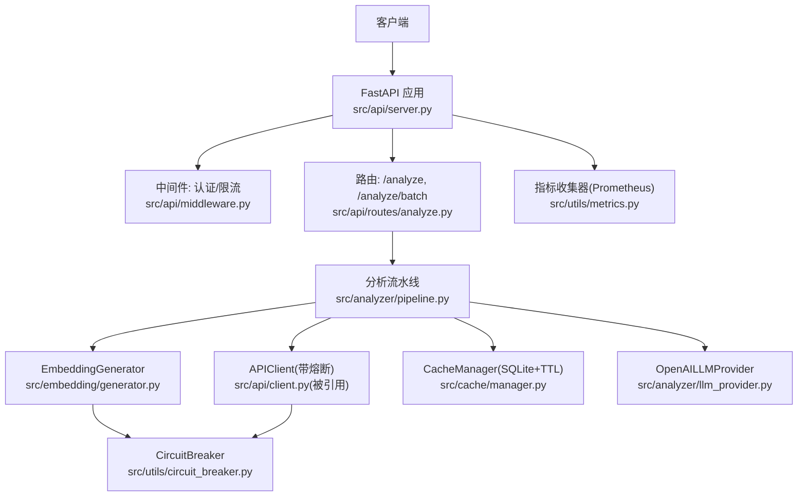
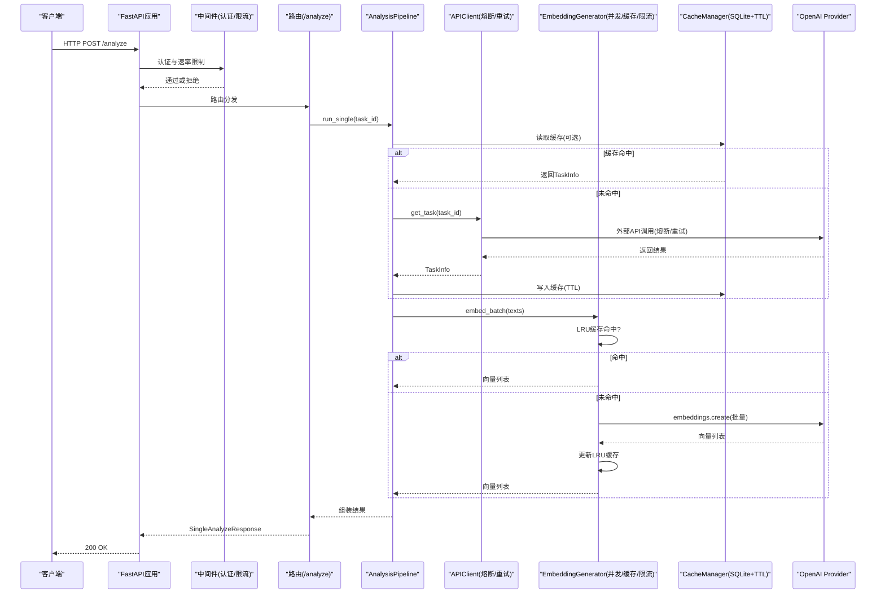
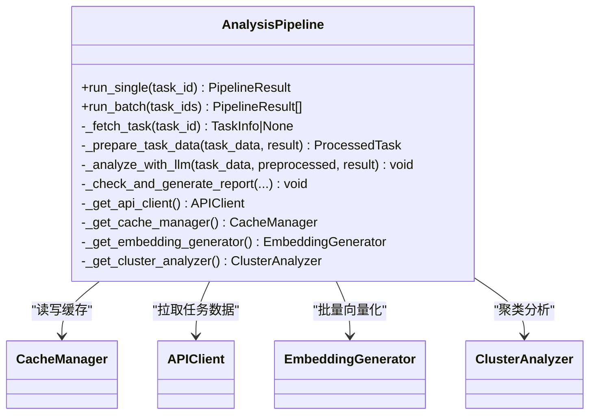
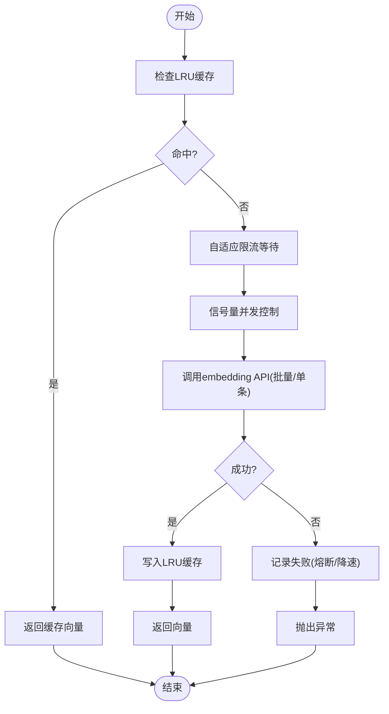
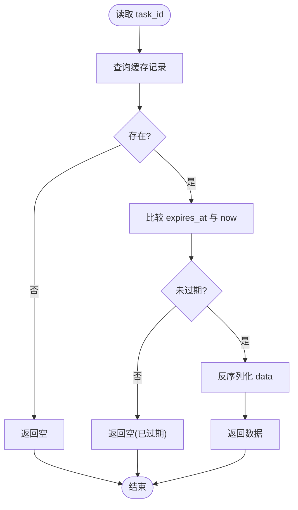
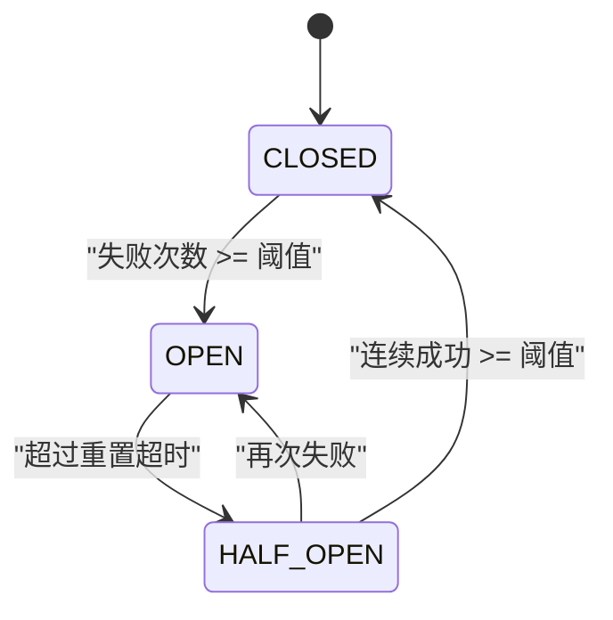
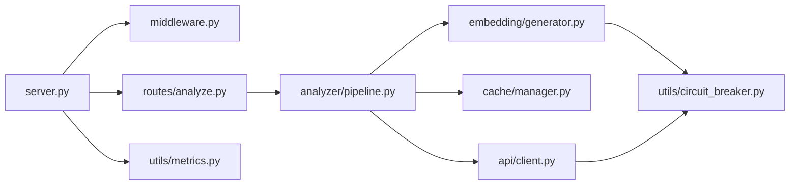

# 性能优化技术

<cite>
**本文引用的文件**   
- [src/api/server.py](file://src/api/server.py)
- [src/api/middleware.py](file://src/api/middleware.py)
- [src/api/routes/analyze.py](file://src/api/routes/analyze.py)
- [src/analyzer/pipeline.py](file://src/analyzer/pipeline.py)
- [src/analyzer/llm_provider.py](file://src/analyzer/llm_provider.py)
- [src/embedding/generator.py](file://src/embedding/generator.py)
- [src/cache/manager.py](file://src/cache/manager.py)
- [src/utils/circuit_breaker.py](file://src/utils/circuit_breaker.py)
- [src/utils/metrics.py](file://src/utils/metrics.py)
- [example_observability.py](file://example_observability.py)
- [docs/observability_guide.md](file://docs/observability_guide.md)
</cite>

## 目录
1. [引言](#引言)
2. [项目结构](#项目结构)
3. [核心组件](#核心组件)
4. [架构总览](#架构总览)
5. [详细组件分析](#详细组件分析)
6. [依赖关系分析](#依赖关系分析)
7. [性能考量与优化策略](#性能考量与优化策略)
8. [故障排查指南](#故障排查指南)
9. [结论](#结论)
10. [附录：监控与基准示例](#附录监控与基准示例)

## 引言
本技术文档聚焦于LLM响应处理链路中的性能优化，围绕以下主题展开：
- 流式处理与并发：增量解析、内存管理、并发控制
- 异步处理模式：协程使用、任务调度、资源池管理
- 内存优化：对象复用、垃圾回收调优、大对象处理
- 缓存优化：热点数据预加载、缓存预热、智能失效
- 可观测性与基准：指标采集、性能分析、瓶颈识别
- 生产部署建议与最佳实践

## 项目结构
本项目采用分层与模块化组织方式，关键路径包括：
- API层：FastAPI应用、中间件（认证、限流）、路由（分析接口）
- 分析流水线：编排数据获取、预处理、LLM调用、规则检查、报告生成
- 外部服务适配：APIClient封装HTTP调用、熔断保护、重试退避
- 嵌入向量生成：EmbeddingGenerator提供批量/单条向量化、LRU缓存、自适应限流、信号量并发控制
- 缓存：基于SQLite的持久化缓存，支持TTL与统计
- 指标与日志：Prometheus格式导出、结构化日志

**图表来源** 
- [src/api/server.py:1-152](file://src/api/server.py#L1-L152)
- [src/api/middleware.py:1-173](file://src/api/middleware.py#L1-L173)
- [src/api/routes/analyze.py:1-202](file://src/api/routes/analyze.py#L1-L202)
- [src/analyzer/pipeline.py:1-468](file://src/analyzer/pipeline.py#L1-L468)
- [src/embedding/generator.py:1-427](file://src/embedding/generator.py#L1-L427)
- [src/cache/manager.py:1-165](file://src/cache/manager.py#L1-L165)
- [src/utils/circuit_breaker.py:1-306](file://src/utils/circuit_breaker.py#L1-L306)
- [src/utils/metrics.py:1-252](file://src/utils/metrics.py#L1-L252)
- [src/analyzer/llm_provider.py:1-67](file://src/analyzer/llm_provider.py#L1-L67)

**章节来源**
- [src/api/server.py:1-152](file://src/api/server.py#L1-L152)
- [src/api/middleware.py:1-173](file://src/api/middleware.py#L1-L173)
- [src/api/routes/analyze.py:1-202](file://src/api/routes/analyze.py#L1-L202)
- [src/analyzer/pipeline.py:1-468](file://src/analyzer/pipeline.py#L1-L468)
- [src/embedding/generator.py:1-427](file://src/embedding/generator.py#L1-L427)
- [src/cache/manager.py:1-165](file://src/cache/manager.py#L1-L165)
- [src/utils/circuit_breaker.py:1-306](file://src/utils/circuit_breaker.py#L1-L306)
- [src/utils/metrics.py:1-252](file://src/utils/metrics.py#L1-L252)
- [src/analyzer/llm_provider.py:1-67](file://src/analyzer/llm_provider.py#L1-L67)

## 核心组件
- API服务器与中间件：负责请求接入、鉴权、速率限制、日志记录。
- 分析流水线：协调数据拉取、预处理、LLM分析、规则校验、报告生成；支持单任务与批量并发。
- 外部服务适配：APIClient封装HTTP调用，内置指数退避重试与熔断保护。
- 嵌入向量生成：提供文本到向量转换，具备LRU缓存、自适应QPS限流、信号量并发控制。
- 缓存管理器：基于SQLite的键值存储，支持TTL过期、索引清理与统计。
- 指标收集器：计数器、仪表盘、直方图，支持Prometheus导出。

**章节来源**
- [src/api/server.py:1-152](file://src/api/server.py#L1-L152)
- [src/api/middleware.py:1-173](file://src/api/middleware.py#L1-L173)
- [src/api/routes/analyze.py:1-202](file://src/api/routes/analyze.py#L1-L202)
- [src/analyzer/pipeline.py:1-468](file://src/analyzer/pipeline.py#L1-L468)
- [src/embedding/generator.py:1-427](file://src/embedding/generator.py#L1-L427)
- [src/cache/manager.py:1-165](file://src/cache/manager.py#L1-L165)
- [src/utils/metrics.py:1-252](file://src/utils/metrics.py#L1-L252)

## 架构总览
下图展示了从请求进入API到返回结果的完整流程，以及关键的性能优化点（缓存命中、并发、熔断、限流）。

**图表来源** 
- [src/api/server.py:1-152](file://src/api/server.py#L1-L152)
- [src/api/middleware.py:1-173](file://src/api/middleware.py#L1-L173)
- [src/api/routes/analyze.py:1-202](file://src/api/routes/analyze.py#L1-L202)
- [src/analyzer/pipeline.py:1-468](file://src/analyzer/pipeline.py#L1-L468)
- [src/embedding/generator.py:1-427](file://src/embedding/generator.py#L1-L427)
- [src/cache/manager.py:1-165](file://src/cache/manager.py#L1-L165)
- [src/utils/circuit_breaker.py:1-306](file://src/utils/circuit_breaker.py#L1-L306)
- [src/analyzer/llm_provider.py:1-67](file://src/analyzer/llm_provider.py#L1-L67)

## 详细组件分析

### 分析流水线（AnalysisPipeline）
- 职责：编排任务数据获取、预处理、LLM标签/根因分析、规则检查、报告生成；支持单任务与批量并发。
- 并发模型：run_batch使用asyncio.gather并行执行多个run_single；内部各阶段按配置开关选择性执行。
- 缓存集成：优先从CacheManager读取，未命中则通过APIClient拉取并回写缓存。
- 嵌入与聚类：在聚类流程中批量调用EmbeddingGenerator，并使用NumPy进行相似度计算。
- 资源管理：实现异步上下文协议，确保关闭时释放APIClient等资源。

**图表来源** 
- [src/analyzer/pipeline.py:1-468](file://src/analyzer/pipeline.py#L1-L468)
- [src/cache/manager.py:1-165](file://src/cache/manager.py#L1-L165)
- [src/embedding/generator.py:1-427](file://src/embedding/generator.py#L1-L427)

**章节来源**
- [src/analyzer/pipeline.py:1-468](file://src/analyzer/pipeline.py#L1-L468)

### 嵌入向量生成（EmbeddingGenerator）
- 并发控制：使用asyncio.Semaphore限制最大并发度，避免压垮下游服务。
- 自适应限流：AdaptiveRateLimiter根据成功/失败动态调整QPS，防止雪崩。
- 缓存策略：LRUEmbeddingCache以文本哈希为键，TTL过期淘汰，减少重复计算。
- 批量处理：embed_batch先走缓存，再分批并发调用底层API；对特定provider（如视觉模型）降级为逐条处理。
- 熔断保护：与CircuitBreaker集成，失败快速失败并退避恢复。

**图表来源** 
- [src/embedding/generator.py:1-427](file://src/embedding/generator.py#L1-L427)
- [src/utils/circuit_breaker.py:1-306](file://src/utils/circuit_breaker.py#L1-L306)

**章节来源**
- [src/embedding/generator.py:1-427](file://src/embedding/generator.py#L1-L427)
- [src/utils/circuit_breaker.py:1-306](file://src/utils/circuit_breaker.py#L1-L306)

### 缓存管理器（CacheManager）
- 存储介质：SQLite，表包含task_id、data、created_at、expires_at，并对expires_at建索引。
- TTL机制：读取时比较当前时间与过期时间，过期即视为不存在；支持手动清理过期条目。
- 统计能力：提供总数、有效数、过期数等统计信息，便于容量与命中率评估。

**图表来源** 
- [src/cache/manager.py:1-165](file://src/cache/manager.py#L1-L165)

**章节来源**
- [src/cache/manager.py:1-165](file://src/cache/manager.py#L1-L165)

### API客户端与熔断（APIClient + CircuitBreaker）
- 熔断状态机：CLOSED正常放行，OPEN阻断请求，HALF_OPEN探测恢复；成功阈值后闭合。
- 重试与退避：连接错误/超时采用指数退避重试；429限流不重试并记录失败；5xx服务端错误触发熔断。
- 上下文管理：支持异步上下文，自动创建/关闭httpx.AsyncClient，避免资源泄漏。

**图表来源** 
- [src/utils/circuit_breaker.py:1-306](file://src/utils/circuit_breaker.py#L1-L306)
- [src/api/client.py:1-340](file://src/api/client.py#L1-L340)

**章节来源**
- [src/utils/circuit_breaker.py:1-306](file://src/utils/circuit_breaker.py#L1-L306)
- [src/api/client.py:1-340](file://src/api/client.py#L1-L340)

### API中间件（认证与限流）
- Token验证：支持Header或Query参数传入Token，未配置有效Token集合时允许所有（开发模式）。
- 速率限制：基于每分钟窗口计数，超限返回429，并在响应头中返回剩余配额。
- 日志中间件：记录请求/响应耗时，便于定位慢请求。

**章节来源**
- [src/api/middleware.py:1-173](file://src/api/middleware.py#L1-L173)

### LLM提供者（OpenAILLMProvider）
- 异步客户端：延迟初始化AsyncOpenAI，按需创建，避免启动开销。
- 生成接口：统一system/user消息格式，返回文本内容。

**章节来源**
- [src/analyzer/llm_provider.py:1-67](file://src/analyzer/llm_provider.py#L1-L67)

## 依赖关系分析
- API层依赖中间件与路由；路由依赖分析流水线。
- 分析流水线依赖APIClient、CacheManager、EmbeddingGenerator、ClusterAnalyzer、ReportGenerator、RulesEngine等。
- EmbeddingGenerator依赖CircuitBreaker与AdaptiveRateLimiter；APIClient也依赖CircuitBreaker。
- 指标收集器独立，可在任意层注入使用。

**图表来源** 
- [src/api/server.py:1-152](file://src/api/server.py#L1-L152)
- [src/api/middleware.py:1-173](file://src/api/middleware.py#L1-L173)
- [src/api/routes/analyze.py:1-202](file://src/api/routes/analyze.py#L1-L202)
- [src/analyzer/pipeline.py:1-468](file://src/analyzer/pipeline.py#L1-L468)
- [src/embedding/generator.py:1-427](file://src/embedding/generator.py#L1-L427)
- [src/cache/manager.py:1-165](file://src/cache/manager.py#L1-L165)
- [src/utils/circuit_breaker.py:1-306](file://src/utils/circuit_breaker.py#L1-L306)
- [src/utils/metrics.py:1-252](file://src/utils/metrics.py#L1-L252)

**章节来源**
- [src/api/server.py:1-152](file://src/api/server.py#L1-L152)
- [src/api/middleware.py:1-173](file://src/api/middleware.py#L1-L173)
- [src/api/routes/analyze.py:1-202](file://src/api/routes/analyze.py#L1-L202)
- [src/analyzer/pipeline.py:1-468](file://src/analyzer/pipeline.py#L1-L468)
- [src/embedding/generator.py:1-427](file://src/embedding/generator.py#L1-L427)
- [src/cache/manager.py:1-165](file://src/cache/manager.py#L1-L165)
- [src/utils/circuit_breaker.py:1-306](file://src/utils/circuit_breaker.py#L1-L306)
- [src/utils/metrics.py:1-252](file://src/utils/metrics.py#L1-L252)

## 性能考量与优化策略

### 流式处理与增量解析
- 现状：当前API与流水线主要采用一次性返回结果的模式，尚未实现真正的流式传输（如Server-Sent Events或WebSocket）。
- 建议：
  - 在Embedding与LLM调用处引入分块处理，逐步消费响应以减少首字节延迟。
  - 在API层使用StreamingResponse，将长任务结果分段推送，降低客户端等待时间。
  - 对大对象（如长文本、报告）采用惰性构建与分片输出，避免一次性构造大字符串。

[本节为概念性建议，无需代码来源]

### 内存管理与对象复用
- 嵌入缓存：LRU缓存避免重复计算，注意max_size与TTL平衡，防止内存膨胀。
- 批处理：EmbeddingGenerator的embed_batch将未命中项分批处理，减少单次请求体大小与内存峰值。
- 对象复用：APIClient与EmbeddingGenerator均延迟初始化客户端，避免启动期资源占用。
- 大对象处理：在流水线中尽量传递引用而非深拷贝，必要时使用生成器/迭代器处理序列数据。

**章节来源**
- [src/embedding/generator.py:1-427](file://src/embedding/generator.py#L1-L427)
- [src/analyzer/pipeline.py:1-468](file://src/analyzer/pipeline.py#L1-L468)
- [src/api/client.py:1-340](file://src/api/client.py#L1-L340)

### 并发处理与任务调度
- 并发模型：run_batch使用asyncio.gather并行执行；EmbeddingGenerator使用Semaphore限制并发度。
- 自适应限流：根据成功率动态调整QPS，避免下游过载。
- 资源池：httpx.AsyncClient与OpenAI AsyncOpenAI实例复用，减少握手与TLS开销。

**章节来源**
- [src/analyzer/pipeline.py:1-468](file://src/analyzer/pipeline.py#L1-L468)
- [src/embedding/generator.py:1-427](file://src/embedding/generator.py#L1-L427)

### 缓存优化技巧
- 热点数据预加载：启动时可扫描高频task_id并预填充CacheManager，提升冷启动命中率。
- 缓存预热：对近期活跃任务或热门模板进行批量嵌入并写入LRU缓存。
- 智能失效：基于TTL与访问频率（LRU）淘汰；定期清理过期条目，保持数据库体积可控。

**章节来源**
- [src/cache/manager.py:1-165](file://src/cache/manager.py#L1-L165)
- [src/embedding/generator.py:1-427](file://src/embedding/generator.py#L1-L427)

### 异步处理模式与资源池管理
- 协程使用：API路由与分析流水线均为异步函数，充分利用事件循环。
- 任务调度：通过asyncio.gather聚合任务；对I/O密集操作（网络、磁盘）优先使用异步库。
- 资源池：APIClient与EmbeddingGenerator共享客户端实例，避免频繁创建销毁。

**章节来源**
- [src/api/routes/analyze.py:1-202](file://src/api/routes/analyze.py#L1-L202)
- [src/analyzer/pipeline.py:1-468](file://src/analyzer/pipeline.py#L1-L468)
- [src/api/client.py:1-340](file://src/api/client.py#L1-L340)
- [src/embedding/generator.py:1-427](file://src/embedding/generator.py#L1-L427)

### 熔断与重试
- 熔断：CircuitBreaker在连续失败后快速失败，避免级联故障；半开状态探测恢复。
- 重试：指数退避适用于瞬态错误（连接/超时），限流与认证错误不重试。

**章节来源**
- [src/utils/circuit_breaker.py:1-306](file://src/utils/circuit_breaker.py#L1-L306)
- [src/api/client.py:1-340](file://src/api/client.py#L1-L340)

### 指标与可观测性
- 指标类型：Counter/Gauge/Histogram，支持标签维度；可导出Prometheus格式。
- 使用位置：API层记录请求计数与耗时；流水线记录分析时长与成功率；嵌入层记录调用次数与失败率。
- 全局收集器：提供全局MetricsCollector实例，简化跨模块采集。

**章节来源**
- [src/utils/metrics.py:1-252](file://src/utils/metrics.py#L1-L252)
- [example_observability.py:1-86](file://example_observability.py#L1-L86)
- [docs/observability_guide.md:116-168](file://docs/observability_guide.md#L116-L168)

## 故障排查指南
- 熔断打开：检查CircuitBreaker状态与失败原因，确认下游服务健康；适当调整failure_threshold与reset_timeout。
- 限流触发：查看中间件X-RateLimit-Remaining与429响应；调整requests_per_minute或客户端重试策略。
- 缓存未命中：核对CacheManager TTL设置与过期清理；检查任务ID一致性与JSON序列化问题。
- 嵌入失败：观察AdaptiveRateLimiter QPS变化与CircuitBreaker记录；确认模型与base_url配置正确。
- 指标缺失：确认在各关键路径埋点；使用export_prometheus验证输出格式。

**章节来源**
- [src/utils/circuit_breaker.py:1-306](file://src/utils/circuit_breaker.py#L1-L306)
- [src/api/middleware.py:1-173](file://src/api/middleware.py#L1-L173)
- [src/cache/manager.py:1-165](file://src/cache/manager.py#L1-L165)
- [src/embedding/generator.py:1-427](file://src/embedding/generator.py#L1-L427)
- [src/utils/metrics.py:1-252](file://src/utils/metrics.py#L1-L252)

## 结论
本项目在异步并发、缓存、熔断与限流方面已有良好基础。为进一步优化LLM响应处理性能，建议在以下方向持续改进：
- 引入流式传输与增量解析，降低首字节延迟与大对象内存峰值
- 完善缓存预热与智能失效策略，提高热点命中率
- 细化指标埋点与基准测试，形成闭环的性能治理体系
- 在生产环境结合容器化与水平扩展，配合指标与告警实现弹性伸缩

[本节为总结性内容，无需代码来源]

## 附录：监控与基准示例
- 指标采集示例：参考示例脚本展示如何记录计数器、仪表盘与直方图，并导出Prometheus格式。
- Prometheus导出：可直接打印或暴露端点供Prometheus抓取。
- 基准测试建议：
  - 定义典型工作负载（单任务/批量任务、不同文本长度）
  - 采集关键指标：请求延迟分布、吞吐、缓存命中率、熔断触发次数、QPS波动
  - 对比优化前后差异，定位瓶颈（网络、CPU、内存、I/O）

**章节来源**
- [example_observability.py:1-86](file://example_observability.py#L1-L86)
- [docs/observability_guide.md:116-168](file://docs/observability_guide.md#L116-L168)
- [src/utils/metrics.py:1-252](file://src/utils/metrics.py#L1-L252)