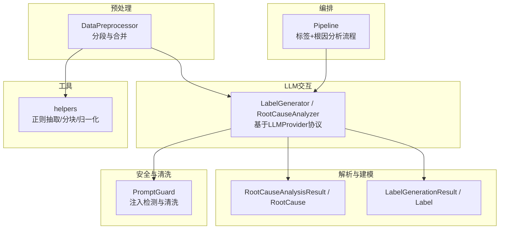
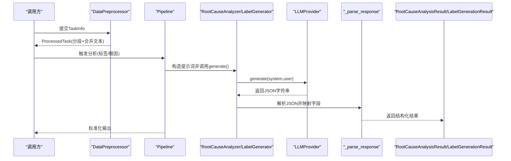
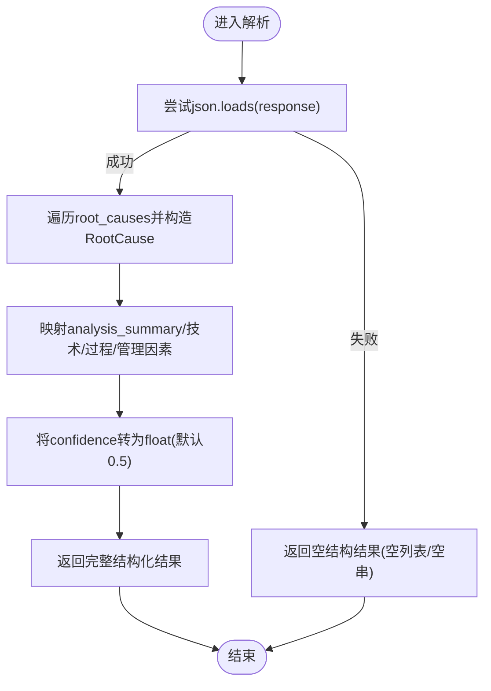
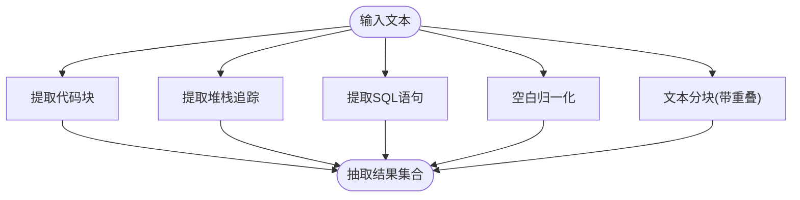
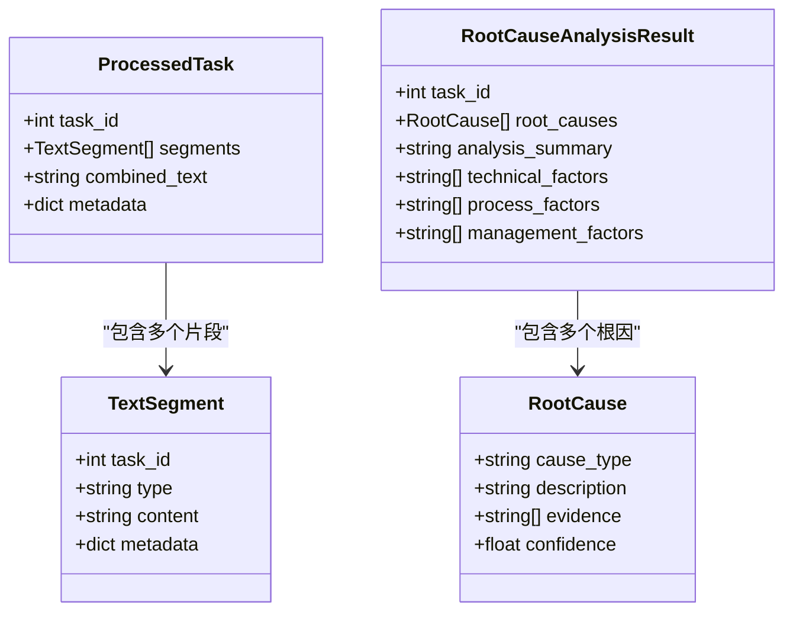
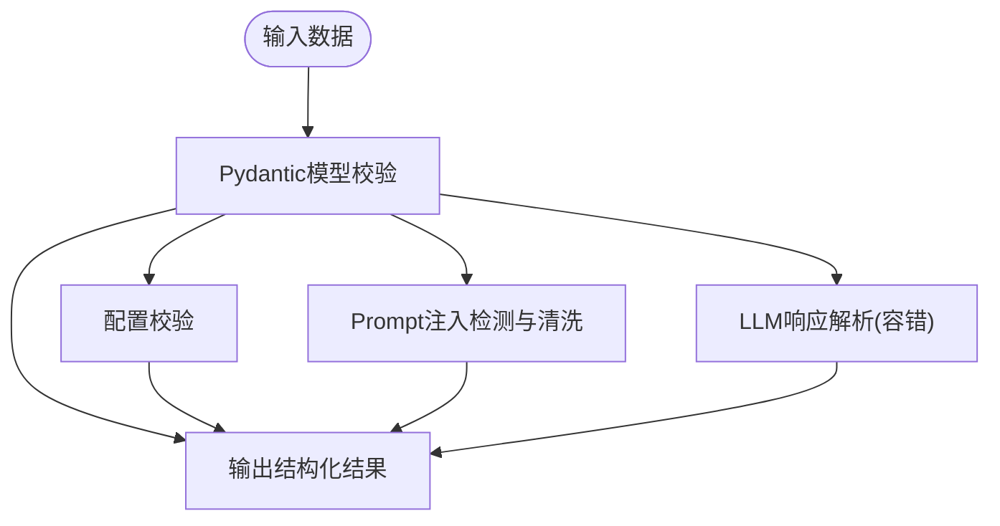
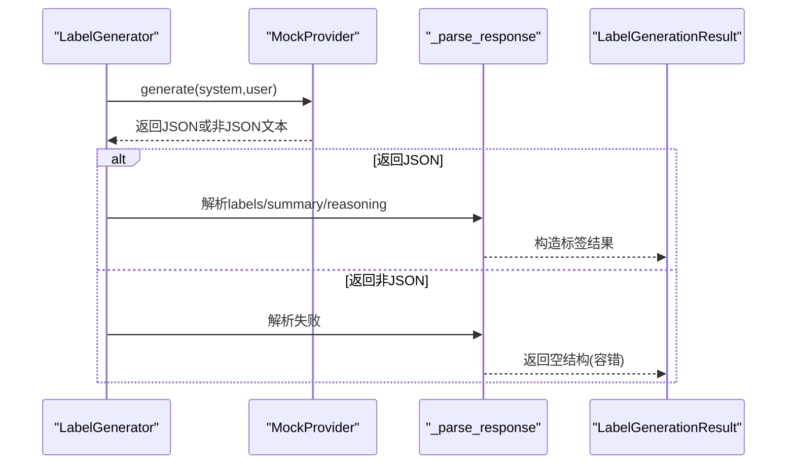
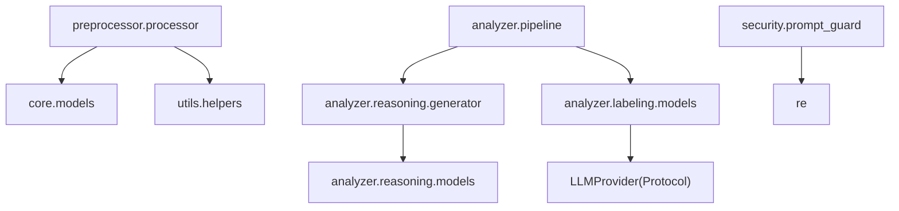

# 结构化数据提取

<cite>
**本文引用的文件**   
- [src/analyzer/reasoning/generator.py](file://src/analyzer/reasoning/generator.py)
- [src/analyzer/reasoning/models.py](file://src/analyzer/reasoning/models.py)
- [src/analyzer/labeling/models.py](file://src/analyzer/labeling/models.py)
- [src/preprocessor/processor.py](file://src/preprocessor/processor.py)
- [src/utils/helpers.py](file://src/utils/helpers.py)
- [src/security/prompt_guard.py](file://src/security/prompt_guard.py)
- [src/core/models.py](file://src/core/models.py)
- [src/analyzer/pipeline.py](file://src/analyzer/pipeline.py)
- [tests/test_labeling_generator.py](file://tests/test_labeling_generator.py)
- [tests/test_utils.py](file://tests/test_utils.py)
</cite>

## 目录
1. [引言](#引言)
2. [项目结构](#项目结构)
3. [核心组件](#核心组件)
4. [架构总览](#架构总览)
5. [详细组件分析](#详细组件分析)
6. [依赖关系分析](#依赖关系分析)
7. [性能考虑](#性能考虑)
8. [故障排查指南](#故障排查指南)
9. [结论](#结论)
10. [附录](#附录)

## 引言
本技术文档围绕“LLM响应结构化数据提取系统”展开，聚焦以下目标：
- JSON解析算法：包括嵌套对象处理、类型转换与字段映射策略
- 正则表达式匹配策略：从非结构化文本中抽取关键信息（代码块、堆栈、SQL等）
- 自然语言处理技术：实体识别、关系抽取与语义理解在系统中的落地方式
- 数据验证机制：格式检查、业务规则校验与数据完整性保证
- 实际示例与容错：覆盖多种LLM响应格式的解析流程与错误恢复
- 性能优化建议与最佳实践

## 项目结构
本项目采用分层与模块化组织，与结构化数据提取相关的关键路径如下：
- 预处理层：将原始任务数据切分为多段文本片段，便于后续分析与提示词构建
- LLM交互层：通过LLM Provider协议调用外部模型，生成结构化JSON响应
- 解析与建模层：将LLM返回的JSON字符串解析为内部数据结构，并进行类型转换与字段映射
- 安全与清洗层：对输入进行注入检测与清洗，保障提示词安全
- 工具层：提供正则抽取、文本分块、空白归一化等通用能力
- 管道编排层：串联标签生成与根因分析流程，统一输出标准化结果

图表来源
- [src/preprocessor/processor.py:1-200](file://src/preprocessor/processor.py#L1-L200)
- [src/analyzer/reasoning/generator.py:1-176](file://src/analyzer/reasoning/generator.py#L1-L176)
- [src/analyzer/labeling/models.py:1-31](file://src/analyzer/labeling/models.py#L1-L31)
- [src/analyzer/reasoning/models.py:1-24](file://src/analyzer/reasoning/models.py#L1-L24)
- [src/security/prompt_guard.py:1-87](file://src/security/prompt_guard.py#L1-L87)
- [src/utils/helpers.py:1-86](file://src/utils/helpers.py#L1-L86)
- [src/analyzer/pipeline.py:281-349](file://src/analyzer/pipeline.py#L281-L349)

章节来源
- [src/preprocessor/processor.py:1-200](file://src/preprocessor/processor.py#L1-L200)
- [src/analyzer/reasoning/generator.py:1-176](file://src/analyzer/reasoning/generator.py#L1-L176)
- [src/analyzer/labeling/models.py:1-31](file://src/analyzer/labeling/models.py#L1-L31)
- [src/analyzer/reasoning/models.py:1-24](file://src/analyzer/reasoning/models.py#L1-L24)
- [src/security/prompt_guard.py:1-87](file://src/security/prompt_guard.py#L1-L87)
- [src/utils/helpers.py:1-86](file://src/utils/helpers.py#L1-L86)
- [src/analyzer/pipeline.py:281-349](file://src/analyzer/pipeline.py#L281-L349)

## 核心组件
- 数据预处理模块：负责将TaskInfo拆分为多段TextSegment，并组合为统一文本，供后续分析使用
- LLM解析器：将LLM返回的JSON字符串解析为结构化结果，包含根因列表、分析摘要与技术/过程/管理因素
- 标签生成器：基于LLM生成聚类标签与推理说明，支持批量生成与无效JSON容错
- 安全与清洗：对输入进行注入模式检测与清洗，防止提示词被恶意覆盖
- 工具函数：提供代码块、堆栈、SQL等正则抽取，以及文本分块与空白归一化
- 核心模型：定义任务、分析结果、标签、根因等Pydantic模型，内置字段校验与范围约束

章节来源
- [src/preprocessor/processor.py:1-200](file://src/preprocessor/processor.py#L1-L200)
- [src/analyzer/reasoning/generator.py:142-176](file://src/analyzer/reasoning/generator.py#L142-L176)
- [src/analyzer/labeling/models.py:1-31](file://src/analyzer/labeling/models.py#L1-L31)
- [src/security/prompt_guard.py:1-87](file://src/security/prompt_guard.py#L1-L87)
- [src/utils/helpers.py:28-58](file://src/utils/helpers.py#L28-L58)
- [src/core/models.py:31-200](file://src/core/models.py#L31-L200)

## 架构总览
下图展示从原始任务到结构化结果的端到端流程，涵盖预处理、LLM交互、解析与建模、安全与工具支撑。

图表来源
- [src/analyzer/pipeline.py:281-349](file://src/analyzer/pipeline.py#L281-L349)
- [src/analyzer/reasoning/generator.py:83-127](file://src/analyzer/reasoning/generator.py#L83-L127)
- [src/analyzer/reasoning/generator.py:142-176](file://src/analyzer/reasoning/generator.py#L142-L176)
- [src/analyzer/labeling/models.py:1-31](file://src/analyzer/labeling/models.py#L1-L31)
- [src/analyzer/reasoning/models.py:1-24](file://src/analyzer/reasoning/models.py#L1-L24)

## 详细组件分析

### JSON解析算法（嵌套对象、类型转换、字段映射）
- 解析入口：根因分析器在收到LLM返回的JSON字符串后，尝试将其反序列化为字典
- 嵌套对象处理：对root_causes数组逐项遍历，构造内部RootCause对象；对analysis_summary、technical_factors、process_factors、management_factors进行默认值填充
- 类型转换：confidence字段强制转换为浮点数，缺失时回退至默认值
- 字段映射：按约定键名映射到目标数据结构，缺失键使用空字符串或空列表作为默认值
- 容错机制：捕获JSON解码异常、KeyError与ValueError，返回空结构的分析结果，确保下游流程不中断

图表来源
- [src/analyzer/reasoning/generator.py:142-176](file://src/analyzer/reasoning/generator.py#L142-L176)

章节来源
- [src/analyzer/reasoning/generator.py:142-176](file://src/analyzer/reasoning/generator.py#L142-L176)
- [src/analyzer/reasoning/models.py:1-24](file://src/analyzer/reasoning/models.py#L1-L24)

### 正则表达式匹配策略（非结构化文本抽取）
- 代码块抽取：使用多行匹配模式提取Markdown代码块内容
- 堆栈追踪抽取：针对常见异常关键字与调用栈格式进行匹配，聚合多条匹配结果
- SQL查询抽取：基于SQL关键字前缀与语句终止符进行抽取，忽略大小写
- 空白归一化与分块：将多余空白压缩为单空格；按固定长度与重叠窗口切分长文本，提升LLM上下文利用率

图表来源
- [src/utils/helpers.py:28-58](file://src/utils/helpers.py#L28-L58)
- [src/utils/helpers.py:65-85](file://src/utils/helpers.py#L65-L85)

章节来源
- [src/utils/helpers.py:28-58](file://src/utils/helpers.py#L28-L58)
- [src/utils/helpers.py:65-85](file://src/utils/helpers.py#L65-L85)
- [tests/test_utils.py:118-150](file://tests/test_utils.py#L118-L150)

### 自然语言处理技术（实体识别、关系抽取、语义理解）
- 实体识别：通过预处理阶段将任务标题、描述、需求、设计、开发、测试、生产日志等切分为结构化片段，形成可识别的“实体边界”，便于后续LLM进行细粒度理解
- 关系抽取：在根因分析过程中，结合已有标签与分段细节，引导模型建立“问题—证据—原因”的关系链，输出evidence列表与cause_type分类
- 语义理解：利用系统提示词与用户提示词模板，明确分析维度（技术/过程/管理），并要求以JSON结构化输出，从而增强语义对齐与可解析性

图表来源
- [src/preprocessor/processor.py:1-200](file://src/preprocessor/processor.py#L1-L200)
- [src/analyzer/reasoning/models.py:1-24](file://src/analyzer/reasoning/models.py#L1-L24)

章节来源
- [src/preprocessor/processor.py:1-200](file://src/preprocessor/processor.py#L1-L200)
- [src/analyzer/reasoning/models.py:1-24](file://src/analyzer/reasoning/models.py#L1-L24)

### 数据验证机制（格式检查、业务规则、完整性）
- Pydantic模型校验：对任务ID、标题、时间戳、置信度范围等进行严格校验，避免非法数据进入下游
- 配置校验：集中校验API、LLM、嵌入、缓存等配置项的完整性与有效性
- 安全校验：PromptGuard检测注入模式并对危险字符进行转义，保障提示词不被篡改
- 完整性保证：当LLM返回非JSON或字段缺失时，解析器返回空结构，确保整体流程稳定运行

图表来源
- [src/core/models.py:31-200](file://src/core/models.py#L31-L200)
- [src/config/validator.py:1-44](file://src/config/validator.py#L1-L44)
- [src/security/prompt_guard.py:1-87](file://src/security/prompt_guard.py#L1-L87)
- [src/analyzer/reasoning/generator.py:142-176](file://src/analyzer/reasoning/generator.py#L142-L176)

章节来源
- [src/core/models.py:31-200](file://src/core/models.py#L31-L200)
- [src/config/validator.py:1-44](file://src/config/validator.py#L1-L44)
- [src/security/prompt_guard.py:1-87](file://src/security/prompt_guard.py#L1-L87)
- [src/analyzer/reasoning/generator.py:142-176](file://src/analyzer/reasoning/generator.py#L142-L176)

### 实际示例与容错机制（多种LLM响应格式）
- 标准JSON：包含labels、summary、reasoning的结构，解析器直接映射为LabelGenerationResult
- 非JSON文本：解析器捕获异常并返回空结构，保证流程继续执行
- 部分字段缺失：使用默认值填充，如空列表或空字符串
- 批量处理：对多个任务依次解析，任一失败不影响其他任务

图表来源
- [tests/test_labeling_generator.py:50-115](file://tests/test_labeling_generator.py#L50-L115)
- [src/analyzer/labeling/models.py:1-31](file://src/analyzer/labeling/models.py#L1-L31)

章节来源
- [tests/test_labeling_generator.py:50-115](file://tests/test_labeling_generator.py#L50-L115)
- [src/analyzer/labeling/models.py:1-31](file://src/analyzer/labeling/models.py#L1-L31)

## 依赖关系分析
- 模块内聚与耦合
  - 预处理与工具：高内聚，低耦合，仅依赖基础文本处理能力
  - LLM解析与建模：强依赖LLMProvider协议，但通过Protocol解耦具体实现
  - 安全与清洗：独立于业务逻辑，提供通用防护能力
- 外部依赖与集成点
  - LLMProvider：抽象接口，允许替换不同后端服务
  - Pydantic：用于数据模型与校验
  - 正则库：用于文本抽取与清洗
- 潜在循环依赖
  - 当前结构未见明显循环导入，各模块职责清晰

图表来源
- [src/preprocessor/processor.py:1-200](file://src/preprocessor/processor.py#L1-L200)
- [src/analyzer/reasoning/generator.py:1-176](file://src/analyzer/reasoning/generator.py#L1-L176)
- [src/analyzer/labeling/models.py:1-31](file://src/analyzer/labeling/models.py#L1-L31)
- [src/security/prompt_guard.py:1-87](file://src/security/prompt_guard.py#L1-L87)
- [src/analyzer/pipeline.py:281-349](file://src/analyzer/pipeline.py#L281-L349)

章节来源
- [src/preprocessor/processor.py:1-200](file://src/preprocessor/processor.py#L1-L200)
- [src/analyzer/reasoning/generator.py:1-176](file://src/analyzer/reasoning/generator.py#L1-L176)
- [src/analyzer/labeling/models.py:1-31](file://src/analyzer/labeling/models.py#L1-L31)
- [src/security/prompt_guard.py:1-87](file://src/security/prompt_guard.py#L1-L87)
- [src/analyzer/pipeline.py:281-349](file://src/analyzer/pipeline.py#L281-L349)

## 性能考虑
- 文本分块与重叠：合理设置chunk_size与overlap，减少LLM上下文溢出并提高召回率
- 正则抽取效率：优先使用预编译模式与最小回溯，避免复杂贪婪匹配
- 解析容错开销：在解析失败时快速返回空结构，避免重复重试
- 批量处理：对多任务并行或流水线化处理，降低总体延迟
- 缓存与降级：对频繁请求的结果进行缓存，并在外部依赖不可用时启用降级策略

[本节为通用指导，无需特定文件引用]

## 故障排查指南
- LLM返回非JSON
  - 现象：解析抛出JSONDecodeError
  - 处理：解析器捕获异常并返回空结构，检查提示词模板与模型输出格式
- 字段缺失或类型不符
  - 现象：KeyError或ValueError
  - 处理：确认字段映射键名与默认值策略，必要时增加更严格的Pydantic校验
- 注入攻击风险
  - 现象：PromptGuard检测到注入模式
  - 处理：清洗文本并拒绝不安全输入，记录告警日志
- 性能瓶颈
  - 现象：长文本处理慢或正则匹配耗时
  - 处理：调整分块大小、优化正则表达式、启用缓存

章节来源
- [src/analyzer/reasoning/generator.py:142-176](file://src/analyzer/reasoning/generator.py#L142-L176)
- [src/security/prompt_guard.py:1-87](file://src/security/prompt_guard.py#L1-L87)
- [src/utils/helpers.py:28-58](file://src/utils/helpers.py#L28-L58)

## 结论
本系统通过“预处理—LLM交互—解析建模—安全清洗—工具支撑—管道编排”的分层架构，实现了从非结构化文本到结构化数据的可靠提取。JSON解析具备完善的容错与类型转换机制，正则抽取覆盖常见技术文本场景，Pydantic与PromptGuard共同保障数据质量与安全。建议在大规模部署中结合缓存、批处理与性能监控进一步优化吞吐与稳定性。

[本节为总结性内容，无需特定文件引用]

## 附录
- 术语表
  - LLM：大语言模型
  - Prompt：提示词
  - 分块：将长文本切分为较小片段以提升处理效果
  - 注入：恶意或不当的提示词覆盖行为
- 参考实现路径
  - JSON解析与容错：[src/analyzer/reasoning/generator.py:142-176](file://src/analyzer/reasoning/generator.py#L142-L176)
  - 正则抽取工具：[src/utils/helpers.py:28-58](file://src/utils/helpers.py#L28-L58)
  - 安全清洗与注入检测：[src/security/prompt_guard.py:1-87](file://src/security/prompt_guard.py#L1-L87)
  - 数据模型与校验：[src/core/models.py:31-200](file://src/core/models.py#L31-L200)
  - 标签生成与容错用例：[tests/test_labeling_generator.py:50-115](file://tests/test_labeling_generator.py#L50-L115)
