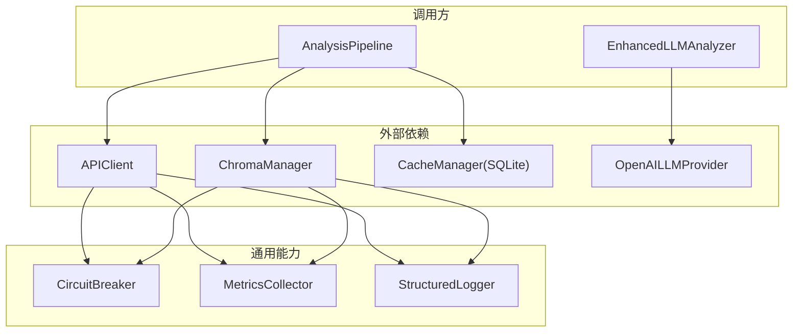
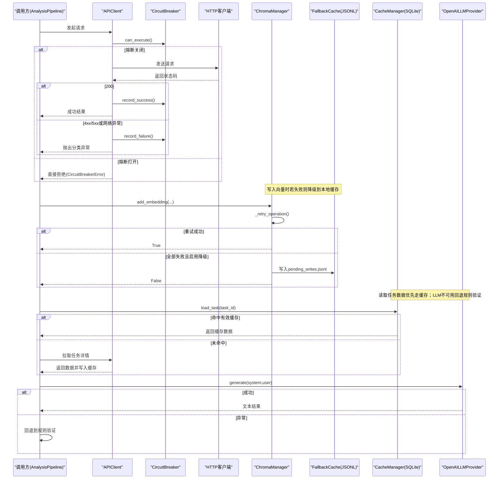
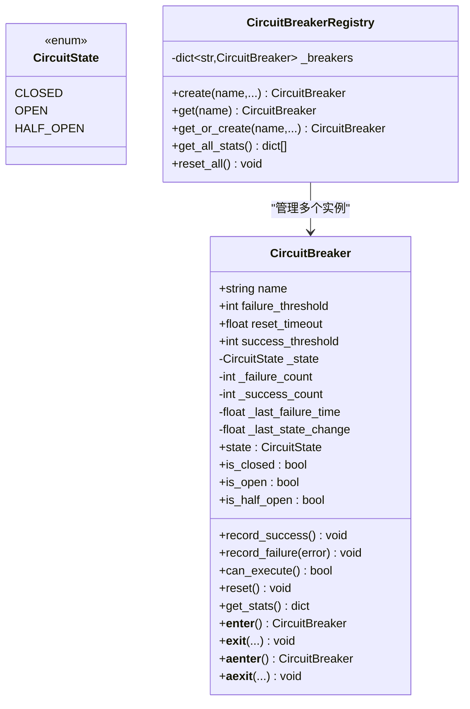
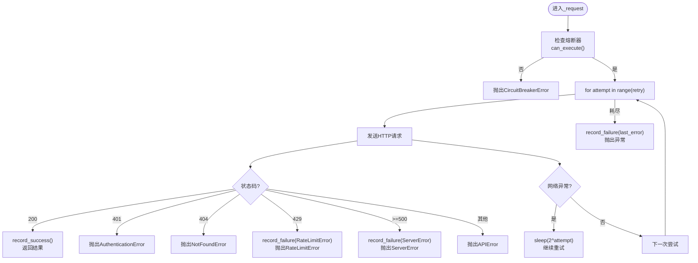
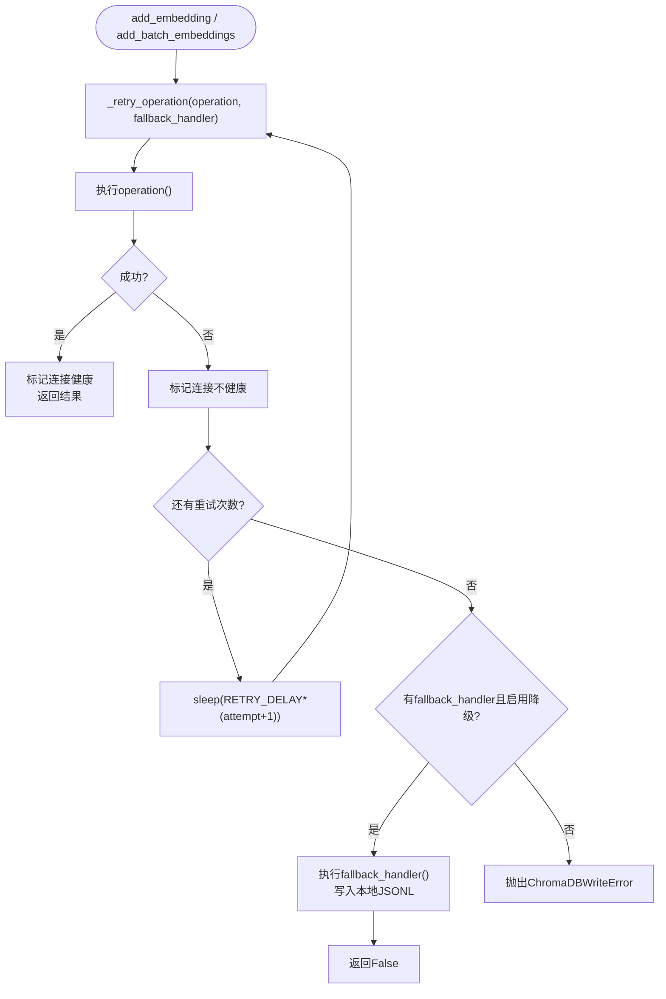
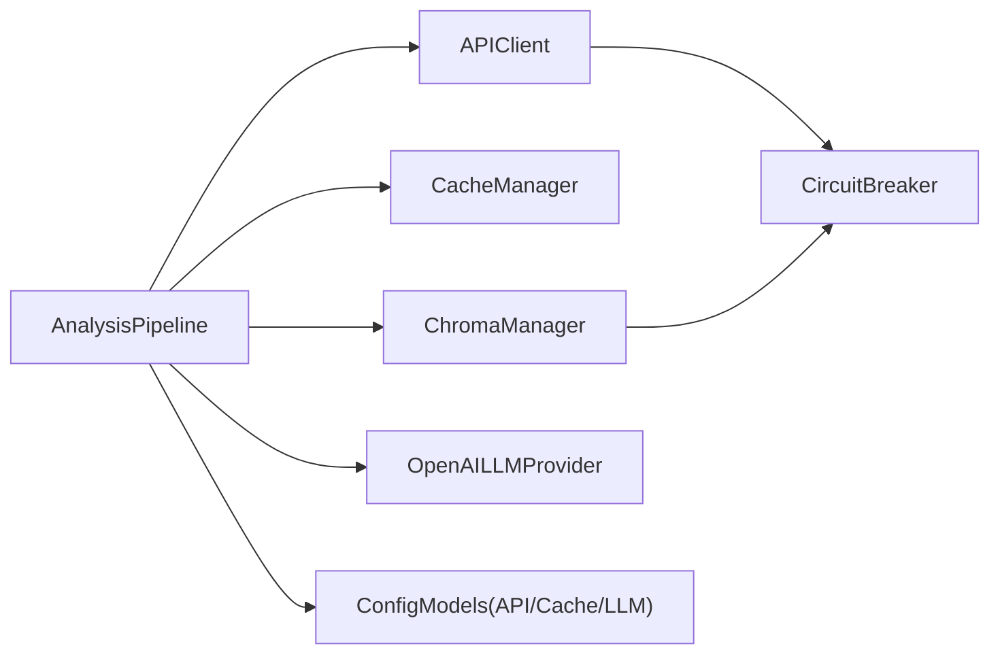

# 错误恢复机制

<cite>
**本文引用的文件**   
- [circuit_breaker.py](file://src/utils/circuit_breaker.py)
- [client.py](file://src/api/client.py)
- [exceptions.py](file://src/api/exceptions.py)
- [metrics.py](file://src/utils/metrics.py)
- [logger.py](file://src/utils/logger.py)
- [manager.py](file://src/cache/manager.py)
- [models.py](file://src/config/models.py)
- [chroma_manager.py](file://src/storage/chroma_manager.py)
- [enhanced_llm_analyzer.py](file://src/analysis/enhanced_llm_analyzer.py)
- [pipeline.py](file://src/analyzer/pipeline.py)
</cite>

## 目录
1. [简介](#简介)
2. [项目结构](#项目结构)
3. [核心组件](#核心组件)
4. [架构总览](#架构总览)
5. [详细组件分析](#详细组件分析)
6. [依赖关系分析](#依赖关系分析)
7. [性能考量](#性能考量)
8. [故障诊断指南](#故障诊断指南)
9. [结论](#结论)
10. [附录](#附录)

## 简介
本技术文档聚焦于LLM响应处理与外部服务交互中的错误恢复机制，系统性阐述以下能力：
- 重试策略：指数退避、最大重试次数、可重试条件判断
- 降级方案：备用算法切换、缓存数据回退、默认值处理
- 熔断器模式：阈值配置、状态监控、自动恢复
- 异常分类与差异化处理：网络异常、API限流、服务端错误、业务异常
- 日志记录与监控指标收集
- 故障诊断与性能调优建议

## 项目结构
围绕错误恢复的关键代码分布在如下模块：
- API客户端层：请求重试、熔断保护、异常分类
- 向量存储层：ChromaDB容错、本地文件降级、同步回放
- 缓存层：SQLite任务缓存，用于快速回退
- 配置层：统一参数化（超时、重试次数等）
- 指标与日志：结构化日志、Prometheus格式指标导出
- LLM分析流程：在LLM不可用时回退到规则验证

图表来源
- [pipeline.py:105-182](file://src/analyzer/pipeline.py#L105-L182)
- [client.py:25-161](file://src/api/client.py#L25-L161)
- [chroma_manager.py:111-222](file://src/storage/chroma_manager.py#L111-L222)
- [manager.py:10-165](file://src/cache/manager.py#L10-L165)
- [circuit_breaker.py:36-198](file://src/utils/circuit_breaker.py#L36-L198)
- [metrics.py:151-252](file://src/utils/metrics.py#L151-L252)
- [logger.py:34-160](file://src/utils/logger.py#L34-L160)

章节来源
- [pipeline.py:105-182](file://src/analyzer/pipeline.py#L105-L182)
- [client.py:25-161](file://src/api/client.py#L25-L161)
- [chroma_manager.py:111-222](file://src/storage/chroma_manager.py#L111-L222)
- [manager.py:10-165](file://src/cache/manager.py#L10-L165)
- [circuit_breaker.py:36-198](file://src/utils/circuit_breaker.py#L36-L198)
- [metrics.py:151-252](file://src/utils/metrics.py#L151-L252)
- [logger.py:34-160](file://src/utils/logger.py#L34-L160)

## 核心组件
- 熔断器 CircuitBreaker：提供OPEN/CLOSED/HALF_OPEN三态机，支持上下文管理器与装饰器，统计失败/成功计数并自动尝试恢复。
- API客户端 APIClient：封装HTTP请求，内置重试循环、指数退避、按状态码分类异常、熔断保护。
- 向量存储 ChromaManager：对ChromaDB操作进行重试与连接健康检查，失败时降级至本地JSONL待写队列，并提供同步回放。
- 缓存 CacheManager：基于SQLite的任务级缓存，带TTL过期控制，作为快速回退源。
- 指标 MetricsCollector：计数器、仪表盘、直方图，支持Prometheus导出。
- 日志 StructuredLogger：结构化输出，支持控制台与文件，便于追踪错误恢复路径。
- 增强分析 EnhancedLLMAnalyzer：当LLM不可用时，回退到规则验证，保证流程不中断。

章节来源
- [circuit_breaker.py:36-198](file://src/utils/circuit_breaker.py#L36-L198)
- [client.py:25-161](file://src/api/client.py#L25-L161)
- [chroma_manager.py:111-222](file://src/storage/chroma_manager.py#L111-L222)
- [manager.py:10-165](file://src/cache/manager.py#L10-L165)
- [metrics.py:151-252](file://src/utils/metrics.py#L151-L252)
- [logger.py:34-160](file://src/utils/logger.py#L34-L160)
- [enhanced_llm_analyzer.py:108-121](file://src/analysis/enhanced_llm_analyzer.py#L108-L121)

## 架构总览
下图展示了从上层流水线到外部依赖的错误恢复链路，包括重试、熔断、降级与观测性。

图表来源
- [client.py:99-161](file://src/api/client.py#L99-L161)
- [circuit_breaker.py:146-186](file://src/utils/circuit_breaker.py#L146-L186)
- [chroma_manager.py:173-222](file://src/storage/chroma_manager.py#L173-L222)
- [manager.py:37-76](file://src/cache/manager.py#L37-L76)
- [enhanced_llm_analyzer.py:108-121](file://src/analysis/enhanced_llm_analyzer.py#L108-L121)

## 详细组件分析

### 组件一：熔断器 CircuitBreaker
- 状态机
  - CLOSED：正常放行请求
  - OPEN：达到失败阈值后阻断请求
  - HALF_OPEN：到达重置超时后进入探测窗口，连续成功达到阈值后回到CLOSED
- 关键行为
  - 记录成功/失败，更新内部计数与时间戳
  - 自动判定是否应尝试恢复
  - 提供同步/异步上下文管理器与装饰器
- 可观测性
  - 获取统计信息（名称、状态、计数、阈值、最后失败时间）

图表来源
- [circuit_breaker.py:19-198](file://src/utils/circuit_breaker.py#L19-L198)

章节来源
- [circuit_breaker.py:36-198](file://src/utils/circuit_breaker.py#L36-L198)

### 组件二：API客户端 APIClient（重试+熔断+异常分类）
- 重试策略
  - 固定最大重试次数，由配置项 retry 控制
  - 指数退避：在连接错误或超时时，等待 2^attempt 秒
  - 仅对可重试异常执行重试（连接/超时），认证/未找到/限流/服务端错误按策略处理
- 熔断集成
  - 每次请求前检查熔断状态，若为OPEN则直接拒绝
  - 成功/失败分别记录，驱动状态迁移
- 异常分类
  - AuthenticationError(401)、NotFoundError(404)、RateLimitError(429)、ServerError(>=500)、APIConnectionError(网络异常)、APIError(其他)
- 可观测性
  - 通过loguru记录关键事件，可通过StructuredLogger统一格式化

图表来源
- [client.py:99-161](file://src/api/client.py#L99-L161)
- [exceptions.py:1-31](file://src/api/exceptions.py#L1-L31)
- [circuit_breaker.py:146-186](file://src/utils/circuit_breaker.py#L146-L186)

章节来源
- [client.py:25-161](file://src/api/client.py#L25-L161)
- [exceptions.py:1-31](file://src/api/exceptions.py#L1-L31)
- [circuit_breaker.py:146-186](file://src/utils/circuit_breaker.py#L146-L186)

### 组件三：向量存储 ChromaManager（重试+降级+同步回放）
- 重试策略
  - 初始化与常规操作均支持最多MAX_RETRIES次重试
  - 首次失败尝试重新初始化连接
  - 线性退避：RETRY_DELAY * (attempt + 1)
- 降级方案
  - 所有重试失败且启用降级时，将数据写入本地JSONL待写队列（pending_writes.jsonl）
  - 提供sync_pending_writes方法，在ChromaDB恢复后将待写数据回放写入
- 健康检查
  - heartbeat检测连接健康度，维护_connection_healthy标志
- 可观测性
  - 记录失败与降级事件，提供stats接口汇总集合数量、健康状态、待写数

图表来源
- [chroma_manager.py:173-222](file://src/storage/chroma_manager.py#L173-L222)
- [chroma_manager.py:236-284](file://src/storage/chroma_manager.py#L236-L284)
- [chroma_manager.py:437-482](file://src/storage/chroma_manager.py#L437-L482)

章节来源
- [chroma_manager.py:111-222](file://src/storage/chroma_manager.py#L111-L222)
- [chroma_manager.py:236-284](file://src/storage/chroma_manager.py#L236-L284)
- [chroma_manager.py:437-482](file://src/storage/chroma_manager.py#L437-L482)

### 组件四：缓存 CacheManager（SQLite TTL缓存）
- 功能要点
  - 以task_id为主键，持久化JSON数据，附带创建时间与过期时间
  - get_status返回NOT_EXISTS/EXPIRED/VALID三种状态
  - cleanup_expired清理过期条目
- 在错误恢复中的作用
  - 作为快速回退源，避免重复调用外部API
  - 结合Pipeline的use_cache开关，实现“先读缓存，再拉远端”的容错路径

章节来源
- [manager.py:10-165](file://src/cache/manager.py#L10-L165)

### 组件五：增强LLM分析器 EnhancedLLMAnalyzer（LLM不可用回退）
- 回退逻辑
  - 当LLM验证失败时，记录警告并回退到规则验证，确保分析流程不中断
- 适用场景
  - LLM提供商不可用、限流或返回异常时，仍可提供基础根因分析与改进建议

章节来源
- [enhanced_llm_analyzer.py:108-121](file://src/analysis/enhanced_llm_analyzer.py#L108-L121)

### 组件六：指标与日志（MetricsCollector & StructuredLogger）
- 指标
  - Counter/Gauge/Histogram三类指标，支持标签与Prometheus导出
  - 可用于统计重试次数、熔断状态、降级触发次数、请求耗时分布等
- 日志
  - 结构化输出，支持控制台与文件，便于定位错误恢复路径

章节来源
- [metrics.py:151-252](file://src/utils/metrics.py#L151-L252)
- [logger.py:34-160](file://src/utils/logger.py#L34-L160)

## 依赖关系分析
- APIClient依赖CircuitBreaker进行熔断保护，并在异常分支中记录失败计数
- ChromaManager独立实现重试与降级，必要时可与CircuitBreaker组合使用
- Pipeline协调APIClient、CacheManager、ChromaManager与LLM Provider，形成端到端容错链
- 配置模型集中定义API重试次数、超时、缓存TTL等关键参数

图表来源
- [pipeline.py:245-291](file://src/analyzer/pipeline.py#L245-L291)
- [client.py:25-53](file://src/api/client.py#L25-L53)
- [models.py:4-144](file://src/config/models.py#L4-L144)

章节来源
- [pipeline.py:245-291](file://src/analyzer/pipeline.py#L245-L291)
- [client.py:25-53](file://src/api/client.py#L25-L53)
- [models.py:4-144](file://src/config/models.py#L4-L144)

## 性能考量
- 重试与退避
  - APIClient采用指数退避，适合瞬时网络抖动；ChromaManager采用线性退避，适合本地数据库初始化与写入
  - 建议根据目标服务的SLA与错误类型调整重试次数与退避系数
- 熔断阈值
  - 失败阈值与重置超时需结合QPS与错误率动态调优，避免过早熔断或过晚恢复
- 缓存命中率
  - 合理设置TTL与缓存粒度，提升命中率可降低外部依赖压力
- 指标采集开销
  - 直方图分桶与标签维度不宜过多，避免内存膨胀与导出延迟

[本节为通用指导，无需特定文件引用]

## 故障诊断指南
- 常见问题定位
  - 熔断频繁打开：检查服务端错误比例与网络稳定性，适当提高失败阈值或延长重置超时
  - 重试风暴：确认仅对可重试异常执行重试，避免对限流/认证错误重试
  - 降级堆积：关注ChromaManager待写队列长度，及时执行同步回放
  - 缓存失效：核对TTL与数据一致性，必要时手动清理过期条目
- 观测手段
  - 通过MetricsCollector导出Prometheus指标，观察重试次数、熔断状态、降级触发、请求耗时分布
  - 使用StructuredLogger输出结构化日志，包含异常堆栈与上下文字段，便于检索与分析

章节来源
- [metrics.py:151-252](file://src/utils/metrics.py#L151-L252)
- [logger.py:34-160](file://src/utils/logger.py#L34-L160)
- [chroma_manager.py:437-482](file://src/storage/chroma_manager.py#L437-L482)

## 结论
本系统通过“重试+熔断+降级+缓存+观测”的组合策略，构建了面向LLM与外部依赖的高可用错误恢复体系。不同组件各司其职：APIClient负责网络侧重试与熔断，ChromaManager提供本地降级与回放，CacheManager保障快速回退，EnhancedLLMAnalyzer确保LLM不可用时仍可产出基础分析结果。配合结构化日志与指标导出，可实现端到端的可观测性与可运维性。

[本节为总结性内容，无需特定文件引用]

## 附录

### 配置项速查（节选）
- APIConfig
  - timeout：请求超时（秒）
  - retry：最大重试次数
  - api_key：认证令牌
  - api_path_prefix：API路径前缀
- CacheConfig
  - enabled：是否启用缓存
  - ttl：缓存过期时间（秒）
  - storage：存储类型（sqlite/file/memory）
  - db_path：SQLite数据库路径
- LLMConfig
  - provider：提供商（openai/qwen/wenxin/zhipu/custom/volcengine）
  - model：模型名称
  - temperature/max_tokens/base_url：生成参数

章节来源
- [models.py:4-144](file://src/config/models.py#L4-L144)
