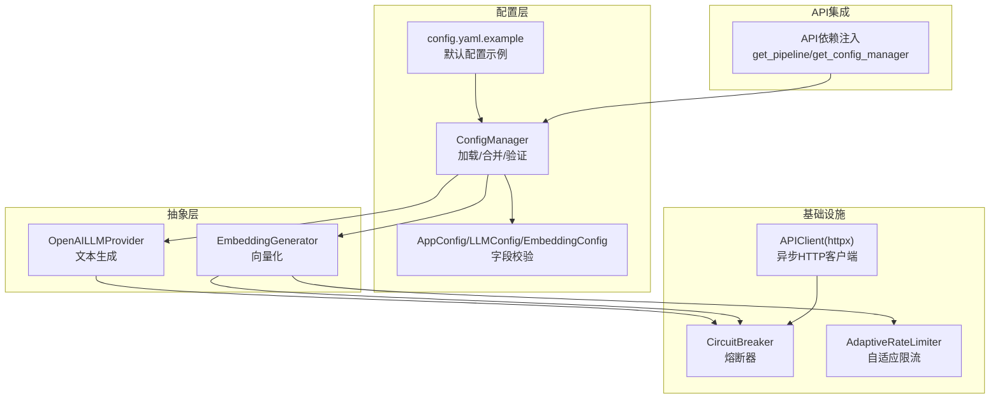
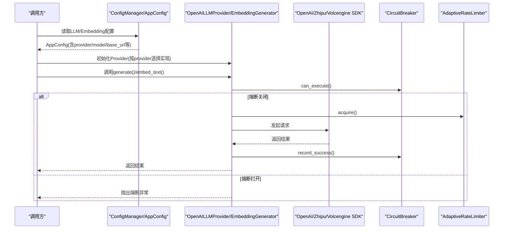
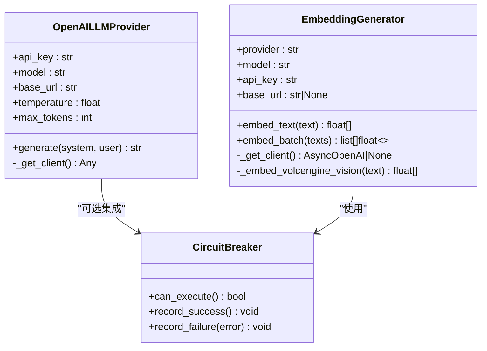
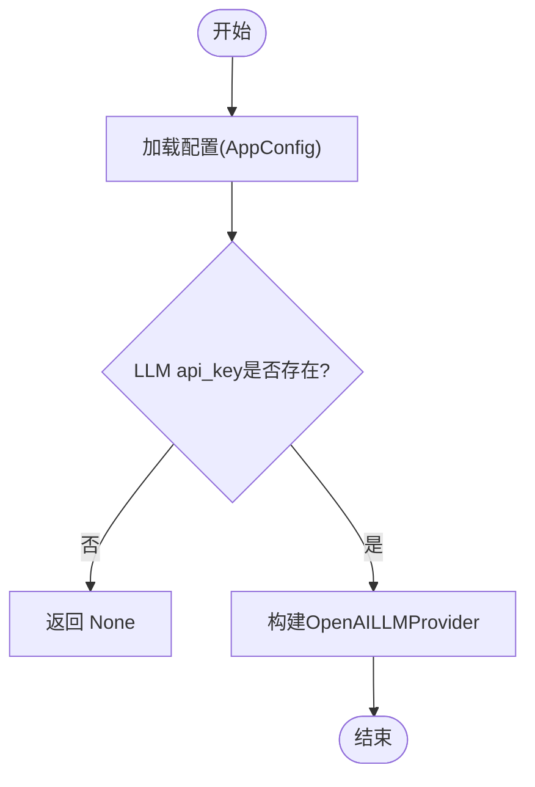
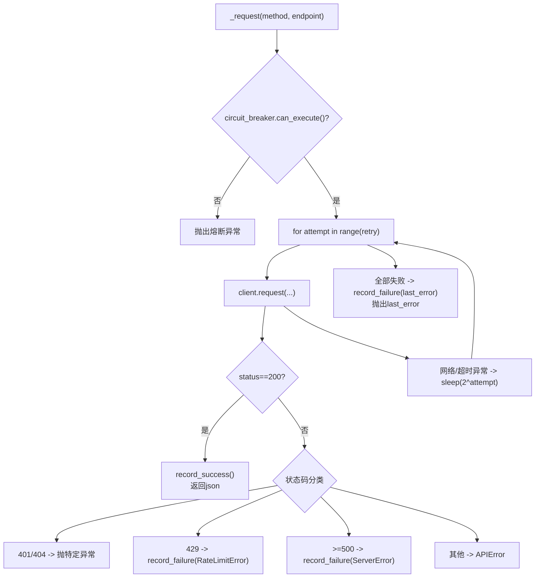
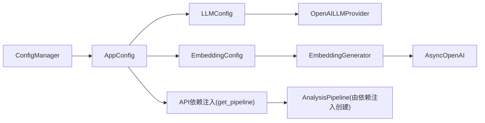

# 多提供商架构设计

<cite>
**本文引用的文件**   
- [src/analyzer/llm_provider.py](file://src/analyzer/llm_provider.py)
- [src/config/models.py](file://src/config/models.py)
- [src/config/manager.py](file://src/config/manager.py)
- [config/config.yaml.example](file://config/config.yaml.example)
- [src/embedding/generator.py](file://src/embedding/generator.py)
- [src/api/client.py](file://src/api/client.py)
- [src/utils/circuit_breaker.py](file://src/utils/circuit_breaker.py)
- [src/api/dependencies.py](file://src/api/dependencies.py)
- [tests/test_llm_provider.py](file://tests/test_llm_provider.py)
</cite>

## 目录
1. [简介](#简介)
2. [项目结构](#项目结构)
3. [核心组件](#核心组件)
4. [架构总览](#架构总览)
5. [详细组件分析](#详细组件分析)
6. [依赖关系分析](#依赖关系分析)
7. [性能与并发特性](#性能与并发特性)
8. [故障排查指南](#故障排查指南)
9. [结论](#结论)
10. [附录：扩展新提供商实现指南](#附录扩展新提供商实现指南)

## 简介
本技术文档围绕“LLM多提供商架构”展开，聚焦统一接口抽象层、Provider工厂模式、异步客户端管理（连接池与会话复用）、错误处理与熔断、提供商切换与负载均衡策略，并提供扩展新提供商的规范与实践建议。当前代码库已提供OpenAI文本生成与Embedding的统一封装，并预留了qwen、zhipu、volcengine等提供商的配置入口；同时实现了通用的配置加载与环境变量覆盖机制，以及可复用的熔断器与自适应限流器。

## 项目结构
与多提供商架构直接相关的模块分布如下：
- 配置层：集中定义各子系统配置模型与加载逻辑，支持YAML/JSON与环境变量覆盖
- 抽象层：对LLM文本生成与Embedding进行统一封装，屏蔽底层SDK差异
- 基础设施：通用熔断器、自适应速率限制器、HTTP异步客户端
- API集成：对外暴露API调用能力，包含重试、超时、鉴权与错误分类
- 依赖注入：在API服务中按需创建与释放流水线实例

图示来源
- [src/config/manager.py:1-268](file://src/config/manager.py#L1-L268)
- [src/config/models.py:1-144](file://src/config/models.py#L1-L144)
- [config/config.yaml.example:1-38](file://config/config.yaml.example#L1-L38)
- [src/analyzer/llm_provider.py:1-67](file://src/analyzer/llm_provider.py#L1-L67)
- [src/embedding/generator.py:1-427](file://src/embedding/generator.py#L1-L427)
- [src/api/client.py:1-340](file://src/api/client.py#L1-L340)
- [src/utils/circuit_breaker.py:1-306](file://src/utils/circuit_breaker.py#L1-L306)
- [src/api/dependencies.py:1-33](file://src/api/dependencies.py#L1-L33)

章节来源
- [src/config/manager.py:1-268](file://src/config/manager.py#L1-L268)
- [src/config/models.py:1-144](file://src/config/models.py#L1-L144)
- [config/config.yaml.example:1-38](file://config/config.yaml.example#L1-L38)
- [src/analyzer/llm_provider.py:1-67](file://src/analyzer/llm_provider.py#L1-L67)
- [src/embedding/generator.py:1-427](file://src/embedding/generator.py#L1-L427)
- [src/api/client.py:1-340](file://src/api/client.py#L1-L340)
- [src/utils/circuit_breaker.py:1-306](file://src/utils/circuit_breaker.py#L1-L306)
- [src/api/dependencies.py:1-33](file://src/api/dependencies.py#L1-L33)

## 核心组件
- 配置模型与加载器
  - AppConfig/LLMConfig/EmbeddingConfig：通过Pydantic进行强类型校验与约束，provider白名单控制可接入的提供商集合
  - ConfigManager：支持从YAML/JSON加载、深度合并、环境变量覆盖、懒解析AppConfig实例
- 文本生成抽象
  - OpenAILLMProvider：基于openai.AsyncOpenAI封装，提供统一的generate(system,user)接口
  - create_llm_provider：根据配置动态构造Provider实例（当前仅实现OpenAI）
- Embedding抽象
  - EmbeddingGenerator：统一封装OpenAI/Zhipu/Volcengine等Embedding能力，内置LRU缓存、自适应限流、信号量并发控制、熔断保护
- 外部HTTP客户端
  - APIClient：基于httpx.AsyncClient，封装重试、退避、鉴权头、状态码映射、熔断器集成
- 熔断器
  - CircuitBreaker/CircuitBreakerRegistry：三态机（CLOSED/OPEN/HALF_OPEN），支持统计、装饰器与上下文管理器

章节来源
- [src/config/models.py:1-144](file://src/config/models.py#L1-L144)
- [src/config/manager.py:1-268](file://src/config/manager.py#L1-L268)
- [src/analyzer/llm_provider.py:1-67](file://src/analyzer/llm_provider.py#L1-L67)
- [src/embedding/generator.py:1-427](file://src/embedding/generator.py#L1-L427)
- [src/api/client.py:1-340](file://src/api/client.py#L1-L340)
- [src/utils/circuit_breaker.py:1-306](file://src/utils/circuit_breaker.py#L1-L306)

## 架构总览
下图展示了从配置到具体提供商调用的端到端流程，包括熔断、限流与重试策略。

图示来源
- [src/config/manager.py:183-268](file://src/config/manager.py#L183-L268)
- [src/analyzer/llm_provider.py:22-52](file://src/analyzer/llm_provider.py#L22-L52)
- [src/embedding/generator.py:141-216](file://src/embedding/generator.py#L141-L216)
- [src/utils/circuit_breaker.py:146-186](file://src/utils/circuit_breaker.py#L146-L186)

## 详细组件分析

### 统一接口抽象层
- 目标
  - 为不同LLM提供商提供一致的调用接口，屏蔽SDK差异与认证细节
  - 为上层业务提供稳定的generate/system+user消息格式与参数语义
- 现状
  - 文本生成：OpenAILLMProvider基于openai.AsyncOpenAI，统一暴露generate(system,user)->str
  - Embedding：EmbeddingGenerator统一暴露embed_text/text批量接口，内部按provider分支初始化客户端
- 适配策略
  - 通过配置中的provider字段决定使用哪个实现或SDK base_url
  - 对于非OpenAI兼容的提供商，可在EmbeddingGenerator._get_client中新增分支，或在文本生成层新增Provider类

图示来源
- [src/analyzer/llm_provider.py:4-52](file://src/analyzer/llm_provider.py#L4-L52)
- [src/embedding/generator.py:91-216](file://src/embedding/generator.py#L91-L216)
- [src/utils/circuit_breaker.py:36-186](file://src/utils/circuit_breaker.py#L36-L186)

章节来源
- [src/analyzer/llm_provider.py:1-67](file://src/analyzer/llm_provider.py#L1-L67)
- [src/embedding/generator.py:1-427](file://src/embedding/generator.py#L1-L427)

### Provider工厂模式与动态实例化
- 配置驱动
  - LLMConfig.provider允许值包含openai/qwen/wenxin/zhipu/custom/volcengine
  - EmbeddingConfig.provider允许值包含openai/bge/m3e/codebert/zhipu/local/volcengine/custom
- 动态实例化
  - create_llm_provider(config): 若存在api_key则返回OpenAILLMProvider实例；否则返回None
  - EmbeddingGenerator.__init__: 根据provider选择SDK base_url与特殊处理（如zhipu固定base_url、volcengine视觉模型直连）
- 依赖注入
  - API层通过get_config_manager/get_pipeline获取配置与流水线实例，避免全局单例耦合

图示来源
- [src/analyzer/llm_provider.py:55-66](file://src/analyzer/llm_provider.py#L55-L66)
- [src/config/models.py:28-42](file://src/config/models.py#L28-L42)
- [src/embedding/generator.py:141-160](file://src/embedding/generator.py#L141-L160)
- [src/api/dependencies.py:9-33](file://src/api/dependencies.py#L9-L33)

章节来源
- [src/analyzer/llm_provider.py:55-66](file://src/analyzer/llm_provider.py#L55-L66)
- [src/config/models.py:28-42](file://src/config/models.py#L28-L42)
- [src/embedding/generator.py:141-160](file://src/embedding/generator.py#L141-L160)
- [src/api/dependencies.py:9-33](file://src/api/dependencies.py#L9-L33)

### 异步客户端管理与错误处理
- 连接与会话复用
  - APIClient使用httpx.AsyncClient，支持上下文管理器自动创建与关闭，ensure_client用于非上下文场景
  - EmbeddingGenerator维护AsyncOpenAI实例，按provider延迟初始化
- 重试与退避
  - APIClient._request内循环重试，指数退避sleep(2^attempt)
- 错误分类与熔断
  - 区分认证/未找到/限流/服务端错误，分别抛出对应异常
  - 成功/失败记录至CircuitBreaker，OPEN状态下拒绝执行
- 限流与并发
  - AdaptiveRateLimiter根据成功/失败动态调整QPS
  - asyncio.Semaphore控制最大并发度

图示来源
- [src/api/client.py:99-161](file://src/api/client.py#L99-L161)
- [src/utils/circuit_breaker.py:146-186](file://src/utils/circuit_breaker.py#L146-L186)
- [src/embedding/generator.py:178-216](file://src/embedding/generator.py#L178-L216)

章节来源
- [src/api/client.py:1-340](file://src/api/client.py#L1-L340)
- [src/utils/circuit_breaker.py:1-306](file://src/utils/circuit_breaker.py#L1-L306)
- [src/embedding/generator.py:1-427](file://src/embedding/generator.py#L1-L427)

### 提供商切换机制与负载均衡策略
- 提供商切换
  - 通过配置项llm.provider/embedding.provider指定，结合create_llm_provider与EmbeddingGenerator._get_client完成运行时切换
  - 环境变量覆盖：LLM_PROVIDER/EMBEDDING_PROVIDER等可直接覆盖配置文件
- 负载均衡
  - 当前未实现多实例轮询/权重分配；可通过扩展CircuitBreakerRegistry为每个后端实例注册独立熔断器，并在上层路由层按健康度选择实例
  - 建议方案：引入ProviderPool，维护多个同类型Provider实例，结合成功率/延迟指标做加权选择

章节来源
- [src/config/manager.py:191-243](file://src/config/manager.py#L191-L243)
- [src/analyzer/llm_provider.py:55-66](file://src/analyzer/llm_provider.py#L55-L66)
- [src/embedding/generator.py:141-160](file://src/embedding/generator.py#L141-L160)
- [src/utils/circuit_breaker.py:201-262](file://src/utils/circuit_breaker.py#L201-L262)

## 依赖关系分析
- 配置到实现的依赖链
  - ConfigManager.load -> AppConfig(**config_dict) -> LLMConfig/EmbeddingConfig
  - create_llm_provider -> OpenAILLMProvider
  - EmbeddingGenerator -> _get_client -> AsyncOpenAI(按provider分支)
- 运行时依赖
  - APIClient -> httpx.AsyncClient + CircuitBreaker
  - EmbeddingGenerator -> CircuitBreaker + AdaptiveRateLimiter + asyncio.Semaphore

图示来源
- [src/config/manager.py:183-268](file://src/config/manager.py#L183-L268)
- [src/config/models.py:135-144](file://src/config/models.py#L135-L144)
- [src/analyzer/llm_provider.py:55-66](file://src/analyzer/llm_provider.py#L55-L66)
- [src/embedding/generator.py:141-160](file://src/embedding/generator.py#L141-L160)
- [src/api/dependencies.py:14-33](file://src/api/dependencies.py#L14-L33)

章节来源
- [src/config/manager.py:183-268](file://src/config/manager.py#L183-L268)
- [src/config/models.py:135-144](file://src/config/models.py#L135-L144)
- [src/analyzer/llm_provider.py:55-66](file://src/analyzer/llm_provider.py#L55-L66)
- [src/embedding/generator.py:141-160](file://src/embedding/generator.py#L141-L160)
- [src/api/dependencies.py:14-33](file://src/api/dependencies.py#L14-L33)

## 性能与并发特性
- 连接复用
  - httpx.AsyncClient与AsyncOpenAI均支持连接复用，减少握手开销
- 并发控制
  - EmbeddingGenerator使用asyncio.Semaphore限制并发数，避免压垮下游
- 自适应限流
  - AdaptiveRateLimiter根据成功/失败动态调节QPS，降低限流与超时概率
- 缓存
  - LRUEmbeddingCache以文本哈希为键，TTL过期，命中时直接返回向量，显著降低重复计算成本

章节来源
- [src/embedding/generator.py:13-52](file://src/embedding/generator.py#L13-L52)
- [src/embedding/generator.py:54-89](file://src/embedding/generator.py#L54-L89)
- [src/embedding/generator.py:130-134](file://src/embedding/generator.py#L130-L134)
- [src/api/client.py:54-85](file://src/api/client.py#L54-L85)

## 故障排查指南
- 常见问题定位
  - 认证失败：检查LLM_API_KEY/EMBEDDING_API_KEY是否正确，确认base_url是否指向正确网关
  - 模型不存在：核对LLM_MODEL/EMBEDDING_MODEL是否在提供商侧可用
  - 服务超时：适当增大timeout或减小max_tokens；检查网络连通性
  - 熔断触发：查看CircuitBreaker统计信息，确认下游服务健康度
- 快速验证
  - 通过配置管理器读取配置后，尝试访问提供商models列表接口，确认鉴权与可达性

章节来源
- [src/config/manager.py:191-243](file://src/config/manager.py#L191-L243)
- [src/utils/circuit_breaker.py:188-198](file://src/utils/circuit_breaker.py#L188-L198)
- [src/api/client.py:122-161](file://src/api/client.py#L122-L161)

## 结论
该架构通过配置驱动的Provider选择与统一的抽象层，将OpenAI等SDK差异隐藏于内部，配合熔断、限流与重试机制提升了系统韧性。当前已具备可扩展基础，建议在以下方面持续完善：
- 补齐qwen等文本生成Provider实现，形成完整的工厂分发
- 引入ProviderPool与多实例负载均衡策略
- 增加更丰富的可观测性指标（延迟分位、成功率、熔断状态）

## 附录：扩展新提供商实现指南
- 接口规范
  - 文本生成：新增Provider类，实现统一的generate(system,user)->str接口，内部按提供商SDK组装请求
  - Embedding：在EmbeddingGenerator._get_client中新增provider分支，必要时实现专用方法（如视觉模型直连）
- 配置参数
  - 在LLMConfig/EmbeddingConfig的provider白名单中添加新提供商名称
  - 如需额外参数（如region、tenant_id），在对应Config模型中新增字段并添加校验
- 动态实例化
  - 在create_llm_provider中增加对新provider的分支，返回对应实例
  - 在EmbeddingGenerator中按provider初始化不同的base_url或SDK
- 错误处理与熔断
  - 为新提供商的错误码映射补充异常类型，确保熔断器能正确记录失败
- 测试用例
  - 参考现有测试结构与断言方式，编写单元测试覆盖初始化、调用路径与错误分支
  - 可使用mock替换真实SDK，验证熔断、限流与缓存行为

章节来源
- [src/config/models.py:28-58](file://src/config/models.py#L28-L58)
- [src/analyzer/llm_provider.py:55-66](file://src/analyzer/llm_provider.py#L55-L66)
- [src/embedding/generator.py:141-160](file://src/embedding/generator.py#L141-L160)
- [tests/test_llm_provider.py](file://tests/test_llm_provider.py)
