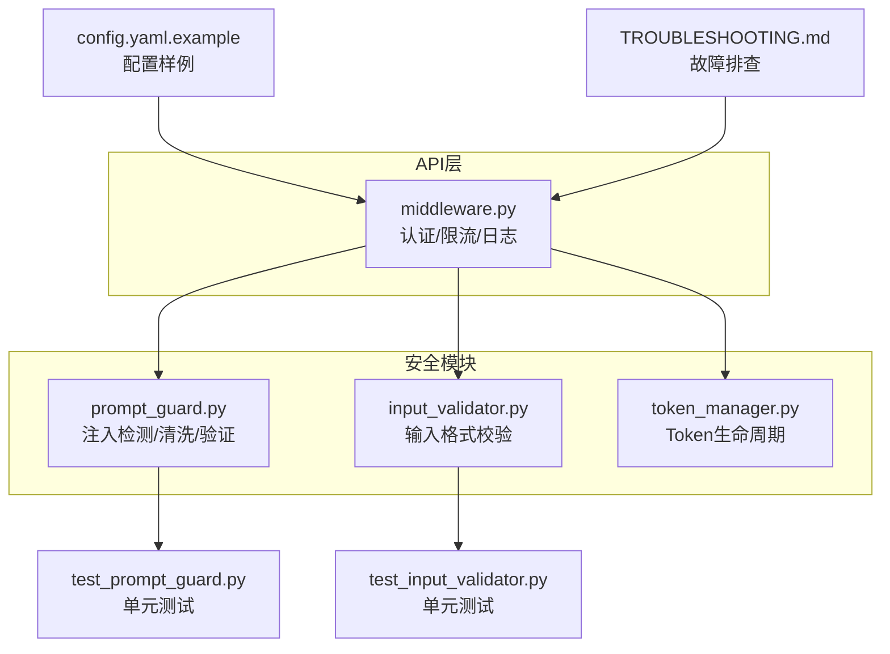
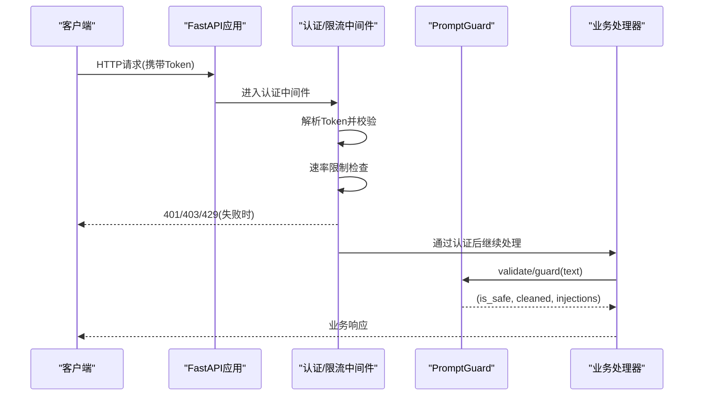
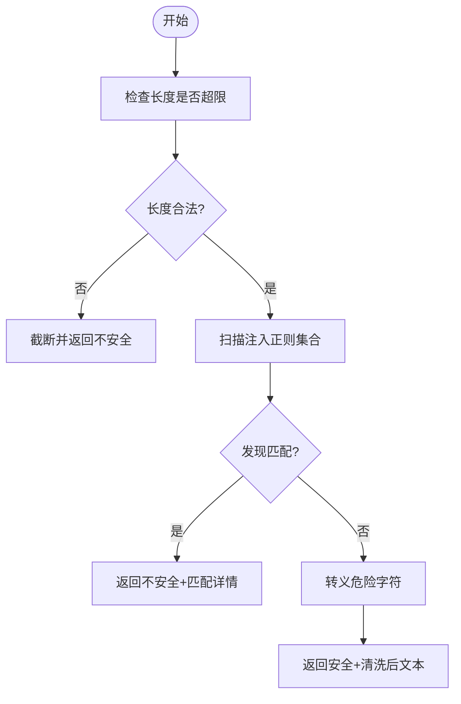
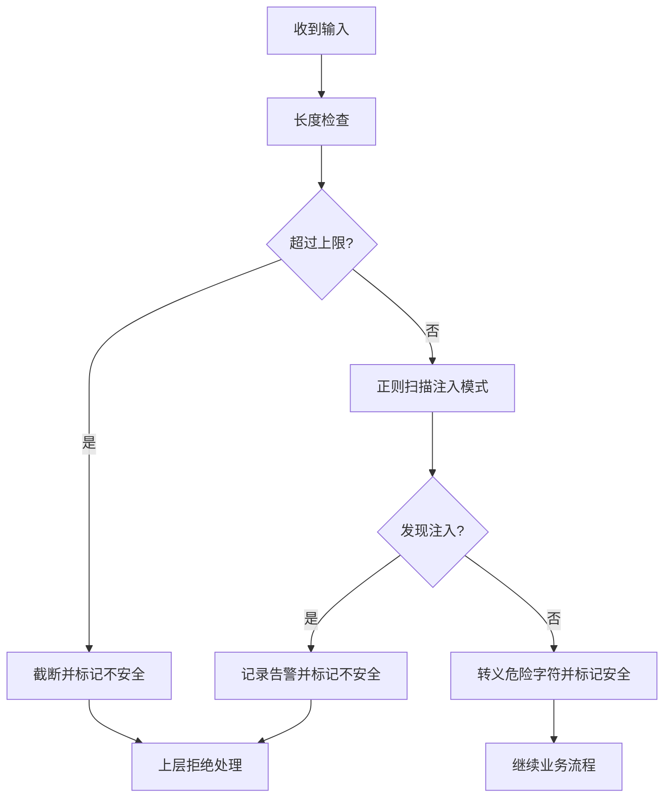
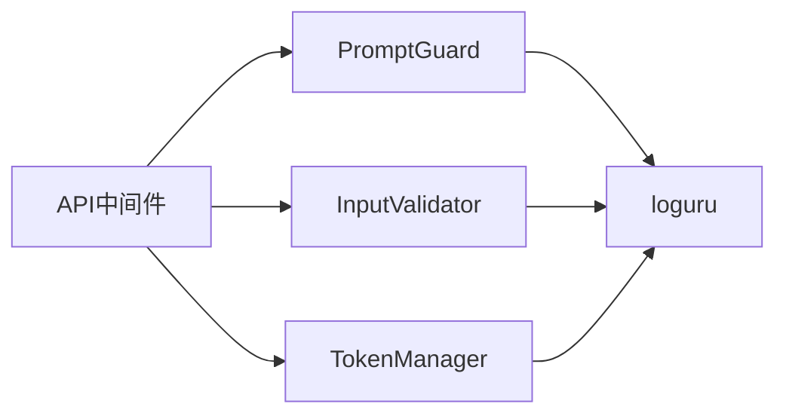

# Prompt注入防护

<cite>
**本文引用的文件**   
- [src/security/prompt_guard.py](file://src/security/prompt_guard.py)
- [src/security/input_validator.py](file://src/security/input_validator.py)
- [src/security/token_manager.py](file://src/security/token_manager.py)
- [src/api/middleware.py](file://src/api/middleware.py)
- [config/config.yaml.example](file://config/config.yaml.example)
- [tests/security/test_prompt_guard.py](file://tests/security/test_prompt_guard.py)
- [tests/security/test_input_validator.py](file://tests/security/test_input_validator.py)
- [docs/TROUBLESHOOTING.md](file://docs/TROUBLESHOOTING.md)
</cite>

## 目录
1. [简介](#简介)
2. [项目结构](#项目结构)
3. [核心组件](#核心组件)
4. [架构总览](#架构总览)
5. [详细组件分析](#详细组件分析)
6. [依赖关系分析](#依赖关系分析)
7. [性能与可扩展性](#性能与可扩展性)
8. [配置指南](#配置指南)
9. [威胁检测与应急响应流程](#威胁检测与应急响应流程)
10. [故障排查](#故障排查)
11. [结论](#结论)

## 简介
本技术文档围绕“Prompt注入防护”展开，聚焦于以下目标：
- 注入模式检测算法：正则表达式匹配、语义分析与上下文理解（当前实现以正则为主，提供扩展点）
- 恶意内容识别：指令覆盖检测、系统提示词攻击防护、角色伪装识别
- 白名单机制：可信内容库管理、动态更新策略与版本控制（设计建议）
- 沙箱隔离：执行环境隔离、资源限制与安全边界（设计建议）
- 注入攻击类型分类：直接注入、间接注入、复合攻击的识别方法
- 防护配置指南、威胁检测与应急响应流程

说明：仓库中已实现的Prompt注入防护主要基于正则表达式匹配与基础文本清洗；语义分析、上下文理解、白名单与沙箱等高级能力为设计建议与扩展方向。

## 项目结构
与Prompt注入防护相关的代码集中在安全模块与API中间件层：
- 安全模块
  - src/security/prompt_guard.py：PromptGuard类与便捷函数，负责注入模式检测、文本清洗与验证
  - src/security/input_validator.py：通用输入校验器（任务编号、Token格式）
  - src/security/token_manager.py：Token生命周期管理与过期/轮换告警
- API中间件
  - src/api/middleware.py：认证、速率限制与日志记录中间件
- 配置示例
  - config/config.yaml.example：应用配置样例（包含LLM、嵌入、缓存、规则等）
- 测试
  - tests/security/test_prompt_guard.py：PromptGuard功能测试
  - tests/security/test_input_validator.py：InputValidator参数化测试
- 故障排查
  - docs/TROUBLESHOOTING.md：常见问题与解决方案

图表来源
- [src/security/prompt_guard.py:1-198](file://src/security/prompt_guard.py#L1-L198)
- [src/security/input_validator.py:1-74](file://src/security/input_validator.py#L1-L74)
- [src/security/token_manager.py:1-115](file://src/security/token_manager.py#L1-L115)
- [src/api/middleware.py:1-173](file://src/api/middleware.py#L1-L173)
- [config/config.yaml.example:1-38](file://config/config.yaml.example#L1-L38)
- [tests/security/test_prompt_guard.py:1-147](file://tests/security/test_prompt_guard.py#L1-L147)
- [tests/security/test_input_validator.py:1-64](file://tests/security/test_input_validator.py#L1-L64)
- [docs/TROUBLESHOOTING.md:1-800](file://docs/TROUBLESHOOTING.md#L1-L800)

章节来源
- [src/security/prompt_guard.py:1-198](file://src/security/prompt_guard.py#L1-L198)
- [src/security/input_validator.py:1-74](file://src/security/input_validator.py#L1-L74)
- [src/security/token_manager.py:1-115](file://src/security/token_manager.py#L1-L115)
- [src/api/middleware.py:1-173](file://src/api/middleware.py#L1-L173)
- [config/config.yaml.example:1-38](file://config/config.yaml.example#L1-L38)
- [tests/security/test_prompt_guard.py:1-147](file://tests/security/test_prompt_guard.py#L1-L147)
- [tests/security/test_input_validator.py:1-64](file://tests/security/test_input_validator.py#L1-L64)
- [docs/TROUBLESHOOTING.md:1-800](file://docs/TROUBLESHOOTING.md#L1-L800)

## 核心组件
- PromptGuard
  - 职责：检测常见Prompt注入模式、转义潜在危险字符、长度限制、统一验证入口
  - 关键能力：
    - 注入模式检测：基于预定义的正则集合进行匹配
    - 文本清洗：对尖括号等进行HTML实体转义
    - 验证流程：长度检查→注入检测→返回安全状态与清洗结果
- InputValidator
  - 职责：对关键输入字段进行格式校验（如任务编号、Token）
  - 关键能力：长度范围、字符集、空值处理
- TokenManager
  - 职责：Token过期判断、轮换告警阈值、剩余天数计算
  - 关键能力：基于UTC时间的过期判定与告警窗口
- API中间件
  - 职责：请求级认证、速率限制、日志记录
  - 关键能力：从Header或Query获取Token、未命中时拒绝访问、添加限流响应头

章节来源
- [src/security/prompt_guard.py:12-142](file://src/security/prompt_guard.py#L12-L142)
- [src/security/input_validator.py:8-74](file://src/security/input_validator.py#L8-L74)
- [src/security/token_manager.py:8-115](file://src/security/token_manager.py#L8-L115)
- [src/api/middleware.py:13-173](file://src/api/middleware.py#L13-L173)

## 架构总览
下图展示了请求进入API服务后，经过认证与限流中间件，再调用Prompt注入防护的流程。

图表来源
- [src/api/middleware.py:81-141](file://src/api/middleware.py#L81-L141)
- [src/security/prompt_guard.py:100-142](file://src/security/prompt_guard.py#L100-L142)

## 详细组件分析

### 注入模式检测算法
- 正则表达式匹配
  - 覆盖典型注入模式：忽略先前指令、系统提示词覆盖、角色伪装、特殊模式（如DAN）、XML标签注入等
  - 匹配策略：遍历预编译的正则集合，收集所有匹配项并返回（模式与匹配片段）
- 语义分析与上下文理解（当前实现现状与建议）
  - 现状：以字符串级正则匹配为主，不依赖外部模型
  - 建议：在后续版本引入轻量语义特征（如意图分类、角色一致性检查）与上下文窗口（结合系统提示词与用户输入的相对位置），以提升对变体与混淆注入的识别率

图表来源
- [src/security/prompt_guard.py:100-142](file://src/security/prompt_guard.py#L100-L142)

章节来源
- [src/security/prompt_guard.py:19-80](file://src/security/prompt_guard.py#L19-L80)
- [src/security/prompt_guard.py:82-98](file://src/security/prompt_guard.py#L82-L98)
- [src/security/prompt_guard.py:100-142](file://src/security/prompt_guard.py#L100-L142)

### 恶意内容识别技术
- 指令覆盖检测
  - 通过匹配“忽略先前指令”、“无视系统提示词”等短语来识别试图覆盖系统指令的行为
- 系统提示词攻击防护
  - 检测“system prompt”、“override system prompt”等关键词，防止外部输入篡改系统提示词
- 角色伪装识别
  - 匹配“你现在是…”、“扮演…”、“假装是…”等句式，阻止角色越权或行为偏移
- XML标签注入
  - 检测并转义<system>、<prompt>、<user>等标签，避免结构化注入

章节来源
- [src/security/prompt_guard.py:20-49](file://src/security/prompt_guard.py#L20-L49)
- [src/security/prompt_guard.py:82-98](file://src/security/prompt_guard.py#L82-L98)

### 白名单机制（设计与建议）
- 可信内容库管理
  - 建议维护一个“可信模板/片段库”，允许来自受控渠道的内容绕过部分检测
- 动态更新策略
  - 支持热加载白名单条目，按版本标记变更，保留审计日志
- 版本控制
  - 白名单文件采用YAML/JSON存储，配合Git版本控制与发布流水线，确保可追溯与回滚

说明：该部分为架构扩展建议，当前仓库未实现具体代码。

### 沙箱隔离（设计与建议）
- 执行环境隔离
  - 对可能执行代码或生成脚本的输出进行隔离渲染，禁止直接执行
- 资源限制
  - 对输出长度、嵌套层级、外部调用进行限制
- 安全边界
  - 将不可信内容与系统提示词严格分离，使用只读视图展示

说明：该部分为架构扩展建议，当前仓库未实现具体代码。

### 注入攻击类型分类与识别方法
- 直接注入
  - 特征：用户输入中直接包含注入指令或标签
  - 识别：正则匹配即可捕获
- 间接注入
  - 特征：通过变量拼接、外部数据源注入到最终Prompt
  - 识别：建议在数据处理管道中加入来源可信度评估与二次校验
- 复合攻击
  - 特征：多阶段组合（如先角色伪装，再指令覆盖）
  - 识别：建议引入上下文窗口与序列模式检测

说明：当前实现以直接注入为主，间接与复合攻击需增强上下文与语义分析。

章节来源
- [src/security/prompt_guard.py:20-49](file://src/security/prompt_guard.py#L20-L49)

### 防护配置指南
- 最大长度限制
  - PromptGuard默认最大长度为8192，可通过构造参数调整
- 文本清洗策略
  - 默认对尖括号进行HTML实体转义，避免标签注入
- API中间件配置
  - 认证：支持从Header或Query参数传递Token
  - 速率限制：默认每分钟60次，可在实例化时调整
  - 日志：记录请求与响应耗时，便于审计与排障

章节来源
- [src/security/prompt_guard.py:51-61](file://src/security/prompt_guard.py#L51-L61)
- [src/security/prompt_guard.py:82-98](file://src/security/prompt_guard.py#L82-L98)
- [src/api/middleware.py:13-46](file://src/api/middleware.py#L13-L46)
- [src/api/middleware.py:81-141](file://src/api/middleware.py#L81-L141)

### 威胁检测与应急响应流程
- 威胁检测
  - 当检测到注入模式时，记录警告日志并返回不安全状态
  - 当长度超限时，截断并返回不安全状态
- 响应策略
  - 阻断：guard()在不安全时返回空字符串，上层应拒绝处理
  - 告警：记录注入模式详情，便于后续分析
  - 降级：必要时启用更严格的清洗策略或人工复核

图表来源
- [src/security/prompt_guard.py:100-142](file://src/security/prompt_guard.py#L100-L142)

## 依赖关系分析
- 组件内聚与耦合
  - PromptGuard独立性强，仅依赖标准库re与日志工具
  - InputValidator与TokenManager均为无状态工具类，低耦合
  - API中间件与PromptGuard解耦，通过调用方集成
- 外部依赖
  - FastAPI用于HTTP中间件
  - loguru用于日志记录
- 循环依赖
  - 未发现循环导入

图表来源
- [src/api/middleware.py:1-173](file://src/api/middleware.py#L1-L173)
- [src/security/prompt_guard.py:1-198](file://src/security/prompt_guard.py#L1-L198)
- [src/security/input_validator.py:1-74](file://src/security/input_validator.py#L1-L74)
- [src/security/token_manager.py:1-115](file://src/security/token_manager.py#L1-L115)

章节来源
- [src/api/middleware.py:1-173](file://src/api/middleware.py#L1-L173)
- [src/security/prompt_guard.py:1-198](file://src/security/prompt_guard.py#L1-L198)
- [src/security/input_validator.py:1-74](file://src/security/input_validator.py#L1-L74)
- [src/security/token_manager.py:1-115](file://src/security/token_manager.py#L1-L115)

## 性能与可扩展性
- 性能特性
  - 正则匹配时间复杂度与模式数量及输入长度线性相关
  - 文本清洗为O(n)，开销较小
- 优化建议
  - 对高频模式进行分组与短路匹配
  - 考虑异步批量校验以降低延迟
  - 引入缓存机制（如对相似输入指纹去重）
- 可扩展性
  - 新增注入模式只需在正则集合中添加条目
  - 未来可接入语义模型作为第二道防线

[本节为通用指导，无需源码引用]

## 配置指南
- 应用配置样例
  - LLM提供商、模型、温度、最大令牌数
  - 嵌入提供商与模型
  - 聚类算法与参数
  - 缓存开关、TTL与存储后端
  - 规则引擎内置与自定义路径
  - 输出格式与目录
  - 日志级别
- 安全相关配置建议
  - 在环境变量或配置文件中设置API_TOKEN、速率限制阈值
  - 根据业务需求调整PromptGuard的最大长度与清洗策略

章节来源
- [config/config.yaml.example:1-38](file://config/config.yaml.example#L1-L38)

## 威胁检测与应急响应流程
- 检测要点
  - 长度超限：立即截断并拒绝
  - 注入模式：记录匹配详情并拒绝
  - 认证失败：返回401/403
  - 速率限制：返回429并附带重试间隔
- 应急步骤
  - 快速阻断：guard()返回空字符串，上层逻辑停止处理
  - 告警上报：记录注入模式与来源信息
  - 复盘分析：结合日志与测试用例定位问题
  - 策略升级：补充正则或引入语义检测

章节来源
- [src/security/prompt_guard.py:100-142](file://src/security/prompt_guard.py#L100-L142)
- [src/api/middleware.py:81-141](file://src/api/middleware.py#L81-L141)

## 故障排查
- API认证失败
  - 症状：401 Unauthorized
  - 原因：缺少或无效Token
  - 解决：检查Header或Query中的Token，确认有效且未过期
- API速率限制
  - 症状：429 Too Many Requests
  - 原因：请求频率超过限制
  - 解决：增加速率限制阈值或在客户端实现退避重试
- LLM服务问题
  - 症状：超时或认证失败
  - 原因：网络问题或Key无效
  - 解决：检查网络连通性与Key有效性，调整超时与重试
- 内存与性能问题
  - 症状：OutOfMemory或启动慢
  - 原因：批处理过大或模型加载慢
  - 解决：减小批大小、使用轻量模型、启用缓存

章节来源
- [docs/TROUBLESHOOTING.md:142-203](file://docs/TROUBLESHOOTING.md#L142-L203)
- [docs/TROUBLESHOOTING.md:233-310](file://docs/TROUBLESHOOTING.md#L233-L310)
- [docs/TROUBLESHOOTING.md:409-488](file://docs/TROUBLESHOOTING.md#L409-L488)

## 结论
当前Prompt注入防护以正则匹配为核心，覆盖了常见的指令覆盖、系统提示词攻击与角色伪装等场景，并通过API中间件实现了认证与速率限制。为进一步提升安全性，建议引入语义分析与上下文理解、完善白名单与沙箱机制，并建立完善的威胁检测与应急响应流程。

[本节为总结，无需源码引用]
