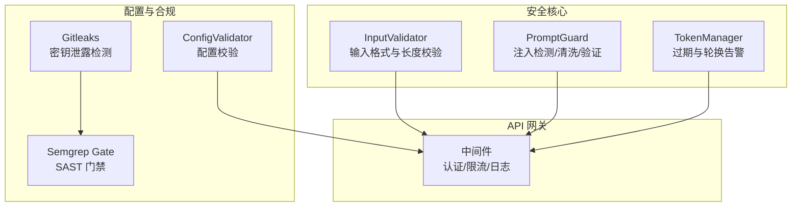
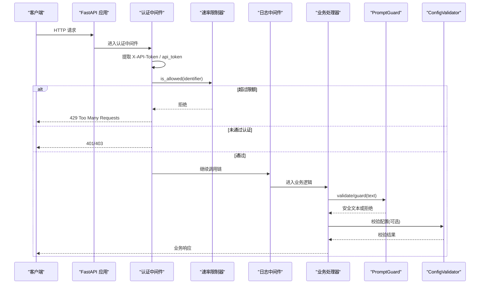
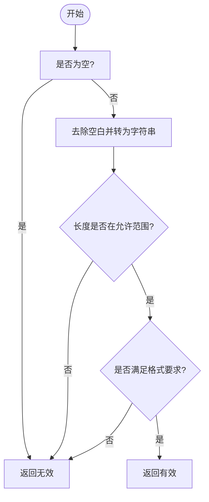
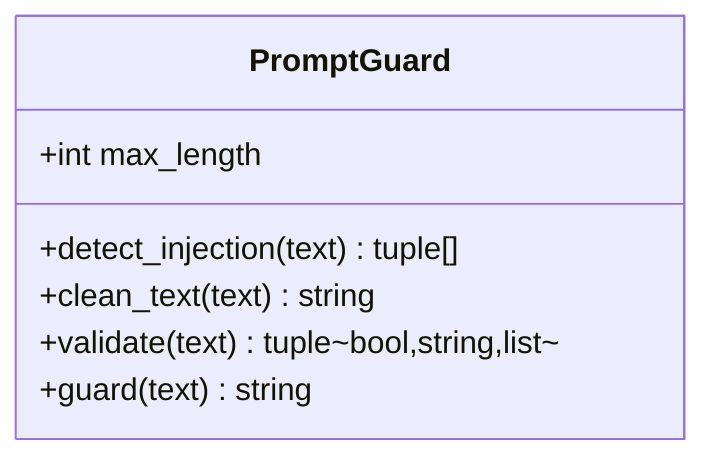
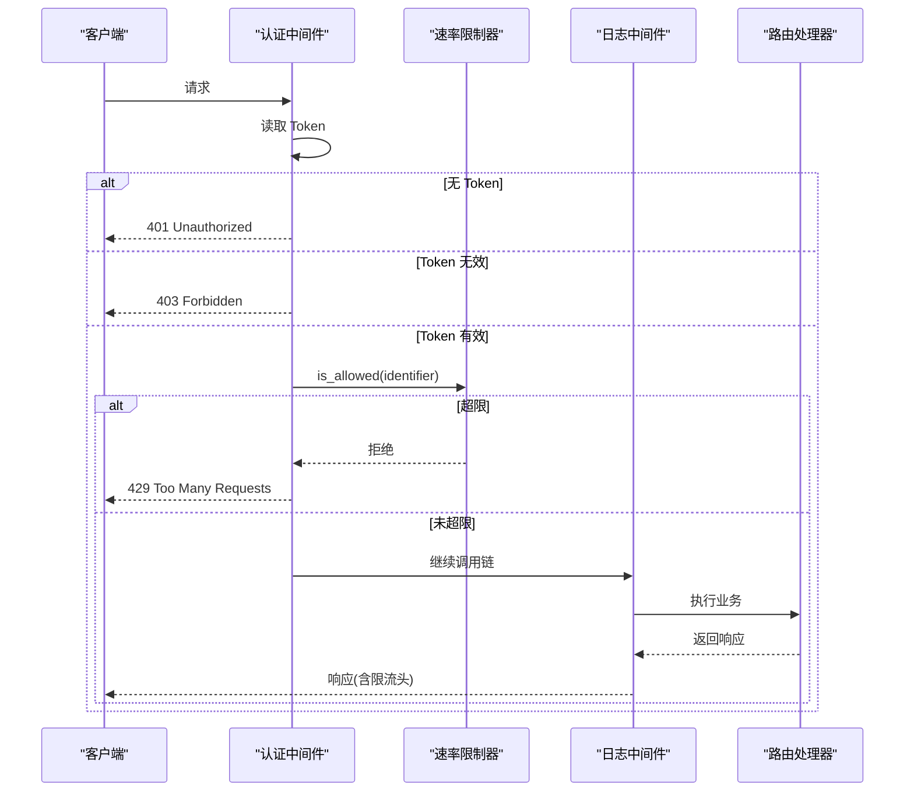
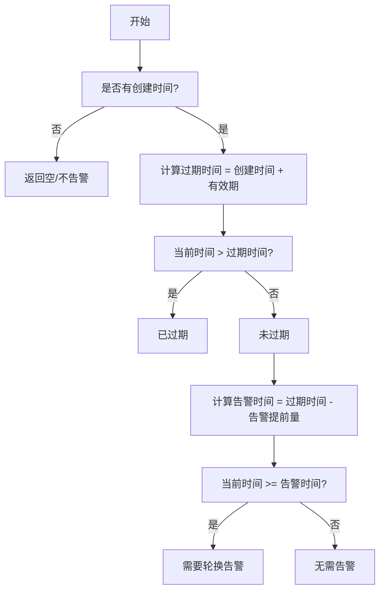
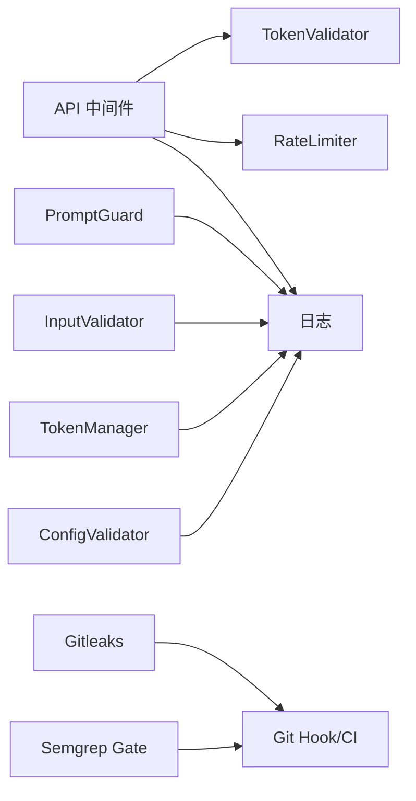

# 安全防护机制

<cite>
**本文引用的文件列表**
- [src/security/__init__.py](file://src/security/__init__.py)
- [src/security/input_validator.py](file://src/security/input_validator.py)
- [src/security/prompt_guard.py](file://src/security/prompt_guard.py)
- [src/security/token_manager.py](file://src/security/token_manager.py)
- [src/api/middleware.py](file://src/api/middleware.py)
- [src/config/validator.py](file://src/config/validator.py)
- [config/config.yaml.example](file://config/config.yaml.example)
- [.gitleaks.toml](file://.gitleaks.toml)
- [tests/security/test_input_validator.py](file://tests/security/test_input_validator.py)
- [tests/security/test_prompt_guard.py](file://tests/security/test_prompt_guard.py)
- [tests/security/test_token_manager.py](file://tests/security/test_token_manager.py)
- [githooks/gate-9.sh](file://githooks/gate-9.sh)
</cite>

## 目录
1. [简介](#简介)
2. [项目结构](#项目结构)
3. [核心组件](#核心组件)
4. [架构总览](#架构总览)
5. [详细组件分析](#详细组件分析)
6. [依赖关系分析](#依赖关系分析)
7. [性能考量](#性能考量)
8. [故障排查指南](#故障排查指南)
9. [结论](#结论)
10. [附录](#附录)

## 简介
本技术文档聚焦于 LLM 安全防护机制，围绕输入验证框架、Prompt 注入防护、访问控制与审计日志、安全配置与策略、以及安全测试与漏洞修复建议展开。文档基于仓库中现有实现进行梳理，旨在为开发者与运维人员提供可操作的安全能力说明与最佳实践。

## 项目结构
与安全相关的代码主要分布在以下模块：
- 安全基础能力：输入校验、Token 管理、Prompt 注入防护
- API 层中间件：认证鉴权、速率限制、请求日志
- 配置校验：对关键配置项进行完整性与合法性检查
- 安全扫描与基线：Gitleaks 密钥检测、Semgrep SAST 门禁
- 测试用例：覆盖输入校验、Prompt 防护、Token 生命周期等

图表来源
- [src/security/input_validator.py:1-74](file://src/security/input_validator.py#L1-L74)
- [src/security/prompt_guard.py:1-198](file://src/security/prompt_guard.py#L1-L198)
- [src/security/token_manager.py:1-115](file://src/security/token_manager.py#L1-L115)
- [src/api/middleware.py:1-173](file://src/api/middleware.py#L1-L173)
- [src/config/validator.py:1-196](file://src/config/validator.py#L1-L196)
- [.gitleaks.toml:1-44](file://.gitleaks.toml#L1-L44)
- [githooks/gate-9.sh:31-130](file://githooks/gate-9.sh#L31-L130)

章节来源
- [src/security/__init__.py:1-27](file://src/security/__init__.py#L1-L27)
- [src/security/input_validator.py:1-74](file://src/security/input_validator.py#L1-L74)
- [src/security/prompt_guard.py:1-198](file://src/security/prompt_guard.py#L1-L198)
- [src/security/token_manager.py:1-115](file://src/security/token_manager.py#L1-L115)
- [src/api/middleware.py:1-173](file://src/api/middleware.py#L1-L173)
- [src/config/validator.py:1-196](file://src/config/validator.py#L1-L196)
- [config/config.yaml.example:1-38](file://config/config.yaml.example#L1-L38)
- [.gitleaks.toml:1-44](file://.gitleaks.toml#L1-L44)
- [githooks/gate-9.sh:31-130](file://githooks/gate-9.sh#L31-L130)

## 核心组件
- 输入验证框架（InputValidator）
  - 任务编号校验：仅允许数字，长度在指定范围内，支持空值与空白字符处理
  - Token 格式校验：非空字符串，长度范围约束
- Prompt 注入防护（PromptGuard）
  - 注入模式检测：覆盖忽略指令、系统提示词覆盖、角色切换、特殊模式、XML 标签等
  - 文本清洗：转义 XML 标签，降低解析风险
  - 统一验证与防护：长度限制、注入检测、返回安全结果或拒绝
- 访问控制与审计（API 中间件）
  - 身份认证：从 Header 或 Query 参数提取 Token，白名单比对
  - 速率限制：按标识符统计每分钟请求数，超限返回 429
  - 审计日志：记录请求与响应耗时、异常堆栈
- 令牌生命周期（TokenManager）
  - 过期判定、轮换告警阈值、剩余天数计算
- 配置校验（ConfigValidator）
  - 对 API、LLM、Embedding、缓存等配置段进行必填、取值范围与协议前缀校验

章节来源
- [src/security/input_validator.py:1-74](file://src/security/input_validator.py#L1-L74)
- [src/security/prompt_guard.py:1-198](file://src/security/prompt_guard.py#L1-L198)
- [src/api/middleware.py:1-173](file://src/api/middleware.py#L1-L173)
- [src/security/token_manager.py:1-115](file://src/security/token_manager.py#L1-L115)
- [src/config/validator.py:1-196](file://src/config/validator.py#L1-L196)

## 架构总览
下图展示了请求进入 API 后，经过认证、限流、日志记录，再进入业务逻辑前的安全拦截路径；同时展示输入侧的 Prompt 注入防护与输出侧的配置校验联动。

图表来源
- [src/api/middleware.py:62-141](file://src/api/middleware.py#L62-L141)
- [src/security/prompt_guard.py:100-141](file://src/security/prompt_guard.py#L100-L141)
- [src/config/validator.py:19-51](file://src/config/validator.py#L19-L51)

## 详细组件分析

### 输入验证框架（InputValidator）
- 职责
  - 对关键输入字段进行格式与长度校验，防止非法数据进入下游
- 关键规则
  - 任务编号：纯数字，长度区间内，自动去空白
  - Token：非空字符串，长度区间内
- 复杂度
  - 时间复杂度 O(n)，n 为输入长度；空间复杂度 O(1)
- 错误处理
  - 使用调试日志记录失败原因，便于定位问题
- 扩展点
  - 可按需增加更多字段的正则与范围校验

图表来源
- [src/security/input_validator.py:12-45](file://src/security/input_validator.py#L12-L45)
- [src/security/input_validator.py:48-73](file://src/security/input_validator.py#L48-L73)

章节来源
- [src/security/input_validator.py:1-74](file://src/security/input_validator.py#L1-L74)
- [tests/security/test_input_validator.py:1-64](file://tests/security/test_input_validator.py#L1-L64)

### Prompt 注入防护（PromptGuard）
- 职责
  - 检测并阻止常见 Prompt 注入模式，提供文本清洗与统一验证入口
- 检测类别
  - 忽略指令类、系统提示词覆盖类、角色切换类、特殊模式类、XML 标签类
- 清洗策略
  - 转义尖括号，避免被当作结构化标记解析
- 验证流程
  - 长度限制 -> 注入检测 -> 返回安全结果或拒绝
- 复杂度
  - 正则匹配总体 O(k·n)，k 为模式数量，n 为文本长度
- 可扩展性
  - 可在 INJECTION_PATTERNS 中追加新规则，或在 clean_text 中增强清洗策略

图表来源
- [src/security/prompt_guard.py:12-141](file://src/security/prompt_guard.py#L12-L141)

章节来源
- [src/security/prompt_guard.py:1-198](file://src/security/prompt_guard.py#L1-L198)
- [tests/security/test_prompt_guard.py:1-147](file://tests/security/test_prompt_guard.py#L1-L147)

### 访问控制与审计（API 中间件）
- 身份认证
  - 从请求头 X-API-Token 或查询参数 api_token 获取 Token
  - 若未配置有效 Token 集合，则放行（开发模式）
  - 未携带或无效时分别返回 401/403
- 速率限制
  - 基于内存的时间窗口计数，默认每分钟 60 次
  - 超限返回 429，并在响应头中返回限制信息
- 审计日志
  - 记录请求方法、路径、来源 IP、响应状态码与耗时
  - 捕获异常并记录错误上下文

图表来源
- [src/api/middleware.py:62-141](file://src/api/middleware.py#L62-L141)
- [src/api/middleware.py:143-173](file://src/api/middleware.py#L143-L173)

章节来源
- [src/api/middleware.py:1-173](file://src/api/middleware.py#L1-L173)

### 令牌生命周期（TokenManager）
- 功能
  - 判断 Token 是否过期
  - 判断是否需要轮换告警
  - 计算剩余有效期天数
- 适用场景
  - 结合外部存储或配置中心，周期性巡检并触发告警

图表来源
- [src/security/token_manager.py:35-87](file://src/security/token_manager.py#L35-L87)
- [src/security/token_manager.py:89-106](file://src/security/token_manager.py#L89-L106)

章节来源
- [src/security/token_manager.py:1-115](file://src/security/token_manager.py#L1-L115)
- [tests/security/test_token_manager.py:1-31](file://tests/security/test_token_manager.py#L1-L31)

### 配置校验（ConfigValidator）
- 校验范围
  - API：base_url 协议、超时、重试次数、路径前缀
  - LLM：提供商白名单、模型、API Key、温度、最大 Token、base_url 协议
  - Embedding：提供商白名单、模型、API Key、批大小、base_url 协议
  - Cache：存储类型、TTL、数据库路径
- 作用
  - 在启动或热加载配置时快速发现错误，避免运行时异常

章节来源
- [src/config/validator.py:1-196](file://src/config/validator.py#L1-L196)
- [config/config.yaml.example:1-38](file://config/config.yaml.example#L1-L38)

## 依赖关系分析
- 模块耦合
  - API 中间件依赖 Token 白名单与速率限制器，独立于具体业务
  - PromptGuard 与 InputValidator 作为通用工具，被上层调用
  - ConfigValidator 用于配置阶段校验，不影响运行期主路径
- 外部依赖
  - 日志：loguru
  - Web 框架：fastapi
  - 安全扫描：semgrep、gitleaks（CI/Git Hook）

图表来源
- [src/api/middleware.py:1-173](file://src/api/middleware.py#L1-L173)
- [src/security/prompt_guard.py:1-198](file://src/security/prompt_guard.py#L1-L198)
- [src/security/input_validator.py:1-74](file://src/security/input_validator.py#L1-L74)
- [src/security/token_manager.py:1-115](file://src/security/token_manager.py#L1-L115)
- [src/config/validator.py:1-196](file://src/config/validator.py#L1-L196)
- [.gitleaks.toml:1-44](file://.gitleaks.toml#L1-L44)
- [githooks/gate-9.sh:31-130](file://githooks/gate-9.sh#L31-L130)

章节来源
- [src/api/middleware.py:1-173](file://src/api/middleware.py#L1-L173)
- [src/security/prompt_guard.py:1-198](file://src/security/prompt_guard.py#L1-L198)
- [src/security/input_validator.py:1-74](file://src/security/input_validator.py#L1-L74)
- [src/security/token_manager.py:1-115](file://src/security/token_manager.py#L1-L115)
- [src/config/validator.py:1-196](file://src/config/validator.py#L1-L196)
- [.gitleaks.toml:1-44](file://.gitleaks.toml#L1-L44)
- [githooks/gate-9.sh:31-130](file://githooks/gate-9.sh#L31-L130)

## 性能考量
- 输入校验与 Prompt 防护
  - 正则匹配开销与模式数量线性相关，建议按需裁剪高频模式
  - 文本清洗仅做简单替换，开销较低
- 中间件
  - 速率限制器使用内存字典，适合单机部署；多实例需考虑共享存储
  - 日志记录应控制级别与采样率，避免高吞吐下 IO 瓶颈
- 配置校验
  - 建议在启动阶段执行，避免每次请求重复校验

[本节为通用指导，不涉及具体文件分析]

## 故障排查指南
- 常见问题
  - 401/403：检查请求是否携带正确的 Token，确认服务端是否配置了有效 Token 集合
  - 429：检查速率限制阈值与客户端频率，关注响应头中的限制信息
  - Prompt 被拒绝：检查是否命中注入模式，必要时调整 PromptGuard 规则或放宽清洗策略
  - 配置错误：根据 ConfigValidator 的错误列表修正 base_url、provider、model、TTL 等
- 定位手段
  - 查看中间件与 PromptGuard 的日志输出，关注警告与错误消息
  - 使用单元测试复现问题，参考 tests/security 下的用例

章节来源
- [src/api/middleware.py:82-141](file://src/api/middleware.py#L82-L141)
- [src/security/prompt_guard.py:100-141](file://src/security/prompt_guard.py#L100-L141)
- [src/config/validator.py:19-51](file://src/config/validator.py#L19-L51)
- [tests/security/test_prompt_guard.py:76-113](file://tests/security/test_prompt_guard.py#L76-L113)

## 结论
本项目在输入验证、Prompt 注入防护、访问控制与审计方面提供了完整的基础能力，并通过配置校验与安全扫描形成闭环。建议在生产环境启用严格的 Token 白名单与速率限制，持续扩充注入模式库，并将配置校验纳入启动流程，确保系统稳定与安全。

[本节为总结，不涉及具体文件分析]

## 附录

### 安全配置指南
- 安全策略定制
  - 在 PromptGuard 中新增注入模式，或在 clean_text 中增强清洗策略
  - 在 API 中间件中配置有效的 Token 集合，关闭开发模式的“放行所有”
  - 调整速率限制阈值以匹配业务峰值
- 威胁检测
  - 启用 Semgrep SAST 门禁，阻断高危漏洞合并
  - 使用 Gitleaks 扫描密钥泄露，完善 allowlist 减少误报
- 应急响应
  - 针对频繁 401/403/429 告警，建立监控与自动化封禁策略
  - 对 Prompt 注入事件进行样本收集与规则迭代

章节来源
- [src/security/prompt_guard.py:12-141](file://src/security/prompt_guard.py#L12-L141)
- [src/api/middleware.py:62-141](file://src/api/middleware.py#L62-L141)
- [.gitleaks.toml:1-44](file://.gitleaks.toml#L1-L44)
- [githooks/gate-9.sh:31-130](file://githooks/gate-9.sh#L31-L130)

### 安全测试方法与漏洞修复建议
- 测试方法
  - 输入校验：覆盖边界长度、非法字符、空值等用例
  - Prompt 注入：构造典型注入语句，验证检测与清洗效果
  - 访问控制：模拟缺失 Token、无效 Token、超频请求等场景
  - 令牌生命周期：构造不同创建时间的 Token，验证过期与告警
- 修复建议
  - 对命中注入模式的输入，优先拒绝并记录样本，定期更新规则
  - 对 429 告警，评估是否提升限流阈值或引入队列削峰
  - 对配置错误，采用最小权限原则与模板化配置，减少人为失误

章节来源
- [tests/security/test_input_validator.py:1-64](file://tests/security/test_input_validator.py#L1-L64)
- [tests/security/test_prompt_guard.py:1-147](file://tests/security/test_prompt_guard.py#L1-L147)
- [tests/security/test_token_manager.py:1-31](file://tests/security/test_token_manager.py#L1-L31)
