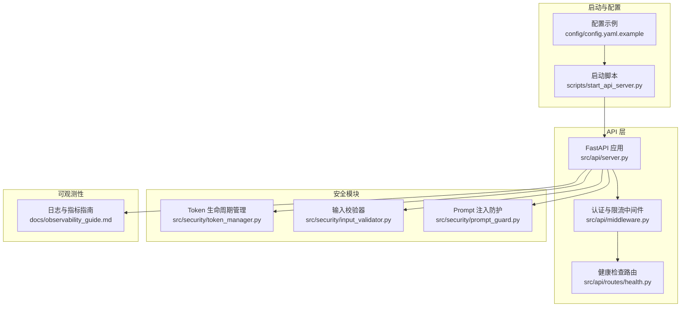
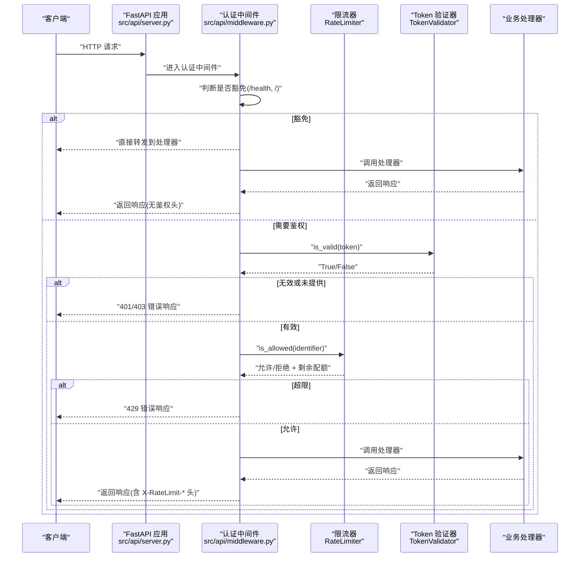
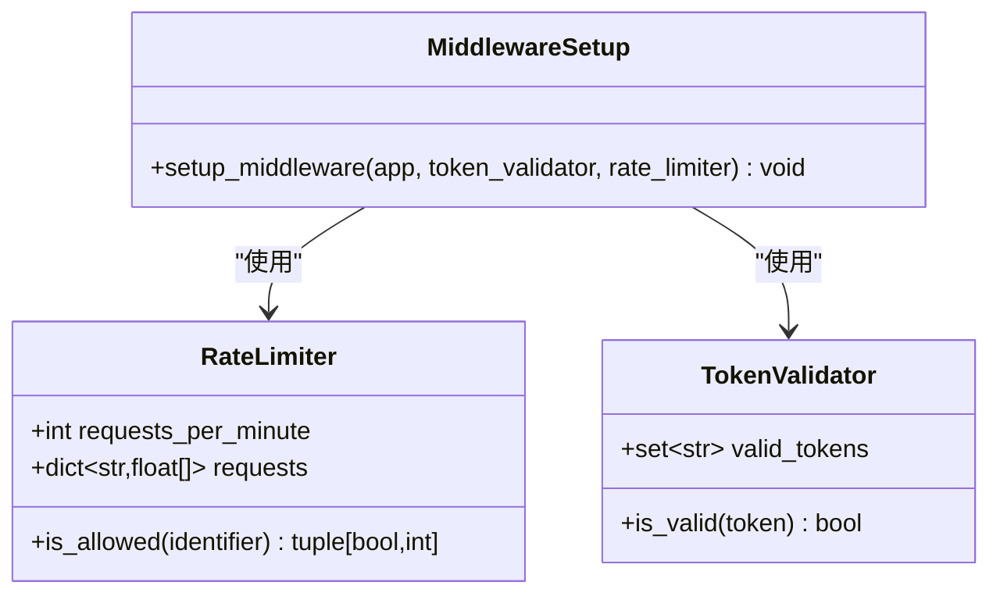
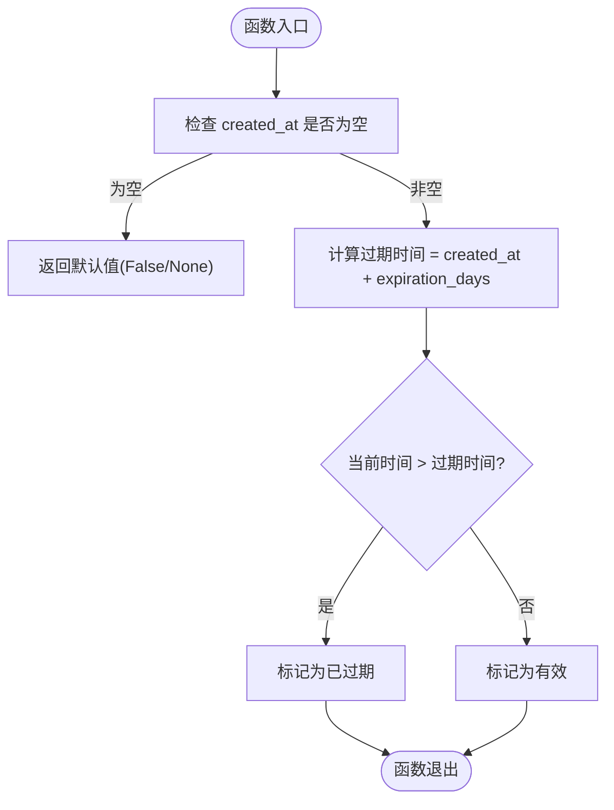
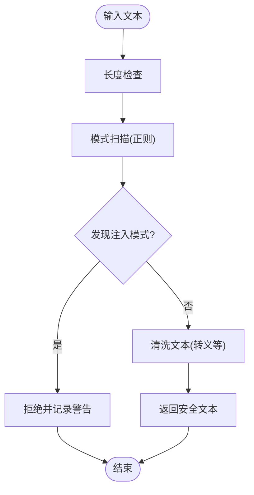
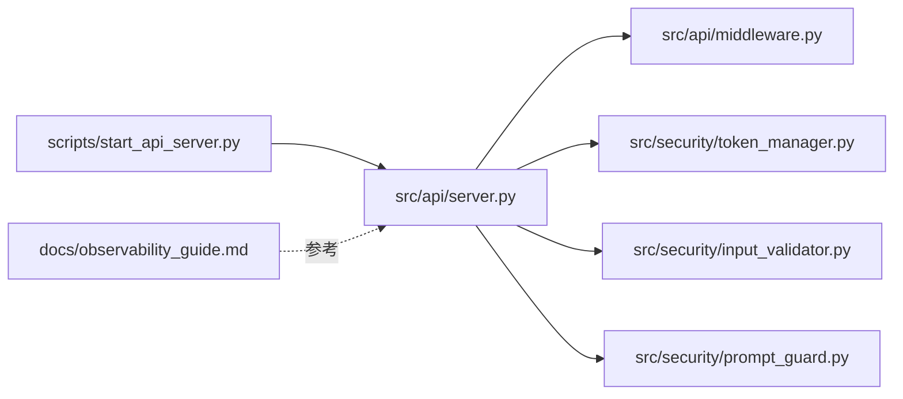

# 访问控制与认证

<cite>
**本文引用的文件**   
- [src/api/middleware.py](file://src/api/middleware.py)
- [src/api/server.py](file://src/api/server.py)
- [scripts/start_api_server.py](file://scripts/start_api_server.py)
- [src/security/token_manager.py](file://src/security/token_manager.py)
- [src/security/input_validator.py](file://src/security/input_validator.py)
- [src/security/prompt_guard.py](file://src/security/prompt_guard.py)
- [tests/api/test_middleware.py](file://tests/api/test_middleware.py)
- [tests/security/test_token_manager.py](file://tests/security/test_token_manager.py)
- [config/config.yaml.example](file://config/config.yaml.example)
- [docs/observability_guide.md](file://docs/observability_guide.md)
</cite>

## 目录
1. [简介](#简介)
2. [项目结构](#项目结构)
3. [核心组件](#核心组件)
4. [架构总览](#架构总览)
5. [详细组件分析](#详细组件分析)
6. [依赖关系分析](#依赖关系分析)
7. [性能与安全考量](#性能与安全考量)
8. [故障排查指南](#故障排查指南)
9. [结论](#结论)
10. [附录](#附录)

## 简介
本技术文档聚焦于访问控制与认证系统，覆盖以下主题：
- 身份认证机制：API Token 校验、请求来源识别、速率限制与健康检查豁免
- 会话管理：当前实现为无状态 Token 校验；提供扩展建议（如 JWT）
- 多因素认证支持：给出集成方案与最佳实践
- 权限管理系统：基于角色的访问控制（RBAC）、细粒度权限与动态评估的扩展设计
- 令牌管理机制：Token 生命周期、过期检测、轮换告警与存储策略
- 审计日志系统：结构化日志、指标采集与安全事件监控
- 安全策略配置：密码策略、会话超时、IP 白名单等
- API 安全集成示例与最佳实践

说明：当前仓库实现了轻量级 API Token 认证与速率限制中间件，以及输入验证与 Prompt 注入防护。JWT、RBAC、MFA 等为扩展建议，便于在现有基础上演进。

## 项目结构
与访问控制和认证相关的代码主要分布在以下位置：
- API 层：认证与限流中间件、应用创建与路由注册
- 安全模块：Token 生命周期管理、输入校验、Prompt 注入防护
- 启动脚本：环境变量解析与服务器启动
- 测试：中间件行为与 Token 管理器用例
- 可观测性：结构化日志与指标使用指南

图表来源
- [src/api/server.py:38-111](file://src/api/server.py#L38-L111)
- [src/api/middleware.py:62-141](file://src/api/middleware.py#L62-L141)
- [scripts/start_api_server.py:13-64](file://scripts/start_api_server.py#L13-L64)
- [config/config.yaml.example:1-38](file://config/config.yaml.example#L1-L38)
- [docs/observability_guide.md:1-229](file://docs/observability_guide.md#L1-L229)

章节来源
- [src/api/server.py:38-111](file://src/api/server.py#L38-L111)
- [src/api/middleware.py:62-141](file://src/api/middleware.py#L62-L141)
- [scripts/start_api_server.py:13-64](file://scripts/start_api_server.py#L13-L64)
- [config/config.yaml.example:1-38](file://config/config.yaml.example#L1-L38)
- [docs/observability_guide.md:1-229](file://docs/observability_guide.md#L1-L229)

## 核心组件
- 认证与限流中间件
  - 从请求头或查询参数提取 Token，未配置有效 Token 集合时允许所有请求（开发模式）
  - 对健康检查和根路径进行认证豁免
  - 基于标识符（Token 或客户端 IP）进行每分钟请求数限制，并在响应头中返回剩余配额
- Token 生命周期管理
  - 支持自定义过期天数与轮换告警阈值
  - 提供过期判断、剩余天数计算、是否需要轮换告警等方法
- 输入校验与 Prompt 注入防护
  - 针对任务编号与 Token 格式进行基础校验
  - 检测并清洗潜在的 Prompt 注入模式，保护 LLM 输入安全
- 应用启动与环境变量
  - 通过环境变量启用 API Token 认证与速率限制
  - 打印可用端点与文档地址，便于集成与调试

章节来源
- [src/api/middleware.py:48-141](file://src/api/middleware.py#L48-L141)
- [src/security/token_manager.py:8-114](file://src/security/token_manager.py#L8-L114)
- [src/security/input_validator.py:8-74](file://src/security/input_validator.py#L8-L74)
- [src/security/prompt_guard.py:12-142](file://src/security/prompt_guard.py#L12-L142)
- [scripts/start_api_server.py:13-64](file://scripts/start_api_server.py#L13-L64)

## 架构总览
下图展示了请求进入 FastAPI 后的认证与限流流程，以及健康检查豁免与响应头设置。

图表来源
- [src/api/server.py:38-111](file://src/api/server.py#L38-L111)
- [src/api/middleware.py:81-141](file://src/api/middleware.py#L81-L141)

## 详细组件分析

### 认证与限流中间件
- 功能要点
  - 从请求头 X-API-Token 或查询参数 api_token 获取 Token
  - 未配置有效 Token 集合时，默认放行（开发模式）
  - 健康检查与根路径无需认证
  - 基于 Token 或客户端 IP 作为限流标识，按分钟窗口计数
  - 成功请求的响应头包含 X-RateLimit-Limit 与 X-RateLimit-Remaining
- 关键类与方法
  - RateLimiter.is_allowed(identifier): 返回是否允许与剩余配额
  - TokenValidator.is_valid(token): 判断 Token 是否在有效集合中
  - setup_middleware(app, token_validator, rate_limiter): 注册认证与日志中间件

图表来源
- [src/api/middleware.py:13-46](file://src/api/middleware.py#L13-L46)
- [src/api/middleware.py:48-60](file://src/api/middleware.py#L48-L60)
- [src/api/middleware.py:62-141](file://src/api/middleware.py#L62-L141)

章节来源
- [src/api/middleware.py:13-141](file://src/api/middleware.py#L13-L141)
- [tests/api/test_middleware.py:11-160](file://tests/api/test_middleware.py#L11-L160)

### Token 生命周期管理
- 功能要点
  - 默认过期天数与轮换告警阈值可配置
  - is_token_expired(token, created_at): 判断是否过期
  - needs_rotation_alert(token, created_at): 判断是否需要轮换告警
  - get_token_remaining_days(created_at): 计算剩余天数
- 复杂度与边界
  - 时间比较 O(1)，内存占用 O(1)
  - created_at 为 None 时返回 False/None，避免异常

图表来源
- [src/security/token_manager.py:35-58](file://src/security/token_manager.py#L35-L58)
- [src/security/token_manager.py:89-106](file://src/security/token_manager.py#L89-L106)

章节来源
- [src/security/token_manager.py:8-114](file://src/security/token_manager.py#L8-L114)
- [tests/security/test_token_manager.py:10-119](file://tests/security/test_token_manager.py#L10-L119)

### 输入校验与 Prompt 注入防护
- 输入校验
  - validate_task_no(task_no): 校验任务编号长度与字符集
  - validate_token(token): 校验 Token 长度范围
- Prompt 注入防护
  - detect_injection(text): 基于正则匹配常见注入模式
  - clean_text(text): 转义 XML 标签等潜在恶意内容
  - validate/guard(text): 统一的安全校验与清洗接口

图表来源
- [src/security/input_validator.py:11-74](file://src/security/input_validator.py#L11-L74)
- [src/security/prompt_guard.py:63-142](file://src/security/prompt_guard.py#L63-L142)

章节来源
- [src/security/input_validator.py:8-74](file://src/security/input_validator.py#L8-L74)
- [src/security/prompt_guard.py:12-142](file://src/security/prompt_guard.py#L12-L142)

### 应用启动与环境变量
- 环境变量
  - API_HOST、API_PORT：服务监听地址与端口
  - API_VALID_TOKENS：逗号分隔的有效 Token 列表（为空则禁用认证）
  - API_RATE_LIMIT：每分钟请求限制数
- 启动脚本
  - 解析环境变量并打印提示信息
  - 调用 create_app(valid_tokens, rate_limit_requests) 启动 Uvicorn

章节来源
- [scripts/start_api_server.py:13-64](file://scripts/start_api_server.py#L13-L64)
- [src/api/server.py:114-152](file://src/api/server.py#L114-L152)

## 依赖关系分析
- 模块依赖
  - API 层依赖安全模块（Token 管理、输入校验、Prompt 防护）
  - 启动脚本依赖 API 层的应用创建函数
  - 可观测性指南为通用使用参考，不直接耦合认证逻辑

图表来源
- [src/api/server.py:38-111](file://src/api/server.py#L38-L111)
- [src/api/middleware.py:62-141](file://src/api/middleware.py#L62-L141)
- [src/security/token_manager.py:8-114](file://src/security/token_manager.py#L8-L114)
- [src/security/input_validator.py:8-74](file://src/security/input_validator.py#L8-L74)
- [src/security/prompt_guard.py:12-142](file://src/security/prompt_guard.py#L12-L142)
- [scripts/start_api_server.py:13-64](file://scripts/start_api_server.py#L13-L64)
- [docs/observability_guide.md:1-229](file://docs/observability_guide.md#L1-L229)

章节来源
- [src/api/server.py:38-111](file://src/api/server.py#L38-L111)
- [src/api/middleware.py:62-141](file://src/api/middleware.py#L62-L141)
- [src/security/token_manager.py:8-114](file://src/security/token_manager.py#L8-L114)
- [src/security/input_validator.py:8-74](file://src/security/input_validator.py#L8-L74)
- [src/security/prompt_guard.py:12-142](file://src/security/prompt_guard.py#L12-L142)
- [scripts/start_api_server.py:13-64](file://scripts/start_api_server.py#L13-L64)
- [docs/observability_guide.md:1-229](file://docs/observability_guide.md#L1-L229)

## 性能与安全考量
- 性能
  - 认证与限流均为 O(1) 操作，开销极低
  - 限流窗口为固定一分钟，内存占用随并发标识数量线性增长
- 安全
  - 生产环境务必配置 API_VALID_TOKENS，避免开发模式泄露
  - 建议将 CORS 允许域名设置为具体来源，而非通配符
  - 结合可观测性工具记录认证失败与限流触发事件，便于审计与告警

章节来源
- [src/api/server.py:81-93](file://src/api/server.py#L81-L93)
- [docs/observability_guide.md:1-229](file://docs/observability_guide.md#L1-L229)

## 故障排查指南
- 常见问题
  - 401 未授权：请求缺少 Token 或处于开发模式且未传入 Token
  - 403 禁止访问：Token 不在有效集合中
  - 429 请求过多：超过每分钟限制，需等待窗口重置或提升限制
- 定位方法
  - 查看中间件日志输出，确认认证与限流决策
  - 检查环境变量 API_VALID_TOKENS 与 API_RATE_LIMIT 是否正确
  - 使用测试用例验证中间件行为与响应头

章节来源
- [src/api/middleware.py:81-141](file://src/api/middleware.py#L81-L141)
- [tests/api/test_middleware.py:76-160](file://tests/api/test_middleware.py#L76-L160)

## 结论
当前系统提供了轻量而实用的 API 认证与限流能力，并通过输入校验与 Prompt 注入防护增强安全性。在此基础上，可按需扩展 JWT、RBAC、MFA 与更完善的审计日志体系，以满足企业级安全要求。

## 附录

### 身份认证机制
- 用户登录验证
  - 当前为 API Token 校验，未实现用户名/密码登录流程
  - 建议扩展：增加登录接口，生成短期访问令牌与长期刷新令牌
- 会话管理
  - 当前为无状态 Token 校验
  - 建议扩展：引入服务端会话存储（Redis），支持黑名单与撤销
- 多因素认证（MFA）
  - 建议扩展：在登录成功后强制二次验证（短信/邮箱/OTP），并将 MFA 状态写入令牌载荷与会话

### 权限管理系统
- 基于角色的访问控制（RBAC）
  - 建议在令牌载荷中包含角色与资源清单
  - 在中间件或依赖注入中解析角色并进行资源访问判定
- 细粒度权限控制
  - 建议引入资源维度（如任务 ID、报告 ID）与操作维度（读/写/删除）
- 动态权限评估
  - 建议引入条件表达式引擎，根据上下文（时间、来源 IP、租户）动态评估

### 令牌管理机制
- JWT 令牌生成
  - 建议采用标准 JWT 规范，包含子声明、签发时间、过期时间、角色与资源
- 刷新策略
  - 短有效期访问令牌 + 长有效期刷新令牌
  - 刷新令牌支持轮换与撤销，服务端维护刷新令牌指纹与黑名单
- 安全存储
  - 敏感信息（密钥、证书）应通过环境变量或密钥管理服务注入
  - 避免在日志中输出完整令牌

### 审计日志系统
- 操作记录
  - 在认证中间件中记录认证成功/失败、限流触发、异常堆栈
- 访问追踪
  - 使用关联 ID（correlation_id）贯穿请求链路，便于跨服务追踪
- 安全事件监控
  - 定义安全事件类型（未授权、越权、注入尝试），推送至监控系统与告警平台

### 安全策略配置指南
- 密码策略
  - 若实现密码登录，建议最小长度、复杂度、历史重复与定期更换策略
- 会话超时设置
  - 访问令牌建议 5-15 分钟，刷新令牌建议 7-30 天，支持主动失效
- IP 白名单配置
  - 建议新增 IP 白名单中间件，仅允许受信任来源访问敏感接口
- 速率限制
  - 按 Token/IP/用户维度分别限制，支持分级策略与动态调整

### API 安全集成示例与最佳实践
- 集成示例
  - 在请求头携带 X-API-Token，或在查询参数 api_token 传递
  - 健康检查与根路径无需认证，其他接口均需鉴权
- 最佳实践
  - 生产环境关闭通配符 CORS，限定来源域
  - 开启结构化日志与指标收集，记录认证与限流事件
  - 定期轮换有效 Token 与密钥，建立告警与审计流程

章节来源
- [src/api/middleware.py:81-141](file://src/api/middleware.py#L81-L141)
- [src/api/server.py:81-93](file://src/api/server.py#L81-L93)
- [docs/observability_guide.md:1-229](file://docs/observability_guide.md#L1-L229)