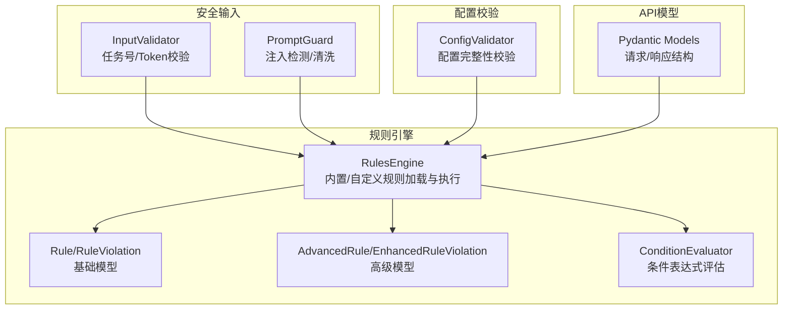
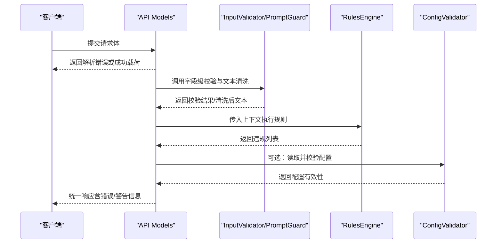
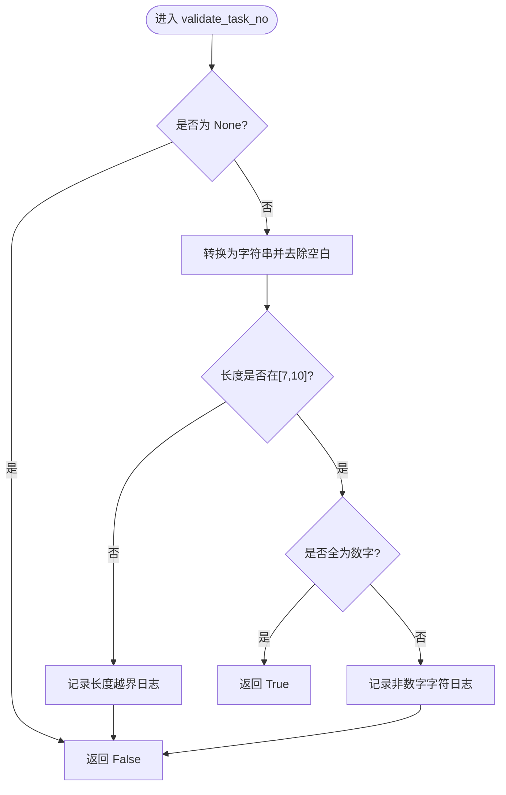
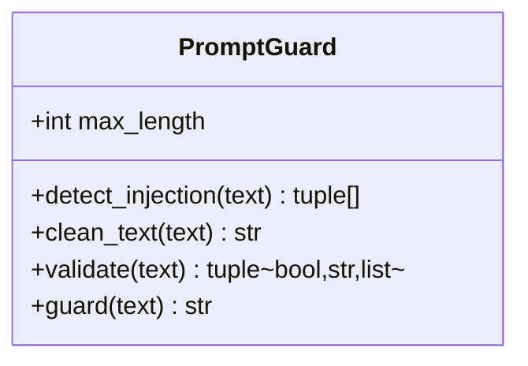
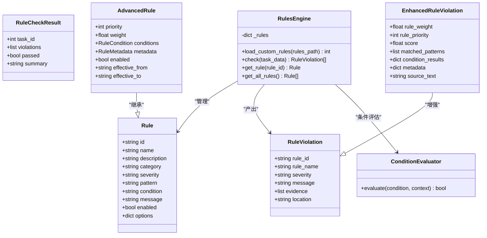
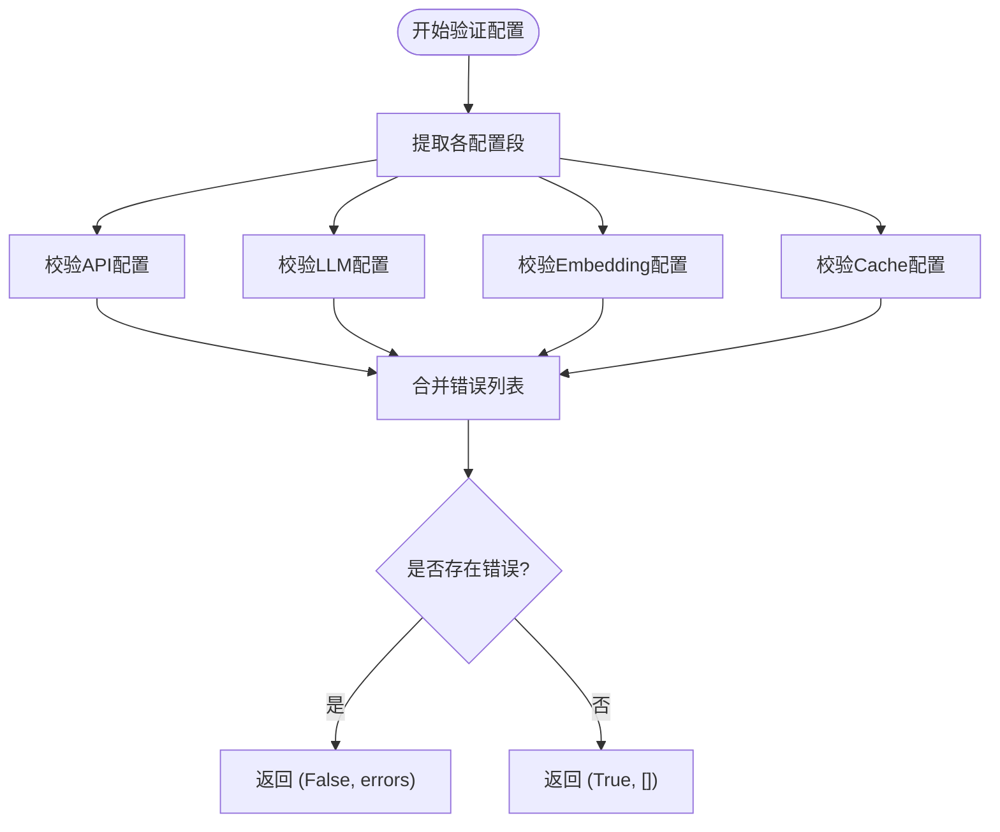
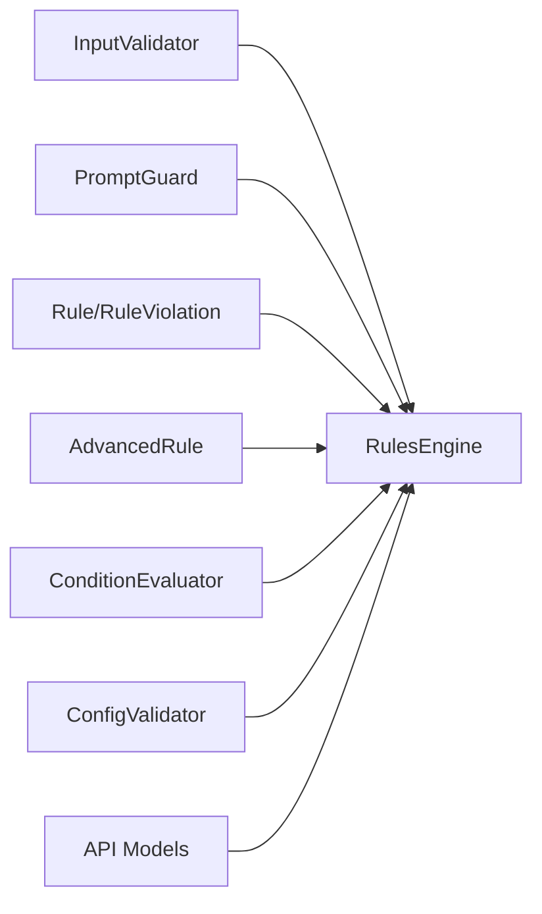

# 输入验证框架

<cite>
**本文引用的文件**   
- [src/security/input_validator.py](file://src/security/input_validator.py)
- [src/security/prompt_guard.py](file://src/security/prompt_guard.py)
- [src/security/__init__.py](file://src/security/__init__.py)
- [tests/security/test_input_validator.py](file://tests/security/test_input_validator.py)
- [tests/security/test_prompt_guard.py](file://tests/security/test_prompt_guard.py)
- [src/rules/models.py](file://src/rules/models.py)
- [src/rules/engine.py](file://src/rules/engine.py)
- [src/rules/advanced_models.py](file://src/rules/advanced_models.py)
- [src/rules/condition_evaluator.py](file://src/rules/condition_evaluator.py)
- [src/config/validator.py](file://src/config/validator.py)
- [src/api/models.py](file://src/api/models.py)
</cite>

## 目录
1. [简介](#简介)
2. [项目结构](#项目结构)
3. [核心组件](#核心组件)
4. [架构总览](#架构总览)
5. [详细组件分析](#详细组件分析)
6. [依赖关系分析](#依赖关系分析)
7. [性能考虑](#性能考虑)
8. [故障排查指南](#故障排查指南)
9. [结论](#结论)
10. [附录：API参考与使用示例](#附录api参考与使用示例)

## 简介
本技术文档围绕“输入验证框架”展开，聚焦以下目标：
- 输入数据格式校验机制：数据类型、格式与约束规则
- 长度限制策略：最大长度控制、最小长度要求与动态调整
- 内容过滤系统：敏感词检测、恶意代码识别与非法字符过滤
- 验证错误处理：错误分类、消息生成与重试策略
- 自定义验证规则开发：接口定义、注册机制与性能优化建议
- API参考与使用示例：面向使用者的快速上手指引

该框架由安全输入校验、提示注入防护、规则引擎与配置校验等模块组成，覆盖从边界到语义的多层验证。

## 项目结构
输入验证相关代码主要分布在如下位置：
- 安全输入校验：src/security/input_validator.py
- 提示注入防护：src/security/prompt_guard.py
- 规则引擎与模型：src/rules/*（models.py、engine.py、advanced_models.py、condition_evaluator.py）
- 配置校验：src/config/validator.py
- API 数据模型：src/api/models.py
- 测试用例：tests/security/*、tests/rules/*

图表来源
- [src/security/input_validator.py:1-74](file://src/security/input_validator.py#L1-L74)
- [src/security/prompt_guard.py:1-198](file://src/security/prompt_guard.py#L1-L198)
- [src/rules/models.py:1-51](file://src/rules/models.py#L1-L51)
- [src/rules/engine.py:217-352](file://src/rules/engine.py#L217-L352)
- [src/rules/advanced_models.py:1-102](file://src/rules/advanced_models.py#L1-L102)
- [src/rules/condition_evaluator.py:1-189](file://src/rules/condition_evaluator.py#L1-L189)
- [src/config/validator.py:1-196](file://src/config/validator.py#L1-L196)
- [src/api/models.py:1-91](file://src/api/models.py#L1-L91)

章节来源
- [src/security/input_validator.py:1-74](file://src/security/input_validator.py#L1-L74)
- [src/security/prompt_guard.py:1-198](file://src/security/prompt_guard.py#L1-L198)
- [src/rules/models.py:1-51](file://src/rules/models.py#L1-L51)
- [src/rules/engine.py:217-352](file://src/rules/engine.py#L217-L352)
- [src/rules/advanced_models.py:1-102](file://src/rules/advanced_models.py#L1-L102)
- [src/rules/condition_evaluator.py:1-189](file://src/rules/condition_evaluator.py#L1-L189)
- [src/config/validator.py:1-196](file://src/config/validator.py#L1-L196)
- [src/api/models.py:1-91](file://src/api/models.py#L1-L91)

## 核心组件
- InputValidator：提供对关键安全输入的强类型与格式校验（如任务号、令牌），包含长度与字符集约束。
- PromptGuard：针对LLM输入的注入模式检测与文本清洗，支持长度上限与正则匹配。
- RulesEngine：规则加载（内置/自定义）、规则执行与违规结果聚合；支持高级模式与条件评估。
- ConfigValidator：对应用配置进行完整性与合法性校验（URL、密钥、数值范围等）。
- API Models：基于Pydantic的强类型数据模型，用于请求/响应结构的自动校验与序列化。

章节来源
- [src/security/input_validator.py:1-74](file://src/security/input_validator.py#L1-L74)
- [src/security/prompt_guard.py:1-198](file://src/security/prompt_guard.py#L1-L198)
- [src/rules/engine.py:217-352](file://src/rules/engine.py#L217-L352)
- [src/config/validator.py:1-196](file://src/config/validator.py#L1-L196)
- [src/api/models.py:1-91](file://src/api/models.py#L1-L91)

## 架构总览
输入验证框架采用分层设计：
- 接入层：API Models负责结构化数据的强类型校验与默认值填充。
- 安全层：InputValidator与PromptGuard分别处理结构化字段与自由文本的安全性与合规性。
- 规则层：RulesEngine将业务规则（正则/条件）应用于输入上下文，产出违规记录。
- 配置层：ConfigValidator确保运行期配置合法，避免运行时异常。

图表来源
- [src/api/models.py:1-91](file://src/api/models.py#L1-L91)
- [src/security/input_validator.py:1-74](file://src/security/input_validator.py#L1-L74)
- [src/security/prompt_guard.py:1-198](file://src/security/prompt_guard.py#L1-L198)
- [src/rules/engine.py:217-352](file://src/rules/engine.py#L217-L352)
- [src/config/validator.py:1-196](file://src/config/validator.py#L1-L196)

## 详细组件分析

### 组件A：InputValidator（安全输入校验器）
职责
- 任务号校验：仅允许数字，长度在指定范围内，自动去空白。
- Token校验：非空字符串，长度在指定范围内，自动去空白。

复杂度
- 时间复杂度：O(n)，n为输入长度（strip/isdigit/len均为线性）。
- 空间复杂度：O(1)，无额外数据结构。

错误处理
- 通过布尔返回值表达失败，内部使用日志记录调试信息。

图表来源
- [src/security/input_validator.py:11-45](file://src/security/input_validator.py#L11-L45)

章节来源
- [src/security/input_validator.py:1-74](file://src/security/input_validator.py#L1-L74)
- [tests/security/test_input_validator.py:1-64](file://tests/security/test_input_validator.py#L1-L64)

### 组件B：PromptGuard（提示注入防护）
职责
- 注入模式检测：基于正则集合匹配常见注入指令与标签。
- 文本清洗：转义危险字符（如XML标签）。
- 长度限制：超过阈值时截断并标记不安全。
- 便捷函数：暴露全局实例方法供快速调用。

复杂度
- 检测：O(P×n)，P为模式数量，n为文本长度。
- 清洗：O(n)。
- 总体：O(P×n)。

错误处理
- 返回三元组（是否安全、清洗文本、注入模式列表），并在不安全时记录警告/错误日志。

图表来源
- [src/security/prompt_guard.py:12-142](file://src/security/prompt_guard.py#L12-L142)

章节来源
- [src/security/prompt_guard.py:1-198](file://src/security/prompt_guard.py#L1-L198)
- [tests/security/test_prompt_guard.py:1-146](file://tests/security/test_prompt_guard.py#L1-L146)

### 组件C：规则引擎（RulesEngine 与模型）
职责
- 规则模型：Rule、RuleViolation、RuleCheckResult、RulesConfig。
- 规则加载：内置规则字典与自定义YAML/JSON文件加载。
- 规则执行：遍历启用规则，按pattern或条件匹配，收集违规。
- 高级模式：AdvancedRule、EnhancedRuleViolation、ConditionEvaluator。

复杂度
- 加载：取决于文件数量与大小。
- 执行：O(R×n)，R为规则数，n为待检文本长度。

图表来源
- [src/rules/models.py:1-51](file://src/rules/models.py#L1-L51)
- [src/rules/engine.py:217-352](file://src/rules/engine.py#L217-L352)
- [src/rules/advanced_models.py:1-102](file://src/rules/advanced_models.py#L1-L102)
- [src/rules/condition_evaluator.py:1-189](file://src/rules/condition_evaluator.py#L1-L189)

章节来源
- [src/rules/models.py:1-51](file://src/rules/models.py#L1-L51)
- [src/rules/engine.py:217-352](file://src/rules/engine.py#L217-L352)
- [src/rules/advanced_models.py:1-102](file://src/rules/advanced_models.py#L1-L102)
- [src/rules/condition_evaluator.py:1-189](file://src/rules/condition_evaluator.py#L1-L189)

### 组件D：配置校验器（ConfigValidator）
职责
- 校验API、LLM、Embedding、Cache等配置项的必填字段、取值范围与格式。
- 返回布尔与错误列表，便于上层统一处理。

复杂度
- O(S)，S为配置项数量，主要为键存在性与范围检查。

图表来源
- [src/config/validator.py:16-51](file://src/config/validator.py#L16-L51)
- [src/config/validator.py:53-196](file://src/config/validator.py#L53-L196)

章节来源
- [src/config/validator.py:1-196](file://src/config/validator.py#L1-L196)

### 组件E：API数据模型（Pydantic Models）
职责
- 定义强类型请求/响应结构，自动完成字段校验、默认值与序列化。
- 作为输入验证的第一道防线，减少后续逻辑的类型分支。

章节来源
- [src/api/models.py:1-91](file://src/api/models.py#L1-L91)

## 依赖关系分析
- 安全输入与提示防护均不直接依赖规则引擎，但可在业务层组合使用。
- 规则引擎依赖基础模型与高级模式，条件评估器独立实现表达式求值。
- 配置校验器独立于其他模块，服务于启动阶段或动态重载场景。
- API模型为外部契约，被上层路由与服务消费。

图表来源
- [src/security/input_validator.py:1-74](file://src/security/input_validator.py#L1-L74)
- [src/security/prompt_guard.py:1-198](file://src/security/prompt_guard.py#L1-L198)
- [src/rules/models.py:1-51](file://src/rules/models.py#L1-L51)
- [src/rules/engine.py:217-352](file://src/rules/engine.py#L217-L352)
- [src/rules/advanced_models.py:1-102](file://src/rules/advanced_models.py#L1-L102)
- [src/rules/condition_evaluator.py:1-189](file://src/rules/condition_evaluator.py#L1-L189)
- [src/config/validator.py:1-196](file://src/config/validator.py#L1-L196)
- [src/api/models.py:1-91](file://src/api/models.py#L1-L91)

章节来源
- [src/security/input_validator.py:1-74](file://src/security/input_validator.py#L1-L74)
- [src/security/prompt_guard.py:1-198](file://src/security/prompt_guard.py#L1-L198)
- [src/rules/engine.py:217-352](file://src/rules/engine.py#L217-L352)
- [src/config/validator.py:1-196](file://src/config/validator.py#L1-L196)
- [src/api/models.py:1-91](file://src/api/models.py#L1-L91)

## 性能考虑
- 正则匹配成本：PromptGuard的模式数量与输入长度决定检测耗时，建议在高频路径预编译模式（已实现）并限制max_length。
- 规则执行规模：RulesEngine按规则数线性扫描，建议按需启用规则、缓存规则索引并按类别筛选。
- 条件评估开销：ConditionEvaluator支持嵌套条件，应避免过深嵌套与复杂表达式。
- I/O与加载：自定义规则文件加载仅在初始化或热重载时执行，避免在请求路径中重复加载。

## 故障排查指南
- 输入为空或类型不符
  - 现象：任务号/Token校验失败，返回False。
  - 定位：查看InputValidator日志输出，确认是否None或长度越界。
  - 修复：在调用前做类型转换与trim，或在上层API Models中强制类型。
- 注入模式触发
  - 现象：PromptGuard.validate返回不安全，且injections非空。
  - 定位：检查INJECTION_PATTERNS匹配到的片段，必要时扩展或放宽策略。
  - 修复：使用guard/clean_text进行清洗，或在业务层拒绝高风险输入。
- 规则误报/漏报
  - 现象：规则引擎产生过多或过少违规。
  - 定位：检查规则pattern/condition与上下文数据构造是否正确。
  - 修复：调整正则、增加上下文字段或引入权重/优先级。
- 配置错误导致启动失败
  - 现象：ConfigValidator返回错误列表。
  - 定位：逐项核对base_url、provider、model、timeout等字段。
  - 修复：修正配置值或补充缺失字段。

章节来源
- [src/security/input_validator.py:1-74](file://src/security/input_validator.py#L1-L74)
- [src/security/prompt_guard.py:1-198](file://src/security/prompt_guard.py#L1-L198)
- [src/rules/engine.py:217-352](file://src/rules/engine.py#L217-L352)
- [src/config/validator.py:1-196](file://src/config/validator.py#L1-L196)

## 结论
本输入验证框架以“强类型+安全校验+规则引擎”的分层策略，兼顾易用性与可扩展性。通过InputValidator与PromptGuard保障输入安全，借助RulesEngine实现灵活的业务规则，并以ConfigValidator确保运行期配置正确。建议在生产环境结合API Models与中间件，形成端到端的输入治理闭环。

## 附录：API参考与使用示例

### 安全输入校验（InputValidator）
- 方法
  - validate_task_no(task_no): 校验任务号（数字、长度7-10、可含空白）
  - validate_token(token): 校验令牌（非空、长度10-200、可含空白）
- 使用示例
  - 在API入口对task_no与token进行前置校验，失败则返回明确错误码与消息。
  - 参考测试用例中的参数化用例，覆盖边界与异常输入。

章节来源
- [src/security/input_validator.py:1-74](file://src/security/input_validator.py#L1-L74)
- [tests/security/test_input_validator.py:1-64](file://tests/security/test_input_validator.py#L1-L64)

### 提示注入防护（PromptGuard）
- 方法
  - detect_injection(text): 返回注入模式列表
  - clean_text(text): 转义危险字符
  - validate(text): 返回(是否安全, 清洗文本, 注入列表)
  - guard(text): 若不安全返回空串，否则返回清洗文本
- 便捷函数
  - detect_injection / clean_text / validate / guard（全局默认实例）
- 使用示例
  - 在LLM输入前调用guard或validate，拦截注入风险并记录日志。
  - 根据业务需求调整max_length与注入模式集合。

章节来源
- [src/security/prompt_guard.py:1-198](file://src/security/prompt_guard.py#L1-L198)
- [tests/security/test_prompt_guard.py:1-146](file://tests/security/test_prompt_guard.py#L1-L146)

### 规则引擎（RulesEngine）
- 模型
  - Rule、RuleViolation、RuleCheckResult、RulesConfig
  - AdvancedRule、EnhancedRuleViolation、RuleCondition、OperatorType
- 能力
  - 加载内置规则与自定义YAML/JSON规则
  - 按pattern/condition执行规则并汇总违规
  - 条件评估器支持AND/OR/NOT及多种操作符
- 使用示例
  - 初始化RulesEngine，加载自定义规则目录，对任务上下文执行check。
  - 根据severity与score进行分级处理与告警。

章节来源
- [src/rules/models.py:1-51](file://src/rules/models.py#L1-L51)
- [src/rules/engine.py:217-352](file://src/rules/engine.py#L217-L352)
- [src/rules/advanced_models.py:1-102](file://src/rules/advanced_models.py#L1-L102)
- [src/rules/condition_evaluator.py:1-189](file://src/rules/condition_evaluator.py#L1-L189)

### 配置校验（ConfigValidator）
- 能力
  - 校验API/LLM/Embedding/Cache配置段的必填项、枚举值与数值范围
  - 返回布尔与错误列表
- 使用示例
  - 在应用启动阶段调用validate_dict，集中展示所有配置错误并中止启动。

章节来源
- [src/config/validator.py:1-196](file://src/config/validator.py#L1-L196)

### API数据模型（Pydantic Models）
- 能力
  - 强类型字段校验、默认值与序列化
  - 作为输入验证第一道防线
- 使用示例
  - 在FastAPI/HTTP服务中使用这些模型接收请求体，自动完成校验与错误响应。

章节来源
- [src/api/models.py:1-91](file://src/api/models.py#L1-L91)

### 自定义验证规则开发指南
- 接口定义
  - 使用Rule/AdvancedRule定义规则元信息与匹配条件。
  - 使用ConditionEvaluator编写复杂条件表达式。
- 规则注册
  - 通过load_custom_rules加载YAML/JSON规则文件，或通过内存方式注册。
- 性能优化建议
  - 精简正则表达式，避免回溯灾难。
  - 对高频规则建立索引或缓存命中结果。
  - 合理设置enabled与category，按需启用。
- 错误处理与重试
  - 规则执行应捕获异常并降级，避免影响主流程。
  - 对于外部依赖的规则源，采用重试与熔断策略。

章节来源
- [src/rules/engine.py:217-352](file://src/rules/engine.py#L217-L352)
- [src/rules/advanced_models.py:1-102](file://src/rules/advanced_models.py#L1-L102)
- [src/rules/condition_evaluator.py:1-189](file://src/rules/condition_evaluator.py#L1-L189)
