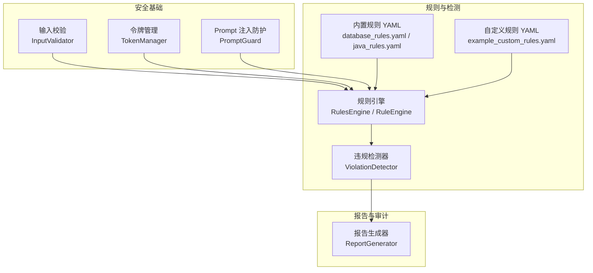
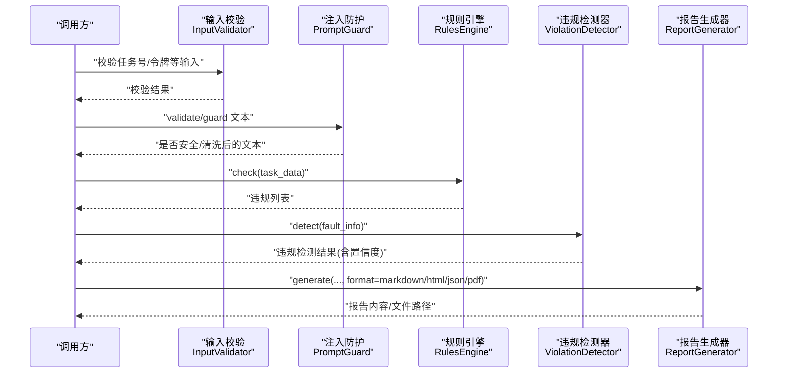
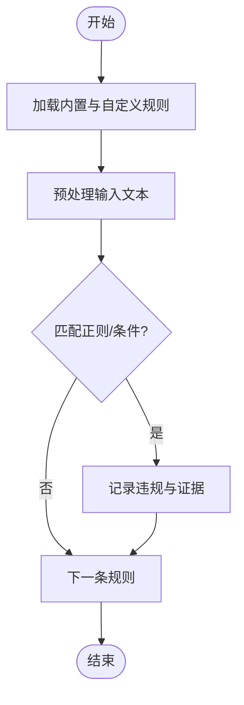
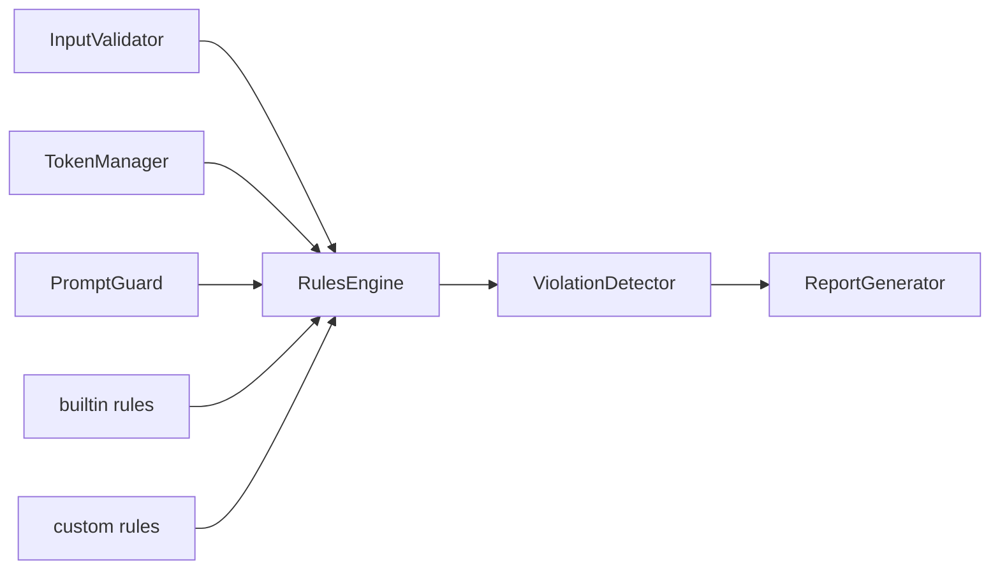

# 输出安全过滤

<cite>
**本文引用的文件**   
- [src/security/__init__.py](file://src/security/__init__.py)
- [src/security/input_validator.py](file://src/security/input_validator.py)
- [src/security/token_manager.py](file://src/security/token_manager.py)
- [src/security/prompt_guard.py](file://src/security/prompt_guard.py)
- [src/rules/engine.py](file://src/rules/engine.py)
- [src/analysis/violation_detector.py](file://src/analysis/violation_detector.py)
- [src/report/generator.py](file://src/report/generator.py)
- [src/rules/builtin/database_rules.yaml](file://src/rules/builtin/database_rules.yaml)
- [src/rules/builtin/java_rules.yaml](file://src/rules/builtin/java_rules.yaml)
- [src/rules/custom/example_custom_rules.yaml](file://src/rules/custom/example_custom_rules.yaml)
</cite>

## 目录
1. [简介](#简介)
2. [项目结构](#项目结构)
3. [核心组件](#核心组件)
4. [架构总览](#架构总览)
5. [详细组件分析](#详细组件分析)
6. [依赖关系分析](#依赖关系分析)
7. [性能与可扩展性](#性能与可扩展性)
8. [合规与审计](#合规与审计)
9. [故障排查指南](#故障排查指南)
10. [结论](#结论)

## 简介
本技术文档围绕“输出安全过滤系统”展开，聚焦以下目标：
- 敏感信息识别机制：个人身份信息(PII)检测、商业机密识别、密钥泄露防护。
- 隐私保护策略：数据脱敏、匿名化处理、信息聚合。
- 合规检查功能：GDPR合规、行业规范检查、法律要求验证。
- 输出内容清洗：HTML标签过滤、脚本代码移除、危险字符转义。
- 自定义过滤规则开发：过滤器接口、规则配置、性能调优。
- 安全审计日志与违规报告生成。

当前仓库已实现 Prompt 注入防护、输入校验、令牌生命周期管理、规则引擎（内置与自定义）、违规检测器以及报告生成能力。本文基于现有源码进行系统化梳理与扩展建议，确保读者既能理解现有实现，也能按指南扩展至更全面的输出安全过滤体系。

## 项目结构
与安全过滤相关的核心模块分布如下：
- 安全基础能力：输入校验、令牌管理、Prompt 注入防护。
- 规则与违规检测：规则引擎加载与执行、违规模式匹配、LLM辅助检测。
- 报告与审计：将检测结果与违规证据以多格式输出，便于审计与复盘。

图表来源
- [src/security/input_validator.py:1-74](file://src/security/input_validator.py#L1-L74)
- [src/security/token_manager.py:1-115](file://src/security/token_manager.py#L1-L115)
- [src/security/prompt_guard.py:1-198](file://src/security/prompt_guard.py#L1-L198)
- [src/rules/engine.py:1-376](file://src/rules/engine.py#L1-L376)
- [src/analysis/violation_detector.py:1-219](file://src/analysis/violation_detector.py#L1-L219)
- [src/rules/builtin/database_rules.yaml:1-39](file://src/rules/builtin/database_rules.yaml#L1-L39)
- [src/rules/builtin/java_rules.yaml:1-48](file://src/rules/builtin/java_rules.yaml#L1-L48)
- [src/rules/custom/example_custom_rules.yaml:1-41](file://src/rules/custom/example_custom_rules.yaml#L1-L41)
- [src/report/generator.py:1-790](file://src/report/generator.py#L1-L790)

章节来源
- [src/security/__init__.py:1-27](file://src/security/__init__.py#L1-L27)
- [src/security/input_validator.py:1-74](file://src/security/input_validator.py#L1-L74)
- [src/security/token_manager.py:1-115](file://src/security/token_manager.py#L1-L115)
- [src/security/prompt_guard.py:1-198](file://src/security/prompt_guard.py#L1-L198)
- [src/rules/engine.py:1-376](file://src/rules/engine.py#L1-L376)
- [src/analysis/violation_detector.py:1-219](file://src/analysis/violation_detector.py#L1-L219)
- [src/report/generator.py:1-790](file://src/report/generator.py#L1-L790)

## 核心组件
- 输入校验(InputValidator)
  - 职责：对关键输入（如任务编号、令牌）进行格式与长度校验，防止非法或越界输入进入下游处理。
  - 关键点：统一字符串化后做长度与字符集校验；失败时记录调试日志并返回无效。
- 令牌管理(TokenManager)
  - 职责：管理令牌有效期、旋转告警阈值、剩余天数计算等。
  - 关键点：基于 UTC 时间计算过期与告警窗口；提供便捷查询方法。
- Prompt 注入防护(PromptGuard)
  - 职责：检测并阻止常见 Prompt 注入模式，提供文本清洗与验证。
  - 关键点：内置多种注入模式正则；支持最大长度限制；提供 validate/guard/clean_text/detect_injection 等便捷函数。
- 规则引擎(RulesEngine/RuleEngine)
  - 职责：加载内置与自定义规则，执行匹配并产出违规结果；兼容旧 API。
  - 关键点：支持 YAML/JSON 规则文件；提供分类查询、规则启用开关；向后兼容的包装类适配测试。
- 违规检测器(ViolationDetector)
  - 职责：基于预定义模式与知识库标准进行违规检测，并可调用 LLM 增强判断。
  - 关键点：组合标题、描述、代码片段进行匹配；计算置信度；解析 LLM JSON 响应。
- 报告生成器(ReportGenerator)
  - 职责：将分析结果渲染为 Markdown/HTML/PDF/JSON 报告，便于审计与分发。
  - 关键点：模板渲染、数据校验、保存输出路径。

章节来源
- [src/security/input_validator.py:1-74](file://src/security/input_validator.py#L1-L74)
- [src/security/token_manager.py:1-115](file://src/security/token_manager.py#L1-L115)
- [src/security/prompt_guard.py:1-198](file://src/security/prompt_guard.py#L1-L198)
- [src/rules/engine.py:1-376](file://src/rules/engine.py#L1-L376)
- [src/analysis/violation_detector.py:1-219](file://src/analysis/violation_detector.py#L1-L219)
- [src/report/generator.py:1-790](file://src/report/generator.py#L1-L790)

## 架构总览
下图展示从输入到输出的端到端安全过滤流程：输入经校验与注入防护，随后由规则引擎与违规检测器进行扫描，最终通过报告生成器输出审计与违规报告。

图表来源
- [src/security/input_validator.py:1-74](file://src/security/input_validator.py#L1-L74)
- [src/security/prompt_guard.py:1-198](file://src/security/prompt_guard.py#L1-L198)
- [src/rules/engine.py:1-376](file://src/rules/engine.py#L1-L376)
- [src/analysis/violation_detector.py:1-219](file://src/analysis/violation_detector.py#L1-L219)
- [src/report/generator.py:1-790](file://src/report/generator.py#L1-L790)

## 详细组件分析

### 敏感信息识别机制
- 个人身份信息(PII)检测
  - 现状：未直接实现 PII 正则库。可通过在规则引擎中新增规则（YAML）覆盖身份证号、手机号、邮箱等模式。
  - 建议：在 src/rules/custom 下新增 PII 规则文件，使用 pattern 字段定义匹配表达式，severity 设为 high/critical。
- 商业机密识别
  - 现状：未直接实现。可结合业务关键词与上下文条件（condition）进行启发式检测。
  - 建议：在自定义规则中添加“商业术语+上下文”的组合模式，配合 condition 评估上下文长度或关键字密度。
- 密钥泄露防护
  - 现状：规则引擎内置 security-001 规则用于检测硬编码敏感信息（密码、密钥、token 等）。
  - 建议：结合数据库与 Java 内置规则（db-001、java-001 等）形成多维防护；在 PromptGuard 中对包含密钥的提示词进行拦截。

章节来源
- [src/rules/engine.py:159-214](file://src/rules/engine.py#L159-L214)
- [src/rules/builtin/database_rules.yaml:1-39](file://src/rules/builtin/database_rules.yaml#L1-L39)
- [src/rules/builtin/java_rules.yaml:1-48](file://src/rules/builtin/java_rules.yaml#L1-L48)
- [src/rules/custom/example_custom_rules.yaml:1-41](file://src/rules/custom/example_custom_rules.yaml#L1-L41)
- [src/security/prompt_guard.py:19-49](file://src/security/prompt_guard.py#L19-L49)

### 隐私保护策略
- 数据脱敏
  - 现状：PromptGuard.clean_text 仅对尖括号进行转义，未实现通用脱敏。
  - 建议：在 PromptGuard 中增加脱敏策略（如掩码、哈希），并在规则引擎中提供脱敏后文本供下游使用。
- 匿名化处理
  - 现状：未实现。可在输入校验阶段对姓名、ID 等字段进行匿名化替换，或在报告生成前进行二次处理。
- 信息聚合
  - 现状：报告生成器支持汇总统计与表格渲染，可用于聚合违规数量、类别分布等指标。
  - 建议：在 ReportData 中扩展聚合维度，结合 ChartData/TableData 输出可视化数据。

章节来源
- [src/security/prompt_guard.py:82-98](file://src/security/prompt_guard.py#L82-L98)
- [src/report/generator.py:32-88](file://src/report/generator.py#L32-L88)

### 合规检查功能
- GDPR 合规
  - 现状：未直接实现。建议在规则引擎中新增“个人信息处理”相关规则，并结合报告输出合规摘要。
- 行业规范检查
  - 现状：Java 与数据库内置规则覆盖了常见缺陷模式，可作为行业规范基线。
  - 建议：根据行业标准扩展更多规则（如 OWASP Top 10、CWE 映射）。
- 法律要求验证
  - 现状：未直接实现。可在违规检测器中引入法律条款关键词匹配，并输出证据链。

章节来源
- [src/rules/builtin/java_rules.yaml:1-48](file://src/rules/builtin/java_rules.yaml#L1-L48)
- [src/rules/builtin/database_rules.yaml:1-39](file://src/rules/builtin/database_rules.yaml#L1-L39)
- [src/analysis/violation_detector.py:15-52](file://src/analysis/violation_detector.py#L15-L52)

### 输出内容清洗
- HTML 标签过滤
  - 现状：PromptGuard.clean_text 对 < > 进行转义，避免 HTML 注入风险。
- 脚本代码移除
  - 现状：未实现。建议在注入防护中增加对 script 标签与事件属性的检测与移除。
- 危险字符转义
  - 现状：仅对尖括号转义。建议扩展为对引号、反斜杠等进行转义，防止注入与 XSS。

章节来源
- [src/security/prompt_guard.py:82-98](file://src/security/prompt_guard.py#L82-L98)

### 自定义过滤规则开发指南
- 过滤器接口
  - 规则模型：Rule 包含 id、name、description、category、severity、pattern、condition、message、enabled 等字段。
  - 引擎接口：RulesEngine.check(task_data) 返回违规列表；RuleEngine 提供旧 API 兼容。
- 规则配置
  - 内置规则：engine.py 中的 BUILTIN_RULES 提供示例。
  - 外部规则：YAML/JSON 文件通过 load_custom_rules 加载，支持 enabled 开关。
- 性能调优
  - 正则优化：减少回溯与复杂分支；优先使用锚点与限定符。
  - 规则裁剪：按 category 筛选；禁用低优先级规则；批量预处理文本。
  - 并行执行：在 RuleEngine.run_all 中可考虑并行化（需保证线程安全）。

图表来源
- [src/rules/engine.py:217-352](file://src/rules/engine.py#L217-L352)
- [src/rules/engine.py:239-310](file://src/rules/engine.py#L239-L310)
- [src/rules/custom/example_custom_rules.yaml:1-41](file://src/rules/custom/example_custom_rules.yaml#L1-L41)

章节来源
- [src/rules/engine.py:1-376](file://src/rules/engine.py#L1-L376)
- [src/rules/custom/example_custom_rules.yaml:1-41](file://src/rules/custom/example_custom_rules.yaml#L1-L41)

### 安全审计日志与违规报告生成
- 审计日志
  - 现状：各组件使用 loguru 记录警告与错误信息（如注入检测、长度超限、规则加载失败）。
  - 建议：统一审计日志格式，包含时间戳、请求 ID、用户标识、违规类型、证据摘要。
- 违规报告
  - 现状：ReportGenerator 支持 Markdown/HTML/PDF/JSON 输出，可包含违规条目与建议。
  - 建议：在报告中增加“合规状态”、“风险等级分布”、“趋势对比”等维度。

章节来源
- [src/security/prompt_guard.py:100-141](file://src/security/prompt_guard.py#L100-L141)
- [src/rules/engine.py:279-310](file://src/rules/engine.py#L279-L310)
- [src/report/generator.py:250-423](file://src/report/generator.py#L250-L423)

## 依赖关系分析
- 组件耦合
  - 输入校验与令牌管理独立，不直接依赖规则引擎。
  - PromptGuard 与规则引擎解耦，但可在上层编排中串联使用。
  - 规则引擎依赖 YAML/JSON 规则文件；违规检测器依赖规则引擎与知识库。
  - 报告生成器依赖上游检测结果，输出多格式报告。
- 潜在循环依赖
  - 当前未发现循环依赖；各模块职责清晰，边界明确。
- 外部依赖
  - loguru 用于日志；Jinja2 用于模板渲染；可选 yaml/json 解析。

图表来源
- [src/security/input_validator.py:1-74](file://src/security/input_validator.py#L1-L74)
- [src/security/token_manager.py:1-115](file://src/security/token_manager.py#L1-L115)
- [src/security/prompt_guard.py:1-198](file://src/security/prompt_guard.py#L1-L198)
- [src/rules/engine.py:1-376](file://src/rules/engine.py#L1-L376)
- [src/analysis/violation_detector.py:1-219](file://src/analysis/violation_detector.py#L1-L219)
- [src/report/generator.py:1-790](file://src/report/generator.py#L1-L790)

## 性能与可扩展性
- 正则性能
  - 建议：对高频规则进行预编译与缓存；避免过度回溯；使用非捕获组减少开销。
- 规则规模
  - 建议：按领域拆分规则文件；按需加载；启用规则开关控制运行集。
- 并行与批处理
  - 建议：在批量检查场景中使用多线程/进程池；注意共享状态与锁。
- 可扩展点
  - 新增 PII/商业秘密规则：在 custom 目录下添加 YAML 文件。
  - 扩展清洗策略：在 PromptGuard 中增加脱敏与转义逻辑。
  - 增强合规检查：在违规检测器中引入法律条款与行业规范映射。

[本节为通用指导，无需列出具体文件来源]

## 合规与审计
- GDPR 合规
  - 建议：在规则引擎中增加“数据处理合法性”、“最小化原则”、“保留期限”等规则；在报告中输出合规摘要。
- 行业规范
  - 现状：Java 与数据库规则提供了良好基线。
  - 建议：补充 OWASP/CWE 映射规则，提升覆盖面。
- 法律要求验证
  - 建议：在违规检测器中引入法律关键词与上下文条件，输出证据链与风险提示。
- 审计日志
  - 建议：统一审计格式，包含请求上下文、违规详情、处置动作；支持导出与检索。

[本节为通用指导，无需列出具体文件来源]

## 故障排查指南
- 注入防护失败
  - 现象：guard 返回空字符串或 validate 返回不安全。
  - 排查：检查注入模式匹配、长度限制、日志输出。
- 规则未生效
  - 现象：check 未返回预期违规。
  - 排查：确认规则 enabled 状态、pattern 正确性、输入文本构造。
- 报告生成异常
  - 现象：模板渲染失败或输出为空。
  - 排查：检查模板目录、数据校验、格式选择。

章节来源
- [src/security/prompt_guard.py:100-141](file://src/security/prompt_guard.py#L100-L141)
- [src/rules/engine.py:279-310](file://src/rules/engine.py#L279-L310)
- [src/report/generator.py:718-737](file://src/report/generator.py#L718-L737)

## 结论
当前仓库已具备 Prompt 注入防护、输入校验、令牌管理、规则引擎与违规检测、报告生成等核心能力。为实现完整的输出安全过滤系统，建议：
- 扩展 PII 与商业秘密规则，完善敏感信息识别。
- 增强 PromptGuard 的脱敏与转义策略，提升输出清洗能力。
- 引入合规检查与法律要求验证，完善审计与报告维度。
- 优化规则性能与并行处理，提升大规模场景下的吞吐与稳定性。

[本节为总结性内容，无需列出具体文件来源]
