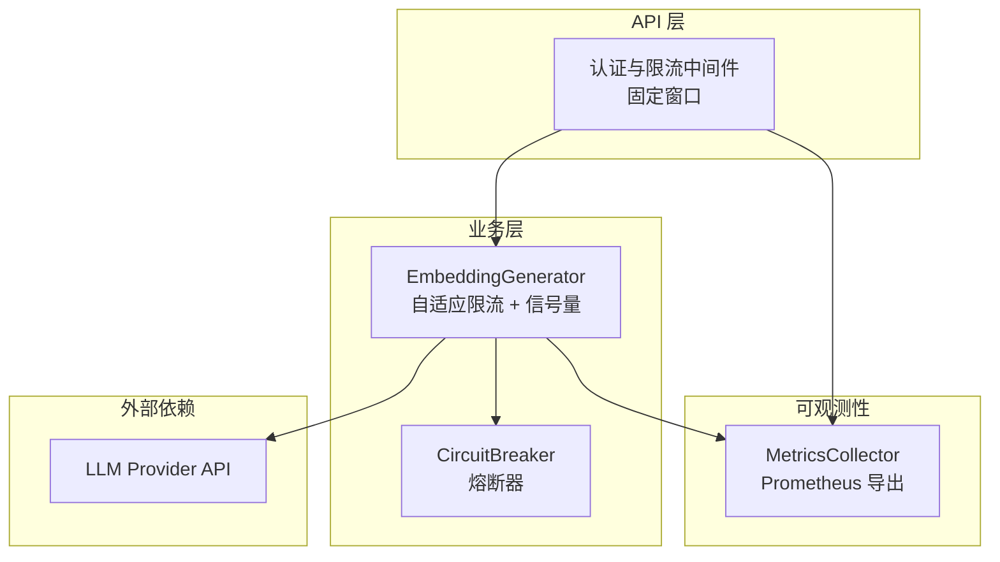
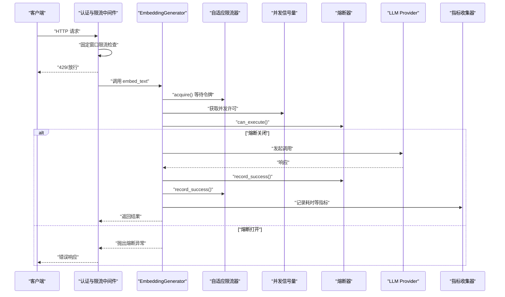
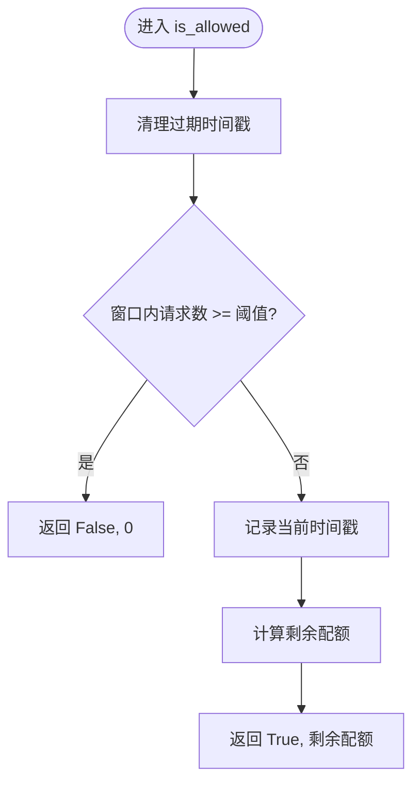
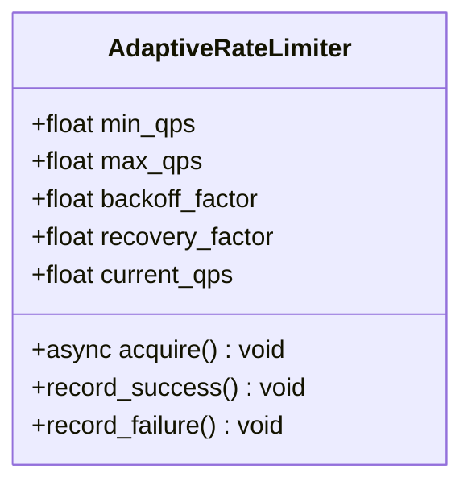
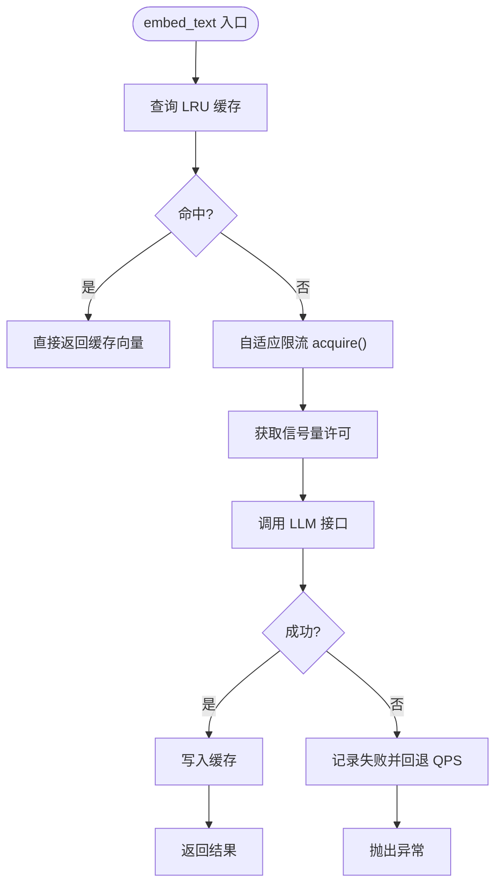
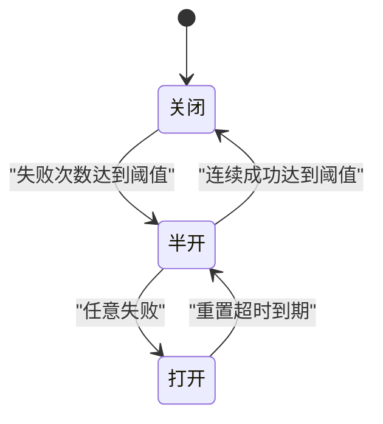
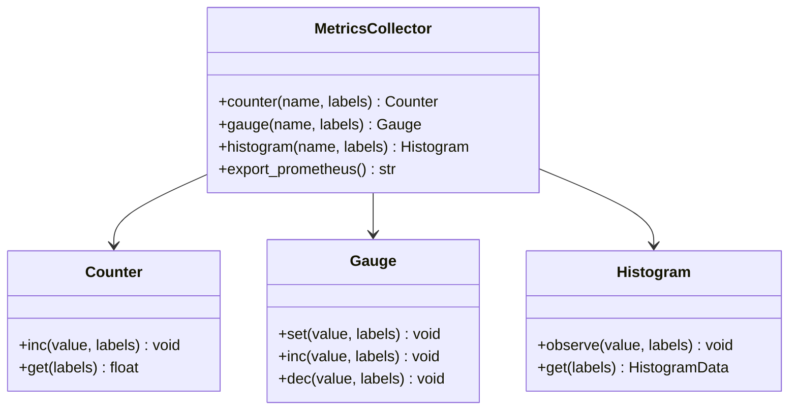
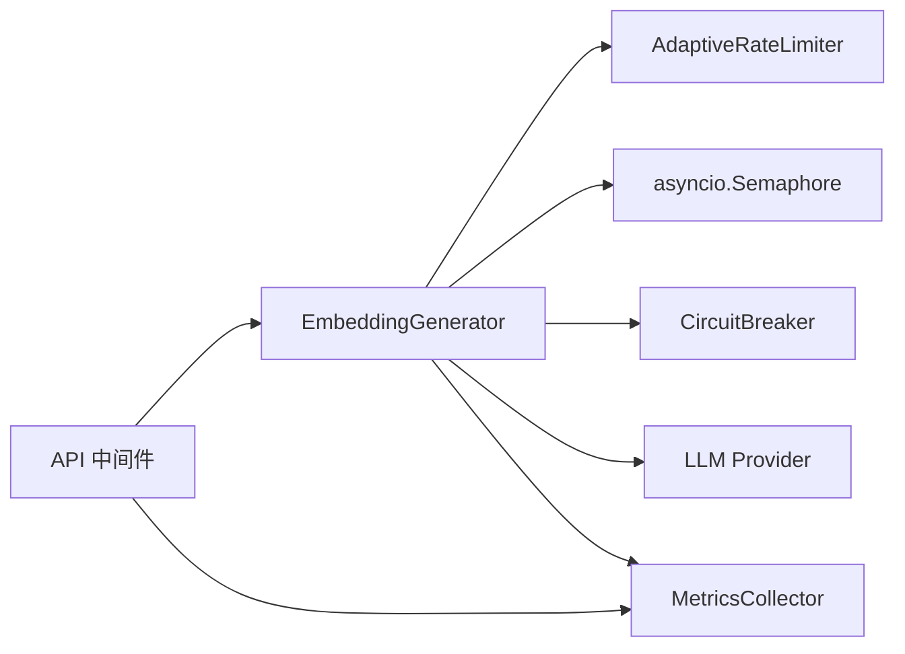

# 信号量控制

<cite>
**本文引用的文件**   
- [src/embedding/generator.py](file://src/embedding/generator.py)
- [src/api/middleware.py](file://src/api/middleware.py)
- [src/utils/circuit_breaker.py](file://src/utils/circuit_breaker.py)
- [src/utils/metrics.py](file://src/utils/metrics.py)
- [src/api/client.py](file://src/api/client.py)
- [config/config.yaml.example](file://config/config.yaml.example)
- [tests/embedding/test_generator_task24.py](file://tests/embedding/test_generator_task24.py)
- [tests/api/test_middleware.py](file://tests/api/test_middleware.py)
- [tests/utils/test_circuit_breaker.py](file://tests/utils/test_circuit_breaker.py)
- [tests/utils/test_metrics.py](file://tests/utils/test_metrics.py)
- [example_observability.py](file://example_observability.py)
- [docs/observability_guide.md](file://docs/observability_guide.md)
</cite>

## 目录
1. [简介](#简介)
2. [项目结构](#项目结构)
3. [核心组件](#核心组件)
4. [架构总览](#架构总览)
5. [详细组件分析](#详细组件分析)
6. [依赖关系分析](#依赖关系分析)
7. [性能考虑](#性能考虑)
8. [故障排查指南](#故障排查指南)
9. [结论](#结论)
10. [附录](#附录)

## 简介
本技术文档围绕 LLM 信号量控制系统，系统化梳理并解释现有代码中的限流与并发控制实现，包括：
- 限流算法：固定窗口、滑动窗口、令牌桶（含自适应令牌桶）
- 自适应调整机制：动态阈值计算、负载感知与弹性伸缩
- 并发访问控制：互斥锁与信号量、死锁预防与资源竞争处理
- 配置策略：不同场景下的阈值设置与性能影响
- 监控指标：可观测性指标采集与 Prometheus 导出

## 项目结构
本项目在以下位置实现了与“信号量控制”相关的核心能力：
- API 层固定窗口限流与认证中间件
- Embedding 生成器的自适应速率限制器与并发信号量
- 熔断器用于外部服务保护
- 统一的指标收集与 Prometheus 导出

图示来源
- [src/api/middleware.py:13-46](file://src/api/middleware.py#L13-L46)
- [src/embedding/generator.py:54-89](file://src/embedding/generator.py#L54-L89)
- [src/utils/circuit_breaker.py:36-114](file://src/utils/circuit_breaker.py#L36-L114)
- [src/utils/metrics.py:151-226](file://src/utils/metrics.py#L151-L226)

章节来源
- [src/api/middleware.py:13-46](file://src/api/middleware.py#L13-L46)
- [src/embedding/generator.py:54-89](file://src/embedding/generator.py#L54-L89)
- [src/utils/circuit_breaker.py:36-114](file://src/utils/circuit_breaker.py#L36-L114)
- [src/utils/metrics.py:151-226](file://src/utils/metrics.py#L151-L226)

## 核心组件
- 固定窗口限流器（API 中间件）
  - 基于时间窗口的请求计数，按标识符（token/IP）隔离
  - 返回是否允许与剩余配额
- 自适应速率限制器（令牌桶变体）
  - 根据成功/失败记录动态调整 QPS，实现弹性伸缩
  - 通过 sleep 控制最小间隔，近似令牌发放
- 并发信号量
  - asyncio.Semaphore 控制最大并发度，避免过载
- 熔断器
  - 三态机（关闭/半开/打开），失败阈值触发打开，超时进入半开探测
- 指标收集
  - Counter/Gauge/Histogram 三类指标，支持标签与 Prometheus 导出

章节来源
- [src/api/middleware.py:13-46](file://src/api/middleware.py#L13-L46)
- [src/embedding/generator.py:54-89](file://src/embedding/generator.py#L54-L89)
- [src/embedding/generator.py:132-134](file://src/embedding/generator.py#L132-L134)
- [src/utils/circuit_breaker.py:36-114](file://src/utils/circuit_breaker.py#L36-L114)
- [src/utils/metrics.py:151-226](file://src/utils/metrics.py#L151-L226)

## 架构总览
下图展示从 HTTP 请求到 LLM 调用的关键路径，以及限流、熔断、并发控制与指标埋点的位置。

图示来源
- [src/api/middleware.py:81-141](file://src/api/middleware.py#L81-L141)
- [src/embedding/generator.py:162-216](file://src/embedding/generator.py#L162-L216)
- [src/utils/circuit_breaker.py:146-181](file://src/utils/circuit_breaker.py#L146-L181)
- [src/utils/metrics.py:190-226](file://src/utils/metrics.py#L190-L226)

## 详细组件分析

### 固定窗口限流器（API 中间件）
- 设计要点
  - 使用字典维护每个标识符的请求时间戳列表
  - 每次请求清理过期时间戳，统计窗口内数量
  - 超过阈值则拒绝并返回剩余为 0
- 复杂度
  - 单次 is_allowed 操作为 O(n)，n 为当前窗口内请求数；可通过有序队列或滑动窗口优化
- 适用场景
  - 简单稳定的全局或分客户端限流
- 扩展建议
  - 引入滑动窗口或漏桶以平滑突发流量

图示来源
- [src/api/middleware.py:20-45](file://src/api/middleware.py#L20-L45)

章节来源
- [src/api/middleware.py:13-46](file://src/api/middleware.py#L13-L46)
- [tests/api/test_middleware.py:45-74](file://tests/api/test_middleware.py#L45-L74)

### 自适应速率限制器（令牌桶变体）
- 设计要点
  - 维护 current_qps，初始值由参数设定
  - acquire() 根据 interval=1/current_qps 进行睡眠，保证平均速率
  - record_success()/record_failure() 分别乘恢复因子与退避因子，并在边界内钳制
- 复杂度
  - 常数时间更新与 O(1) 睡眠判断
- 适用场景
  - 对下游 LLM 服务的自适应限速，结合成功率反馈自动调节
- 扩展建议
  - 增加滑动窗口统计成功率，提升稳定性

图示来源
- [src/embedding/generator.py:54-89](file://src/embedding/generator.py#L54-L89)

章节来源
- [src/embedding/generator.py:54-89](file://src/embedding/generator.py#L54-L89)
- [tests/embedding/test_generator_task24.py:80-129](file://tests/embedding/test_generator_task24.py#L80-L129)

### 并发信号量与缓存
- 并发控制
  - 使用 asyncio.Semaphore(max_concurrency) 控制并发度，避免同时过多 I/O 请求
- 缓存
  - LRU 缓存带 TTL，减少重复计算与网络开销
- 组合策略
  - 先查缓存，再走自适应限流与信号量，最后调用 LLM

图示来源
- [src/embedding/generator.py:162-216](file://src/embedding/generator.py#L162-L216)
- [src/embedding/generator.py:13-52](file://src/embedding/generator.py#L13-L52)
- [src/embedding/generator.py:132-134](file://src/embedding/generator.py#L132-L134)

章节来源
- [src/embedding/generator.py:13-52](file://src/embedding/generator.py#L13-L52)
- [src/embedding/generator.py:132-134](file://src/embedding/generator.py#L132-L134)
- [src/embedding/generator.py:162-216](file://src/embedding/generator.py#L162-L216)

### 熔断器（Circuit Breaker）
- 状态机
  - CLOSED：正常放行
  - OPEN：达到失败阈值后阻塞请求
  - HALF_OPEN：超时后尝试放行少量请求探测恢复
- 关键方法
  - can_execute()：是否允许执行
  - record_success()/record_failure()：更新状态
  - with_circuit_breaker 装饰器：统一封装同步/异步函数
- 集成点
  - EmbeddingGenerator 与 APIClient 均使用熔断器保护外部调用

图示来源
- [src/utils/circuit_breaker.py:36-114](file://src/utils/circuit_breaker.py#L36-L114)
- [src/utils/circuit_breaker.py:146-181](file://src/utils/circuit_breaker.py#L146-L181)
- [src/utils/circuit_breaker.py:264-305](file://src/utils/circuit_breaker.py#L264-L305)

章节来源
- [src/utils/circuit_breaker.py:36-114](file://src/utils/circuit_breaker.py#L36-L114)
- [src/utils/circuit_breaker.py:146-181](file://src/utils/circuit_breaker.py#L146-L181)
- [src/utils/circuit_breaker.py:264-305](file://src/utils/circuit_breaker.py#L264-L305)
- [tests/utils/test_circuit_breaker.py:16-110](file://tests/utils/test_circuit_breaker.py#L16-L110)
- [src/api/client.py:122-145](file://src/api/client.py#L122-L145)

### 指标收集与 Prometheus 导出
- 指标类型
  - Counter：累计值（如请求总数、错误数）
  - Gauge：瞬时值（如活跃连接数）
  - Histogram：分布统计（如响应时间）
- 使用方式
  - MetricsCollector 提供命名空间与标签支持
  - export_prometheus() 输出标准格式供监控系统抓取
- 典型埋点
  - 请求开始/结束、耗时直方图、活跃请求数增减

图示来源
- [src/utils/metrics.py:151-226](file://src/utils/metrics.py#L151-L226)

章节来源
- [src/utils/metrics.py:151-226](file://src/utils/metrics.py#L151-L226)
- [tests/utils/test_metrics.py:218-265](file://tests/utils/test_metrics.py#L218-L265)
- [example_observability.py:51-85](file://example_observability.py#L51-L85)
- [docs/observability_guide.md:74-168](file://docs/observability_guide.md#L74-L168)

## 依赖关系分析
- 组件耦合
  - EmbeddingGenerator 依赖自适应限流器、信号量与熔断器
  - API 中间件独立于业务逻辑，仅做前置校验与限流
  - 熔断器被多个外部调用点复用（EmbeddingGenerator、APIClient）
- 潜在循环依赖
  - 当前未见循环导入；各模块职责清晰
- 外部依赖
  - LLM Provider API（OpenAI 兼容）、httpx（火山视觉模型）

图示来源
- [src/api/middleware.py:81-141](file://src/api/middleware.py#L81-L141)
- [src/embedding/generator.py:162-216](file://src/embedding/generator.py#L162-L216)
- [src/utils/circuit_breaker.py:146-181](file://src/utils/circuit_breaker.py#L146-L181)
- [src/utils/metrics.py:151-226](file://src/utils/metrics.py#L151-L226)

章节来源
- [src/api/middleware.py:81-141](file://src/api/middleware.py#L81-L141)
- [src/embedding/generator.py:162-216](file://src/embedding/generator.py#L162-L216)
- [src/utils/circuit_breaker.py:146-181](file://src/utils/circuit_breaker.py#L146-L181)
- [src/utils/metrics.py:151-226](file://src/utils/metrics.py#L151-L226)

## 性能考虑
- 固定窗口 vs 滑动窗口
  - 固定窗口实现简单但存在边界突刺问题；滑动窗口更平滑但内存与计算开销更高
- 自适应令牌桶
  - 通过 success/failure 反馈调节 QPS，具备弹性伸缩能力；需合理设置 backoff/recovery 因子
- 并发信号量
  - 合理设置 max_concurrency，避免线程切换与上下文开销过大
- 熔断器
  - 失败阈值与重置超时需结合下游 SLA 与重试策略综合评估
- 指标采样
  - 高频直方图观察可能带来额外 CPU 与内存压力，应控制标签基数与采样频率

[本节为通用指导，不直接分析具体文件]

## 故障排查指南
- 常见问题
  - 频繁 429：检查固定窗口阈值与客户端标识粒度
  - 吞吐下降：检查自适应限流的 backoff 是否过强、信号量是否过小
  - 熔断频繁打开：确认下游错误率与超时配置，必要时提高失败阈值或延长重置超时
- 定位手段
  - 查看 Prometheus 导出的指标，关注请求总量、错误比例、响应时间分布
  - 结合日志中间件的请求/响应时间与异常堆栈

章节来源
- [src/api/middleware.py:118-141](file://src/api/middleware.py#L118-L141)
- [src/utils/metrics.py:190-226](file://src/utils/metrics.py#L190-L226)
- [docs/observability_guide.md:140-168](file://docs/observability_guide.md#L140-L168)

## 结论
本项目在 API 层与业务层分别实现了固定窗口限流与自适应令牌桶限流，并通过信号量控制并发度、熔断器保护外部依赖、指标系统支撑可观测性。整体方案兼顾了稳定性与弹性，适合在高并发与不稳定外部依赖的 LLM 场景中落地。后续可在滑动窗口、成功率统计与更细粒度的标签维度上进一步优化。

[本节为总结性内容，不直接分析具体文件]

## 附录

### 配置与阈值建议
- 固定窗口
  - requests_per_minute：根据业务峰值与下游配额设置，建议预留 20%-30% 余量
- 自适应限流
  - initial_qps：参考历史 QPS 与下游 SLA
  - min_qps/max_qps：限制波动范围，防止极端情况
  - backoff_factor/recovery_factor：失败时快速降速，成功时缓慢恢复
- 并发信号量
  - max_concurrency：依据 CPU/IO 特性与下游并发上限设置
- 熔断器
  - failure_threshold：根据错误容忍度设置
  - reset_timeout：结合下游恢复时间设置
  - success_threshold：半开探测成功后关闭

章节来源
- [config/config.yaml.example:1-38](file://config/config.yaml.example#L1-L38)
- [src/embedding/generator.py:54-89](file://src/embedding/generator.py#L54-L89)
- [src/utils/circuit_breaker.py:56-72](file://src/utils/circuit_breaker.py#L56-L72)
