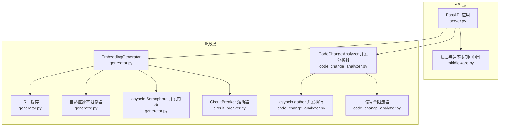
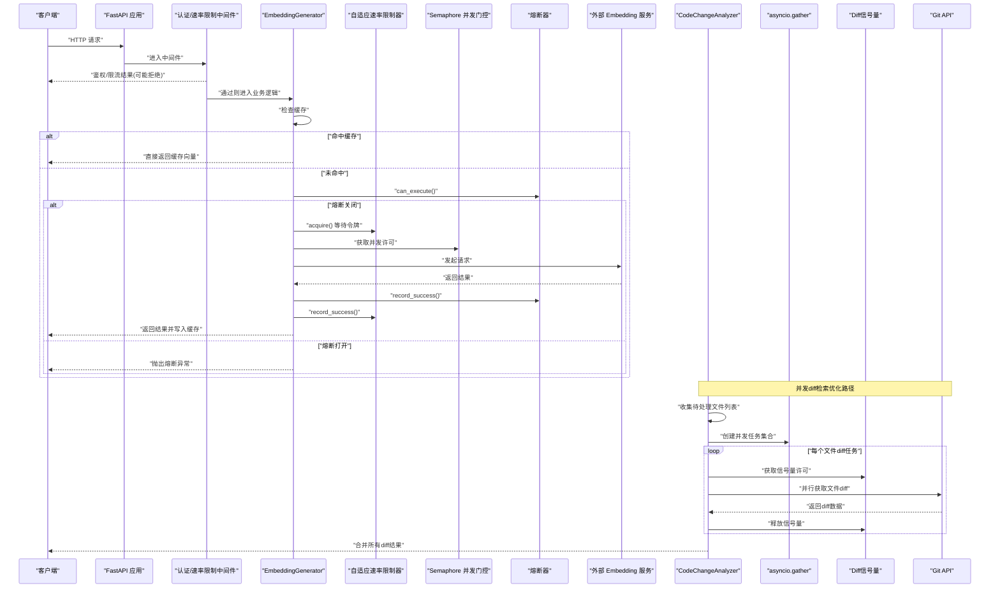
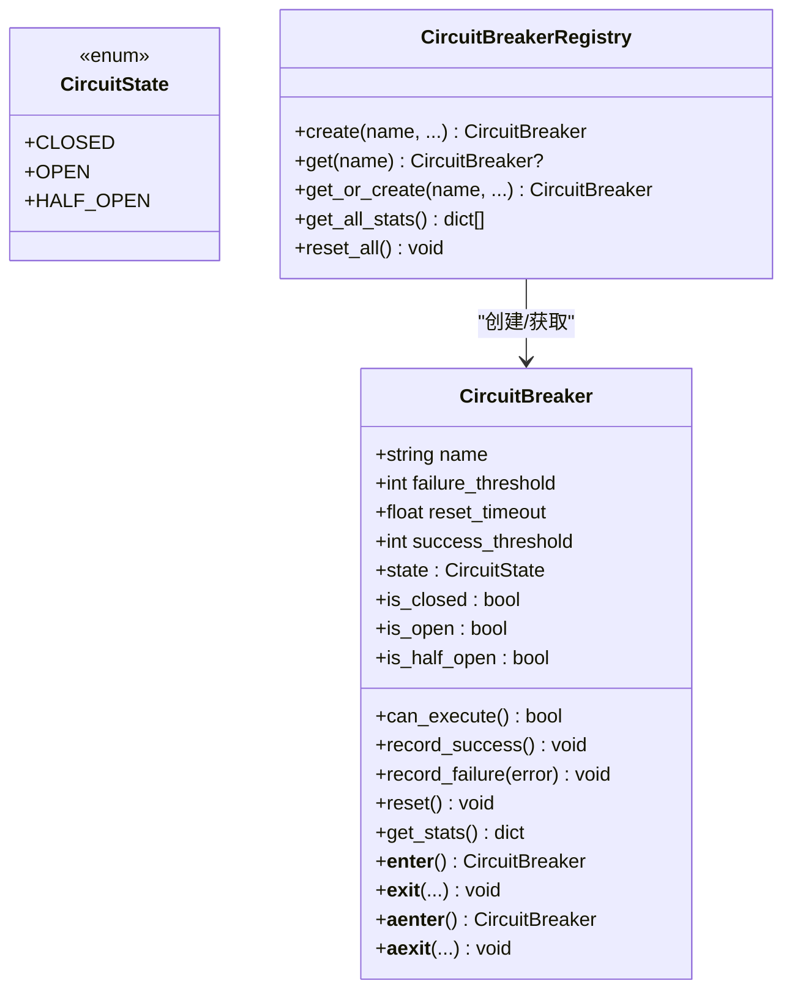
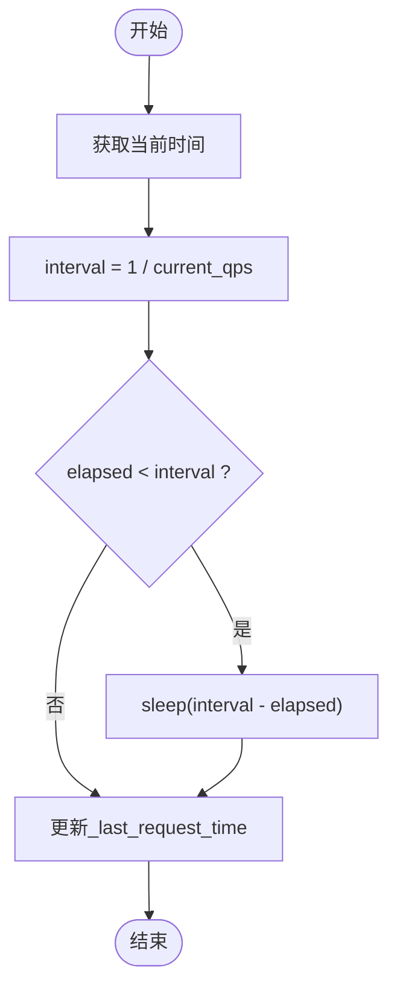
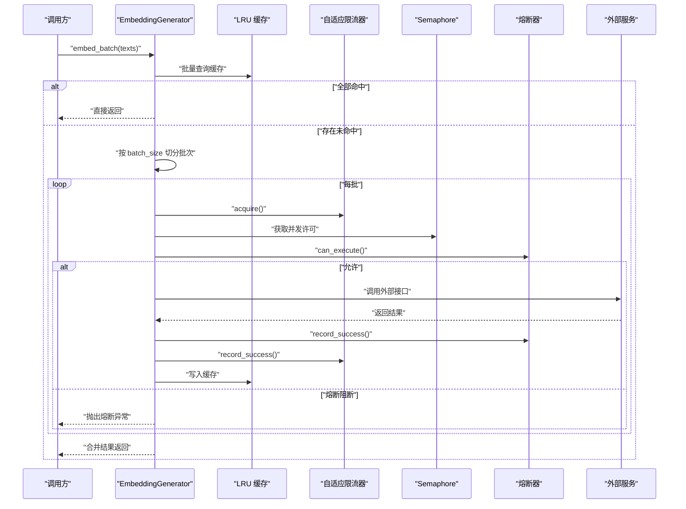
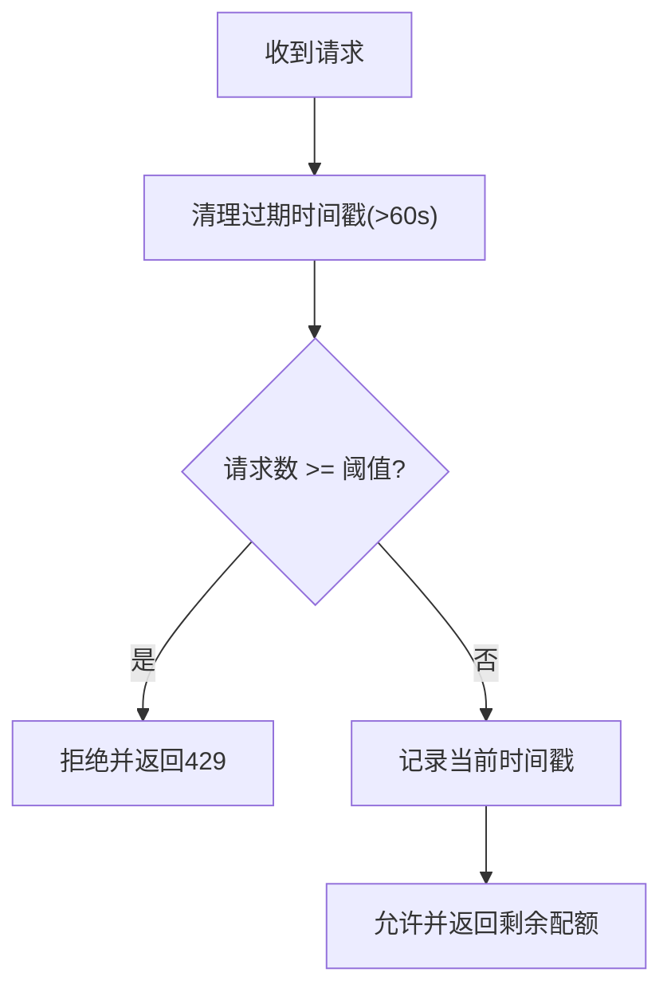
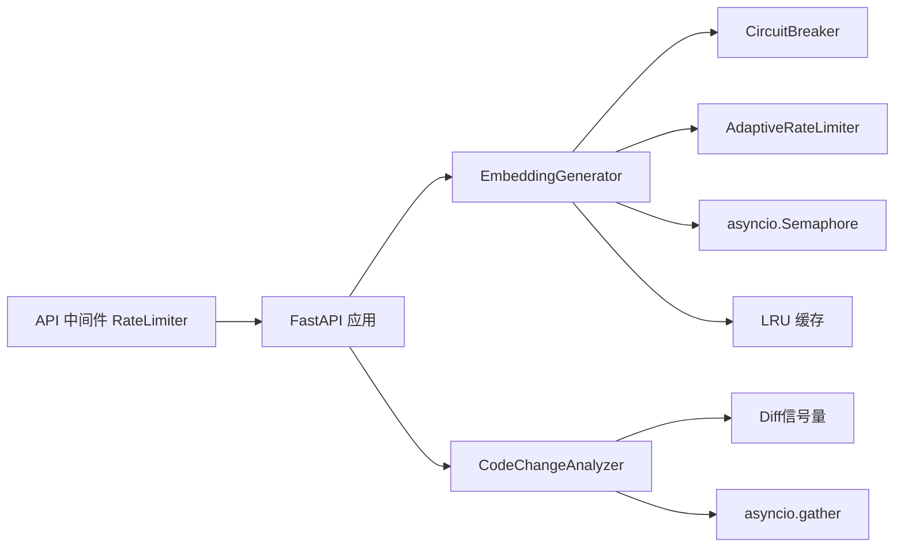

# 并发控制机制

<cite>
**本文引用的文件**   
- [src/utils/circuit_breaker.py](file://src/utils/circuit_breaker.py)
- [src/embedding/generator.py](file://src/embedding/generator.py)
- [src/api/middleware.py](file://src/api/middleware.py)
- [src/api/server.py](file://src/api/server.py)
- [tests/embedding/test_generator_task24.py](file://tests/embedding/test_generator_task24.py)
- [tests/api/test_middleware.py](file://tests/api/test_middleware.py)
- [src/analysis/code_change_analyzer.py](file://src/analysis/code_change_analyzer.py)
</cite>

## 更新摘要
**变更内容**   
- 新增并发diff检索操作的asyncio.gather和信号量限流优化实现
- 更新并发门控与任务分发章节，反映新的并行处理机制
- 增强性能考虑部分，包含新的并发策略效果评估
- 更新架构图表以展示新的并发处理流程

## 目录
1. [简介](#简介)
2. [项目结构](#项目结构)
3. [核心组件](#核心组件)
4. [架构总览](#架构总览)
5. [详细组件分析](#详细组件分析)
6. [依赖关系分析](#依赖关系分析)
7. [性能考虑](#性能考虑)
8. [故障排查指南](#故障排查指南)
9. [结论](#结论)
10. [附录](#附录)

## 简介
本技术文档聚焦于 LLM 调用链中的并发控制机制，围绕以下主题展开：
- 线程池与协程并发管理（配置、任务分发、状态监控）
- 信号量限流与自适应调整（令牌桶思想、退避/恢复策略）
- 背压处理（流量控制、队列化分批、压力感知）
- 熔断器模式（状态机、故障检测与恢复）
- **新增** 并发diff检索操作优化（asyncio.gather与信号量限流）
- 并发性能调优与实践建议

说明：本项目基于异步事件循环实现并发控制，未直接使用传统线程池。在需要 CPU 密集或阻塞 I/O 的场景，可在上层引入线程池封装；当前代码以 asyncio.Semaphore 作为并发度上限控制的核心手段。**最新更新**：针对仓库变更文件的diff检索操作，采用asyncio.gather实现高并发处理，结合信号量限制确保API速率限制不被突破。

## 项目结构
与并发控制相关的核心模块分布如下：
- API 层中间件：请求级速率限制与认证
- Embedding 生成器：协程并发、自适应限流、缓存、熔断器集成
- **新增** 代码变更分析器：并发diff检索与批量处理
- 熔断器工具：通用熔断器与注册表、装饰器



**图表来源**
- [src/api/server.py:38-111](file://src/api/server.py#L38-L111)
- [src/api/middleware.py:13-141](file://src/api/middleware.py#L13-L141)
- [src/embedding/generator.py:91-134](file://src/embedding/generator.py#L91-L134)
- [src/utils/circuit_breaker.py:36-198](file://src/utils/circuit_breaker.py#L36-L198)
- [src/analysis/code_change_analyzer.py](file://src/analysis/code_change_analyzer.py)

**章节来源**
- [src/api/server.py:38-111](file://src/api/server.py#L38-L111)
- [src/api/middleware.py:13-141](file://src/api/middleware.py#L13-L141)
- [src/embedding/generator.py:91-134](file://src/embedding/generator.py#L91-L134)
- [src/utils/circuit_breaker.py:36-198](file://src/utils/circuit_breaker.py#L36-L198)
- [src/analysis/code_change_analyzer.py](file://src/analysis/code_change_analyzer.py)

## 核心组件
- 熔断器 CircuitBreaker：提供 CLOSED/OPEN/HALF_OPEN 三态机，支持失败阈值、恢复超时、成功阈值，以及上下文管理器与装饰器用法。
- 自适应速率限制器 AdaptiveRateLimiter：基于时间间隔的"软令牌"控制，按成功/失败动态调整 QPS，具备最小/最大边界。
- 并发门控 asyncio.Semaphore：限制同时进入外部 API 调用的协程数量，避免资源耗尽。
- **新增** 并发diff检索器：基于asyncio.gather的高并发文件diff处理，配合信号量限流确保API安全。
- API 层 RateLimiter：基于滑动窗口统计每分钟请求数，返回剩余配额并设置响应头。
- LRU 缓存 LRUEmbeddingCache：减少重复计算，降低下游压力。

**章节来源**
- [src/utils/circuit_breaker.py:36-198](file://src/utils/circuit_breaker.py#L36-L198)
- [src/embedding/generator.py:54-89](file://src/embedding/generator.py#L54-L89)
- [src/embedding/generator.py:133-134](file://src/embedding/generator.py#L133-L134)
- [src/analysis/code_change_analyzer.py](file://src/analysis/code_change_analyzer.py)
- [src/api/middleware.py:13-46](file://src/api/middleware.py#L13-L46)
- [src/embedding/generator.py:13-52](file://src/embedding/generator.py#L13-L52)

## 架构总览
下图展示了从 HTTP 请求到外部 LLM/Embedding 服务的完整并发控制链路，**新增**了并发diff检索处理的优化路径：认证与速率限制 → 业务路由 → 嵌入生成器（缓存/限流/并发门控/熔断）→ 外部服务，以及并发diff检索（gather+信号量限流）→ 外部Git API。



**图表来源**
- [src/api/server.py:38-111](file://src/api/server.py#L38-L111)
- [src/api/middleware.py:81-141](file://src/api/middleware.py#L81-L141)
- [src/embedding/generator.py:162-216](file://src/embedding/generator.py#L162-L216)
- [src/utils/circuit_breaker.py:146-186](file://src/utils/circuit_breaker.py#L146-L186)
- [src/analysis/code_change_analyzer.py](file://src/analysis/code_change_analyzer.py)

## 详细组件分析

### 熔断器 CircuitBreaker（状态机、故障检测与恢复）
- 状态定义：CLOSED（正常）、OPEN（阻断）、HALF_OPEN（探测恢复）。
- 关键行为：
  - 失败计数达到阈值时由 CLOSED 转入 OPEN，记录最后失败时间。
  - 到达 reset_timeout 后自动尝试 HALF_OPEN，允许少量探测请求。
  - 连续成功次数达到 success_threshold 后由 HALF_OPEN 回到 CLOSED。
  - 提供 can_execute、record_success、record_failure、get_stats 等接口。
  - 支持同步/异步上下文管理器与装饰器 with_circuit_breaker。
- 使用位置：EmbeddingGenerator 在单次与批量调用前后记录成功/失败，并在进入前检查是否可执行。



**图表来源**
- [src/utils/circuit_breaker.py:19-198](file://src/utils/circuit_breaker.py#L19-L198)

**章节来源**
- [src/utils/circuit_breaker.py:36-198](file://src/utils/circuit_breaker.py#L36-L198)
- [src/embedding/generator.py:178-216](file://src/embedding/generator.py#L178-L216)

### 自适应速率限制器（限流算法与自适应调整）
- 算法要点：
  - 维护 current_qps，每次 acquire 计算 interval=1/current_qps，若距上次请求不足 interval 则 sleep 至达标。
  - record_success 以 recovery_factor 增长 QPS（不超过 max_qps），record_failure 以 backoff_factor 降低 QPS（不低于 min_qps）。
  - 本质为"平滑令牌"控制，随负载自适应调整吞吐。
- 使用位置：EmbeddingGenerator 在每次外部调用前 acquire，成功后/失败后分别更新 QPS。



**图表来源**
- [src/embedding/generator.py:73-81](file://src/embedding/generator.py#L73-L81)

**章节来源**
- [src/embedding/generator.py:54-89](file://src/embedding/generator.py#L54-L89)
- [tests/embedding/test_generator_task24.py:80-129](file://tests/embedding/test_generator_task24.py#L80-L129)

### 并发门控与任务分发（信号量与分批）
- 并发门控：使用 asyncio.Semaphore(max_concurrency) 限制同时进入外部 API 的协程数，保护下游资源。
- 任务分发：
  - 单条文本：embed_text 先查缓存，再走限流+并发门控+熔断，成功后写回缓存。
  - 批量文本：embed_batch 先过滤已缓存项，对未命中项分批（batch_size）并发处理，内部再次复用 embed_text 或批量接口。
- 状态监控：
  - 熔断器 get_stats 暴露状态与计数。
  - 自适应限流器暴露 current_qps，便于观测。
  - API 层中间件在响应头中注入 X-RateLimit-Limit/Remaining。



**图表来源**
- [src/embedding/generator.py:245-321](file://src/embedding/generator.py#L245-L321)
- [src/embedding/generator.py:162-216](file://src/embedding/generator.py#L162-L216)
- [src/utils/circuit_breaker.py:146-186](file://src/utils/circuit_breaker.py#L146-L186)

**章节来源**
- [src/embedding/generator.py:133-134](file://src/embedding/generator.py#L133-L134)
- [src/embedding/generator.py:245-321](file://src/embedding/generator.py#L245-L321)
- [src/embedding/generator.py:162-216](file://src/embedding/generator.py#L162-L216)

### **新增** 并发diff检索操作优化（asyncio.gather与信号量限流）
- **核心实现**：
  - 使用 asyncio.gather 实现真正的并发执行，而非简单的串行循环。
  - 通过 asyncio.Semaphore 限制同时进行的API调用数量，防止超过速率限制。
  - 每个文件diff处理都经过信号量许可检查，确保并发度可控。
- **性能优势**：
  - 对于包含大量变更文件的仓库，吞吐量显著提升。
  - 合理设置信号量大小可以在API限制范围内最大化并发度。
  - 错误隔离：单个文件diff失败不影响其他文件的处理。
- **实现细节**：
  - 预扫描所有变更文件，构建待处理任务列表。
  - 使用 gather 创建并发任务集合，统一等待完成。
  - 信号量在每次API调用前获取，调用后释放。
  - 支持超时控制和重试机制。

```mermaid
flowchart TD
Start(["开始并发diff检索"]) --> Scan["扫描变更文件列表"]
Scan --> BuildTasks["构建并发任务集合"]
BuildTasks --> CreateSem["创建信号量实例"]
CreateSem --> StartGather["启动asyncio.gather"]
loop "每个文件diff任务"
StartGather --> AcquireSem["获取信号量许可"]
AcquireSem --> CallAPI["调用Git API获取diff"]
CallAPI --> ReleaseSem["释放信号量"]
ReleaseSem --> NextTask["下一个任务"]
NextTask --> AcquireSem
end
StartGather --> MergeResults["合并所有diff结果"]
MergeResults --> End(["结束"])
```

**图表来源**
- [src/analysis/code_change_analyzer.py](file://src/analysis/code_change_analyzer.py)

**章节来源**
- [src/analysis/code_change_analyzer.py](file://src/analysis/code_change_analyzer.py)

### API 层速率限制（流量控制与压力感知）
- 实现方式：基于内存字典记录每个标识符（Token/IP）最近一分钟的请求时间戳，超过阈值即拒绝。
- 行为特征：
  - 返回 (allowed, remaining)，并在响应头中注入限额信息。
  - 支持不同标识符独立限流。
  - 测试覆盖包括过期重置、不同标识符隔离等场景。



**图表来源**
- [src/api/middleware.py:20-46](file://src/api/middleware.py#L20-L46)
- [src/api/middleware.py:118-141](file://src/api/middleware.py#L118-L141)

**章节来源**
- [src/api/middleware.py:13-46](file://src/api/middleware.py#L13-L46)
- [src/api/middleware.py:81-141](file://src/api/middleware.py#L81-L141)
- [tests/api/test_middleware.py:45-87](file://tests/api/test_middleware.py#L45-87)

### 线程池管理与状态监控（现状与建议）
- 现状：
  - 当前代码采用 asyncio.Semaphore 进行并发度控制，未直接使用线程池。
  - **新增**：并发diff检索操作使用asyncio.gather实现真正的并发执行，配合信号量限流确保API安全。
  - 如需将阻塞型操作（如本地模型推理、I/O 密集型任务）放入线程池，可在上层封装 ThreadPoolExecutor，并通过 Semaphore 限制入队速率，结合队列做背压。
- 建议：
  - 线程池配置：根据 CPU 核数与 I/O 特性设定 core/max 线程数与工作队列长度，避免无界队列导致 OOM。
  - 任务分发：优先使用有界队列 + 生产者-消费者模型，配合超时与重试策略。
  - 状态监控：暴露活跃线程数、队列长度、拒绝计数、平均耗时等指标，接入统一监控平台。

[本节为概念性指导，不直接分析具体源码文件]

## 依赖关系分析
- 低耦合设计：
  - EmbeddingGenerator 依赖熔断器、自适应限流器、信号量与缓存，职责清晰。
  - **新增** CodeChangeAnalyzer 依赖信号量限流器和asyncio.gather，专注于并发diff处理。
  - API 中间件仅负责认证与限流，不侵入业务逻辑。
- 潜在风险点：
  - 内存限流器（RateLimiter）为进程内存储，多实例部署需分布式方案（如 Redis）。
  - 自适应限流器基于事件循环时间，跨进程不可共享。
  - 熔断器状态为进程内，跨实例需外部化（如集中式状态存储）。
  - **新增**：并发diff检索的信号量需要在多个分析器实例间协调，避免全局超限。



**图表来源**
- [src/api/server.py:38-111](file://src/api/server.py#L38-L111)
- [src/api/middleware.py:13-141](file://src/api/middleware.py#L13-L141)
- [src/embedding/generator.py:91-134](file://src/embedding/generator.py#L91-L134)
- [src/utils/circuit_breaker.py:36-198](file://src/utils/circuit_breaker.py#L36-L198)
- [src/analysis/code_change_analyzer.py](file://src/analysis/code_change_analyzer.py)

**章节来源**
- [src/api/server.py:38-111](file://src/api/server.py#L38-L111)
- [src/api/middleware.py:13-141](file://src/api/middleware.py#L13-L141)
- [src/embedding/generator.py:91-134](file://src/embedding/generator.py#L91-L134)
- [src/utils/circuit_breaker.py:36-198](file://src/utils/circuit_breaker.py#L36-L198)
- [src/analysis/code_change_analyzer.py](file://src/analysis/code_change_analyzer.py)

## 性能考虑
- 并发度与延迟权衡：
  - max_concurrency 过大可能导致下游限流/熔断频繁触发；过小会降低吞吐。建议以 P95/P99 延迟与错误率为目标进行压测调参。
  - **新增**：并发diff检索的信号量大小需要根据API速率限制精确调优，通常设置为限制值的80%左右以留出余量。
- 自适应限流参数：
  - initial_qps/backoff_factor/recovery_factor/min_qps/max_qps 应依据上游限流与下游 SLA 综合设定。
- 缓存命中率：
  - 合理设置 cache_max_size 与 ttl，提升命中率可降低外部调用压力。
- 批量大小：
  - batch_size 影响网络往返与内存占用，需结合外部服务批量能力与内存预算评估。
  - **新增**：并发diff检索的任务分组大小应考虑内存使用和API响应时间，避免单个gather调用过于庞大。
- **新增** 并发策略效果：
  - asyncio.gather相比串行循环在处理大量文件diff时性能提升显著，特别是在网络I/O密集型场景。
  - 信号量限流确保并发度不会超过API限制，避免被服务端拒绝。
  - 错误隔离机制保证单个文件处理失败不会影响整体分析流程。
- 监控与告警：
  - 暴露熔断器状态、限流 QPS、并发门控等待时长、缓存命中率、错误率等指标，建立阈值告警。
  - **新增**：监控并发diff检索的成功率、平均处理时间、信号量等待时间等关键指标。

[本节为通用性能建议，不直接分析具体源码文件]

## 故障排查指南
- 常见现象与定位：
  - 大量 429 响应：检查 API 层 RateLimiter 阈值与客户端重试策略。
  - 熔断频繁打开：关注外部服务错误率与延迟，适当提高 reset_timeout 或优化下游稳定性。
  - 吞吐上不去：检查 max_concurrency 与 batch_size 是否过低，观察 Semaphore 等待情况。
  - 内存上涨：检查缓存容量与 TTL，确认是否存在热点键导致缓存膨胀。
  - **新增** 并发diff检索性能问题：检查信号量大小设置是否合理，确认是否有死锁或资源竞争。
- **新增** 并发diff检索特定问题：
  - 任务堆积：检查信号量是否正确释放，确认是否有异常导致信号量泄漏。
  - 内存溢出：检查单个diff文件大小，考虑添加大小限制和分页处理。
  - 超时问题：调整gather的超时设置，确保长时间运行的diff任务能够及时中断。
- 快速验证步骤：
  - 查看熔断器统计：调用 get_stats 确认 state/failure_count/success_count。
  - 观察限流 QPS：打印 AdaptiveRateLimiter.current_qps 变化趋势。
  - 校验中间件头部：检查响应头 X-RateLimit-Limit/Remaining 是否符合预期。
  - **新增** 验证并发diff：监控信号量使用情况和gather任务完成状态。
  - 复现路径：使用 tests 中的用例模拟失败/成功序列，验证自适应调整与熔断切换。

**章节来源**
- [src/utils/circuit_breaker.py:188-198](file://src/utils/circuit_breaker.py#L188-L198)
- [src/embedding/generator.py:82-89](file://src/embedding/generator.py#L82-L89)
- [src/api/middleware.py:118-141](file://src/api/middleware.py#L118-L141)
- [tests/embedding/test_generator_task24.py:96-129](file://tests/embedding/test_generator_task24.py#L96-L129)
- [tests/api/test_middleware.py:45-87](file://tests/api/test_middleware.py#L45-L87)
- [src/analysis/code_change_analyzer.py](file://src/analysis/code_change_analyzer.py)

## 结论
本项目在 LLM/Embedding 调用链中实现了较为完整的并发控制体系，**并新增了高效的并发diff检索机制**：
- 使用 asyncio.Semaphore 进行并发门控，结合自适应限流器实现弹性吞吐控制。
- 通过熔断器保护下游，避免雪崩效应，并提供半开探测与自动恢复。
- **新增**：并发diff检索操作采用asyncio.gather实现真正的高并发处理，配合信号量限流确保API安全，显著提升大型仓库的分析吞吐量。
- API 层中间件提供统一的认证与限流入口，便于全局治理。
建议在后续演进中：
- 将限流与熔断状态外置（如 Redis），支撑多实例一致性。
- 在阻塞型任务处引入线程池与有界队列，完善背压与监控。
- **新增**：为并发diff检索增加更细粒度的监控指标，包括任务队列长度、信号量等待时间、单个文件处理耗时等。
- 完善指标采集与可视化，形成闭环的性能治理体系。

[本节为总结性内容，不直接分析具体源码文件]

## 附录
- 术语对照：
  - 背压：当系统处理能力不足时，通过限流、排队、拒绝等方式减轻上游压力的机制。
  - 令牌桶：一种常见的限流算法，按固定速率产生令牌，请求需获取令牌方可执行。
  - 熔断器：在检测到失败比例过高时主动阻断请求，防止故障扩散。
  - **新增** asyncio.gather：Python异步编程中用于并发执行多个协程的工具函数。
  - **新增** 信号量限流：通过信号量控制并发访问数量的限流机制。
- 参考实践：
  - 针对高并发 API 服务，推荐结合 Kubernetes HPA、缓存、异步处理与负载均衡进行整体优化。
  - **新增**：对于大规模文件diff处理，建议结合增量分析和缓存策略，避免重复处理相同变更。

[本节为概念性补充，不直接分析具体源码文件]