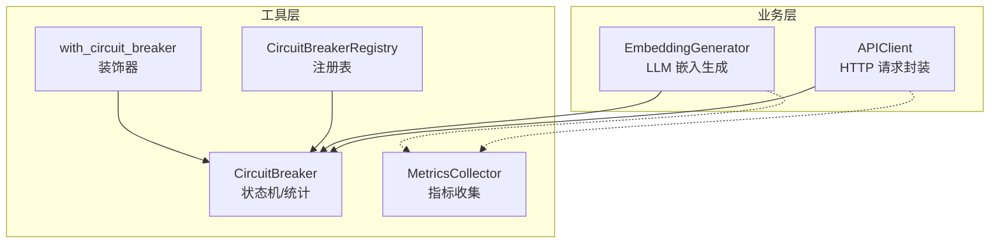
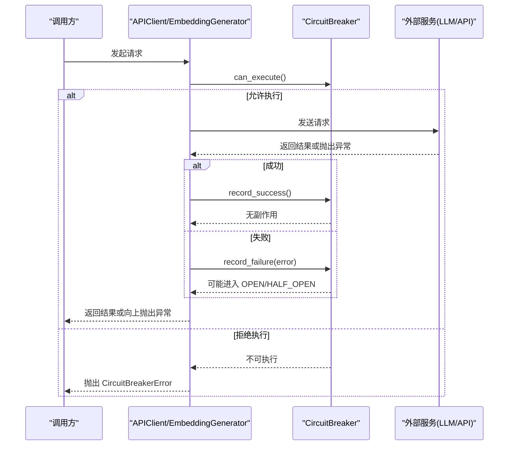
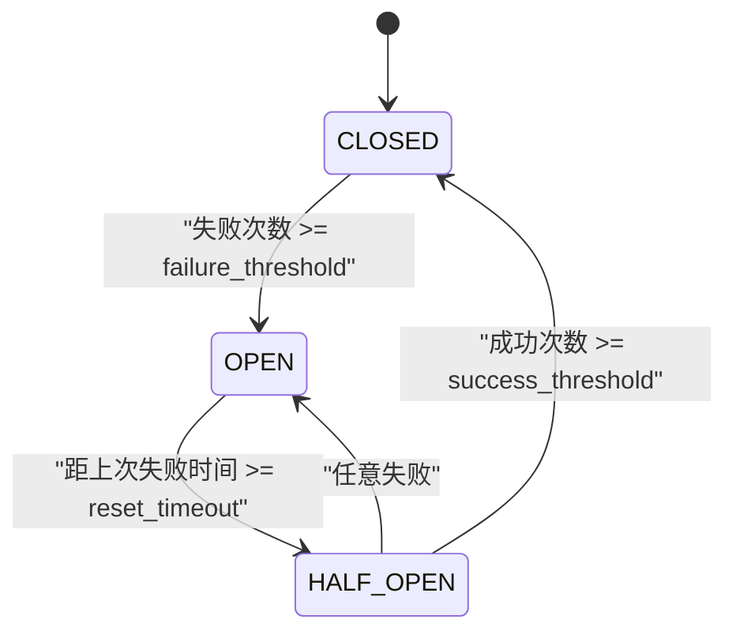
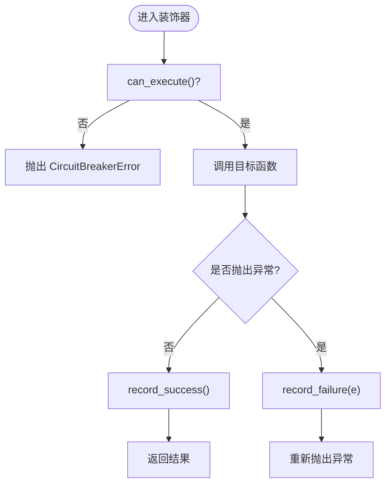
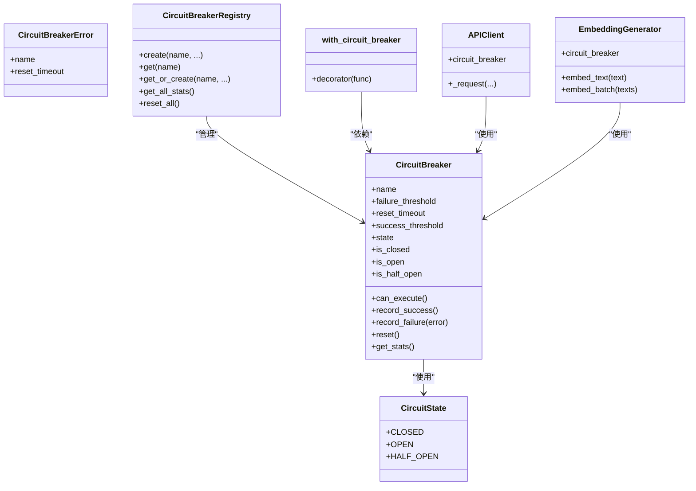

# 熔断器模式实现

<cite>
**本文引用的文件**   
- [src/utils/circuit_breaker.py](file://src/utils/circuit_breaker.py)
- [tests/utils/test_circuit_breaker.py](file://tests/utils/test_circuit_breaker.py)
- [src/api/client.py](file://src/api/client.py)
- [src/embedding/generator.py](file://src/embedding/generator.py)
- [src/utils/metrics.py](file://src/utils/metrics.py)
</cite>

## 目录
1. [简介](#简介)
2. [项目结构](#项目结构)
3. [核心组件](#核心组件)
4. [架构总览](#架构总览)
5. [详细组件分析](#详细组件分析)
6. [依赖关系分析](#依赖关系分析)
7. [性能与可扩展性](#性能与可扩展性)
8. [故障排查指南](#故障排查指南)
9. [结论](#结论)
10. [附录：配置与监控指南](#附录配置与监控指南)

## 简介
本技术文档围绕 LLM 外部调用场景的“熔断器模式”实现，系统性阐述状态机设计（CLOSED、OPEN、HALF_OPEN）、故障检测机制、恢复策略、注册表管理以及装饰器模式的实践。同时提供阈值调优建议、超时设置与监控指标对接方法，帮助读者在生产环境中稳定、可控地使用熔断器保护外部 API 与 LLM 服务。

## 项目结构
本项目将熔断器能力集中在 utils 模块中，并在 API 客户端与嵌入生成器等对外部服务有强依赖的组件中进行集成使用。测试覆盖完整的状态转换、上下文管理器与装饰器行为。

图表来源
- [src/utils/circuit_breaker.py:36-198](file://src/utils/circuit_breaker.py#L36-L198)
- [src/utils/circuit_breaker.py:201-262](file://src/utils/circuit_breaker.py#L201-L262)
- [src/utils/circuit_breaker.py:264-306](file://src/utils/circuit_breaker.py#L264-L306)
- [src/api/client.py:40-161](file://src/api/client.py#L40-L161)
- [src/embedding/generator.py:130-216](file://src/embedding/generator.py#L130-L216)
- [src/utils/metrics.py:151-252](file://src/utils/metrics.py#L151-L252)

章节来源
- [src/utils/circuit_breaker.py:36-198](file://src/utils/circuit_breaker.py#L36-L198)
- [src/api/client.py:40-161](file://src/api/client.py#L40-L161)
- [src/embedding/generator.py:130-216](file://src/embedding/generator.py#L130-L216)
- [src/utils/metrics.py:151-252](file://src/utils/metrics.py#L151-L252)

## 核心组件
- CircuitState：定义 CLOSED、OPEN、HALF_OPEN 三种状态。
- CircuitBreaker：核心状态机，维护失败计数、成功计数、最后失败时间、最近状态变更时间等；提供记录成功/失败、判断是否可执行、上下文管理器与异步上下文管理器、手动重置、统计信息导出等方法。
- CircuitBreakerError：当熔断器处于 OPEN 时抛出的异常，包含名称与重试等待时间。
- CircuitBreakerRegistry：集中管理多个熔断器实例，支持创建、获取、批量统计与批量重置。
- with_circuit_breaker：装饰器，自动对同步/异步函数进行熔断保护，内部检查 can_execute 并记录结果。

章节来源
- [src/utils/circuit_breaker.py:19-34](file://src/utils/circuit_breaker.py#L19-L34)
- [src/utils/circuit_breaker.py:36-198](file://src/utils/circuit_breaker.py#L36-L198)
- [src/utils/circuit_breaker.py:201-262](file://src/utils/circuit_breaker.py#L201-L262)
- [src/utils/circuit_breaker.py:264-306](file://src/utils/circuit_breaker.py#L264-L306)

## 架构总览
下图展示了熔断器在系统内的位置与交互方式：API 客户端与嵌入生成器在发起外部请求前检查熔断器状态，若允许则执行；成功后记录成功，失败则记录失败并根据阈值触发状态迁移。

图表来源
- [src/api/client.py:108-161](file://src/api/client.py#L108-L161)
- [src/embedding/generator.py:178-216](file://src/embedding/generator.py#L178-L216)
- [src/utils/circuit_breaker.py:146-186](file://src/utils/circuit_breaker.py#L146-L186)

## 详细组件分析

### 状态机设计与转换逻辑
- 初始状态为 CLOSED。
- CLOSED → OPEN：在 CLOSED 状态下累计失败次数达到 failure_threshold 时，立即进入 OPEN。
- OPEN → HALF_OPEN：当距离上次失败的时间超过 reset_timeout 后，下一次访问 state 属性时会尝试从 OPEN 过渡到 HALF_OPEN。
- HALF_OPEN → CLOSED：在 HALF_OPEN 状态下连续成功次数达到 success_threshold 时，回到 CLOSED，并清零失败计数与成功计数。
- HALF_OPEN → OPEN：在 HALF_OPEN 状态下任何一次失败都会立即回到 OPEN。
- CLOSED 下成功会清零失败计数，避免“偶发错误”导致误开。

图表来源
- [src/utils/circuit_breaker.py:74-144](file://src/utils/circuit_breaker.py#L74-L144)

章节来源
- [src/utils/circuit_breaker.py:74-144](file://src/utils/circuit_breaker.py#L74-L144)
- [tests/utils/test_circuit_breaker.py:36-120](file://tests/utils/test_circuit_breaker.py#L36-L120)

### 故障检测机制
- 失败计数与阈值：每次失败递增 _failure_count，并与 failure_threshold 比较决定是否打开熔断器。
- 成功复位：在 CLOSED 状态下成功会清零失败计数，体现“滑动窗口式”的容错倾向。
- 半开探测：OPEN 到达冷却期后进入 HALF_OPEN，仅放行少量探测请求以验证服务是否恢复。
- 错误类型分类：
  - 连接/超时类错误：在 API 客户端中被归类为连接错误，计入失败。
  - 服务端错误（>=500）：明确的服务端故障，计入失败。
  - 限流（429）：记录为失败但不重试，避免雪崩。
  - 认证/未找到（401/404）：不视为服务故障，直接上抛，不计入失败。
- 异常处理策略：
  - 统一通过 record_failure 上报，便于状态迁移与日志记录。
  - 上层捕获特定异常（如认证、未找到）直接返回，避免误判。

章节来源
- [src/api/client.py:108-161](file://src/api/client.py#L108-L161)
- [src/utils/circuit_breaker.py:117-144](file://src/utils/circuit_breaker.py#L117-L144)
- [tests/utils/test_circuit_breaker.py:36-120](file://tests/utils/test_circuit_breaker.py#L36-L120)

### 恢复策略
- 半开测试：OPEN 冷却结束后进入 HALF_OPEN，允许有限请求探测。
- 成功阈值判断：在 HALF_OPEN 下连续成功次数达到 success_threshold 才关闭熔断器，防止“抖动”。
- 渐进式恢复：当前实现采用固定阈值的快速闭合策略；如需更平滑的恢复，可在 HALF_OPEN 阶段引入成功率评估或指数退避探测。

章节来源
- [src/utils/circuit_breaker.py:117-144](file://src/utils/circuit_breaker.py#L117-L144)
- [tests/utils/test_circuit_breaker.py:74-110](file://tests/utils/test_circuit_breaker.py#L74-L110)

### 上下文管理器与装饰器模式
- 上下文管理器：
  - 同步/异步均支持，进入时检查 can_execute，退出时根据是否抛出异常记录成功或失败。
- 装饰器 with_circuit_breaker：
  - 自动识别同步/异步函数，包装执行流程，统一记录成功/失败，并在 OPEN 时抛出 CircuitBreakerError。

图表来源
- [src/utils/circuit_breaker.py:150-186](file://src/utils/circuit_breaker.py#L150-L186)
- [src/utils/circuit_breaker.py:264-306](file://src/utils/circuit_breaker.py#L264-L306)

章节来源
- [src/utils/circuit_breaker.py:150-186](file://src/utils/circuit_breaker.py#L150-L186)
- [src/utils/circuit_breaker.py:264-306](file://src/utils/circuit_breaker.py#L264-L306)
- [tests/utils/test_circuit_breaker.py:244-310](file://tests/utils/test_circuit_breaker.py#L244-L310)

### 注册表管理
- 功能：集中创建、获取、批量统计与批量重置熔断器实例。
- 使用场景：为不同下游服务（如 API、LLM、向量库）分别维护独立熔断器，便于分服务监控与治理。
- 线程安全：当前实现基于 dict 存储，未加锁；在高并发场景下建议增加读写锁或改用线程安全容器。

章节来源
- [src/utils/circuit_breaker.py:201-262](file://src/utils/circuit_breaker.py#L201-L262)
- [tests/utils/test_circuit_breaker.py:185-242](file://tests/utils/test_circuit_breaker.py#L185-L242)

### 集成示例：APIClient 与 EmbeddingGenerator
- APIClient：
  - 构造时默认创建名为 "api_client" 的熔断器，也可注入自定义实例。
  - 在 _request 中先检查 can_execute，再发起 HTTP 请求；根据响应码分类记录成功/失败。
- EmbeddingGenerator：
  - 构造时默认创建名为 "embedding_{provider}" 的熔断器，也可注入自定义实例。
  - 在 embed_text 与 embed_batch 路径中检查熔断器，成功后记录成功，异常时记录失败。

章节来源
- [src/api/client.py:40-161](file://src/api/client.py#L40-L161)
- [src/embedding/generator.py:130-216](file://src/embedding/generator.py#L130-L216)
- [tests/utils/test_circuit_breaker.py:312-363](file://tests/utils/test_circuit_breaker.py#L312-L363)

## 依赖关系分析
- 低耦合：熔断器作为通用工具被上层组件通过组合方式引用，不侵入业务逻辑。
- 关键依赖：
  - 日志：使用 loguru 记录状态迁移与失败事件。
  - 时间：使用 time.monotonic 计算冷却期。
  - 指标：可与 MetricsCollector 配合输出 Prometheus 格式指标。

图表来源
- [src/utils/circuit_breaker.py:19-34](file://src/utils/circuit_breaker.py#L19-L34)
- [src/utils/circuit_breaker.py:36-198](file://src/utils/circuit_breaker.py#L36-L198)
- [src/utils/circuit_breaker.py:201-262](file://src/utils/circuit_breaker.py#L201-L262)
- [src/utils/circuit_breaker.py:264-306](file://src/utils/circuit_breaker.py#L264-L306)
- [src/api/client.py:40-161](file://src/api/client.py#L40-L161)
- [src/embedding/generator.py:130-216](file://src/embedding/generator.py#L130-L216)

章节来源
- [src/utils/circuit_breaker.py:19-34](file://src/utils/circuit_breaker.py#L19-L34)
- [src/utils/circuit_breaker.py:36-198](file://src/utils/circuit_breaker.py#L36-L198)
- [src/utils/circuit_breaker.py:201-262](file://src/utils/circuit_breaker.py#L201-L262)
- [src/utils/circuit_breaker.py:264-306](file://src/utils/circuit_breaker.py#L264-L306)
- [src/api/client.py:40-161](file://src/api/client.py#L40-L161)
- [src/embedding/generator.py:130-216](file://src/embedding/generator.py#L130-L216)

## 性能与可扩展性
- 时间复杂度：
  - can_execute、record_success、record_failure 均为 O(1)。
  - get_stats 为 O(1)，get_all_stats 为 O(n)（n 为注册的熔断器数量）。
- 空间复杂度：
  - 每个熔断器维护常数级状态变量，整体 O(n)。
- 并发与线程安全：
  - 当前实现未加锁，适合单进程内使用；跨进程需结合分布式锁或外部状态存储。
- 扩展点：
  - 可接入 MetricsCollector 输出 Prometheus 指标，便于可视化与告警。
  - 可在 HALF_OPEN 阶段引入成功率评估、指数退避探测等更精细的恢复策略。

[本节为通用指导，无需列出具体文件来源]

## 故障排查指南
- 常见问题定位：
  - 频繁 OPEN：检查 failure_threshold 是否过低、网络抖动或服务端不稳定。
  - 无法恢复：确认 reset_timeout 是否合理，观察 HALF_OPEN 下的 success_threshold 是否过高。
  - 误判失败：确认 401/404 等不应计入失败的错误是否被正确分类。
- 诊断手段：
  - 使用 get_stats 查看各熔断器的状态、失败计数、阈值与最后失败时间。
  - 结合日志中的状态迁移信息与错误消息定位根因。
  - 通过装饰器或上下文管理器快速隔离问题代码段。

章节来源
- [src/utils/circuit_breaker.py:188-198](file://src/utils/circuit_breaker.py#L188-L198)
- [tests/utils/test_circuit_breaker.py:167-183](file://tests/utils/test_circuit_breaker.py#L167-L183)

## 结论
该熔断器实现以简洁清晰的状态机为核心，提供了开箱即用的上下文管理与装饰器能力，并在 API 客户端与嵌入生成器中得到良好集成。通过合理的阈值与超时配置，可有效降低外部服务故障对系统的影响，提升整体稳定性与可用性。后续可结合指标系统与更细粒度的恢复策略进一步增强可观测性与弹性。

[本节为总结性内容，无需列出具体文件来源]

## 附录：配置与监控指南

### 阈值调优建议
- failure_threshold：
  - 建议根据历史错误率与服务 SLA 设定，通常 3~10 次之间较为常见。
- reset_timeout：
  - 根据下游服务的平均恢复时间与业务容忍度设定，常见 30~120 秒。
- success_threshold：
  - 建议在 HALF_OPEN 阶段要求至少 2~3 次连续成功，避免抖动导致的反复开关。

章节来源
- [src/utils/circuit_breaker.py:56-66](file://src/utils/circuit_breaker.py#L56-L66)
- [tests/utils/test_circuit_breaker.py:74-96](file://tests/utils/test_circuit_breaker.py#L74-L96)

### 超时设置
- 外层请求超时：
  - APIClient 与 EmbeddingGenerator 均支持 timeout 参数，应与熔断器 reset_timeout 协同配置，避免长时间阻塞。
- 重试与熔断：
  - 对于 429 限流错误，建议记录失败且不重试，交由熔断器控制节奏。

章节来源
- [src/api/client.py:55-59](file://src/api/client.py#L55-L59)
- [src/api/client.py:132-140](file://src/api/client.py#L132-L140)
- [src/embedding/generator.py:195-200](file://src/embedding/generator.py#L195-L200)

### 监控指标
- 基础指标：
  - 使用 get_stats 获取 name、state、failure_count、success_count、thresholds、last_failure_time 等字段。
- 指标采集：
  - 可通过 MetricsCollector 将计数器、仪表盘、直方图导出为 Prometheus 格式，用于可视化与告警。
- 建议指标项：
  - 各熔断器状态分布（gauge）。
  - 失败/成功计数（counter）。
  - 请求耗时分布（histogram）。

章节来源
- [src/utils/circuit_breaker.py:188-198](file://src/utils/circuit_breaker.py#L188-L198)
- [src/utils/metrics.py:151-252](file://src/utils/metrics.py#L151-252)
