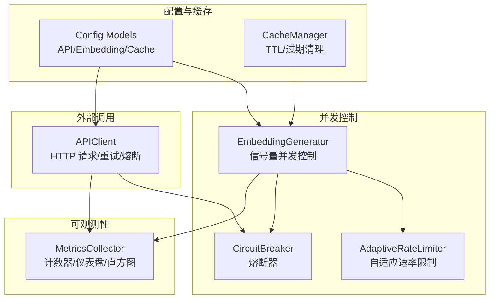
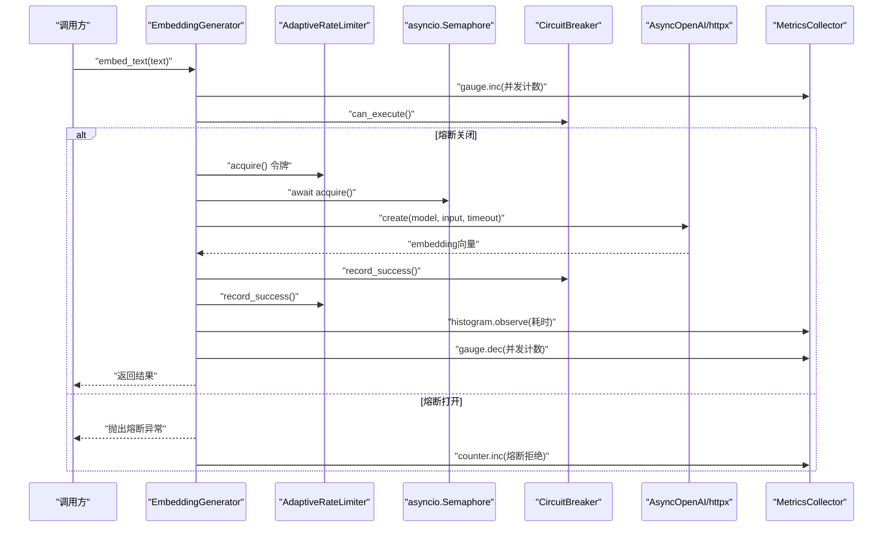
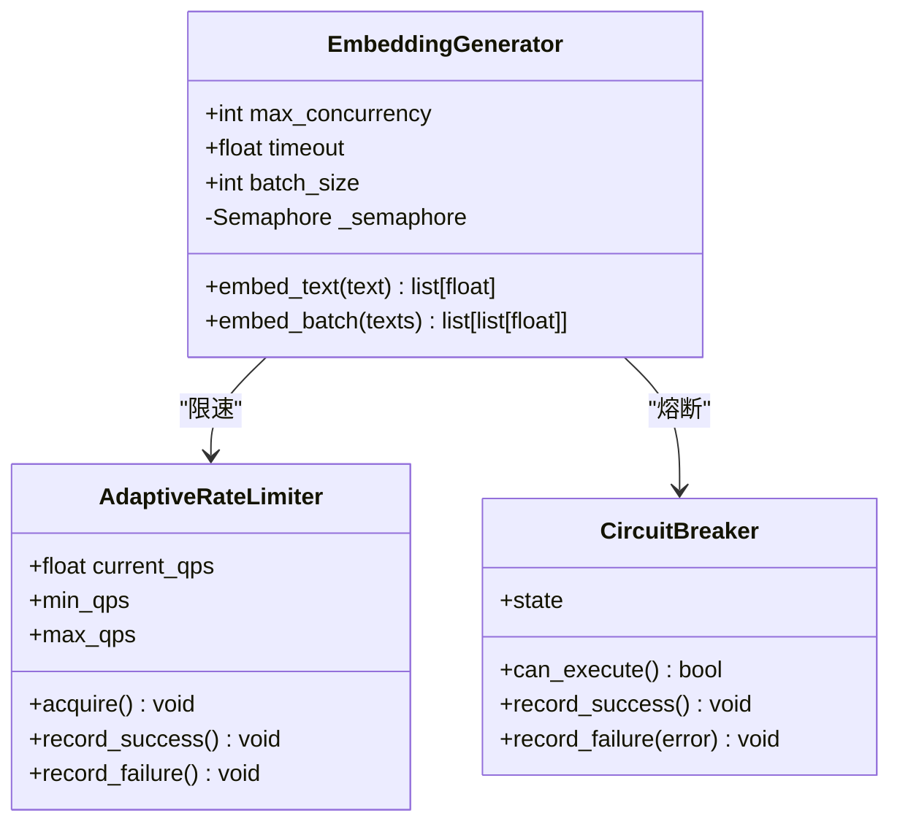
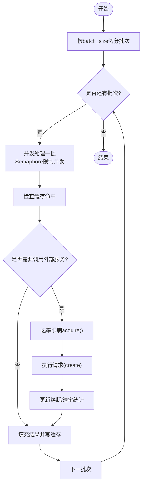
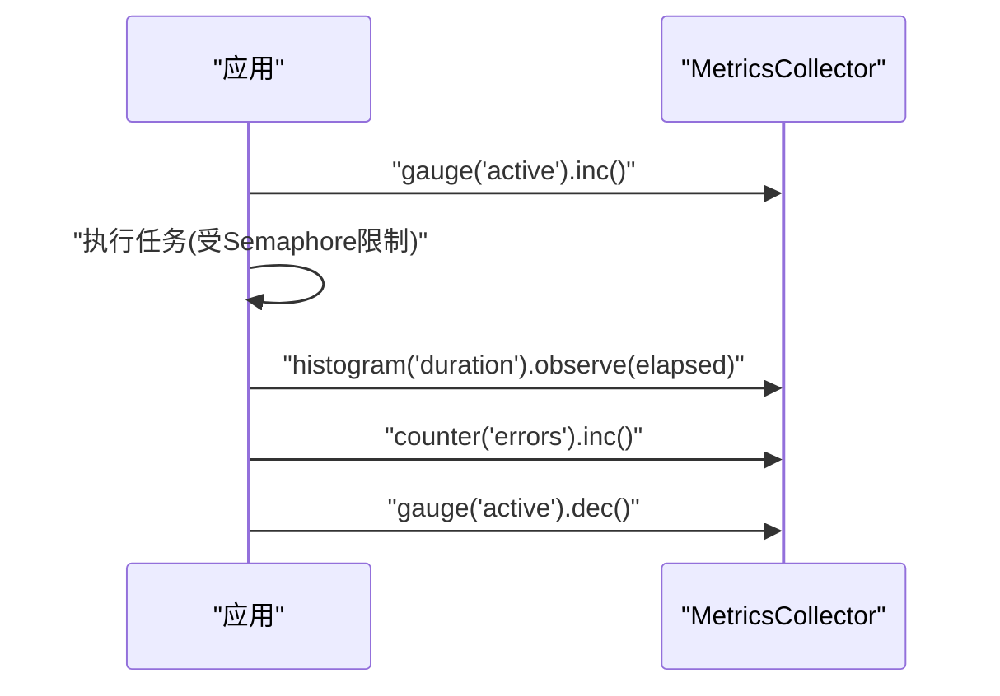
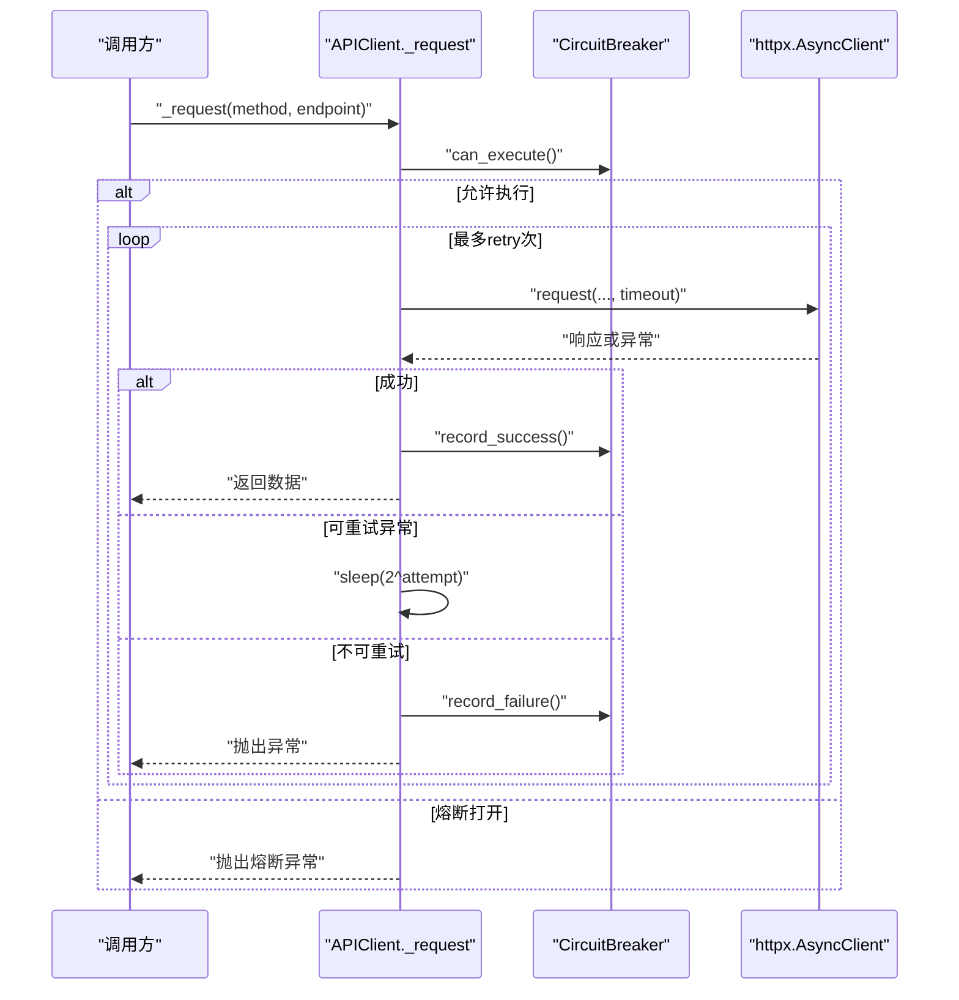
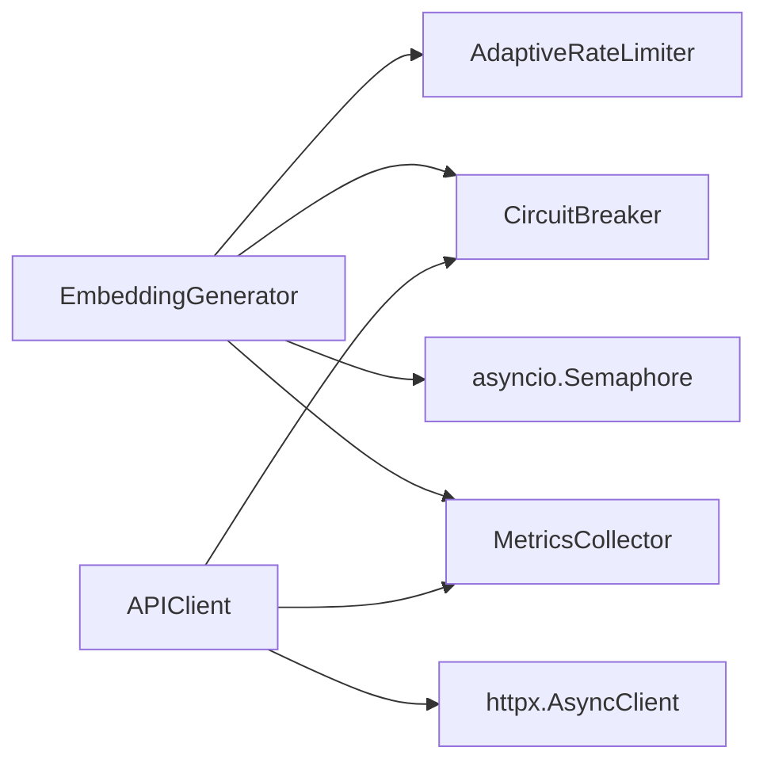

# 线程池管理

<cite>
**本文引用的文件**   
- [src/embedding/generator.py](file://src/embedding/generator.py)
- [src/api/client.py](file://src/api/client.py)
- [src/utils/circuit_breaker.py](file://src/utils/circuit_breaker.py)
- [src/utils/metrics.py](file://src/utils/metrics.py)
- [src/config/models.py](file://src/config/models.py)
- [src/cache/manager.py](file://src/cache/manager.py)
- [tests/cache/test_manager_task22.py](file://tests/cache/test_manager_task22.py)
</cite>

## 目录
1. [简介](#简介)
2. [项目结构](#项目结构)
3. [核心组件](#核心组件)
4. [架构总览](#架构总览)
5. [详细组件分析](#详细组件分析)
6. [依赖关系分析](#依赖关系分析)
7. [性能考量与调优](#性能考量与调优)
8. [故障排除指南](#故障排除指南)
9. [结论](#结论)
10. [附录](#附录)

## 简介
本技术文档聚焦于本项目中与“并发执行、任务调度与资源控制”相关的机制，围绕以下目标展开：
- 线程池配置参数说明（最大并发度、队列大小、超时策略）
- 任务分发机制（调度算法、优先级处理、负载均衡）
- 线程状态监控（活跃并发数、任务耗时、资源使用）
- 性能调优指南（内存、CPU、并发度）
- 最佳实践与故障排除

需要特别说明的是：当前代码库未实现传统意义上的“线程池”（如 Python 的 ThreadPoolExecutor），而是采用异步事件循环 + 信号量限流的方式对并发进行控制。因此，本文将以“并发控制单元”的概念替代“线程池”，并给出等价配置项与调优建议。

## 项目结构
与并发控制相关的关键模块分布如下：
- 嵌入生成与并发控制：src/embedding/generator.py
- API 客户端重试与熔断：src/api/client.py
- 熔断器通用实现：src/utils/circuit_breaker.py
- 指标收集：src/utils/metrics.py
- 配置模型：src/config/models.py
- 缓存与 TTL：src/cache/manager.py

图表来源
- [src/embedding/generator.py:91-134](file://src/embedding/generator.py#L91-L134)
- [src/api/client.py:25-47](file://src/api/client.py#L25-L47)
- [src/utils/circuit_breaker.py:36-116](file://src/utils/circuit_breaker.py#L36-L116)
- [src/utils/metrics.py:151-226](file://src/utils/metrics.py#L151-L226)
- [src/config/models.py:4-58](file://src/config/models.py#L4-L58)
- [src/cache/manager.py:59-76](file://src/cache/manager.py#L59-L76)

章节来源
- [src/embedding/generator.py:91-134](file://src/embedding/generator.py#L91-L134)
- [src/api/client.py:25-47](file://src/api/client.py#L25-L47)
- [src/utils/circuit_breaker.py:36-116](file://src/utils/circuit_breaker.py#L36-L116)
- [src/utils/metrics.py:151-226](file://src/utils/metrics.py#L151-L226)
- [src/config/models.py:4-58](file://src/config/models.py#L4-L58)
- [src/cache/manager.py:59-76](file://src/cache/manager.py#L59-L76)

## 核心组件
- 并发控制单元（替代线程池）
  - 通过 asyncio.Semaphore 控制最大并发度（等价于“最大线程数”）
  - 通过 AdaptiveRateLimiter 控制 QPS（等价于“入队速率/背压”）
  - 通过 CircuitBreaker 保护下游服务（等价于“失败隔离与快速失败”）
- 任务分发与批处理
  - embed_batch 将文本分批并发处理，内部按 batch_size 切分批次
  - 本地模式直接批量计算，避免网络开销
- 超时与重试
  - EmbeddingGenerator 支持 timeout 参数传递给底层客户端
  - APIClient 内置指数退避重试与熔断记录
- 可观测性
  - MetricsCollector 提供计数器、仪表盘、直方图，便于统计活跃并发、耗时分布等
- 配置与缓存
  - EmbeddingConfig 提供 provider/model/batch_size 等
  - CacheManager 提供 TTL 与过期清理，降低重复计算

章节来源
- [src/embedding/generator.py:91-134](file://src/embedding/generator.py#L91-L134)
- [src/embedding/generator.py:245-321](file://src/embedding/generator.py#L245-L321)
- [src/api/client.py:99-161](file://src/api/client.py#L99-L161)
- [src/utils/metrics.py:151-226](file://src/utils/metrics.py#L151-L226)
- [src/config/models.py:45-58](file://src/config/models.py#L45-L58)
- [src/cache/manager.py:59-76](file://src/cache/manager.py#L59-L76)

## 架构总览
下图展示了从上层调用到外部服务的完整路径，以及并发控制、熔断与指标采集的位置。

图表来源
- [src/embedding/generator.py:162-216](file://src/embedding/generator.py#L162-L216)
- [src/utils/circuit_breaker.py:146-148](file://src/utils/circuit_breaker.py#L146-L148)
- [src/utils/metrics.py:151-226](file://src/utils/metrics.py#L151-L226)

## 详细组件分析

### 并发控制与“线程池”等效配置
- 最大并发度（等价“最大线程数”）
  - 由 EmbeddingGenerator.max_concurrency 决定，内部使用 asyncio.Semaphore(max_concurrency) 限制同时进入临界区的协程数量
- 队列大小（等价“任务队列容量”）
  - 当前未显式实现有界队列；可通过外层包装一个 asyncio.Queue(maxsize=...) 实现背压与限长队列
- 超时策略（等价“任务超时/连接超时”）
  - EmbeddingGenerator.timeout 传入底层客户端；APIClient.timeout 用于 HTTP 层
- 速率限制（等价“入队速率/令牌桶”）
  - AdaptiveRateLimiter 基于 current_qps 动态调整最小间隔，失败时回退、成功时恢复

图表来源
- [src/embedding/generator.py:91-134](file://src/embedding/generator.py#L91-L134)
- [src/embedding/generator.py:54-88](file://src/embedding/generator.py#L54-L88)
- [src/utils/circuit_breaker.py:36-116](file://src/utils/circuit_breaker.py#L36-L116)

章节来源
- [src/embedding/generator.py:91-134](file://src/embedding/generator.py#L91-L134)
- [src/embedding/generator.py:54-88](file://src/embedding/generator.py#L54-L88)
- [src/utils/circuit_breaker.py:36-116](file://src/utils/circuit_breaker.py#L36-L116)

### 任务分发机制（调度算法、优先级、负载均衡）
- 调度算法
  - 当前为“顺序分批 + 并发上限”：embed_batch 按 batch_size 切分批次，逐批调用内部并发方法；每批内受 Semaphore 限制并发
- 优先级处理
  - 当前未实现优先级队列；可在外层使用带优先级的 asyncio.PriorityQueue 或自定义调度器
- 负载均衡
  - 单实例场景下无多节点负载；若扩展为多实例，可结合消息队列（如 Redis/RabbitMQ）做任务分发与消费端并行

图表来源
- [src/embedding/generator.py:245-321](file://src/embedding/generator.py#L245-L321)
- [src/embedding/generator.py:162-216](file://src/embedding/generator.py#L162-L216)

章节来源
- [src/embedding/generator.py:245-321](file://src/embedding/generator.py#L245-L321)
- [src/embedding/generator.py:162-216](file://src/embedding/generator.py#L162-L216)

### 线程状态监控（活跃并发、耗时、资源使用）
- 活跃并发
  - 可使用 MetricsCollector.gauge("active_concurrency") 在 enter/exit 临界区前后 inc/dec
- 任务耗时
  - 使用 MetricsCollector.histogram("task_duration_seconds") 记录端到端耗时
- 资源使用
  - 可结合系统级指标（CPU、内存、I/O）与业务指标（QPS、错误率、熔断次数）综合评估

图表来源
- [src/utils/metrics.py:151-226](file://src/utils/metrics.py#L151-L226)

章节来源
- [src/utils/metrics.py:151-226](file://src/utils/metrics.py#L151-L226)

### 超时与重试（APIClient）
- 超时
  - APIClient.__init__ 中设置 timeout，httpx.AsyncClient 使用该值作为默认请求超时
- 重试
  - _request 内部对连接错误和超时进行指数退避重试，并对特定状态码（401/404/429/5xx）分类处理
- 熔断
  - 每次请求前检查熔断状态，失败时记录，达到阈值后打开熔断

图表来源
- [src/api/client.py:99-161](file://src/api/client.py#L99-L161)
- [src/utils/circuit_breaker.py:146-148](file://src/utils/circuit_breaker.py#L146-L148)

章节来源
- [src/api/client.py:99-161](file://src/api/client.py#L99-L161)
- [src/utils/circuit_breaker.py:146-148](file://src/utils/circuit_breaker.py#L146-L148)

### 配置参数参考（与并发/超时相关）
- EmbeddingConfig
  - provider/model/base_url：选择后端与模型
  - batch_size：批量处理时的单次批大小
- APIConfig
  - timeout：HTTP 请求超时
  - retry：重试次数
- CacheConfig
  - ttl：缓存过期时间（秒）

章节来源
- [src/config/models.py:4-58](file://src/config/models.py#L4-L58)
- [src/config/models.py:84-96](file://src/config/models.py#L84-L96)

## 依赖关系分析
- EmbeddingGenerator 依赖
  - AdaptiveRateLimiter：控制入站速率
  - CircuitBreaker：保护下游服务
  - asyncio.Semaphore：并发上限
- APIClient 依赖
  - httpx.AsyncClient：HTTP 客户端
  - CircuitBreaker：熔断保护
- 可观测性
  - MetricsCollector：统一指标出口

图表来源
- [src/embedding/generator.py:91-134](file://src/embedding/generator.py#L91-L134)
- [src/api/client.py:25-47](file://src/api/client.py#L25-L47)
- [src/utils/metrics.py:151-226](file://src/utils/metrics.py#L151-L226)

章节来源
- [src/embedding/generator.py:91-134](file://src/embedding/generator.py#L91-L134)
- [src/api/client.py:25-47](file://src/api/client.py#L25-L47)
- [src/utils/metrics.py:151-226](file://src/utils/metrics.py#L151-L226)

## 性能考量与调优
- 并发度（等价“最大线程数”）
  - 建议以 CPU 密集型与 I/O 密集型的不同特征分别调优；对于 LLM 调用（I/O 为主），可适当提高并发，但需配合速率限制与熔断
- 队列大小（等价“任务队列容量”）
  - 当前未实现有界队列；如需强背压，可在上层引入 asyncio.Queue(maxsize=N)，并在生产者侧根据消费者能力动态调节
- 超时策略
  - 合理设置 EmbeddingGenerator.timeout 与 APIClient.timeout，避免长时间占用资源；结合熔断快速失败
- 速率限制
  - 根据下游 QPS 限制与错误率动态调整 current_qps；失败时回退、成功时恢复
- 缓存命中率
  - 启用 LRU 缓存与 TTL，减少重复计算；测试覆盖 TTL 精确过期与清理性能
- 指标驱动优化
  - 使用 MetricsCollector 持续观察 P50/P95/P99 耗时、错误率、熔断次数、活跃并发等，指导参数回归

章节来源
- [src/embedding/generator.py:91-134](file://src/embedding/generator.py#L91-L134)
- [src/api/client.py:99-161](file://src/api/client.py#L99-L161)
- [tests/cache/test_manager_task22.py:28-63](file://tests/cache/test_manager_task22.py#L28-L63)
- [src/utils/metrics.py:151-226](file://src/utils/metrics.py#L151-L226)

## 故障排除指南
- 熔断频繁打开
  - 检查下游服务健康与错误日志；适当增大 reset_timeout 或 success_threshold
  - 关注 APIClient 的状态码分类与重试策略
- 请求超时
  - 调整 timeout；检查网络与下游延迟；必要时增加重试次数
- 速率限制导致吞吐下降
  - 观察 current_qps 变化趋势；确认 backoff/recovery 因子是否合适
- 缓存未命中或过期过快
  - 校验 TTL 配置；验证清理逻辑与过期判断
- 指标缺失
  - 确保在关键路径埋点（并发、耗时、错误、熔断拒绝）

章节来源
- [src/api/client.py:99-161](file://src/api/client.py#L99-L161)
- [src/utils/circuit_breaker.py:117-148](file://src/utils/circuit_breaker.py#L117-L148)
- [src/cache/manager.py:59-76](file://src/cache/manager.py#L59-L76)
- [tests/cache/test_manager_task22.py:146-166](file://tests/cache/test_manager_task22.py#L146-L166)

## 结论
本项目采用“异步 + 信号量 + 速率限制 + 熔断”的组合实现高可用的并发控制，虽未直接使用传统线程池，但在功能上等价并可灵活扩展。通过合理的配置与指标驱动调优，可在保证稳定性的前提下提升吞吐与稳定性。

## 附录
- 可扩展方向
  - 引入有界队列与优先级队列，实现更精细的任务调度
  - 多实例部署下的分布式任务分发与负载均衡
  - 集成 Prometheus/Grafana 可视化指标面板
