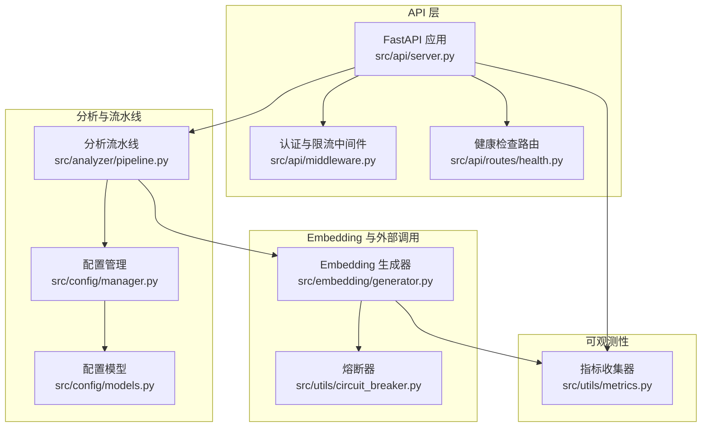
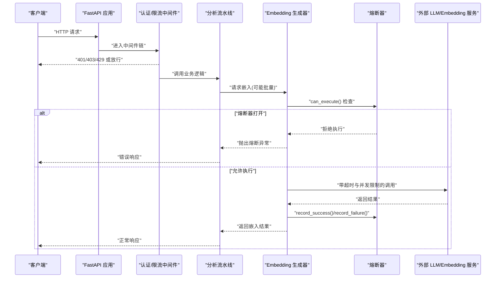
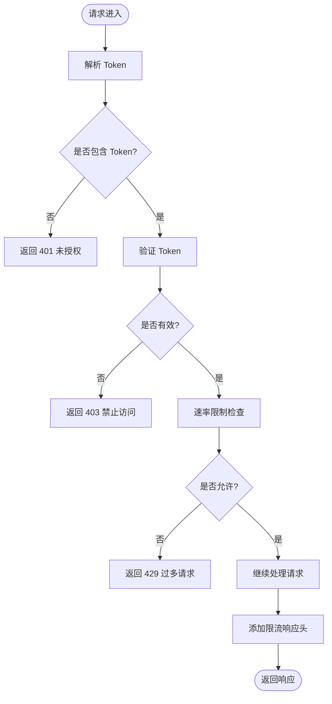
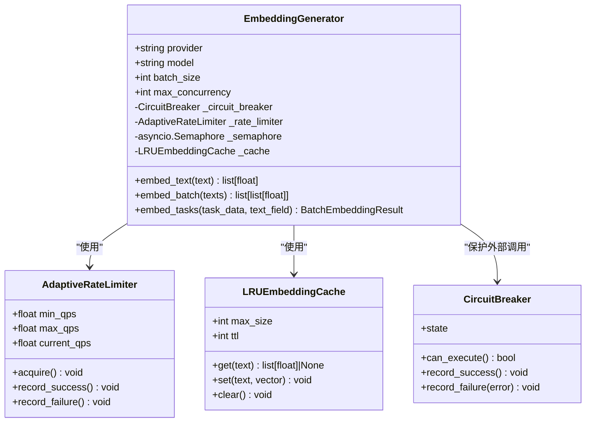
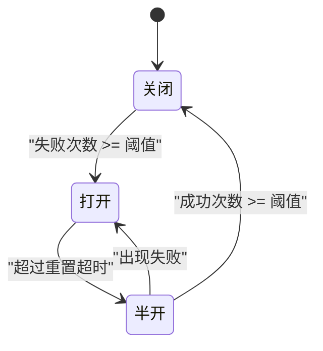
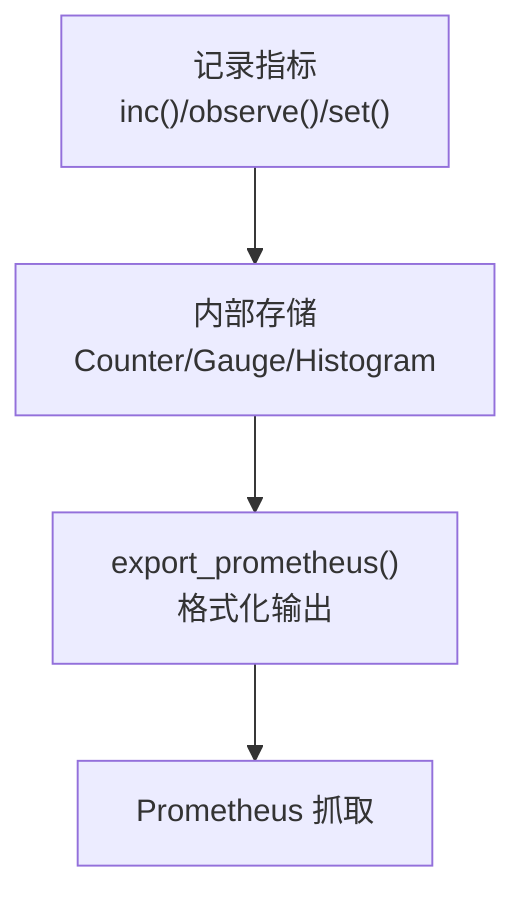
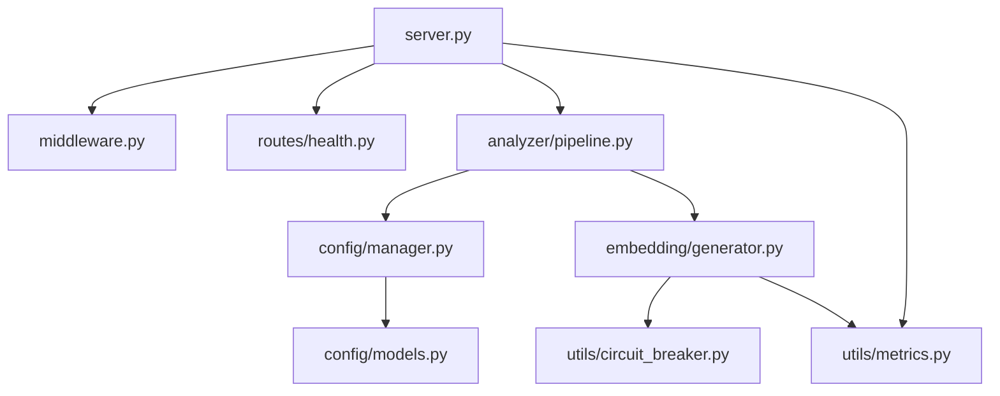

# 背压处理机制

<cite>
**本文引用的文件**   
- [src/api/server.py](file://src/api/server.py)
- [src/api/middleware.py](file://src/api/middleware.py)
- [src/embedding/generator.py](file://src/embedding/generator.py)
- [src/utils/circuit_breaker.py](file://src/utils/circuit_breaker.py)
- [src/analyzer/pipeline.py](file://src/analyzer/pipeline.py)
- [src/config/models.py](file://src/config/models.py)
- [src/config/manager.py](file://src/config/manager.py)
- [src/utils/metrics.py](file://src/utils/metrics.py)
- [src/api/routes/health.py](file://src/api/routes/health.py)
</cite>

## 目录
1. [简介](#简介)
2. [项目结构](#项目结构)
3. [核心组件](#核心组件)
4. [架构总览](#架构总览)
5. [详细组件分析](#详细组件分析)
6. [依赖关系分析](#依赖关系分析)
7. [性能与调优指南](#性能与调优指南)
8. [故障排查指南](#故障排查指南)
9. [结论](#结论)
10. [附录](#附录)

## 简介
本技术文档围绕 LLM 背压处理机制，系统化阐述流量控制策略（请求速率限制、响应时间控制、资源占用监控）、队列管理机制（阻塞队列实现、优先级队列、死信队列处理）、压力感知系统（系统负载检测、自动降级策略、服务熔断触发），并提供背压调优指南（队列深度配置、超时策略设置、内存使用优化）以及高并发场景下的最佳实践与性能监控方案。

本项目在现有代码中已具备以下与背压相关的核心能力：
- API 层速率限制与认证中间件
- Embedding 层的自适应速率限制器、信号量并发控制、LRU 缓存
- 通用熔断器模式实现与注册表
- 指标采集与 Prometheus 导出能力
- 健康检查端点用于外部探测

## 项目结构
下图展示了与背压相关的关键模块及其交互关系。

**图表来源** 
- [src/api/server.py:38-111](file://src/api/server.py#L38-L111)
- [src/api/middleware.py:13-141](file://src/api/middleware.py#L13-L141)
- [src/api/routes/health.py:10-22](file://src/api/routes/health.py#L10-L22)
- [src/analyzer/pipeline.py:66-182](file://src/analyzer/pipeline.py#L66-L182)
- [src/config/manager.py:42-117](file://src/config/manager.py#L42-L117)
- [src/config/models.py:4-144](file://src/config/models.py#L4-L144)
- [src/embedding/generator.py:91-216](file://src/embedding/generator.py#L91-L216)
- [src/utils/circuit_breaker.py:36-198](file://src/utils/circuit_breaker.py#L36-L198)
- [src/utils/metrics.py:151-251](file://src/utils/metrics.py#L151-L251)

**章节来源**
- [src/api/server.py:38-111](file://src/api/server.py#L38-L111)
- [src/api/middleware.py:13-141](file://src/api/middleware.py#L13-L141)
- [src/embedding/generator.py:91-216](file://src/embedding/generator.py#L91-L216)
- [src/utils/circuit_breaker.py:36-198](file://src/utils/circuit_breaker.py#L36-L198)
- [src/analyzer/pipeline.py:66-182](file://src/analyzer/pipeline.py#L66-L182)
- [src/config/manager.py:42-117](file://src/config/manager.py#L42-L117)
- [src/config/models.py:4-144](file://src/config/models.py#L4-L144)
- [src/utils/metrics.py:151-251](file://src/utils/metrics.py#L151-L251)
- [src/api/routes/health.py:10-22](file://src/api/routes/health.py#L10-L22)

## 核心组件
- API 层速率限制与认证
  - 基于令牌/IP 的每分钟请求计数窗口，返回剩余配额与 429 状态码。
  - 支持 Token 校验与日志记录中间件。
- Embedding 层自适应速率限制与并发控制
  - 自适应 QPS 调整（失败退避、成功恢复）。
  - asyncio.Semaphore 并发上限控制。
  - LRU 向量缓存减少重复计算。
- 熔断器模式
  - 三态机（关闭/半开/打开），阈值与超时控制，统计信息导出。
- 指标采集
  - Counter/Gauge/Histogram 三类指标，Prometheus 格式导出。
- 健康检查
  - /health 端点用于负载均衡与健康探测。

**章节来源**
- [src/api/middleware.py:13-141](file://src/api/middleware.py#L13-L141)
- [src/embedding/generator.py:54-216](file://src/embedding/generator.py#L54-L216)
- [src/utils/circuit_breaker.py:36-198](file://src/utils/circuit_breaker.py#L36-L198)
- [src/utils/metrics.py:151-251](file://src/utils/metrics.py#L151-L251)
- [src/api/routes/health.py:10-22](file://src/api/routes/health.py#L10-L22)

## 架构总览
下图展示从 HTTP 请求进入，到嵌入生成与外部 API 调用的完整链路，并标注背压控制点。

**图表来源** 
- [src/api/server.py:38-111](file://src/api/server.py#L38-L111)
- [src/api/middleware.py:81-141](file://src/api/middleware.py#L81-L141)
- [src/analyzer/pipeline.py:171-182](file://src/analyzer/pipeline.py#L171-L182)
- [src/embedding/generator.py:162-216](file://src/embedding/generator.py#L162-L216)
- [src/utils/circuit_breaker.py:146-198](file://src/utils/circuit_breaker.py#L146-L198)

## 详细组件分析

### 组件一：API 层速率限制与认证
- 功能要点
  - 基于每分钟的滑动窗口统计每个标识符的请求次数，超过阈值返回 429。
  - 支持 Token 校验，未提供或无效时返回 401/403。
  - 在响应头中附加 X-RateLimit-Limit/X-RateLimit-Remaining。
- 关键流程
  - 请求进入中间件 -> 解析 Token -> 校验 -> 速率限制 -> 继续处理 -> 附加限流头。

**图表来源** 
- [src/api/middleware.py:81-141](file://src/api/middleware.py#L81-L141)

**章节来源**
- [src/api/middleware.py:13-141](file://src/api/middleware.py#L13-L141)

### 组件二：Embedding 自适应速率限制与并发控制
- 自适应速率限制器
  - 根据成功/失败动态调整当前 QPS，并在 acquire 时进行 sleep 保证不超过目标 QPS。
- 并发控制
  - 使用 asyncio.Semaphore 限制最大并发数，避免下游过载。
- 缓存
  - LRU 缓存文本到向量的映射，TTL 过期清理，降低重复计算。
- 熔断集成
  - 在发起外部调用前检查熔断器状态，失败时记录失败并触发退避。

**图表来源** 
- [src/embedding/generator.py:54-216](file://src/embedding/generator.py#L54-L216)
- [src/utils/circuit_breaker.py:36-198](file://src/utils/circuit_breaker.py#L36-L198)

**章节来源**
- [src/embedding/generator.py:54-216](file://src/embedding/generator.py#L54-L216)
- [src/utils/circuit_breaker.py:36-198](file://src/utils/circuit_breaker.py#L36-L198)

### 组件三：熔断器模式
- 状态机
  - CLOSED：正常运行，请求通过。
  - OPEN：失败阈值达到，阻断请求。
  - HALF_OPEN：尝试恢复，成功后闭合。
- 关键参数
  - failure_threshold：失败阈值
  - reset_timeout：重置等待时间
  - success_threshold：半开状态下成功次数阈值
- 统计与装饰器
  - get_stats 输出内部状态
  - with_circuit_breaker 装饰器简化封装

**图表来源** 
- [src/utils/circuit_breaker.py:19-144](file://src/utils/circuit_breaker.py#L19-L144)

**章节来源**
- [src/utils/circuit_breaker.py:36-198](file://src/utils/circuit_breaker.py#L36-L198)

### 组件四：指标采集与 Prometheus 导出
- 指标类型
  - Counter：累计值（如请求总数、错误数）
  - Gauge：瞬时值（如活跃连接数、队列长度）
  - Histogram：分布值（如响应时间分桶）
- 导出格式
  - 标准 Prometheus 文本协议，含 TYPE 注释、标签与时间戳。

**图表来源** 
- [src/utils/metrics.py:151-251](file://src/utils/metrics.py#L151-L251)

**章节来源**
- [src/utils/metrics.py:151-251](file://src/utils/metrics.py#L151-L251)

### 组件五：健康检查
- /health 端点返回服务健康状态，便于负载均衡与健康探测。

**章节来源**
- [src/api/routes/health.py:10-22](file://src/api/routes/health.py#L10-L22)

## 依赖关系分析
- 耦合与内聚
  - API 层与中间件低耦合，通过中间件统一接入限流与认证。
  - 分析流水线依赖配置管理与外部客户端，对 Embedding 生成器解耦良好。
  - Embedding 生成器内聚了速率限制、并发控制、缓存与熔断，职责清晰。
- 直接/间接依赖
  - server.py -> middleware.py -> pipeline.py -> embedding/generator.py -> circuit_breaker.py
  - metrics.py 被多处引用以采集指标
- 外部依赖
  - OpenAI/第三方 Embedding 服务，受熔断与速率限制保护

**图表来源** 
- [src/api/server.py:38-111](file://src/api/server.py#L38-L111)
- [src/api/middleware.py:81-141](file://src/api/middleware.py#L81-L141)
- [src/analyzer/pipeline.py:66-182](file://src/analyzer/pipeline.py#L66-L182)
- [src/config/manager.py:42-117](file://src/config/manager.py#L42-L117)
- [src/config/models.py:4-144](file://src/config/models.py#L4-L144)
- [src/embedding/generator.py:91-216](file://src/embedding/generator.py#L91-L216)
- [src/utils/circuit_breaker.py:36-198](file://src/utils/circuit_breaker.py#L36-L198)
- [src/utils/metrics.py:151-251](file://src/utils/metrics.py#L151-L251)

**章节来源**
- [src/api/server.py:38-111](file://src/api/server.py#L38-L111)
- [src/api/middleware.py:81-141](file://src/api/middleware.py#L81-L141)
- [src/analyzer/pipeline.py:66-182](file://src/analyzer/pipeline.py#L66-L182)
- [src/config/manager.py:42-117](file://src/config/manager.py#L42-L117)
- [src/config/models.py:4-144](file://src/config/models.py#L4-L144)
- [src/embedding/generator.py:91-216](file://src/embedding/generator.py#L91-L216)
- [src/utils/circuit_breaker.py:36-198](file://src/utils/circuit_breaker.py#L36-L198)
- [src/utils/metrics.py:151-251](file://src/utils/metrics.py#L151-L251)

## 性能与调优指南

### 流量控制策略
- 请求速率限制
  - API 层：按分钟窗口限制，建议结合业务峰值与下游配额设置合理阈值。
  - Embedding 层：自适应 QPS，初始 QPS 不宜过高，失败退避因子与恢复因子需平衡稳定性与吞吐。
- 响应时间控制
  - 为外部调用设置合理的 timeout；在批处理中采用分批并发，避免长尾拖垮整体。
- 资源占用监控
  - 使用 Gauge 跟踪活跃请求、队列长度、内存占用等；Histogram 跟踪响应时间分布。

**章节来源**
- [src/api/middleware.py:13-141](file://src/api/middleware.py#L13-L141)
- [src/embedding/generator.py:54-216](file://src/embedding/generator.py#L54-L216)
- [src/utils/metrics.py:151-251](file://src/utils/metrics.py#L151-L251)

### 队列管理机制
- 阻塞队列实现
  - 当前代码未显式实现阻塞队列；可通过 asyncio.Queue 在流水线或任务调度处引入，配合 Semaphore 控制并发。
- 优先级队列
  - 可使用 heapq 或优先队列包装 asyncio.Queue，按任务紧急度排序。
- 死信队列处理
  - 对于多次失败的任务，建议持久化至独立存储（SQLite/文件），并建立重试与告警机制。

[本节为概念性说明，不直接分析具体文件，故无“章节来源”]

### 压力感知系统
- 系统负载检测
  - 通过指标采集活跃请求数、响应时间分位、错误率等，结合健康检查端点进行探测。
- 自动降级策略
  - 当错误率或延迟超阈时，可临时关闭非核心步骤（如报告生成、深度根因分析），仅保留必要路径。
- 服务熔断触发
  - 基于熔断器状态与统计信息，在 API 层或上游编排处快速短路，避免雪崩。

**章节来源**
- [src/utils/metrics.py:151-251](file://src/utils/metrics.py#L151-L251)
- [src/utils/circuit_breaker.py:36-198](file://src/utils/circuit_breaker.py#L36-L198)
- [src/api/routes/health.py:10-22](file://src/api/routes/health.py#L10-L22)

### 背压调优指南
- 队列深度配置
  - 若引入队列，建议根据 CPU/IO 瓶颈与下游容量设定合理深度，避免 OOM。
- 超时策略设置
  - 为外部调用设置短超时与重试上限，结合熔断器防止级联失败。
- 内存使用优化
  - 启用 LRU 缓存并设置合理 TTL 与最大条目数；批处理时控制 batch_size 与并发度。

**章节来源**
- [src/embedding/generator.py:13-52](file://src/embedding/generator.py#L13-L52)
- [src/embedding/generator.py:91-216](file://src/embedding/generator.py#L91-L216)
- [src/config/models.py:4-144](file://src/config/models.py#L4-L144)

### 高并发最佳实践
- 并发控制
  - 使用信号量限制并发，避免下游过载；批处理分片并行。
- 缓存与去重
  - 利用 LRU 缓存减少重复计算；对相同输入做幂等处理。
- 可观测性
  - 全链路记录指标与日志，暴露 Prometheus 接口，结合告警规则及时干预。

**章节来源**
- [src/embedding/generator.py:91-216](file://src/embedding/generator.py#L91-L216)
- [src/utils/metrics.py:151-251](file://src/utils/metrics.py#L151-L251)

## 故障排查指南
- 常见问题定位
  - 429 过多请求：检查 API 层限流阈值与客户端重试策略。
  - 熔断器频繁打开：关注下游错误率与超时，适当提高 reset_timeout 或降低 failure_threshold。
  - 响应时间升高：查看 Histogram 分位，定位慢请求与热点路径。
- 诊断手段
  - 通过 /health 确认服务可用性。
  - 导出 Prometheus 指标，观察错误率、延迟、活跃请求等趋势。
  - 结合日志中间件的时间戳与耗时字段定位瓶颈。

**章节来源**
- [src/api/middleware.py:81-141](file://src/api/middleware.py#L81-L141)
- [src/utils/circuit_breaker.py:188-198](file://src/utils/circuit_breaker.py#L188-L198)
- [src/utils/metrics.py:190-226](file://src/utils/metrics.py#L190-L226)
- [src/api/routes/health.py:10-22](file://src/api/routes/health.py#L10-L22)

## 结论
本项目在 API 层与 Embedding 层实现了有效的背压基础能力：限流、并发控制、熔断与指标采集。为进一步增强背压体系，建议在流水线与任务调度层引入阻塞/优先级队列与死信队列，完善压力感知与自动降级策略，并通过 Prometheus 与告警形成闭环监控。

[本节为总结性内容，不直接分析具体文件，故无“章节来源”]

## 附录
- 配置项参考
  - APIConfig：base_url、timeout、retry、api_key、api_path_prefix
  - EmbeddingConfig：provider、model、api_key、base_url、batch_size
  - CacheConfig：enabled、ttl、storage、db_path
  - LoggingConfig：level、format、file

**章节来源**
- [src/config/models.py:4-144](file://src/config/models.py#L4-L144)
