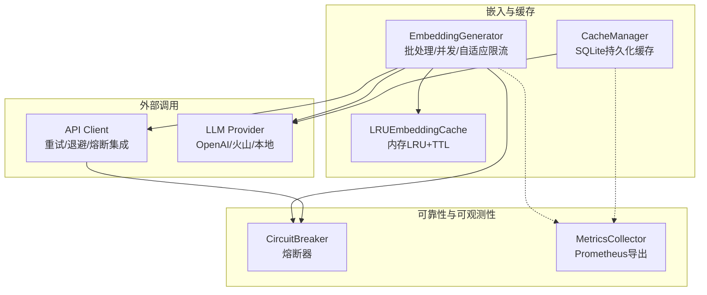
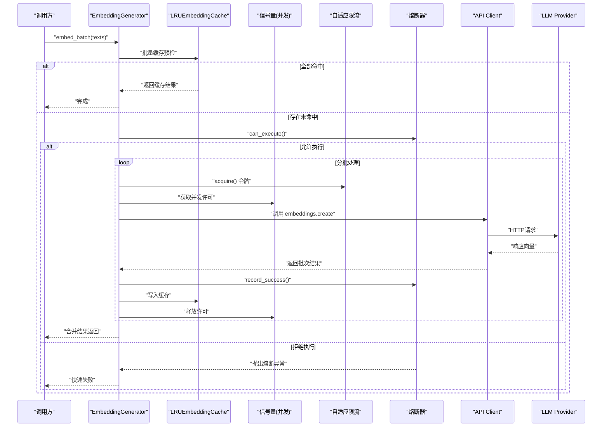
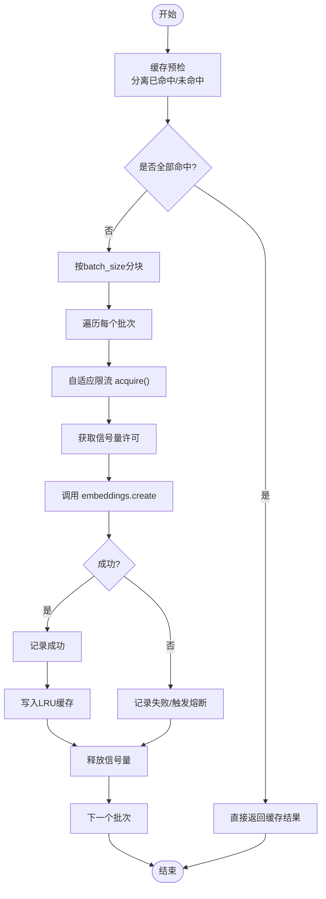
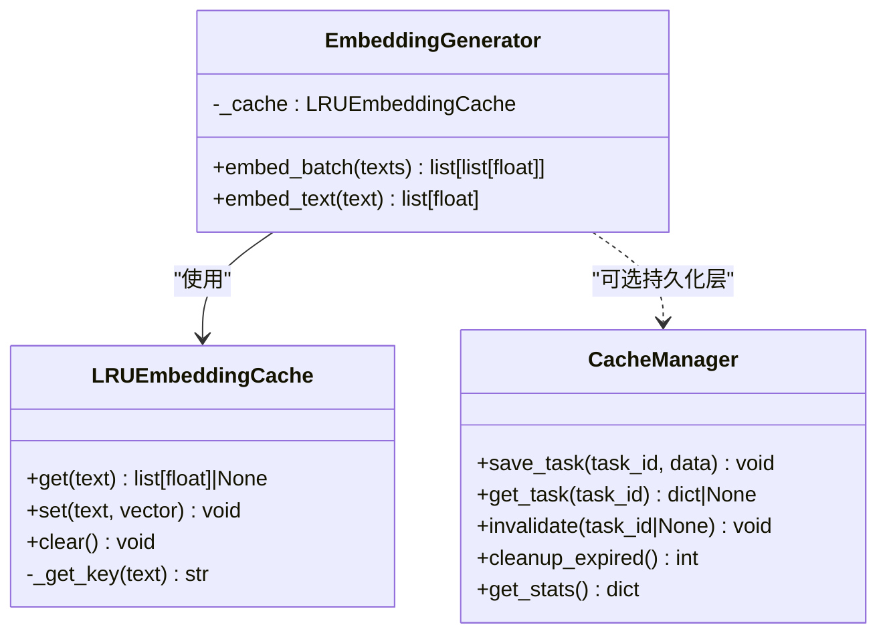
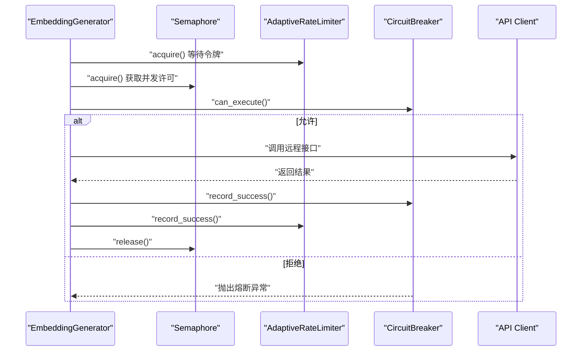
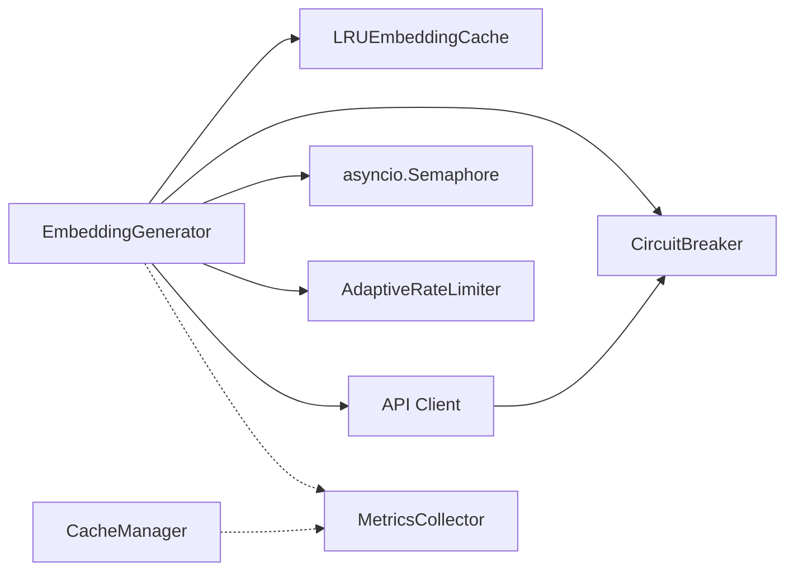

# 性能优化策略

<cite>
**本文引用的文件**   
- [src/embedding/generator.py](file://src/embedding/generator.py)
- [src/cache/manager.py](file://src/cache/manager.py)
- [src/utils/metrics.py](file://src/utils/metrics.py)
- [src/utils/circuit_breaker.py](file://src/utils/circuit_breaker.py)
- [src/api/client.py](file://src/api/client.py)
- [tests/embedding/test_generator_task24.py](file://tests/embedding/test_generator_task24.py)
- [tests/test_cache.py](file://tests/test_cache.py)
- [tests/cache/test_manager_task22.py](file://tests/cache/test_manager_task22.py)
- [docs/observability_guide.md](file://docs/observability_guide.md)
</cite>

## 目录
1. [引言](#引言)
2. [项目结构](#项目结构)
3. [核心组件](#核心组件)
4. [架构总览](#架构总览)
5. [详细组件分析](#详细组件分析)
6. [依赖分析](#依赖分析)
7. [性能考虑](#性能考虑)
8. [故障排查指南](#故障排查指南)
9. [结论](#结论)
10. [附录](#附录)

## 引言
本技术文档聚焦于LLM相关请求处理与向量嵌入的性能优化策略，围绕以下主题展开：
- 请求批处理机制：批量合并、优先级队列与资源调度
- 缓存策略实现：多级缓存、失效与命中率优化
- 并发控制机制：线程池管理、信号量控制与背压处理
- 成本控制策略：配额管理、使用监控与预算限制
- 性能监控方案：指标收集、告警规则与性能分析
- 实际优化案例与基准测试结果

## 项目结构
本项目在“嵌入生成”和“缓存管理”两个关键路径上实现了多项性能优化能力。整体结构以模块化为原则，将可观测性、熔断器、API客户端等横切关注点解耦到独立模块中，便于组合复用。

图表来源
- [src/embedding/generator.py:91-135](file://src/embedding/generator.py#L91-L135)
- [src/cache/manager.py:10-36](file://src/cache/manager.py#L10-L36)
- [src/utils/circuit_breaker.py:36-148](file://src/utils/circuit_breaker.py#L36-L148)
- [src/utils/metrics.py:151-188](file://src/utils/metrics.py#L151-L188)
- [src/api/client.py:147-161](file://src/api/client.py#L147-L161)

章节来源
- [src/embedding/generator.py:91-135](file://src/embedding/generator.py#L91-L135)
- [src/cache/manager.py:10-36](file://src/cache/manager.py#L10-L36)
- [src/utils/circuit_breaker.py:36-148](file://src/utils/circuit_breaker.py#L36-L148)
- [src/utils/metrics.py:151-188](file://src/utils/metrics.py#L151-L188)
- [src/api/client.py:147-161](file://src/api/client.py#L147-L161)

## 核心组件
- 嵌入生成器（EmbeddingGenerator）
  - 支持单条与批量文本的向量化；内置LRU缓存、自适应速率限制、信号量并发控制与熔断器保护。
  - 提供按provider分支逻辑（如本地hash向量、火山多模态embedding）。
- 内存级缓存（LRUEmbeddingCache）
  - 基于OrderedDict实现的LRU淘汰，带TTL过期检查，键为文本哈希。
- 持久化缓存（CacheManager）
  - 基于SQLite的任务结果缓存，支持TTL、统计、清理与索引查询。
- 熔断器（CircuitBreaker）
  - 三态机（关闭/半开/打开），支持成功阈值恢复与手动重置。
- 指标收集（MetricsCollector）
  - 计数器、仪表盘、直方图三类指标，支持Prometheus格式导出。
- API客户端（API Client）
  - 指数退避重试、连接错误与超时处理，并记录熔断失败。

章节来源
- [src/embedding/generator.py:91-135](file://src/embedding/generator.py#L91-L135)
- [src/embedding/generator.py:13-52](file://src/embedding/generator.py#L13-L52)
- [src/cache/manager.py:10-36](file://src/cache/manager.py#L10-L36)
- [src/utils/circuit_breaker.py:36-148](file://src/utils/circuit_breaker.py#L36-L148)
- [src/utils/metrics.py:151-188](file://src/utils/metrics.py#L151-L188)
- [src/api/client.py:147-161](file://src/api/client.py#L147-L161)

## 架构总览
下图展示了从请求进入、缓存命中、并发批处理到外部LLM调用的完整链路，以及熔断与指标采集的融入点。

图表来源
- [src/embedding/generator.py:245-321](file://src/embedding/generator.py#L245-L321)
- [src/embedding/generator.py:162-216](file://src/embedding/generator.py#L162-L216)
- [src/utils/circuit_breaker.py:146-148](file://src/utils/circuit_breaker.py#L146-L148)
- [src/api/client.py:147-161](file://src/api/client.py#L147-L161)

## 详细组件分析

### 请求批处理机制（批量合并、优先级队列、资源调度）
- 批量合并
  - embed_batch对输入进行缓存预检，仅对未命中部分发起网络请求；对于非视觉类provider采用分块批量调用，减少握手与序列化开销。
- 优先级队列
  - 当前实现未显式引入优先级队列；可在上层任务编排处按task_id或业务优先级排序后入队，结合信号量与批大小实现“高优优先、低优兜底”。
- 资源调度
  - 通过asyncio.Semaphore控制并发度；AdaptiveRateLimiter根据成功/失败动态调整QPS，避免突发流量打满下游。
  - CircuitBreaker在失败时快速失败，降低雪崩风险。

图表来源
- [src/embedding/generator.py:245-321](file://src/embedding/generator.py#L245-L321)
- [src/embedding/generator.py:54-89](file://src/embedding/generator.py#L54-L89)
- [src/utils/circuit_breaker.py:117-148](file://src/utils/circuit_breaker.py#L117-L148)

章节来源
- [src/embedding/generator.py:245-321](file://src/embedding/generator.py#L245-L321)
- [src/embedding/generator.py:54-89](file://src/embedding/generator.py#L54-L89)
- [src/utils/circuit_breaker.py:117-148](file://src/utils/circuit_breaker.py#L117-L148)

### 缓存策略实现（多级缓存、失效与命中率优化）
- 多级缓存
  - 第一级：LRUEmbeddingCache（进程内，O(1)读写，LRU淘汰+TTL）
  - 第二级：CacheManager（SQLite持久化，跨进程/重启可用，TTL+清理）
- 失效策略
  - LRU：访问即更新最近使用；容量满则淘汰最久未使用；TTL到期立即失效。
  - SQLite：读取时校验expires_at；提供cleanup_expired定期清理。
- 命中率优化
  - 先做全量缓存预检，命中直接返回；未命中再批量请求，减少无效网络IO。
  - 针对空文本或空白文本直接返回零向量，避免无意义计算。

图表来源
- [src/embedding/generator.py:13-52](file://src/embedding/generator.py#L13-L52)
- [src/cache/manager.py:37-87](file://src/cache/manager.py#L37-L87)
- [src/cache/manager.py:156-164](file://src/cache/manager.py#L156-L164)

章节来源
- [src/embedding/generator.py:13-52](file://src/embedding/generator.py#L13-L52)
- [src/cache/manager.py:37-87](file://src/cache/manager.py#L37-L87)
- [src/cache/manager.py:156-164](file://src/cache/manager.py#L156-L164)
- [tests/embedding/test_generator_task24.py:13-57](file://tests/embedding/test_generator_task24.py#L13-L57)
- [tests/test_cache.py:16-44](file://tests/test_cache.py#L16-L44)
- [tests/cache/test_manager_task22.py:28-46](file://tests/cache/test_manager_task22.py#L28-L46)

### 并发控制机制（线程池管理、信号量控制、背压处理）
- 并发控制
  - asyncio.Semaphore限制同时进行的embedding请求数，防止下游过载。
- 背压处理
  - AdaptiveRateLimiter根据成功/失败动态调节QPS，失败时降速、成功时缓慢恢复，形成软背压。
- 线程池
  - 当前代码未显式创建线程池；如需CPU密集型预处理，可在上层封装ThreadPoolExecutor并按需接入。

图表来源
- [src/embedding/generator.py:132-135](file://src/embedding/generator.py#L132-L135)
- [src/embedding/generator.py:54-89](file://src/embedding/generator.py#L54-L89)
- [src/utils/circuit_breaker.py:146-148](file://src/utils/circuit_breaker.py#L146-L148)

章节来源
- [src/embedding/generator.py:132-135](file://src/embedding/generator.py#L132-L135)
- [src/embedding/generator.py:54-89](file://src/embedding/generator.py#L54-L89)
- [src/utils/circuit_breaker.py:146-148](file://src/utils/circuit_breaker.py#L146-L148)

### 成本控制策略（配额管理、使用监控、预算限制）
- 配额管理
  - 通过max_concurrency与batch_size控制单次处理的规模；AdaptiveRateLimiter限制QPS上限，间接控制成本。
- 使用监控
  - 利用MetricsCollector记录请求计数、耗时分布与活跃请求数；可对接Prometheus进行可视化与告警。
- 预算限制
  - 建议在上层增加“累计token/金额”计数器，达到阈值后降级或拒绝新请求（可扩展至全局配额管理器）。

章节来源
- [src/embedding/generator.py:91-135](file://src/embedding/generator.py#L91-L135)
- [src/utils/metrics.py:151-188](file://src/utils/metrics.py#L151-L188)
- [docs/observability_guide.md:74-114](file://docs/observability_guide.md#L74-L114)

### 性能监控方案（指标收集、告警规则、性能分析）
- 指标收集
  - Counter：API请求总数、错误数
  - Gauge：活跃请求数、队列长度
  - Histogram：响应时间分布（含默认桶）
- Prometheus导出
  - MetricsCollector.export_prometheus输出标准格式，便于抓取与展示。
- 告警规则（示例）
  - 错误率超过阈值（如5分钟内错误计数突增）
  - P95/P99延迟超过阈值
  - 熔断器状态为OPEN持续一定时长
  - 缓存命中率低于阈值（可通过额外指标暴露）

章节来源
- [src/utils/metrics.py:190-226](file://src/utils/metrics.py#L190-L226)
- [docs/observability_guide.md:116-138](file://docs/observability_guide.md#L116-L138)

### 实际优化案例与基准测试结果
- 案例一：LRU缓存命中提升吞吐
  - 现象：重复文本高频出现导致大量冗余网络请求。
  - 措施：启用LRUEmbeddingCache，设置合理max_size与TTL。
  - 验证：单元测试覆盖基本操作、LRU淘汰与TTL过期行为。
- 案例二：SQLite持久化缓存保障跨进程一致性
  - 现象：服务重启后丢失中间结果。
  - 措施：引入CacheManager，保存任务结果并支持TTL与清理。
  - 验证：测试覆盖保存/加载、过期、清理与统计信息。
- 案例三：自适应限流与熔断协同
  - 现象：下游抖动引发连锁失败。
  - 措施：AdaptiveRateLimiter动态降速+CircuitBreaker快速失败。
  - 验证：熔断器状态转换与统计接口可用。

章节来源
- [tests/embedding/test_generator_task24.py:13-57](file://tests/embedding/test_generator_task24.py#L13-L57)
- [tests/test_cache.py:16-44](file://tests/test_cache.py#L16-L44)
- [tests/cache/test_manager_task22.py:28-46](file://tests/cache/test_manager_task22.py#L28-L46)
- [src/utils/circuit_breaker.py:188-198](file://src/utils/circuit_breaker.py#L188-L198)

## 依赖分析
- 组件耦合
  - EmbeddingGenerator依赖LRU缓存、熔断器、信号量与API客户端；对外暴露统一的嵌入接口。
  - CacheManager独立于业务，提供通用任务缓存能力。
  - MetricsCollector为横切关注点，被各模块按需引用。
- 外部依赖
  - OpenAI异步客户端用于embedding；httpx用于特定provider的多模态调用。
- 潜在循环依赖
  - 当前未见循环导入；EmbeddingGenerator与CacheManager相互独立。

图表来源
- [src/embedding/generator.py:91-135](file://src/embedding/generator.py#L91-L135)
- [src/utils/circuit_breaker.py:36-148](file://src/utils/circuit_breaker.py#L36-L148)
- [src/utils/metrics.py:151-188](file://src/utils/metrics.py#L151-L188)
- [src/api/client.py:147-161](file://src/api/client.py#L147-L161)

章节来源
- [src/embedding/generator.py:91-135](file://src/embedding/generator.py#L91-L135)
- [src/utils/circuit_breaker.py:36-148](file://src/utils/circuit_breaker.py#L36-L148)
- [src/utils/metrics.py:151-188](file://src/utils/metrics.py#L151-L188)
- [src/api/client.py:147-161](file://src/api/client.py#L147-L161)

## 性能考虑
- 批大小与并发度
  - batch_size越大，单次请求吞吐越高，但可能增大延迟与失败代价；max_concurrency需结合下游QPS与模型维度权衡。
- 缓存命中率
  - 热点文本占比高时，LRU命中率显著提升；建议结合业务特征调整max_size与TTL。
- 背压与熔断
  - 自适应限流与熔断共同作用，可有效抑制雪崩；建议在监控面板中暴露其状态与统计数据。
- I/O与序列化
  - 批量请求减少HTTP握手与JSON序列化次数；注意大向量传输的带宽占用。

[本节为通用指导，不直接分析具体文件]

## 故障排查指南
- 常见问题定位
  - 熔断频繁打开：检查下游错误日志与成功率，适当提高failure_threshold或reset_timeout。
  - 缓存命中率低：检查TTL与max_size配置，确认文本去重与归一化策略。
  - 延迟升高：观察Histogram分布，定位P95/P99异常；检查并发与批大小是否过大。
- 诊断手段
  - 使用MetricsCollector导出Prometheus指标，结合Grafana看板观察趋势。
  - 查看CircuitBreaker.get_stats()了解状态与计数。
  - 使用CacheManager.get_stats()与cleanup_expired()维护缓存健康。

章节来源
- [src/utils/circuit_breaker.py:188-198](file://src/utils/circuit_breaker.py#L188-L198)
- [src/cache/manager.py:122-138](file://src/cache/manager.py#L122-L138)
- [src/utils/metrics.py:190-226](file://src/utils/metrics.py#L190-L226)

## 结论
通过在嵌入生成链路中引入多级缓存、自适应限流、信号量并发控制与熔断器，并结合完善的指标采集与告警体系，系统能够在高并发与不稳定下游环境下保持稳定的吞吐与较低的延迟。后续可在上层任务编排中引入优先级队列与预算配额管理，进一步精细化控制成本与服务质量。

[本节为总结性内容，不直接分析具体文件]

## 附录
- 术语
  - QPS：每秒查询数
  - TTL：生存时间
  - LRU：最近最少使用
  - 熔断器：在失败阈值触发后快速失败的容错模式
- 参考实践
  - 指标命名规范与标签设计建议
  - Prometheus告警规则模板（错误率、延迟、熔断状态）

[本节为补充说明，不直接分析具体文件]
