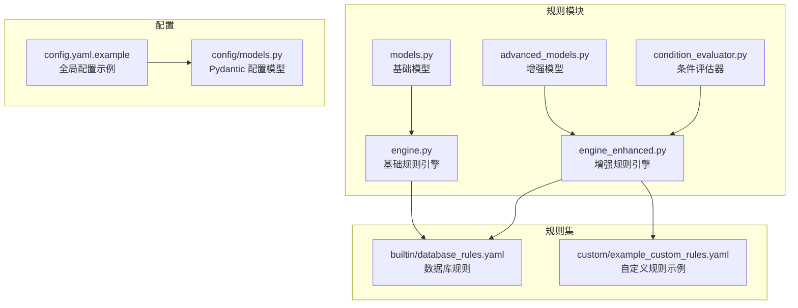
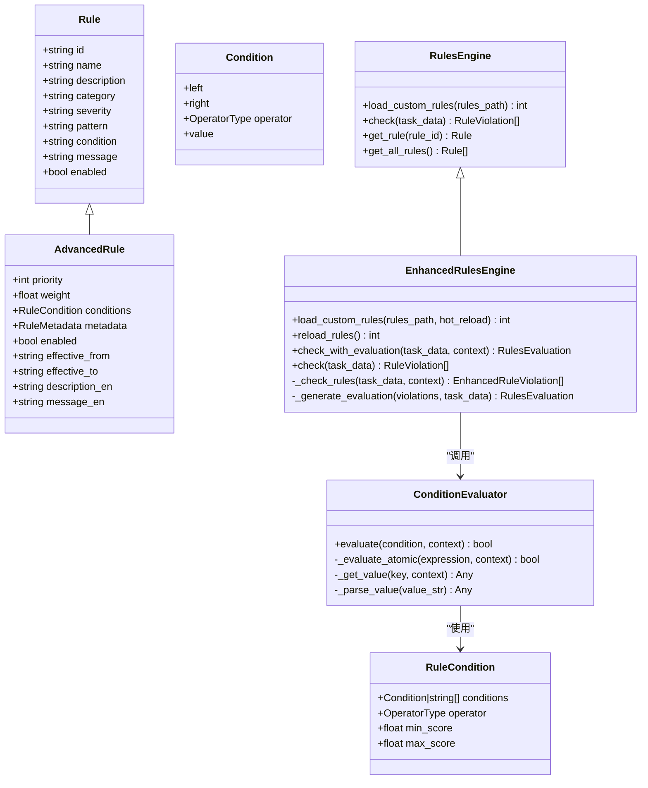
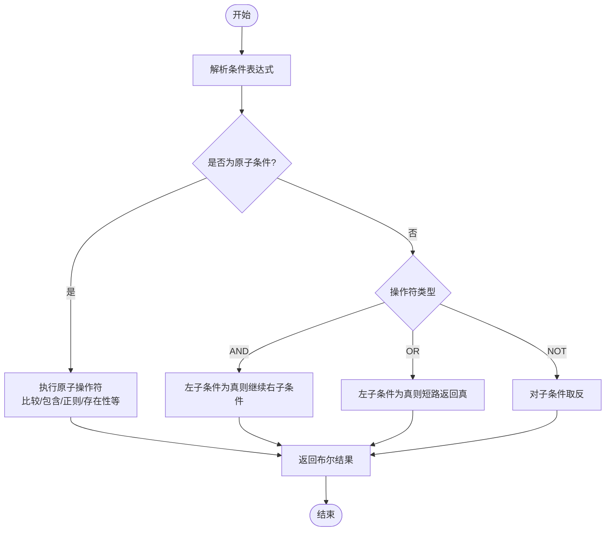
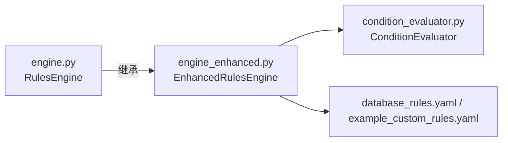

# 告警规则配置

<cite>
**本文引用的文件**   
- [src/rules/models.py](file://src/rules/models.py)
- [src/rules/advanced_models.py](file://src/rules/advanced_models.py)
- [src/rules/condition_evaluator.py](file://src/rules/condition_evaluator.py)
- [src/rules/engine.py](file://src/rules/engine.py)
- [src/rules/engine_enhanced.py](file://src/rules/engine_enhanced.py)
- [src/rules/builtin/database_rules.yaml](file://src/rules/builtin/database_rules.yaml)
- [src/rules/custom/example_custom_rules.yaml](file://src/rules/custom/example_custom_rules.yaml)
- [config/config.yaml.example](file://config/config.yaml.example)
- [src/config/models.py](file://src/config/models.py)
</cite>

## 目录
1. [简介](#简介)
2. [项目结构](#项目结构)
3. [核心组件](#核心组件)
4. [架构总览](#架构总览)
5. [详细组件分析](#详细组件分析)
6. [依赖关系分析](#依赖关系分析)
7. [性能与可扩展性](#性能与可扩展性)
8. [故障排查指南](#故障排查指南)
9. [结论](#结论)
10. [附录：规则定义语法与示例](#附录：规则定义语法与示例)

## 简介
本技术文档面向“告警规则配置”的完整生命周期，覆盖以下关键主题：
- 告警规则的定义语法：阈值表达式、时间窗口、条件组合逻辑
- 告警级别分类与处理策略：CRITICAL、WARNING、INFO 等严重程度的含义与处置建议
- 通知渠道配置：邮件、Webhook、企业微信等集成方式（概念性说明）
- 告警抑制与去重机制：避免告警风暴与重复通知的策略与实现建议
- 实战示例：为关键业务指标设置合理阈值与通知策略

注意：当前仓库实现了规则引擎与条件评估器，但未内置具体通知渠道与抑制去重的持久化实现。本节在“通知渠道”和“抑制去重”部分提供通用方案与接入点建议，便于后续扩展。

## 项目结构
与告警规则相关的代码主要位于 src/rules 目录，并辅以配置文件与示例规则集：
- 模型与数据类：基础规则、增强规则、违规记录、评估结果
- 规则引擎：基础版与增强版，支持热重载、优先级与权重评分
- 条件评估器：支持 AND/OR/NOT 组合与丰富的原子操作符
- 内置规则与自定义规则：YAML 格式，便于加载与管理
- 全局配置：rules 相关开关与路径

图表来源
- [src/rules/models.py:1-51](file://src/rules/models.py#L1-L51)
- [src/rules/advanced_models.py:1-102](file://src/rules/advanced_models.py#L1-L102)
- [src/rules/condition_evaluator.py:1-189](file://src/rules/condition_evaluator.py#L1-L189)
- [src/rules/engine.py:1-376](file://src/rules/engine.py#L1-L376)
- [src/rules/engine_enhanced.py:1-388](file://src/rules/engine_enhanced.py#L1-L388)
- [src/rules/builtin/database_rules.yaml:1-39](file://src/rules/builtin/database_rules.yaml#L1-L39)
- [src/rules/custom/example_custom_rules.yaml:1-41](file://src/rules/custom/example_custom_rules.yaml#L1-L41)
- [config/config.yaml.example:1-38](file://config/config.yaml.example#L1-L38)
- [src/config/models.py:1-144](file://src/config/models.py#L1-L144)

章节来源
- [src/rules/models.py:1-51](file://src/rules/models.py#L1-L51)
- [src/rules/advanced_models.py:1-102](file://src/rules/advanced_models.py#L1-L102)
- [src/rules/condition_evaluator.py:1-189](file://src/rules/condition_evaluator.py#L1-L189)
- [src/rules/engine.py:1-376](file://src/rules/engine.py#L1-L376)
- [src/rules/engine_enhanced.py:1-388](file://src/rules/engine_enhanced.py#L1-L388)
- [src/rules/builtin/database_rules.yaml:1-39](file://src/rules/builtin/database_rules.yaml#L1-L39)
- [src/rules/custom/example_custom_rules.yaml:1-41](file://src/rules/custom/example_custom_rules.yaml#L1-L41)
- [config/config.yaml.example:1-38](file://config/config.yaml.example#L1-L38)
- [src/config/models.py:1-144](file://src/config/models.py#L1-L144)

## 核心组件
- 基础规则模型与结果
  - Rule、RuleViolation、RuleCheckResult、RulesConfig 定义了规则的基本字段、违规记录与检查结果的统一结构，以及规则引擎的配置项（如是否启用内置规则、自定义路径、缓存开关）。
- 增强规则模型与评估
  - AdvancedRule 扩展了优先级、权重、生效时间、多语言描述等；EnhancedRuleViolation 增加了分数、匹配模式、元数据等；RulesEvaluation 汇总整体得分、类别得分与严重度分布。
- 条件评估器
  - ConditionEvaluator 支持 AND/OR/NOT 组合，并提供丰富的原子操作符（比较、包含、正则匹配、存在性、空值判断等），用于对上下文数据进行布尔判定。
- 规则引擎
  - RulesEngine 负责加载内置与自定义规则，基于正则或简单条件进行匹配，返回违规列表。
  - EnhancedRulesEngine 在基础之上引入优先级排序、高级条件评估、热重载、评分与评估报告生成。

章节来源
- [src/rules/models.py:1-51](file://src/rules/models.py#L1-L51)
- [src/rules/advanced_models.py:1-102](file://src/rules/advanced_models.py#L1-L102)
- [src/rules/condition_evaluator.py:1-189](file://src/rules/condition_evaluator.py#L1-L189)
- [src/rules/engine.py:1-376](file://src/rules/engine.py#L1-L376)
- [src/rules/engine_enhanced.py:1-388](file://src/rules/engine_enhanced.py#L1-L388)

## 架构总览
规则引擎采用分层设计：模型层定义数据结构，引擎层负责加载与执行，条件评估器提供灵活的表达式能力，规则集以 YAML 形式管理。

图表来源
- [src/rules/models.py:1-51](file://src/rules/models.py#L1-L51)
- [src/rules/advanced_models.py:1-102](file://src/rules/advanced_models.py#L1-L102)
- [src/rules/condition_evaluator.py:1-189](file://src/rules/condition_evaluator.py#L1-L189)
- [src/rules/engine.py:1-376](file://src/rules/engine.py#L1-L376)
- [src/rules/engine_enhanced.py:1-388](file://src/rules/engine_enhanced.py#L1-L388)

## 详细组件分析

### 规则定义语法与语义
- 字段说明
  - id：唯一标识，建议使用前缀加编号，避免与内置规则冲突
  - name/description：人类可读的名称与描述
  - category：分类（security/code/performance/concurrency/custom）
  - severity：严重程度（critical/high/medium/low/info）
  - pattern：Python 正则表达式，匹配到即触发违规
  - condition：简单条件表达式（例如 lines > 100），由引擎按约定解析
  - message：违规时展示给用户的信息
  - enabled：是否启用该规则
- 高级模式
  - priority/weight：影响执行顺序与评分权重
  - conditions：复杂条件树，支持 AND/OR/NOT 组合与原子操作符
  - effective_from/effective_to：规则生效时间窗口
  - metadata：版本、作者、标签、参考链接等元信息

章节来源
- [src/rules/custom/example_custom_rules.yaml:1-41](file://src/rules/custom/example_custom_rules.yaml#L1-L41)
- [src/rules/advanced_models.py:1-102](file://src/rules/advanced_models.py#L1-L102)
- [src/rules/engine.py:160-214](file://src/rules/engine.py#L160-L214)

### 阈值表达式与条件组合逻辑
- 原子操作符
  - 比较：==、!=、>、<、>=、<=
  - 字符串：contains、not_contains、starts_with、ends_with、matches（正则）
  - 集合：in、not_in
  - 存在性与空值：exists、is_empty
- 组合操作符
  - AND/OR/NOT：支持嵌套组合，形成任意复杂的条件树
- 上下文取值
  - 支持点号访问（如 a.b.c），从任务数据与传入上下文中解析
- 值解析
  - 自动识别布尔、数字、字符串、JSON 数组等类型

图表来源
- [src/rules/condition_evaluator.py:1-189](file://src/rules/condition_evaluator.py#L1-L189)

章节来源
- [src/rules/condition_evaluator.py:1-189](file://src/rules/condition_evaluator.py#L1-L189)

### 时间窗口与生效控制
- 规则级生效时间
  - effective_from/effective_to：在运行时根据当前时间判断规则是否有效
- 时间窗口（概念性）
  - 可在上层服务中结合滑动窗口聚合指标，将窗口统计结果注入上下文，供条件评估器使用

章节来源
- [src/rules/engine_enhanced.py:213-221](file://src/rules/engine_enhanced.py#L213-L221)

### 告警级别分类与处理策略
- 严重级别
  - critical/high/medium/low/info：用于区分问题严重度
- 处理策略建议
  - critical：立即响应，阻断发布流程，强提醒（电话/短信/IM）
  - high：快速响应，限流或降级，工单升级
  - medium：计划内修复，纳入迭代排期
  - low：优化改进，定期清理
  - info：仅记录与观察，不触发即时行动
- 评分与排序
  - 增强引擎根据 severity/priority/weight 计算违规分数，辅助排序与过滤

章节来源
- [src/rules/engine_enhanced.py:319-333](file://src/rules/engine_enhanced.py#L319-L333)
- [src/rules/engine.py:22-34](file://src/rules/engine.py#L22-L34)

### 通知渠道配置（概念性）
- 支持的渠道（建议）
  - 邮件：SMTP 发送，支持模板与附件
  - Webhook：HTTP POST 到第三方系统（如 Jira、飞书、钉钉）
  - 企业微信：通过机器人 API 推送消息
- 配置要点
  - 凭据管理：密钥与令牌应通过环境变量或密钥管理服务注入
  - 重试与熔断：失败重试、退避策略、熔断保护
  - 幂等与追踪：为每条告警生成唯一 ID，便于去重与审计
- 接入点建议
  - 在规则引擎输出后增加“通知适配器”层，按 severity 与路由策略分发到不同渠道

[本节为概念性说明，未直接分析具体源码文件]

### 告警抑制与去重机制（概念性）
- 抑制策略
  - 静默期：同一规则在同一维度上 N 分钟内不再重复告警
  - 合并策略：相同根因或相似内容的告警合并为一条
  - 依赖抑制：上游故障导致下游告警时，抑制下游
- 去重实现建议
  - 基于 rule_id + 关键维度（如服务名、实例、错误码）生成指纹
  - 使用内存或 Redis 存储指纹与时间戳，配合 TTL 控制
- 与规则引擎的结合
  - 在 check_with_evaluation 之后、通知之前插入抑制与去重中间件

[本节为概念性说明，未直接分析具体源码文件]

## 依赖关系分析
- 组件耦合
  - EnhancedRulesEngine 继承自 RulesEngine，复用规则加载与基础检查逻辑
  - EnhancedRulesEngine 依赖 ConditionEvaluator 进行高级条件评估
  - 规则集通过 YAML 加载，与引擎解耦，便于独立维护
- 外部依赖
  - 可选 watchdog 用于热重载监听文件变更
  - PyYAML 用于解析 YAML 规则文件

图表来源
- [src/rules/engine.py:1-376](file://src/rules/engine.py#L1-L376)
- [src/rules/engine_enhanced.py:1-388](file://src/rules/engine_enhanced.py#L1-L388)
- [src/rules/condition_evaluator.py:1-189](file://src/rules/condition_evaluator.py#L1-L189)
- [src/rules/builtin/database_rules.yaml:1-39](file://src/rules/builtin/database_rules.yaml#L1-L39)
- [src/rules/custom/example_custom_rules.yaml:1-41](file://src/rules/custom/example_custom_rules.yaml#L1-L41)

章节来源
- [src/rules/engine.py:1-376](file://src/rules/engine.py#L1-L376)
- [src/rules/engine_enhanced.py:1-388](file://src/rules/engine_enhanced.py#L1-L388)
- [src/rules/condition_evaluator.py:1-189](file://src/rules/condition_evaluator.py#L1-L189)
- [src/rules/builtin/database_rules.yaml:1-39](file://src/rules/builtin/database_rules.yaml#L1-L39)
- [src/rules/custom/example_custom_rules.yaml:1-41](file://src/rules/custom/example_custom_rules.yaml#L1-L41)

## 性能与可扩展性
- 性能特性
  - 规则按优先级降序执行，有助于优先发现高优问题
  - 条件评估器短路求值（AND/OR）减少不必要的计算
  - 热重载通过线程锁保证并发安全，避免竞态
- 可扩展性
  - 新增规则无需修改代码，仅需更新 YAML
  - 可通过扩展 ConditionEvaluator 的操作符与上下文键，适配更多场景
  - 可对接外部存储（Redis/DB）实现抑制与去重

章节来源
- [src/rules/engine_enhanced.py:170-201](file://src/rules/engine_enhanced.py#L170-L201)
- [src/rules/condition_evaluator.py:61-75](file://src/rules/condition_evaluator.py#L61-L75)
- [src/rules/engine_enhanced.py:52-74](file://src/rules/engine_enhanced.py#L52-L74)

## 故障排查指南
- 常见问题
  - 规则未生效：检查 enabled 字段与 effective_from/effective_to 时间范围
  - 正则匹配异常：确认 pattern 是否符合预期，必要时转义特殊字符
  - 条件表达式错误：核对操作符与上下文键是否存在，日志会记录解析失败
  - 热重载无效：确认 watchdog 已安装且监听目录正确
- 定位方法
  - 查看日志中的警告与错误信息（如条件评估失败、规则加载失败）
  - 使用 get_all_rules/get_rule 验证规则是否正确加载
  - 打印 evaluate 的中间结果，逐步缩小问题范围

章节来源
- [src/rules/condition_evaluator.py:108-110](file://src/rules/condition_evaluator.py#L108-L110)
- [src/rules/engine.py:279-281](file://src/rules/engine.py#L279-L281)
- [src/rules/engine.py:308-310](file://src/rules/engine.py#L308-L310)
- [src/rules/engine_enhanced.py:90-95](file://src/rules/engine_enhanced.py#L90-L95)

## 结论
本仓库提供了完整的规则引擎与条件评估框架，支持灵活的条件组合、优先级与权重评分、热重载与评估报告。对于生产环境，建议在此基础上补充通知渠道与抑制去重机制，以实现端到端的告警治理。

[本节为总结性内容，未直接分析具体源码文件]

## 附录：规则定义语法与示例

### 规则字段速查
- id/name/description/category/severity/pattern/condition/message/enabled
- 高级模式：priority/weight/conditions/metadata/effective_from/effective_to

章节来源
- [src/rules/custom/example_custom_rules.yaml:1-41](file://src/rules/custom/example_custom_rules.yaml#L1-L41)
- [src/rules/advanced_models.py:1-102](file://src/rules/advanced_models.py#L1-L102)

### 条件表达式语法
- 原子操作符：==、!=、>、<、>=、<=、contains、not_contains、matches、in、not_in、starts_with、ends_with、exists、is_empty
- 组合操作符：AND、OR、NOT（支持嵌套）
- 上下文取值：a.b.c 点号访问
- 值解析：布尔、整数、浮点数、字符串、JSON 数组

章节来源
- [src/rules/condition_evaluator.py:1-189](file://src/rules/condition_evaluator.py#L1-L189)

### 时间窗口与生效控制
- 规则级生效时间：effective_from/effective_to
- 窗口聚合（概念性）：在上层服务中计算滑动窗口指标，注入上下文供条件评估器使用

章节来源
- [src/rules/engine_enhanced.py:213-221](file://src/rules/engine_enhanced.py#L213-L221)

### 告警级别与处理建议
- critical/high/medium/low/info：对应不同的响应与处置策略
- 评分与排序：severity/priority/weight 共同决定告警重要性与顺序

章节来源
- [src/rules/engine_enhanced.py:319-333](file://src/rules/engine_enhanced.py#L319-L333)
- [src/rules/engine.py:22-34](file://src/rules/engine.py#L22-L34)

### 通知渠道配置（概念性）
- 邮件/Webhook/企业微信：建议通过适配器层接入，遵循幂等与重试原则
- 配置管理：密钥与令牌通过环境变量或密钥管理服务注入

[本节为概念性说明，未直接分析具体源码文件]

### 抑制与去重（概念性）
- 静默期/合并/依赖抑制：降低噪音与风暴
- 指纹与存储：rule_id+维度指纹，TTL 控制，支持内存或 Redis

[本节为概念性说明，未直接分析具体源码文件]

### 实战示例（基于现有规则集）
- 数据库安全与性能规则
  - SQL 注入风险（字符串拼接）：critical，建议阻断发布并强提醒
  - SELECT * 查询：low，建议纳入代码规范检查
  - 循环内数据库查询（N+1）：high，建议批量查询或 JOIN
  - 索引列上使用函数：medium，建议改写查询以利用索引
- 自定义规则示例
  - 硬编码 IP 地址：medium，建议改为配置项
  - TODO 未解决：low，建议清理遗留工作
  - 函数行数过长：low，可关闭默认启用，按需开启

章节来源
- [src/rules/builtin/database_rules.yaml:1-39](file://src/rules/builtin/database_rules.yaml#L1-L39)
- [src/rules/custom/example_custom_rules.yaml:1-41](file://src/rules/custom/example_custom_rules.yaml#L1-L41)

### 全局配置（rules 相关）
- builtin_enabled：是否启用内置规则
- custom_paths：自定义规则目录列表

章节来源
- [config/config.yaml.example:27-31](file://config/config.yaml.example#L27-L31)
- [src/config/models.py:99-102](file://src/config/models.py#L99-L102)