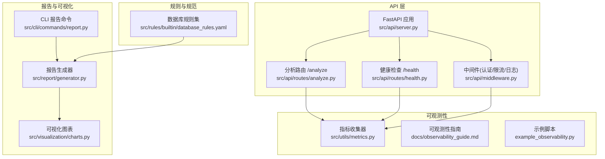
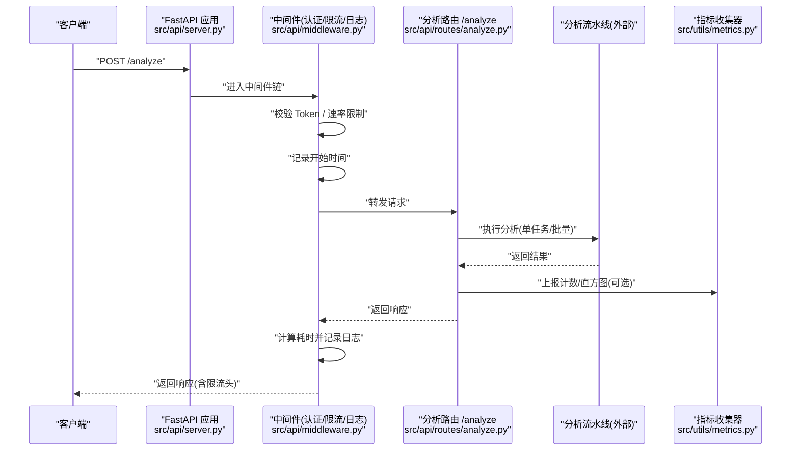
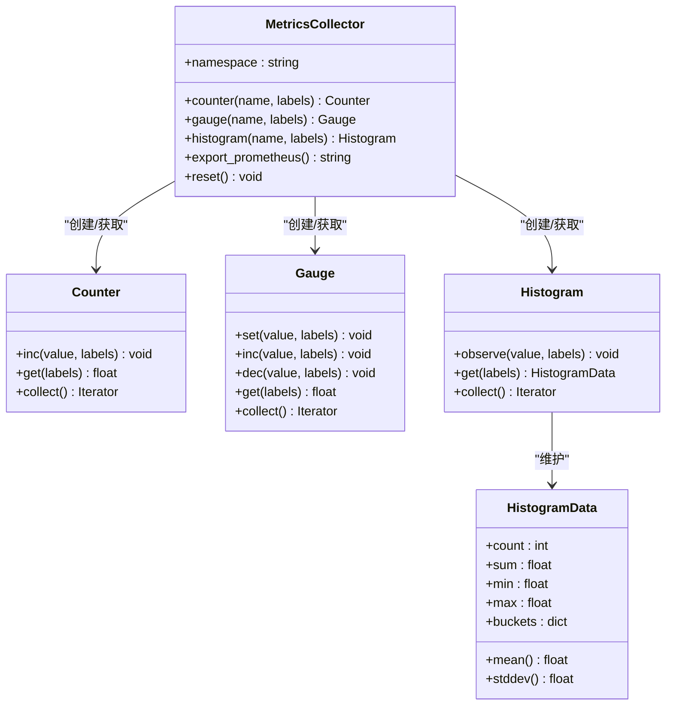
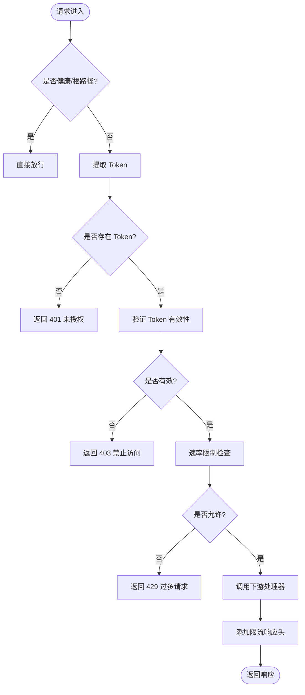
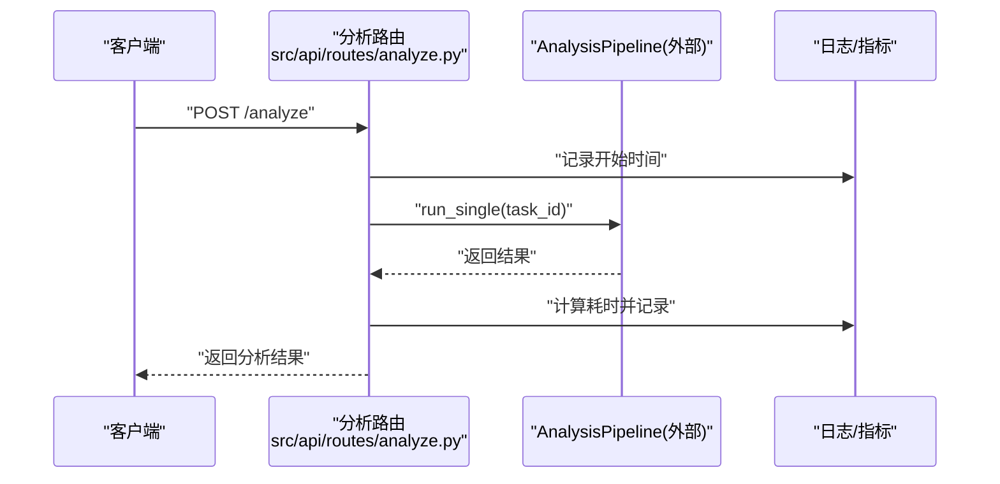
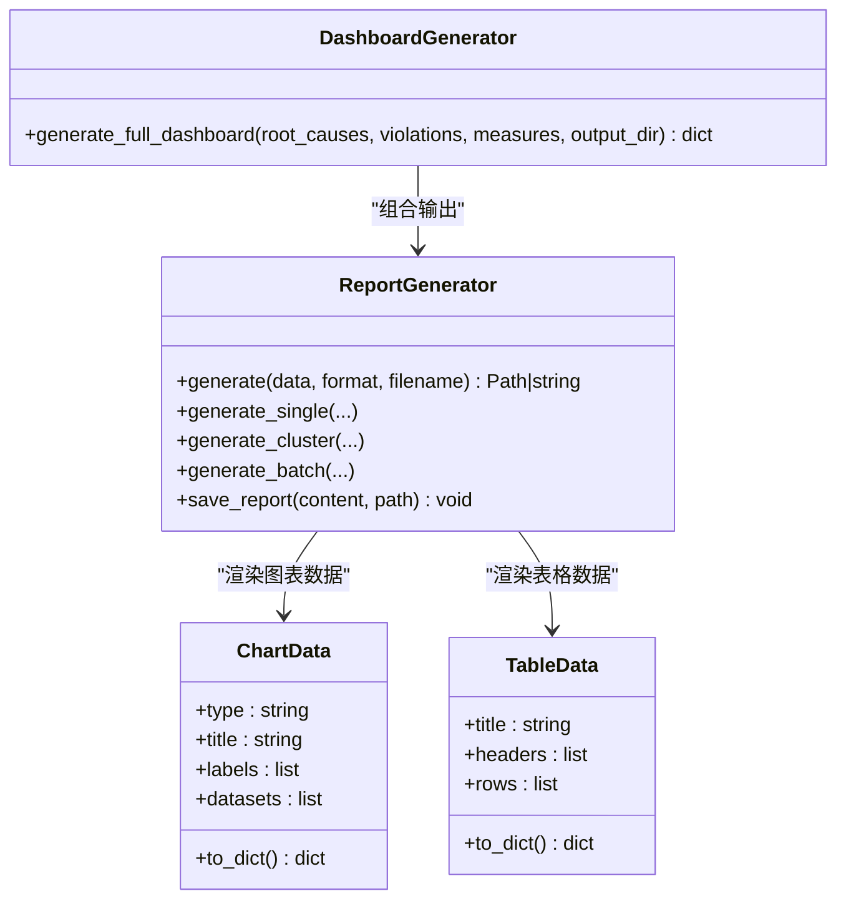
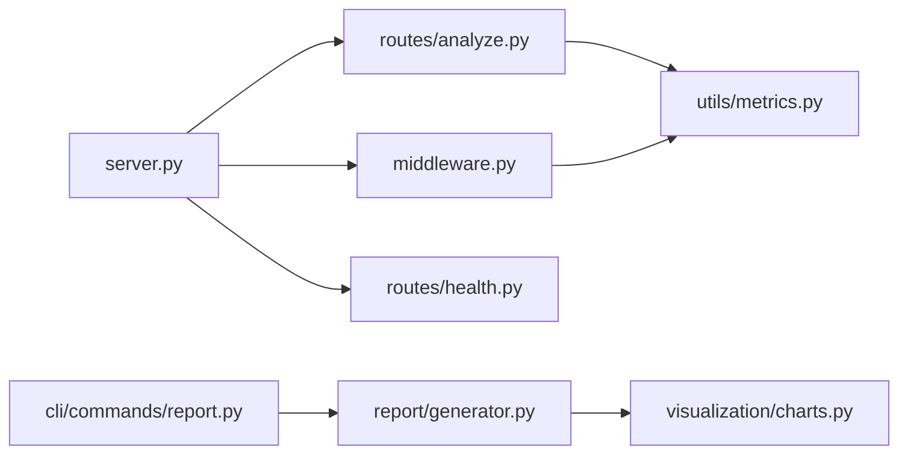

# 性能分析工具

<cite>
**本文引用的文件**   
- [README.md](file://README.md)
- [src/utils/metrics.py](file://src/utils/metrics.py)
- [src/api/server.py](file://src/api/server.py)
- [src/api/middleware.py](file://src/api/middleware.py)
- [src/api/routes/analyze.py](file://src/api/routes/analyze.py)
- [src/api/routes/health.py](file://src/api/routes/health.py)
- [src/report/generator.py](file://src/report/generator.py)
- [src/cli/commands/report.py](file://src/cli/commands/report.py)
- [src/visualization/charts.py](file://src/visualization/charts.py)
- [docs/observability_guide.md](file://docs/observability_guide.md)
- [example_observability.py](file://example_observability.py)
- [src/rules/builtin/database_rules.yaml](file://src/rules/builtin/database_rules.yaml)
</cite>

## 目录
1. [简介](#简介)
2. [项目结构](#项目结构)
3. [核心组件](#核心组件)
4. [架构总览](#架构总览)
5. [详细组件分析](#详细组件分析)
6. [依赖关系分析](#依赖关系分析)
7. [性能考量](#性能考量)
8. [故障排查指南](#故障排查指南)
9. [结论](#结论)
10. [附录](#附录)

## 简介
本技术文档面向“性能分析工具”的使用与扩展，聚焦以下目标：
- 慢查询分析方法：SQL 查询性能监控、API 响应时间分析与瓶颈识别
- 资源使用监控：CPU、内存、磁盘 I/O、网络带宽的采集与分析（方法论与落地建议）
- 基准测试工具：负载测试、压力测试与性能回归检测（方法与流程）
- 性能分析报告生成：趋势图表、异常检测与优化建议
- 实际案例分析：如何定位并解决性能问题

本项目已内置可观测性基础设施（结构化日志、指标收集与导出）、API 中间件（认证与速率限制、请求耗时记录）、报告与可视化能力。本文基于仓库现有实现进行系统化梳理，并提供可扩展的实践路径。

## 项目结构
从性能视角看，关键模块分布如下：
- 指标与可观测性：utils.metrics、示例与指南
- API 服务与中间件：server、middleware、routes
- 报告与可视化：report.generator、visualization.charts
- CLI 报告生成：cli.commands.report
- 规则与规范：rules.builtin.database_rules.yaml（含性能相关规则）

图示来源
- [src/api/server.py:1-152](file://src/api/server.py#L1-L152)
- [src/api/middleware.py:1-173](file://src/api/middleware.py#L1-L173)
- [src/api/routes/analyze.py:1-202](file://src/api/routes/analyze.py#L1-L202)
- [src/api/routes/health.py:1-23](file://src/api/routes/health.py#L1-L23)
- [src/utils/metrics.py:1-252](file://src/utils/metrics.py#L1-L252)
- [docs/observability_guide.md:1-229](file://docs/observability_guide.md#L1-L229)
- [example_observability.py:1-86](file://example_observability.py#L1-L86)
- [src/report/generator.py:1-790](file://src/report/generator.py#L1-L790)
- [src/visualization/charts.py:1-399](file://src/visualization/charts.py#L1-L399)
- [src/cli/commands/report.py:1-140](file://src/cli/commands/report.py#L1-L140)
- [src/rules/builtin/database_rules.yaml:1-38](file://src/rules/builtin/database_rules.yaml#L1-L38)

章节来源
- [README.md:1-101](file://README.md#L1-L101)

## 核心组件
- 指标收集器（Counter/Gauge/Histogram + Prometheus 导出）
  - 提供统一的命名空间、标签聚合与导出能力，便于接入监控系统
- API 中间件（认证、速率限制、请求耗时记录）
  - 在请求链路中自动注入耗时与限流信息，为响应时间分析提供基础
- 分析路由（单任务/批量分析）
  - 记录端到端处理时长，结合指标收集器形成 API 性能视图
- 报告与可视化
  - 支持 Markdown/HTML/PDF/JSON 多格式输出；内置根因分布、违规类型、改进措施等图表
- CLI 报告命令
  - 一键生成任务/聚类/批量报告，便于归档与分享
- 数据库规则集
  - 包含常见性能反模式（如 SELECT *、N+1、索引失效）的规则定义

章节来源
- [src/utils/metrics.py:1-252](file://src/utils/metrics.py#L1-L252)
- [src/api/middleware.py:1-173](file://src/api/middleware.py#L1-L173)
- [src/api/routes/analyze.py:1-202](file://src/api/routes/analyze.py#L1-L202)
- [src/report/generator.py:1-790](file://src/report/generator.py#L1-L790)
- [src/visualization/charts.py:1-399](file://src/visualization/charts.py#L1-L399)
- [src/cli/commands/report.py:1-140](file://src/cli/commands/report.py#L1-L140)
- [src/rules/builtin/database_rules.yaml:1-38](file://src/rules/builtin/database_rules.yaml#L1-L38)

## 架构总览
下图展示一次分析请求的完整链路，包括认证、限流、耗时统计与指标上报。

图示来源
- [src/api/server.py:1-152](file://src/api/server.py#L1-L152)
- [src/api/middleware.py:1-173](file://src/api/middleware.py#L1-L173)
- [src/api/routes/analyze.py:1-202](file://src/api/routes/analyze.py#L1-L202)
- [src/utils/metrics.py:1-252](file://src/utils/metrics.py#L1-L252)

## 详细组件分析

### 指标收集器（MetricsCollector）
- 功能要点
  - Counter：累计型指标（如请求总数、错误数）
  - Gauge：瞬时值（如活跃请求数、队列长度）
  - Histogram：分布统计（如响应时间），默认分桶覆盖毫秒到秒级
  - Prometheus 导出：统一命名空间、标签格式化、bucket/sum/count 输出
- 复杂度与性能
  - 标签键通过排序后的元组哈希，避免重复与冲突
  - 直方图按固定桶统计，观察操作 O(B)，B 为桶数量（常数级）
- 扩展点
  - 自定义桶配置、增加系统级指标（CPU/内存/IO/网络）采集适配器
  - 与外部监控系统对接（Prometheus/时序数据库）

图示来源
- [src/utils/metrics.py:1-252](file://src/utils/metrics.py#L1-L252)

章节来源
- [src/utils/metrics.py:1-252](file://src/utils/metrics.py#L1-L252)
- [docs/observability_guide.md:74-138](file://docs/observability_guide.md#L74-L138)
- [example_observability.py:36-85](file://example_observability.py#L36-L85)

### API 中间件（认证/限流/日志）
- 功能要点
  - Token 验证：支持 Header 或 Query 参数传入
  - 速率限制：每分钟窗口滑动，返回剩余配额
  - 请求日志：记录方法、路径、客户端、耗时
- 性能影响
  - 中间件开销极低，适合全局启用
  - 限流数据结构为字典映射列表，清理过期时间戳保证内存稳定

图示来源
- [src/api/middleware.py:1-173](file://src/api/middleware.py#L1-L173)

章节来源
- [src/api/middleware.py:1-173](file://src/api/middleware.py#L1-L173)

### 分析路由（单任务/批量）
- 功能要点
  - 单任务分析：封装 Pipeline 配置，执行后记录耗时
  - 批量分析：遍历任务列表，汇总完成/失败计数与总耗时
- 性能关注点
  - 建议在路由层将耗时与状态码纳入指标直方图/计数器，便于后续趋势分析
  - 对长耗时任务考虑异步化与超时控制

图示来源
- [src/api/routes/analyze.py:1-202](file://src/api/routes/analyze.py#L1-L202)

章节来源
- [src/api/routes/analyze.py:1-202](file://src/api/routes/analyze.py#L1-L202)

### 报告与可视化
- 报告生成器
  - 支持多种格式（Markdown/HTML/PDF/JSON）
  - 内置模板与数据模型（ReportData/ChartData/TableData）
- 可视化图表
  - 根因分布柱状图、违规类型饼图、改进措施优先级与详情图
- CLI 报告命令
  - 支持任务/聚类/批量报告生成，输出到指定目录

图示来源
- [src/report/generator.py:1-790](file://src/report/generator.py#L1-L790)
- [src/visualization/charts.py:1-399](file://src/visualization/charts.py#L1-L399)
- [src/cli/commands/report.py:1-140](file://src/cli/commands/report.py#L1-L140)

章节来源
- [src/report/generator.py:1-790](file://src/report/generator.py#L1-L790)
- [src/visualization/charts.py:1-399](file://src/visualization/charts.py#L1-L399)
- [src/cli/commands/report.py:1-140](file://src/cli/commands/report.py#L1-L140)

### 健康检查
- 健康检查接口用于负载均衡与健康探针
- 当前返回简单状态，可扩展为包含依赖项（缓存、向量库、LLM 服务）的健康探测

章节来源
- [src/api/routes/health.py:1-23](file://src/api/routes/health.py#L1-L23)

## 依赖关系分析
- 组件耦合
  - server 依赖 middleware 与 routes
  - analyze 路由依赖外部 AnalysisPipeline（不在本仓库内）
  - report 与 visualization 相对独立，可通过 CLI 驱动
  - metrics 为通用工具，被多处复用
- 外部依赖
  - FastAPI、uvicorn、loguru、plotly、jinja2 等
- 潜在风险
  - 若外部 Pipeline 不稳定，需在路由层增加重试/熔断/降级策略
  - 指标基数爆炸风险：标签维度需审慎设计

图示来源
- [src/api/server.py:1-152](file://src/api/server.py#L1-L152)
- [src/api/middleware.py:1-173](file://src/api/middleware.py#L1-L173)
- [src/api/routes/analyze.py:1-202](file://src/api/routes/analyze.py#L1-L202)
- [src/api/routes/health.py:1-23](file://src/api/routes/health.py#L1-L23)
- [src/utils/metrics.py:1-252](file://src/utils/metrics.py#L1-L252)
- [src/report/generator.py:1-790](file://src/report/generator.py#L1-L790)
- [src/visualization/charts.py:1-399](file://src/visualization/charts.py#L1-L399)
- [src/cli/commands/report.py:1-140](file://src/cli/commands/report.py#L1-L140)

## 性能考量
- 慢查询分析方法
  - SQL 查询性能监控：结合数据库规则集识别反模式（SELECT *、N+1、索引列函数导致全表扫描），并在代码审查与静态扫描阶段拦截
  - API 响应时间分析：利用中间件记录耗时，配合指标直方图观察 P50/P95/P99 变化
  - 瓶颈识别：通过指标与日志关联，定位热点端点与慢步骤
- 资源使用监控（方法论）
  - CPU 利用率：进程级采样（psutil 或系统探针），以 Gauge 暴露
  - 内存占用：RSS/VMS 或堆快照，结合 GC 事件指标
  - 磁盘 I/O：读写吞吐与延迟，IOPS 与队列深度
  - 网络带宽：入出流量、连接数、重传率
  - 建议：为上述指标建立统一命名空间与标签（host/service/component），并设置告警阈值
- 基准测试工具（方法与流程）
  - 负载测试：模拟并发用户访问关键端点，观察吞吐与延迟
  - 压力测试：逐步加压直至系统饱和，识别拐点与容量上限
  - 性能回归检测：将关键指标（P95 延迟、错误率、吞吐量）纳入 CI 门禁，对比基线阈值
- 性能分析报告生成
  - 趋势图表：基于历史指标绘制时间序列图
  - 异常检测：基于分位数或移动平均的阈值告警
  - 优化建议：结合根因分析与规则引擎输出，自动生成改进建议

章节来源
- [src/rules/builtin/database_rules.yaml:1-38](file://src/rules/builtin/database_rules.yaml#L1-L38)
- [src/api/middleware.py:143-173](file://src/api/middleware.py#L143-L173)
- [src/utils/metrics.py:151-252](file://src/utils/metrics.py#L151-L252)
- [docs/observability_guide.md:140-229](file://docs/observability_guide.md#L140-L229)

## 故障排查指南
- 常见问题定位
  - 401/403/429：检查 Token 配置与速率限制策略
  - 高延迟：查看中间件日志中的耗时字段，结合指标直方图定位热点端点
  - 资源泄漏：关注 Gauge 指标（活跃请求、队列长度）是否持续增长
- 快速诊断步骤
  - 确认健康检查接口正常
  - 拉取 Prometheus 格式指标，检查关键直方图的分位值
  - 生成报告与可视化图表，辅助定位根因
- 参考示例
  - 可观测性示例脚本展示了指标记录与导出的标准用法

章节来源
- [src/api/middleware.py:81-141](file://src/api/middleware.py#L81-L141)
- [src/api/routes/health.py:10-23](file://src/api/routes/health.py#L10-L23)
- [example_observability.py:36-85](file://example_observability.py#L36-L85)

## 结论
本项目提供了完善的可观测性与报告可视化基础，能够支撑 API 响应时间分析、慢查询反模式识别与性能报告生成。通过扩展系统资源指标采集与基准测试流程，可进一步提升性能治理闭环能力。

## 附录
- 快速上手
  - 安装与运行：参考 README 中的安装与快速开始说明
  - 可观测性使用：参考 observability_guide 与示例脚本
- 常用命令
  - 生成报告：CLI report 命令支持任务/聚类/批量生成

章节来源
- [README.md:31-45](file://README.md#L31-L45)
- [docs/observability_guide.md:1-73](file://docs/observability_guide.md#L1-L73)
- [src/cli/commands/report.py:17-114](file://src/cli/commands/report.py#L17-L114)
