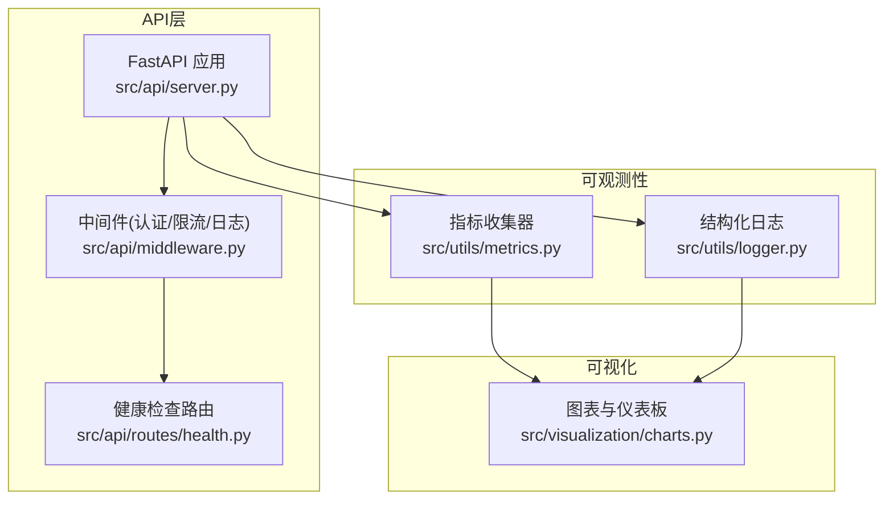
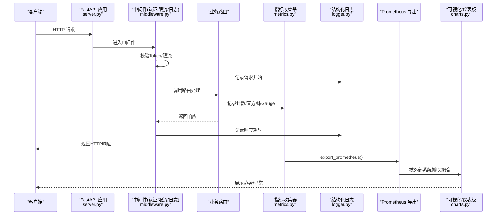
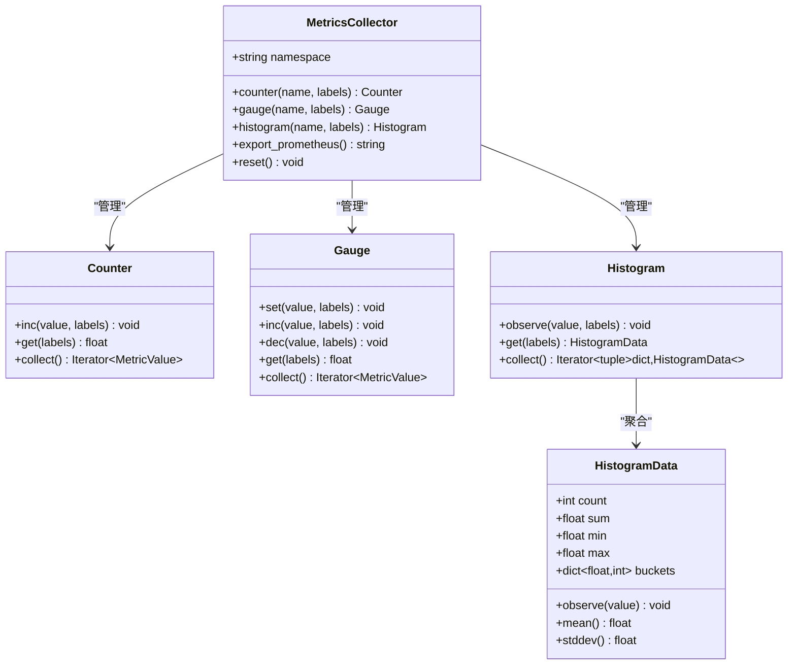
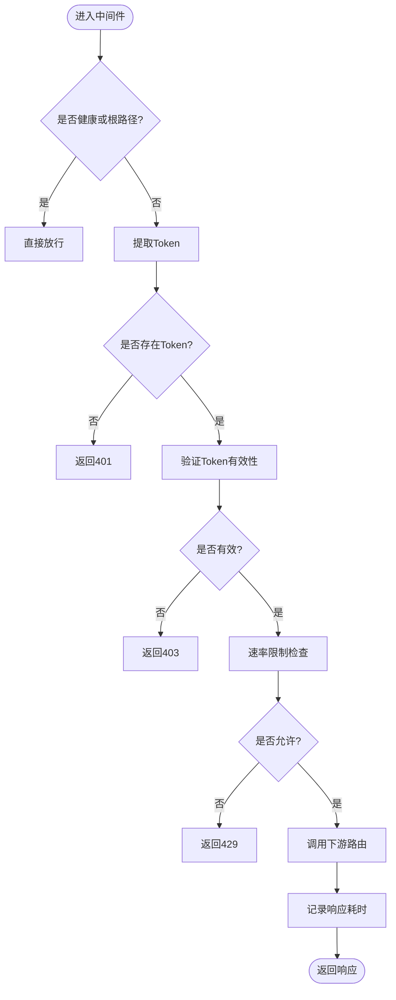
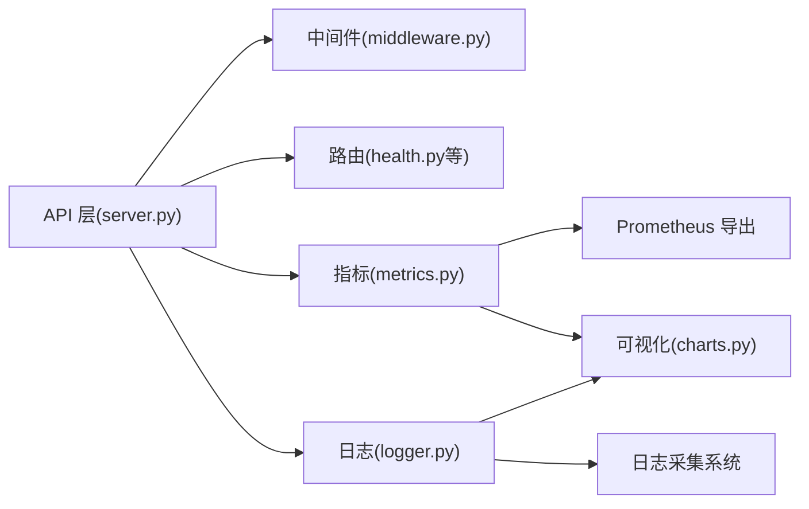

# 性能监控方案

<cite>
**本文引用的文件**   
- [src/utils/metrics.py](file://src/utils/metrics.py)
- [src/utils/logger.py](file://src/utils/logger.py)
- [src/api/middleware.py](file://src/api/middleware.py)
- [src/api/server.py](file://src/api/server.py)
- [src/api/routes/health.py](file://src/api/routes/health.py)
- [src/visualization/charts.py](file://src/visualization/charts.py)
- [example_observability.py](file://example_observability.py)
- [docs/observability_guide.md](file://docs/observability_guide.md)
- [tests/utils/test_metrics.py](file://tests/utils/test_metrics.py)
- [config/config.yaml](file://config/config.yaml)
</cite>

## 目录
1. [引言](#引言)
2. [项目结构](#项目结构)
3. [核心组件](#核心组件)
4. [架构总览](#架构总览)
5. [详细组件分析](#详细组件分析)
6. [依赖关系分析](#依赖关系分析)
7. [性能考量](#性能考量)
8. [故障排查指南](#故障排查指南)
9. [结论](#结论)
10. [附录](#附录)

## 引言
本方案面向LLM驱动的分析服务，构建一套完整的性能监控体系：指标采集、日志追踪、可视化与告警。目标包括：
- 定义关键性能指标（KPI/KRI），覆盖API吞吐、延迟分布、错误率、资源使用等
- 设计数据采集与存储策略，支持Prometheus导出与后续聚合
- 配置告警规则（阈值、通知渠道、级别）并给出落地建议
- 提供性能分析工具链（慢查询、资源监控、瓶颈识别）
- 设计监控仪表板（可视化、趋势、异常检测）
- 总结最佳实践与部署案例，帮助团队建立完善的监控体系

## 项目结构
围绕可观测性与监控的关键代码分布如下：
- 指标收集：src/utils/metrics.py
- 结构化日志：src/utils/logger.py
- API中间件（认证、限流、请求耗时记录）：src/api/middleware.py
- FastAPI应用入口与生命周期：src/api/server.py
- 健康检查路由：src/api/routes/health.py
- 可视化图表与仪表板生成：src/visualization/charts.py
- 示例与文档：example_observability.py、docs/observability_guide.md
- 测试用例：tests/utils/test_metrics.py
- 配置项：config/config.yaml

图示来源
- [src/api/server.py:38-111](file://src/api/server.py#L38-L111)
- [src/api/middleware.py:62-173](file://src/api/middleware.py#L62-L173)
- [src/api/routes/health.py:1-22](file://src/api/routes/health.py#L1-L22)
- [src/utils/metrics.py:151-251](file://src/utils/metrics.py#L151-L251)
- [src/utils/logger.py:34-160](file://src/utils/logger.py#L34-L160)
- [src/visualization/charts.py:335-399](file://src/visualization/charts.py#L335-L399)

章节来源
- [src/api/server.py:38-111](file://src/api/server.py#L38-L111)
- [src/api/middleware.py:62-173](file://src/api/middleware.py#L62-L173)
- [src/api/routes/health.py:1-22](file://src/api/routes/health.py#L1-L22)
- [src/utils/metrics.py:151-251](file://src/utils/metrics.py#L151-L251)
- [src/utils/logger.py:34-160](file://src/utils/logger.py#L34-L160)
- [src/visualization/charts.py:335-399](file://src/visualization/charts.py#L335-L399)

## 核心组件
- 指标收集器（MetricsCollector）
  - 提供计数器（Counter）、仪表盘（Gauge）、直方图（Histogram）三类指标
  - 支持标签维度与Prometheus格式导出
  - 提供全局收集器实例，便于跨模块共享
- 结构化日志（StructuredLogger/loguru封装）
  - 支持JSON与控制台两种输出格式
  - 支持文件输出与轮转
  - 提供关联ID（correlation_id）用于链路追踪
- API中间件
  - 认证与速率限制
  - 请求/响应日志与耗时统计
- 可视化与仪表板
  - 根因分布、违规类型、改进措施优先级等图表
  - 统一仪表板生成器

章节来源
- [src/utils/metrics.py:151-251](file://src/utils/metrics.py#L151-L251)
- [src/utils/logger.py:34-160](file://src/utils/logger.py#L34-L160)
- [src/api/middleware.py:62-173](file://src/api/middleware.py#L62-L173)
- [src/visualization/charts.py:335-399](file://src/visualization/charts.py#L335-L399)

## 架构总览
下图展示从请求进入API到指标采集、日志记录、可视化的整体流程。

图示来源
- [src/api/server.py:38-111](file://src/api/server.py#L38-L111)
- [src/api/middleware.py:81-173](file://src/api/middleware.py#L81-L173)
- [src/utils/metrics.py:190-226](file://src/utils/metrics.py#L190-L226)
- [src/utils/logger.py:34-104](file://src/utils/logger.py#L34-L104)
- [src/visualization/charts.py:335-399](file://src/visualization/charts.py#L335-L399)

## 详细组件分析

### 指标收集系统（Metrics）
- 指标类型与用途
  - Counter：累计值（如请求总数、错误数）
  - Gauge：瞬时值（如活跃请求数、队列长度）
  - Histogram：分布值（如响应时间分桶、延迟百分位）
- 数据模型与复杂度
  - 内部以字典+默认工厂维护多标签维度，键为排序后的标签元组
  - observe/inc/set等操作均为O(1)，collect遍历所有标签组合
- Prometheus导出
  - 按命名空间拼接指标名，输出TYPE注释与带时间戳的数据行
  - 直方图输出_bucket/_sum/_count三行
- 全局收集器
  - 通过全局函数获取单例，避免重复创建

图示来源
- [src/utils/metrics.py:54-149](file://src/utils/metrics.py#L54-L149)
- [src/utils/metrics.py:151-251](file://src/utils/metrics.py#L151-L251)

章节来源
- [src/utils/metrics.py:1-251](file://src/utils/metrics.py#L1-251)
- [tests/utils/test_metrics.py:249-389](file://tests/utils/test_metrics.py#L249-L389)

### 结构化日志系统（Logger）
- 功能要点
  - JSON/控制台双格式；可选文件输出与轮转
  - 支持extra字段透传（如task_id、correlation_id）
  - 提供StructuredLogger简化接口
- 使用建议
  - 生产环境推荐JSON格式，便于集中采集与分析
  - 在关键路径添加correlation_id，串联上下游日志

章节来源
- [src/utils/logger.py:1-160](file://src/utils/logger.py#L1-L160)
- [docs/observability_guide.md:1-72](file://docs/observability_guide.md#L1-L72)

### API中间件（认证/限流/日志）
- 功能要点
  - Token校验与速率限制（基于分钟滑动窗口）
  - 请求开始/结束日志，记录耗时毫秒
  - 响应头注入X-RateLimit-*
- 监控结合点
  - 可在中间件内增加指标埋点（如请求总数、错误码分布、限流次数）

图示来源
- [src/api/middleware.py:81-173](file://src/api/middleware.py#L81-L173)

章节来源
- [src/api/middleware.py:1-173](file://src/api/middleware.py#L1-L173)

### 可视化与仪表板
- 图表能力
  - 根因分布柱状图、违规类型饼图、改进措施优先级与详情横向柱状图
- 仪表板生成器
  - 批量生成HTML图表，便于离线查看或嵌入前端
- 与监控联动
  - 可将指标时序数据接入可视化平台（如Grafana），实现趋势与异常检测

章节来源
- [src/visualization/charts.py:1-399](file://src/visualization/charts.py#L1-L399)

### 示例与文档
- 示例脚本演示了指标采集与Prometheus导出
- 文档提供了使用指南与最佳实践

章节来源
- [example_observability.py:1-86](file://example_observability.py#L1-L86)
- [docs/observability_guide.md:74-168](file://docs/observability_guide.md#L74-L168)

## 依赖关系分析
- 组件耦合
  - API层依赖中间件与路由；中间件依赖日志与限流逻辑
  - 指标与日志作为横切关注点，被API层与业务模块共同使用
  - 可视化模块消费指标与业务结果，不反向依赖API
- 外部集成点
  - Prometheus抓取/export_prometheus输出
  - 日志集中采集（ELK/Loki等）
  - 可视化平台（Grafana/自研Dashboard）

图示来源
- [src/api/server.py:38-111](file://src/api/server.py#L38-L111)
- [src/api/middleware.py:62-173](file://src/api/middleware.py#L62-L173)
- [src/utils/metrics.py:190-226](file://src/utils/metrics.py#L190-L226)
- [src/utils/logger.py:34-104](file://src/utils/logger.py#L34-L104)
- [src/visualization/charts.py:335-399](file://src/visualization/charts.py#L335-L399)

章节来源
- [src/api/server.py:38-111](file://src/api/server.py#L38-L111)
- [src/api/middleware.py:62-173](file://src/api/middleware.py#L62-L173)
- [src/utils/metrics.py:190-226](file://src/utils/metrics.py#L190-L226)
- [src/utils/logger.py:34-104](file://src/utils/logger.py#L34-L104)
- [src/visualization/charts.py:335-399](file://src/visualization/charts.py#L335-L399)

## 性能考量
- 指标基数控制
  - 标签维度需收敛，避免高基数字段（如用户ID、随机字符串）导致内存膨胀
- 采样与聚合
  - 对高频指标采用合理采样或聚合窗口，降低存储压力
- 直方图分桶
  - 根据业务延迟分布调整分桶边界，确保关键百分位可见
- 日志体积
  - 生产环境开启JSON输出与轮转，按需过滤DEBUG级别
- 中间件开销
  - 限流与鉴权尽量轻量，避免阻塞主流程

[本节为通用指导，无需源码引用]

## 故障排查指南
- 常见问题定位
  - 指标缺失：确认是否在关键路径埋点，命名空间与标签是否正确
  - 指标基数爆炸：检查标签中是否包含高基数字段
  - 日志过大：调整日志级别与轮转策略
  - 限流误伤：核对令牌配置与限流阈值
- 快速自检清单
  - 健康检查可用：GET /health
  - Prometheus导出正常：调用export_prometheus或暴露端点
  - 日志可检索：通过correlation_id串联请求链路
  - 仪表板图表可生成：运行可视化生成器

章节来源
- [src/api/routes/health.py:1-22](file://src/api/routes/health.py#L1-L22)
- [src/utils/metrics.py:190-226](file://src/utils/metrics.py#L190-L226)
- [src/utils/logger.py:34-104](file://src/utils/logger.py#L34-L104)
- [src/api/middleware.py:81-173](file://src/api/middleware.py#L81-L173)

## 结论
本项目已具备指标采集、结构化日志、基础可视化与API中间件能力。在此基础上，建议进一步：
- 完善告警规则与通知渠道
- 将指标接入Prometheus/Grafana，形成统一监控视图
- 建立SLO/SLI体系，持续优化性能与稳定性

[本节为总结，无需源码引用]

## 附录

### 关键性能指标（KPI/KRI）定义与采集建议
- API类
  - 请求总量：counter(api_requests_total{endpoint,method})
  - 错误率：counter(api_errors_total{endpoint,status_code})
  - 响应时延：histogram(api_response_duration_seconds{endpoint})
  - 并发度：gauge(api_requests_active)
- 分析任务类
  - 任务执行次数：counter(analysis_runs_total)
  - 任务耗时：histogram(analysis_duration_seconds)
  - 失败次数：counter(analysis_failures_total)
- 资源类
  - 队列长度：gauge(queue_length)
  - 缓存命中率：gauge(cache_hit_ratio)
- 采集位置建议
  - API中间件：请求/响应计数、耗时、错误码
  - 业务处理：任务级耗时与成功/失败
  - 外部依赖：数据库/向量库/LLM调用耗时与错误

章节来源
- [src/utils/metrics.py:151-251](file://src/utils/metrics.py#L151-L251)
- [src/api/middleware.py:143-173](file://src/api/middleware.py#L143-L173)
- [docs/observability_guide.md:74-168](file://docs/observability_guide.md#L74-L168)

### 告警规则配置（阈值、渠道、级别）
- 阈值建议（可按业务基线调整）
  - API错误率 > 1%（5分钟）
  - P95/P99延迟超过SLO（如>1s）
  - 活跃请求数突增（>基线2倍）
  - 限流触发比例 > 5%
  - 任务失败率 > 2%
- 告警级别
  - P0：影响核心可用性（立即响应）
  - P1：影响用户体验（尽快修复）
  - P2：潜在风险（计划修复）
- 通知渠道
  - 企业微信/钉钉机器人、邮件、短信（P0）
- 规则示例（概念性）
  - 错误率 = api_errors_total / api_requests_total
  - P95 = histogram(api_response_duration_seconds)_bucket{le="0.95"}

[本节为通用指导，无需源码引用]

### 性能分析工具与瓶颈识别
- 慢查询分析
  - 针对数据库/向量库/LLM调用埋点，统计topN慢操作
- 资源使用监控
  - CPU/内存/IO/网络（由宿主或容器平台提供）
- 瓶颈识别
  - 热点接口、热点标签、长尾延迟、锁竞争、GC停顿等

[本节为通用指导，无需源码引用]

### 监控仪表板设计
- 页面布局
  - 概览：QPS、错误率、P95/P99、活跃请求
  - 业务：任务成功率、耗时分布、失败原因TopN
  - 资源：CPU/内存/磁盘/网络
  - 告警：当前告警列表与历史趋势
- 趋势与异常
  - 同比/环比对比、季节性平滑、突变检测

[本节为通用指导，无需源码引用]

### 最佳实践与部署案例
- 最佳实践
  - 指标命名规范：命名空间_模块_对象_度量单位
  - 标签收敛：避免高基数；必要时做降维
  - 日志脱敏：去除敏感信息
  - 分层埋点：网关/服务/依赖三层
- 部署案例（概念性）
  - 本地开发：启用JSON日志与Prometheus导出，浏览器访问/docs与/health
  - 生产环境：对接Prometheus/Grafana，配置告警规则与通知渠道

章节来源
- [config/config.yaml:1-44](file://config/config.yaml#L1-L44)
- [src/api/server.py:114-152](file://src/api/server.py#L114-L152)
- [docs/observability_guide.md:217-229](file://docs/observability_guide.md#L217-L229)