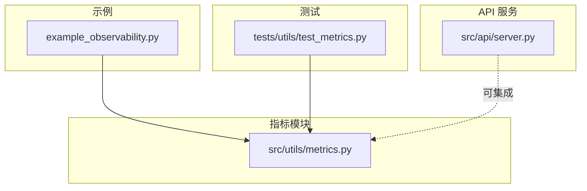
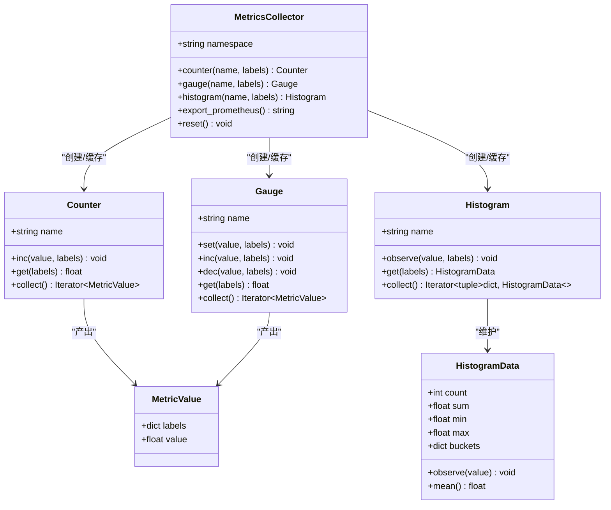
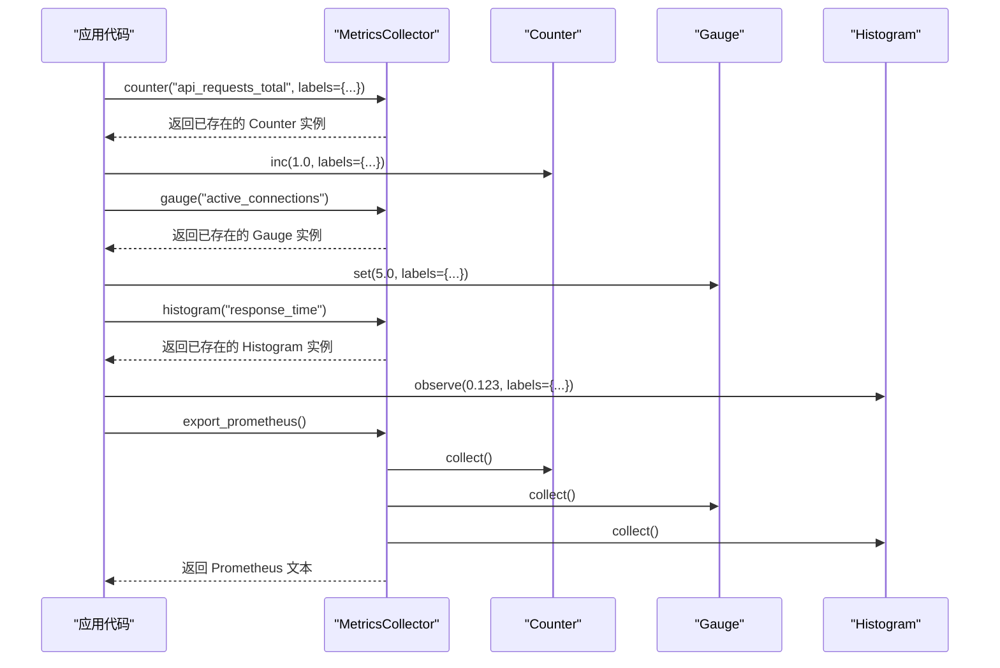
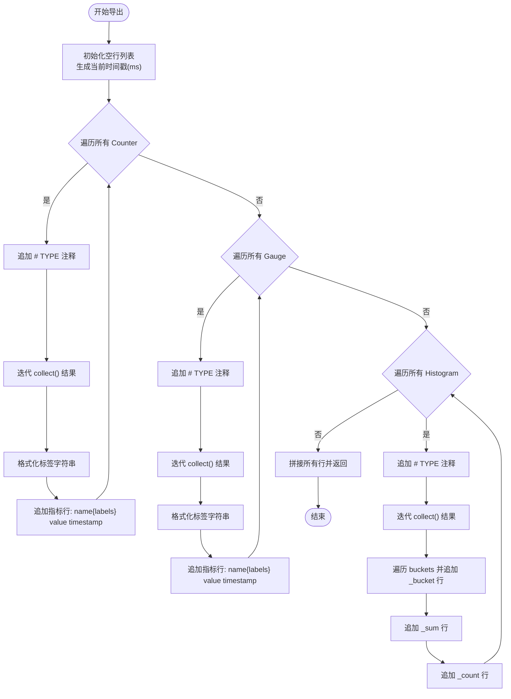
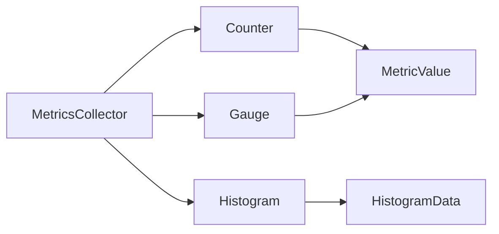

# 指标收集系统

<cite>
**本文引用的文件**   
- [src/utils/metrics.py](file://src/utils/metrics.py)
- [example_observability.py](file://example_observability.py)
- [tests/utils/test_metrics.py](file://tests/utils/test_metrics.py)
- [src/api/server.py](file://src/api/server.py)
</cite>

## 目录
1. [简介](#简介)
2. [项目结构](#项目结构)
3. [核心组件](#核心组件)
4. [架构总览](#架构总览)
5. [详细组件分析](#详细组件分析)
6. [依赖关系分析](#依赖关系分析)
7. [性能考虑](#性能考虑)
8. [故障排查指南](#故障排查指南)
9. [结论](#结论)
10. [附录：使用示例与最佳实践](#附录使用示例与最佳实践)

## 简介
本技术文档围绕“指标收集系统”展开，聚焦于 Counter、Gauge、Histogram 三种核心指标类型的设计原理与使用场景；深入解析 MetricsCollector 类的实现机制（指标注册、标签管理、数据收集策略）；并文档化 Prometheus 格式导出能力（命名规范、标签格式与时序数据处理）。同时提供具体代码示例路径，展示如何定义自定义指标、设置标签维度、记录业务指标值，并给出内存优化、并发安全与聚合策略等性能建议。

## 项目结构
指标收集系统位于 utils 模块中，包含三类基础指标与一个统一收集器，并提供全局实例获取函数。示例脚本演示了典型用法，测试用例覆盖了功能与导出格式校验。API 服务目前未内置 /metrics 端点，但可通过中间件或路由集成该导出能力。

图表来源
- [src/utils/metrics.py:1-252](file://src/utils/metrics.py#L1-L252)
- [example_observability.py:1-86](file://example_observability.py#L1-L86)
- [tests/utils/test_metrics.py:1-389](file://tests/utils/test_metrics.py#L1-L389)
- [src/api/server.py:1-152](file://src/api/server.py#L1-L152)

章节来源
- [src/utils/metrics.py:1-252](file://src/utils/metrics.py#L1-L252)
- [example_observability.py:1-86](file://example_observability.py#L1-L86)
- [tests/utils/test_metrics.py:1-389](file://tests/utils/test_metrics.py#L1-L389)
- [src/api/server.py:1-152](file://src/api/server.py#L1-L152)

## 核心组件
- MetricValue：通用指标值载体，包含标签字典与数值。
- HistogramData：直方图统计摘要，维护 count、sum、min、max 与分桶计数，支持 observe 与均值计算。
- Counter：单调递增计数器，支持按标签维度累加与查询。
- Gauge：可增可减的仪表盘指标，支持 set/inc/dec 与按标签查询。
- Histogram：带标签维度的直方图，内部为每个标签组合维护 HistogramData。
- MetricsCollector：指标注册中心，负责创建/缓存指标实例、统一导出 Prometheus 文本。
- get_metrics_collector：全局单例工厂，便于跨模块共享同一收集器。

章节来源
- [src/utils/metrics.py:9-52](file://src/utils/metrics.py#L9-L52)
- [src/utils/metrics.py:54-149](file://src/utils/metrics.py#L54-L149)
- [src/utils/metrics.py:151-252](file://src/utils/metrics.py#L151-L252)

## 架构总览
下图展示了指标从记录到导出的整体流程，以及各组件间的关系。

图表来源
- [src/utils/metrics.py:9-52](file://src/utils/metrics.py#L9-L52)
- [src/utils/metrics.py:54-149](file://src/utils/metrics.py#L54-L149)
- [src/utils/metrics.py:151-252](file://src/utils/metrics.py#L151-L252)

## 详细组件分析

### Counter（计数器）
- 设计要点
  - 基于 defaultdict 存储标签键到数值的映射，键由基础标签与调用时传入标签合并后排序生成，保证相同语义的标签组合得到一致哈希键。
  - inc 支持增量更新，get 支持按标签查询，collect 迭代所有标签维度及其当前值。
- 适用场景
  - 累计事件计数（如请求总数、错误总数、任务完成数），适合不可逆增长的指标。
- 复杂度
  - inc/get 时间 O(L log L)，其中 L 为标签数量（排序开销）；空间 O(N)，N 为活跃标签组合数。
- 并发安全
  - 当前实现无锁，多线程并发 inc/get 存在竞态风险，生产环境需外部同步或改用线程安全容器。

章节来源
- [src/utils/metrics.py:54-81](file://src/utils/metrics.py#L54-L81)

### Gauge（仪表盘）
- 设计要点
  - 与 Counter 类似的数据结构与键生成方式，支持 set/inc/dec 操作，适合表示瞬时状态（如连接数、队列长度）。
- 适用场景
  - 有上下界的瞬时值，如 CPU 使用率、内存占用、活跃会话数。
- 复杂度
  - 同 Counter。
- 并发安全
  - 同上，需要外部同步。

章节来源
- [src/utils/metrics.py:83-120](file://src/utils/metrics.py#L83-L120)

### Histogram（直方图）
- 设计要点
  - 每个标签维度对应一个 HistogramData，observe 会更新 count、sum、min、max，并按默认阈值分桶计数，同时维护 +Inf 桶。
  - collect 返回标签字典与对应 HistogramData，供上层序列化输出。
- 适用场景
  - 延迟、大小分布等连续型观测值，用于计算分位数与趋势。
- 复杂度
  - observe 时间 O(B)，B 为分桶数量（固定常数）；空间 O(N*B)。
- 并发安全
  - 同上，需要外部同步。

章节来源
- [src/utils/metrics.py:17-52](file://src/utils/metrics.py#L17-L52)
- [src/utils/metrics.py:122-149](file://src/utils/metrics.py#L122-L149)

### MetricsCollector（指标收集器）
- 设计要点
  - 以名称为键缓存 Counter/Gauge/Histogram 实例，避免重复创建；支持基础标签注入。
  - export_prometheus 遍历三类指标，按 Prometheus 文本协议输出 TYPE 注释、指标名、标签、值与毫秒级时间戳。
  - _format_labels 将标签字典序列化为 Prometheus 标准形式。
- 指标注册与生命周期
  - counter/gauge/histogram 方法按需创建并缓存；reset 清空所有指标。
- 时序数据处理
  - 每次导出生成当前时间戳，确保每条样本具备时间信息。
- 命名规范
  - 全名 = namespace + "_" + 指标名；直方图额外输出 _bucket/_sum/_count 系列指标。
- 复杂度
  - 导出时间与指标数量及标签组合数线性相关。

图表来源
- [src/utils/metrics.py:151-252](file://src/utils/metrics.py#L151-L252)
- [src/utils/metrics.py:54-149](file://src/utils/metrics.py#L54-L149)

章节来源
- [src/utils/metrics.py:151-252](file://src/utils/metrics.py#L151-L252)

### Prometheus 格式导出
- 命名规范
  - 指标全名 = namespace + "_" + 指标名；直方图衍生 _bucket/_sum/_count。
- 标签格式
  - 标签键值对按字母顺序拼接，包裹在 {} 中，值使用双引号。
- 时序数据
  - 每行末尾附加毫秒级时间戳，便于采集器抓取。
- 直方图输出
  - 对每个标签维度输出若干 _bucket 行（含 le 标签）、一行 _sum、一行 _count。

图表来源
- [src/utils/metrics.py:190-234](file://src/utils/metrics.py#L190-L234)

章节来源
- [src/utils/metrics.py:190-234](file://src/utils/metrics.py#L190-L234)

## 依赖关系分析
- 模块内依赖
  - MetricsCollector 依赖 Counter/Gauge/Histogram；三者均依赖 MetricValue/HistogramData。
- 外部依赖
  - 仅使用 Python 标准库（collections、dataclasses、datetime），无第三方运行时依赖。
- 耦合与内聚
  - 指标类职责单一，内聚度高；MetricsCollector 作为装配器，耦合度适中。
- 潜在循环依赖
  - 未发现循环导入。

图表来源
- [src/utils/metrics.py:9-52](file://src/utils/metrics.py#L9-L52)
- [src/utils/metrics.py:54-149](file://src/utils/metrics.py#L54-L149)
- [src/utils/metrics.py:151-252](file://src/utils/metrics.py#L151-L252)

章节来源
- [src/utils/metrics.py:1-252](file://src/utils/metrics.py#L1-L252)

## 性能考虑
- 内存使用优化
  - 控制标签基数：高基数字段（如用户 ID、请求 ID）不应作为标签，否则会导致标签组合爆炸。
  - 合理设置直方图分桶：默认分桶适用于秒级延迟，若业务量极大，可考虑减少分桶数量或定期重置。
  - 及时 reset：在批处理或长生命周期进程中，必要时调用 reset 释放内存。
- 并发安全
  - 当前实现非线程安全。在高并发场景下，建议在调用侧加锁，或将底层容器替换为线程安全实现（如 threading.Lock 保护或原子操作）。
- 指标聚合策略
  - 优先在采集层做聚合（PromQL 聚合），避免在应用层过度聚合导致精度丢失。
  - 对于高频写入的直方图，可考虑采样观察以降低 observe 开销。
- I/O 与导出
  - export_prometheus 每次生成完整文本，建议在 HTTP 层进行压缩与缓存（短 TTL），避免频繁全量导出。

[本节为通用性能建议，不直接分析具体文件]

## 故障排查指南
- 指标未出现在导出结果
  - 确认是否通过 MetricsCollector 的对应方法创建并记录了数据；检查命名空间是否正确。
- 标签缺失或异常
  - 核对标签键值是否均为字符串；注意基础标签与调用时标签的合并顺序。
- 直方图分桶不符合预期
  - 检查 observe 的值域与默认分桶阈值是否匹配；必要时自定义分桶逻辑。
- 导出格式校验失败
  - 参考测试中对 Prometheus 格式的断言，确保每行包含指标名、标签、数值与时间戳三部分。

章节来源
- [tests/utils/test_metrics.py:248-299](file://tests/utils/test_metrics.py#L248-L299)
- [tests/utils/test_metrics.py:353-389](file://tests/utils/test_metrics.py#L353-L389)

## 结论
本指标收集系统以轻量、易用的方式实现了 Counter/Gauge/Histogram 三类核心指标，并通过 MetricsCollector 统一管理、统一导出。其 Prometheus 兼容的导出格式可直接对接主流监控系统。在生产环境中，应重点关注标签基数控制、并发安全与导出性能优化，以确保系统的稳定性与可扩展性。

[本节为总结性内容，不直接分析具体文件]

## 附录：使用示例与最佳实践

- 定义与记录指标
  - 使用 MetricsCollector 获取或创建指标实例，并通过 inc/set/observe 等方法记录业务数据。
  - 示例路径：[example_observability.py:36-64](file://example_observability.py#L36-L64)
- 使用全局收集器
  - 通过 get_metrics_collector 获取进程内共享的收集器实例，便于跨模块访问。
  - 示例路径：[example_observability.py:67-80](file://example_observability.py#L67-L80)
- 导出 Prometheus 文本
  - 调用 export_prometheus 获取标准文本，可在 API 层暴露为 /metrics 端点。
  - 示例路径：[example_observability.py:59-64](file://example_observability.py#L59-L64)
- 标签维度设计
  - 选择低基数字段作为标签（如 endpoint、method、service），避免高基数字段造成标签爆炸。
  - 参考测试中的标签用法：[tests/utils/test_metrics.py:248-299](file://tests/utils/test_metrics.py#L248-L299)
- 直方图分桶与统计
  - 使用 observe 记录延迟或大小，结合 _sum/_count/_bucket 进行分位估算。
  - 参考测试中的直方图行为：[tests/utils/test_metrics.py:191-216](file://tests/utils/test_metrics.py#L191-L216)
- 集成到 API 服务
  - 可在 FastAPI 应用中新增 /metrics 路由，调用 MetricsCollector.export_prometheus 返回文本。
  - 服务入口参考：[src/api/server.py:1-152](file://src/api/server.py#L1-L152)

章节来源
- [example_observability.py:36-80](file://example_observability.py#L36-L80)
- [tests/utils/test_metrics.py:191-216](file://tests/utils/test_metrics.py#L191-L216)
- [tests/utils/test_metrics.py:248-299](file://tests/utils/test_metrics.py#L248-L299)
- [src/api/server.py:1-152](file://src/api/server.py#L1-L152)
