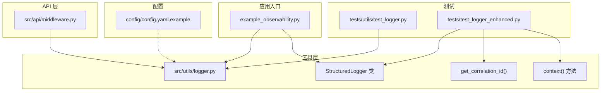
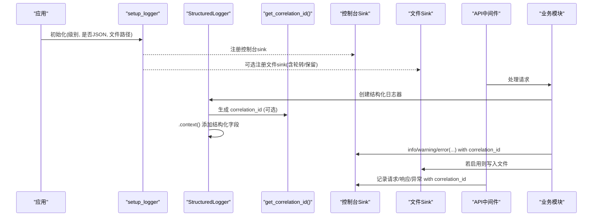
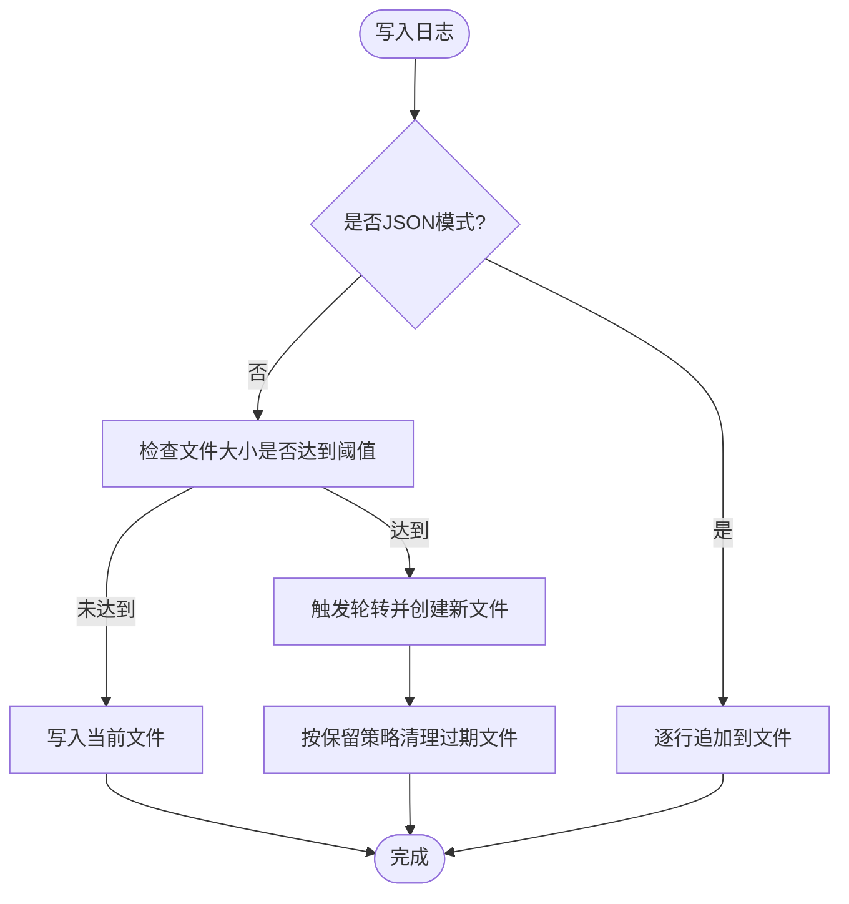
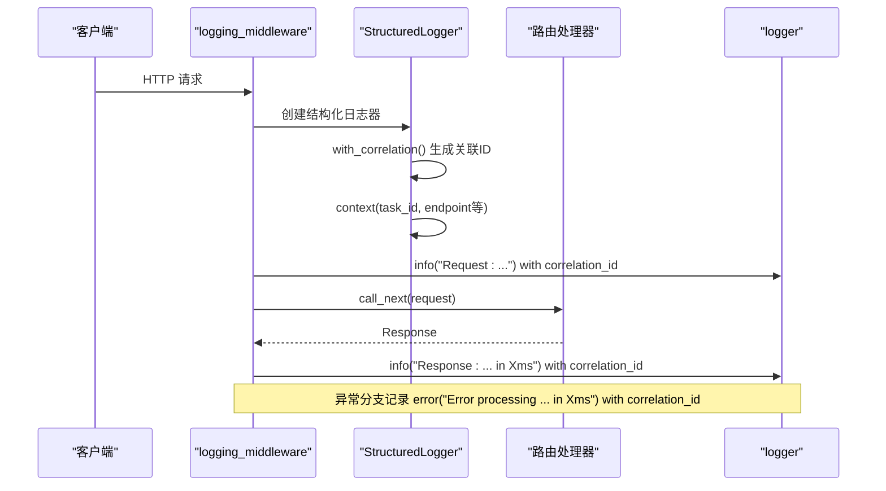
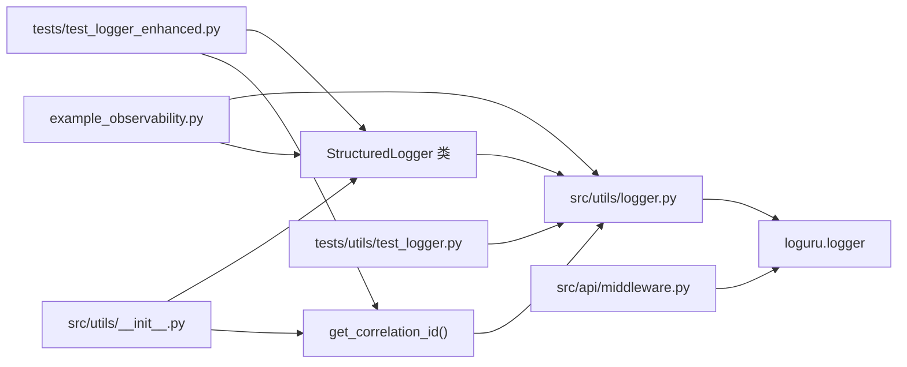

# 日志系统

<cite>
**本文引用的文件**
- [src/utils/logger.py](file://src/utils/logger.py)
- [config/config.yaml.example](file://config/config.yaml.example)
- [example_observability.py](file://example_observability.py)
- [src/api/middleware.py](file://src/api/middleware.py)
- [tests/utils/test_logger.py](file://tests/utils/test_logger.py)
- [tests/test_logger_enhanced.py](file://tests/test_logger_enhanced.py)
- [src/utils/__init__.py](file://src/utils/__init__.py)
</cite>

## 更新摘要
**所做更改**
- 新增 StructuredLogger 类的详细文档，包括 correlation_id 绑定和上下文结构化字段功能
- 添加 with_correlation() 方法的自动 UUID 生成功能说明
- 添加 context() 方法的结构化字段管理功能说明
- 更新分布式组件请求追踪的实现方式
- 增强使用示例，展示新的 API 用法

## 目录
1. [简介](#简介)
2. [项目结构](#项目结构)
3. [核心组件](#核心组件)
4. [架构总览](#架构总览)
5. [详细组件分析](#详细组件分析)
6. [依赖关系分析](#依赖关系分析)
7. [性能与容量规划](#性能与容量规划)
8. [故障排查指南](#故障排查指南)
9. [结论](#结论)
10. [附录：配置与使用示例](#附录配置与使用示例)

## 简介
本技术文档围绕项目的结构化日志系统，系统性说明日志级别设计、JSON 结构化输出、字段定义与序列化策略、日志轮转与存储管理、配置选项与过滤规则，并提供在不同模块中集成日志、添加上下文信息以及追踪请求链路的实践示例。该日志系统基于 loguru，提供控制台与文件两种输出目标，支持 JSON 格式输出与自定义字段注入，便于在 API 中间件与分析流程中进行可观测性建设。**最新更新增强了 StructuredLogger 类，支持 correlation_id 绑定和上下文结构化字段，实现全链路分布式追踪能力。**

## 项目结构
日志相关代码集中在 utils 层，API 中间件直接使用该层的日志能力；配置文件包含日志级别开关；测试用例覆盖 JSON 输出、级别过滤、文件写入以及新的 correlation_id 和上下文管理功能。

**图表来源**
- [src/utils/logger.py:131-215](file://src/utils/logger.py#L131-L215)
- [src/utils/logger.py:119-128](file://src/utils/logger.py#L119-L128)
- [src/utils/logger.py:177-191](file://src/utils/logger.py#L177-L191)
- [src/api/middleware.py:143-172](file://src/api/middleware.py#L143-L172)
- [config/config.yaml.example:36-38](file://config/config.yaml.example#L36-L38)
- [example_observability.py:1-86](file://example_observability.py#L1-L86)
- [tests/utils/test_logger.py:1-173](file://tests/utils/test_logger.py#L1-L173)
- [tests/test_logger_enhanced.py:1-84](file://tests/test_logger_enhanced.py#L1-L84)

**章节来源**
- [src/utils/logger.py:1-216](file://src/utils/logger.py#L1-L216)
- [config/config.yaml.example:36-38](file://config/config.yaml.example#L36-L38)
- [example_observability.py:1-86](file://example_observability.py#L1-L86)
- [src/api/middleware.py:143-172](file://src/api/middleware.py#L143-L172)
- [tests/utils/test_logger.py:1-173](file://tests/utils/test_logger.py#L1-L173)
- [tests/test_logger_enhanced.py:1-84](file://tests/test_logger_enhanced.py#L1-L84)

## 核心组件
- **日志设置器 setup_logger**：统一初始化 sink（控制台/文件），支持 JSON 或文本格式，支持按级别过滤。
- **命名记录器 get_logger**：通过 bind(name=...) 为每个模块绑定独立名称，便于定位来源。
- **关联 ID 生成器 get_correlation_id**：用于跨模块的请求链路追踪，生成唯一 UUID。
- **结构化包装 StructuredLogger**：封装常用级别方法，简化调用，**新增 correlation_id 绑定和上下文结构化字段管理能力**。
- **JSON 序列化器 _json_serializer**：将内部 record 转换为稳定 JSON 字段集合，并透传 extra 中的业务字段。

**章节来源**
- [src/utils/logger.py:11-31](file://src/utils/logger.py#L11-L31)
- [src/utils/logger.py:34-103](file://src/utils/logger.py#L34-L103)
- [src/utils/logger.py:106-128](file://src/utils/logger.py#L106-L128)
- [src/utils/logger.py:119-128](file://src/utils/logger.py#L119-L128)
- [src/utils/logger.py:131-215](file://src/utils/logger.py#L131-L215)

## 架构总览
日志系统在启动时由应用初始化，随后各模块通过 get_logger 获取带 name 的 logger 实例进行记录。**增强的 StructuredLogger 支持 correlation_id 自动绑定和上下文结构化字段，实现分布式组件间的完整请求追踪。** API 中间件在请求进入与返回时记录请求/响应信息，异常路径记录错误详情。JSON 模式下，所有日志以单行 JSON 输出到 stderr 或文件，便于集中采集与检索。

**图表来源**
- [src/utils/logger.py:34-103](file://src/utils/logger.py#L34-L103)
- [src/utils/logger.py:131-215](file://src/utils/logger.py#L131-L215)
- [src/utils/logger.py:119-128](file://src/utils/logger.py#L119-L128)
- [src/api/middleware.py:143-172](file://src/api/middleware.py#L143-L172)

## 详细组件分析

### 日志级别设计与适用场景
- DEBUG：开发调试阶段输出详细执行路径、参数与中间状态，生产环境默认关闭。
- INFO：关键业务流程节点（如请求开始/结束、任务完成）与重要状态变更。
- WARNING：潜在问题或降级行为（如速率限制接近阈值、外部依赖慢调用）。
- ERROR：可恢复的错误（如 I/O 失败、第三方服务超时），需要告警与人工关注。
- CRITICAL：严重错误导致功能不可用（如进程崩溃前、数据损坏），需立即介入。

**章节来源**
- [src/utils/logger.py:44-48](file://src/utils/logger.py#L44-L48)
- [tests/utils/test_logger.py:138-173](file://tests/utils/test_logger.py#L138-L173)

### 结构化日志格式与字段定义
- **输出模式**
  - 控制台：彩色文本格式，便于本地调试。
  - JSON：单行 JSON 输出到 stderr 或文件，便于集中采集。
- **JSON 字段**
  - timestamp：ISO 时间戳
  - level：日志级别名称
  - message：消息体
  - name：模块名（来自 bind(name=...)）
  - file：文件名:行号
  - function：函数名
  - exception：异常字符串（仅在存在异常时出现）
  - **correlation_id：关联 ID（来自 StructuredLogger 绑定）**
  - **其他业务字段：通过 **kwargs 传入的任意键值对自动透传**
- **序列化策略**
  - 使用 ensure_ascii=False 保证中文可读
  - 仅追加非冲突的业务字段，避免覆盖基础字段
  - 异常对象转为字符串后附加

**章节来源**
- [src/utils/logger.py:11-31](file://src/utils/logger.py#L11-L31)
- [tests/utils/test_logger.py:24-42](file://tests/utils/test_logger.py#L24-L42)

### 增强的 StructuredLogger 类

**新增功能** StructuredLogger 类提供了更简洁的接口，支持 correlation_id 绑定和上下文结构化字段，用于全链路追踪。

#### 主要特性
- **自动 correlation_id 生成**：通过 `with_correlation()` 方法自动生成唯一 UUID
- **上下文结构化字段管理**：通过 `context()` 方法添加结构化字段
- **链式调用支持**：支持方法链式调用，构建复杂的日志上下文
- **完整的日志级别支持**：debug、info、warning、error、critical、exception

#### 核心方法

**with_correlation(correlation_id: str | None = None)**
- 返回绑定到 correlation_id 的新 StructuredLogger 实例
- 如果不提供 correlation_id，自动生成唯一 UUID
- 支持显式传入已有的 correlation_id

**context(**kwargs: Any)**
- 返回带有额外上下文字段的新 StructuredLogger 实例
- 支持多个键值对作为结构化字段
- 上下文字段会合并到后续所有日志记录中

**章节来源**
- [src/utils/logger.py:131-215](file://src/utils/logger.py#L131-L215)
- [tests/test_logger_enhanced.py:32-74](file://tests/test_logger_enhanced.py#L32-L74)

### 关联 ID 生成与管理

**get_correlation_id()**
- 生成简单的 correlation_id（用于请求追踪）
- 返回有效的 UUID v4 字符串
- 每次调用返回唯一的 ID

**章节来源**
- [src/utils/logger.py:119-128](file://src/utils/logger.py#L119-L128)
- [tests/test_logger_enhanced.py:16-29](file://tests/test_logger_enhanced.py#L16-L29)

### 日志轮转与存储管理
- **文件大小限制**：普通文本文件模式启用 rotation="10 MB"，超过大小自动切分。
- **保留策略**：retention="7 days"，超过保留期的旧文件将被清理。
- **编码**：UTF-8，确保多语言内容正确写入。
- **JSON 文件模式**：当前实现为逐条追加，未内置轮转与保留策略，建议上层结合外部工具或扩展 sink 实现。

**图表来源**
- [src/utils/logger.py:95-103](file://src/utils/logger.py#L95-L103)

**章节来源**
- [src/utils/logger.py:95-103](file://src/utils/logger.py#L95-L103)

### 日志配置选项说明
- **级别 level**：支持 DEBUG、INFO、WARNING、ERROR、CRITICAL，默认 INFO。
- **输出目标**
  - 控制台：始终启用，JSON 模式输出到 stderr，文本模式彩色输出。
  - 文件：可选，指定路径后同时写入文件；JSON 模式无内置轮转/保留。
- **格式化模板 format_str**：仅在文本模式有效，JSON 模式使用固定 JSON 结构。
- **过滤规则**：通过 level 控制最低级别，低于该级别的日志将被丢弃。
- **配置文件**：示例配置中包含 logging.level 字段，可在应用启动时读取并传入 setup_logger。

**章节来源**
- [src/utils/logger.py:34-77](file://src/utils/logger.py#L34-L77)
- [config/config.yaml.example:36-38](file://config/config.yaml.example#L36-L38)

### 在 API 中间件中集成日志与链路追踪
- 中间件在请求进入时记录方法与路径，在成功返回时记录状态码与耗时，异常路径记录错误信息与耗时。
- **推荐使用 StructuredLogger 的 with_correlation() 方法生成 correlation_id 并通过 context() 方法注入后续所有日志，以便跨模块串联请求链路。**

**图表来源**
- [src/api/middleware.py:143-172](file://src/api/middleware.py#L143-L172)
- [src/utils/logger.py:161-175](file://src/utils/logger.py#L161-L175)

**章节来源**
- [src/api/middleware.py:143-172](file://src/api/middleware.py#L143-L172)

### 在不同模块中集成日志与添加上下文

**推荐方式**
- 使用 `get_logger("模块名")` 获取命名 logger，便于定位来源。
- **使用 StructuredLogger 的 with_correlation() 和 context() 方法进行结构化日志记录。**
- 通过 **kwargs 传递业务上下文（如 task_id、correlation_id、endpoint 等）。
- 在异常捕获处使用 exception 级别记录堆栈信息。

**使用示例**
- 示例脚本展示了如何初始化 JSON 模式、生成 correlation_id 并在不同模块中使用结构化日志。
- **新的 StructuredLogger 支持链式调用，提供更简洁的 API 接口。**

**章节来源**
- [example_observability.py:7-33](file://example_observability.py#L7-L33)
- [src/utils/logger.py:106-128](file://src/utils/logger.py#L106-L128)
- [src/utils/logger.py:131-215](file://src/utils/logger.py#L131-L215)

## 依赖关系分析
- **内部依赖**
  - API 中间件直接依赖 loguru 的全局 logger 实例进行记录。
  - 工具层提供统一的初始化与包装接口，供应用与测试使用。
  - **StructuredLogger 类导出到 utils 模块，便于全局访问。**
- **外部依赖**
  - loguru：提供 sink、轮转、保留、格式化等能力。
- **耦合与内聚**
  - 工具层高内聚，对外暴露最小接口；中间件与业务模块低耦合，通过标准 logger 接口交互。
  - **StructuredLogger 类封装了 correlation_id 管理和上下文结构化逻辑，提高内聚性。**
- **循环依赖**
  - 未发现循环导入；日志模块不反向依赖业务模块。

**图表来源**
- [src/utils/logger.py:1-10](file://src/utils/logger.py#L1-L10)
- [src/utils/logger.py:131-215](file://src/utils/logger.py#L131-L215)
- [src/utils/logger.py:119-128](file://src/utils/logger.py#L119-L128)
- [src/api/middleware.py:1-15](file://src/api/middleware.py#L1-L15)
- [example_observability.py:1-10](file://example_observability.py#L1-L10)
- [tests/utils/test_logger.py:1-10](file://tests/utils/test_logger.py#L1-L10)
- [tests/test_logger_enhanced.py:1-13](file://tests/test_logger_enhanced.py#L1-L13)
- [src/utils/__init__.py:14-27](file://src/utils/__init__.py#L14-L27)

**章节来源**
- [src/utils/logger.py:1-10](file://src/utils/logger.py#L1-L10)
- [src/api/middleware.py:1-15](file://src/api/middleware.py#L1-L15)
- [example_observability.py:1-10](file://example_observability.py#L1-L10)
- [tests/utils/test_logger.py:1-10](file://tests/utils/test_logger.py#L1-L10)
- [src/utils/__init__.py:14-27](file://src/utils/__init__.py#L14-L27)

## 性能与容量规划
- **输出目标选择**
  - 开发环境：控制台彩色文本，便于快速定位问题。
  - 生产环境：JSON 模式 + 文件持久化，便于集中采集与审计。
- **轮转与保留**
  - 文本模式默认 10MB 轮转、7天保留，适合中等流量场景。
  - JSON 模式未内置轮转/保留，建议配合外部日志收集器（如 journald、fluent-bit）或扩展 sink 实现。
- **级别控制**
  - 生产默认 INFO，降低 IO 压力；仅在排障时临时提升级别。
- **字段精简**
  - 避免在高频路径记录大对象，必要时采样或脱敏。
- **结构化日志优化**
  - **StructuredLogger 的上下文字段会在内存中累积，注意不要添加过大的对象。**
  - **correlation_id 生成使用 UUID v4，性能开销较小，适合高并发场景。**

## 故障排查指南
- **常见问题**
  - 日志未输出：确认已调用 setup_logger 且级别不低于期望级别。
  - JSON 解析失败：检查是否混入非 JSON 输出（如 print），确保只使用 logger 输出。
  - 文件权限错误：确认日志目录存在且可写。
  - 轮转未生效：确认使用的是文本模式；JSON 模式需外部机制处理。
  - **correlation_id 丢失：检查是否正确使用了 with_correlation() 方法或在上下文中绑定了 correlation_id。**
- **定位技巧**
  - 使用 correlation_id 串联请求链路。
  - 在异常分支使用 exception 级别记录完整堆栈。
  - 通过 name 字段快速筛选模块日志。
  - **利用 StructuredLogger 的 context() 方法添加丰富的结构化字段，便于问题定位。**

**章节来源**
- [src/utils/logger.py:34-103](file://src/utils/logger.py#L34-L103)
- [src/utils/logger.py:119-128](file://src/utils/logger.py#L119-L128)
- [tests/utils/test_logger.py:44-58](file://tests/utils/test_logger.py#L44-L58)
- [tests/test_logger_enhanced.py:40-74](file://tests/test_logger_enhanced.py#L40-L74)

## 结论
该日志系统以 loguru 为基础，提供了简洁的结构化日志能力：统一的初始化接口、灵活的输出目标、稳定的 JSON 字段模型、开箱即用的轮转与保留策略（文本模式），以及与 API 中间件的无缝集成。**最新的 StructuredLogger 增强功能提供了强大的 correlation_id 绑定和上下文结构化字段管理能力，实现了完整的分布式组件请求追踪。** 通过合理的级别控制与上下文注入，可有效支撑开发与生产环境的可观测性与问题定位。

## 附录：配置与使用示例
- **配置项**
  - logging.level：控制全局最低级别，示例值为 "INFO"。
- **初始化示例**
  - 在应用启动时调用 setup_logger(level="INFO", json_format=True)，或在需要文件输出时指定 log_file。
- **使用示例**
  - 使用 get_logger("模块名") 获取命名 logger，并通过 **kwargs 注入业务上下文。
  - **使用 StructuredLogger 的 with_correlation() 方法自动生成 correlation_id，或通过 context() 方法添加结构化字段。**
  - **支持链式调用：log.with_correlation().context(task_id=123).info("message")**
  - 在中间件生成 correlation_id 并注入到后续日志中，实现端到端追踪。
  - 在异常捕获处使用 exception 级别记录异常信息。

**章节来源**
- [config/config.yaml.example:36-38](file://config/config.yaml.example#L36-L38)
- [example_observability.py:7-33](file://example_observability.py#L7-L33)
- [src/api/middleware.py:143-172](file://src/api/middleware.py#L143-L172)
- [tests/utils/test_logger.py:17-42](file://tests/utils/test_logger.py#L17-L42)
- [src/utils/logger.py:136-143](file://src/utils/logger.py#L136-L143)
- [tests/test_logger_enhanced.py:40-74](file://tests/test_logger_enhanced.py#L40-L74)