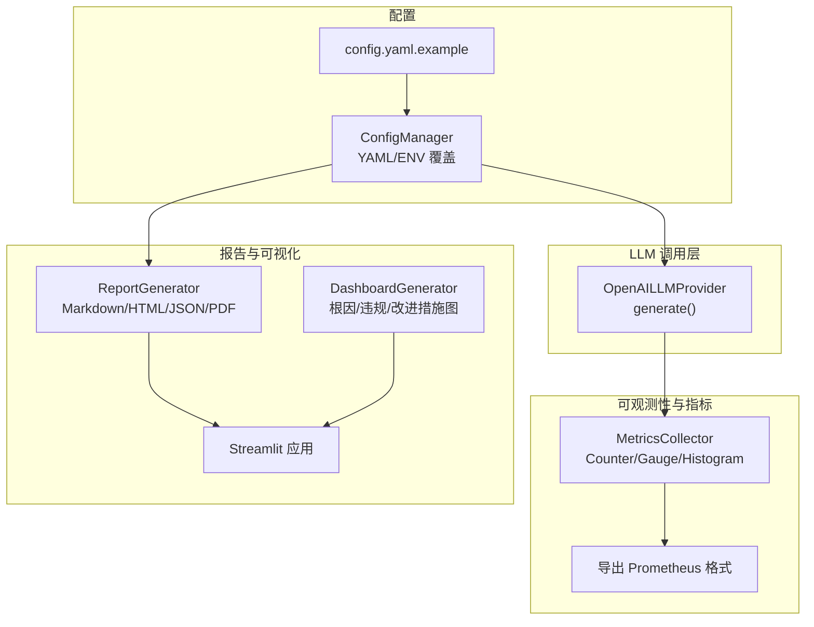
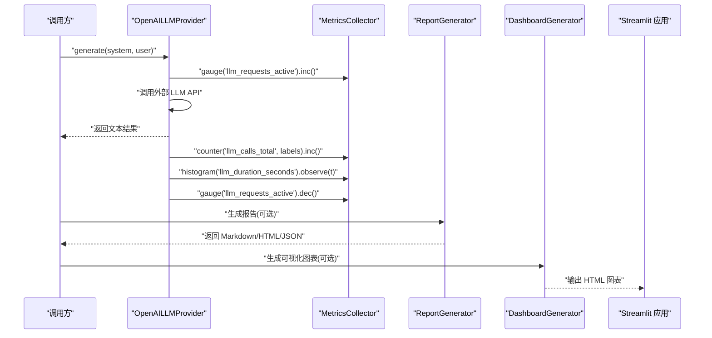
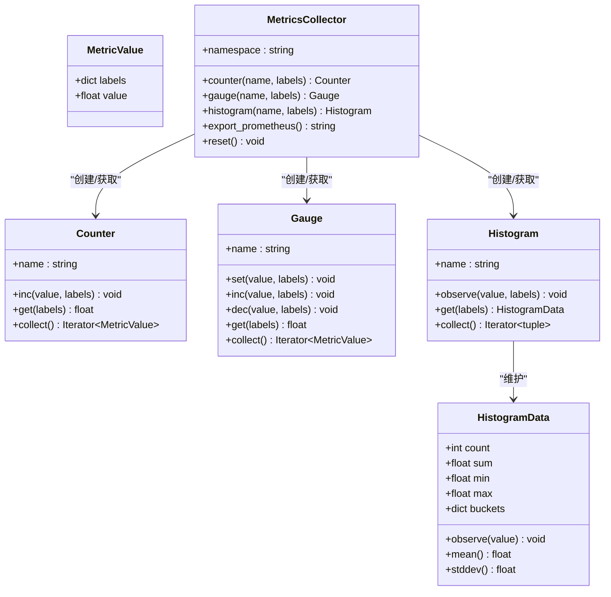
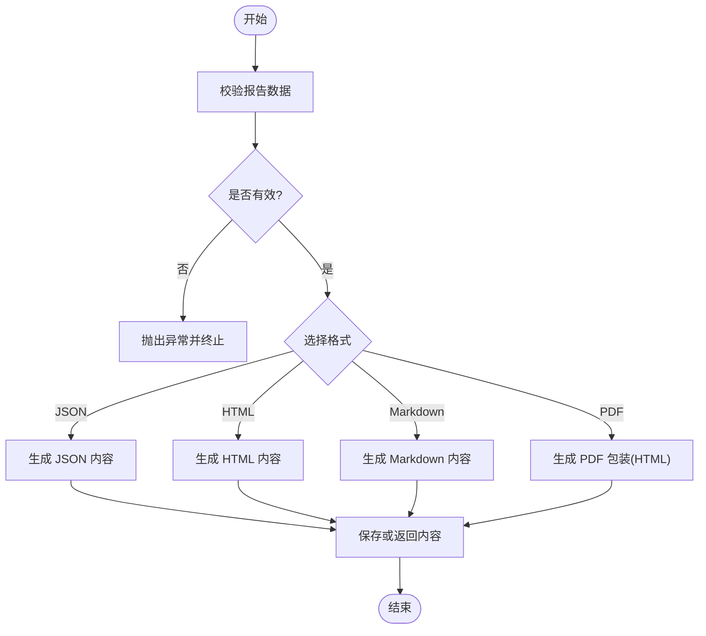
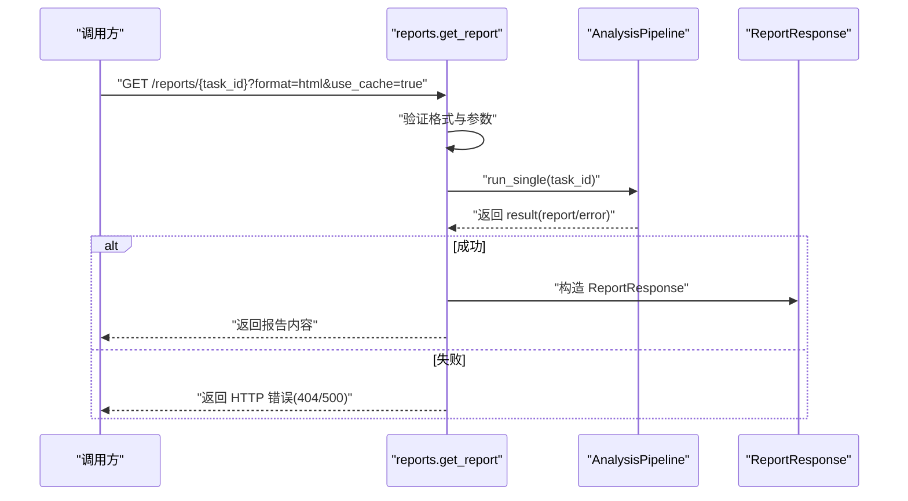
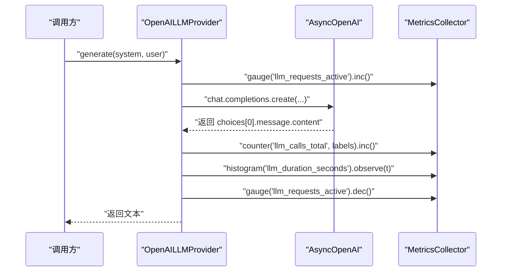
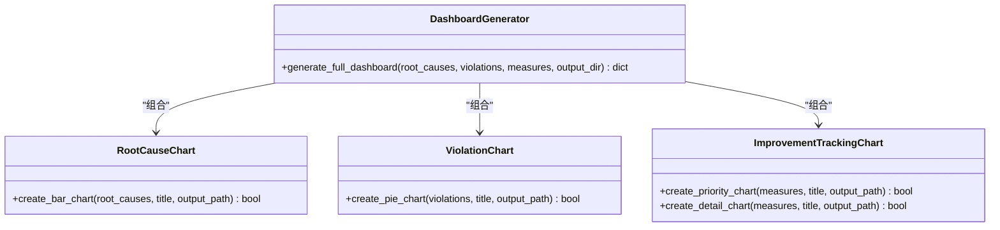
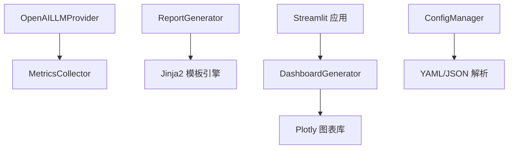

# 使用监控系统

<cite>
**本文引用的文件**   
- [src/utils/metrics.py](file://src/utils/metrics.py)
- [docs/observability_guide.md](file://docs/observability_guide.md)
- [example_observability.py](file://example_observability.py)
- [src/report/generator.py](file://src/report/generator.py)
- [src/api/routes/reports.py](file://src/api/routes/reports.py)
- [src/analyzer/llm_provider.py](file://src/analyzer/llm_provider.py)
- [config/config.yaml.example](file://config/config.yaml.example)
- [src/config/manager.py](file://src/config/manager.py)
- [src/visualization/charts.py](file://src/visualization/charts.py)
- [src/ui/streamlit_app.py](file://src/ui/streamlit_app.py)
</cite>

## 目录
1. [简介](#简介)
2. [项目结构](#项目结构)
3. [核心组件](#核心组件)
4. [架构总览](#架构总览)
5. [详细组件分析](#详细组件分析)
6. [依赖关系分析](#依赖关系分析)
7. [性能与成本考量](#性能与成本考量)
8. [故障排查指南](#故障排查指南)
9. [结论](#结论)
10. [附录](#附录)

## 简介
本技术文档面向“LLM 使用监控系统”，聚焦以下目标：
- 成本追踪机制：API 调用统计、token 使用量记录、费用计算逻辑（可扩展）
- 统计分析功能：使用趋势分析、成本分布统计、性能指标收集
- 报告生成系统：定期报告、实时数据展示、历史数据分析
- 监控配置选项：数据采集频率、存储策略、告警规则设置
- 监控仪表板使用指南与自定义监控指标添加方法

本项目已具备完善的可观测性基础设施（结构化日志、Prometheus 格式指标导出）、可视化图表与报告生成能力，以及 LLM 调用提供者。本文将在现有实现基础上，给出针对 LLM 成本与使用监控的落地方案与扩展建议。

## 项目结构
围绕监控与报告的核心模块分布如下：
- 指标采集与导出：src/utils/metrics.py
- 可观测性使用指南与示例：docs/observability_guide.md、example_observability.py
- 报告生成：src/report/generator.py
- 报告 API：src/api/routes/reports.py
- LLM 调用提供者：src/analyzer/llm_provider.py
- 配置管理：config/config.yaml.example、src/config/manager.py
- 可视化与仪表板：src/visualization/charts.py、src/ui/streamlit_app.py

图示来源
- [src/utils/metrics.py:151-252](file://src/utils/metrics.py#L151-L252)
- [src/analyzer/llm_provider.py:38-52](file://src/analyzer/llm_provider.py#L38-L52)
- [src/report/generator.py:222-447](file://src/report/generator.py#L222-L447)
- [src/visualization/charts.py:335-399](file://src/visualization/charts.py#L335-L399)
- [src/ui/streamlit_app.py:26-38](file://src/ui/streamlit_app.py#L26-L38)
- [src/config/manager.py:42-100](file://src/config/manager.py#L42-L100)
- [config/config.yaml.example:1-38](file://config/config.yaml.example#L1-L38)

章节来源
- [src/utils/metrics.py:1-252](file://src/utils/metrics.py#L1-L252)
- [docs/observability_guide.md:1-168](file://docs/observability_guide.md#L1-L168)
- [example_observability.py:1-85](file://example_observability.py#L1-L85)
- [src/report/generator.py:1-790](file://src/report/generator.py#L1-L790)
- [src/api/routes/reports.py:1-130](file://src/api/routes/reports.py#L1-L130)
- [src/analyzer/llm_provider.py:1-67](file://src/analyzer/llm_provider.py#L1-L67)
- [config/config.yaml.example:1-38](file://config/config.yaml.example#L1-L38)
- [src/config/manager.py:1-268](file://src/config/manager.py#L1-L268)
- [src/visualization/charts.py:1-399](file://src/visualization/charts.py#L1-L399)
- [src/ui/streamlit_app.py:1-200](file://src/ui/streamlit_app.py#L1-L200)

## 核心组件
- 指标收集器 MetricsCollector
  - 提供 Counter、Gauge、Histogram 三类指标，支持标签维度聚合与 Prometheus 格式导出
  - 全局实例 get_metrics_collector(namespace) 便于跨模块共享
- 报告生成器 ReportGenerator
  - 支持 Markdown/HTML/JSON/PDF 输出，内置模板与渲染流程
- LLM 提供者 OpenAILLMProvider
  - 基于异步客户端发起文本生成请求，返回模型响应内容
- 可视化与仪表板 DashboardGenerator
  - 整合根因分布、违规类型分布、改进措施追踪等图表
- 配置管理器 ConfigManager
  - 从 YAML/JSON 加载配置，支持环境变量覆盖与校验

章节来源
- [src/utils/metrics.py:151-252](file://src/utils/metrics.py#L151-L252)
- [src/report/generator.py:222-447](file://src/report/generator.py#L222-L447)
- [src/analyzer/llm_provider.py:38-52](file://src/analyzer/llm_provider.py#L38-L52)
- [src/visualization/charts.py:335-399](file://src/visualization/charts.py#L335-L399)
- [src/config/manager.py:42-100](file://src/config/manager.py#L42-L100)

## 架构总览
下图展示了“LLM 使用监控”的关键交互路径：在 LLM 调用前后埋点采集指标，结合报告与可视化形成闭环。

图示来源
- [src/analyzer/llm_provider.py:38-52](file://src/analyzer/llm_provider.py#L38-L52)
- [src/utils/metrics.py:151-252](file://src/utils/metrics.py#L151-L252)
- [src/report/generator.py:222-447](file://src/report/generator.py#L222-L447)
- [src/visualization/charts.py:335-399](file://src/visualization/charts.py#L335-L399)
- [src/ui/streamlit_app.py:26-38](file://src/ui/streamlit_app.py#L26-L38)

## 详细组件分析

### 指标收集与导出（MetricsCollector）
- 设计要点
  - 计数器 Counter：累计值只增不减，适合统计 API 调用次数、错误数等
  - 仪表盘 Gauge：当前值可增可减，适合活跃请求数、队列长度等
  - 直方图 Histogram：记录分布，默认分桶包含常用阈值，适合延迟、token 用量等
  - 标签 Labels：通过键值对进行维度聚合，如 endpoint、model、status_code
  - Prometheus 导出：统一命名空间前缀，按 TYPE 分类输出，兼容主流监控系统
- 复杂度与性能
  - 时间复杂度：单次 inc/observe/set 为 O(1)，collect/export 为 O(N)
  - 空间复杂度：与指标数量及标签组合数线性相关
- 扩展建议（用于 LLM 成本追踪）
  - 新增 token 用量直方图：llm_input_tokens、llm_output_tokens
  - 新增费用计数器：llm_cost_usd（单位美元），可按模型单价换算
  - 增加错误码标签：status_code、error_type，便于定位失败原因

图示来源
- [src/utils/metrics.py:9-52](file://src/utils/metrics.py#L9-L52)
- [src/utils/metrics.py:54-149](file://src/utils/metrics.py#L54-L149)
- [src/utils/metrics.py:151-252](file://src/utils/metrics.py#L151-L252)

章节来源
- [src/utils/metrics.py:1-252](file://src/utils/metrics.py#L1-L252)
- [docs/observability_guide.md:74-168](file://docs/observability_guide.md#L74-L168)
- [example_observability.py:36-85](file://example_observability.py#L36-L85)

### 报告生成系统（ReportGenerator）
- 功能概览
  - 支持多种报告类型与格式：summary/detailed/clustering/root_cause/trend；markdown/html/json/pdf
  - 内置模板与渲染流程，支持自定义模板目录
  - 数据校验与保存，统一时间戳与元数据
- 关键流程
  - generate(data, format, filename) -> 校验数据 -> 生成内容 -> 可选保存到文件
  - _generate_content(format) -> 根据格式选择渲染路径
  - save_report(content, output_path) -> 写入磁盘
- 适用场景
  - 定期生成分析报告（如每日/每周）
  - 将指标与可视化嵌入报告，形成历史对比

图示来源
- [src/report/generator.py:395-447](file://src/report/generator.py#L395-L447)
- [src/report/generator.py:702-706](file://src/report/generator.py#L702-L706)

章节来源
- [src/report/generator.py:1-790](file://src/report/generator.py#L1-L790)

### 报告 API（/reports/{task_id}）
- 路由职责
  - 接收任务 ID 与格式参数，构建 Pipeline 配置以仅生成报告
  - 返回 ReportResponse，包含 task_id、report_format、content
- 错误处理
  - 无效格式返回 400
  - 任务不存在返回 404
  - 其他异常返回 500

图示来源
- [src/api/routes/reports.py:16-130](file://src/api/routes/reports.py#L16-L130)

章节来源
- [src/api/routes/reports.py:1-130](file://src/api/routes/reports.py#L1-L130)

### LLM 调用提供者（OpenAILLMProvider）
- 功能要点
  - 初始化时缓存异步客户端，避免重复创建
  - generate(system, user) 调用 chat.completions.create，返回消息内容
- 监控埋点建议
  - 在调用前后记录活跃请求数、耗时直方图、调用计数
  - 记录模型名称、温度、最大 token 等标签，便于成本分摊

图示来源
- [src/analyzer/llm_provider.py:38-52](file://src/analyzer/llm_provider.py#L38-L52)
- [src/utils/metrics.py:151-252](file://src/utils/metrics.py#L151-L252)

章节来源
- [src/analyzer/llm_provider.py:1-67](file://src/analyzer/llm_provider.py#L1-L67)

### 可视化与仪表板（DashboardGenerator）
- 能力范围
  - 根因分布柱状图、违规类型饼图、改进措施优先级与详情图
  - 一键生成完整仪表板，输出多个 HTML 文件
- 集成方式
  - Streamlit 页面中直接调用图表生成器，展示统计与可视化结果

图示来源
- [src/visualization/charts.py:15-85](file://src/visualization/charts.py#L15-L85)
- [src/visualization/charts.py:87-161](file://src/visualization/charts.py#L87-L161)
- [src/visualization/charts.py:163-333](file://src/visualization/charts.py#L163-L333)
- [src/visualization/charts.py:335-399](file://src/visualization/charts.py#L335-L399)

章节来源
- [src/visualization/charts.py:1-399](file://src/visualization/charts.py#L1-L399)
- [src/ui/streamlit_app.py:352-423](file://src/ui/streamlit_app.py#L352-L423)

### 配置管理（ConfigManager 与 config.yaml.example）
- 配置来源
  - YAML/JSON 文件加载，支持合并与覆盖
  - 环境变量覆盖映射（如 llm.model、llm.api_key、embedding.provider 等）
- 监控相关配置项建议
  - metrics.export_interval：指标导出间隔（秒）
  - metrics.namespace：命名空间前缀
  - alert.rules：告警规则列表（阈值、窗口、通知渠道）
  - storage.strategy：指标存储策略（内存/持久化）

章节来源
- [src/config/manager.py:183-268](file://src/config/manager.py#L183-L268)
- [config/config.yaml.example:1-38](file://config/config.yaml.example#L1-L38)

## 依赖关系分析
- 组件耦合
  - OpenAILLMProvider 与 MetricsCollector 松耦合，通过函数式埋点接入
  - ReportGenerator 独立于指标层，可通过注入数据源扩展
  - DashboardGenerator 与 Streamlit 解耦，输出静态 HTML 供任意前端消费
- 外部依赖
  - LLM 调用依赖 openai 异步客户端
  - 可视化依赖 plotly
  - 配置依赖 yaml/json

图示来源
- [src/analyzer/llm_provider.py:22-36](file://src/analyzer/llm_provider.py#L22-L36)
- [src/report/generator.py:7-11](file://src/report/generator.py#L7-L11)
- [src/visualization/charts.py:8-9](file://src/visualization/charts.py#L8-L9)
- [src/config/manager.py:7-9](file://src/config/manager.py#L7-L9)
- [src/ui/streamlit_app.py:7-15](file://src/ui/streamlit_app.py#L7-L15)

章节来源
- [src/analyzer/llm_provider.py:1-67](file://src/analyzer/llm_provider.py#L1-L67)
- [src/report/generator.py:1-790](file://src/report/generator.py#L1-L790)
- [src/visualization/charts.py:1-399](file://src/visualization/charts.py#L1-L399)
- [src/config/manager.py:1-268](file://src/config/manager.py#L1-L268)
- [src/ui/streamlit_app.py:1-200](file://src/ui/streamlit_app.py#L1-L200)

## 性能与成本考量
- 指标采集开销
  - 高频埋点应控制标签基数，避免笛卡尔积爆炸
  - 直方图默认分桶较细，可根据业务调整桶边界以减少内存占用
- LLM 调用成本
  - 建议在 Provider 层记录输入/输出 token 数与耗时，结合模型单价估算费用
  - 对高并发场景启用连接池与重试退避，降低超时与重复调用
- 报告与可视化
  - 批量生成报告时采用异步与分页策略，避免一次性加载大量数据
  - 图表输出为静态 HTML，适合离线归档与定时分发

[本节为通用指导，不直接分析具体文件]

## 故障排查指南
- 常见问题定位
  - 指标未更新：检查是否在关键路径调用 inc/observe/set，确认命名空间与标签一致
  - 报告生成失败：确认 ReportData 必填字段与模板存在，查看日志中的模板回退提示
  - LLM 调用失败：检查 openai 包安装、API Key 与 base_url 配置，关注状态码与错误信息
- 日志与调试
  - 使用结构化日志记录关联 ID、端点、方法等上下文
  - 导出 Prometheus 格式指标到本地文件，便于离线分析

章节来源
- [docs/observability_guide.md:1-168](file://docs/observability_guide.md#L1-L168)
- [example_observability.py:1-85](file://example_observability.py#L1-L85)
- [src/report/generator.py:718-737](file://src/report/generator.py#L718-L737)
- [src/analyzer/llm_provider.py:22-36](file://src/analyzer/llm_provider.py#L22-L36)

## 结论
本项目已具备完善的指标采集、报告生成与可视化能力。为实现“LLM 使用监控”，建议在 LLM 提供者层完善 token 用量与费用指标埋点，结合配置管理与报告系统，形成“采集—分析—报告—可视化”的闭环。通过合理控制标签基数与分桶策略，可在保证精度的同时兼顾性能。

[本节为总结性内容，不直接分析具体文件]

## 附录

### 监控配置选项建议
- 数据采集频率
  - metrics.export_interval：指标导出间隔（秒），默认建议 15-60s
  - metrics.namespace：命名空间前缀，区分不同服务或环境
- 存储策略
  - metrics.storage：内存/持久化（SQLite/文件），生产环境推荐持久化
  - metrics.retention_days：保留天数，配合清理任务使用
- 告警规则设置
  - alert.rules：数组，每项包含指标名、阈值、窗口、通知渠道
  - alert.cooldown：冷却时间，避免风暴式告警

章节来源
- [src/config/manager.py:191-243](file://src/config/manager.py#L191-L243)
- [config/config.yaml.example:1-38](file://config/config.yaml.example#L1-L38)

### 监控仪表板使用指南
- 启动 Streamlit 应用，进入“可视化图表”页面
- 确保已完成聚类分析，系统将自动加载向量数据库与元数据
- 查看根因分布与违规类型分布图表，必要时导出 HTML 文件
- 在“改进措施”页面查看建议与优先级，辅助决策

章节来源
- [src/ui/streamlit_app.py:26-38](file://src/ui/streamlit_app.py#L26-L38)
- [src/ui/streamlit_app.py:352-423](file://src/ui/streamlit_app.py#L352-L423)
- [src/visualization/charts.py:335-399](file://src/visualization/charts.py#L335-L399)

### 自定义监控指标添加方法
- 步骤
  - 在关键路径获取 MetricsCollector 实例（或使用全局实例）
  - 选择合适的指标类型（Counter/Gauge/Histogram）并记录
  - 为指标添加有意义的标签（如 model、endpoint、status_code）
  - 导出 Prometheus 格式，接入监控系统（如 Prometheus/Grafana）
- 示例参考
  - 全局指标收集器使用示例见 example_observability.py
  - 指标类型与用法见 docs/observability_guide.md

章节来源
- [example_observability.py:67-85](file://example_observability.py#L67-L85)
- [docs/observability_guide.md:74-168](file://docs/observability_guide.md#L74-L168)
- [src/utils/metrics.py:246-252](file://src/utils/metrics.py#L246-L252)
