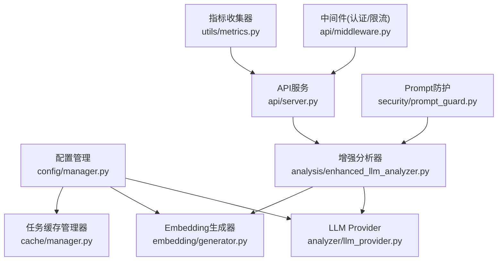
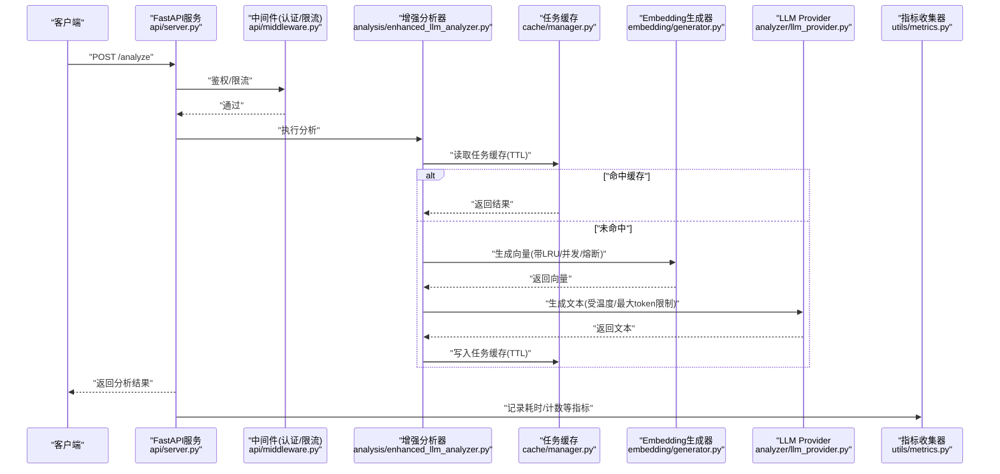
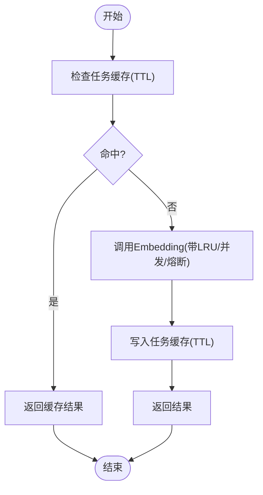
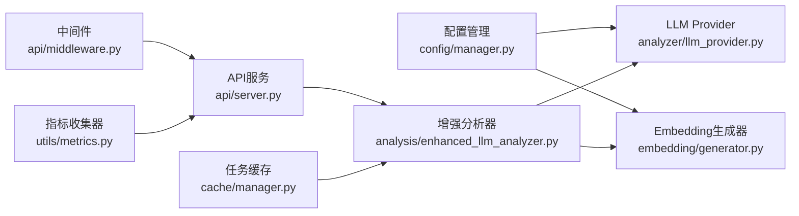

# 成本优化建议

<cite>
**本文引用的文件**   
- [README.md](file://README.md)
- [config.yaml.example](file://config/config.yaml.example)
- [llm_provider.py](file://src/analyzer/llm_provider.py)
- [manager.py](file://src/cache/manager.py)
- [manager.py](file://src/config/manager.py)
- [metrics.py](file://src/utils/metrics.py)
- [enhanced_llm_analyzer.py](file://src/analysis/enhanced_llm_analyzer.py)
- [generator.py](file://src/embedding/generator.py)
- [prompt_guard.py](file://src/security/prompt_guard.py)
- [circuit_breaker.py](file://src/utils/circuit_breaker.py)
- [models.py](file://src/core/models.py)
- [server.py](file://src/api/server.py)
- [middleware.py](file://src/api/middleware.py)
- [API.md](file://docs/API.md)
- [observability_guide.md](file://docs/observability_guide.md)
</cite>

## 目录
1. [引言](#引言)
2. [项目结构](#项目结构)
3. [核心组件](#核心组件)
4. [架构总览](#架构总览)
5. [详细组件分析](#详细组件分析)
6. [依赖关系分析](#依赖关系分析)
7. [性能与成本考量](#性能与成本考量)
8. [故障排查指南](#故障排查指南)
9. [结论](#结论)
10. [附录](#附录)

## 引言
本文件面向LLM成本优化，结合仓库现有实现，提供可落地的技术建议与最佳实践。重点覆盖：
- 模型选择策略（性价比、适用场景、混合使用）
- 提示词优化技巧（Prompt工程、上下文压缩、响应格式优化）
- 结果缓存机制（策略设计、失效策略、命中率提升）
- 具体优化案例（节约效果、性能数据、实施步骤）
- 持续优化的监控指标与改进建议

## 项目结构
本项目围绕“故障复盘分析”构建，包含配置管理、LLM调用、嵌入生成、缓存、规则引擎、报告生成、API服务与可观测性模块等。与成本优化直接相关的核心路径包括：
- LLM提供商抽象与参数化
- Embedding生成器（含LRU缓存、自适应限流、熔断）
- 任务级SQLite缓存（TTL、统计、清理）
- 配置与环境变量覆盖（便于按环境切换模型/Provider）
- 指标导出（Prometheus格式）与日志规范

图表来源
- [manager.py:1-268](file://src/config/manager.py#L1-L268)
- [llm_provider.py:1-67](file://src/analyzer/llm_provider.py#L1-L67)
- [generator.py:1-427](file://src/embedding/generator.py#L1-L427)
- [manager.py:1-165](file://src/cache/manager.py#L1-L165)
- [enhanced_llm_analyzer.py:1-206](file://src/analysis/enhanced_llm_analyzer.py#L1-L206)
- [server.py:1-152](file://src/api/server.py#L1-L152)
- [middleware.py:93-120](file://src/api/middleware.py#L93-L120)
- [metrics.py:1-252](file://src/utils/metrics.py#L1-L252)
- [prompt_guard.py:1-198](file://src/security/prompt_guard.py#L1-L198)

章节来源
- [README.md:1-101](file://README.md#L1-L101)

## 核心组件
- 配置与环境覆盖：支持YAML/JSON加载、环境变量覆盖、类型校验，便于按环境动态切换Provider/模型/并发/缓存等参数。
- LLM Provider：封装异步调用，暴露temperature、max_tokens等关键成本参数。
- Embedding生成器：内置LRU缓存、自适应QPS限流、并发控制、熔断保护，显著降低重复计算与外部依赖失败带来的成本损耗。
- 任务级缓存：基于SQLite的TTL缓存，提供状态查询、统计与过期清理接口。
- 增强分析器：串联违规检测、代码变更分析、根因验证与文本生成，统一入口便于接入缓存与降级策略。
- 指标与日志：Prometheus格式导出，结构化日志，支撑成本与性能度量。

章节来源
- [manager.py:1-268](file://src/config/manager.py#L1-L268)
- [llm_provider.py:1-67](file://src/analyzer/llm_provider.py#L1-L67)
- [generator.py:1-427](file://src/embedding/generator.py#L1-L427)
- [manager.py:1-165](file://src/cache/manager.py#L1-L165)
- [enhanced_llm_analyzer.py:1-206](file://src/analysis/enhanced_llm_analyzer.py#L1-L206)
- [metrics.py:1-252](file://src/utils/metrics.py#L1-L252)

## 架构总览
下图展示从API请求到LLM/Embedding调用的主流程，以及缓存、熔断、限流与指标采集点。

图表来源
- [server.py:1-152](file://src/api/server.py#L1-L152)
- [middleware.py:93-120](file://src/api/middleware.py#L93-L120)
- [enhanced_llm_analyzer.py:1-206](file://src/analysis/enhanced_llm_analyzer.py#L1-L206)
- [manager.py:1-165](file://src/cache/manager.py#L1-L165)
- [generator.py:1-427](file://src/embedding/generator.py#L1-L427)
- [llm_provider.py:1-67](file://src/analyzer/llm_provider.py#L1-L67)
- [metrics.py:1-252](file://src/utils/metrics.py#L1-L252)

## 详细组件分析

### 模型选择策略与混合使用
- 多Provider与多模型支持
  - Embedding生成器支持openai、zhipu、volcengine、local等多Provider，并维护维度映射，便于在不同模型间切换。
  - LLM Provider暴露model、temperature、max_tokens等参数，便于在配置层按场景调整。
- 性价比与适用场景
  - 小模型/低成本模型用于常规分类、摘要、轻量推理；大模型用于复杂推理或高价值场景。
  - Embedding优先选择低维/低价模型（如small），对相似度要求高的场景再考虑large。
- 混合使用方案
  - 先走规则/本地逻辑（如本地hash向量、规则匹配），命中则跳过LLM/Embedding。
  - 对高频相似问题启用缓存；对长尾问题按需调用大模型。
- 配置驱动切换
  - 通过配置文件与环境变量覆盖，快速在不同环境切换Provider/模型/并发/缓存策略。

章节来源
- [generator.py:91-135](file://src/embedding/generator.py#L91-L135)
- [llm_provider.py:1-67](file://src/analyzer/llm_provider.py#L1-L67)
- [manager.py:191-243](file://src/config/manager.py#L191-L243)
- [config.yaml.example:1-38](file://config/config.yaml.example#L1-L38)

### 提示词优化技巧
- Prompt注入防护
  - 内置正则模式检测与清洗，避免恶意输入导致额外重试或错误输出。
- 上下文压缩
  - 预处理阶段对片段进行组合与截断，减少无效信息，降低token消耗。
- 响应格式优化
  - 明确输出结构与字段约束，减少二次解析与重试。
- 安全边界
  - 输入长度限制与敏感字符转义，降低异常分支成本。

章节来源
- [prompt_guard.py:1-198](file://src/security/prompt_guard.py#L1-L198)
- [processor.py:180-199](file://src/preprocessor/processor.py#L180-L199)

### 结果缓存机制
- 任务级缓存（SQLite + TTL）
  - 提供get/save/invalidate/stats/cleanup等接口，支持按task_id粒度失效与全局清理。
  - 通过索引与过期时间判断，避免无效读取。
- 嵌入级缓存（LRU + TTL）
  - 文本哈希键+最近最少使用淘汰，避免重复向量化。
- 命中率提升
  - 批量处理前先查缓存，仅对未命中项发起外部调用。
  - 合理设置TTL与容量，平衡内存占用与命中率。

图表来源
- [manager.py:37-88](file://src/cache/manager.py#L37-L88)
- [generator.py:162-217](file://src/embedding/generator.py#L162-L217)

章节来源
- [manager.py:1-165](file://src/cache/manager.py#L1-L165)
- [generator.py:13-52](file://src/embedding/generator.py#L13-L52)

### 容错与稳定性（间接降本）
- 熔断器
  - 对外部API调用进行开/半开/关状态管理，失败阈值触发阻断，恢复后自动闭合，避免雪崩与无效重试。
- 自适应限流
  - 根据成功/失败动态调整QPS，防止超限导致的限流惩罚与重试风暴。
- 并发控制
  - 信号量限制并发度，避免资源争用与超时。

章节来源
- [circuit_breaker.py:1-306](file://src/utils/circuit_breaker.py#L1-L306)
- [generator.py:54-90](file://src/embedding/generator.py#L54-L90)

### 监控与可观测性
- Prometheus指标
  - 计数器、仪表盘、直方图三类指标，支持标签与导出。
- 结构化日志
  - JSON格式输出，便于集中采集与分析。
- 建议指标
  - LLM调用次数/失败率/平均耗时
  - Embedding生成耗时/成功率/缓存命中率
  - 任务缓存命中率/过期条目数
  - API延迟分布/活跃请求数

章节来源
- [metrics.py:1-252](file://src/utils/metrics.py#L1-L252)
- [observability_guide.md:1-229](file://docs/observability_guide.md#L1-L229)

## 依赖关系分析
- 组件耦合
  - 增强分析器依赖LLM Provider与Embedding生成器；API服务依赖中间件与路由；配置管理贯穿各模块。
- 外部依赖
  - OpenAI SDK、httpx（火山视觉）、SQLite、Pydantic、FastAPI等。
- 潜在循环依赖
  - 当前模块划分清晰，未见明显循环导入。

图表来源
- [manager.py:1-268](file://src/config/manager.py#L1-L268)
- [llm_provider.py:1-67](file://src/analyzer/llm_provider.py#L1-L67)
- [generator.py:1-427](file://src/embedding/generator.py#L1-L427)
- [enhanced_llm_analyzer.py:1-206](file://src/analysis/enhanced_llm_analyzer.py#L1-L206)
- [server.py:1-152](file://src/api/server.py#L1-L152)
- [middleware.py:93-120](file://src/api/middleware.py#L93-L120)
- [manager.py:1-165](file://src/cache/manager.py#L1-L165)
- [metrics.py:1-252](file://src/utils/metrics.py#L1-L252)

## 性能与成本考量
- 模型参数调优
  - temperature与max_tokens直接影响输出质量与Token消耗，应在配置中按场景精细化控制。
- 批处理与并发
  - Embedding批量接口与并发控制可减少往返开销；合理batch_size与max_concurrency需压测确定。
- 缓存策略
  - 任务级与嵌入级双层缓存显著提升命中率；TTL与容量需结合业务访问特征调优。
- 熔断与限流
  - 避免外部不稳定导致的重试风暴与配额耗尽；自适应QPS有助于稳定吞吐。
- 输入裁剪与安全
  - 预处理截断与Prompt防护减少无效调用与异常分支。

章节来源
- [llm_provider.py:1-67](file://src/analyzer/llm_provider.py#L1-L67)
- [generator.py:245-321](file://src/embedding/generator.py#L245-L321)
- [manager.py:122-165](file://src/cache/manager.py#L122-L165)
- [circuit_breaker.py:1-306](file://src/utils/circuit_breaker.py#L1-L306)
- [prompt_guard.py:1-198](file://src/security/prompt_guard.py#L1-L198)
- [processor.py:180-199](file://src/preprocessor/processor.py#L180-L199)

## 故障排查指南
- 常见问题定位
  - Token缺失/无效：检查中间件鉴权与速率限制返回码。
  - 外部API失败：查看熔断器状态与错误日志，确认是否进入OPEN/HALF_OPEN。
  - 缓存未命中：核对TTL、key一致性、并发写入竞争。
  - 指标异常：确认命名空间、标签基数与导出端点可用性。
- 诊断手段
  - 开启结构化日志与关联ID，跨组件追踪。
  - 导出Prometheus指标，观察延迟分布与错误率。
  - 使用健康检查端点验证服务就绪。

章节来源
- [middleware.py:93-120](file://src/api/middleware.py#L93-L120)
- [circuit_breaker.py:188-198](file://src/utils/circuit_breaker.py#L188-L198)
- [manager.py:122-165](file://src/cache/manager.py#L122-L165)
- [metrics.py:190-234](file://src/utils/metrics.py#L190-L234)
- [API.md:388-466](file://docs/API.md#L388-L466)

## 结论
通过“模型选择策略 + 提示词优化 + 双层缓存 + 熔断限流 + 可观测性”的组合拳，可在保证质量的前提下显著降低LLM相关成本。建议以配置为中心，按场景分层调用不同模型，并以指标驱动持续迭代。

## 附录

### 配置与环境变量要点
- 主要配置项（示例）
  - llm.provider/model/temperature/max_tokens/base_url
  - embedding.provider/model/batch_size
  - cache.enabled/ttl/storage/db_path
- 环境变量覆盖
  - 支持LLM_*、EMBEDDING_*、CACHE_*等前缀的环境变量覆盖，便于CI/CD与多环境部署。

章节来源
- [config.yaml.example:1-38](file://config/config.yaml.example#L1-L38)
- [manager.py:191-243](file://src/config/manager.py#L191-L243)

### 监控指标清单（建议）
- LLM
  - 调用次数、失败率、平均耗时、P95/P99耗时、Token用量（若可用）
- Embedding
  - 生成耗时、成功率、缓存命中率、并发度、熔断触发次数
- 缓存
  - 任务缓存命中率、过期条目数、清理条数
- API
  - 请求总数、活跃请求、延迟分布、错误码分布、限流拒绝数

章节来源
- [metrics.py:1-252](file://src/utils/metrics.py#L1-L252)
- [observability_guide.md:74-139](file://docs/observability_guide.md#L74-L139)

### 典型优化案例（实施步骤）
- 目标：降低Embedding与LLM调用成本，提升整体吞吐
- 步骤
  1) 启用任务级与嵌入级缓存，设置合理TTL与容量
  2) 将Embedding批量接口与并发控制打开，压测确定batch_size与max_concurrency
  3) 引入熔断与自适应限流，避免外部抖动引发的重试风暴
  4) 在预处理阶段裁剪冗余内容，启用Prompt防护
  5) 按场景拆分模型：常规任务用小模型，复杂推理用大模型
  6) 接入指标与日志，建立看板与告警
- 预期效果
  - 缓存命中率提升带来调用量下降
  - 熔断限流减少失败重试与配额浪费
  - 小模型替代降低单位成本
  - 指标可视化支撑持续优化

[本节为概念性总结，不直接分析具体文件]
