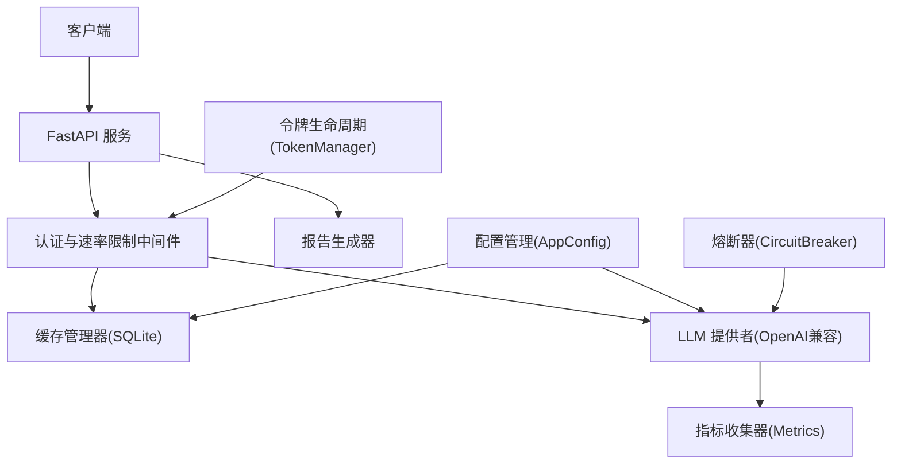
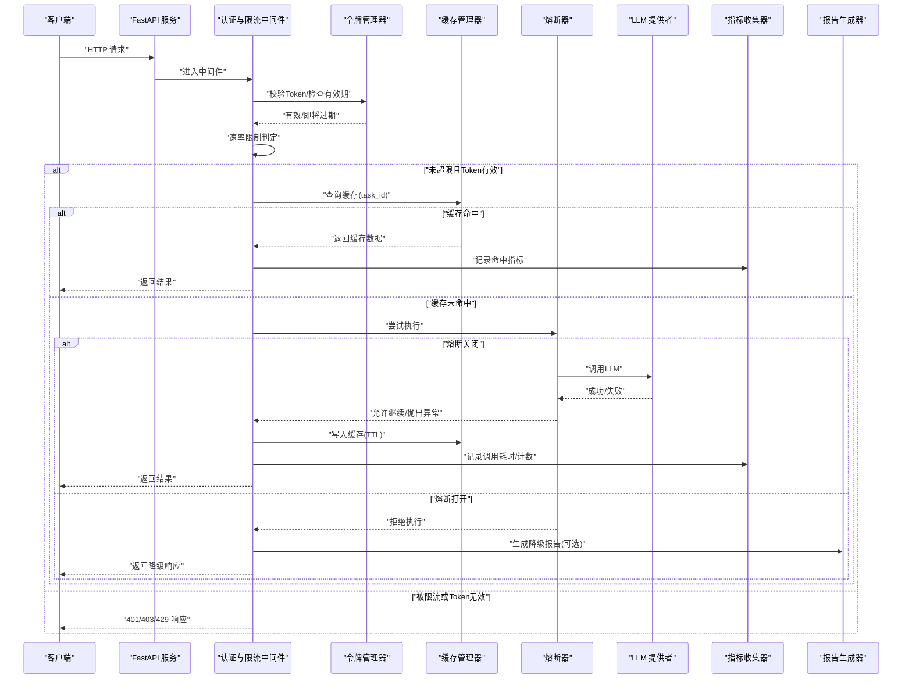
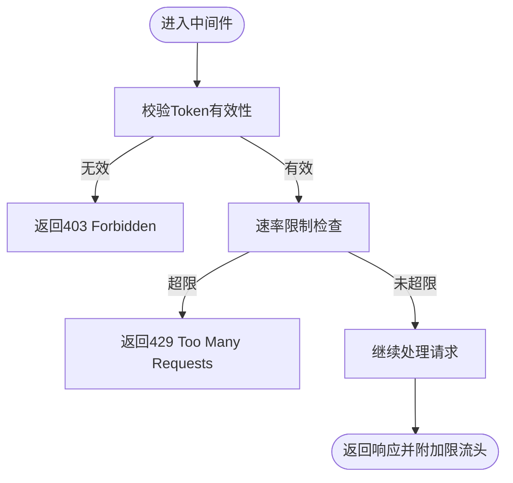
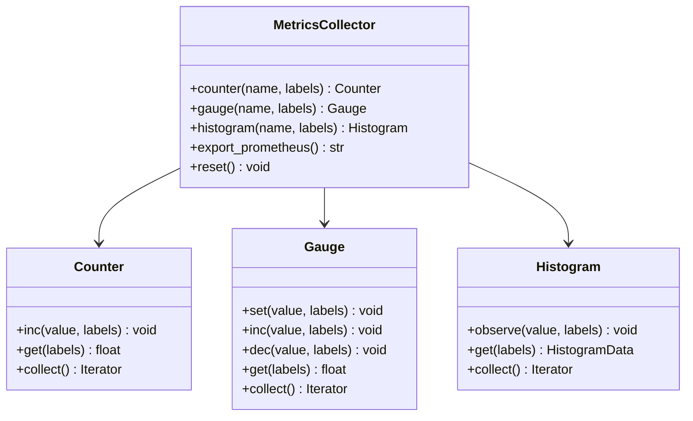
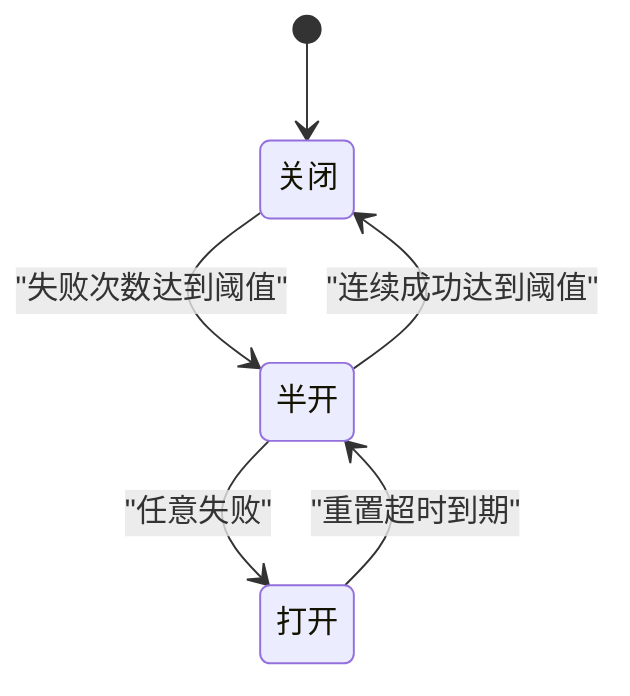
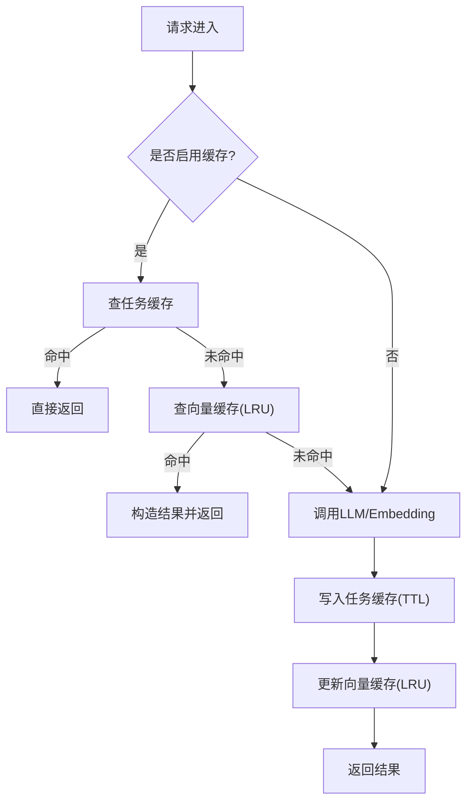
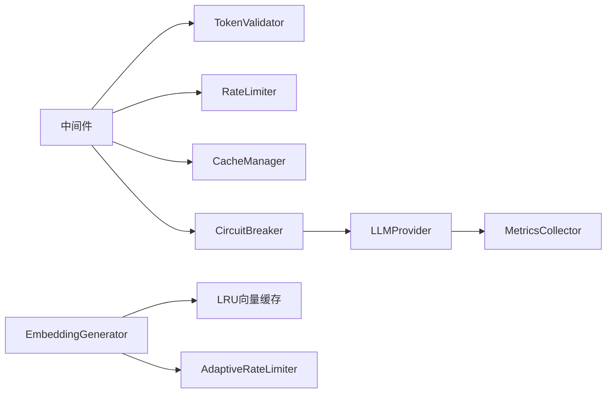

# 成本控制策略

<cite>
**本文引用的文件**   
- [src/analyzer/llm_provider.py](file://src/analyzer/llm_provider.py)
- [src/config/models.py](file://src/config/models.py)
- [src/config/manager.py](file://src/config/manager.py)
- [config/config.yaml.example](file://config/config.yaml.example)
- [src/api/middleware.py](file://src/api/middleware.py)
- [src/utils/metrics.py](file://src/utils/metrics.py)
- [src/cache/manager.py](file://src/cache/manager.py)
- [src/embedding/generator.py](file://src/embedding/generator.py)
- [src/utils/circuit_breaker.py](file://src/utils/circuit_breaker.py)
- [src/security/token_manager.py](file://src/security/token_manager.py)
- [src/report/generator.py](file://src/report/generator.py)
- [src/api/routes/reports.py](file://src/api/routes/reports.py)
</cite>

## 目录
1. [简介](#简介)
2. [项目结构](#项目结构)
3. [核心组件](#核心组件)
4. [架构总览](#架构总览)
5. [详细组件分析](#详细组件分析)
6. [依赖关系分析](#依赖关系分析)
7. [性能与成本考量](#性能与成本考量)
8. [故障排查指南](#故障排查指南)
9. [结论](#结论)
10. [附录](#附录)

## 简介
本技术文档围绕LLM使用成本控制的策略与实践，系统梳理配额管理、访问控制与权限验证、使用监控（成本追踪、统计分析、报告生成）、预算限制（阈值告警、自动降级、紧急停止）以及优化建议（模型选择、提示词优化、结果缓存）。文档结合仓库中现有实现，给出可落地的最佳实践与案例参考，帮助团队在保障质量的前提下有效控制LLM调用成本。

## 项目结构
本项目采用分层模块化组织：配置、API网关与中间件、LLM提供者、指标与监控、缓存、熔断与限流、安全令牌等模块协同工作，形成“请求进入→鉴权与限流→缓存命中/降级→LLM调用→指标上报→报告输出”的完整链路。

图表来源
- [src/api/middleware.py:1-173](file://src/api/middleware.py#L1-L173)
- [src/analyzer/llm_provider.py:1-67](file://src/analyzer/llm_provider.py#L1-L67)
- [src/cache/manager.py:1-165](file://src/cache/manager.py#L1-L165)
- [src/utils/metrics.py:1-252](file://src/utils/metrics.py#L1-L252)
- [src/utils/circuit_breaker.py:1-306](file://src/utils/circuit_breaker.py#L1-L306)
- [src/security/token_manager.py:1-115](file://src/security/token_manager.py#L1-L115)
- [src/report/generator.py:1-790](file://src/report/generator.py#L1-L790)
- [src/config/models.py:1-144](file://src/config/models.py#L1-L144)
- [src/config/manager.py:1-268](file://src/config/manager.py#L1-L268)

章节来源
- [src/config/models.py:1-144](file://src/config/models.py#L1-L144)
- [src/config/manager.py:1-268](file://src/config/manager.py#L1-L268)
- [config/config.yaml.example:1-38](file://config/config.yaml.example#L1-L38)

## 核心组件
- 配置与参数化
  - AppConfig 提供 LLM、Embedding、Cache、Rules、Output、Logging 等子配置；支持环境变量覆盖与校验。
  - 通过 ConfigManager 加载 YAML/JSON 并合并默认值与环境变量，统一对外暴露 app_config。
- 访问控制与配额
  - 中间件实现 Token 校验与每分钟速率限制，返回标准错误响应并在响应头携带限额信息。
  - TokenManager 提供过期检测与轮换提醒能力，便于密钥生命周期治理。
- 使用监控与统计
  - MetricsCollector 提供 Counter/Gauge/Histogram 三类指标，支持 Prometheus 导出格式。
  - 可在关键路径埋点记录请求量、耗时分布、活跃请求数等。
- 缓存与降级
  - CacheManager 基于 SQLite 的任务级缓存，支持 TTL、失效、清理与统计。
  - Embedding 层内置 LRU 向量缓存与自适应 QPS 限流，降低重复计算与外部压力。
- 熔断与保护
  - CircuitBreaker 提供 CLOSED/OPEN/HALF_OPEN 状态机，失败阈值触发打开，超时后试探恢复。
- 报告与可视化
  - ReportGenerator 支持 Markdown/HTML/PDF/JSON 多格式报告，便于审计与复盘。

章节来源
- [src/config/models.py:1-144](file://src/config/models.py#L1-L144)
- [src/config/manager.py:1-268](file://src/config/manager.py#L1-L268)
- [src/api/middleware.py:1-173](file://src/api/middleware.py#L1-L173)
- [src/security/token_manager.py:1-115](file://src/security/token_manager.py#L1-L115)
- [src/utils/metrics.py:1-252](file://src/utils/metrics.py#L1-L252)
- [src/cache/manager.py:1-165](file://src/cache/manager.py#L1-L165)
- [src/embedding/generator.py:1-81](file://src/embedding/generator.py#L1-L81)
- [src/utils/circuit_breaker.py:1-306](file://src/utils/circuit_breaker.py#L1-L306)
- [src/report/generator.py:1-790](file://src/report/generator.py#L1-L790)

## 架构总览
下图展示一次典型请求从进入服务到返回结果的流程，体现配额、鉴权、缓存、熔断、指标与报告的协作关系。

图表来源
- [src/api/middleware.py:1-173](file://src/api/middleware.py#L1-L173)
- [src/security/token_manager.py:1-115](file://src/security/token_manager.py#L1-L115)
- [src/cache/manager.py:1-165](file://src/cache/manager.py#L1-L165)
- [src/utils/circuit_breaker.py:1-306](file://src/utils/circuit_breaker.py#L1-L306)
- [src/analyzer/llm_provider.py:1-67](file://src/analyzer/llm_provider.py#L1-L67)
- [src/utils/metrics.py:1-252](file://src/utils/metrics.py#L1-L252)
- [src/report/generator.py:1-790](file://src/report/generator.py#L1-L790)

## 详细组件分析

### 配额管理与访问控制
- 速率限制
  - RateLimiter 基于滑动窗口（分钟粒度）维护每个标识符的请求时间戳，超过阈值返回 429，并在响应头携带 X-RateLimit-Limit/X-RateLimit-Remaining。
  - 可通过环境变量 API_RATE_LIMIT 调整全局限制。
- Token 校验与生命周期
  - TokenValidator 支持白名单模式；开发模式下可放行所有请求。
  - TokenManager 提供过期判断、轮换提醒与剩余天数计算，便于密钥治理与自动化续期。
- 配置驱动
  - LLMConfig 限定 provider、model、temperature、max_tokens 等范围；EmbeddingConfig 限定 batch_size 等。
  - ConfigManager 支持 .env 覆盖，如 LLM_API_KEY、LLM_MAX_TOKENS、EMBEDDING_BATCH_SIZE 等。

图表来源
- [src/api/middleware.py:1-173](file://src/api/middleware.py#L1-L173)
- [src/security/token_manager.py:1-115](file://src/security/token_manager.py#L1-L115)
- [src/config/models.py:1-144](file://src/config/models.py#L1-L144)
- [src/config/manager.py:1-268](file://src/config/manager.py#L1-L268)

章节来源
- [src/api/middleware.py:1-173](file://src/api/middleware.py#L1-L173)
- [src/security/token_manager.py:1-115](file://src/security/token_manager.py#L1-L115)
- [src/config/models.py:1-144](file://src/config/models.py#L1-L144)
- [src/config/manager.py:1-268](file://src/config/manager.py#L1-L268)
- [config/config.yaml.example:1-38](file://config/config.yaml.example#L1-L38)

### 使用监控机制（成本追踪、统计分析、报告生成）
- 指标采集
  - MetricsCollector 提供计数器、仪表盘、直方图三类指标，支持标签维度聚合与 Prometheus 导出。
  - 建议在关键路径埋点：LLM 调用次数、成功率、延迟分布、并发度、缓存命中率等。
- 报告生成
  - ReportGenerator 支持多种格式输出，便于审计与复盘；可与流水线集成按需生成。
- 示例入口
  - reports 路由演示了如何以最小代价生成报告（禁用LLM重新分析，仅渲染已有结果）。

图表来源
- [src/utils/metrics.py:1-252](file://src/utils/metrics.py#L1-L252)
- [src/report/generator.py:1-790](file://src/report/generator.py#L1-L790)
- [src/api/routes/reports.py:1-130](file://src/api/routes/reports.py#L1-L130)

章节来源
- [src/utils/metrics.py:1-252](file://src/utils/metrics.py#L1-L252)
- [src/report/generator.py:1-790](file://src/report/generator.py#L1-L790)
- [src/api/routes/reports.py:1-130](file://src/api/routes/reports.py#L1-L130)

### 预算限制实现（阈值告警、自动降级、紧急停止）
- 阈值告警
  - 通过指标与日志组合实现：当某类指标（如错误率、延迟P99、调用总量）超过阈值时，记录告警日志并可对接外部告警系统。
  - TokenManager 的轮换提醒可作为“密钥预算”的软告警。
- 自动降级
  - 熔断器在 OPEN 状态下拒绝新请求，避免雪崩；可在 HALF_OPEN 阶段进行小流量探测。
  - 报告生成器可用于快速输出降级说明或替代方案摘要。
- 紧急停止
  - 通过熔断器手动 reset 或动态开关（例如在配置中增加 emergency_stop 标志位）实现快速止损。

图表来源
- [src/utils/circuit_breaker.py:1-306](file://src/utils/circuit_breaker.py#L1-L306)
- [src/security/token_manager.py:1-115](file://src/security/token_manager.py#L1-L115)
- [src/report/generator.py:1-790](file://src/report/generator.py#L1-L790)

章节来源
- [src/utils/circuit_breaker.py:1-306](file://src/utils/circuit_breaker.py#L1-L306)
- [src/security/token_manager.py:1-115](file://src/security/token_manager.py#L1-L115)
- [src/report/generator.py:1-790](file://src/report/generator.py#L1-L790)

### 成本优化建议（模型选择、提示词优化、结果缓存）
- 模型选择策略
  - 根据任务复杂度选择更轻量模型或较小 max_tokens；通过 LLMConfig 的 model 与 max_tokens 控制成本上限。
  - 对嵌入任务使用 EmbeddingConfig 的 batch_size 提升吞吐，减少外部调用次数。
- 提示词优化
  - 精简 system/user 内容长度，减少 token 消耗；将通用指令前置至模板，避免重复输入。
- 结果缓存
  - 任务级缓存：CacheManager 基于 SQLite 存储，TTL 控制有效期，适合重复任务复用。
  - 向量缓存：LRU 内存缓存文本到向量映射，配合 TTL 与容量上限，显著降低重复计算。
  - 自适应限流：Embedding 层的 AdaptiveRateLimiter 按当前QPS动态休眠，平滑突发流量。

图表来源
- [src/cache/manager.py:1-165](file://src/cache/manager.py#L1-L165)
- [src/embedding/generator.py:1-81](file://src/embedding/generator.py#L1-L81)
- [src/analyzer/llm_provider.py:1-67](file://src/analyzer/llm_provider.py#L1-L67)

章节来源
- [src/config/models.py:1-144](file://src/config/models.py#L1-L144)
- [src/cache/manager.py:1-165](file://src/cache/manager.py#L1-L165)
- [src/embedding/generator.py:1-81](file://src/embedding/generator.py#L1-L81)
- [src/analyzer/llm_provider.py:1-67](file://src/analyzer/llm_provider.py#L1-L67)

## 依赖关系分析
- 组件耦合
  - 中间件依赖 TokenValidator 与 RateLimiter，二者均无外部强依赖，易于替换与扩展。
  - LLMProvider 依赖 OpenAI SDK，可通过 base_url 适配兼容服务。
  - MetricsCollector 为纯内存实现，导出为 Prometheus 文本格式，便于接入监控系统。
  - CacheManager 依赖 SQLite，具备持久化能力；LRU 缓存位于进程内存，需关注容量与TTL。
  - CircuitBreaker 独立于业务逻辑，可跨多个外部调用复用。
- 潜在风险
  - 进程内缓存与指标在重启后丢失，需结合持久化或外部存储增强。
  - 若未合理设置 TTL 与容量，可能导致内存增长或缓存污染。

图表来源
- [src/api/middleware.py:1-173](file://src/api/middleware.py#L1-L173)
- [src/cache/manager.py:1-165](file://src/cache/manager.py#L1-L165)
- [src/utils/circuit_breaker.py:1-306](file://src/utils/circuit_breaker.py#L1-L306)
- [src/analyzer/llm_provider.py:1-67](file://src/analyzer/llm_provider.py#L1-L67)
- [src/embedding/generator.py:1-81](file://src/embedding/generator.py#L1-L81)
- [src/utils/metrics.py:1-252](file://src/utils/metrics.py#L1-L252)

章节来源
- [src/api/middleware.py:1-173](file://src/api/middleware.py#L1-L173)
- [src/utils/circuit_breaker.py:1-306](file://src/utils/circuit_breaker.py#L1-L306)
- [src/analyzer/llm_provider.py:1-67](file://src/analyzer/llm_provider.py#L1-L67)
- [src/embedding/generator.py:1-81](file://src/embedding/generator.py#L1-L81)
- [src/utils/metrics.py:1-252](file://src/utils/metrics.py#L1-L252)

## 性能与成本考量
- 控制 token 用量
  - 通过 LLMConfig.max_tokens 限制单次最大输出；EmbeddingConfig.batch_size 批量处理减少往返。
- 降低外部调用
  - 优先命中任务缓存与向量缓存；对热点任务提高 TTL 或预热。
- 稳定与容错
  - 使用熔断器防止级联失败；在 HALF_OPEN 阶段逐步放量验证恢复情况。
- 观测与回溯
  - 利用指标与报告沉淀问题线索，定位高成本路径并进行针对性优化。

[本节为通用指导，不直接分析具体文件]

## 故障排查指南
- 常见错误码与原因
  - 401 Unauthorized：缺少或无效 Token。
  - 403 Forbidden：Token 不在白名单。
  - 429 Too Many Requests：超出速率限制。
- 诊断步骤
  - 检查中间件日志与响应头中的限流信息。
  - 查看熔断器状态与失败计数，确认是否处于 OPEN/HALF_OPEN。
  - 核对缓存命中率与 TTL 设置，必要时清理过期条目。
  - 导出 Prometheus 指标，观察错误率、延迟与并发变化趋势。
- 快速恢复
  - 临时放宽速率限制或切换备用模型。
  - 手动重置熔断器，逐步恢复流量。
  - 清理缓存或缩短 TTL 以避免脏数据影响。

章节来源
- [src/api/middleware.py:1-173](file://src/api/middleware.py#L1-L173)
- [src/utils/circuit_breaker.py:1-306](file://src/utils/circuit_breaker.py#L1-L306)
- [src/cache/manager.py:1-165](file://src/cache/manager.py#L1-L165)
- [src/utils/metrics.py:1-252](file://src/utils/metrics.py#L1-L252)

## 结论
通过“鉴权+限流+缓存+熔断+指标+报告”的组合策略，可以在保证可用性的前提下有效控制LLM使用成本。建议在生产环境持续完善阈值告警与自动化降级策略，并结合业务特征调优模型与提示词，最大化性价比。

[本节为总结性内容，不直接分析具体文件]

## 附录
- 配置项速览
  - LLM：provider、model、api_key、temperature、max_tokens、base_url
  - Embedding：provider、model、api_key、base_url、batch_size
  - Cache：enabled、ttl、storage、db_path
  - Rules：builtin_enabled、custom_paths
  - Output：format、directory
  - Logging：level、format、file
- 环境变量覆盖示例
  - LLM_API_KEY、LLM_MODEL、LLM_MAX_TOKENS、EMBEDDING_BATCH_SIZE、CACHE_TTL、LOG_LEVEL 等

章节来源
- [src/config/models.py:1-144](file://src/config/models.py#L1-L144)
- [src/config/manager.py:1-268](file://src/config/manager.py#L1-L268)
- [config/config.yaml.example:1-38](file://config/config.yaml.example#L1-L38)