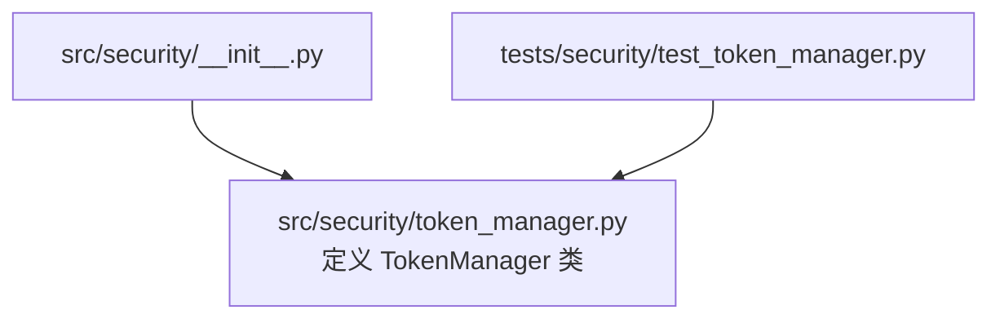
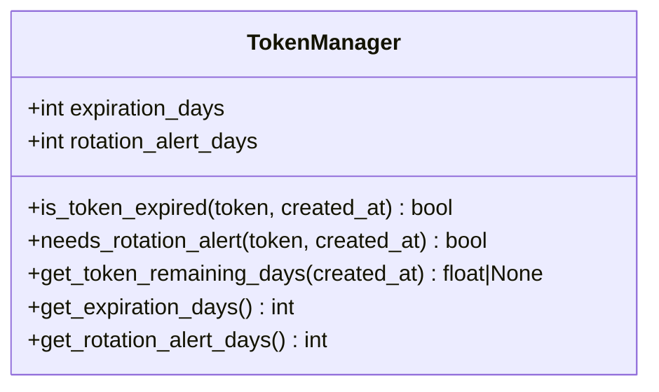
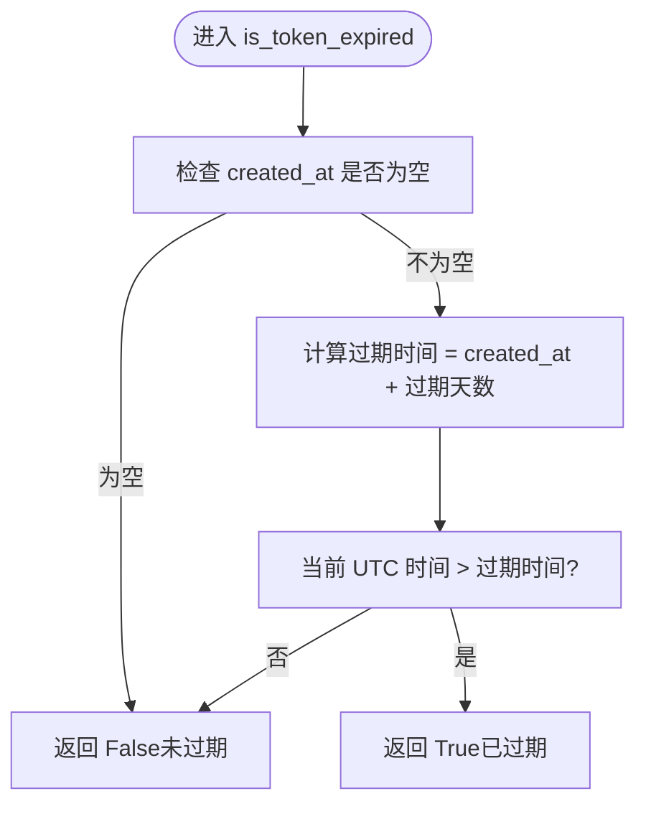
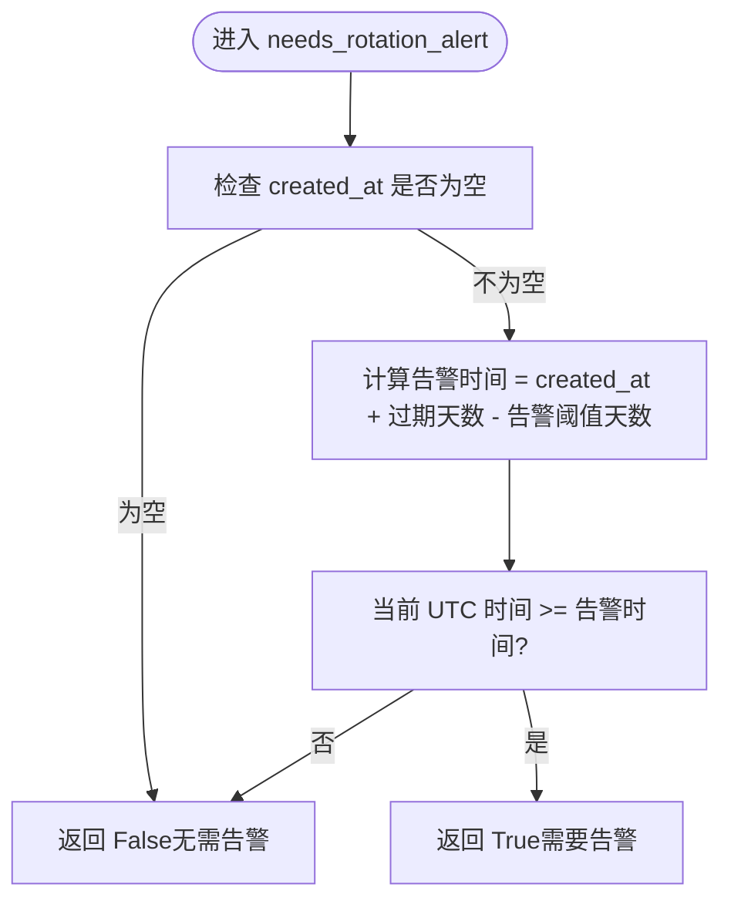
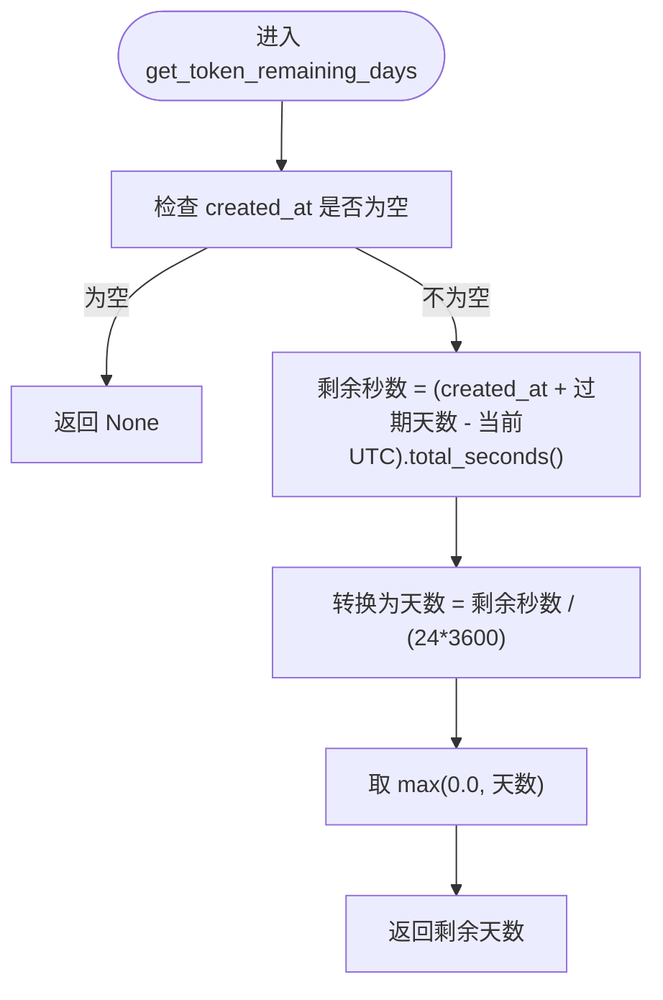
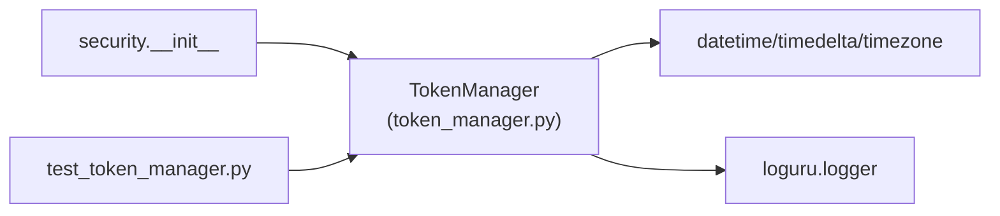
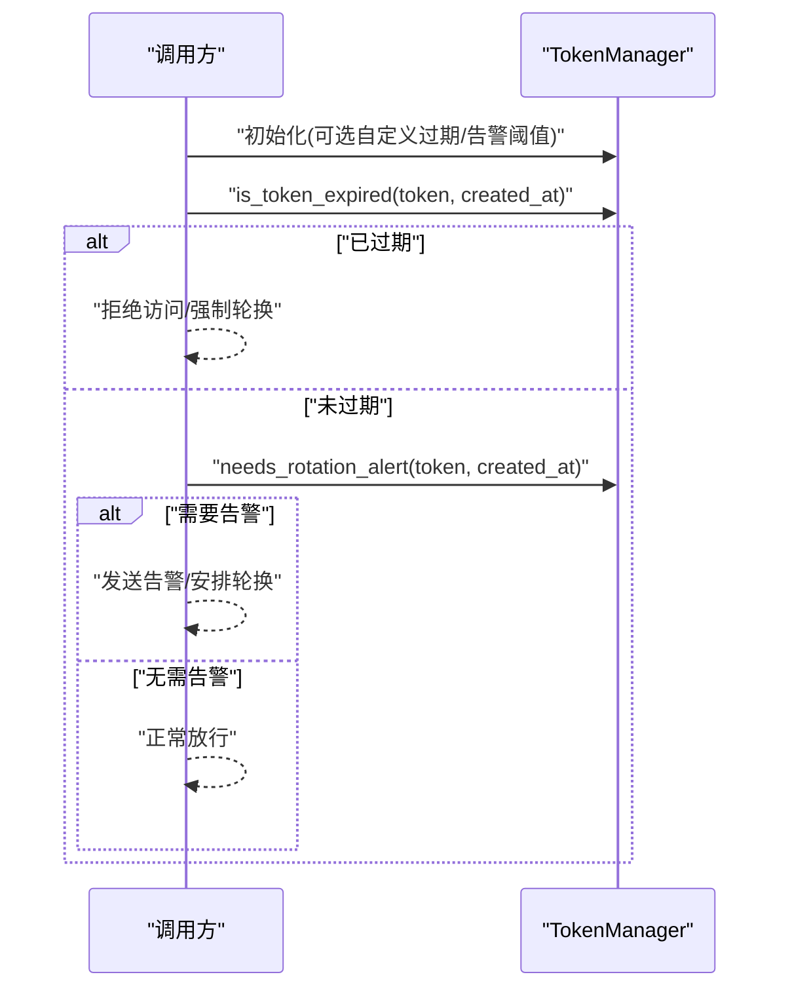

# 配额管理系统

<cite>
**本文引用的文件**
- [src/security/token_manager.py](file://src/security/token_manager.py)
- [tests/security/test_token_manager.py](file://tests/security/test_token_manager.py)
- [src/security/__init__.py](file://src/security/__init__.py)
</cite>

## 目录
1. [简介](#简介)
2. [项目结构](#项目结构)
3. [核心组件](#核心组件)
4. [架构总览](#架构总览)
5. [详细组件分析](#详细组件分析)
6. [依赖关系分析](#依赖关系分析)
7. [性能与可扩展性](#性能与可扩展性)
8. [故障排查指南](#故障排查指南)
9. [结论](#结论)
10. [附录：最佳实践与使用示例](#附录最佳实践与使用示例)

## 简介
本技术文档围绕 LLM 配额管理中的令牌生命周期与轮换告警机制，聚焦 TokenManager 类的实现原理、策略配置与验证流程。TokenManager 提供令牌过期检测、轮换告警判断与剩余有效期计算能力，默认采用“30 天过期”和“提前 7 天触发轮换告警”的策略。通过统一的 API，上层业务可便捷集成令牌校验与监控告警逻辑，保障 LLM 访问的稳定性与安全性。

## 项目结构
与安全相关的代码位于 src/security 模块中，其中 TokenManager 的实现与导出如下：
- 实现文件：src/security/token_manager.py
- 模块导出：src/security/__init__.py（将 TokenManager 暴露为安全子模块的一部分）
- 单元测试：tests/security/test_token_manager.py（覆盖初始化、过期判断、告警阈值与剩余天数等场景）

图表来源
- [src/security/__init__.py:1-26](file://src/security/__init__.py#L1-L26)
- [src/security/token_manager.py:1-115](file://src/security/token_manager.py#L1-L115)

章节来源
- [src/security/__init__.py:1-26](file://src/security/__init__.py#L1-L26)
- [src/security/token_manager.py:1-115](file://src/security/token_manager.py#L1-L115)
- [tests/security/test_token_manager.py:1-120](file://tests/security/test_token_manager.py#L1-L120)

## 核心组件
TokenManager 负责令牌的生命周期管理与告警判定，关键要点包括：
- 默认策略
  - 默认过期天数：30 天
  - 默认轮换告警阈值：提前 7 天
- 主要方法
  - is_token_expired(token, created_at)：判断是否已过期
  - needs_rotation_alert(token, created_at)：判断是否需要轮换告警
  - get_token_remaining_days(created_at)：获取剩余有效天数（非负）
  - get_expiration_days() / get_rotation_alert_days()：读取当前策略配置

章节来源
- [src/security/token_manager.py:8-115](file://src/security/token_manager.py#L8-L115)

## 架构总览
TokenManager 作为轻量级工具类，不依赖外部存储或网络服务，仅基于系统时间进行本地计算。其调用方（如 API 层、调度器或业务服务）在每次访问 LLM 前或定时任务中调用该类的方法，完成令牌有效性检查与告警触发。

图表来源
- [src/security/token_manager.py:8-115](file://src/security/token_manager.py#L8-L115)

## 详细组件分析

### 令牌生命周期与过期检测
- 过期判定逻辑
  - 若未提供创建时间，则视为未过期（返回 False），并记录调试日志
  - 否则以 created_at 加上默认过期天数得到过期时间点，比较当前 UTC 时间与过期点，超过即认为已过期
- 设计考量
  - 使用 UTC 时间避免时区差异导致的误判
  - 对 None 输入做防御性处理，保证调用侧无需强约束

图表来源
- [src/security/token_manager.py:35-58](file://src/security/token_manager.py#L35-L58)

章节来源
- [src/security/token_manager.py:35-58](file://src/security/token_manager.py#L35-L58)

### 轮换告警机制
- 告警条件
  - 若未提供创建时间，则不需要告警（返回 False）
  - 否则计算告警时间点 = created_at + 过期天数 - 告警阈值天数；当当前 UTC 时间大于等于该告警时间点时，需要触发轮换告警
- 适用场景
  - 在批量巡检或请求前置校验中，根据返回值决定是否发送告警或安排轮换计划

图表来源
- [src/security/token_manager.py:60-87](file://src/security/token_manager.py#L60-L87)

章节来源
- [src/security/token_manager.py:60-87](file://src/security/token_manager.py#L60-L87)

### 剩余有效期计算
- 功能说明
  - 返回距离过期的剩余天数（浮点数），若 created_at 为空则返回 None
  - 结果下限为 0，避免负数显示
- 用途
  - 用于仪表盘展示、阈值对比与告警分级

图表来源
- [src/security/token_manager.py:89-106](file://src/security/token_manager.py#L89-L106)

章节来源
- [src/security/token_manager.py:89-106](file://src/security/token_manager.py#L89-L106)

### 策略配置与常量
- 默认过期天数：30 天
- 默认轮换告警阈值：7 天
- 可通过构造参数自定义上述策略

章节来源
- [src/security/token_manager.py:11-29](file://src/security/token_manager.py#L11-L29)

## 依赖关系分析
- 内部依赖
  - datetime、timedelta、timezone：用于时间计算与时区统一
  - loguru.logger：用于调试日志输出
- 模块导出
  - src/security/__init__.py 将 TokenManager 暴露给上层模块使用
- 测试依赖
  - tests/security/test_token_manager.py 覆盖多种边界与策略组合

图表来源
- [src/security/token_manager.py:1-115](file://src/security/token_manager.py#L1-L115)
- [src/security/__init__.py:1-26](file://src/security/__init__.py#L1-L26)
- [tests/security/test_token_manager.py:1-120](file://tests/security/test_token_manager.py#L1-L120)

章节来源
- [src/security/token_manager.py:1-115](file://src/security/token_manager.py#L1-L115)
- [src/security/__init__.py:1-26](file://src/security/__init__.py#L1-L26)
- [tests/security/test_token_manager.py:1-120](file://tests/security/test_token_manager.py#L1-L120)

## 性能与可扩展性
- 复杂度
  - 所有方法均为 O(1) 时间复杂度，无 I/O 操作，适合高频调用
- 可扩展方向
  - 支持多租户/多令牌的映射表（由调用方维护）
  - 接入持久化存储以记录历史状态与审计信息
  - 增加多级告警阈值（例如 14 天、7 天、3 天）

[本节为通用指导，不涉及具体文件分析]

## 故障排查指南
- 常见问题
  - created_at 为空：is_token_expired 返回 False，needs_rotation_alert 返回 False，get_token_remaining_days 返回 None。需确认上游是否正确传入创建时间
  - 时区问题：内部统一使用 UTC，确保传入的 created_at 为带时区的时间对象或已在 UTC 下计算
  - 告警频繁：检查 rotation_alert_days 与过期天数配置是否合理，避免阈值过小导致重复告警
- 定位建议
  - 开启 DEBUG 级别日志，观察 TokenManager 初始化与每次调用的关键路径日志
  - 结合单元测试用例思路，构造边界时间（刚好过期、刚进入告警窗口、远早于告警窗口）进行复现

章节来源
- [src/security/token_manager.py:30-33](file://src/security/token_manager.py#L30-L33)
- [src/security/token_manager.py:46-58](file://src/security/token_manager.py#L46-L58)
- [src/security/token_manager.py:71-87](file://src/security/token_manager.py#L71-L87)
- [src/security/token_manager.py:99-106](file://src/security/token_manager.py#L99-L106)

## 结论
TokenManager 提供了简洁而健壮的令牌生命周期管理能力，默认 30 天过期与提前 7 天告警的策略契合多数 LLM 配额管理场景。其方法语义清晰、边界处理完善、性能开销极低，适合作为上层服务的通用组件。配合完善的单元测试，可在实际工程中稳定落地。

[本节为总结性内容，不涉及具体文件分析]

## 附录：最佳实践与使用示例

### 令牌轮换策略
- 建议策略
  - 默认 30 天过期，提前 7 天触发告警；对于高敏感或高成本场景，可将过期缩短至 14 天，告警提前至 10 天
  - 轮换执行后，务必更新 created_at 为新令牌生成时间，避免重复告警
- 自动化建议
  - 在定时任务中扫描所有活跃令牌，对 needs_rotation_alert 为 True 的令牌自动发起轮换流程

章节来源
- [src/security/token_manager.py:11-14](file://src/security/token_manager.py#L11-L14)
- [src/security/token_manager.py:60-87](file://src/security/token_manager.py#L60-L87)

### 过期时间配置
- 通过构造参数设置
  - expiration_days：控制令牌有效期
  - rotation_alert_days：控制告警提前量
- 配置来源建议
  - 从配置文件或环境变量注入，便于不同环境差异化配置

章节来源
- [src/security/token_manager.py:16-29](file://src/security/token_manager.py#L16-L29)

### 监控与告警设置
- 指标建议
  - 令牌剩余天数分布（直方图）
  - 即将过期令牌数量（按告警阈值分段）
  - 过期令牌占比（SLA 相关）
- 告警通道
  - 邮件/IM/工单等多通道冗余，避免漏报

[本节为通用指导，不涉及具体文件分析]

### 集成步骤（概念性流程）

[此图为概念流程图，不直接映射到具体源码文件]

### 参考测试用例（行为说明）
- 初始化
  - 默认值：过期 30 天，告警 7 天
  - 自定义：可按需调整
- 过期判断
  - 超过过期天数返回 True；不足返回 False；created_at 为空返回 False
- 告警判断
  - 当前时间到达或超过“过期时间 - 告警阈值”时返回 True；否则返回 False；created_at 为空返回 False
- 剩余天数
  - 返回非负浮点数；created_at 为空返回 None

章节来源
- [tests/security/test_token_manager.py:16-28](file://tests/security/test_token_manager.py#L16-L28)
- [tests/security/test_token_manager.py:33-51](file://tests/security/test_token_manager.py#L33-L51)
- [tests/security/test_token_manager.py:56-83](file://tests/security/test_token_manager.py#L56-L83)
- [tests/security/test_token_manager.py:88-100](file://tests/security/test_token_manager.py#L88-L100)
- [tests/security/test_token_manager.py:105-119](file://tests/security/test_token_manager.py#L105-L119)
