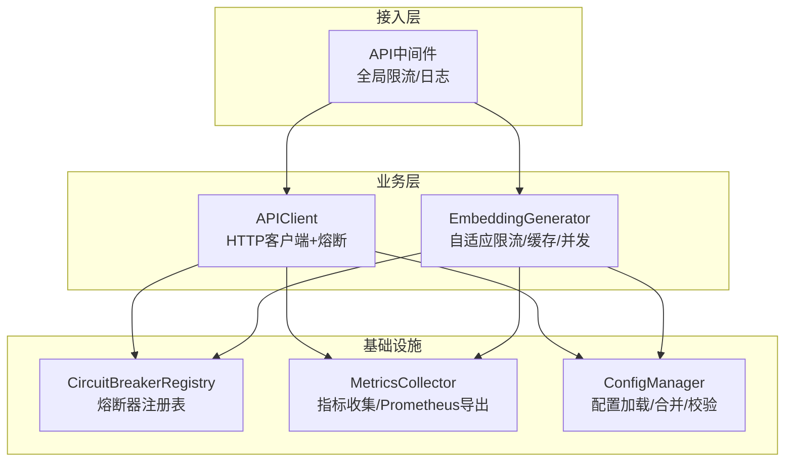
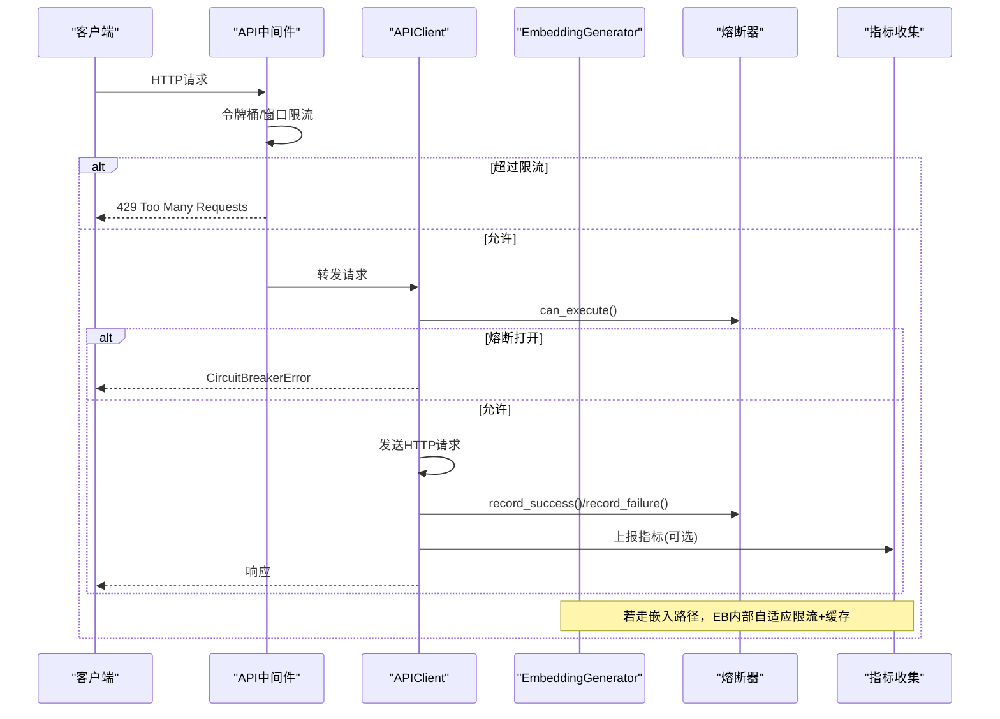
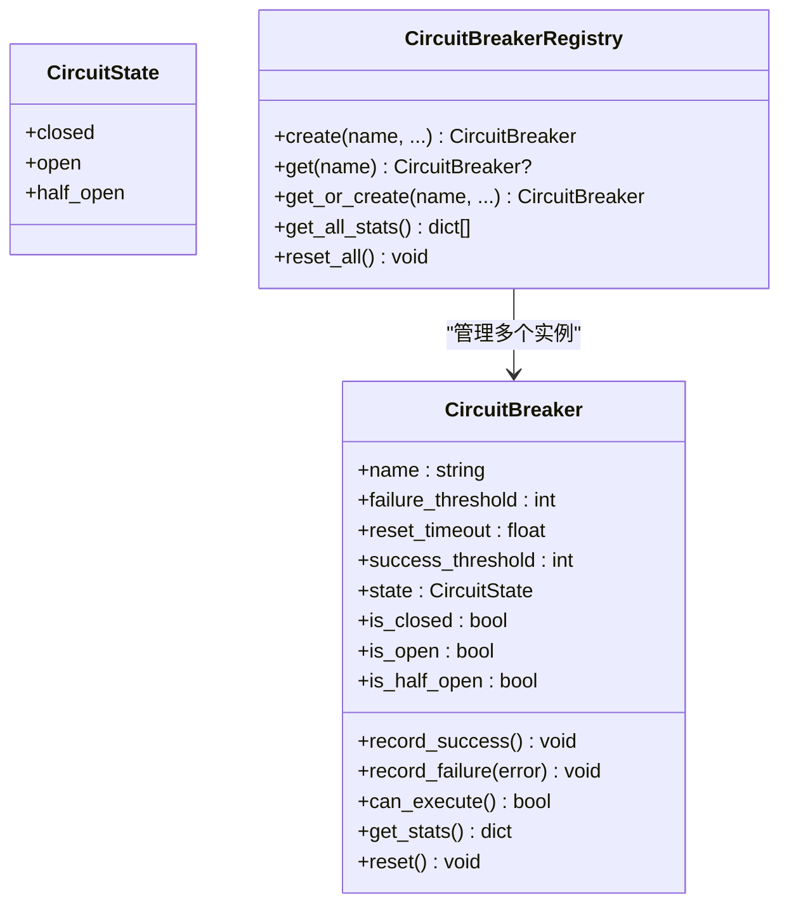
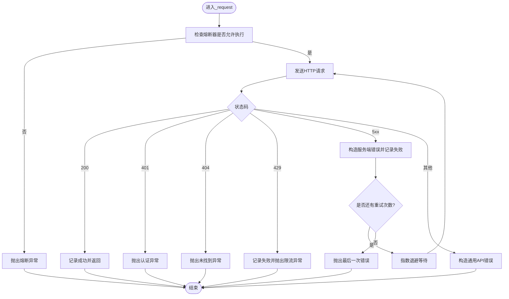
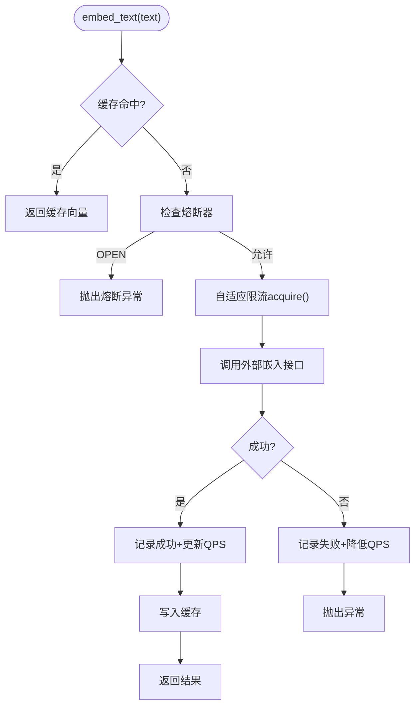
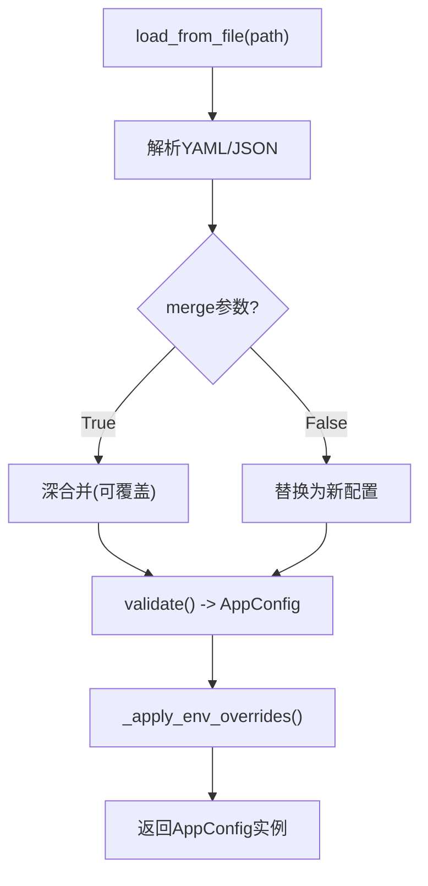
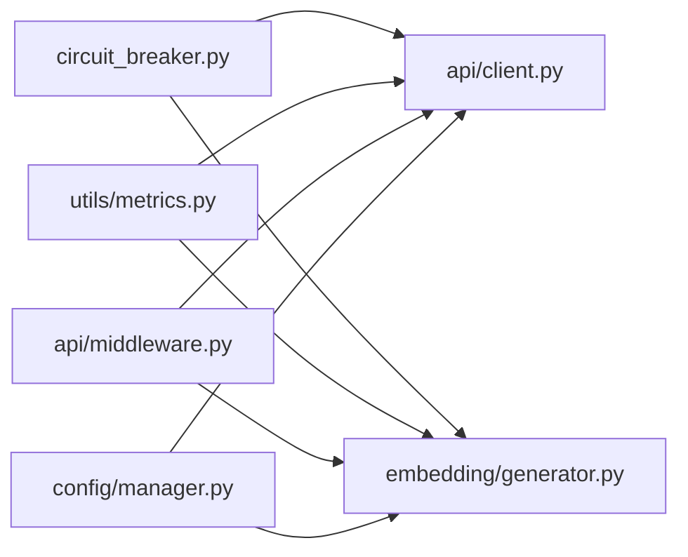

# 预算限制控制

<cite>
**本文引用的文件**   
- [src/utils/circuit_breaker.py](file://src/utils/circuit_breaker.py)
- [src/api/client.py](file://src/api/client.py)
- [src/embedding/generator.py](file://src/embedding/generator.py)
- [src/config/manager.py](file://src/config/manager.py)
- [config/config.yaml.example](file://config/config.yaml.example)
- [src/utils/metrics.py](file://src/utils/metrics.py)
- [src/api/middleware.py](file://src/api/middleware.py)
- [tests/api/test_middleware.py](file://tests/api/test_middleware.py)
- [tests/utils/test_circuit_breaker.py](file://tests/utils/test_circuit_breaker.py)
- [tests/embedding/test_generator_task24.py](file://tests/embedding/test_generator_task24.py)
</cite>

## 目录
1. [简介](#简介)
2. [项目结构](#项目结构)
3. [核心组件](#核心组件)
4. [架构总览](#架构总览)
5. [详细组件分析](#详细组件分析)
6. [依赖关系分析](#依赖关系分析)
7. [性能与容量规划](#性能与容量规划)
8. [故障排查指南](#故障排查指南)
9. [结论](#结论)
10. [附录：配置模板与最佳实践](#附录配置模板与最佳实践)

## 简介
本技术文档围绕“LLM预算限制控制系统”的落地实现进行系统化说明，重点覆盖以下能力：
- 阈值告警机制：预算使用率监控、告警级别设置与通知渠道配置（基于指标收集与中间件限流）
- 自动降级策略：模型切换逻辑、请求限流算法与服务保障（自适应速率限制、熔断器模式）
- 紧急停止功能：熔断器状态机、故障恢复机制与一致性保证
- 预算配置模板：月度预算、部门配额、项目级成本控制（通过配置管理与环境变量覆盖）
- 超限处理流程与应急预案：从限流到熔断再到恢复的全链路闭环

## 项目结构
与预算控制相关的核心模块分布如下：
- 熔断器与注册表：用于保护外部调用、快速失败与自动恢复
- API客户端：集成熔断器与错误分类，驱动外部服务访问
- 嵌入生成器：提供自适应速率限制、并发控制与缓存，降低外部成本
- 配置管理：统一加载、合并与校验配置，支持环境变量覆盖
- 指标收集：Prometheus格式导出，支撑预算使用率监控与告警
- API中间件：全局限流与日志记录，作为第一道防线

图表来源
- [src/api/middleware.py:122-172](file://src/api/middleware.py#L122-L172)
- [src/api/client.py:25-161](file://src/api/client.py#L25-L161)
- [src/embedding/generator.py:91-216](file://src/embedding/generator.py#L91-L216)
- [src/utils/circuit_breaker.py:201-262](file://src/utils/circuit_breaker.py#L201-L262)
- [src/utils/metrics.py:151-252](file://src/utils/metrics.py#L151-L252)
- [src/config/manager.py:42-173](file://src/config/manager.py#L42-L173)

章节来源
- [src/api/middleware.py:122-172](file://src/api/middleware.py#L122-L172)
- [src/api/client.py:25-161](file://src/api/client.py#L25-L161)
- [src/embedding/generator.py:91-216](file://src/embedding/generator.py#L91-L216)
- [src/utils/circuit_breaker.py:201-262](file://src/utils/circuit_breaker.py#L201-L262)
- [src/utils/metrics.py:151-252](file://src/utils/metrics.py#L151-L252)
- [src/config/manager.py:42-173](file://src/config/manager.py#L42-L173)

## 核心组件
- 熔断器（CircuitBreaker/CircuitBreakerRegistry）
  - 三态机：关闭→打开→半开；失败阈值触发打开，成功阈值在半开时关闭
  - 统计信息：失败/成功计数、最后失败时间、重置超时等
  - 装饰器与上下文管理器：便捷包裹同步/异步函数
- API客户端（APIClient）
  - 在发起请求前检查熔断器状态；按HTTP状态码分类错误并记录失败
  - 重试与退避：连接错误/超时指数退避；鉴权/未找到/限流不重试
- 嵌入生成器（EmbeddingGenerator）
  - 自适应速率限制器：根据成功/失败动态调整QPS，避免超配导致成本飙升
  - LRU缓存：减少重复计算，显著降低成本
  - 并发控制：信号量限制并发度，结合批量接口提升吞吐
- 配置管理（ConfigManager）
  - 支持YAML/JSON加载、深合并、环境变量覆盖、类型校验
  - 提供AppConfig强类型对象，便于集中读取
- 指标收集（MetricsCollector）
  - Counter/Gauge/Histogram三类指标，支持Prometheus导出
  - 可对接监控系统，形成预算使用率看板与告警
- API中间件
  - 全局限流：按标识符统计每分钟请求数，返回剩余配额头
  - 日志中间件：记录请求/响应耗时，辅助定位瓶颈

章节来源
- [src/utils/circuit_breaker.py:36-198](file://src/utils/circuit_breaker.py#L36-L198)
- [src/utils/circuit_breaker.py:201-262](file://src/utils/circuit_breaker.py#L201-L262)
- [src/api/client.py:25-161](file://src/api/client.py#L25-L161)
- [src/embedding/generator.py:54-88](file://src/embedding/generator.py#L54-88)
- [src/embedding/generator.py:91-216](file://src/embedding/generator.py#L91-L216)
- [src/config/manager.py:42-173](file://src/config/manager.py#L42-L173)
- [src/utils/metrics.py:151-252](file://src/utils/metrics.py#L151-L252)
- [src/api/middleware.py:122-172](file://src/api/middleware.py#L122-L172)

## 架构总览
下图展示了从请求进入、限流、熔断、自适应降速到指标上报的整体链路。

图表来源
- [src/api/middleware.py:122-172](file://src/api/middleware.py#L122-L172)
- [src/api/client.py:99-161](file://src/api/client.py#L99-L161)
- [src/utils/circuit_breaker.py:36-198](file://src/utils/circuit_breaker.py#L36-L198)
- [src/utils/metrics.py:151-252](file://src/utils/metrics.py#L151-L252)

## 详细组件分析

### 熔断器与注册表（紧急停止与恢复）
- 状态机与转换
  - CLOSED：正常放行
  - OPEN：达到失败阈值后阻断请求，等待重置超时
  - HALF_OPEN：超时后放行少量探测请求，连续成功则回到CLOSED
- 关键方法
  - record_success/record_failure：更新计数与时间戳，必要时触发状态迁移
  - can_execute/__enter__/__aenter__：入口拦截，OPEN状态下抛出熔断异常
  - get_stats/get_all_stats：暴露运行期统计，便于监控与告警
- 注册表
  - 统一管理多个熔断器实例，支持按名称获取或创建，一键重置所有熔断器

图表来源
- [src/utils/circuit_breaker.py:19-198](file://src/utils/circuit_breaker.py#L19-L198)
- [src/utils/circuit_breaker.py:201-262](file://src/utils/circuit_breaker.py#L201-L262)

章节来源
- [src/utils/circuit_breaker.py:36-198](file://src/utils/circuit_breaker.py#L36-L198)
- [src/utils/circuit_breaker.py:201-262](file://src/utils/circuit_breaker.py#L201-L262)
- [tests/utils/test_circuit_breaker.py:163-362](file://tests/utils/test_circuit_breaker.py#L163-L362)

### API客户端（错误分类与熔断联动）
- 请求前检查熔断器，OPEN直接拒绝
- 按HTTP状态码分类：
  - 200：成功，记录成功
  - 401/404：非服务故障，抛出自定义异常
  - 429：限流，记录失败但不重试
  - 5xx：服务端错误，记录失败并重试（指数退避）
- 重试策略：对连接错误/超时采用指数退避；鉴权/未找到/限流不重试

图表来源
- [src/api/client.py:99-161](file://src/api/client.py#L99-L161)

章节来源
- [src/api/client.py:25-161](file://src/api/client.py#L25-L161)

### 嵌入生成器（自适应限流与缓存降本）
- 自适应速率限制器
  - 成功：以恢复因子提升当前QPS，上限为max_qps
  - 失败：以后退因子降低当前QPS，下限为min_qps
  - acquire：按当前QPS计算最小间隔，不足则sleep
- LRU缓存
  - 键为文本哈希，值包含向量与时间戳，TTL过期清理
  - 命中直接返回，显著降低外部调用成本
- 并发控制
  - 信号量限制最大并发，配合批量接口提高吞吐
- 熔断器联动
  - 调用前检查熔断器，失败时记录失败并触发自适应降速

图表来源
- [src/embedding/generator.py:54-88](file://src/embedding/generator.py#L54-88)
- [src/embedding/generator.py:91-216](file://src/embedding/generator.py#L91-L216)

章节来源
- [src/embedding/generator.py:54-88](file://src/embedding/generator.py#L54-88)
- [src/embedding/generator.py:91-216](file://src/embedding/generator.py#L91-L216)
- [tests/embedding/test_generator_task24.py:80-129](file://tests/embedding/test_generator_task24.py#L80-L129)

### 配置管理（预算与配额的基础）
- 支持YAML/JSON加载、深合并、环境变量覆盖
- 提供AppConfig强类型对象，便于集中读取
- 典型覆盖项包括API、LLM、嵌入、聚类、缓存、输出、日志等

图表来源
- [src/config/manager.py:82-173](file://src/config/manager.py#L82-L173)
- [src/config/manager.py:191-243](file://src/config/manager.py#L191-L243)

章节来源
- [src/config/manager.py:42-173](file://src/config/manager.py#L42-L173)
- [src/config/manager.py:191-243](file://src/config/manager.py#L191-L243)
- [config/config.yaml.example:1-38](file://config/config.yaml.example#L1-L38)

### 指标收集与告警（预算使用率监控）
- 指标类型
  - Counter：累计值（如请求总数、错误数）
  - Gauge：瞬时值（如活跃请求数、当前QPS）
  - Histogram：分布值（如响应时间分桶）
- Prometheus导出
  - 统一命名空间，标签化维度，便于Prometheus抓取与Grafana展示
- 告警建议
  - 预算使用率=实际消耗/月度预算，超过阈值（如80%/95%）触发不同级别告警
  - 结合中间件限流与熔断器状态，联动通知渠道（邮件/IM/短信）

章节来源
- [src/utils/metrics.py:151-252](file://src/utils/metrics.py#L151-L252)
- [src/api/middleware.py:122-172](file://src/api/middleware.py#L122-L172)

### API中间件（全局限流与日志）
- 限流策略
  - 基于每分钟的滑动窗口，按客户端标识符独立计数
  - 超出配额返回429，并在响应头中携带剩余配额
- 日志中间件
  - 记录请求/响应耗时，便于定位慢请求与资源热点

章节来源
- [src/api/middleware.py:122-172](file://src/api/middleware.py#L122-L172)
- [tests/api/test_middleware.py:45-87](file://tests/api/test_middleware.py#L45-L87)

## 依赖关系分析
- 低耦合高内聚
  - 熔断器独立于具体业务，通过注册表统一管理
  - APIClient与EmbeddingGenerator均依赖熔断器，但各自封装领域逻辑
  - 指标收集与中间件解耦，可在任意位置埋点
- 外部依赖
  - httpx/OpenAI SDK用于网络与模型调用
  - loguru用于结构化日志
- 潜在循环依赖
  - 当前未见循环导入；各模块职责清晰

图表来源
- [src/utils/circuit_breaker.py:36-198](file://src/utils/circuit_breaker.py#L36-L198)
- [src/api/client.py:25-161](file://src/api/client.py#L25-L161)
- [src/embedding/generator.py:91-216](file://src/embedding/generator.py#L91-L216)
- [src/utils/metrics.py:151-252](file://src/utils/metrics.py#L151-L252)
- [src/api/middleware.py:122-172](file://src/api/middleware.py#L122-L172)
- [src/config/manager.py:42-173](file://src/config/manager.py#L42-L173)

## 性能与容量规划
- 自适应限流
  - 初始QPS建议依据供应商配额与历史峰值设定；失败时快速降速，成功时缓慢恢复
- 并发与批处理
  - 合理设置batch_size与max_concurrency，避免打满下游限流
- 缓存命中率
  - 针对高频短文本开启LRU缓存，显著提升性价比
- 熔断参数
  - failure_threshold与reset_timeout需结合SLA与供应商稳定性调优
- 指标采集开销
  - 直方图默认分桶较细，生产环境可按需裁剪以提升性能

[本节为通用指导，无需特定文件引用]

## 故障排查指南
- 常见现象与定位
  - 频繁429：检查中间件限流阈值与客户端标识符粒度
  - 熔断频繁打开：查看服务端错误比例与网络抖动，适当增大failure_threshold或优化重试
  - 响应变慢：观察Histogram分布，定位P95/P99尾延迟
- 快速恢复手段
  - 手动重置熔断器：适用于已知上游已恢复的场景
  - 临时下调并发与QPS：避免雪崩
- 观测要点
  - 关注熔断器状态与统计、限流剩余配额、指标导出是否完整

章节来源
- [src/utils/circuit_breaker.py:183-198](file://src/utils/circuit_breaker.py#L183-L198)
- [src/api/middleware.py:122-172](file://src/api/middleware.py#L122-L172)
- [src/utils/metrics.py:190-226](file://src/utils/metrics.py#L190-L226)

## 结论
本系统通过“限流—熔断—自适应降速—指标观测”的组合拳，构建了面向LLM调用的预算与服务质量保障体系。建议在上线前完成：
- 明确月度预算与部门/项目配额，并通过配置与环境变量下发
- 建立告警规则与通知渠道，确保预算使用率接近阈值时及时干预
- 压测验证自适应限流与熔断参数，确保在突发流量下稳定可控

[本节为总结性内容，无需特定文件引用]

## 附录：配置模板与最佳实践

### 预算配置模板（示例字段）
以下为建议的配置结构，可根据实际组织需求扩展：
- 月度预算
  - budget.monthly.total：本月总预算（金额或Token额度）
  - budget.monthly.alert.thresholds：告警阈值列表（如0.8, 0.95）
- 部门配额
  - quotas.department.<dept_id>.monthly：部门月度配额
  - quotas.department.<dept_id>.alert_channels：通知渠道（email/feishu/sms）
- 项目级控制
  - projects.<project_id>.budget_share：项目预算占比
  - projects.<project_id>.rate_limit.qps：项目级QPS上限
  - projects.<project_id>.fallback.model：降级模型（低成本替代）

提示：上述字段可通过配置文件与环境变量组合管理，启动时由配置管理器加载并校验。

章节来源
- [src/config/manager.py:82-173](file://src/config/manager.py#L82-L173)
- [src/config/manager.py:191-243](file://src/config/manager.py#L191-L243)
- [config/config.yaml.example:1-38](file://config/config.yaml.example#L1-L38)

### 告警级别与通知渠道
- 告警级别
  - 预警（>=80%）：提醒团队关注
  - 严重（>=95%）：触发自动降级与限流收紧
  - 紧急（>=100%）：熔断非必要调用，仅保留核心路径
- 通知渠道
  - 邮件、企业IM、短信；支持多通道冗余

[本节为通用指导，无需特定文件引用]

### 自动降级策略与模型切换
- 降级顺序
  - 优先使用低成本模型（如small/medium），失败或预算紧张时切换到更小模型
  - 启用本地/近似方案（如hash向量）作为兜底
- 切换触发条件
  - 预算使用率超过阈值
  - 熔断器处于OPEN或HALF_OPEN
  - 自适应限流将QPS降至最低

章节来源
- [src/embedding/generator.py:54-88](file://src/embedding/generator.py#L54-88)
- [src/embedding/generator.py:91-216](file://src/embedding/generator.py#L91-L216)

### 预算超限处理流程与应急预案
- 处理流程
  - 监测：指标收集与预算使用率计算
  - 告警：按阈值推送通知
  - 限流：收紧QPS与并发
  - 降级：切换低成本模型或启用缓存
  - 熔断：保护下游，避免雪崩
  - 恢复：逐步放开限流与并发，恢复正常模型
- 应急清单
  - 确认预算与配额配置正确
  - 检查熔断器与限流器状态
  - 评估是否需要临时扩容或暂停非核心任务

章节来源
- [src/utils/metrics.py:151-252](file://src/utils/metrics.py#L151-L252)
- [src/api/middleware.py:122-172](file://src/api/middleware.py#L122-L172)
- [src/utils/circuit_breaker.py:36-198](file://src/utils/circuit_breaker.py#L36-L198)