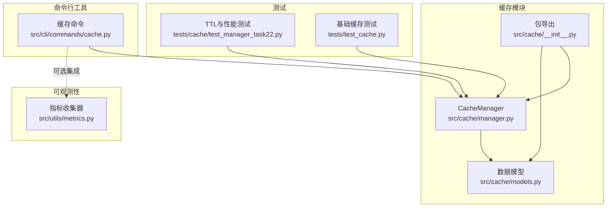
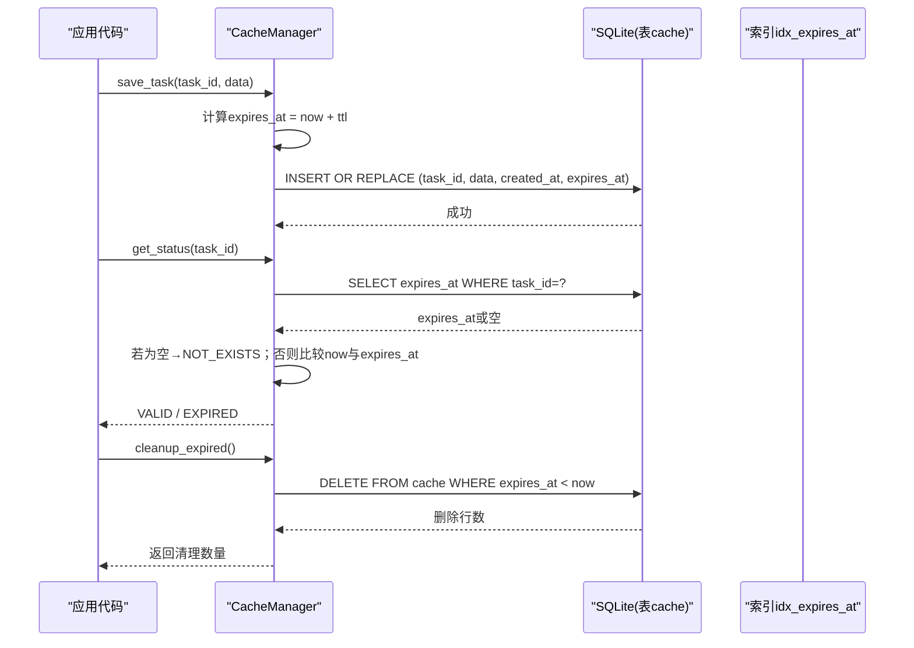
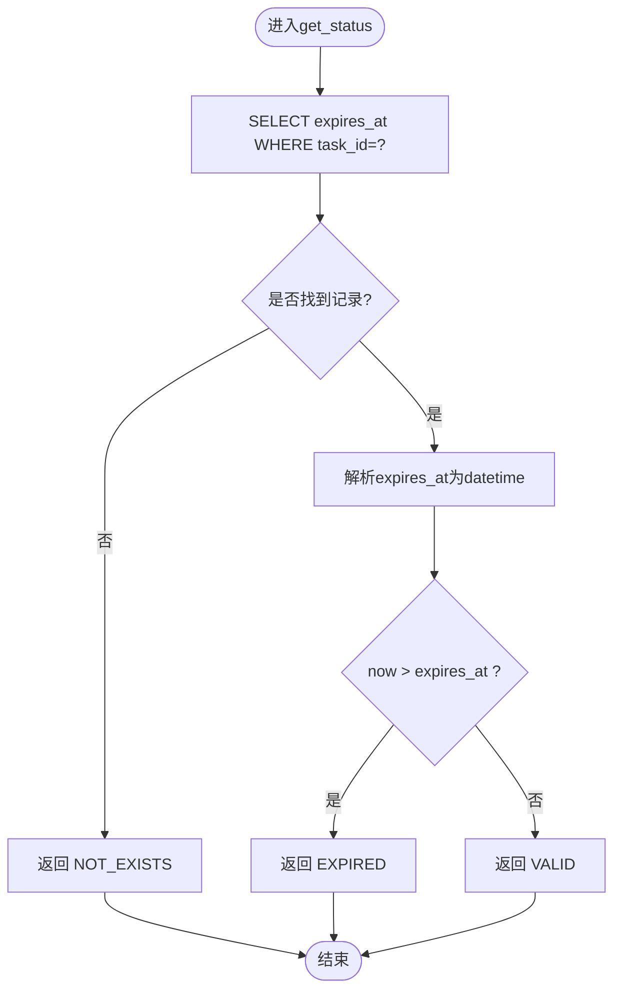
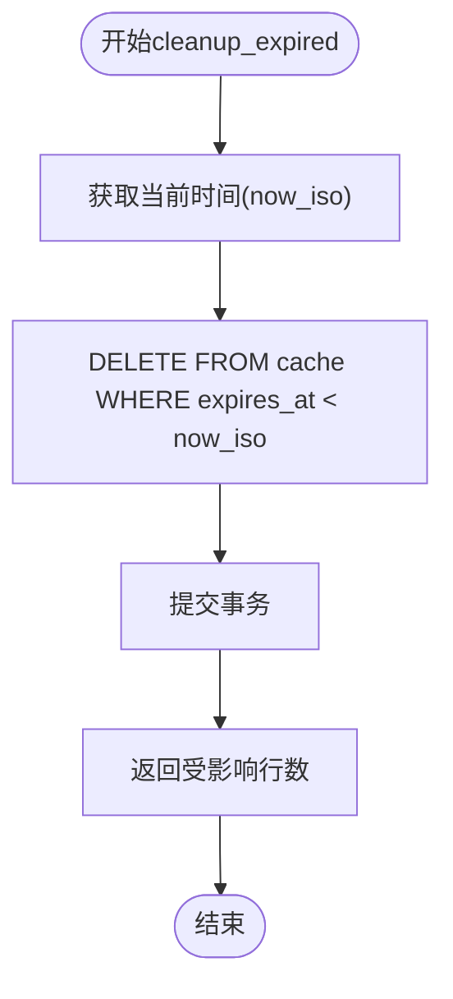
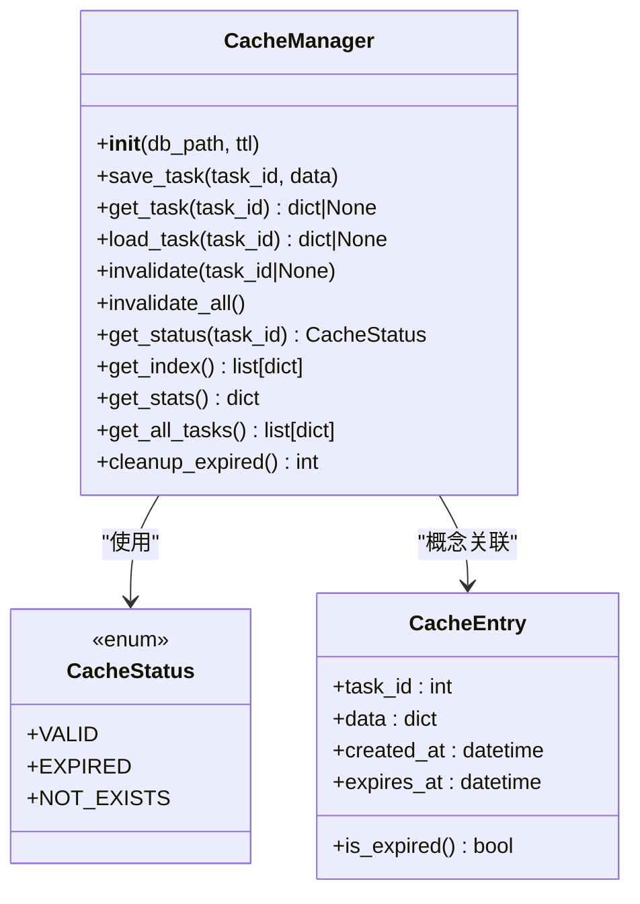

# TTL失效策略

<cite>
**本文引用的文件**
- [src/cache/manager.py](file://src/cache/manager.py)
- [src/cache/models.py](file://src/cache/models.py)
- [src/cache/__init__.py](file://src/cache/__init__.py)
- [src/cli/commands/cache.py](file://src/cli/commands/cache.py)
- [tests/cache/test_manager_task22.py](file://tests/cache/test_manager_task22.py)
- [tests/test_cache.py](file://tests/test_cache.py)
- [src/utils/metrics.py](file://src/utils/metrics.py)
</cite>

## 目录
1. [简介](#简介)
2. [项目结构](#项目结构)
3. [核心组件](#核心组件)
4. [架构总览](#架构总览)
5. [详细组件分析](#详细组件分析)
6. [依赖关系分析](#依赖关系分析)
7. [性能考量](#性能考量)
8. [故障排查指南](#故障排查指南)
9. [结论](#结论)
10. [附录：配置调优与监控指标](#附录配置调优与监控指标)

## 简介
本技术文档聚焦于时间到过期（TTL）失效策略的实现与使用，覆盖以下要点：
- TTL机制的存储格式与过期时间计算逻辑
- get_status方法的状态判断逻辑（NOT_EXISTS、EXPIRED、VALID）
- cleanup_expired方法的批量清理机制及定时任务集成建议
- TTL配置调优指南与不同场景下的最佳实践
- 失效检测的性能影响分析与可观测性指标说明

## 项目结构
缓存模块位于 src/cache 下，包含数据模型与缓存管理器；CLI命令提供缓存管理操作；测试用例覆盖了TTL行为与性能。

图表来源
- [src/cache/manager.py:1-165](file://src/cache/manager.py#L1-L165)
- [src/cache/models.py:1-22](file://src/cache/models.py#L1-L22)
- [src/cache/__init__.py:1-11](file://src/cache/__init__.py#L1-L11)
- [src/cli/commands/cache.py:1-87](file://src/cli/commands/cache.py#L1-L87)
- [tests/cache/test_manager_task22.py:1-238](file://tests/cache/test_manager_task22.py#L1-L238)
- [tests/test_cache.py:1-172](file://tests/test_cache.py#L1-L172)
- [src/utils/metrics.py:1-252](file://src/utils/metrics.py#L1-L252)

章节来源
- [src/cache/manager.py:1-165](file://src/cache/manager.py#L1-L165)
- [src/cache/models.py:1-22](file://src/cache/models.py#L1-L22)
- [src/cache/__init__.py:1-11](file://src/cache/__init__.py#L1-L11)
- [src/cli/commands/cache.py:1-87](file://src/cli/commands/cache.py#L1-L87)
- [tests/cache/test_manager_task22.py:1-238](file://tests/cache/test_manager_task22.py#L1-L238)
- [tests/test_cache.py:1-172](file://tests/test_cache.py#L1-L172)
- [src/utils/metrics.py:1-252](file://src/utils/metrics.py#L1-L252)

## 核心组件
- CacheManager：负责SQLite持久化、TTL写入与读取、状态查询、统计与清理。
- CacheStatus：枚举类型，表示缓存条目的三种状态：VALID、EXPIRED、NOT_EXISTS。
- CacheEntry：Pydantic模型，用于描述缓存条目结构与过期判定辅助方法。

章节来源
- [src/cache/manager.py:10-165](file://src/cache/manager.py#L10-L165)
- [src/cache/models.py:8-22](file://src/cache/models.py#L8-L22)

## 架构总览
TTL失效策略围绕“写入时设置过期时间”和“读取/查询时按当前时间比较”展开，并通过索引优化过期扫描与批量清理。

图表来源
- [src/cache/manager.py:59-76](file://src/cache/manager.py#L59-L76)
- [src/cache/manager.py:89-105](file://src/cache/manager.py#L89-L105)
- [src/cache/manager.py:156-164](file://src/cache/manager.py#L156-L164)
- [src/cache/manager.py:30-34](file://src/cache/manager.py#L30-L34)

## 详细组件分析

### TTL实现原理与存储格式
- 存储表结构
  - 字段：task_id（主键）、data（JSON文本）、created_at（ISO字符串）、expires_at（ISO字符串）。
  - 索引：在expires_at上建立索引以加速过期筛选与批量清理。
- 过期时间计算
  - 写入时：expires_at = now + timedelta(seconds=ttl)。
  - 读取/状态判断：将expires_at解析为datetime并与当前时间比较。
- 数据序列化
  - data字段使用JSON序列化存储，读取时反序列化为字典。

章节来源
- [src/cache/manager.py:20-34](file://src/cache/manager.py#L20-L34)
- [src/cache/manager.py:59-76](file://src/cache/manager.py#L59-L76)
- [src/cache/manager.py:37-54](file://src/cache/manager.py#L37-L54)

### get_status方法的状态判断逻辑
- 输入：task_id
- 流程
  - 查询是否存在该task_id的记录。
  - 不存在 → NOT_EXISTS
  - 存在 → 解析expires_at并与当前时间比较
    - 当前时间 > expires_at → EXPIRED
    - 否则 → VALID
- 复杂度
  - 单次查询O(1)，因task_id为主键。
  - 时间比较为常数级。

图表来源
- [src/cache/manager.py:89-105](file://src/cache/manager.py#L89-L105)

章节来源
- [src/cache/manager.py:89-105](file://src/cache/manager.py#L89-L105)
- [src/cache/models.py:8-11](file://src/cache/models.py#L8-L11)

### cleanup_expired方法的批量清理机制
- 功能
  - 删除所有expires_at小于当前时间的记录。
  - 返回被删除的行数。
- 性能优化
  - 利用expires_at上的索引进行范围删除，避免全表扫描。
  - 单条DELETE语句原子执行，减少锁竞争。
- 定时任务集成建议
  - 可在进程内使用轻量调度器（如线程+循环sleep）周期性调用cleanup_expired。
  - 也可通过系统cron或外部作业平台定期触发CLI命令“cache cleanup”。
  - 注意控制清理频率，避免频繁IO造成抖动。

图表来源
- [src/cache/manager.py:156-164](file://src/cache/manager.py#L156-L164)
- [src/cache/manager.py:30-34](file://src/cache/manager.py#L30-L34)

章节来源
- [src/cache/manager.py:156-164](file://src/cache/manager.py#L156-L164)
- [src/cli/commands/cache.py:81-87](file://src/cli/commands/cache.py#L81-L87)

### 相关方法与行为
- get_task/load_task：读取时检查过期，过期则视为不存在。
- get_all_tasks：仅返回未过期的条目。
- get_stats：统计total_entries、valid_entries、expired_entries。
- invalidate/invalidate_all：手动失效指定或全部条目。

章节来源
- [src/cache/manager.py:37-54](file://src/cache/manager.py#L37-L54)
- [src/cache/manager.py:140-154](file://src/cache/manager.py#L140-L154)
- [src/cache/manager.py:122-138](file://src/cache/manager.py#L122-L138)
- [src/cache/manager.py:78-87](file://src/cache/manager.py#L78-L87)

## 依赖关系分析
- 模块耦合
  - manager.py依赖models.py中的CacheStatus枚举。
  - CLI命令依赖CacheManager暴露的方法。
  - 测试覆盖TTL语义、状态转换与性能阈值。
- 外部依赖
  - SQLite作为持久化后端。
  - JSON用于数据序列化。
  - datetime/timedelta用于时间处理。

图表来源
- [src/cache/manager.py:10-165](file://src/cache/manager.py#L10-L165)
- [src/cache/models.py:8-22](file://src/cache/models.py#L8-L22)

章节来源
- [src/cache/manager.py:10-165](file://src/cache/manager.py#L10-L165)
- [src/cache/models.py:8-22](file://src/cache/models.py#L8-L22)

## 性能考量
- 读路径
  - get_task/get_status均为基于主键的单行查询，时间复杂度O(1)。
  - 过期判断为常数级时间比较。
- 写路径
  - save_task使用INSERT OR REPLACE，幂等更新同一task_id的数据并刷新过期时间。
- 批量清理
  - cleanup_expired利用expires_at索引进行范围删除，适合大规模过期数据的回收。
- 基准参考（来自测试断言）
  - 100次读取应在1秒内完成。
  - 100次写入应在2秒内完成。
  - 混合读写（150次）应在2秒内完成。
  - 清理100条过期数据应在1秒内完成。

章节来源
- [tests/cache/test_manager_task22.py:83-166](file://tests/cache/test_manager_task22.py#L83-L166)
- [tests/test_cache.py:131-154](file://tests/test_cache.py#L131-L154)

## 故障排查指南
- 现象：读取不到数据但get_status返回EXPIRED
  - 原因：条目已过期，get_task会返回None；需重新写入或延长TTL。
  - 定位：检查expires_at与当前时间差值。
- 现象：清理后仍有少量“过期”数据
  - 可能原因：并发写入导致新数据在清理前刚写入且即将过期；或清理间隔过长。
  - 建议：缩短清理周期或提高清理批处理能力。
- 现象：清理耗时过长
  - 可能原因：缺少索引或数据量极大。
  - 建议：确认expires_at索引存在；分批次清理或降低清理频率。
- 现象：统计不准确
  - 可能原因：并发读写导致瞬时不一致。
  - 建议：在关键路径增加重试或一致性校验。

章节来源
- [src/cache/manager.py:89-105](file://src/cache/manager.py#L89-L105)
- [src/cache/manager.py:156-164](file://src/cache/manager.py#L156-L164)
- [src/cache/manager.py:122-138](file://src/cache/manager.py#L122-L138)

## 结论
TTL失效策略在本项目中通过“写入时设置过期时间 + 读取/查询时即时比较”的方式实现，具备简单可靠、易于维护的特点。借助expires_at索引，批量清理具备良好的可扩展性。结合CLI命令与外部调度，可实现生产可用的自动化清理方案。建议在关键路径引入指标采集，以便持续评估TTL对系统的影响并进行参数调优。

## 附录：配置调优与监控指标

### TTL配置调优指南
- 短TTL（秒级）
  - 适用：热点、易变数据，快速失效以降低内存/磁盘占用。
  - 风险：命中率下降，需配合合理的回源策略。
- 中TTL（分钟级）
  - 适用：一般业务结果缓存，平衡命中与新鲜度。
- 长TTL（小时/天级）
  - 适用：冷数据或计算成本高的结果，提升命中率。
- 动态调整
  - 根据负载与命中率曲线动态调整TTL，避免“雪崩式”过期。
- 清理策略
  - 高频小批清理 vs 低频大批清理：前者降低空间膨胀，后者减少IO开销。
  - 建议：在低峰期执行深度清理，高峰期仅做轻量清理。

### 失效检测的性能影响分析
- 读放大
  - 每次读取都会进行时间比较，开销极小，但在极高QPS下仍需关注。
- 写放大
  - 重复写入同key会刷新过期时间，可能导致频繁更新。
- 清理开销
  - 依赖索引的范围删除通常高效，但大量过期数据仍会产生IO压力。

### 监控指标建议
- 计数器
  - cache_get_total：读取次数
  - cache_put_total：写入次数
  - cache_cleanup_total：清理次数
  - cache_expire_hit_total：命中过期分支的次数
- 仪表盘
  - cache_active_entries：当前有效条目数
  - cache_expired_entries：当前过期条目数
  - cache_db_size_bytes：数据库文件大小
- 直方图
  - cache_get_duration_seconds：读取耗时分布
  - cache_put_duration_seconds：写入耗时分布
  - cache_cleanup_duration_seconds：清理耗时分布
- 导出格式
  - 可使用内置MetricsCollector导出Prometheus格式，便于接入监控系统。

章节来源
- [src/utils/metrics.py:151-252](file://src/utils/metrics.py#L151-L252)
- [src/cli/commands/cache.py:64-87](file://src/cli/commands/cache.py#L64-L87)
