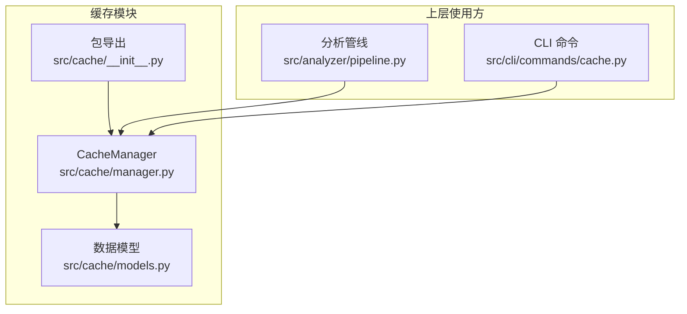
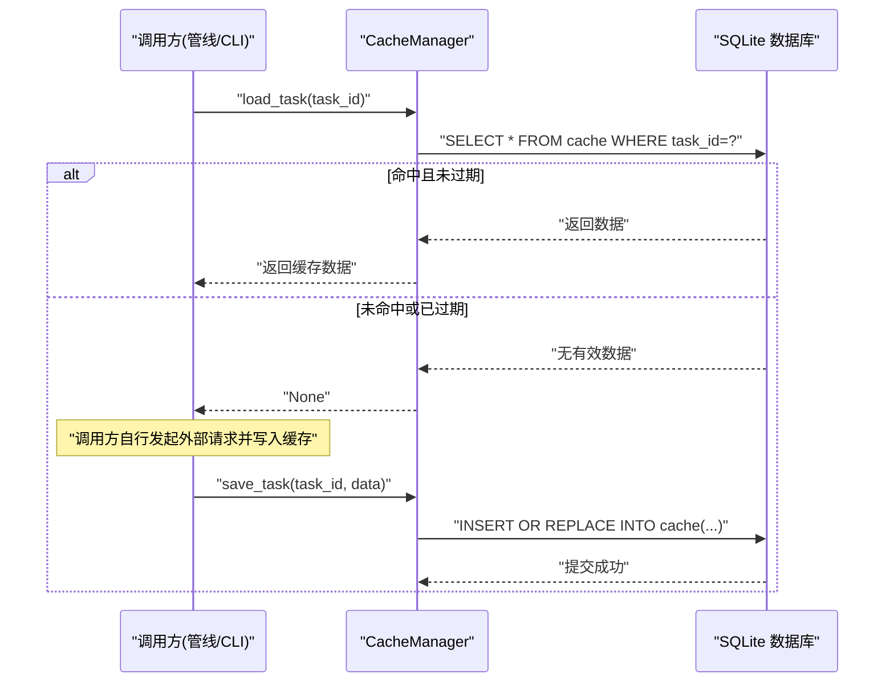
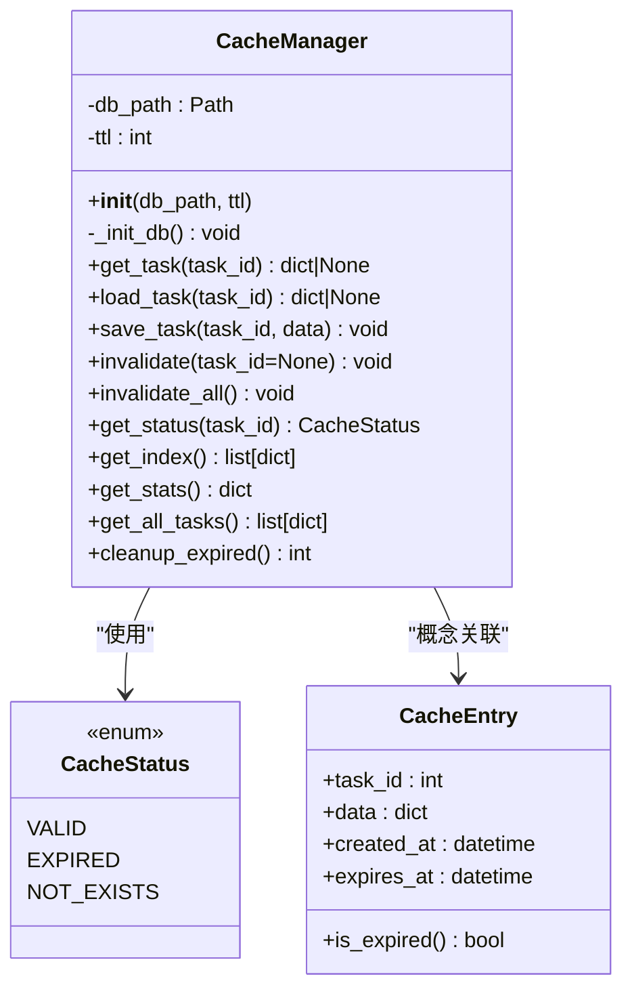
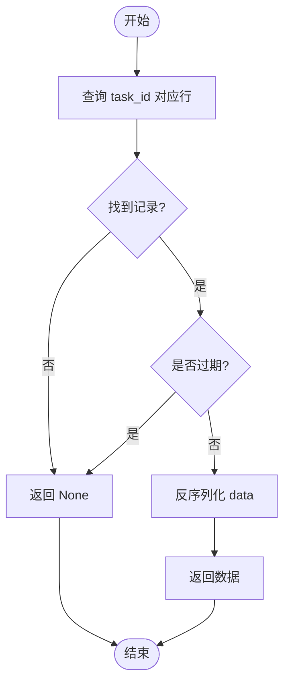
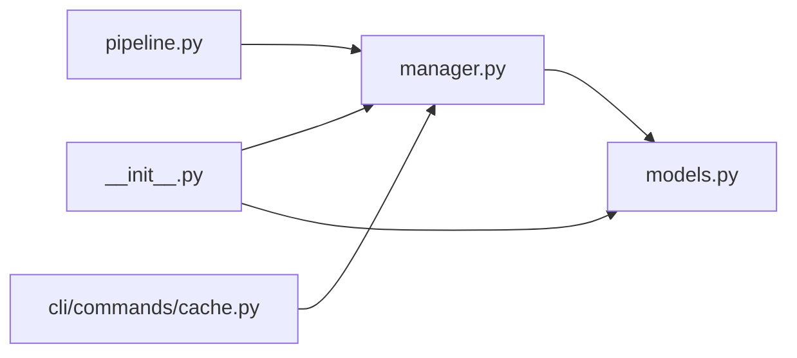

# 缓存操作接口

<cite>
**本文引用的文件**
- [src/cache/manager.py](file://src/cache/manager.py)
- [src/cache/models.py](file://src/cache/models.py)
- [src/cache/__init__.py](file://src/cache/__init__.py)
- [src/analyzer/pipeline.py](file://src/analyzer/pipeline.py)
- [src/cli/commands/cache.py](file://src/cli/commands/cache.py)
- [tests/test_cache.py](file://tests/test_cache.py)
- [tests/cache/test_manager_task22.py](file://tests/cache/test_manager_task22.py)
</cite>

## 目录
1. [简介](#简介)
2. [项目结构](#项目结构)
3. [核心组件](#核心组件)
4. [架构总览](#架构总览)
5. [详细组件分析](#详细组件分析)
6. [依赖关系分析](#依赖关系分析)
7. [性能考量](#性能考量)
8. [故障排查指南](#故障排查指南)
9. [结论](#结论)
10. [附录：API 使用示例与最佳实践](#附录api-使用示例与最佳实践)

## 简介
本技术文档聚焦于“缓存操作接口”，围绕任务级缓存的读写、失效与清理等能力，系统阐述以下要点：
- 核心操作方法 get_task、save_task、invalidate 的实现细节与适用场景
- load_task 与 get_task 的区别及为何提供两个读取接口
- 数据持久化机制（SQLite + INSERT OR REPLACE）与事务保证
- 错误处理与异常恢复策略（数据库连接失败、数据损坏等）
- 完整的 API 使用示例与最佳实践

## 项目结构
缓存模块位于 src/cache，包含管理器实现、数据模型与对外导出；在分析管线与 CLI 命令中均有实际使用。

图表来源
- [src/cache/manager.py:1-165](file://src/cache/manager.py#L1-L165)
- [src/cache/models.py:1-22](file://src/cache/models.py#L1-L22)
- [src/cache/__init__.py:1-11](file://src/cache/__init__.py#L1-L11)
- [src/analyzer/pipeline.py:230-266](file://src/analyzer/pipeline.py#L230-L266)
- [src/cli/commands/cache.py:1-87](file://src/cli/commands/cache.py#L1-L87)

章节来源
- [src/cache/manager.py:1-165](file://src/cache/manager.py#L1-L165)
- [src/cache/models.py:1-22](file://src/cache/models.py#L1-L22)
- [src/cache/__init__.py:1-11](file://src/cache/__init__.py#L1-L11)
- [src/analyzer/pipeline.py:230-266](file://src/analyzer/pipeline.py#L230-L266)
- [src/cli/commands/cache.py:1-87](file://src/cli/commands/cache.py#L1-L87)

## 核心组件
- CacheManager：封装 SQLite 本地缓存的初始化、读写、失效、统计与清理等操作
- CacheStatus / CacheEntry：状态枚举与条目模型，用于描述缓存项生命周期与状态

章节来源
- [src/cache/manager.py:10-165](file://src/cache/manager.py#L10-L165)
- [src/cache/models.py:8-22](file://src/cache/models.py#L8-L22)

## 架构总览
缓存作为轻量本地存储，被分析管线和 CLI 工具共同消费。典型流程为：先尝试从缓存读取，未命中则调用上游 API 获取并落盘，后续请求可直接命中缓存。

图表来源
- [src/cache/manager.py:37-76](file://src/cache/manager.py#L37-L76)
- [src/analyzer/pipeline.py:230-243](file://src/analyzer/pipeline.py#L230-L243)

## 详细组件分析

### 类图：CacheManager 与其依赖

图表来源
- [src/cache/manager.py:10-165](file://src/cache/manager.py#L10-L165)
- [src/cache/models.py:8-22](file://src/cache/models.py#L8-L22)

#### 关键方法说明
- _init_db：确保数据库文件路径存在，创建表与索引，建立 expires_at 索引以优化过期查询
- get_task：按 task_id 查询，若记录存在且未过期则反序列化返回，否则返回 None
- load_task：当前实现为 get_task 的别名，便于语义化表达“加载”意图
- save_task：将数据序列化为 JSON 后以 INSERT OR REPLACE 写入，附带 created_at 与 expires_at
- invalidate：支持按 task_id 删除或清空全部
- get_status：返回 NOT_EXISTS / VALID / EXPIRED 三种状态之一
- get_index / get_stats / get_all_tasks：提供索引、统计与批量读取能力（仅返回未过期项）
- cleanup_expired：物理删除过期记录，返回清理条数

章节来源
- [src/cache/manager.py:16-165](file://src/cache/manager.py#L16-L165)

#### 数据模型说明
- CacheStatus：枚举类型，表示缓存项是否存在与是否过期
- CacheEntry：Pydantic 模型，便于结构化校验与序列化，提供 is_expired 便捷判断

章节来源
- [src/cache/models.py:8-22](file://src/cache/models.py#L8-L22)

### 为什么需要 load_task 与 get_task 两个读取接口？
- 语义区分：load_task 强调“加载”这一业务动作，适合在管线中表达“优先从缓存加载，未命中再回源”的流程；get_task 更偏向底层“直接读取”
- 扩展性：未来可在 load_task 中注入额外逻辑（如自动刷新、降级策略），而保持 get_task 稳定不变
- 现状：当前 load_task 直接委托给 get_task，行为一致

章节来源
- [src/cache/manager.py:37-57](file://src/cache/manager.py#L37-L57)
- [src/analyzer/pipeline.py:230-243](file://src/analyzer/pipeline.py#L230-L243)

### 数据持久化机制与事务保证
- 存储引擎：SQLite 单文件数据库，表结构包含 task_id、data、created_at、expires_at，并对 expires_at 建索引
- 写入策略：INSERT OR REPLACE，基于主键 task_id 幂等更新，避免重复插入
- 事务保证：每个写操作通过 with sqlite3.connect(...) 上下文管理，显式 commit 提交，确保原子性与一致性
- 过期控制：读取时比较当前时间与 expires_at；清理时按 expires_at 删除

图表来源
- [src/cache/manager.py:37-54](file://src/cache/manager.py#L37-L54)
- [src/cache/manager.py:59-76](file://src/cache/manager.py#L59-L76)
- [src/cache/manager.py:156-165](file://src/cache/manager.py#L156-L165)

章节来源
- [src/cache/manager.py:16-35](file://src/cache/manager.py#L16-L35)
- [src/cache/manager.py:59-76](file://src/cache/manager.py#L59-L76)
- [src/cache/manager.py:156-165](file://src/cache/manager.py#L156-L165)

### 错误处理与异常恢复策略
- 数据库连接失败
  - 现象：sqlite3.connect 抛出异常
  - 建议：在调用层捕获异常，进行重试或降级（例如跳过缓存、走直连 API）
  - 参考位置：各方法均通过 with sqlite3.connect(...) 打开连接，异常会向上传播
- 数据损坏（JSON 解析失败）
  - 现象：json.loads 抛出异常
  - 建议：在调用层捕获并标记该条目为损坏，可选择删除损坏条目或返回空结果
  - 参考位置：读取路径中的 json.loads 调用
- 并发写入冲突
  - 现象：并发保存同一 task_id 可能触发 SQLite 锁等待
  - 建议：在应用层做幂等保护（INSERT OR REPLACE 已具备幂等语义），必要时加锁或队列化写入
- 磁盘空间不足
  - 现象：写入失败
  - 建议：监控磁盘空间，定期执行 cleanup_expired 释放空间

章节来源
- [src/cache/manager.py:37-54](file://src/cache/manager.py#L37-L54)
- [src/cache/manager.py:59-76](file://src/cache/manager.py#L59-L76)

### 使用场景与集成点
- 分析管线：优先从缓存加载任务信息，未命中则调用外部 API 获取并写入缓存
- CLI 命令：提供列出、清空、统计、清理过期等运维能力

章节来源
- [src/analyzer/pipeline.py:230-266](file://src/analyzer/pipeline.py#L230-L266)
- [src/cli/commands/cache.py:15-87](file://src/cli/commands/cache.py#L15-L87)

## 依赖关系分析
- 内部依赖
  - manager 依赖 models（CacheStatus）
  - __init__.py 统一导出 CacheManager、CacheEntry、CacheStatus
- 外部依赖
  - Python 标准库：sqlite3、json、datetime、pathlib、typing
  - Pydantic：用于数据模型定义

图表来源
- [src/cache/manager.py:1-10](file://src/cache/manager.py#L1-L10)
- [src/cache/models.py:1-7](file://src/cache/models.py#L1-L7)
- [src/cache/__init__.py:1-11](file://src/cache/__init__.py#L1-L11)
- [src/analyzer/pipeline.py:230-266](file://src/analyzer/pipeline.py#L230-L266)
- [src/cli/commands/cache.py:1-12](file://src/cli/commands/cache.py#L1-L12)

章节来源
- [src/cache/manager.py:1-10](file://src/cache/manager.py#L1-L10)
- [src/cache/models.py:1-7](file://src/cache/models.py#L1-L7)
- [src/cache/__init__.py:1-11](file://src/cache/__init__.py#L1-L11)

## 性能考量
- 读路径
  - 单条读取 O(1)（主键查找），过期检查为常数时间
  - 批量读取 get_all_tasks 会遍历全表并过滤过期项，数据量大时建议配合清理任务
- 写路径
  - INSERT OR REPLACE 基于主键，幂等高效
  - 频繁写入建议批量化或在应用层合并更新
- 过期清理
  - cleanup_expired 利用 expires_at 索引快速定位过期记录
- 测试验证
  - 单元测试覆盖了 TTL 精确过期、状态转换、并发幂等、大数据缓存、批量读写性能等

章节来源
- [tests/test_cache.py:16-155](file://tests/test_cache.py#L16-L155)
- [tests/cache/test_manager_task22.py:28-166](file://tests/cache/test_manager_task22.py#L28-L166)

## 故障排查指南
- 无法读取缓存
  - 检查数据库文件路径与权限
  - 确认 TTL 设置是否过短导致立即过期
  - 查看 get_status 返回是否为 NOT_EXISTS 或 EXPIRED
- 写入无效
  - 确认 save_task 是否成功提交（commit）
  - 检查磁盘空间与 SQLite 锁竞争
- 数据不一致
  - 确认并发写入是否幂等（INSERT OR REPLACE）
  - 对疑似损坏条目，可先删除再重新写入
- 清理不生效
  - 确认 cleanup_expired 是否被执行
  - 检查 expires_at 字段是否正确生成与比较

章节来源
- [src/cache/manager.py:89-138](file://src/cache/manager.py#L89-L138)
- [src/cache/manager.py:156-165](file://src/cache/manager.py#L156-L165)
- [tests/test_cache.py:75-155](file://tests/test_cache.py#L75-L155)

## 结论
缓存模块以 SQLite 为后端，提供简洁稳定的任务级缓存能力。通过 TTL 与过期清理保障数据新鲜度，通过 INSERT OR REPLACE 保证幂等写入，并通过清晰的 API 暴露给分析管线与 CLI 使用。建议在调用层增加必要的异常处理与监控指标，以获得更强的健壮性与可观测性。

## 附录：API 使用示例与最佳实践

### 基本用法
- 初始化
  - 指定 db_path 与 ttl（秒）
- 写入
  - save_task(task_id, data)
- 读取
  - get_task(task_id) 或 load_task(task_id)
- 失效
  - invalidate(task_id) 或 invalidate_all()
- 统计与清理
  - get_stats()、get_index()、get_all_tasks()、cleanup_expired()

章节来源
- [src/cache/manager.py:37-165](file://src/cache/manager.py#L37-L165)

### 在分析管线中使用
- 优先从缓存加载任务信息，未命中则调用外部 API 获取并写入缓存
- 通过配置开关 use_cache 控制是否启用缓存

章节来源
- [src/analyzer/pipeline.py:230-243](file://src/analyzer/pipeline.py#L230-L243)

### CLI 命令
- 列出缓存条目
- 清空单个或全部缓存
- 显示统计信息
- 清理过期缓存

章节来源
- [src/cli/commands/cache.py:15-87](file://src/cli/commands/cache.py#L15-L87)

### 最佳实践
- 合理设置 TTL：根据数据变化频率与一致性要求权衡
- 幂等写入：利用 INSERT OR REPLACE 特性，避免重复数据
- 定期清理：定时执行 cleanup_expired 释放空间
- 异常兜底：在调用层捕获数据库与 JSON 解析异常，提供降级路径
- 监控指标：记录命中率、过期率、清理数量与耗时

章节来源
- [tests/test_cache.py:16-155](file://tests/test_cache.py#L16-L155)
- [tests/cache/test_manager_task22.py:83-166](file://tests/cache/test_manager_task22.py#L83-L166)