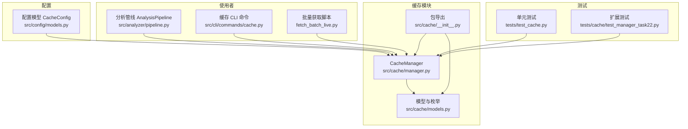
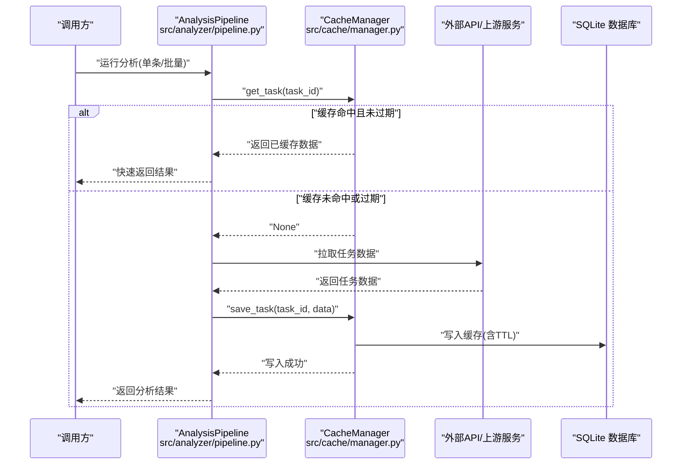
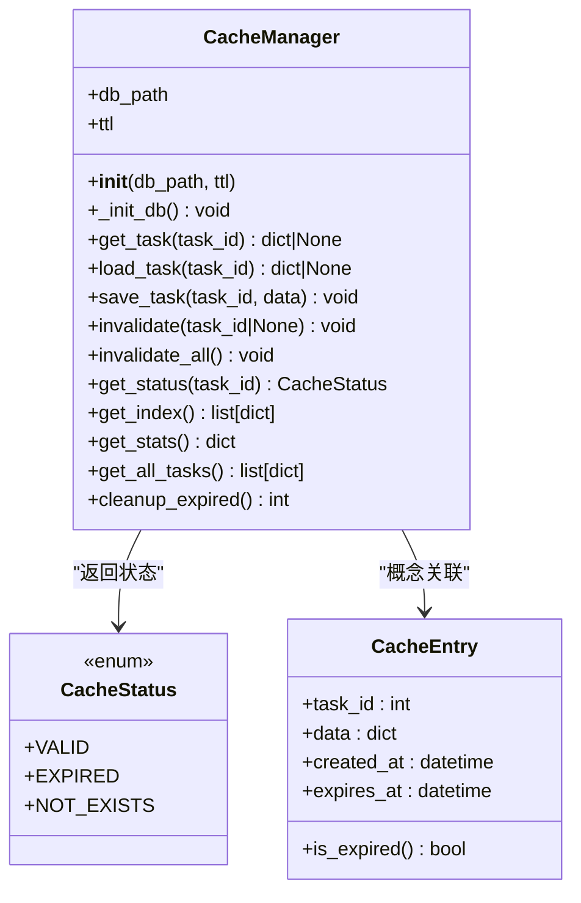
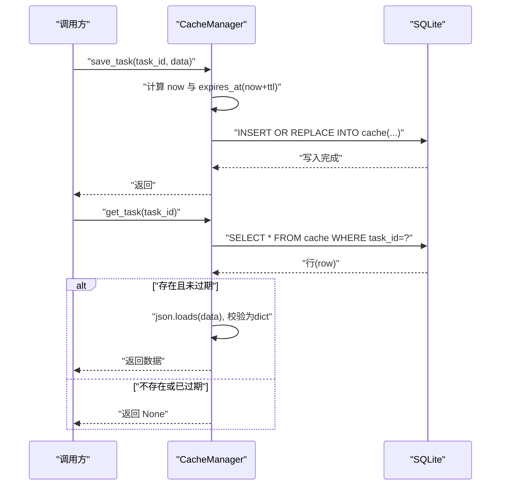
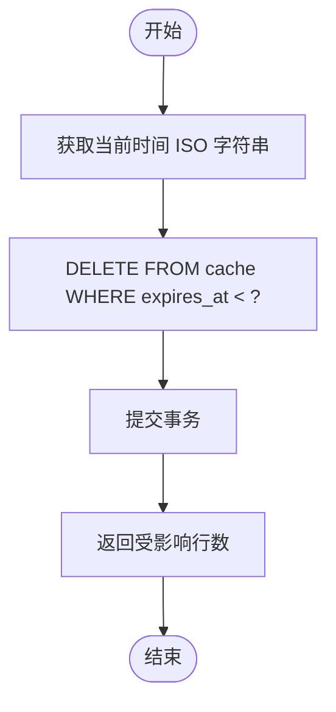
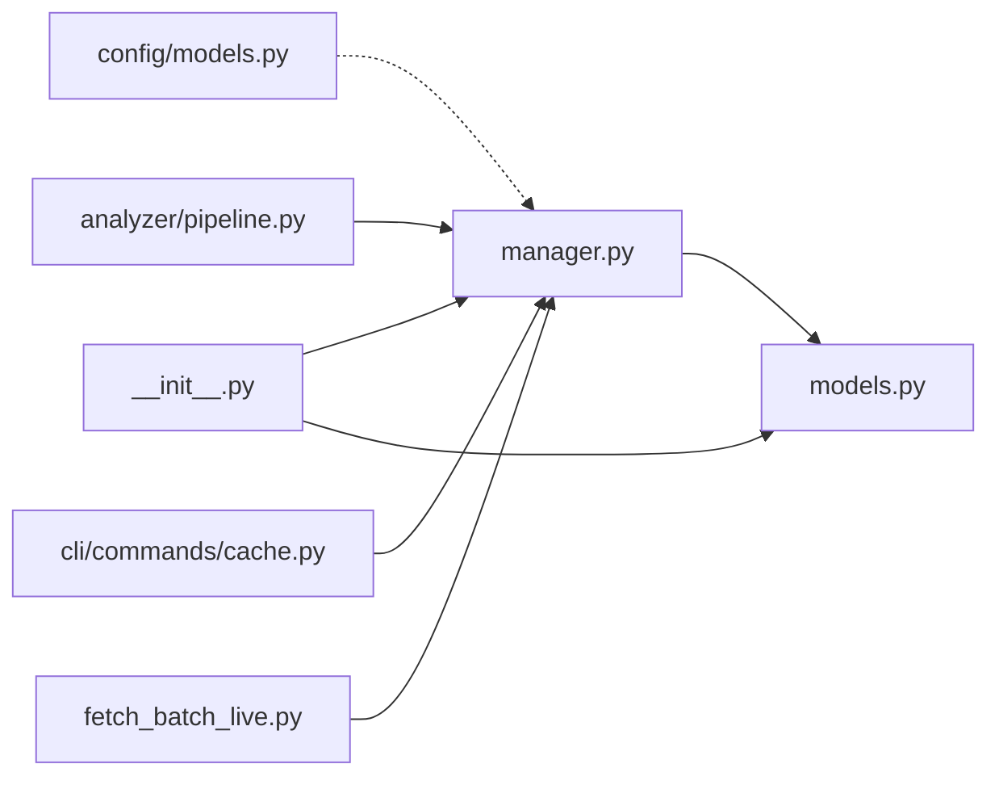

# 缓存架构设计

<cite>
**本文引用的文件列表**
- [src/cache/manager.py](file://src/cache/manager.py)
- [src/cache/models.py](file://src/cache/models.py)
- [src/cache/__init__.py](file://src/cache/__init__.py)
- [src/config/models.py](file://src/config/models.py)
- [src/analyzer/pipeline.py](file://src/analyzer/pipeline.py)
- [src/cli/commands/cache.py](file://src/cli/commands/cache.py)
- [fetch_batch_live.py](file://fetch_batch_live.py)
- [tests/test_cache.py](file://tests/test_cache.py)
- [tests/cache/test_manager_task22.py](file://tests/cache/test_manager_task22.py)
</cite>

## 目录
1. [简介](#简介)
2. [项目结构](#项目结构)
3. [核心组件](#核心组件)
4. [架构总览](#架构总览)
5. [详细组件分析](#详细组件分析)
6. [依赖关系分析](#依赖关系分析)
7. [性能与扩展性](#性能与扩展性)
8. [故障排查指南](#故障排查指南)
9. [结论](#结论)
10. [附录](#附录)

## 简介
本技术文档聚焦于 SQLite 缓存系统的设计与实现，面向 LLM 分析流水线中的任务数据缓存。文档覆盖数据库表结构与索引策略、存储格式选择（JSON）、CacheManager 类的设计模式（初始化、连接管理、过期控制），以及未来支持内存缓存与分布式缓存的预留接口建议。同时提供架构图与数据流图，帮助读者理解缓存系统在整体系统中的位置与交互方式。

## 项目结构
缓存模块位于 src/cache 下，包含管理器与模型定义；配置项在 src/config/models.py 中统一描述；CLI 命令提供缓存管理操作；批量脚本与分析管线展示了缓存的实际使用场景。

图表来源
- [src/cache/manager.py:1-165](file://src/cache/manager.py#L1-L165)
- [src/cache/models.py:1-22](file://src/cache/models.py#L1-L22)
- [src/cache/__init__.py:1-11](file://src/cache/__init__.py#L1-L11)
- [src/config/models.py:84-96](file://src/config/models.py#L84-L96)
- [src/analyzer/pipeline.py:1-200](file://src/analyzer/pipeline.py#L1-L200)
- [src/cli/commands/cache.py:1-87](file://src/cli/commands/cache.py#L1-L87)
- [fetch_batch_live.py:1-86](file://fetch_batch_live.py#L1-L86)
- [tests/test_cache.py:1-173](file://tests/test_cache.py#L1-L173)
- [tests/cache/test_manager_task22.py:1-237](file://tests/cache/test_manager_task22.py#L1-L237)

章节来源
- [src/cache/manager.py:1-165](file://src/cache/manager.py#L1-L165)
- [src/cache/models.py:1-22](file://src/cache/models.py#L1-L22)
- [src/cache/__init__.py:1-11](file://src/cache/__init__.py#L1-L11)
- [src/config/models.py:84-96](file://src/config/models.py#L84-L96)
- [src/analyzer/pipeline.py:1-200](file://src/analyzer/pipeline.py#L1-L200)
- [src/cli/commands/cache.py:1-87](file://src/cli/commands/cache.py#L1-L87)
- [fetch_batch_live.py:1-86](file://fetch_batch_live.py#L1-L86)
- [tests/test_cache.py:1-173](file://tests/test_cache.py#L1-L173)
- [tests/cache/test_manager_task22.py:1-237](file://tests/cache/test_manager_task22.py#L1-L237)

## 核心组件
- CacheManager：封装 SQLite 缓存的核心能力，包括建库建表、读写、失效、统计、清理等。
- CacheEntry/CacheStatus：缓存条目模型与状态枚举，用于类型约束与状态表达。
- CacheConfig：全局配置项，包含是否启用、TTL、存储类型、数据库路径等。

章节来源
- [src/cache/manager.py:10-165](file://src/cache/manager.py#L10-L165)
- [src/cache/models.py:8-22](file://src/cache/models.py#L8-L22)
- [src/config/models.py:84-96](file://src/config/models.py#L84-L96)

## 架构总览
下图展示缓存系统在 LLM 分析流水线中的位置与交互关系。分析管线负责编排各阶段，缓存作为可选层，在数据获取或中间结果生成后落盘，后续请求命中则直接返回，减少重复计算与外部调用。

图表来源
- [src/analyzer/pipeline.py:1-200](file://src/analyzer/pipeline.py#L1-L200)
- [src/cache/manager.py:37-76](file://src/cache/manager.py#L37-L76)

## 详细组件分析

### 数据库表结构与索引优化
- 表名：cache
- 字段：
  - task_id：主键，整数类型，唯一标识任务
  - data：TEXT，JSON 序列化后的任务数据
  - created_at：TEXT，ISO 时间字符串，记录创建时间
  - expires_at：TEXT，ISO 时间字符串，记录过期时间
- 索引：
  - idx_expires_at：对 expires_at 建立索引，加速过期判断与清理查询

该设计将 JSON 文本存储在 TEXT 列，利用 SQLite 原生 I/O 与事务保证一致性；通过 expires_at 索引提升按过期时间的筛选效率，适合周期性清理与统计。

章节来源
- [src/cache/manager.py:16-35](file://src/cache/manager.py#L16-L35)

### 存储格式与编码处理
- 存储格式：JSON
- 编码策略：
  - 写入时：使用 ensure_ascii=False 保留 Unicode 字符，避免转义带来的体积膨胀与可读性问题
  - 读取时：json.loads 反序列化为 Python 字典，并校验为 dict 类型，确保数据结构稳定
- 时间格式：ISO 字符串，便于跨语言与跨进程比较与排序

章节来源
- [src/cache/manager.py:59-76](file://src/cache/manager.py#L59-L76)
- [src/cache/manager.py:37-54](file://src/cache/manager.py#L37-L54)

### CacheManager 设计与模式
- 初始化流程：
  - 构造时接收 db_path 与 ttl，自动创建父目录
  - 首次连接时执行 CREATE TABLE IF NOT EXISTS 与索引创建，幂等安全
- 连接管理：
  - 每个方法内部以 with sqlite3.connect(...) 上下文管理连接，确保每次操作独立连接与提交
  - 优点：简单可靠，避免长连接共享状态；缺点：并发写需应用层串行化或引入连接池
- 事务处理：
  - 写入与删除操作显式 conn.commit()，保证原子性
  - 读操作无需事务
- 过期控制：
  - TTL 基于 expires_at 与当前时间比较，读取时若过期则视为未命中
  - 提供 cleanup_expired 批量删除过期条目，配合索引高效执行
- 统计与索引：
  - get_stats 统计总数、有效数、过期数
  - get_index 列出所有条目元信息（task_id、created_at、expires_at）

图表来源
- [src/cache/manager.py:10-165](file://src/cache/manager.py#L10-L165)
- [src/cache/models.py:8-22](file://src/cache/models.py#L8-L22)

章节来源
- [src/cache/manager.py:10-165](file://src/cache/manager.py#L10-L165)
- [src/cache/models.py:8-22](file://src/cache/models.py#L8-L22)

### 关键流程时序

#### 保存与读取流程

图表来源
- [src/cache/manager.py:59-76](file://src/cache/manager.py#L59-L76)
- [src/cache/manager.py:37-54](file://src/cache/manager.py#L37-L54)

#### 过期清理流程

图表来源
- [src/cache/manager.py:156-164](file://src/cache/manager.py#L156-L164)

### 配置与集成点
- 配置模型 CacheConfig：
  - enabled：是否启用缓存
  - ttl：过期时间（秒）
  - storage：存储类型（当前仅 sqlite 可用，预留 file、memory）
  - db_path：SQLite 数据库文件路径
- 集成示例：
  - 批量脚本 fetch_batch_live.py 从配置加载缓存路径与 TTL，实例化 CacheManager 并在获取任务前后进行缓存检查与写入
  - CLI 命令 cache.py 提供 list/clear/stats/cleanup 等操作，直接调用 CacheManager 对应方法

章节来源
- [src/config/models.py:84-96](file://src/config/models.py#L84-L96)
- [fetch_batch_live.py:34-86](file://fetch_batch_live.py#L34-L86)
- [src/cli/commands/cache.py:1-87](file://src/cli/commands/cache.py#L1-L87)

## 依赖关系分析
- 模块内依赖：
  - manager.py 依赖 models.py 的 CacheStatus
  - __init__.py 暴露 CacheManager、CacheEntry、CacheStatus
- 外部依赖：
  - 标准库 json、sqlite3、datetime、timedelta、pathlib
  - Pydantic BaseModel（用于模型定义）
- 使用者依赖：
  - 分析管线、CLI 命令、批量脚本均通过 import 使用 CacheManager

图表来源
- [src/cache/manager.py:1-10](file://src/cache/manager.py#L1-L10)
- [src/cache/models.py:1-12](file://src/cache/models.py#L1-L12)
- [src/cache/__init__.py:1-11](file://src/cache/__init__.py#L1-L11)
- [src/config/models.py:84-96](file://src/config/models.py#L84-L96)
- [src/analyzer/pipeline.py:1-200](file://src/analyzer/pipeline.py#L1-L200)
- [src/cli/commands/cache.py:1-87](file://src/cli/commands/cache.py#L1-L87)
- [fetch_batch_live.py:1-86](file://fetch_batch_live.py#L1-L86)

章节来源
- [src/cache/manager.py:1-10](file://src/cache/manager.py#L1-L10)
- [src/cache/models.py:1-12](file://src/cache/models.py#L1-L12)
- [src/cache/__init__.py:1-11](file://src/cache/__init__.py#L1-L11)
- [src/config/models.py:84-96](file://src/config/models.py#L84-L96)
- [src/analyzer/pipeline.py:1-200](file://src/analyzer/pipeline.py#L1-L200)
- [src/cli/commands/cache.py:1-87](file://src/cli/commands/cache.py#L1-L87)
- [fetch_batch_live.py:1-86](file://fetch_batch_live.py#L1-L86)

## 性能与扩展性

### 性能特性
- 读路径：
  - 主键查找 O(1)，过期判断为常数时间
  - JSON 反序列化开销与数据大小线性相关
- 写路径：
  - INSERT OR REPLACE 单次写入，事务提交开销固定
- 过期清理：
  - 借助 expires_at 索引，DELETE 过滤效率高
- 并发：
  - 当前每方法独立连接，无连接池；高并发写场景建议引入连接池或队列串行化

### 可扩展性预留接口
- 存储后端抽象：
  - 配置项 storage 已预留 "sqlite"、"file"、"memory"，可在未来实现 MemoryCacheManager 与 FileCacheManager，并通过工厂根据配置选择
- 分布式缓存：
  - 可新增 RedisCacheManager，保持相同接口（get/save/invalidate/cleanup），上层调用不变
- 指标与监控：
  - 可在 get_stats 基础上增加命中率、平均延迟等指标上报

章节来源
- [src/config/models.py:84-96](file://src/config/models.py#L84-L96)
- [src/cache/manager.py:122-138](file://src/cache/manager.py#L122-L138)

## 故障排查指南
- 常见问题
  - 缓存未命中：确认 TTL 设置是否过短；检查 get_task 返回值是否为 None
  - 过期清理无效：确认 cleanup_expired 是否被调用；检查 expires_at 索引是否存在
  - 并发写入冲突：当前实现非线程安全，建议在应用层串行化或使用连接池
- 定位手段
  - 使用 CLI 命令查看缓存条目与统计：list、stats、cleanup
  - 使用测试用例验证行为：test_cache.py 与 test_manager_task22.py 覆盖了 TTL、状态转换、性能边界

章节来源
- [src/cli/commands/cache.py:15-87](file://src/cli/commands/cache.py#L15-L87)
- [tests/test_cache.py:1-173](file://tests/test_cache.py#L1-L173)
- [tests/cache/test_manager_task22.py:1-237](file://tests/cache/test_manager_task22.py#L1-L237)

## 结论
SQLite 缓存系统以简洁可靠的表结构与索引策略实现了任务数据的持久化与过期控制，结合 JSON 存储与 ISO 时间格式，兼顾了可读性与跨平台兼容性。CacheManager 采用“方法级连接”模式，简化了资源管理，但在高并发场景需要进一步引入连接池或串行化机制。配置层已预留多存储后端选项，为未来扩展至内存缓存与分布式缓存提供了良好基础。

## 附录

### 数据模型与状态
- CacheEntry：包含任务 ID、数据、创建时间与过期时间，并提供 is_expired 判定
- CacheStatus：枚举值 valid、expired、not_exists，用于状态表达

章节来源
- [src/cache/models.py:8-22](file://src/cache/models.py#L8-L22)

### 使用示例路径
- 批量获取任务并缓存：fetch_batch_live.py
- CLI 缓存管理：src/cli/commands/cache.py
- 分析管线集成：src/analyzer/pipeline.py

章节来源
- [fetch_batch_live.py:34-86](file://fetch_batch_live.py#L34-L86)
- [src/cli/commands/cache.py:1-87](file://src/cli/commands/cache.py#L1-L87)
- [src/analyzer/pipeline.py:1-200](file://src/analyzer/pipeline.py#L1-L200)