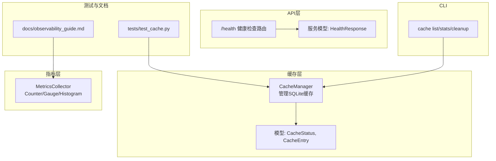
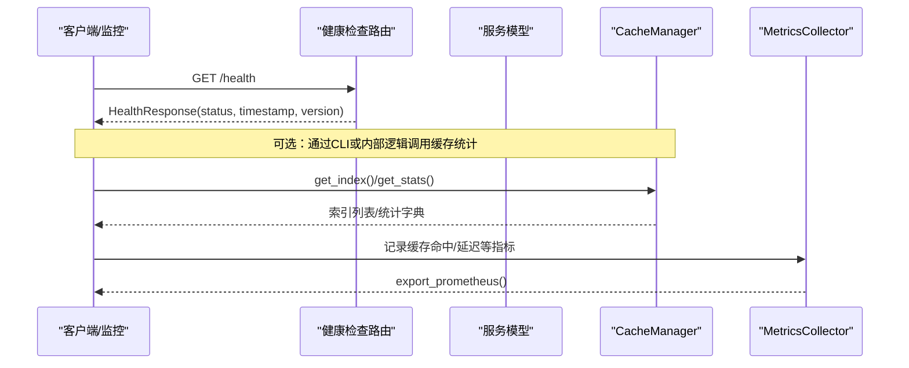
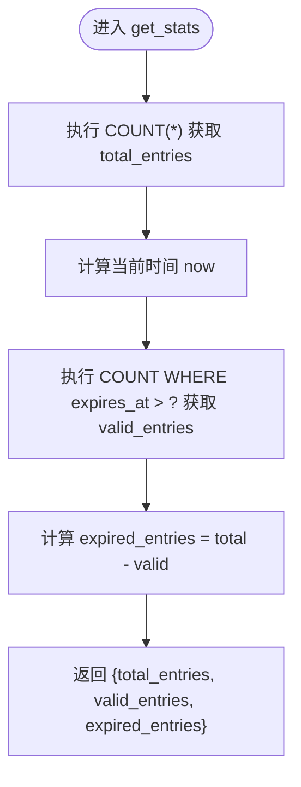
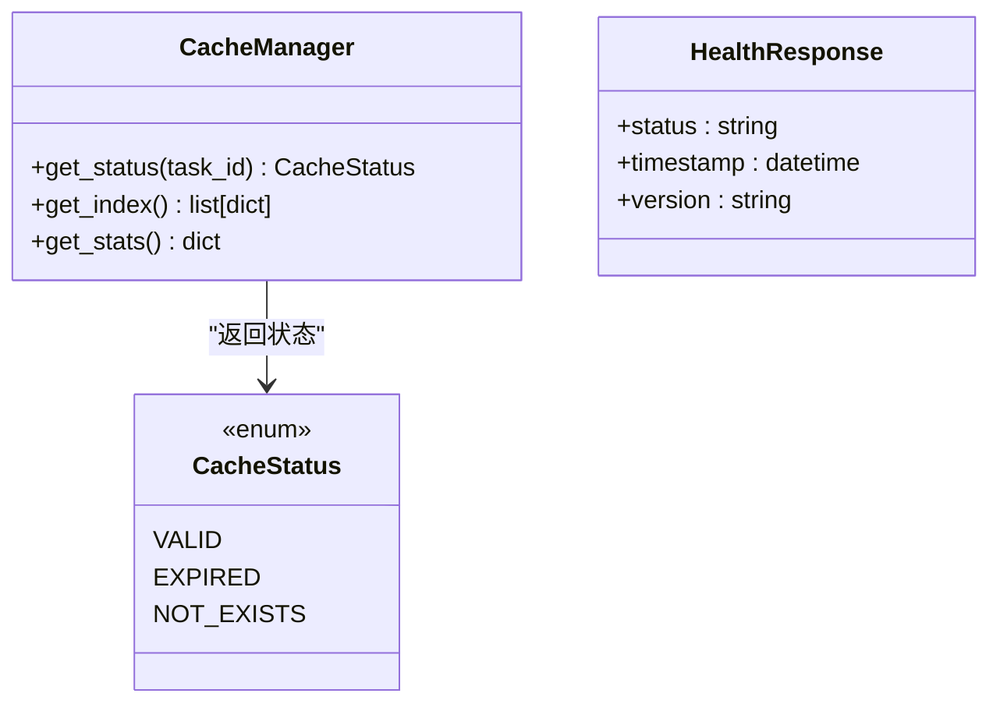
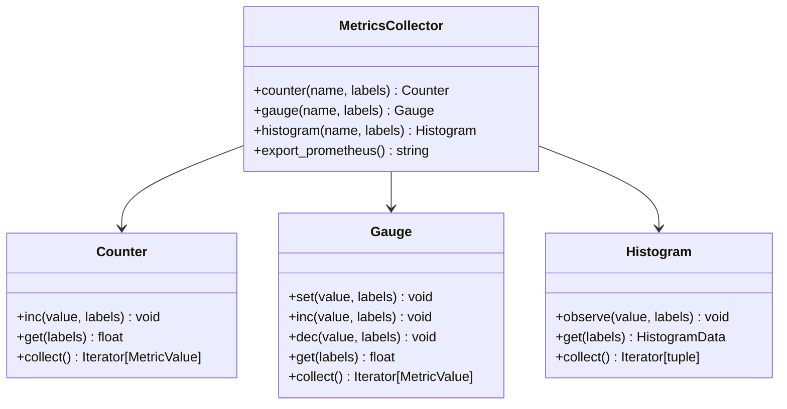
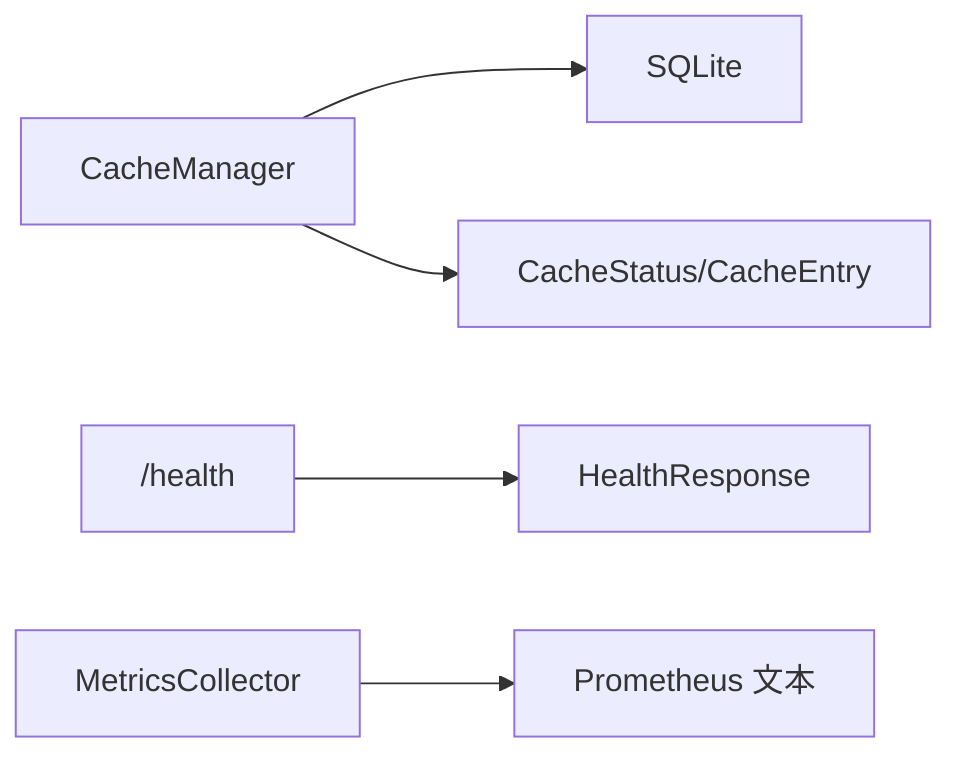

# 缓存监控统计

<cite>
**本文引用的文件**   
- [src/cache/manager.py](file://src/cache/manager.py)
- [src/cache/models.py](file://src/cache/models.py)
- [src/utils/metrics.py](file://src/utils/metrics.py)
- [src/api/routes/health.py](file://src/api/routes/health.py)
- [src/api/server_models.py](file://src/api/server_models.py)
- [src/cli/commands/cache.py](file://src/cli/commands/cache.py)
- [tests/test_cache.py](file://tests/test_cache.py)
- [docs/observability_guide.md](file://docs/observability_guide.md)
</cite>

## 目录
1. [简介](#简介)
2. [项目结构](#项目结构)
3. [核心组件](#核心组件)
4. [架构总览](#架构总览)
5. [详细组件分析](#详细组件分析)
6. [依赖关系分析](#依赖关系分析)
7. [性能考量](#性能考量)
8. [故障排查指南](#故障排查指南)
9. [结论](#结论)
10. [附录](#附录)

## 简介
本技术文档聚焦于“缓存监控统计”能力，围绕以下目标展开：
- 深入解释缓存状态查询功能，包括 get_index 与 get_stats 的实现原理与返回数据结构。
- 详细说明缓存健康检查机制，包括有效条目计数、过期条目统计与总体容量监控。
- 文档化缓存性能指标收集，包括查询响应时间、命中率统计与资源使用情况。
- 提供监控数据可视化方案（仪表盘设计与告警规则配置）。
- 给出实际监控案例与性能调优建议。

## 项目结构
与缓存监控统计直接相关的代码位于如下模块：
- 缓存实现与模型：src/cache/manager.py、src/cache/models.py
- 指标采集与导出：src/utils/metrics.py
- 健康检查接口：src/api/routes/health.py、src/api/server_models.py
- CLI 工具用于查看索引与统计：src/cli/commands/cache.py
- 单元测试覆盖缓存行为：tests/test_cache.py
- 可观测性使用示例与说明：docs/observability_guide.md

图表来源
- [src/cache/manager.py:10-165](file://src/cache/manager.py#L10-L165)
- [src/cache/models.py:8-22](file://src/cache/models.py#L8-L22)
- [src/utils/metrics.py:151-251](file://src/utils/metrics.py#L151-L251)
- [src/api/routes/health.py:10-22](file://src/api/routes/health.py#L10-L22)
- [src/api/server_models.py:9-15](file://src/api/server_models.py#L9-L15)
- [src/cli/commands/cache.py:15-87](file://src/cli/commands/cache.py#L15-L87)
- [tests/test_cache.py:10-173](file://tests/test_cache.py#L10-L173)
- [docs/observability_guide.md:74-138](file://docs/observability_guide.md#L74-L138)

章节来源
- [src/cache/manager.py:10-165](file://src/cache/manager.py#L10-L165)
- [src/cache/models.py:8-22](file://src/cache/models.py#L8-L22)
- [src/utils/metrics.py:151-251](file://src/utils/metrics.py#L151-L251)
- [src/api/routes/health.py:10-22](file://src/api/routes/health.py#L10-L22)
- [src/api/server_models.py:9-15](file://src/api/server_models.py#L9-L15)
- [src/cli/commands/cache.py:15-87](file://src/cli/commands/cache.py#L15-L87)
- [tests/test_cache.py:10-173](file://tests/test_cache.py#L10-L173)
- [docs/observability_guide.md:74-138](file://docs/observability_guide.md#L74-L138)

## 核心组件
- 缓存管理器 CacheManager
  - 基于 SQLite 的持久化缓存，支持 TTL 过期控制。
  - 关键方法：get_task、save_task、invalidate、get_status、get_index、get_stats、cleanup_expired。
- 缓存模型
  - CacheStatus：枚举类型，表示缓存项状态（有效/过期/不存在）。
  - CacheEntry：Pydantic 模型，封装任务ID、数据、创建时间与过期时间，并提供 is_expired 判断。
- 指标收集器 MetricsCollector
  - 提供 Counter、Gauge、Histogram 三类指标，并支持 Prometheus 格式导出。
- 健康检查接口
  - /health 返回服务健康状态，便于外部监控系统探测。
- CLI 缓存命令
  - cache list：列出缓存索引（task_id、created_at、expires_at）。
  - cache stats：输出 total_entries、valid_entries、expired_entries。
  - cache cleanup：清理过期条目。

章节来源
- [src/cache/manager.py:10-165](file://src/cache/manager.py#L10-L165)
- [src/cache/models.py:8-22](file://src/cache/models.py#L8-L22)
- [src/utils/metrics.py:151-251](file://src/utils/metrics.py#L151-L251)
- [src/api/routes/health.py:10-22](file://src/api/routes/health.py#L10-L22)
- [src/cli/commands/cache.py:15-87](file://src/cli/commands/cache.py#L15-L87)

## 架构总览
下图展示了缓存监控统计在系统中的位置与交互：
- API 健康检查对外暴露服务可用性。
- CacheManager 负责缓存读写、索引与统计。
- MetricsCollector 为系统提供通用指标采集能力，可用于扩展至缓存相关指标。
- CLI 提供本地运维能力，快速查看缓存索引与统计。

图表来源
- [src/api/routes/health.py:10-22](file://src/api/routes/health.py#L10-L22)
- [src/api/server_models.py:9-15](file://src/api/server_models.py#L9-L15)
- [src/cache/manager.py:107-138](file://src/cache/manager.py#L107-L138)
- [src/utils/metrics.py:190-226](file://src/utils/metrics.py#L190-L226)

## 详细组件分析

### 缓存状态查询：get_index 与 get_stats
- get_index
  - 作用：返回所有缓存条目的索引信息，包含 task_id、created_at、expires_at。
  - 实现要点：读取 SQLite 表 cache，按行构造字典列表返回。
  - 复杂度：O(N)，N 为缓存条目数；适合中小规模数据。
- get_stats
  - 作用：返回缓存统计信息，包括 total_entries、valid_entries、expired_entries。
  - 实现要点：
    - 先 COUNT(*) 获取总数。
    - 再 COUNT WHERE expires_at > now 获取有效条目数。
    - expired_entries = total - valid。
  - 复杂度：两次扫描，整体 O(N)。

图表来源
- [src/cache/manager.py:122-138](file://src/cache/manager.py#L122-L138)

章节来源
- [src/cache/manager.py:107-120](file://src/cache/manager.py#L107-L120)
- [src/cache/manager.py:122-138](file://src/cache/manager.py#L122-L138)
- [tests/test_cache.py:101-154](file://tests/test_cache.py#L101-L154)

### 缓存健康检查机制
- 单条缓存状态：get_status(task_id)
  - 返回 CacheStatus：VALID、EXPIRED、NOT_EXISTS。
  - 判定逻辑：若不存在则 NOT_EXISTS；否则比较 expires_at 与当前时间。
- 全局健康检查：/health
  - 返回 HealthResponse，包含 status、timestamp、version。
  - 适用于负载均衡与健康探针。

图表来源
- [src/cache/manager.py:89-105](file://src/cache/manager.py#L89-L105)
- [src/cache/models.py:8-11](file://src/cache/models.py#L8-L11)
- [src/api/server_models.py:9-15](file://src/api/server_models.py#L9-L15)

章节来源
- [src/cache/manager.py:89-105](file://src/cache/manager.py#L89-L105)
- [src/cache/models.py:8-11](file://src/cache/models.py#L8-L11)
- [src/api/routes/health.py:10-22](file://src/api/routes/health.py#L10-L22)
- [src/api/server_models.py:9-15](file://src/api/server_models.py#L9-L15)

### 缓存性能指标收集
- 指标类型
  - Counter：累计值（如请求总数、错误数）。
  - Gauge：瞬时值（如活跃连接数、队列长度）。
  - Histogram：分布值（如响应时间分桶）。
- 导出格式
  - export_prometheus：将计数器、仪表盘、直方图统一导出为 Prometheus 文本格式。
- 缓存相关指标建议
  - 计数器：cache_hits_total、cache_misses_total、cache_invalidations_total。
  - 仪表盘：cache_size_bytes、cache_active_connections。
  - 直方图：cache_query_duration_seconds（可按 endpoint/task_id 打标签）。

图表来源
- [src/utils/metrics.py:151-251](file://src/utils/metrics.py#L151-L251)

章节来源
- [src/utils/metrics.py:151-251](file://src/utils/metrics.py#L151-L251)
- [docs/observability_guide.md:74-138](file://docs/observability_guide.md#L74-L138)

### 监控数据可视化方案
- 仪表盘设计建议
  - 概览面板：服务健康（/health）、缓存总量、有效/过期条目比例、TTL 分布。
  - 性能面板：缓存查询耗时直方图、命中率趋势、无效化频率。
  - 容量面板：缓存大小增长曲线、清理效果对比。
- 告警规则配置建议
  - 高过期率：expired_entries / total_entries > 阈值（如 0.5）持续 N 分钟。
  - 低命中率：cache_hits_total / (cache_hits_total + cache_misses_total) < 阈值（如 0.3）。
  - 容量异常：cache_size_bytes 超过上限或增长速率异常。
  - 健康失败：/health 连续失败次数超过阈值。
- 数据来源对接
  - 使用 MetricsCollector.export_prometheus() 输出标准格式，供 Prometheus 抓取与 Grafana 展示。

章节来源
- [docs/observability_guide.md:74-138](file://docs/observability_guide.md#L74-L138)
- [src/utils/metrics.py:190-226](file://src/utils/metrics.py#L190-L226)

### 实际监控案例
- 场景一：批量任务分析后观察缓存健康
  - 步骤：
    - 运行分析任务，写入缓存。
    - 使用 CLI cache stats 查看 total_entries、valid_entries、expired_entries。
    - 使用 CLI cache list 查看最近创建的条目索引。
    - 使用 CLI cache cleanup 清理过期条目，观察 expired_entries 下降。
  - 参考路径：
    - [src/cli/commands/cache.py:64-87](file://src/cli/commands/cache.py#L64-L87)
    - [tests/test_cache.py:131-154](file://tests/test_cache.py#L131-L154)
- 场景二：集成指标采集
  - 步骤：
    - 在关键路径记录 cache_query_duration_seconds 直方图。
    - 记录 cache_hits_total 与 cache_misses_total 计数器。
    - 定时导出 Prometheus 文本，接入监控系统。
  - 参考路径：
    - [src/utils/metrics.py:190-226](file://src/utils/metrics.py#L190-L226)
    - [docs/observability_guide.md:74-138](file://docs/observability_guide.md#L74-L138)

章节来源
- [src/cli/commands/cache.py:64-87](file://src/cli/commands/cache.py#L64-L87)
- [tests/test_cache.py:131-154](file://tests/test_cache.py#L131-L154)
- [src/utils/metrics.py:190-226](file://src/utils/metrics.py#L190-L226)
- [docs/observability_guide.md:74-138](file://docs/observability_guide.md#L74-L138)

### 性能调优建议
- 数据库层面
  - 利用现有 expires_at 索引加速过期判断与统计查询。
  - 定期执行 cleanup_expired 减少无效数据膨胀。
- 查询优化
  - 对 get_stats 的 COUNT 操作进行批处理或异步化，避免阻塞主流程。
  - 对 get_index 增加分页或限制返回数量，降低网络与序列化开销。
- 指标采集
  - 合理设置直方图分桶，避免过多标签导致维度爆炸。
  - 对高频指标采用采样或聚合策略，降低存储压力。
- 容量规划
  - 根据业务峰值估算缓存大小，设定上限与自动清理策略。
  - 监控 TTL 分布，动态调整 TTL 以平衡命中率与内存占用。

章节来源
- [src/cache/manager.py:156-165](file://src/cache/manager.py#L156-L165)
- [src/cache/manager.py:107-138](file://src/cache/manager.py#L107-L138)
- [src/utils/metrics.py:151-251](file://src/utils/metrics.py#L151-L251)

## 依赖关系分析
- 组件耦合
  - CacheManager 依赖 SQLite 与 datetime/json 标准库，无外部框架耦合。
  - MetricsCollector 独立于业务模块，仅依赖标准库与 dataclass。
  - API 健康检查与模型解耦，便于替换实现。
- 外部依赖
  - SQLite：轻量级嵌入式数据库，适合单机缓存。
  - Prometheus：指标导出格式兼容，便于生态集成。
- 潜在风险
  - 大表 COUNT 可能成为瓶颈，需评估数据量与查询频率。
  - 指标标签过多会导致存储与查询成本上升。

图表来源
- [src/cache/manager.py:10-165](file://src/cache/manager.py#L10-L165)
- [src/cache/models.py:8-22](file://src/cache/models.py#L8-L22)
- [src/api/routes/health.py:10-22](file://src/api/routes/health.py#L10-L22)
- [src/api/server_models.py:9-15](file://src/api/server_models.py#L9-L15)
- [src/utils/metrics.py:190-226](file://src/utils/metrics.py#L190-L226)

章节来源
- [src/cache/manager.py:10-165](file://src/cache/manager.py#L10-L165)
- [src/cache/models.py:8-22](file://src/cache/models.py#L8-L22)
- [src/api/routes/health.py:10-22](file://src/api/routes/health.py#L10-L22)
- [src/api/server_models.py:9-15](file://src/api/server_models.py#L9-L15)
- [src/utils/metrics.py:190-226](file://src/utils/metrics.py#L190-L226)

## 性能考量
- 查询复杂度
  - get_index：O(N)，返回全部索引，建议在 CLI 中限制显示数量。
  - get_stats：两次 COUNT，整体 O(N)，可通过分区或物化视图优化。
- 存储与索引
  - expires_at 已建立索引，有助于过期判断与统计。
- 指标采集开销
  - 直方图分桶默认固定，注意在高并发下内存占用。
  - 标签维度应谨慎设计，避免组合爆炸。

章节来源
- [src/cache/manager.py:107-138](file://src/cache/manager.py#L107-L138)
- [src/cache/manager.py:156-165](file://src/cache/manager.py#L156-L165)
- [src/utils/metrics.py:151-251](file://src/utils/metrics.py#L151-L251)

## 故障排查指南
- 常见问题
  - 缓存为空：确认是否保存成功或 TTL 过短。
  - 过期率高：检查 TTL 配置与业务访问模式。
  - 统计不一致：确认是否存在并发写入与未提交事务。
- 定位手段
  - 使用 CLI cache list 查看最近条目与过期时间。
  - 使用 CLI cache stats 观察 total/valid/expired 变化。
  - 使用 CLI cache cleanup 清理过期条目后复测。
- 日志与指标
  - 结合 MetricsCollector 记录关键路径耗时与错误计数。
  - 导出 Prometheus 文本，接入监控系统进行趋势分析。

章节来源
- [src/cli/commands/cache.py:15-87](file://src/cli/commands/cache.py#L15-L87)
- [tests/test_cache.py:101-154](file://tests/test_cache.py#L101-L154)
- [src/utils/metrics.py:190-226](file://src/utils/metrics.py#L190-L226)

## 结论
- 缓存监控统计通过 CacheManager 提供基础的状态查询与统计能力，并通过 CLI 与 API 健康检查暴露给外部系统。
- MetricsCollector 为系统提供了统一的指标采集与导出能力，便于扩展至缓存相关指标并与 Prometheus/Grafana 集成。
- 在生产环境中，建议结合告警规则与可视化面板，持续跟踪缓存健康与性能，并根据业务特征优化 TTL 与清理策略。

## 附录
- 返回数据结构定义
  - get_index 返回：list[{"task_id": int, "created_at": str, "expires_at": str}]
  - get_stats 返回：{"total_entries": int, "valid_entries": int, "expired_entries": int}
  - HealthResponse：{"status": str, "timestamp": datetime, "version": str}

章节来源
- [src/cache/manager.py:107-138](file://src/cache/manager.py#L107-L138)
- [src/api/server_models.py:9-15](file://src/api/server_models.py#L9-L15)