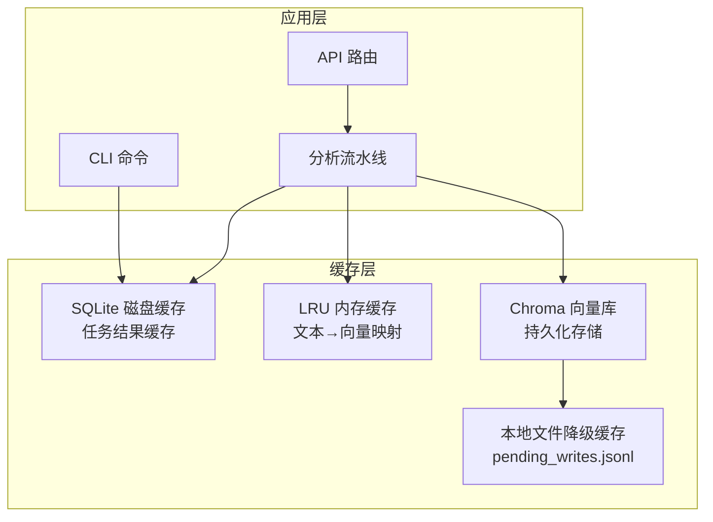
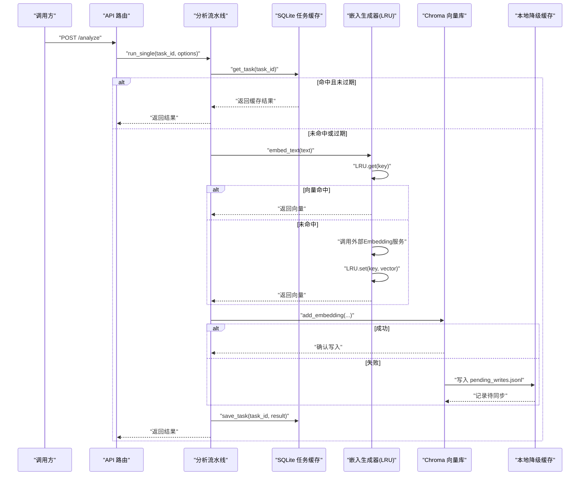
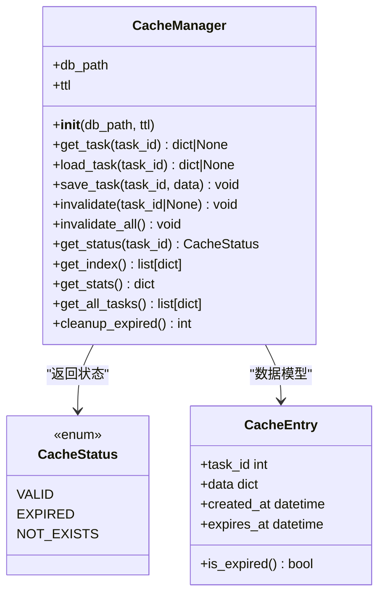
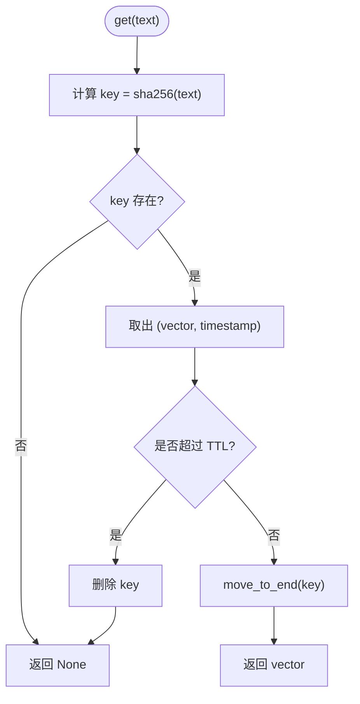
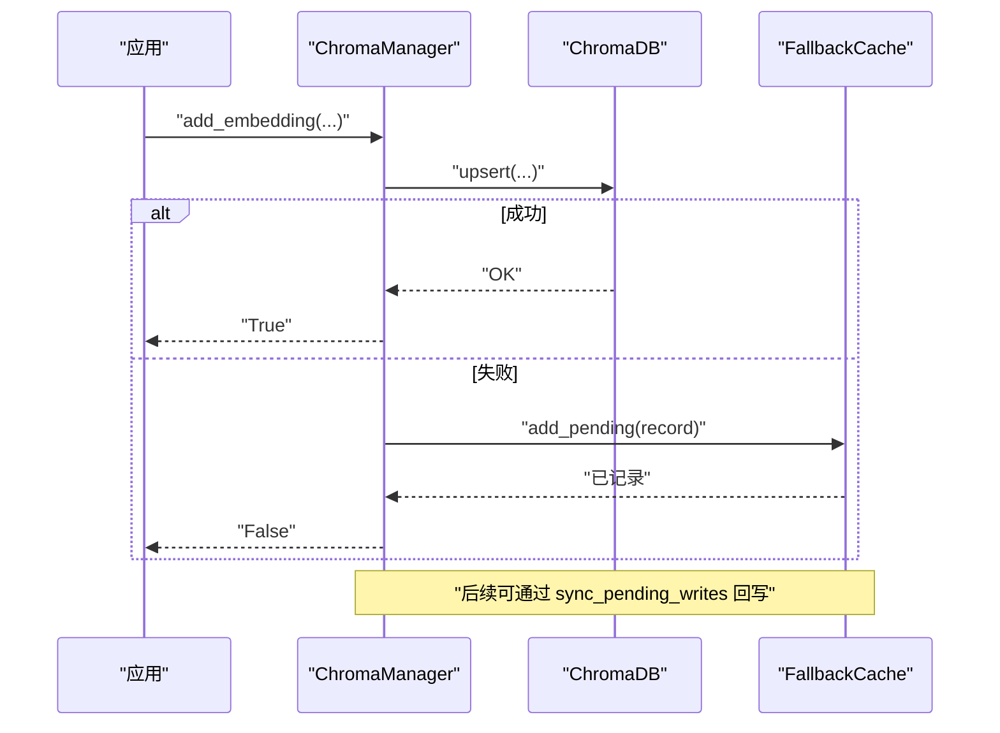
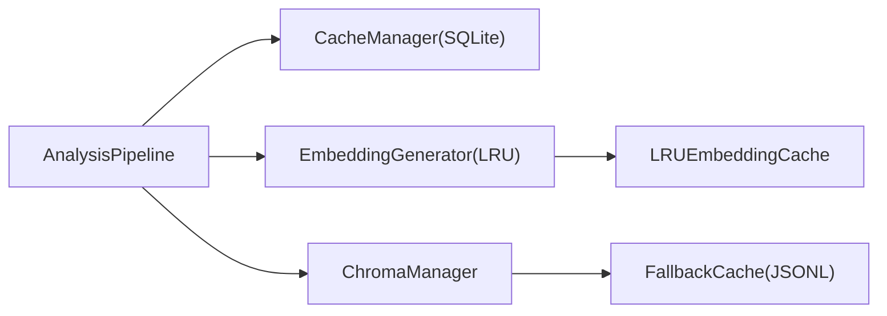

# 缓存策略实现

<cite>
**本文引用的文件**
- [src/cache/__init__.py](file://src/cache/__init__.py)
- [src/cache/manager.py](file://src/cache/manager.py)
- [src/cache/models.py](file://src/cache/models.py)
- [src/embedding/generator.py](file://src/embedding/generator.py)
- [src/storage/chroma_manager.py](file://src/storage/chroma_manager.py)
- [src/config/models.py](file://src/config/models.py)
- [src/analyzer/pipeline.py](file://src/analyzer/pipeline.py)
- [src/cli/commands/cache.py](file://src/cli/commands/cache.py)
- [tests/test_cache.py](file://tests/test_cache.py)
- [tests/cache/test_manager_task22.py](file://tests/cache/test_manager_task22.py)
</cite>

## 目录
1. [简介](#简介)
2. [项目结构](#项目结构)
3. [核心组件](#核心组件)
4. [架构总览](#架构总览)
5. [详细组件分析](#详细组件分析)
6. [依赖关系分析](#依赖关系分析)
7. [性能与命中率优化](#性能与命中率优化)
8. [一致性保证方案](#一致性保证方案)
9. [监控与调优指南](#监控与调优指南)
10. [故障排查指南](#故障排查指南)
11. [结论](#结论)
12. [附录：使用案例与效果对比](#附录使用案例与效果对比)

## 简介
本技术文档围绕 LLM 相关任务的缓存策略实现，系统梳理多级缓存架构（内存、磁盘、向量库持久化）的设计与落地。重点覆盖：
- 多级缓存层次设计：进程内 LRU 内存缓存、SQLite 磁盘缓存、Chroma 向量库持久化与降级机制
- 失效机制：TTL 精确过期、LRU 淘汰、主动失效与批量清理
- 命中率优化：预加载、热点识别、缓存预热
- 一致性保障：读写策略、数据同步与幂等更新
- 监控与调优：统计指标、性能基线、容量与并发配置
- 实际使用案例与效果对比：基于测试用例的性能与行为验证

## 项目结构
缓存相关代码主要分布在以下模块：
- src/cache：任务级结果缓存（SQLite），提供 TTL、状态查询、索引与清理能力
- src/embedding：文本到向量的嵌入生成器，内置 LRU 内存缓存用于加速重复文本的向量计算
- src/storage：Chroma 向量数据库管理器，具备重试与本地文件降级缓存（FallbackCache）
- src/config：全局配置模型，包含 CacheConfig 字段
- src/analyzer：分析流水线集成缓存管理器的获取与使用
- src/cli：命令行工具对缓存进行查看、清空、统计与清理
- tests：覆盖 TTL、状态转换、性能、清理、并发幂等性等场景

图表来源
- [src/analyzer/pipeline.py:258-266](file://src/analyzer/pipeline.py#L258-L266)
- [src/embedding/generator.py:12-52](file://src/embedding/generator.py#L12-L52)
- [src/storage/chroma_manager.py:42-109](file://src/storage/chroma_manager.py#L42-L109)
- [src/cache/manager.py:10-36](file://src/cache/manager.py#L10-L36)

章节来源
- [src/cache/__init__.py:1-11](file://src/cache/__init__.py#L1-L11)
- [src/cache/manager.py:10-36](file://src/cache/manager.py#L10-L36)
- [src/embedding/generator.py:12-52](file://src/embedding/generator.py#L12-L52)
- [src/storage/chroma_manager.py:111-172](file://src/storage/chroma_manager.py#L111-L172)
- [src/config/models.py:84-96](file://src/config/models.py#L84-L96)
- [src/analyzer/pipeline.py:258-266](file://src/analyzer/pipeline.py#L258-L266)
- [src/cli/commands/cache.py:1-87](file://src/cli/commands/cache.py#L1-L87)

## 核心组件
- 任务级磁盘缓存（SQLite）
  - 功能：按 task_id 存取分析结果，支持 TTL、状态查询、索引、统计与过期清理
  - 关键接口：get_task/save_task/invalidate/cleanup_expired/get_stats/get_index
- 文本向量内存缓存（LRU）
  - 功能：以文本为键缓存向量，支持最大容量与 TTL，命中时直接返回向量
  - 关键接口：get/set/clear/len
- 向量库持久化与降级
  - 功能：Chroma 写入失败自动降级至本地 JSONL 待写队列，后续可同步回写
  - 关键接口：add_embedding/add_batch_embeddings/sync_pending_writes/is_healthy/get_stats
- 配置与集成
  - 配置项：enabled/ttl/storage/db_path
  - 集成点：分析流水线通过配置创建 CacheManager；嵌入生成器自带 LRU 缓存

章节来源
- [src/cache/manager.py:37-165](file://src/cache/manager.py#L37-L165)
- [src/cache/models.py:8-22](file://src/cache/models.py#L8-L22)
- [src/embedding/generator.py:12-52](file://src/embedding/generator.py#L12-L52)
- [src/storage/chroma_manager.py:236-350](file://src/storage/chroma_manager.py#L236-L350)
- [src/config/models.py:84-96](file://src/config/models.py#L84-L96)
- [src/analyzer/pipeline.py:258-266](file://src/analyzer/pipeline.py#L258-L266)

## 架构总览
下图展示从请求进入分析流水线到多级缓存协同工作的整体流程。

图表来源
- [src/analyzer/pipeline.py:258-266](file://src/analyzer/pipeline.py#L258-L266)
- [src/embedding/generator.py:162-216](file://src/embedding/generator.py#L162-L216)
- [src/storage/chroma_manager.py:236-284](file://src/storage/chroma_manager.py#L236-L284)
- [src/storage/chroma_manager.py:437-482](file://src/storage/chroma_manager.py#L437-L482)
- [src/cache/manager.py:37-76](file://src/cache/manager.py#L37-L76)

## 详细组件分析

### SQLite 任务缓存（磁盘层）
- 设计要点
  - 表结构：task_id 主键，data 文本序列化，created_at/expires_at 时间戳
  - TTL 控制：保存时计算 expires_at，读取时判断是否过期并返回 None
  - 主动失效：支持按 task_id 或全量删除
  - 统计与索引：提供 total/valid/expired 计数与 expires_at 索引
  - 清理：定时或按需清理过期条目
- 复杂度
  - 读/写 O(1) 平均（SQLite 单行操作）
  - 清理 O(n) 扫描过期条件（带索引优化）
- 错误处理
  - 连接异常由上层捕获；过期判定逻辑避免脏读
- 适用场景
  - 长耗时分析结果的跨进程复用与持久化

图表来源
- [src/cache/manager.py:10-165](file://src/cache/manager.py#L10-L165)
- [src/cache/models.py:8-22](file://src/cache/models.py#L8-L22)

章节来源
- [src/cache/manager.py:16-36](file://src/cache/manager.py#L16-L36)
- [src/cache/manager.py:37-165](file://src/cache/manager.py#L37-L165)
- [src/cache/models.py:8-22](file://src/cache/models.py#L8-L22)

### LRU 内存缓存（文本→向量）
- 设计要点
  - 基于 OrderedDict 维护访问顺序，达到 max_size 时淘汰最久未使用项
  - TTL 在 get 时惰性检查并删除过期项
  - 键生成：对文本做 SHA-256 哈希，避免大对象作为键
- 复杂度
  - get/set 均摊 O(1)
  - 空间 O(N)，N 为缓存条目数
- 适用场景
  - 高频重复文本的向量计算缓存，显著降低外部服务调用成本

图表来源
- [src/embedding/generator.py:21-44](file://src/embedding/generator.py#L21-L44)

章节来源
- [src/embedding/generator.py:12-52](file://src/embedding/generator.py#L12-L52)

### Chroma 向量库与降级缓存
- 设计要点
  - 重试机制：初始化与操作均支持多次重试与退避
  - 健康检查：heartbeat 探测连接可用性
  - 降级策略：写入失败时追加到 pending_writes.jsonl，后续可批量同步
  - 统计信息：集合数量、总向量数、健康状态、待同步条数
- 适用场景
  - 大规模相似性检索与持久化，结合降级确保高可用

图表来源
- [src/storage/chroma_manager.py:236-284](file://src/storage/chroma_manager.py#L236-L284)
- [src/storage/chroma_manager.py:437-482](file://src/storage/chroma_manager.py#L437-L482)

章节来源
- [src/storage/chroma_manager.py:111-172](file://src/storage/chroma_manager.py#L111-L172)
- [src/storage/chroma_manager.py:236-350](file://src/storage/chroma_manager.py#L236-L350)
- [src/storage/chroma_manager.py:437-482](file://src/storage/chroma_manager.py#L437-L482)

### 配置与集成
- 配置项
  - enabled：是否启用缓存
  - ttl：过期秒数
  - storage：存储类型（sqlite/file/memory）
  - db_path：SQLite 路径
- 集成点
  - 分析流水线根据配置懒加载 CacheManager
  - CLI 提供 list/clear/stats/cleanup 子命令

章节来源
- [src/config/models.py:84-96](file://src/config/models.py#L84-L96)
- [src/analyzer/pipeline.py:258-266](file://src/analyzer/pipeline.py#L258-L266)
- [src/cli/commands/cache.py:1-87](file://src/cli/commands/cache.py#L1-L87)

## 依赖关系分析
- 组件耦合
  - 分析流水线依赖配置与缓存管理器
  - 嵌入生成器独立于任务缓存，但可与流水线协作
  - ChromaManager 与 FallbackCache 解耦，通过回调式降级
- 外部依赖
  - SQLite（标准库）
  - ChromaDB（第三方）
  - OpenAI/兼容 SDK（嵌入服务）

图表来源
- [src/analyzer/pipeline.py:258-266](file://src/analyzer/pipeline.py#L258-L266)
- [src/embedding/generator.py:12-52](file://src/embedding/generator.py#L12-L52)
- [src/storage/chroma_manager.py:42-109](file://src/storage/chroma_manager.py#L42-L109)

章节来源
- [src/analyzer/pipeline.py:258-266](file://src/analyzer/pipeline.py#L258-L266)
- [src/embedding/generator.py:12-52](file://src/embedding/generator.py#L12-L52)
- [src/storage/chroma_manager.py:42-109](file://src/storage/chroma_manager.py#L42-L109)

## 性能与命中率优化
- 预加载策略
  - 启动阶段批量加载热点任务结果到内存或预热 LRU 向量缓存，减少冷启动延迟
- 热点数据识别
  - 基于 get_stats 与 get_index 统计最近访问与过期分布，识别高频 task_id 与文本前缀
- 缓存预热
  - 针对已知热门查询（如常见错误描述片段）提前执行 embed_text 并写入 LRU
- 容量与并发
  - LRU max_size 与 TTL 需依据 QPS 与内存预算调整
  - Chroma 批量写入与重试间隔影响吞吐与稳定性
- 基准参考（来自测试）
  - 100 次写入 < 2s；混合读写 150 次 < 2s；清理 100 条过期 < 1s；100 次读取 < 1s

章节来源
- [tests/cache/test_manager_task22.py:83-166](file://tests/cache/test_manager_task22.py#L83-L166)
- [tests/test_cache.py:101-155](file://tests/test_cache.py#L101-L155)

## 一致性保证方案
- 读写策略
  - 读：先查 LRU，再查 SQLite，最后走外部服务；写后回填 LRU 与 SQLite
  - 写：SQLite 使用 INSERT OR REPLACE 保证幂等；Chroma upsert 保证最终一致
- 数据同步机制
  - Chroma 写入失败时落盘 pending_writes.jsonl，后台任务定期 sync_pending_writes 回写
- 失效与更新
  - 主动 invalidate 指定 task_id 或全量清除
  - 过期 TTL 在读取时判定，避免脏读
- 并发安全
  - SQLite 单进程多连接下，短事务与提交保证基本一致性；高并发场景建议加锁或迁移至分布式缓存

章节来源
- [src/cache/manager.py:59-84](file://src/cache/manager.py#L59-L84)
- [src/storage/chroma_manager.py:236-284](file://src/storage/chroma_manager.py#L236-L284)
- [src/storage/chroma_manager.py:437-482](file://src/storage/chroma_manager.py#L437-L482)

## 监控与调优指南
- 指标采集
  - 任务缓存：total_entries/valid_entries/expired_entries
  - 向量库：total_embeddings/collections/connection_healthy/pending_writes
  - LRU：当前长度与命中率（可在上层埋点）
- 调优建议
  - 增大 LRU max_size 与合理 TTL 提升命中率
  - 调整 Chroma 批量大小与重试退避参数平衡吞吐与稳定性
  - 定期 cleanup_expired 释放磁盘空间
- 观测手段
  - CLI：cache stats/list/cleanup
  - 日志：ChromaManager 健康与降级日志

章节来源
- [src/cache/manager.py:122-138](file://src/cache/manager.py#L122-L138)
- [src/storage/chroma_manager.py:658-687](file://src/storage/chroma_manager.py#L658-L687)
- [src/cli/commands/cache.py:64-87](file://src/cli/commands/cache.py#L64-L87)

## 故障排查指南
- 常见问题
  - 缓存未命中：检查 TTL 设置与过期时间；确认 save_task 是否被调用
  - 写入失败：查看 Chroma 健康状态与 pending_writes 数量；执行 sync_pending_writes
  - 性能退化：评估 LRU 容量与 TTL；检查 SQLite 索引与清理频率
- 定位步骤
  - 使用 get_status 判断是否存在/有效/过期
  - 使用 get_stats 与 get_index 观察分布
  - 使用 cleanup_expired 清理过期数据
  - 使用 is_healthy 与 get_stats 诊断向量库状态

章节来源
- [src/cache/manager.py:89-106](file://src/cache/manager.py#L89-L106)
- [src/storage/chroma_manager.py:490-500](file://src/storage/chroma_manager.py#L490-L500)
- [src/storage/chroma_manager.py:658-687](file://src/storage/chroma_manager.py#L658-L687)

## 结论
本项目实现了面向 LLM 的多级缓存体系：进程内 LRU 加速文本向量计算、SQLite 持久化任务结果、Chroma 承载向量检索并提供降级能力。通过 TTL、LRU 与主动失效组合，配合完善的统计与清理机制，系统在可用性与性能之间取得良好平衡。建议在生产环境结合业务特征持续调优容量与 TTL，并完善上层命中率埋点与告警。

## 附录：使用案例与效果对比
- 案例一：任务结果缓存
  - 场景：同一任务多次分析，命中 SQLite 缓存直接返回
  - 效果：响应时间显著下降，CPU 与外部服务调用减少
- 案例二：向量计算缓存
  - 场景：大量重复文本片段需要 embedding
  - 效果：LRU 命中后跳过外部调用，QPS 提升明显
- 案例三：向量库降级
  - 场景：Chroma 不可用或写入失败
  - 效果：数据不丢失，待写队列累积，恢复后批量同步

章节来源
- [tests/test_cache.py:16-44](file://tests/test_cache.py#L16-L44)
- [tests/cache/test_manager_task22.py:28-63](file://tests/cache/test_manager_task22.py#L28-L63)
- [src/embedding/generator.py:162-216](file://src/embedding/generator.py#L162-L216)
- [src/storage/chroma_manager.py:437-482](file://src/storage/chroma_manager.py#L437-L482)
