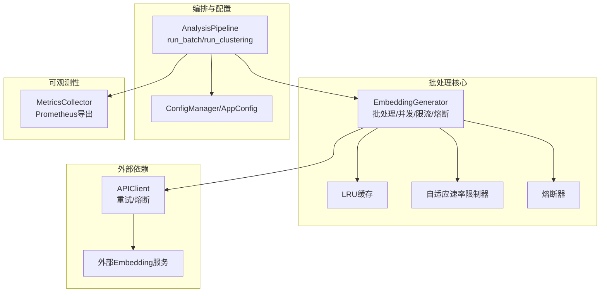
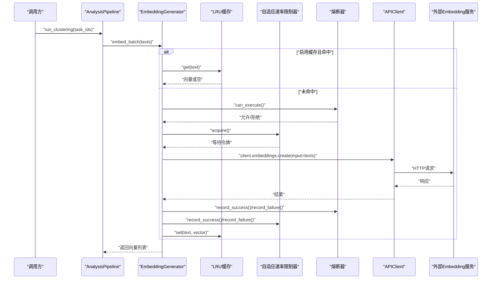
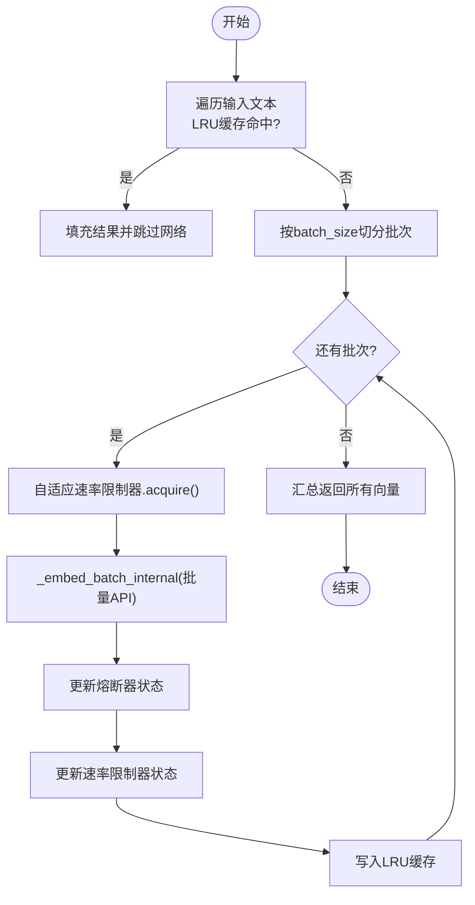
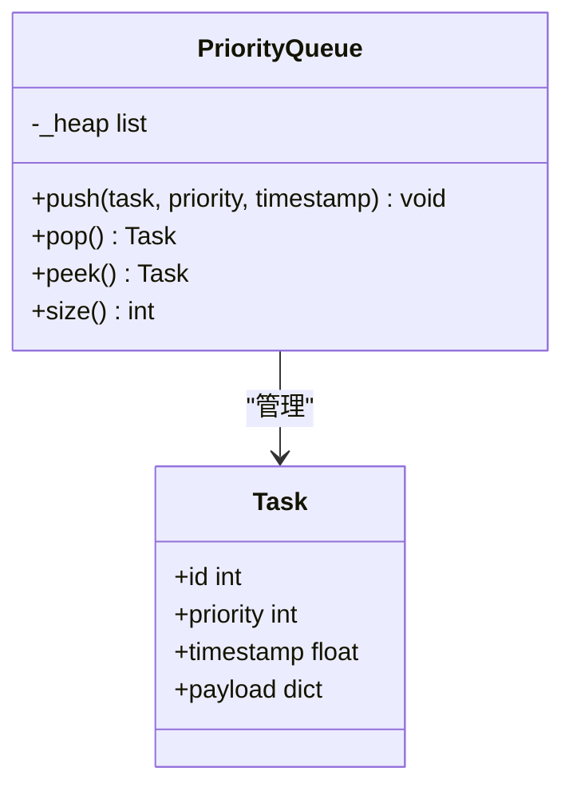
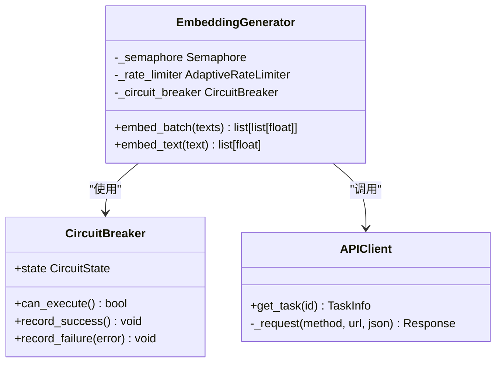
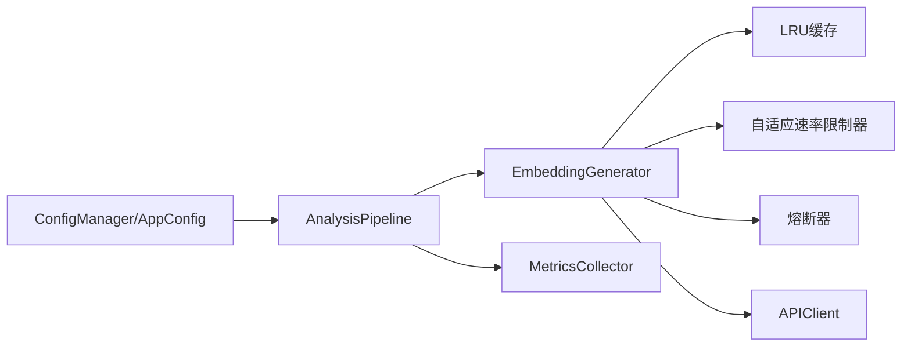

# 请求批处理机制

<cite>
**本文引用的文件**   
- [src/embedding/generator.py](file://src/embedding/generator.py)
- [src/embedding/models.py](file://src/embedding/models.py)
- [src/utils/circuit_breaker.py](file://src/utils/circuit_breaker.py)
- [src/utils/metrics.py](file://src/utils/metrics.py)
- [src/config/manager.py](file://src/config/manager.py)
- [src/config/models.py](file://src/config/models.py)
- [src/analyzer/pipeline.py](file://src/analyzer/pipeline.py)
- [src/api/client.py](file://src/api/client.py)
</cite>

## 目录
1. [简介](#简介)
2. [项目结构](#项目结构)
3. [核心组件](#核心组件)
4. [架构总览](#架构总览)
5. [详细组件分析](#详细组件分析)
6. [依赖关系分析](#依赖关系分析)
7. [性能调优指南](#性能调优指南)
8. [故障排查指南](#故障排查指南)
9. [结论](#结论)
10. [附录](#附录)

## 简介
本技术文档聚焦于LLM请求批处理机制，围绕以下目标展开：
- 批量合并算法：请求聚合策略、时间窗口控制、批次大小优化
- 优先级队列实现：任务优先级排序、动态调整与资源分配（概念性说明）
- 资源调度器：并发控制、负载均衡与故障转移
- 批处理性能调优：最佳实践参数配置与监控指标
- 实际批处理场景示例与基准测试方法

当前代码库实现了以EmbeddingGenerator为核心的异步批处理能力，包含自适应速率限制、熔断保护、LRU缓存与并发控制。Pipeline层提供批量编排入口，并集成配置管理与指标收集。

## 项目结构
与批处理相关的核心模块分布如下：
- 嵌入生成与批处理：src/embedding/generator.py、src/embedding/models.py
- 外部调用容错：src/utils/circuit_breaker.py
- 指标采集：src/utils/metrics.py
- 配置管理：src/config/manager.py、src/config/models.py
- 流水线编排：src/analyzer/pipeline.py
- API客户端重试与熔断：src/api/client.py

图表来源
- [src/embedding/generator.py:91-135](file://src/embedding/generator.py#L91-L135)
- [src/analyzer/pipeline.py:171-226](file://src/analyzer/pipeline.py#L171-L226)
- [src/config/manager.py:183-268](file://src/config/manager.py#L183-L268)
- [src/utils/metrics.py:151-252](file://src/utils/metrics.py#L151-L252)
- [src/api/client.py:147-183](file://src/api/client.py#L147-L183)

章节来源
- [src/embedding/generator.py:91-135](file://src/embedding/generator.py#L91-L135)
- [src/analyzer/pipeline.py:171-226](file://src/analyzer/pipeline.py#L171-L226)
- [src/config/manager.py:183-268](file://src/config/manager.py#L183-L268)
- [src/utils/metrics.py:151-252](file://src/utils/metrics.py#L151-L252)
- [src/api/client.py:147-183](file://src/api/client.py#L147-L183)

## 核心组件
- EmbeddingGenerator：负责文本到向量的批处理，内置LRU缓存、自适应速率限制、熔断器与并发信号量控制；支持本地模型与多厂商API。
- Pipeline：提供单任务与批量任务执行入口，封装数据预处理、嵌入生成、聚类与分析流程。
- CircuitBreaker：对外部API的熔断保护，避免级联失败。
- MetricsCollector：计数器、仪表盘、直方图三类指标，支持Prometheus格式导出。
- ConfigManager/AppConfig：集中式配置加载与环境变量覆盖，含embedding.batch_size等关键参数。

章节来源
- [src/embedding/generator.py:91-135](file://src/embedding/generator.py#L91-L135)
- [src/analyzer/pipeline.py:66-123](file://src/analyzer/pipeline.py#L66-L123)
- [src/utils/circuit_breaker.py:36-149](file://src/utils/circuit_breaker.py#L36-L149)
- [src/utils/metrics.py:151-252](file://src/utils/metrics.py#L151-L252)
- [src/config/manager.py:183-268](file://src/config/manager.py#L183-L268)
- [src/config/models.py:45-58](file://src/config/models.py#L45-L58)

## 架构总览
下图展示从Pipeline发起批处理到EmbeddingGenerator进行并发批处理的端到端流程，包括缓存命中、熔断检查、速率限制与并发控制。

图表来源
- [src/analyzer/pipeline.py:184-226](file://src/analyzer/pipeline.py#L184-L226)
- [src/embedding/generator.py:245-321](file://src/embedding/generator.py#L245-L321)
- [src/utils/circuit_breaker.py:146-149](file://src/utils/circuit_breaker.py#L146-L149)
- [src/utils/metrics.py:190-226](file://src/utils/metrics.py#L190-L226)
- [src/api/client.py:147-183](file://src/api/client.py#L147-L183)

## 详细组件分析

### 批量合并算法：请求聚合、时间窗口与批次大小
- 请求聚合策略
  - 先做缓存去重：对输入文本进行LRU缓存查询，命中直接返回，未命中才进入网络路径。
  - 按batch_size切分：将未命中文本按固定批次大小分段，逐段调用内部批量接口。
- 时间窗口控制
  - 自适应速率限制器根据成功/失败记录动态调整QPS，在请求间隔不足时sleep，确保不超过当前QPS上限。
  - 熔断器在连续失败后阻断请求，并在超时后尝试半开探测恢复。
- 批次大小优化
  - batch_size由配置项embedding.batch_size提供，默认值受Pydantic约束（1~512），建议结合下游服务限制与内存占用调优。
  - 对于特殊模型（如视觉类），采用单条处理路径以避免协议不兼容。

图表来源
- [src/embedding/generator.py:245-321](file://src/embedding/generator.py#L245-L321)
- [src/embedding/generator.py:359-378](file://src/embedding/generator.py#L359-L378)
- [src/embedding/generator.py:54-89](file://src/embedding/generator.py#L54-L89)
- [src/config/models.py:45-58](file://src/config/models.py#L45-L58)

章节来源
- [src/embedding/generator.py:245-321](file://src/embedding/generator.py#L245-L321)
- [src/embedding/generator.py:359-378](file://src/embedding/generator.py#L359-L378)
- [src/embedding/generator.py:54-89](file://src/embedding/generator.py#L54-L89)
- [src/config/models.py:45-58](file://src/config/models.py#L45-L58)

### 优先级队列实现：任务优先级排序、动态调整与资源分配（概念性说明）
当前代码未实现显式的优先级队列。若需引入，建议如下设计：
- 数据结构
  - 使用最小堆（heapq）维护任务优先级，键为(优先级, 入队时间戳, 任务ID)，保证高优先级优先出队。
- 优先级定义
  - 基于业务规则（如SLA等级、任务紧急度、用户VIP等级）计算数值优先级。
- 动态调整
  - 支持运行时提升/降低优先级（延迟降级或提前抢占）。
- 资源分配
  - 与并发信号量配合，按优先级分配可用槽位，避免低优先级任务长期饥饿。

[此图为概念性结构示意，不对应具体源码文件]

### 资源调度器：并发控制、负载均衡与故障转移
- 并发控制
  - 通过asyncio.Semaphore限制同时进行的请求数，防止过载。
- 负载均衡
  - 当前为单点外部服务调用；若扩展多后端，可在上层增加轮询/一致性哈希选择策略。
- 故障转移
  - 熔断器在OPEN状态下阻止请求，HALF_OPEN阶段试探性放行少量请求验证恢复情况。
  - APIClient具备指数退避重试与熔断联动，增强鲁棒性。

图表来源
- [src/embedding/generator.py:133-135](file://src/embedding/generator.py#L133-L135)
- [src/utils/circuit_breaker.py:36-149](file://src/utils/circuit_breaker.py#L36-L149)
- [src/api/client.py:147-183](file://src/api/client.py#L147-L183)

章节来源
- [src/embedding/generator.py:133-135](file://src/embedding/generator.py#L133-L135)
- [src/utils/circuit_breaker.py:36-149](file://src/utils/circuit_breaker.py#L36-L149)
- [src/api/client.py:147-183](file://src/api/client.py#L147-L183)

## 依赖关系分析
- EmbeddingGenerator依赖：
  - LRUCache用于加速重复文本的向量复用
  - AdaptiveRateLimiter用于平滑流量
  - CircuitBreaker用于保护外部服务
  - asyncio.Semaphore用于并发控制
- Pipeline依赖：
  - 通过ConfigManager读取embedding.batch_size等参数
  - 调用EmbeddingGenerator完成嵌入生成
  - 可选接入RulesEngine、ReportGenerator等
- 指标与日志：
  - MetricsCollector提供Prometheus导出
  - 日志通过loguru输出（熔断器内部使用）

图表来源
- [src/config/manager.py:183-268](file://src/config/manager.py#L183-L268)
- [src/analyzer/pipeline.py:268-279](file://src/analyzer/pipeline.py#L268-L279)
- [src/embedding/generator.py:91-135](file://src/embedding/generator.py#L91-L135)
- [src/utils/metrics.py:151-252](file://src/utils/metrics.py#L151-L252)

章节来源
- [src/config/manager.py:183-268](file://src/config/manager.py#L183-L268)
- [src/analyzer/pipeline.py:268-279](file://src/analyzer/pipeline.py#L268-L279)
- [src/embedding/generator.py:91-135](file://src/embedding/generator.py#L91-L135)
- [src/utils/metrics.py:151-252](file://src/utils/metrics.py#L151-L252)

## 性能调优指南
- 批次大小（embedding.batch_size）
  - 范围：1~512（由配置模型约束）
  - 建议：根据下游服务单次最大输入长度与内存占用权衡，通常100~256较为稳健
- 并发度（max_concurrency）
  - 建议：CPU密集型较低，IO密集型较高；结合下游QPS限制设置
- 速率限制
  - 初始QPS、最小/最大QPS、回退与恢复因子可按服务稳定性调优
- 熔断参数
  - failure_threshold、reset_timeout、success_threshold影响快速失败与恢复速度
- 缓存策略
  - LRU容量与TTL需匹配热点文本比例与数据时效要求
- 指标与监控
  - 使用MetricsCollector暴露Prometheus指标，关注：
    - 请求总数、错误率、响应时长分布（直方图）、活跃请求数（仪表盘）
    - 熔断器状态与统计、队列长度（如有）

章节来源
- [src/config/models.py:45-58](file://src/config/models.py#L45-L58)
- [src/embedding/generator.py:54-89](file://src/embedding/generator.py#L54-L89)
- [src/utils/circuit_breaker.py:56-66](file://src/utils/circuit_breaker.py#L56-L66)
- [src/utils/metrics.py:151-252](file://src/utils/metrics.py#L151-L252)

## 故障排查指南
- 常见问题定位
  - 熔断器打开：检查外部服务健康与错误日志，适当提高failure_threshold或延长reset_timeout
  - 速率限制导致延迟：观察current_qps变化，调整initial_qps/max_qps/recovery_factor/backoff_factor
  - 缓存命中率低：增大cache_max_size或缩短cache_ttl，评估文本重复度
  - 并发过高导致超时：降低max_concurrency或增大下游timeout
- 可观测性手段
  - 使用MetricsCollector导出Prometheus指标，结合告警阈值
  - 查看熔断器统计信息，确认状态转换与失败原因
  - 在Pipeline层记录耗时与异常，辅助定位瓶颈

章节来源
- [src/utils/circuit_breaker.py:188-198](file://src/utils/circuit_breaker.py#L188-L198)
- [src/utils/metrics.py:190-226](file://src/utils/metrics.py#L190-L226)
- [src/embedding/generator.py:245-321](file://src/embedding/generator.py#L245-L321)

## 结论
本项目的批处理机制以EmbeddingGenerator为核心，结合LRU缓存、自适应速率限制与熔断器，在保证稳定性的前提下实现高效并发批处理。Pipeline层提供统一编排入口，并通过配置中心灵活调节批处理参数。建议在生产环境结合指标监控与压测持续优化批次大小、并发度与限流参数，以获得更佳的吞吐与时延表现。

## 附录

### 实际批处理场景示例
- 场景一：离线批量嵌入
  - 步骤：读取任务列表 -> 预处理拼接文本 -> 调用Pipeline.run_clustering -> 获取嵌入与聚类结果
  - 关键点：合理设置embedding.batch_size与max_concurrency，开启LRU缓存提升重复文本效率
- 场景二：在线增量嵌入
  - 步骤：新任务到达 -> 检查缓存 -> 未命中则走网络路径 -> 写回缓存
  - 关键点：控制QPS与熔断阈值，避免突发流量打垮下游

章节来源
- [src/analyzer/pipeline.py:184-226](file://src/analyzer/pipeline.py#L184-L226)
- [src/embedding/generator.py:245-321](file://src/embedding/generator.py#L245-L321)

### 性能基准测试方法
- 指标采集
  - 使用MetricsCollector记录：
    - 计数器：总请求数、成功/失败次数
    - 直方图：端到端耗时、各阶段耗时
    - 仪表盘：活跃请求数、队列长度（如有）
- 压测步骤
  - 构造不同规模的输入（小/中/大），逐步增大batch_size与max_concurrency
  - 观察P50/P95/P99延迟与吞吐变化，确定拐点
  - 调整限流与熔断参数，验证稳定性
- 结果解读
  - 当吞吐不再随并发增长而提升，且延迟显著上升时，说明接近系统瓶颈，需降并发或扩容

章节来源
- [src/utils/metrics.py:151-252](file://src/utils/metrics.py#L151-L252)
- [src/embedding/generator.py:91-135](file://src/embedding/generator.py#L91-L135)