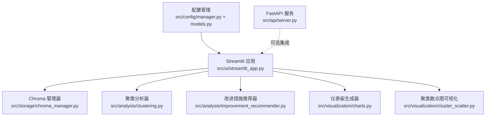
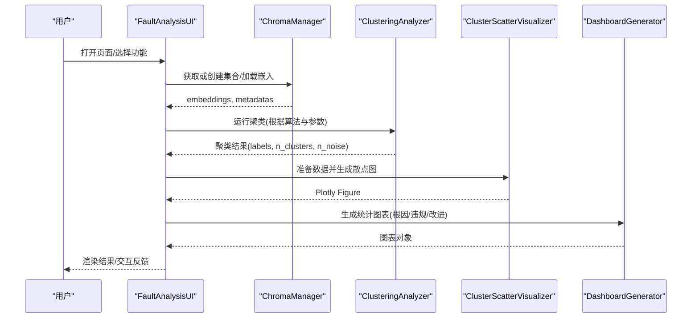
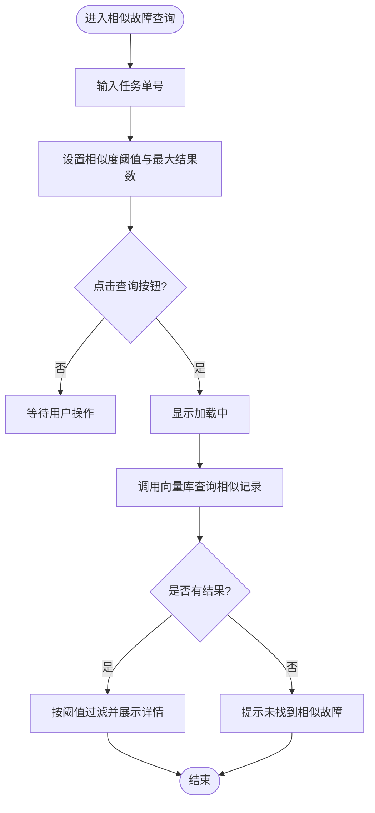
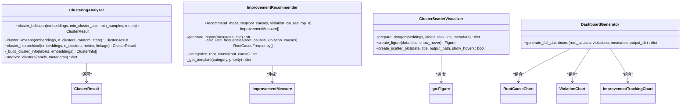
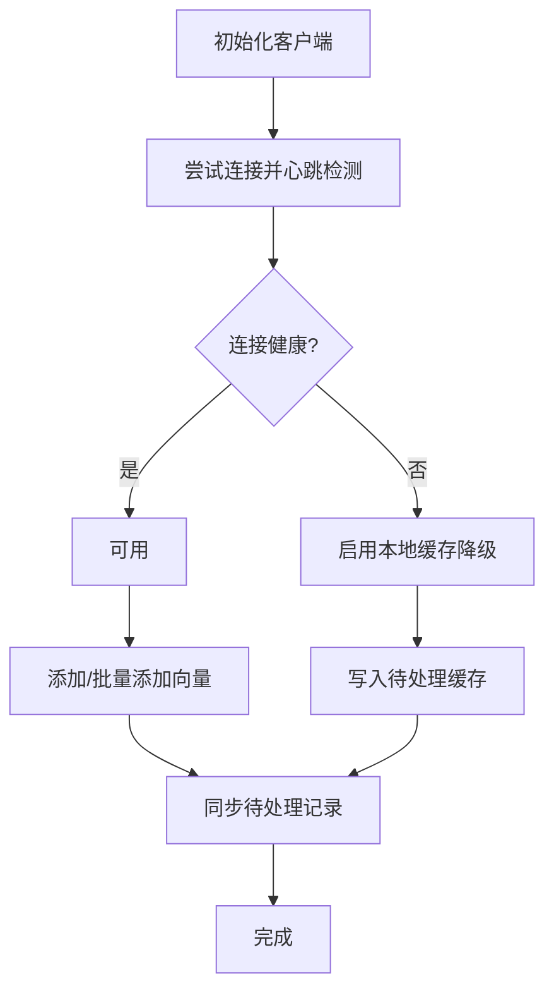
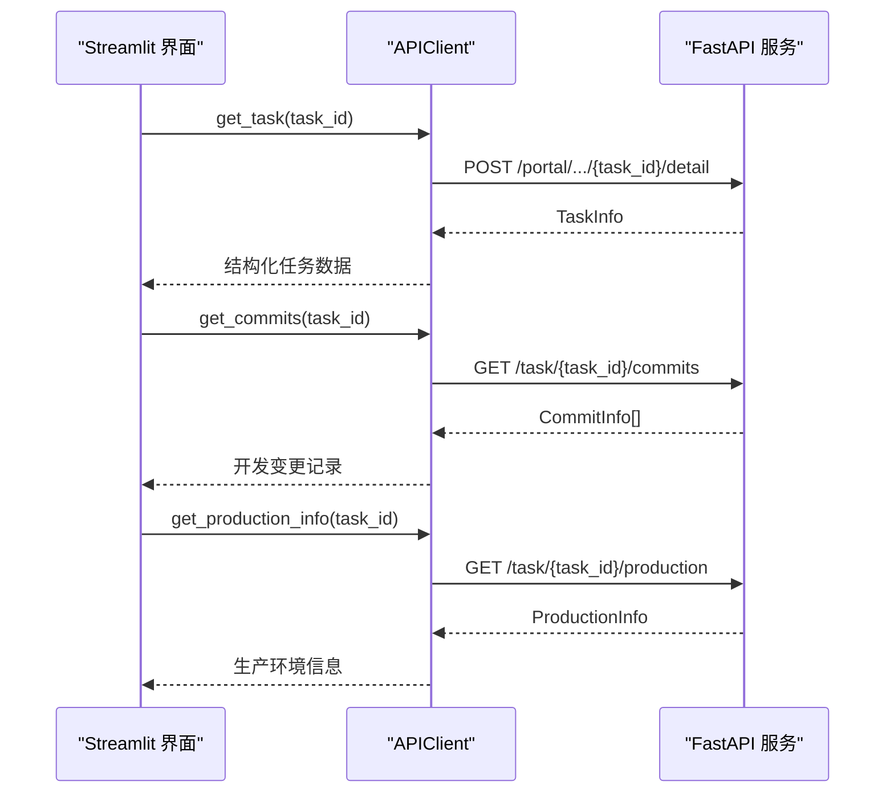
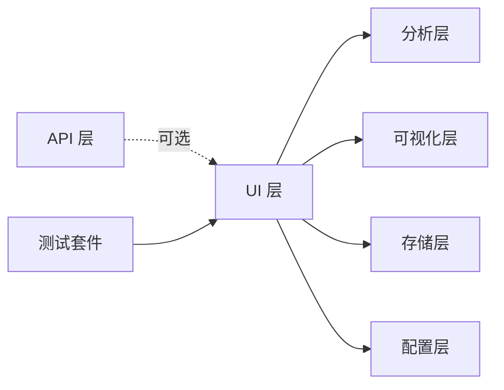

# Web界面

<cite>
**本文引用的文件**   
- [src/ui/streamlit_app.py](file://src/ui/streamlit_app.py)
- [src/visualization/charts.py](file://src/visualization/charts.py)
- [src/visualization/cluster_scatter.py](file://src/visualization/cluster_scatter.py)
- [src/analysis/clustering.py](file://src/analysis/clustering.py)
- [src/analysis/improvement_recommender.py](file://src/analysis/improvement_recommender.py)
- [src/storage/chroma_manager.py](file://src/storage/chroma_manager.py)
- [src/config/manager.py](file://src/config/manager.py)
- [src/config/models.py](file://src/config/models.py)
- [config/config.yaml.example](file://config/config.yaml.example)
- [src/api/server.py](file://src/api/server.py)
- [src/api/client.py](file://src/api/client.py)
- [tests/e2e/ui/test_streamlit.py](file://tests/e2e/ui/test_streamlit.py)
</cite>

## 目录
1. [简介](#简介)
2. [项目结构](#项目结构)
3. [核心组件](#核心组件)
4. [架构总览](#架构总览)
5. [详细组件分析](#详细组件分析)
6. [依赖关系分析](#依赖关系分析)
7. [性能与响应式优化](#性能与响应式优化)
8. [部署与配置](#部署与配置)
9. [故障排查指南](#故障排查指南)
10. [结论](#结论)

## 简介
本技术文档聚焦于基于 Streamlit 构建的交互式 Web 界面模块，系统面向“故障聚类分析”场景，提供数据概览、相似故障查询、聚类分析、可视化图表与改进措施推荐等页面。文档从架构设计、页面布局与交互流程、响应式与用户体验优化、主题与样式定制、后端 API 集成与数据同步机制、部署与性能调优等方面进行全面说明，帮助读者快速理解并扩展该 Web 界面。

## 项目结构
Web 界面位于 src/ui 下，主入口为 streamlit_app.py；可视化能力集中在 visualization 包；数据存储通过 ChromaManager 管理向量数据库；分析与推荐逻辑在 analysis 包中；配置由 config 包统一加载与校验；API 服务由 FastAPI 提供（供外部系统集成）。

图示来源
- [src/ui/streamlit_app.py:1-44](file://src/ui/streamlit_app.py#L1-L44)
- [src/storage/chroma_manager.py:111-136](file://src/storage/chroma_manager.py#L111-L136)
- [src/analysis/clustering.py:22-94](file://src/analysis/clustering.py#L22-L94)
- [src/analysis/improvement_recommender.py:37-118](file://src/analysis/improvement_recommender.py#L37-L118)
- [src/visualization/charts.py:335-342](file://src/visualization/charts.py#L335-L342)
- [src/visualization/cluster_scatter.py:14-31](file://src/visualization/cluster_scatter.py#L14-L31)
- [src/config/manager.py:42-73](file://src/config/manager.py#L42-L73)
- [src/config/models.py:135-144](file://src/config/models.py#L135-L144)
- [src/api/server.py:38-111](file://src/api/server.py#L38-L111)

章节来源
- [src/ui/streamlit_app.py:1-44](file://src/ui/streamlit_app.py#L1-L44)
- [src/config/manager.py:42-73](file://src/config/manager.py#L42-L73)
- [src/config/models.py:135-144](file://src/config/models.py#L135-L144)

## 核心组件
- FaultAnalysisUI：Streamlit 应用主类，负责侧边栏导航、页面路由、状态管理与各功能页面的渲染。
- ChromaManager：封装 ChromaDB 持久化客户端，提供增删改查、批量写入、降级缓存与健康检查。
- ClusteringAnalyzer：实现 HDBSCAN、KMeans、层次聚类算法，输出标签、噪声点统计与簇信息。
- ImprovementRecommender：基于根因频率与模板生成改进措施建议，支持优先级排序与报告导出。
- DashboardGenerator：聚合根因分布、违规类型分布、改进措施追踪等图表生成。
- ClusterScatterVisualizer：使用 UMAP 降维绘制聚类散点图，支持悬停信息与导出。
- ConfigManager/AppConfig：集中管理 YAML/JSON 配置与环境变量覆盖，提供类型校验。

章节来源
- [src/ui/streamlit_app.py:26-38](file://src/ui/streamlit_app.py#L26-L38)
- [src/storage/chroma_manager.py:111-136](file://src/storage/chroma_manager.py#L111-L136)
- [src/analysis/clustering.py:22-94](file://src/analysis/clustering.py#L22-L94)
- [src/analysis/improvement_recommender.py:37-118](file://src/analysis/improvement_recommender.py#L37-L118)
- [src/visualization/charts.py:335-342](file://src/visualization/charts.py#L335-L342)
- [src/visualization/cluster_scatter.py:14-31](file://src/visualization/cluster_scatter.py#L14-L31)
- [src/config/manager.py:42-73](file://src/config/manager.py#L42-L73)
- [src/config/models.py:135-144](file://src/config/models.py#L135-L144)

## 架构总览
Web 界面采用“前端 Streamlit + 本地分析 + 向量数据库”的轻量架构。用户通过浏览器访问 Streamlit 页面，进行数据上传（阶段一准备后）、参数配置与分析执行，结果以表格、图表与可下载报告形式呈现。ChromaManager 作为数据层，提供容错与降级能力；可视化组件基于 Plotly 与 UMAP 完成高维数据的直观展示。

图示来源
- [src/ui/streamlit_app.py:72-86](file://src/ui/streamlit_app.py#L72-L86)
- [src/storage/chroma_manager.py:224-234](file://src/storage/chroma_manager.py#L224-L234)
- [src/analysis/clustering.py:22-94](file://src/analysis/clustering.py#L22-L94)
- [src/visualization/cluster_scatter.py:33-66](file://src/visualization/cluster_scatter.py#L33-L66)
- [src/visualization/charts.py:335-342](file://src/visualization/charts.py#L335-L342)

## 详细组件分析

### 页面与布局设计
- 侧边栏导航：使用 radio 控件提供五个功能页签，包括数据概览、相似故障查询、聚类分析、可视化图表、改进措施。
- 主内容区：根据 session_state 中的 page 值分发到对应渲染方法，实现无刷新切换。
- 数据概览：展示总体指标（故障单总数、违规数、引入阶段数、向量维度），并以表格列出任务单号、引入阶段、是否违规、根因摘要。
- 相似故障查询：输入任务单号与相似度阈值、最大结果数，调用向量库查询并过滤展示。
- 聚类分析：支持 HDBSCAN/KMeans/层次聚类，动态显示参数说明，运行后展示簇数量、噪声点、覆盖率及每个簇的成员列表。
- 可视化图表：依赖聚类结果，使用 UMAP 降维绘制散点图，同时生成根因分布柱状图与违规类型饼图。
- 改进措施：提取根因与违规根因，生成改进措施并按优先级展示，支持 Markdown 报告导出。

章节来源
- [src/ui/streamlit_app.py:40-86](file://src/ui/streamlit_app.py#L40-L86)
- [src/ui/streamlit_app.py:87-141](file://src/ui/streamlit_app.py#L87-L141)
- [src/ui/streamlit_app.py:142-225](file://src/ui/streamlit_app.py#L142-L225)
- [src/ui/streamlit_app.py:226-351](file://src/ui/streamlit_app.py#L226-L351)
- [src/ui/streamlit_app.py:352-431](file://src/ui/streamlit_app.py#L352-L431)
- [src/ui/streamlit_app.py:432-515](file://src/ui/streamlit_app.py#L432-L515)

#### 页面交互流程图（相似故障查询）

图示来源
- [src/ui/streamlit_app.py:142-225](file://src/ui/streamlit_app.py#L142-L225)
- [src/storage/chroma_manager.py:501-532](file://src/storage/chroma_manager.py#L501-L532)

### 数据模型与处理逻辑
- 聚类分析器：对空数据做保护性返回；自动调整参数以适应数据量；计算簇中心与成员索引；输出包含算法与参数的元数据。
- 改进措施推荐器：基于根因频率与分类关键词确定类别与优先级，匹配模板生成措施，支持筛选与报告生成。
- 可视化组件：UMAP 将高维向量降至二维，Plotly 渲染散点图；仪表盘生成器整合多类图表并可保存 HTML。

图示来源
- [src/analysis/clustering.py:22-94](file://src/analysis/clustering.py#L22-L94)
- [src/analysis/clustering.py:228-260](file://src/analysis/clustering.py#L228-L260)
- [src/analysis/improvement_recommender.py:37-118](file://src/analysis/improvement_recommender.py#L37-L118)
- [src/analysis/improvement_recommender.py:265-300](file://src/analysis/improvement_recommender.py#L265-L300)
- [src/visualization/cluster_scatter.py:14-31](file://src/visualization/cluster_scatter.py#L14-L31)
- [src/visualization/cluster_scatter.py:68-149](file://src/visualization/cluster_scatter.py#L68-L149)
- [src/visualization/charts.py:335-342](file://src/visualization/charts.py#L335-L342)

章节来源
- [src/analysis/clustering.py:22-94](file://src/analysis/clustering.py#L22-L94)
- [src/analysis/improvement_recommender.py:37-118](file://src/analysis/improvement_recommender.py#L37-L118)
- [src/visualization/cluster_scatter.py:33-66](file://src/visualization/cluster_scatter.py#L33-L66)
- [src/visualization/charts.py:335-342](file://src/visualization/charts.py#L335-L342)

### 数据层与存储
- ChromaManager 提供连接健康检查、重试与降级缓存（本地 JSONL 文件），支持批量写入与同步待处理记录。
- 查询接口支持文本或向量查询，解析距离并转换为相似度用于前端过滤。
- 统计接口返回集合数量、持久化路径、连接健康状态与待同步记录数。

图示来源
- [src/storage/chroma_manager.py:138-172](file://src/storage/chroma_manager.py#L138-L172)
- [src/storage/chroma_manager.py:236-284](file://src/storage/chroma_manager.py#L236-L284)
- [src/storage/chroma_manager.py:437-482](file://src/storage/chroma_manager.py#L437-L482)
- [src/storage/chroma_manager.py:501-532](file://src/storage/chroma_manager.py#L501-L532)

章节来源
- [src/storage/chroma_manager.py:111-136](file://src/storage/chroma_manager.py#L111-L136)
- [src/storage/chroma_manager.py:236-284](file://src/storage/chroma_manager.py#L236-L284)
- [src/storage/chroma_manager.py:437-482](file://src/storage/chroma_manager.py#L437-L482)

### 配置管理
- ConfigManager 支持 YAML/JSON 配置文件加载、合并、保存与验证；AppConfig 使用 Pydantic 进行字段校验。
- 环境变量覆盖映射允许运行时动态调整 API、LLM、Embedding、聚类、缓存、规则、输出与日志等配置项。
- 示例配置文件提供默认值参考。

章节来源
- [src/config/manager.py:42-73](file://src/config/manager.py#L42-L73)
- [src/config/manager.py:191-243](file://src/config/manager.py#L191-L243)
- [src/config/models.py:135-144](file://src/config/models.py#L135-L144)
- [config/config.yaml.example:1-38](file://config/config.yaml.example#L1-L38)

### 后端 API 集成与数据同步
- FastAPI 服务提供健康检查、分析、聚类、报告与反馈等路由，支持 CORS、认证与速率限制中间件。
- APIClient 封装异步 HTTP 请求，内置断路器、重试与错误分类（认证失败、未找到、限流、服务器错误等），并提供任务详情、提交记录与生产环境信息等接口。
- 当前 Streamlit 界面主要依赖本地向量库与分析模块；如需与外部系统对接，可通过 APIClient 拉取任务数据并写入 ChromaManager。

图示来源
- [src/api/server.py:38-111](file://src/api/server.py#L38-L111)
- [src/api/client.py:163-231](file://src/api/client.py#L163-L231)
- [src/api/client.py:232-244](file://src/api/client.py#L232-L244)

章节来源
- [src/api/server.py:38-111](file://src/api/server.py#L38-L111)
- [src/api/client.py:25-98](file://src/api/client.py#L25-L98)
- [src/api/client.py:99-161](file://src/api/client.py#L99-L161)

## 依赖关系分析
- UI 层依赖分析器、可视化与存储层，不直接耦合外部 API（可扩展）。
- 可视化层依赖 Plotly 与 UMAP，用于降维与图表渲染。
- 配置层独立且被 UI 与分析模块共享，确保一致性与可维护性。
- 测试套件提供 E2E 与单元测试，保障 UI 行为稳定。

图示来源
- [architecture.yaml:100-103](file://architecture.yaml#L100-L103)
- [tests/e2e/ui/test_streamlit.py:16-49](file://tests/e2e/ui/test_streamlit.py#L16-L49)

章节来源
- [architecture.yaml:100-103](file://architecture.yaml#L100-L103)
- [tests/e2e/ui/test_streamlit.py:16-49](file://tests/e2e/ui/test_streamlit.py#L16-L49)

## 性能与响应式优化
- 加载状态与进度反馈：在耗时操作（如查询、聚类、图表生成）中使用 spinner 提示，避免用户感知卡顿。
- 错误处理与健壮性：关键路径包裹 try-except，捕获异常并给出友好提示，同时记录日志便于定位问题。
- 数据加载优化：优先从向量库批量读取 embeddings 与 metadatas，减少多次往返；必要时结合缓存策略。
- 可视化性能：控制散点图点数与悬停信息复杂度，必要时限制 Top N 展示；图表尺寸合理设置以提升渲染速度。
- 降级与容错：ChromaManager 在连接失败时回退至本地缓存，保证基本可用性；同步机制在恢复后补写数据。

[本节为通用指导，无需特定文件引用]

## 部署与配置
- 启动方式：通过命令行运行 Streamlit 应用，指定端口与 headless 模式（测试脚本展示了标准启动参数）。
- 配置管理：使用 YAML 配置文件与环境变量覆盖，支持 API、LLM、Embedding、聚类、缓存、规则、输出与日志等配置项。
- 向量数据库：ChromaManager 默认持久化到 data/chroma 目录，支持重置与统计；可在容器化环境中挂载卷以保证数据持久化。
- API 服务：FastAPI 服务默认监听 0.0.0.0:8000，可通过环境变量调整主机、端口、令牌与速率限制。

章节来源
- [tests/e2e/ui/test_streamlit.py:24-49](file://tests/e2e/ui/test_streamlit.py#L24-L49)
- [src/config/manager.py:191-243](file://src/config/manager.py#L191-L243)
- [config/config.yaml.example:1-38](file://config/config.yaml.example#L1-L38)
- [src/storage/chroma_manager.py:138-172](file://src/storage/chroma_manager.py#L138-L172)
- [src/api/server.py:114-151](file://src/api/server.py#L114-L151)

## 故障排查指南
- 向量数据库连接失败：检查持久化目录权限与磁盘空间；查看健康状态与待同步记录数；必要时重置数据库。
- 查询结果为空：确认已运行阶段一数据准备并成功写入向量库；核对任务单号是否存在；调整相似度阈值。
- 聚类分析失败：检查数据维度与样本量；适当调整算法参数（最小簇大小、最小样本数、簇数量）；查看日志定位异常。
- 图表渲染异常：确认 Plotly 与 UMAP 依赖安装正确；检查输入数据长度一致性；降低数据规模或关闭悬停信息。
- API 调用错误：检查网络连通性与认证令牌；关注限流与服务器错误；利用断路器与重试机制提升稳定性。

章节来源
- [src/storage/chroma_manager.py:658-687](file://src/storage/chroma_manager.py#L658-L687)
- [src/ui/streamlit_app.py:138-141](file://src/ui/streamlit_app.py#L138-L141)
- [src/ui/streamlit_app.py:348-351](file://src/ui/streamlit_app.py#L348-L351)
- [src/api/client.py:99-161](file://src/api/client.py#L99-L161)

## 结论
该 Web 界面以 Streamlit 为核心，结合本地分析、向量数据库与可视化组件，提供了完整的故障聚类分析工作流。其模块化设计与容错机制确保了良好的用户体验与系统稳定性。通过合理的配置管理与部署策略，可在不同环境中快速上线与扩展。后续可进一步增强主题与样式定制能力，完善与后端 API 的数据同步与实时反馈机制，以满足更复杂的业务需求。