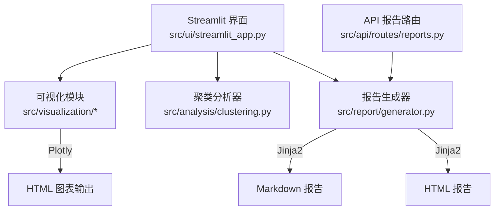
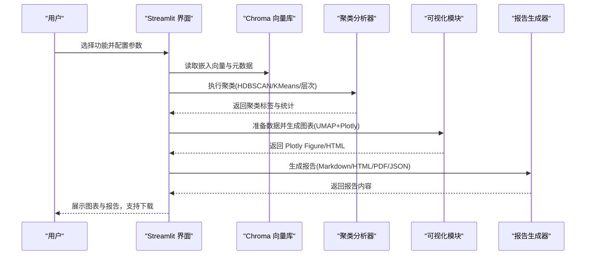
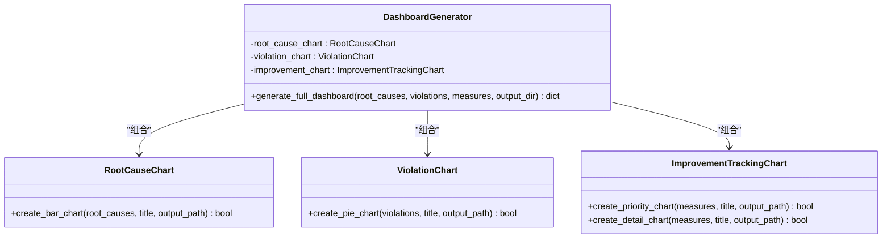
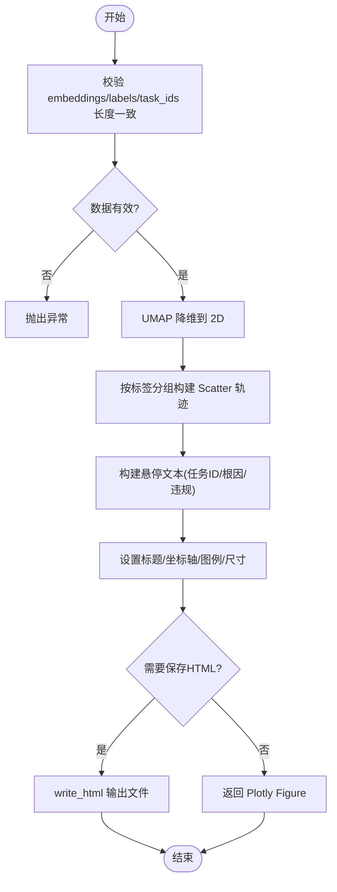
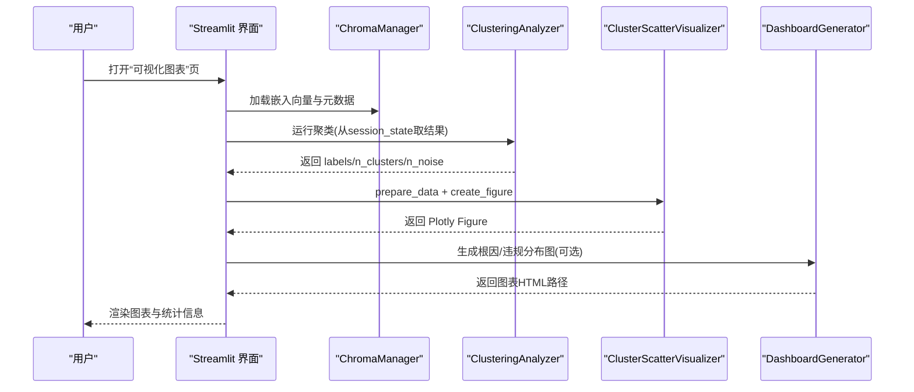
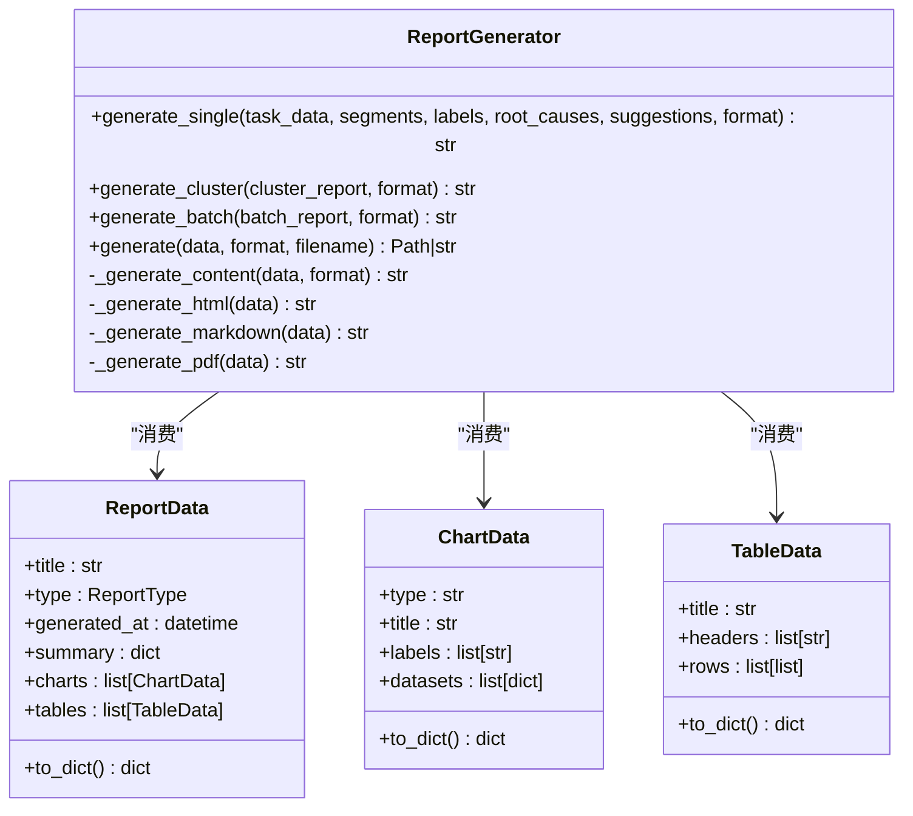
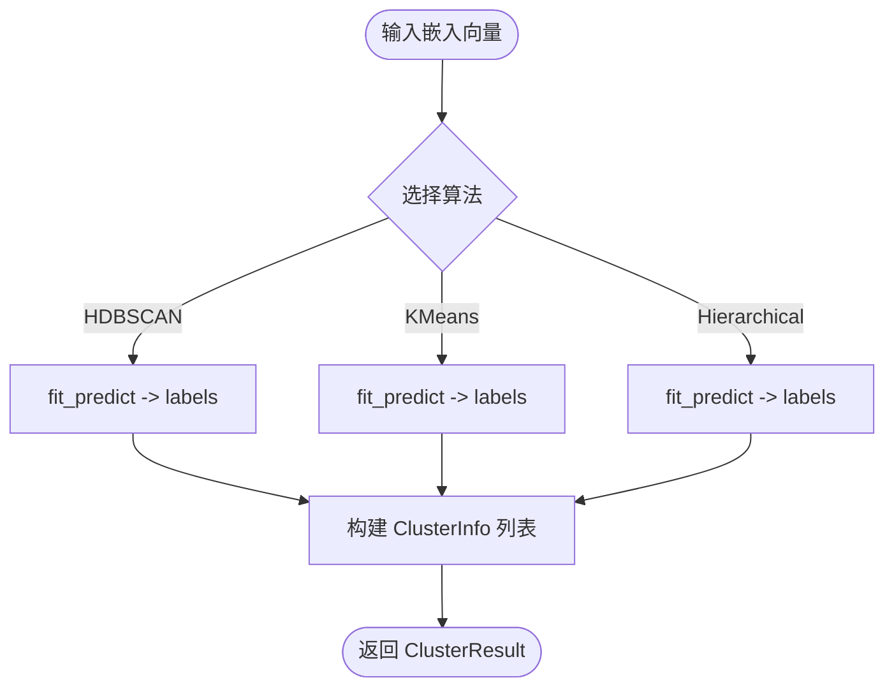
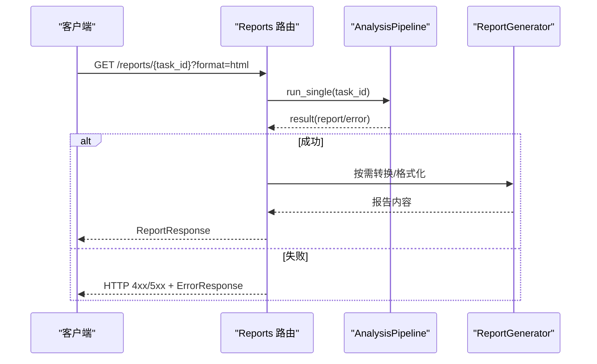
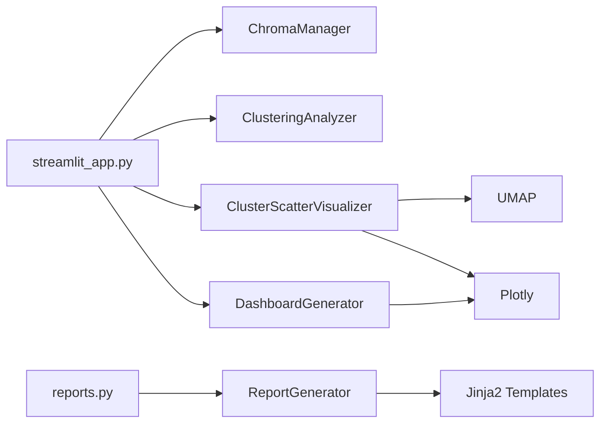

# 可视化系统

<cite>
**本文引用的文件**   
- [src/visualization/charts.py](file://src/visualization/charts.py)
- [src/visualization/cluster_scatter.py](file://src/visualization/cluster_scatter.py)
- [src/ui/streamlit_app.py](file://src/ui/streamlit_app.py)
- [src/report/generator.py](file://src/report/generator.py)
- [src/report/templates/single.md.j2](file://src/report/templates/single.md.j2)
- [src/report/templates/cluster.md.j2](file://src/report/templates/cluster.md.j2)
- [src/report/templates/batch.md.j2](file://src/report/templates/batch.md.j2)
- [src/analysis/clustering.py](file://src/analysis/clustering.py)
- [src/api/routes/reports.py](file://src/api/routes/reports.py)
- [README.md](file://README.md)
</cite>

## 目录
1. [简介](#简介)
2. [项目结构](#项目结构)
3. [核心组件](#核心组件)
4. [架构总览](#架构总览)
5. [详细组件分析](#详细组件分析)
6. [依赖关系分析](#依赖关系分析)
7. [性能与大数据处理](#性能与大数据处理)
8. [导出与分享机制](#导出与分享机制)
9. [主题与样式定制](#主题与样式定制)
10. [最佳实践](#最佳实践)
11. [故障排查指南](#故障排查指南)
12. [结论](#结论)

## 简介
本技术文档面向“可视化系统”，聚焦以下目标：
- 图表生成模块：聚类散点图、趋势分析与统计图表的创建方法
- 交互式 Web 界面：基于 Streamlit 的用户界面设计与用户体验优化
- 报告生成系统：HTML、Markdown 等模板引擎与样式定制
- 数据可视化最佳实践：颜色方案、布局设计、响应式适配
- 自定义图表开发与主题切换
- 性能优化技巧与大数据量处理策略
- 导出功能与分享机制

## 项目结构
可视化相关代码主要分布在如下模块：
- 可视化图表生成：src/visualization
- 交互式界面：src/ui
- 报告生成与模板：src/report
- 聚类分析（为可视化提供输入）：src/analysis
- API 报告路由（对外提供报告获取能力）：src/api/routes

图示来源
- [src/ui/streamlit_app.py:1-120](file://src/ui/streamlit_app.py#L1-L120)
- [src/visualization/charts.py:1-120](file://src/visualization/charts.py#L1-L120)
- [src/visualization/cluster_scatter.py:1-120](file://src/visualization/cluster_scatter.py#L1-L120)
- [src/report/generator.py:220-320](file://src/report/generator.py#L220-L320)
- [src/analysis/clustering.py:1-120](file://src/analysis/clustering.py#L1-L120)
- [src/api/routes/reports.py:1-80](file://src/api/routes/reports.py#L1-L80)

章节来源
- [README.md:1-101](file://README.md#L1-L101)

## 核心组件
- 可视化图表生成器
  - 根因分布柱状图、违规类型饼图、改进措施优先级与详情图
  - 仪表板聚合生成器，统一输出多个 HTML 图表
- 聚类散点图可视化器
  - 使用 UMAP 将高维嵌入向量降维到二维，按聚类标签绘制交互式散点图
- 交互式 Web 界面（Streamlit）
  - 数据概览、相似故障查询、聚类分析、可视化图表、改进措施五大页面
  - 集成向量数据库、聚类分析器、可视化器与报告生成器
- 报告生成系统
  - 支持 Markdown、HTML、PDF（HTML 包装）、JSON 多种格式
  - 内置 Jinja2 模板与默认模板，支持自定义模板目录

章节来源
- [src/visualization/charts.py:1-399](file://src/visualization/charts.py#L1-L399)
- [src/visualization/cluster_scatter.py:1-234](file://src/visualization/cluster_scatter.py#L1-L234)
- [src/ui/streamlit_app.py:1-548](file://src/ui/streamlit_app.py#L1-L548)
- [src/report/generator.py:1-790](file://src/report/generator.py#L1-L790)

## 架构总览
系统以 Streamlit 作为交互入口，串联数据加载、聚类分析、可视化渲染与报告生成。API 层提供报告获取接口，便于外部系统集成或自动化流程调用。

图示来源
- [src/ui/streamlit_app.py:226-430](file://src/ui/streamlit_app.py#L226-L430)
- [src/analysis/clustering.py:22-120](file://src/analysis/clustering.py#L22-L120)
- [src/visualization/cluster_scatter.py:33-149](file://src/visualization/cluster_scatter.py#L33-L149)
- [src/report/generator.py:250-394](file://src/report/generator.py#L250-L394)

## 详细组件分析

### 可视化图表生成器
职责与能力
- RootCauseChart：根因分布柱状图，按数量降序排序，显示占比
- ViolationChart：违规类型饼图，带悬停信息与图例
- ImprovementTrackingChart：改进措施优先级分布与详情横向柱状图
- DashboardGenerator：整合上述图表，批量生成 HTML 文件

关键实现要点
- 所有图表均使用 Plotly 构建，支持 write_html 持久化
- 统一的错误处理与日志记录，失败时返回布尔状态
- 通过 DashboardGenerator 统一输出路径与结果字典

图示来源
- [src/visualization/charts.py:15-399](file://src/visualization/charts.py#L15-L399)

章节来源
- [src/visualization/charts.py:1-399](file://src/visualization/charts.py#L1-L399)

### 聚类散点图可视化器
职责与能力
- 使用 UMAP 进行降维，将高维嵌入向量映射到二维空间
- 按聚类标签分组着色，噪声点(-1)特殊标记
- 支持悬停文本，包含任务单号、根因片段、是否违规等元信息
- 提供 create_figure 直接返回 Plotly Figure，供 Streamlit 渲染；也支持保存 HTML

关键流程
- prepare_data：校验输入长度一致性，执行 fit_transform，返回结构化数据
- create_figure：按唯一标签循环添加 Scatter trace，设置布局与图例
- create_scatter_plot：封装 create_figure 并写入 HTML

图示来源
- [src/visualization/cluster_scatter.py:33-183](file://src/visualization/cluster_scatter.py#L33-L183)

章节来源
- [src/visualization/cluster_scatter.py:1-234](file://src/visualization/cluster_scatter.py#L1-L234)

### 交互式 Web 界面（Streamlit）
页面与功能
- 数据概览：统计指标与表格展示
- 相似故障查询：基于 Chroma 相似度检索，阈值过滤与展开详情
- 聚类分析：HDBSCAN/K-Means/层次聚类，参数调节与结果展示
- 可视化图表：UMAP 散点图、根因分布、违规类型分布
- 改进措施：推荐措施列表、优先级统计、导出 Markdown 报告

用户体验优化
- 侧边栏导航与状态提示
- 使用 st.columns 与 st.expander 组织信息密度
- 使用 spinner 与 error/warning 反馈提升交互体验
- 通过 session_state 在页面间传递中间结果

图示来源
- [src/ui/streamlit_app.py:352-430](file://src/ui/streamlit_app.py#L352-L430)
- [src/visualization/cluster_scatter.py:68-149](file://src/visualization/cluster_scatter.py#L68-L149)
- [src/visualization/charts.py:335-399](file://src/visualization/charts.py#L335-L399)

章节来源
- [src/ui/streamlit_app.py:1-548](file://src/ui/streamlit_app.py#L1-L548)

### 报告生成系统
能力与特性
- 支持 ReportType 与 ReportFormat 枚举，覆盖摘要、详细、聚类、根因、趋势等类型
- 支持 Markdown、HTML、PDF（HTML 包装）、JSON 输出
- 内置 Jinja2 模板（single.md.j2、cluster.md.j2、batch.md.j2），并提供默认模板回退
- 提供 generate_single/generate_cluster/generate_batch/generate 等方法，统一数据验证与内容生成

模板与样式
- 模板位于 src/report/templates，可按需替换或扩展
- HTML 模板内嵌基础 CSS，便于快速预览与打印

图示来源
- [src/report/generator.py:32-89](file://src/report/generator.py#L32-L89)
- [src/report/generator.py:222-447](file://src/report/generator.py#L222-L447)

章节来源
- [src/report/generator.py:1-790](file://src/report/generator.py#L1-L790)
- [src/report/templates/single.md.j2:1-58](file://src/report/templates/single.md.j2#L1-L58)
- [src/report/templates/cluster.md.j2:1-36](file://src/report/templates/cluster.md.j2#L1-L36)
- [src/report/templates/batch.md.j2:1-31](file://src/report/templates/batch.md.j2#L1-L31)

### 聚类分析（为可视化提供输入）
算法支持
- HDBSCAN：适合发现任意形状簇，自动识别噪声点
- K-Means：适用于球形簇，指定簇数量
- 层次聚类：AgglomerativeClustering，支持不同距离度量与连接方式

输出结构
- ClusterResult：包含 labels、n_clusters、n_noise、clusters、metadata
- analyze_clusters：对每个簇统计常见根因与任务 ID 列表

图示来源
- [src/analysis/clustering.py:22-226](file://src/analysis/clustering.py#L22-L226)

章节来源
- [src/analysis/clustering.py:1-316](file://src/analysis/clustering.py#L1-L316)

### API 报告路由
能力
- GET /reports/{task_id}：根据 task_id 获取分析报告，支持 html/markdown/json 格式
- 内部通过 AnalysisPipeline 执行分析并生成报告，返回 ReportResponse

错误处理
- 无效格式、任务不存在、生成失败等场景返回对应 HTTP 状态码与错误体

图示来源
- [src/api/routes/reports.py:16-130](file://src/api/routes/reports.py#L16-L130)

章节来源
- [src/api/routes/reports.py:1-130](file://src/api/routes/reports.py#L1-L130)

## 依赖关系分析
- Streamlit 界面依赖：
  - ChromaManager（向量数据库）
  - ClusteringAnalyzer（聚类算法）
  - ClusterScatterVisualizer（UMAP+Plotly）
  - DashboardGenerator（统计图表）
- 报告生成器依赖：
  - Jinja2 模板环境（可自定义模板目录）
  - ReportData/ChartData/TableData 数据结构
- 可视化模块依赖：
  - Plotly（图形渲染）
  - UMAP（降维）
  - NumPy（数组操作）

图示来源
- [src/ui/streamlit_app.py:1-120](file://src/ui/streamlit_app.py#L1-L120)
- [src/visualization/cluster_scatter.py:1-40](file://src/visualization/cluster_scatter.py#L1-L40)
- [src/report/generator.py:222-248](file://src/report/generator.py#L222-L248)

章节来源
- [src/ui/streamlit_app.py:1-120](file://src/ui/streamlit_app.py#L1-L120)
- [src/visualization/cluster_scatter.py:1-40](file://src/visualization/cluster_scatter.py#L1-L40)
- [src/report/generator.py:222-248](file://src/report/generator.py#L222-L248)

## 性能与大数据处理
- 降维与渲染
  - UMAP 在高维数据上计算开销较大，建议控制 n_neighbors/min_dist 参数，必要时减少样本量或使用采样
  - Plotly 渲染大量散点可能影响前端性能，可通过限制点数、关闭 hover、降低 marker size/opacity 优化
- 内存与 I/O
  - 避免一次性加载超大向量集，采用分页或分批处理
  - 图表保存为 HTML 时注意磁盘空间与并发写入
- 缓存与复用
  - 利用 session_state 缓存聚类结果，避免重复计算
  - 报告生成可使用缓存开关（API 层已支持 use_cache）
- 并行与异步
  - 对于批量报告生成，可在上层引入任务队列或异步执行，避免阻塞主线程

[本节为通用指导，不直接分析具体文件]

## 导出与分享机制
- 图表导出
  - DashboardGenerator 与 ClusterScatterVisualizer 均支持 write_html 输出，便于本地查看与分享
- 报告导出
  - Streamlit 改进措施页面提供下载按钮，导出 Markdown 报告
  - API 层支持获取 HTML/Markdown/JSON 格式报告，便于系统集成与自动化分发
- 分享建议
  - 将生成的 HTML 图表与 Markdown 报告打包归档
  - 结合对象存储或共享目录进行团队分发

章节来源
- [src/visualization/charts.py:335-399](file://src/visualization/charts.py#L335-L399)
- [src/visualization/cluster_scatter.py:151-183](file://src/visualization/cluster_scatter.py#L151-L183)
- [src/ui/streamlit_app.py:501-514](file://src/ui/streamlit_app.py#L501-L514)
- [src/api/routes/reports.py:16-130](file://src/api/routes/reports.py#L16-L130)

## 主题与样式定制
- 图表主题
  - 使用 Plotly 内置模板（如 plotly_white），也可在 update_layout 中自定义字体、尺寸、图例位置
  - 颜色方案：聚类散点图使用预定义色板，超过数量时回退到 qualitative.Bold
- 报告样式
  - HTML 模板内嵌基础 CSS，可替换为更丰富的样式表
  - 自定义模板目录：初始化 ReportGenerator 时传入 template_dir，优先加载 .j2 模板
- 界面主题
  - Streamlit 通过 st.set_page_config 配置页面标题、图标、布局与侧边栏初始状态

章节来源
- [src/visualization/cluster_scatter.py:185-205](file://src/visualization/cluster_scatter.py#L185-L205)
- [src/report/generator.py:222-248](file://src/report/generator.py#L222-L248)
- [src/ui/streamlit_app.py:17-23](file://src/ui/streamlit_app.py#L17-L23)

## 最佳实践
- 颜色方案
  - 使用对比度良好的色板，区分噪声点与正常聚类
  - 保持颜色语义一致（如高/中/低优先级固定配色）
- 布局设计
  - 合理划分列与面板，避免信息过载
  - 使用标题、分隔线与子标题增强可读性
- 响应式适配
  - 使用 st.plotly_chart 的 use_container_width 自适应宽度
  - 图表尺寸根据数据量动态调整高度
- 交互体验
  - 提供清晰的帮助文本与占位符
  - 使用 spinner 与进度提示提升感知性能
- 数据质量
  - 严格校验输入维度与长度一致性
  - 对缺失字段做容错处理（如根因为空时使用“未知”）

[本节为通用指导，不直接分析具体文件]

## 故障排查指南
- 向量数据库连接失败
  - 检查集合是否存在与权限，确认连接参数
- 聚类分析失败
  - 调整算法参数（最小簇大小、样本数、簇数量）
  - 检查数据维度与空值情况
- 散点图生成失败
  - 确认 embeddings/labels/task_ids 长度一致
  - 检查 UMAP 安装与环境依赖
- 报告生成失败
  - 验证模板目录与模板名称
  - 检查 ReportData 必填字段与类型

章节来源
- [src/ui/streamlit_app.py:60-71](file://src/ui/streamlit_app.py#L60-L71)
- [src/visualization/cluster_scatter.py:51-56](file://src/visualization/cluster_scatter.py#L51-L56)
- [src/report/generator.py:718-737](file://src/report/generator.py#L718-L737)

## 结论
本可视化系统以 Streamlit 为交互入口，结合 UMAP 降维与 Plotly 渲染，提供了完整的聚类散点图与统计图表能力；同时通过 Jinja2 模板引擎实现了多格式报告生成。系统在可扩展性、用户体验与工程化方面具备良好基础，后续可在性能优化、主题定制与自动化导出方面持续完善。
